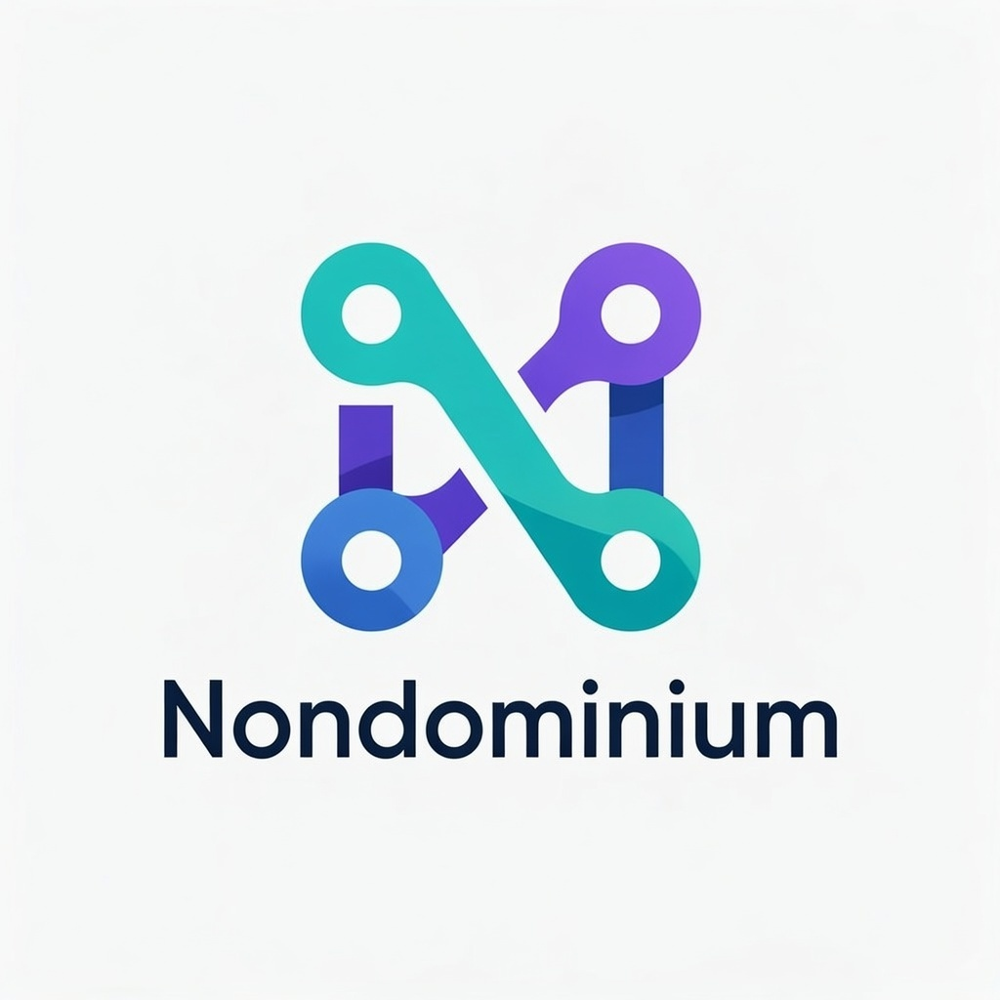

# Nondominium

[](https://deepwiki.com/Sensorica/nondominium)

<div align="center">
  
</div>

A **ValueFlows-compliant resource sharing Holochain application** implementing distributed, agent-centric resource management with embedded governance.

## Executive Summary

**nondominium** is a foundational infrastructure project aimed at enabling a new class of Resources that are _organization-agnostic_, _uncapturable_, and _natively collaborative_. These Resources are governed not by platforms or centralized authorities, but through embedded rules, transparent peer validation, and a comprehensive reputation system.

The project's central goal is to support a **_peer sharing economy_**, overcoming the structural flaws of centralized platforms (centralization of power, censorship, unsuitable regulations).

Built on the Holochain framework and using the ValueFlows standard, nondominium allows any Agent to interact with these Resources in a permissionless but accountable environment, with automatic reputation tracking through Private Participation Receipts (PPRs).

## Project Links

- [Nondominium on Sensorica](https://www.sensorica.co/ventures/infrastructure/nondominium) — Official project page on the Sensorica website
- [Log your contribution](https://docs.google.com/forms/d/e/1FAIpQLSeW4OigEN72aioByDVPw4ONBWjmmTo5UFD6B4fpYqBHtYNxdQ/viewform) — OVN contribution form

## Overview

Nondominium is a multi-DNA Holochain hApp that enables decentralized resource sharing through:

- **Agent identity management** with role-based access control
- **Resource lifecycle tracking** following ValueFlows standards
- **Embedded governance** for access and transfer rules
- **Capability-based security** using Holochain's native features
- **A fractal Lobby → Group → NDO holarchy** of DHT networks

### Architecture

**Multi-DNA topology:**

- **Nondominium DNA** (provisioned, shared): the 3-zome core described below
- **Lobby DNA** (provisioned, fixed network seed): permissionless entry point — agent presence (`LobbyAgentProfile`) and the global group registry (`GroupAnnouncement`)
- **Group DNA** (cloned cell per group, `deferred: true`): per-group coordination with network isolation — `GroupProfile`, `GroupMembership`, `WorkLog`, `SoftLink`
- **NDO DNA** (cloned cell per NDO, `deferred: true`): one DHT network per Nondominium Object, bundling the existing resource and governance zomes; the clone's DNA hash is the NDO's permanent identity (issue #112)
- **hREA DNA** (vendored): canonical ValueFlows event recording via the hREA bridge

**Governance-as-Operator Design (Nondominium DNA core):**

nondominium implements a modular governance-as-operator architecture that separates data management from business logic enforcement:

- **`zome_person`**: Agent identity, profiles, roles, and capability-based access control
- **`zome_resource`**: Pure data model for resource specifications and lifecycle management (state only)
- **`zome_gouvernance`**: State transition operator that evaluates governance rules and validates changes

**Key Architecture Benefits:**

- **Modularity**: Governance rules can be modified without changing resource data structures
- **Swappability**: Different governance schemes can be applied to the same resource types
- **Testability**: Governance logic can be unit tested independently of data management
- **Separation of Concerns**: Clear boundaries between data persistence and business rule enforcement

**Technology Stack:** see [Technology Stack](#technology-stack) below.

**Documentation map:** See [documentation/README.md](documentation/README.md). Post-MVP **NDO** model and optional **Unyt** / **Flowsta** integrations are specified in [documentation/requirements/ndo_prima_materia.md](documentation/requirements/ndo_prima_materia.md) and the stubs under [documentation/requirements/post-mvp/](documentation/requirements/post-mvp/).

## AI Tooling

Nondominium supports Claude Code, Cursor, VS Code Copilot, and any
[Open Agent Skill](https://agentskills.io)-compatible editor out of the box.
All AI assets are generated automatically when you run `nix develop`.

**Skills** (Open Agent Skill format — progressively disclosed on activation):
- `holochain` — Holochain HDK patterns, architecture, testing, TypeScript client
- `nondominium-domain` — NDO three-layer model, PPR system, capability slots, ValueFlows alignment

Skills are materialized from `.claude/skills/` into `.agents/skills/` (the editor-agnostic
primary discovery path) on every `nix develop`. `.agents/` is gitignored.

**Cursor rules** (always-loaded project context, generated from `pai/`):
| Rule | Scope | Content |
|---|---|---|
| `00-telos` | always | Project TELOS — vision, philosophy, AI operating principles |
| `10-conventions` | always | Branch model, commits, Rust/TS/Svelte conventions |
| `20-architecture` | always | Three-zome structure, NDO layers, lifecycle state machine |
| `30-rust-zomes` | `**/*.rs` | HDK entry patterns, cross-zome calls, validation |
| `40-svelte-ui` | `**/*.svelte` | Svelte 5 runes, UnoCSS, Effect-TS patterns |
| `50-tests` | `dnas/**/tests/**/*.rs` | Sweettest setup, multi-agent DHT sync |

**Source files** (edit these; tools update on next `nix develop`):
- `documentation/TELOS.md` — Project purpose and operating principles
- `pai/conventions.md` — Coding and process conventions
- `pai/cursor-rules/` — Architecture, Rust, Svelte, test patterns
- `.claude/skills/nondominium-domain/` — Claude Code skill (no rebuild needed)

## Environment Setup

> **PREREQUISITE**: Set up the [Holochain development environment](https://developer.holochain.org/docs/install/).

Run this in the root folder of the repository:

```bash
git submodule update --init --recursive  # Initialize the hREA submodule (REQUIRED)
nix develop                              # Enter reproducible environment (REQUIRED)
bun install                              # Install all dependencies
```

The `hrea` role is vendored as a git submodule at `vendor/hrea`; `bun run build:happ` builds
and packs it, so the build fails without this step.

**⚠️ Run all commands from within the nix shell, otherwise they won't work.**

## Development Workflow

### Quick Start

```bash
bun run start           # Start 2-agent development network with UIs
```

This creates a network of 2 nodes with their respective UIs and the Holochain Playground for conductor introspection.

### Custom Network

```bash
AGENTS=3 bun run network    # Bootstrap custom agent network (replace 3 with desired count)
```

### Testing

```bash
bun run sweettest         # build:happ + all nondominium Sweettest tests
bun run sweettest:verbose # same, with --nocapture
bun run sweettest:only    # skip the build step

bun run e2e               # Playwright E2E against real conductors
bun run e2e:ui            # Playwright UI mode
```

Full reference for every suite (nondominium / group / lobby Sweettest, E2E, legacy Tryorama):
[documentation/TEST_COMMANDS.md](documentation/TEST_COMMANDS.md).

> **Note**: Tryorama (TypeScript) tests in `tests/` are **deprecated**. See `tests/DEPRECATED.md`. Do not write new tests there.

### Build Pipeline

```bash
bun run build:zomes     # Compile Rust zomes to WASM
bun run build:happ      # Package DNA into .happ bundle
bun run package         # Create final .webhapp distribution
```

### Individual Workspaces

```bash
bun run --filter ui start      # Frontend development server
bun run --filter tests test    # Backend test execution
```

## Data Model

### Core Principles

- **Agent-Centric**: All data tied to individual agents with public/private separation
- **ValueFlows Compliance**: EconomicResource, EconomicEvent, Commitment data structures
- **Privacy by Design**: Public profiles with encrypted private data
- **Capability-Based Security**: Role-based access using Holochain capability tokens
- **NDO Layer 0**: `NondominiumIdentity` is a permanent identity anchor for any resource (name, initiator, `LifecycleStage`, `PropertyRegime`, `ResourceNature`). Only `lifecycle_stage` may change post-creation. Implemented in PR #80.

### Entry Patterns

All zomes follow consistent patterns for:

- `create_[entry_type]`: Creates entries with discovery anchor links
- `get_[entry_type]`: Retrieves entries by hash
- `get_all_[entry_type]`: Discovery via anchor traversal
- `update_[entry_type]`: Updates with validation
- `delete_[entry_type]`: Soft deletion marking

## Testing Architecture

**Primary: Sweettest (Rust)**

All new tests are written in Sweettest. Each DNA has its own suite:

- `dnas/nondominium/tests/` (`nondominium_sweettest`) — person, resource, governance, NDO Layer 0, hREA bridge
- `dnas/lobby/tests/` (`lobby_sweettest`) — lobby agent profiles and group announcements
- `dnas/group/tests/` (`group_sweettest`) — group lifecycle, membership, work logs, soft links, NDO anchors

Shared setup utilities (per suite `common::conductors`):

- `setup_two_agents()` / `setup_three_agents()` — multi-conductor setups for the suite's DNA
- `setup_dual_dna_two_agents()` — two conductors, nondominium + hREA DNAs

**E2E: Playwright + real conductors**

`ui/tests/` drives the Lobby → Group → NDO flows in a browser against real conductors,
covering the UI-to-conductor seam and multi-agent UX that Sweettest cannot reach.
See [ui/tests/README.md](ui/tests/README.md).

**Deprecated: Tryorama (TypeScript)**

Tests in `tests/` are deprecated. See `tests/DEPRECATED.md`. Do not write new tests there.

## Distribution

To package the web happ:

```bash
bun run package
```

This generates:

- `nondominium.webhapp` in `workdir/` (for Holochain Launcher installation)
- `nondominium.happ` (subcomponent bundle)

## Development Status

- ✅ **Phase 1 (Backend)**: Person management, resource specifications, economic resources, governance foundation, PPR data structures, hREA Person/ReaAgent bridge, NDO Layer 0 identity anchor
- ✅ **MVP UI**: Lobby → Group → NDO three-level hierarchy with three-level identity model, NDO creation, lifecycle transitions, filter browser, fork friction modal
- ✅ **Lobby DNA** (#103): agent presence + global group registry, with Sweettest suite
- ✅ **Group DNA** (#107): per-group cloned-cell coordination DHT, with Sweettest suite; DHT-backed group UI (#111)
- 🔄 **Phase 2 (In Progress)**: NDO-per-cell architecture (#112: NDO DNA role, NdoAnchor), economic processes (Use/Transport/Storage/Repair), PPR receipt generation, governance-as-operator architecture, agent promotion workflows
- 📋 **Post-MVP**: PPR reputation UI, Unyt/Flowsta integrations, cross-cell reputation aggregation

## Documentation

**Start here: [documentation/README.md](documentation/README.md)** — the documentation hub,
organized by topic. Two other entry points cover the same corpus differently:

| Entry point | Use it for |
|---|---|
| [documentation/README.md](documentation/README.md) | Curated hub, grouped by topic. The default door. |
| [documentation/DOCUMENTATION_INDEX.md](documentation/DOCUMENTATION_INDEX.md) | Annotated guide with commands and status per area |
| [documentation/SUMMARY.md](documentation/SUMMARY.md) | Flat linear table of contents (mdBook order) |

Most-used pages:

- [Requirements](documentation/requirements/requirements.md) — goals, REQ-* IDs, user stories
- [Specifications](documentation/specifications/specifications.md) — zome entries, functions, cross-zome API
- [API Reference](documentation/API_REFERENCE.md) — complete zome function reference
- [Architecture Components](documentation/ARCHITECTURE_COMPONENTS.md) — system design and ADRs
- [Zomes Overview](documentation/zomes/architecture_overview.md) — multi-DNA topology and the 3-zome core
- [Test Commands](documentation/TEST_COMMANDS.md) — every test suite, one page

## Technology Stack

This section is the canonical version list; other docs link here rather than restate it.

| Layer | Choice |
|---|---|
| Backend | Rust, Holochain HDK ^0.6.0 / HDI ^0.7.0, WASM target |
| Frontend | SvelteKit 2 + Svelte 5 (runes) + TypeScript + Vite 7 |
| UI | UnoCSS + Melt UI next-gen (`melt`) + Effect-TS |
| Client | [@holochain/client](https://www.npmjs.com/package/@holochain/client) ^0.20.0 (UI), ^0.19.1 (root tooling) |
| Testing | Sweettest (Rust, `holochain = "=0.6.0"`) primary; Playwright for E2E; Tryorama deprecated |
| Tooling | [bun](https://bun.sh/) workspaces, [Nix](https://nixos.org/) dev shell, [hc](https://github.com/holochain/holochain/tree/develop/crates/hc) CLI |

Ecosystem:

- [Holochain](https://holochain.org/): Distributed application framework
- [Holochain Playground](https://github.com/darksoil-studio/holochain-playground): Development introspection tools
- [Valueflows](https://www.valueflo.ws/): Economic coordination ontology
- [hREA](https://github.com/h-REA/hREA/): Holochain implementation of Valueflows
