# Nondominium Architecture Components

- **Generated**: 2025-10-30
- **Updated**: 2025-11-23
- **Version**: 3.0 (Improved mermaid diagrams)
- **Scope**: Detailed component breakdown and interaction patterns

---

## 🎯 Executive Summary

Nondominium implements a sophisticated **3-zome Holochain architecture** that enables distributed resource sharing with embedded governance, capability-based security, and cryptographically-secured reputation tracking. The system supports **four structured Economic Processes** (Use, Transport, Storage, Repair) with role-based access control and **14-category PPR reputation system** for trustworthy agent interactions.

---

## 🏗️ System Architecture

### High-Level System Architecture

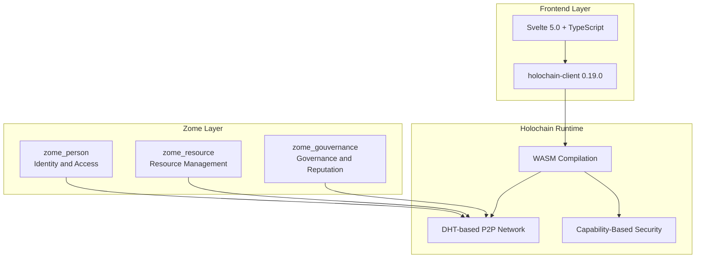

### Data Flow Architecture

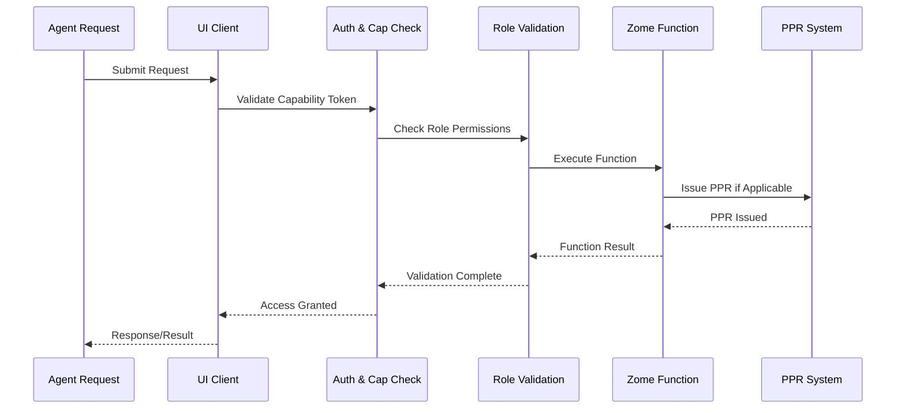

### Core Technology Stack

```
┌─────────────────────────────────────────────────────────────┐
│                    FRONTEND LAYER                           │
├─────────────────────────────────────────────────────────────┤
│ Svelte 5.0 + TypeScript + Vite 6.2.5                        │
│ @holochain/client 0.19.0                                    │
└─────────────────────────────────────────────────────────────┘
                              │
                              ▼
┌─────────────────────────────────────────────────────────────┐
│                 HOLOCHAIN RUNTIME                           │
├─────────────────────────────────────────────────────────────┤
│ Rust (HDK/HDI 0.5.x-0.6.x) → WASM Compilation               │
│ DHT-based peer-to-peer network                              │
│ Capability-based security & gossip                          │
└─────────────────────────────────────────────────────────────┘
                              │
                              ▼
┌─────────────────────────────────────────────────────────────┐
│                    ZOME LAYER                               │
├─────────────────────────────────────────────────────────────┤
│  zome_person    │  zome_resource  │  zome_gouvernance       │
│  (Identity)     │  (Resources)    │  (Governance)           │
└─────────────────────────────────────────────────────────────┘
```

---

## 🔐 Zome Components

### 1. zome_person - Identity & Access Management

#### Zome Person Architecture

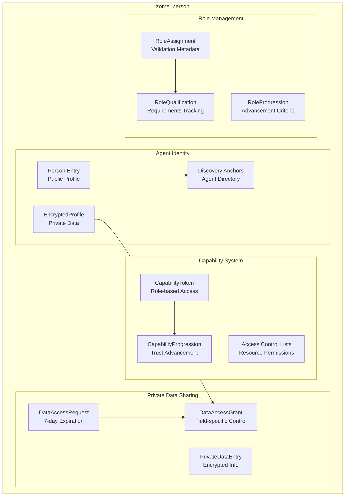

#### Core Components

```
┌─────────────────────────────────────────────────────────────┐
│                   zome_person                               │
├─────────────────────────────────────────────────────────────┤
│ 1.1 AGENT IDENTITY                                          │
│ ├── Person Entry (public profile)                           │
│ ├── EncryptedProfile Entry (private data)                   │
│ └── Discovery Anchors (findable agent directory)            │
│                                                             │
│ 1.2 CAPABILITY SYSTEM                                       │
│ ├── CapabilityToken Entry (role-based access)               │
│ ├── CapabilityProgression (trust advancement)               │
│ └── Access Control Lists (resource permissions)             │
│                                                             │
│ 1.3 PRIVATE DATA SHARING                                    │
│ ├── DataAccessRequest Entry (7-day expiration)              │
│ ├── DataAccessGrant Entry (field-specific control)          │
│ └── PrivateDataEntry (encrypted personal information)       │
│                                                             │
│ 1.4 ROLE MANAGEMENT                                         │
│ ├── RoleAssignment Entry (with validation metadata)         │
│ ├── RoleQualification Entry (requirements tracking)         │
│ └── RoleProgression Entry (advancement criteria)            │
└─────────────────────────────────────────────────────────────┘
```

#### Key Functions

```rust
// Identity Management
create_person(PersonInput) -> PersonHash
get_person(PersonHash) -> Person
get_all_persons() -> Vec<Person>
update_person(PersonHash, PersonInput) -> PersonHash
delete_person(PersonHash) -> DeleteResult

// Capability Management
create_capability_token(CapabilityRequest) -> CapabilityTokenHash
get_agent_capability_level(AgentPubKey) -> CapabilityLevel
promote_agent_capability(AgentPubKey, PromotionCriteria) -> PromotionResult

// Private Data Sharing
request_private_data_access(DataAccessRequest) -> RequestHash
grant_private_data_access(RequestHash, GrantDetails) -> GrantHash
get_private_data(GrantHash, FieldList) -> PrivateData
revoke_private_data_access(GrantHash) -> RevokeResult

// Role Management
assign_role(AgentPubKey, RoleAssignment) -> RoleHash
get_agent_roles(AgentPubKey) -> Vec<RoleAssignment>
validate_role_requirements(AgentPubKey, RoleType) -> ValidationStatus
```

### 2. zome_resource - Resource Lifecycle Management

#### Zome Resource Architecture

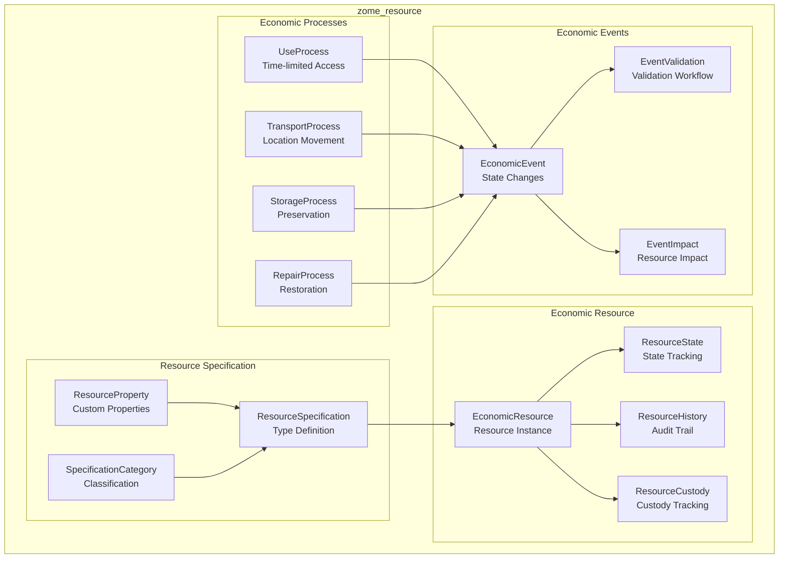

#### Core Components

```
┌─────────────────────────────────────────────────────────────┐
│                  zome_resource                              │
├─────────────────────────────────────────────────────────────┤
│ 2.1 RESOURCE SPECIFICATION                                  │
│ ├── ResourceSpecification Entry (type definition)           │
│ ├── ResourceProperty Entry (custom properties)              │
│ └── SpecificationCategory Entry (classification)            │
│                                                             │
│ 2.2 ECONOMIC RESOURCE                                       │
│ ├── EconomicResource Entry (resource instance)              │
│ ├── ResourceState Entry (current state tracking)            │
│ ├── ResourceHistory Entry (audit trail)                     │
│ └── ResourceCustody Entry (custody tracking)                │
│                                                             │
│ 2.3 ECONOMIC PROCESSES                                      │
│ ├── UseProcess Entry (time-limited access)                  │
│ ├── TransportProcess Entry (location movement)              │
│ ├── StorageProcess Entry (preservation)                     │
│ └── RepairProcess Entry (restoration)                       │
│                                                             │
│ 2.4 ECONOMIC EVENTS                                         │
│ ├── EconomicEvent Entry (state changes)                     │
│ ├── EventValidation Entry (validation workflow)             │
│ └── EventImpact Entry (resource impact tracking)            │
└─────────────────────────────────────────────────────────────┘
```

#### Key Functions

```rust
// Resource Specification
create_resource_specification(ResourceSpecInput) -> ResourceSpecHash
get_resource_specification(ResourceSpecHash) -> ResourceSpecification
update_resource_specification(ResourceSpecHash, ResourceSpecInput) -> ResourceSpecHash

// Economic Resource Management
create_economic_resource(ResourceInput) -> EconomicResourceHash
get_economic_resource(EconomicResourceHash) -> EconomicResource
update_economic_resource(EconomicResourceHash, ResourceUpdate) -> EconomicResourceHash
transfer_resource_custody(EconomicResourceHash, AgentPubKey) -> TransferResult

// Economic Process Management
initiate_use_process(UseProcessInput) -> UseProcessHash
initiate_transport_process(TransportProcessInput) -> TransportProcessHash
initiate_storage_process(StorageProcessInput) -> StorageProcessHash
initiate_repair_process(RepairProcessInput) -> RepairProcessHash

// Process Execution
complete_use_process(UseProcessHash, CompletionDetails) -> CompletionResult
complete_transport_process(TransportProcessHash, TransportDetails) -> CompletionResult
complete_storage_process(StorageProcessHash, StorageDetails) -> CompletionResult
complete_repair_process(RepairProcessHash, RepairDetails) -> CompletionResult
```

### 3. zome_gouvernance - Governance & Reputation

#### Zome Governance Architecture

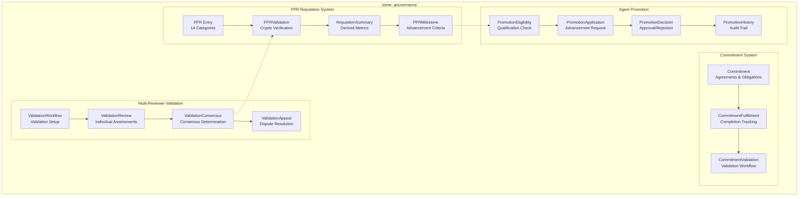

#### Core Components

```
┌─────────────────────────────────────────────────────────────┐
│                 zome_gouvernance                            │
├─────────────────────────────────────────────────────────────┤
│ 3.1 COMMITMENT SYSTEM                                       │
│ ├── Commitment Entry (agreements & obligations)             │
│ ├── CommitmentFulfillment Entry (completion tracking)       │
│ └── CommitmentValidation Entry (validation workflow)        │
│                                                             │
│ 3.2 PPR REPUTATION SYSTEM                                   │
│ ├── PPR Entry (14 reputation categories)                    │
│ ├── PPRValidation Entry (cryptographic verification)        │
│ ├── ReputationSummary Entry (derived metrics)               │
│ └── PPRMilestone Entry (advancement criteria)               │
│                                                             │
│ 3.3 MULTI-REVIEWER VALIDATION                               │
│ ├── ValidationWorkflow Entry (validation setup)             │
│ ├── ValidationReview Entry (individual assessments)         │
│ ├── ValidationConsensus Entry (consensus determination)     │
│ └── ValidationAppeal Entry (dispute resolution)             │
│                                                             │
│ 3.4 AGENT PROMOTION                                         │
│ ├── PromotionEligibility Entry (qualification check)        │
│ ├── PromotionApplication Entry (advancement request)        │
│ ├── PromotionDecision Entry (approval/rejection)            │
│ └── PromotionHistory Entry (audit trail)                    │
└─────────────────────────────────────────────────────────────┘
```

#### PPR System Categories

```rust
pub enum PPRCategory {
    // Resource & Service Categories
    ResourceContribution,      // Resource creation and validation
    ResourceValidation,        // Resource quality assessment
    UseService,               // Use process participation
    TransportService,         // Transport service provision
    StorageService,           // Storage service provision
    RepairService,            // Repair service provision
    ServiceValidation,        // Service quality assessment

    // Governance & Community Categories
    CommitmentFulfillment,     // Commitment completion tracking
    GovernanceParticipation,   // Governance activity participation
    Custodianship,           // Resource custody responsibilities
    DisputeResolution,       // Conflict resolution participation
    CoordinationService,      // Coordination activities
    Mentorship,              // Knowledge sharing and guidance
    CommunityBuilding,       // Community development activities
}
```

#### Key Functions

```rust
// Commitment Management
create_commitment(CommitmentInput) -> CommitmentHash
get_commitment(CommitmentHash) -> Commitment
fulfill_commitment(CommitmentHash, FulfillmentDetails) -> FulfillmentResult
validate_commitment_fulfillment(CommitmentHash) -> ValidationResult

// PPR System
issue_ppr(PPRIssuanceRequest) -> PPRHash
get_ppr_summary(AgentPubKey, PPRCategory) -> PPRSummary
validate_ppr_eligibility(AgentPubKey, PPRCategory) -> EligibilityResult
derive_reputation_score(AgentPubKey) -> ReputationMetrics

// Multi-Reviewer Validation
create_validation_workflow(ValidationWorkflowInput) -> WorkflowHash
submit_validation_review(WorkflowHash, ValidationReview) -> ReviewHash
check_validation_consensus(WorkflowHash) -> ConsensusResult
appeal_validation_decision(WorkflowHash, AppealDetails) -> AppealHash

// Agent Promotion
evaluate_agent_promotion(AgentPubKey, PromotionType) -> EvaluationResult
promote_to_accountable_agent(AgentPubKey) -> PromotionResult
promote_to_primary_accountable_agent(AgentPubKey) -> PromotionResult
get_promotion_history(AgentPubKey) -> Vec<PromotionRecord>
```

---

## 🔄 Cross-Zome Integration Patterns

### Cross-Zome Data Flow

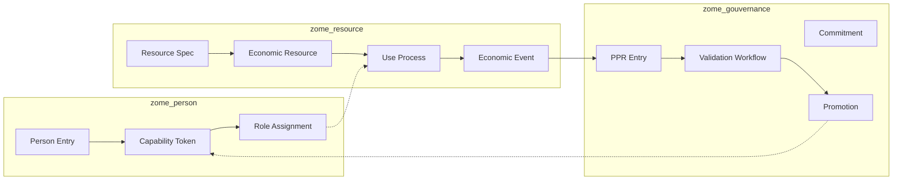

### 1. Capability Progression Integration

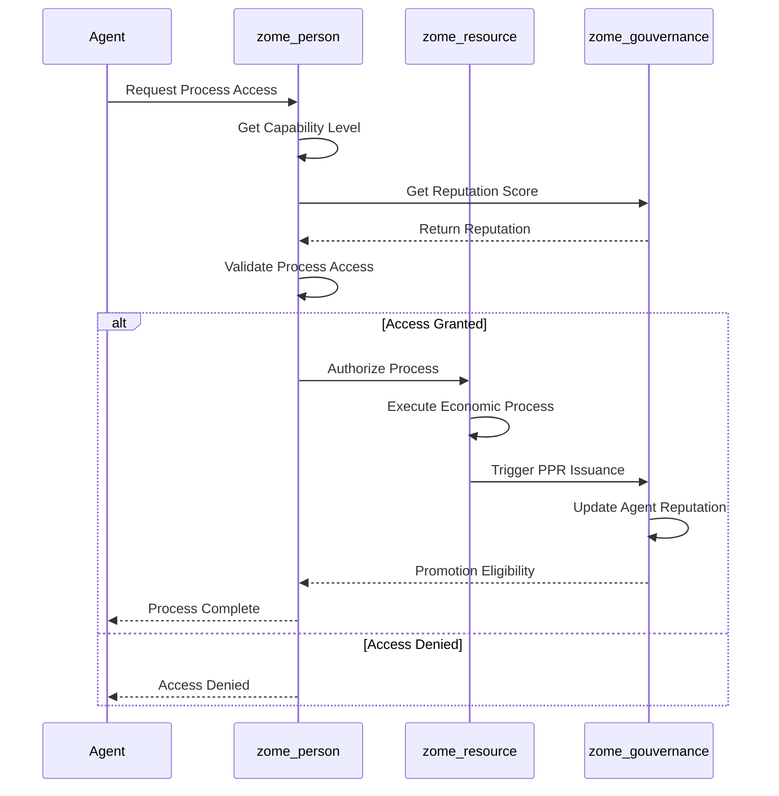

```rust
// Cross-zome capability validation
fn validate_process_access(agent: AgentPubKey, process_type: EconomicProcess) -> bool {
    let capability = zome_person::get_agent_capability_level(agent)?;
    let reputation = zome_gouvernance::derive_reputation_score(agent)?;

    match process_type {
        EconomicProcess::Use => {
            // Accountable Agent (stewardship) or higher
            capability.level >= CapabilityLevel::Accountable
        },
        EconomicProcess::Transport | EconomicProcess::Storage | EconomicProcess::Repair => {
            // Primary Accountable Agent (coordination/governance) only
            capability.level >= CapabilityLevel::Primary &&
            reputation.exceeds_threshold(PROMOTION_THRESHOLD)
        }
    }
}
```

### 2. PPR Issuance Coordination

```rust
// PPR issuance coordination across zomes
fn coordinate_ppr_issuance(event: EconomicEvent) -> Vec<PPRIssuance> {
    let mut issuances = Vec::new();

    // Resource-based PPRs (zome_resource coordination)
    if let Some(resource) = event.affected_resource {
        if event.action == VfAction::Produce {
            issuances.push(PPRIssuance {
                recipient: event.provider,
                category: PPRCategory::ResourceContribution,
                evidence: resource.hash,
            });
        }
    }

    // Process-based PPRs (cross-zome coordination)
    if let Some(process) = event.process {
        match process.process_type {
            UseProcess => issuances.push(PPRIssuance {
                recipient: event.receiver,
                category: PPRCategory::UseService,
                evidence: process.hash,
            }),
            TransportProcess => issuances.push(PPRIssuance {
                recipient: event.provider,
                category: PPRCategory::TransportService,
                evidence: process.hash,
            }),
            // ... other process types
        }
    }

    issuances
}
```

### 3. Private Data Sharing with Economic Processes

```rust
// Private data access for economic processes
fn authorize_process_data_access(
    process: EconomicProcess,
    requesting_agent: AgentPubKey,
    required_fields: Vec<PrivateDataField>
) -> Result<DataAccessGrant, DataAccessError> {
    // Validate process participation
    let participation = validate_process_participation(process, requesting_agent)?;

    // Check role requirements
    let role = zome_person::get_agent_roles(requesting_agent)?
        .into_iter()
        .find(|r| r.matches_process_requirements(&process))
        .ok_or(DataAccessError::InsufficientRole)?;

    // Create time-limited grant (7-day expiration)
    let grant = DataAccessGrant {
        requesting_agent,
        granting_agent: process.resource_owner,
        accessible_fields: required_fields,
        expires_at: sys_time()? + Duration::from_secs(7 * 24 * 60 * 60), // 7 days
        purpose: format!("Data access for {} process", process.process_type),
        process_context: process.hash,
    };

    Ok(grant)
}
```

---

## 🛡️ Security Architecture

### Capability-Based Access Control Flow

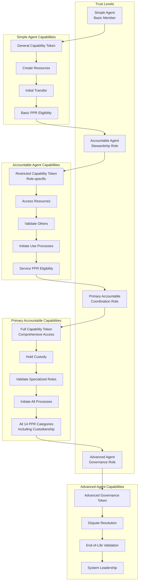

### 1. Capability-Based Access Control

```
Trust Level Progression:
Simple Agent (member)
├── General Capability Token
├── Can: Create resources, make InitialTransfer
├── PPR Eligibility: ResourceContribution upon validation
└── Promotion Criteria: First validated transaction

Accountable Agent (stewardship)
├── Restricted Capability Token (role-specific)
├── Can: Access resources, validate others, initiate Use processes
├── PPR Eligibility: Service processes, validation activities
└── Promotion Criteria: PPR milestones + specialized role validation

Primary Accountable Agent (coordination/governance)
├── Full Capability Token (comprehensive access)
├── Can: Hold custody, validate specialized roles, initiate all processes
├── PPR Eligibility: All 14 categories including custodianship
└── Advanced: Dispute resolution, end-of-life validation
```

### 2. Cryptographic Reputation System

```
PPR Cryptographic Structure:
├── Issuer Signature (Ed25519)
├── Recipient Identity (AgentPubKey)
├── Category & Evidence (Process/Resource hash)
├── Timestamp & Expiration
├── Validation Metadata (Reviewer signatures)
└── Reputation Impact Calculation

Reputation Derivation:
├── PPR Collection (all categories)
├── Quality Scoring (reviewer assessments)
├── Temporal Weighting (recent > historical)
├── Category Diversity (balanced participation)
└── Cryptographic Proof (tamper-evident)
```

### 3. Private Data Protection

```
Data Access Control:
├── Field-Level Granularity (specific data elements)
├── Time-Limited Grants (7-day maximum)
├── Purpose Binding (process-specific usage)
├── Automatic Expiration (system-enforced)
├── Audit Trail (access logging)
└── Revocation Capability (immediate termination)

Encryption Strategy:
├── End-to-End Encryption (agent-to-agent)
├── Key Management (capability-based)
├── Secure Storage (encrypted entries)
├── Access Validation (real-time checks)
└── Secure Transmission (Holochain secure messaging)
```

---

## 📊 Economic Process Architecture

### Economic Process Flow

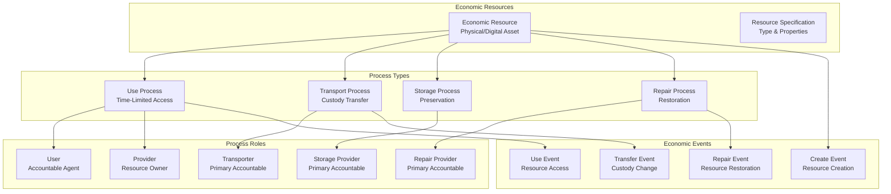

### 1. Use Process (Time-Limited Access)

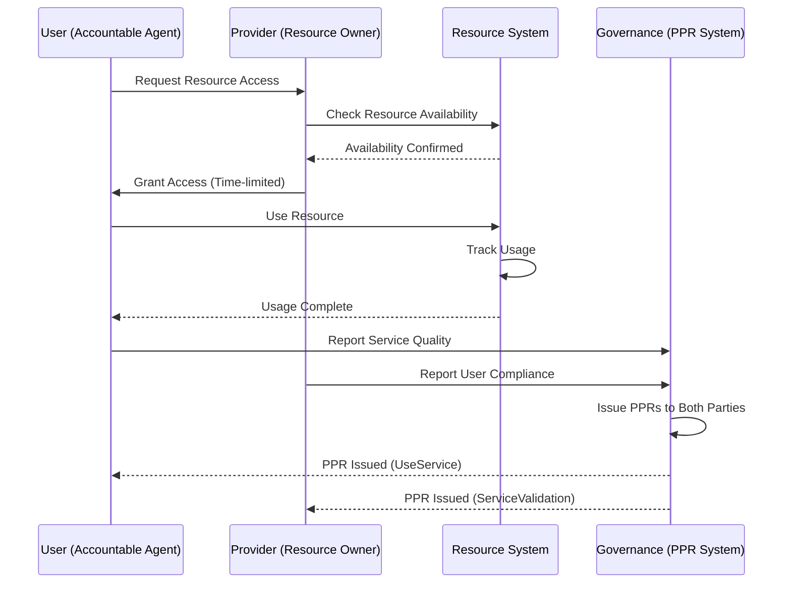

```rust
UseProcess {
    resource: EconomicResourceHash,
    user: AgentPubKey,
    provider: AgentPubKey,
    time_start: SystemTime,
    time_end: SystemTime,
    usage_terms: UsageAgreement,
    access_requirements: AccessConstraints,
    tracking_mechanism: UsageMonitoring,
}
```

**Role Requirements:**

- **User**: Accountable Agent (stewardship role)
- **Provider**: Resource owner or custodian
- **Validation**: Service quality assessment possible

### 2. Transport Process (Custody Transfer)

```rust
TransportProcess {
    resource: EconomicResourceHash,
    transporter: AgentPubKey,
    from_location: Location,
    to_location: Location,
    custody_transfer: CustodyAgreement,
    tracking_requirements: TrackingProtocol,
    insurance_terms: InsuranceCoverage,
}
```

**Role Requirements:**

- **Transporter**: Primary Accountable Agent (coordination role)
- **Custodian**: Resource owner or appointed custodian
- **Validation**: Transport service assessment possible

### 3. Storage Process (Preservation)

```rust
StorageProcess {
    resource: EconomicResourceHash,
    storage_provider: AgentPubKey,
    storage_location: Location,
    storage_conditions: PreservationRequirements,
    monitoring_protocol: ConditionMonitoring,
    access_during_storage: AccessPolicy,
}
```

**Role Requirements:**

- **Storage Provider**: Primary Accountable Agent (coordination role)
- **Resource Owner**: Maintains ultimate ownership
- **Validation**: Storage service assessment possible

### 4. Repair Process (Restoration)

```rust
RepairProcess {
    resource: EconomicResourceHash,
    repair_provider: AgentPubKey,
    repair_specification: RepairPlan,
    quality_requirements: QualityStandards,
    cost_structure: CostAgreement,
    validation_requirements: QualityAssurance,
}
```

**Role Requirements:**

- **Repair Provider**: Primary Accountable Agent (coordination role)
- **Quality Validator**: Specialized validation role
- **Validation**: Repair service assessment possible

---

## 🔄 Validation & Governance Workflows

### PPR System Workflow

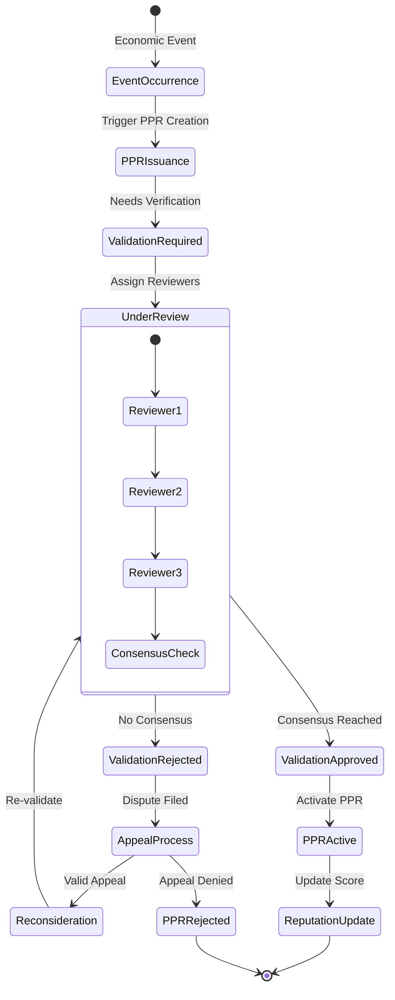

### Multi-Reviewer Validation System

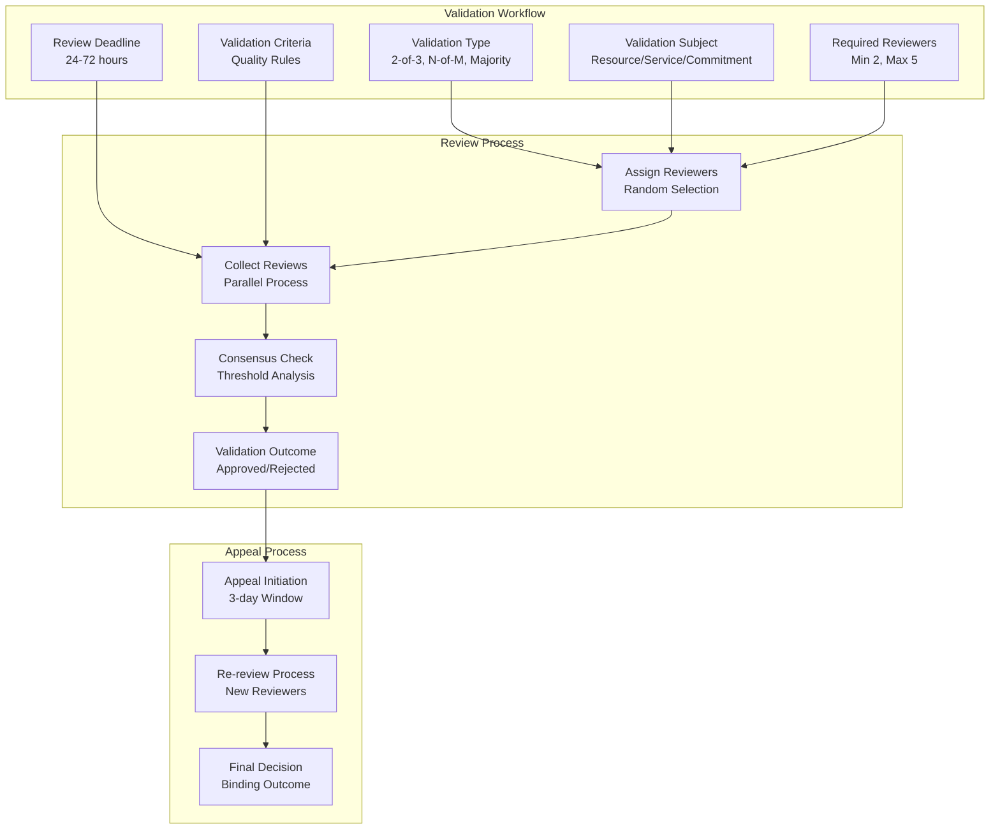

```rust
ValidationWorkflow {
    workflow_type: ValidationType,  // 2-of-3, N-of-M, simple_majority
    subject: ValidationSubject,     // Resource, Service, Commitment
    required_reviewers: u32,
    review_deadline: SystemTime,
    validation_criteria: ValidationRules,
    appeal_process: AppealProcedure,
}
```

**Validation Types:**

- **2-of-3 Validation**: 3 reviewers, 2 required for consensus
- **N-of-M Validation**: Custom reviewer numbers and consensus thresholds
- **Simple Majority**: Democratic decision-making with minimum participation

### 2. Agent Promotion Workflow

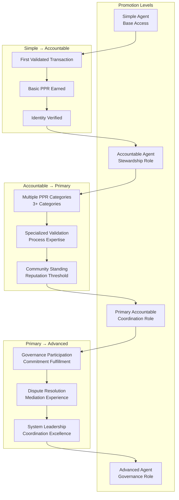

```rust
PromotionWorkflow {
    current_level: CapabilityLevel,
    target_level: CapabilityLevel,
    eligibility_criteria: PromotionRequirements,
    evaluation_period: Duration,
    required_ppr_categories: Vec<PPRCategory>,
    milestone_achievements: Vec<PPRMilestone>,
    review_board: Vec<AgentPubKey>,
}
```

**Promotion Criteria:**

- **Simple → Accountable**: First validated transaction + basic PPR
- **Accountable → Primary**: Multiple PPR categories + specialized validation
- **Primary → Advanced**: Governance participation + dispute resolution experience

### 3. Dispute Resolution Process

```rust
DisputeResolution {
    dispute_type: DisputeCategory,
    parties_involved: Vec<AgentPubKey>,
    evidence_collection: Vec<EvidenceHash>,
    mediation_process: MediationProcedure,
    resolution_options: ResolutionOptions,
    enforcement_mechanism: EnforcementStrategy,
}
```

**Dispute Categories:**

- **Resource Quality**: Resource not meeting specifications
- **Service Quality**: Service not meeting agreed standards
- **Access Violations**: Unauthorized resource access or use
- **Contract Disputes**: Commitment fulfillment disagreements
- **Reputation Challenges**: PPR validity disputes

---

## 📈 Performance & Scalability Architecture

### 1. DHT Optimization Strategies

```
Anchor Pattern Optimization:
├── Resource Discovery Anchors (category-based indexing)
├── Agent Discovery Anchors (role-based indexing)
├── Process Type Anchors (process-based indexing)
└── Geographic Anchors (location-based indexing)

Link Traversal Optimization:
├── Efficient Link Creation (minimal link overhead)
├── Cached Link Queries (reduced DHT calls)
├── Batch Link Operations (reduced network traffic)
└── Link Cleanup Strategies (DHT maintenance)
```

### 2. Reputation System Performance

```
PPR Calculation Optimization:
├── Incremental Updates (only calculate changes)
├── Cached Reputation Scores (periodic refresh)
├── Category-Specific Caching (domain-specific optimization)
└── Asynchronous Validation (non-blocking reputation updates)

Scalability Considerations:
├── PPR Rate Limiting (prevents reputation spam)
├── Validation Pool Management (efficient reviewer assignment)
├── Reputation Decay (historical relevance weighting)
└── Distributed Calculation (peer-to-peer reputation consensus)
```

### 3. Private Data Access Performance

```
Access Control Optimization:
├── Capability Token Caching (reduced validation overhead)
├── Grant Status Indexing (fast access validation)
├── Field-Level Access Caching (optimized data retrieval)
└── Expiration Queue Management (automatic cleanup)

Encryption Performance:
├── Symmetric Encryption for Data (efficient encryption/decryption)
├── Asymmetric Encryption for Keys (secure key exchange)
├── Key Derivation Optimization (efficient key management)
└── Secure Storage Compression (reduced storage overhead)
```

---

## 🔮 Future Architecture Extensions

### 1. Advanced Governance Features

- **Dynamic Rule Updates**: Community-driven governance rule modifications
- **Delegated Validation**: Hierarchical validation delegation systems
- **Cross-Community Coordination**: Inter-hApp governance coordination
- **Automated Dispute Resolution**: AI-assisted dispute mediation

### 2. Enhanced Economic Processes

- **Process Composition**: Complex multi-process workflows
- **Resource Bundling**: Package deals and combined services
- **Subscription Models**: Recurring access and service arrangements
- **Market Integration**: External market price discovery and integration

### 3. Advanced Reputation Systems

- **Skill-Based Reputation**: Domain-specific expertise tracking
- **Temporal Reputation Patterns**: Time-based reputation analysis
- **Network Reputation**: Relationship-based reputation scoring
- **Privacy-Preserving Reputation**: Zero-knowledge reputation proofs

### 4. Performance & Scalability Enhancements

- **Sharding Strategies**: Horizontal scaling through network partitioning
- **Caching Layers**: Multi-level caching for frequently accessed data
- **Compression Algorithms**: Advanced data compression for storage efficiency
- **Load Balancing**: Intelligent request routing and resource allocation

---

## 📋 Architecture Decision Records (ADRs)

### ADR-001: Three-Zome Architecture

**Decision**: Implement 3-zome architecture (person, resource, governance)
**Rationale**: Clear separation of concerns, focused responsibility domains
**Alternatives Considered**: Single monolithic zome, 5+ specialized zomes
**Impact**: Simplified development, clear API boundaries, cross-zome coordination complexity

### ADR-002: PPR-Based Reputation System

**Decision**: Implement 14-category PPR reputation system with cryptographic proofs
**Rationale**: Comprehensive reputation tracking, fraud resistance, privacy preservation
**Alternatives Considered**: Simple scoring system, centralized reputation database
**Impact**: Complex implementation, strong trust foundations, computational overhead

### ADR-003: Four Economic Processes

**Decision**: Standardize on Use, Transport, Storage, Repair processes
**Rationale**: Covers common sharing scenarios, clear role definitions, structured workflows
**Alternatives Considered**: Unlimited process types, minimal process structure
**Impact**: Standardized workflows, limited flexibility, easier validation

### ADR-004: Capability-Based Security Model

**Decision**: Progressive capability tokens with role-based restrictions
**Rationale**: Gradual trust building, principle of least privilege, automated advancement
**Alternatives Considered**: All-or-nothing access, centralized authorization
**Impact**: Complex access control, strong security, user-friendly progression

---

## 🎯 Architecture Quality Metrics

### Performance Targets

- **Zome Function Response Time**: < 500ms for common operations
- **PPR Calculation Time**: < 2s for reputation score derivation
- **Validation Workflow Time**: < 24h for standard validations
- **Private Data Access Time**: < 1s for authorized access requests

### Security Metrics

- **Capability Token Security**: Cryptographically secure, non-repudiable
- **PPR System Integrity**: Tamper-evident, cryptographically verifiable
- **Private Data Protection**: End-to-end encryption, field-level access control
- **Access Control Compliance**: 100% enforcement of capability restrictions

### Scalability Targets

- **Concurrent Users**: Support 1000+ concurrent agents
- **Resource Management**: 10,000+ concurrent economic resources
- **Process Throughput**: 100+ concurrent economic processes
- **Reputation Queries**: 10,000+ concurrent reputation calculations

### Reliability Requirements

- **System Availability**: 99.9% uptime for critical functions
- **Data Consistency**: Strong consistency for all economic transactions
- **Backup Recovery**: Complete data recovery from any network state
- **Error Recovery**: Graceful handling of network partitions and failures

---

_This architecture document represents the current state of the Nondominium system as of October 30, 2025. It is a living document that evolves with the implementation and community feedback._
