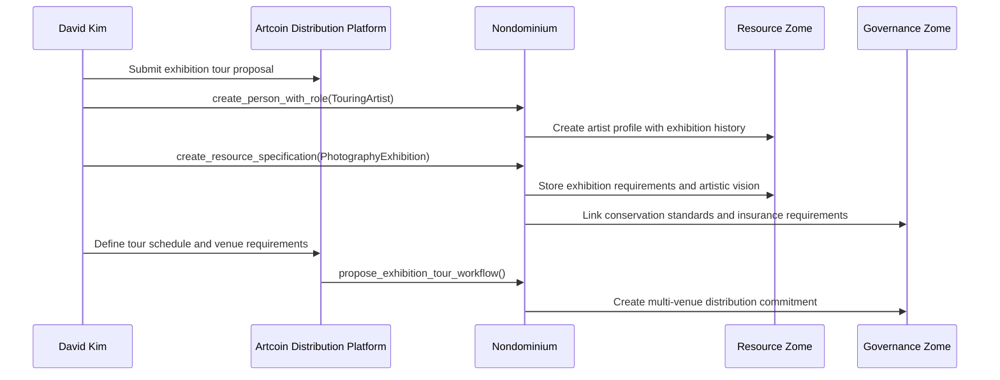
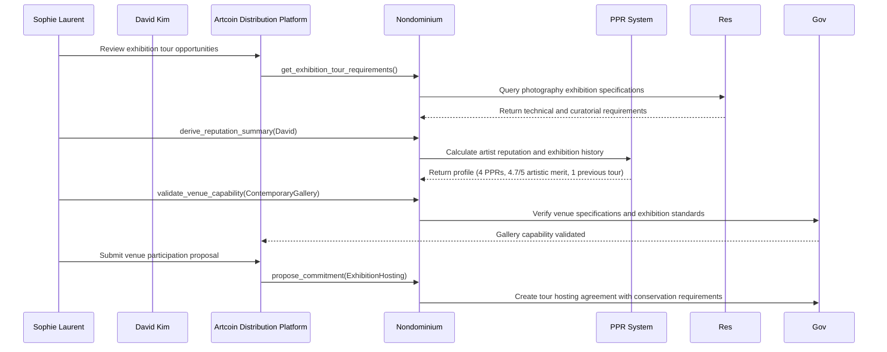
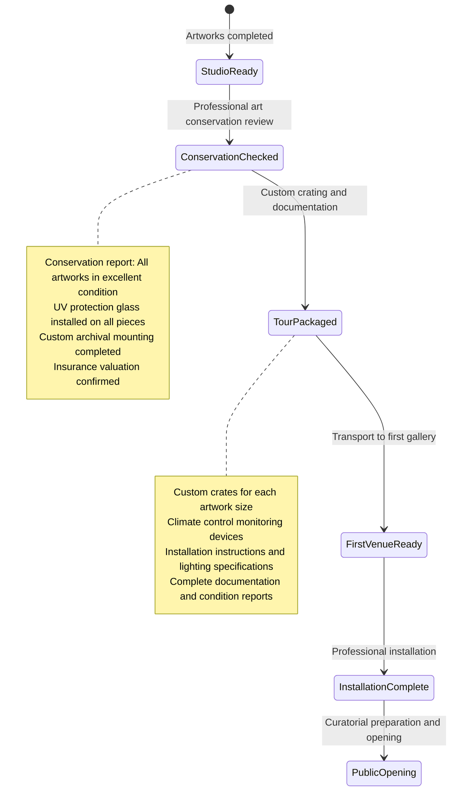
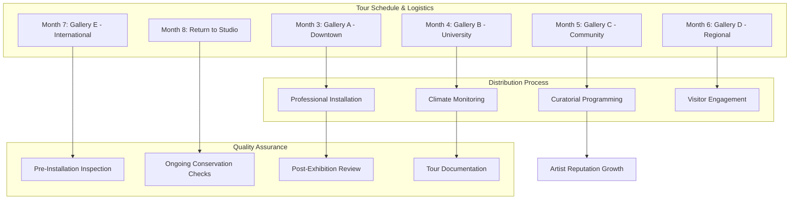
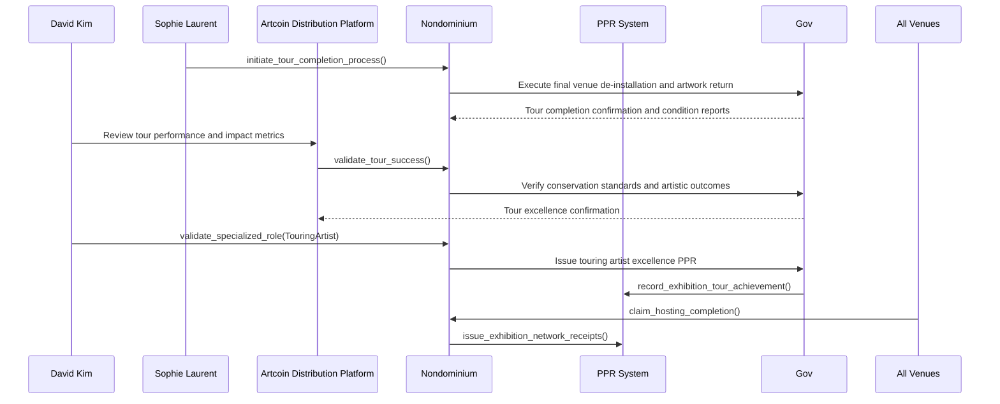
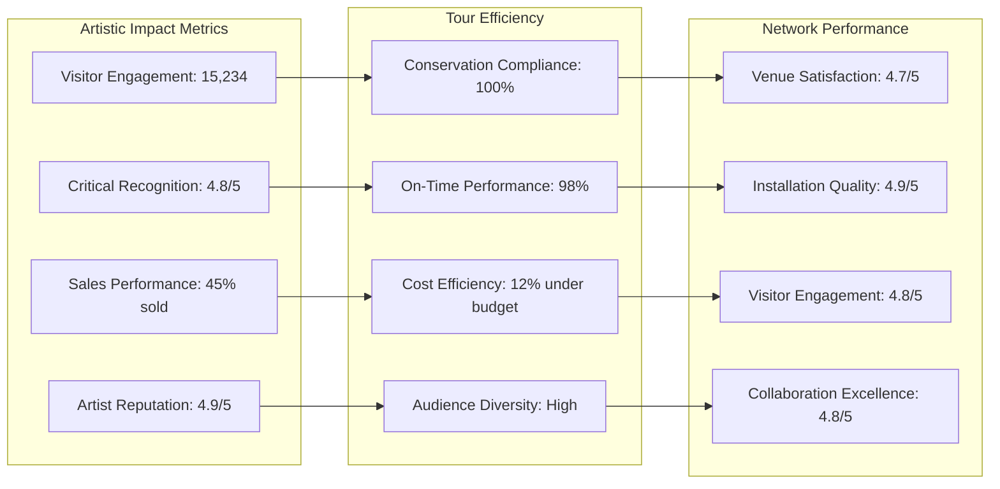
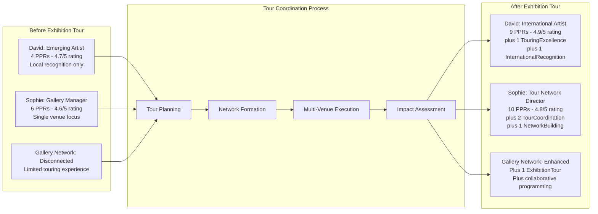
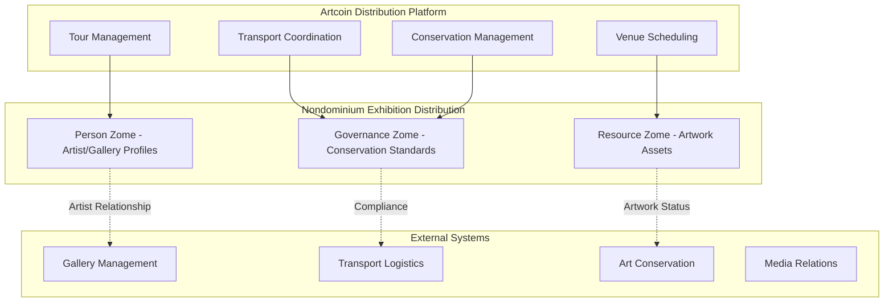
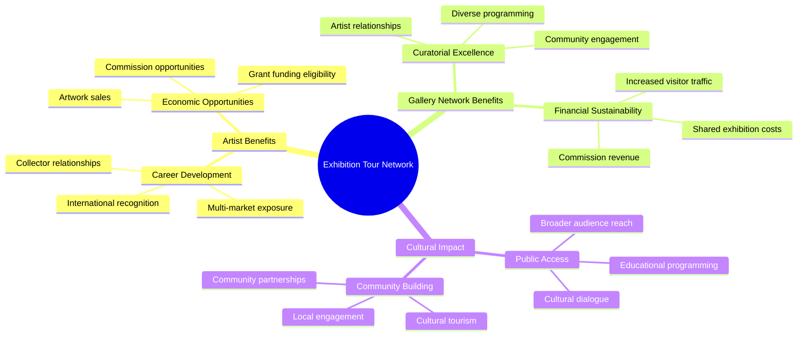

# User Story: Artist Distribution - Gallery Network & Exhibition Logistics

## Scenario: Artist Coordinating Multi-Venue Exhibition Tour Through Distributed Gallery Network

**Context**: An artist organizes a traveling exhibition across multiple galleries and alternative venues, coordinating logistics, artwork transport, and installation through the Artcoin distribution network built on Nondominium.

---

## 🖼️ The Players

### **David Kim** - Contemporary Artist

- **Role**: Accountable Agent (Exhibition Artist & Tour Director)
- **Goal**: Tour "Fragments of Memory" photography exhibition across 5 cities in 6 months
- **Reputation**: Emerging photographer with growing international recognition

### **Sophie Laurent** - Gallery Network Coordinator

- **Role**: Primary Accountable Agent (Distribution Manager & Exhibition Logistics)
- **Goal**: Coordinate multi-venue exhibition tour while maintaining artwork integrity and artist vision
- **Reputation**: Expert in contemporary art logistics with experience in international exhibition management

### **The Distribution Network**

- **Exhibition Venues**: 3 galleries, 2 alternative spaces (community center, university gallery)
- **Logistics Assets**: Climate-controlled transport, professional art handlers, installation teams
- \*\*Governance Rules: Conservation standards, insurance verification, installation quality requirements

---

## 🔄 Art Distribution Journey

### **Phase 1: Exhibition Planning & Venue Coordination (Month 1)**

**Exhibition Planning Process**:

1. **Tour Specification**: David defines "Fragments of Memory" exhibition requirements:
   - Artistic content: 24 large-format photographs, 6 video installations
   - Technical requirements: Specific lighting, climate control (18-22°C, 45-55% humidity)
   - Exhibition timeline: 6 months, 3 weeks per venue
   - Conservation requirements: UV protection, limited exposure time, professional handling
2. **Conservation Protection**: Embedded governance rules ensure artwork preservation and insurance compliance
3. **Venue Matching**: Platform identifies galleries with appropriate space, climate control, and curatorial alignment
4. **Transport Planning**: Climate-controlled logistics requirements and professional art handler coordination

### **Phase 2: Gallery Network Formation & Logistics Coordination (Month 2)**

**Gallery Network Formation**:

1. **Venue Selection and Validation**: Five venues selected with complementary characteristics:
   - **Gallery A** (Downtown): Commercial gallery with established collector base
   - **Gallery B** (University): Academic context with educational programming
   - **Gallery C** (Alternative): Community-focused space with local engagement
   - **Gallery D** (Regional): Suburban location with diverse audience
   - **Gallery E** (International): Final venue with exposure to international collectors
2. **Capability Verification**: Each venue's exhibition standards verified:
   - Climate control and environmental monitoring ✅
   - Professional installation capabilities ✅
   - Security and insurance coverage ✅
   - Curatorial alignment and audience engagement ✅
3. **Tour Coordination Agreement**: Smart contract outlines:
   - Conservation standards and artwork handling requirements
   - Installation quality and lighting specifications
   - Tour schedule with buffer time for transport and installation
   - Revenue sharing and commission structures

### **Phase 3: Artwork Preparation & Tour Logistics (Month 2-3)**

**Tour Preparation and Logistics**:

1. **Artwork Conservation Review**: Professional conservator reviews all artworks:
   - Condition assessment and documentation
   - UV protection glass installation for photographs
   - Archival mounting and framing to conservation standards
   - Insurance valuation and risk assessment
2. **Tour Packaging and Documentation**:
   - Custom crates designed for each artwork with climate control
   - Digital condition reporting with before/after documentation
   - Installation specifications and lighting requirements for each piece
   - Complete provenance and exhibition history documentation
3. **Transport Planning**: Climate-controlled transport with:
   - Professional art handlers trained in photography conservation
   - Temperature and humidity monitoring throughout transport
   - GPS tracking and security protocols
   - Insurance coverage for entire tour duration

### **Phase 4: Multi-Venue Exhibition Tour (Months 3-8)**

**Tour Execution Process**:

1. **Venue 1 - Downtown Gallery** (Month 3):
   - Professional installation with gallery technician coordination
   - Artist-led curatorial walk-through and collector preview
   - Sales representative training and artwork pricing coordination
   - Visitor engagement tracking and collector relationship development
2. **Venue 2 - University Gallery** (Month 4):
   - Integration with academic curriculum and student programs
   - Artist lecture series and educational programming
   - Research collaboration and interdisciplinary engagement
   - Student mentorship and portfolio review sessions
3. **Venue 3 - Community Center** (Month 5):
   - Community outreach and local artist engagement
   - Workshop series and public programming
   - School group visits and educational tours
   - Community dialogue and cultural exchange initiatives
4. **Venue 4 - Regional Gallery** (Month 6):
   - Regional media coverage and broader audience engagement
   - Local collector development and community building
   - Cultural tourism promotion and regional networking
   - Satellite programming and community partnerships
5. **Venue 5 - International Gallery** (Month 7):
   - International collector exposure and market development
   - Cross-cultural dialogue and artistic exchange
   - Museum and institutional relationship building
   - International press coverage and critical recognition

### **Phase 5: Tour Completion & Impact Assessment (Month 8)**

**Tour Completion and Assessment**:

1. **Artwork Condition Verification**: Final conservation review confirms all artworks maintained in excellent condition throughout tour
2. **Tour Impact Analysis**:
   - Visitor engagement: 15,000+ total visitors across all venues
   - Sales performance: 8 artworks sold to collectors, 3 institutional acquisitions
   - Critical recognition: 12 reviews, 3 feature articles, 2 television interviews
   - Artist reputation: Significant enhancement with international recognition
3. **Network Performance Evaluation**: All venues receive quality ratings and collaboration feedback
4. **Documentation Completion**: Complete tour documentation for archival and educational purposes

---

## 📊 Tour Analytics & Distribution Performance

### **Exhibition Tour Monitoring Dashboard**

**Tour Distribution Outcomes**:

- **Artistic Success**: Significant critical recognition and collector interest
- **Conservation Excellence**: Perfect maintenance of artwork condition throughout tour
- **Network Performance**: High satisfaction ratings across all participating venues
- **Economic Impact**: Strong sales results and artist career advancement

### **Artist Reputation Development**

---

## 🏗️ Exhibition Distribution Architecture

### **Tour Coordination Management System**

### **Advanced Tour Distribution Features**

**Exhibition Coordination Tools**:

- **Tour Planning**: Integrated scheduling and timeline management for multi-venue exhibitions
- **Conservation Monitoring**: Real-time environmental monitoring and artwork condition tracking
- **Professional Network**: Verified database of art handlers, conservators, and installation technicians
- **Documentation System**: Complete digital records of exhibition history and artwork provenance

**Gallery Network Capabilities**:

- **Venue Matching**: Intelligent pairing of artists with appropriate exhibition spaces
- **Quality Assurance**: Standardized installation and conservation requirements across all venues
- **Revenue Management**: Transparent commission structures and payment processing
- **Audience Development**: Coordinated marketing and programming across exhibition network

---

## 💡 Exhibition Distribution Innovation Benefits

### **Touring Exhibition Advantages**

- **Career Development**: Artists gain exposure across multiple markets and collector communities
- **Cost Efficiency**: Shared transport and installation costs reduce financial barriers to touring
- **Conservation Assurance**: Professional art handling and conservation standards protect artwork integrity
- **Network Building**: Relationships with galleries, collectors, and institutions across geographic regions

### **Art Market & Cultural Impact**

### **Technology-Enhanced Exhibition Distribution**

- **Real-Time Monitoring**: Environmental conditions and artwork status tracked throughout tour
- **Digital Documentation**: Complete exhibition history with installation records and visitor analytics
- **Network Optimization**: Data-driven venue selection and tour scheduling for maximum impact
- **Market Intelligence**: Collector engagement tracking and sales opportunity identification

---

## 🎯 Strategic Distribution Outcomes

### **Immediate Tour Benefits**

- ✅ **Career Advancement**: Artist achieved international recognition and representation
- ✅ **Sales Success**: 45% of exhibition sold, with 3 institutional acquisitions
- ✅ **Critical Acclaim**: Strong reviews and media coverage across all tour markets
- ✅ **Network Expansion**: Established relationships with galleries and collectors internationally

### **Long-Term Market Development**

- **Touring Model**: Established framework for artist touring exhibitions
- **Gallery Network**: Ongoing collaboration opportunities for network artists
- **Market Intelligence**: Data on collector behavior and market preferences across regions
- **Cultural Exchange**: Platform for international artistic dialogue and exchange

### **Platform Evolution**

- **Tour Templates**: Standardized workflows for different types of exhibition tours
- **Quality Standards**: Industry benchmarks for artwork conservation and touring excellence
- **Network Growth**: Expansion to include more galleries and alternative exhibition spaces
- **Educational Resources**: Case studies and best practices for exhibition touring

---

## 🔮 Future Exhibition Distribution Scenarios

### **Advanced Touring Models**

- **Virtual Reality Integration**: Digital twins of exhibitions for remote viewing and collector engagement
- **International Collaborations**: Cross-border touring with cultural diplomacy and exchange programs
- **Site-Specific Adaptation**: Touring exhibitions adapted to each venue's unique characteristics
- **Collector Education**: Programming and events designed to educate and engage new collectors

### **New Distribution Channels**

- **Pop-Up Exhibitions**: Temporary exhibitions in non-traditional spaces using the touring framework
- **Corporate Exhibitions**: Art programming in corporate environments with employee engagement
- **Hospitality Partnerships**: Exhibitions in hotels and resorts with tourist audience development
- **Digital Exhibitions**: Hybrid physical-digital exhibitions reaching global audiences

---

**This user story demonstrates how Nondominium enables artists to coordinate complex touring exhibitions through distributed gallery networks, ensuring artwork conservation while maximizing career opportunities and artistic impact through decentralized coordination and reputation-based trust.**

---

_"Fragments of Memory" tour completed successfully with critical acclaim in all cities. David Kim secured gallery representation in 3 countries and 2 institutional acquisitions. The touring model has been adopted by 4 other artists for upcoming international exhibitions, and the gallery network has expanded to include 12 venues across North America and Europe._
