# User Story: Artist Network - Art Circulation and Discovery

## Scenario: Artist Sharing Artwork Through Venues Using Nondominium

**Context**: An independent artist wants to circulate their paintings through a network of venues (cafes, restaurants, offices) to gain exposure and generate rental income, using the Artcoin platform built on Nondominium infrastructure. **This scenario primarily demonstrates Nondominium's resource sharing capabilities, with optional TrueCommon integration for comprehensive cultural network economics.**

---

## 🏗️ System Architecture Context

### **Resource Sharing Focus (Nondominium Sweet Spot)**

**Why Nondominium Excels for Art Networks**:
- Perfect fit for bilateral resource sharing (artwork ↔ venue)
- PPR system captures artistic and custodial reputation effectively
- Economic events handle rental and sales transactions cleanly
- Governance rules protect artwork and ensure proper care

### **Optional TrueCommon Enhancement (Cultural Economics Analysis)**

**TrueCommon Enhancement**:
- Cultural value beyond simple rental income
- Social impact measurement of public art access
- Artist career development analytics
- Community cultural enrichment metrics

## 🎨 The Players

### **Maya Rodriguez** - Independent Visual Artist

- **Role**: Accountable Agent (Creator & Resource Owner)
- **Goal**: Circulate artwork to gain public recognition and generate sustainable income
- **Reputation**: Emerging artist with growing local following, strong craftsmanship record

### **Jean-Pierre Dubois** - Café Owner

- **Role**: Primary Accountable Agent (Custodian)
- **Goal**: Enhance café ambiance with rotating art while supporting local artists
- **Reputation**: Established venue owner with excellent art care track record

### **The Artwork**

- **Piece**: "Urban Rhythms" - Oil on Canvas, 36" x 48"
- **Current Location**: Maya's Studio, Montreal
- **Governance Rules**: 70% artist commission on sales, $40/month rental fee, smoke-free display required

---

## 🔄 Art Circulation Journey

### **Phase 1: Artwork Creation & Onboarding (Week 1)**

**Artwork Onboarding Process**:

1. **Artist Registration**: Maya creates her artist profile with portfolio and credentials
2. **Resource Specification**: Defines artwork type (Oil on Canvas 2025 collection)
3. **Artwork Registration**: Registers "Urban Rhythms" with:
   - Physical specifications (size, medium, weight)
   - High-resolution images and provenance
   - Governance rules: 70/30 split, $40/month rental, insurance requirements
   - Care instructions and display preferences

### **Phase 2: Venue Discovery & Matching (Week 2)**

**Venue Discovery Process**:

1. **Artwork Browsing**: Jean-Pierre searches Artcoin platform for café-appropriate artwork
2. **Artist Review**: Evaluates Maya's portfolio and reputation:
   - 3 previous successful venue displays
   - 4.8/5 artwork quality rating
   - Positive venue feedback comments
3. **Governance Review**: Analyzes display terms:
   - $40/month rental fee ✅
   - 70% artist commission on sales ✅
   - Smoke-free environment requirement ✅
   - Quarterly rotation option
4. **Display Commitment**: Jean-Pierre submits AccessForUse commitment for 3-month initial period

### **Phase 3: Validation & Trust Building (Week 3)**

**Mutual Validation Process**:

1. **Venue Vetting**: Maya reviews Jean-Pierre's café reputation:
   - 8 previous art displays completed
   - 4.9/5 artwork care rating
   - No damage incidents in 2 years
   - Active art promotion on social media
2. **Insurance Verification**: Jean-Pierre provides liability insurance certificate
3. **Display Agreement**: Both parties sign smart contract with automated revenue sharing
4. **Trust Confirmation**: PPR system records mutual validation for future partnerships

### **Phase 4: Artwork Preparation & Transport (Week 4)**

**Transport & Installation**:

1. **Artwork Preparation**: Maya prepares "Urban Rhythms" for transport:
   - Professional packaging and framing
   - Certificate of authenticity signed
   - Installation and care instructions
2. **Transport Coordination**: Verified transport agent arranges delivery
3. **Custody Transfer**: Maya transfers custody to transport agent (CustodyTransfer PPR)
4. **Venue Installation**: Transport agent delivers and installs artwork at café
5. **Acceptance Confirmation**: Jean-Pierre accepts custody (CustodyAcceptance PPR)

### **Phase 5: Public Display & Engagement (Months 1-3)**

**Public Display Experience**:

1. **Physical Installation**: "Urban Rhythms" prominently displayed in café seating area
2. **Digital Integration**: QR code links to artwork's Nondominium profile showing:
   - Artist biography and artistic statement
   - Previous display history and public engagement
   - Purchase inquiries and rental information
   - Authenticity verification and provenance
3. **Engagement Tracking**: Platform monitors:
   - Daily viewer interactions via QR code scans
   - Social media mentions and shares
   - Sales inquiries and appreciation requests
   - Public comments and ratings
4. **Monthly Revenue**: Automated payment processing with 70/30 revenue split

### **Phase 6: Extended Discovery & Sales Opportunity (Month 2)**

**Sales Process Integration**:

1. **Patron Discovery**: Art enthusiast discovers artwork during café visit
2. **Authenticity Verification**: QR code provides blockchain-verified provenance
3. **Direct Purchase**: Smart contract facilitates immediate purchase with automatic revenue distribution
4. **Transfer Coordination**: Arrangements made for artwork collection or delivery
5. **Success Celebration**: All parties receive PPRs for successful transaction

---

## 📊 Network Effects & Artist Growth

### **Artist Reputation Development**

**Maya's PPR Growth**:

- +1 UseService (venue display)
- +1 ServiceValidation (artwork quality)
- +1 CommitmentFulfillment (display period)
- +1 SalesTransaction (artwork sale)
- +2 VenueCollaboration (positive feedback)
- **Reputation Impact**: 4.8 → 4.9 overall rating

### **Venue Benefits Expansion**

```mermaid
mindmap
  root((Café Art Integration))
    Business Benefits
      Customer Experience
        Enhanced ambiance
        Increased dwell time
        Social media buzz
      Marketing Advantage
        Cultural destination status
        Art community engagement
        Local media coverage
    Financial Benefits
      Direct Revenue
        Rental fee sharing
        Sales commissions
        Event hosting opportunities
      Indirect Benefits
        Increased foot traffic
        Customer loyalty
        Premium positioning
    Community Impact
      Artist Support
        Emerging artist platform
        Cultural contribution
        Creative ecosystem building
      Cultural Enrichment
        Public art access
        Arts education
        Community beautification
```

---

## 🌐 Platform Integration Architecture

### **Artcoin Platform Integration**

### **Artist-Centric Features**

**Creative Empowerment Tools**:

- **Portfolio Management**: Comprehensive artwork catalog with exhibition history
- **Revenue Analytics**: Real-time tracking of rental income and sales performance
- **Audience Insights**: Data on artwork engagement across different venue types and locations
- **Network Discovery**: Connection with complementary venues and art communities

**Smart Contract Capabilities**:

- **Dynamic Pricing**: Automated pricing adjustments based on artist reputation and demand
- **Royalty Enforcement**: _Droit de suite_ compliance for secondary sales
- **Multi-Venue Management**: Simultaneous display across multiple venues
- **Flexibility Options**: Easy modification of governance rules for different artwork collections

---

## 💡 Artistic Innovation Benefits

### **Creative Independence & Sustainability**

- **Direct Artist Income**: Elimination of gallery commissions and intermediaries
- **Artistic Control**: Artists retain ownership and creative direction
- **Sustainable Career**: Ongoing passive income through rental rather than one-time sales
- **Audience Building**: Direct connection with art enthusiasts and collectors

### **Cultural Democratization**

### **Technology-Enhanced Art Experience**

- **Provenance Tracking**: Complete artwork history with blockchain verification
- **Interactive Engagement**: QR codes enabling deeper artist and artwork stories
- **Community Curation**: Decentralized validation of artistic quality and relevance
- **Global Reach**: Local physical display with global digital discovery

---

## 🎯 Strategic Outcomes

### **Immediate Artist Benefits**

- ✅ **Revenue Generation**: $1,960 total ($120 rental + $1,840 sale commission)
- ✅ **Exposure Expansion**: Artwork viewed by ~2,000 café visitors over 2 months
- ✅ **Network Growth**: Invitations from 4 other venues for future displays
- ✅ **Reputation Building**: Enhanced artist profile with verifiable success metrics

### **Long-Term Career Development**

- **Sustainable Practice**: Ongoing rental income providing financial stability
- **Direct Patron Relationships**: Building collector base without gallery intermediation
- **Artistic Freedom**: Ability to experiment with new styles and mediums
- **Community Recognition**: Established as contributor to local cultural ecosystem

### **Platform Evolution**

- **Artist Success Stories**: Growing database of artist career development case studies
- **Venue Network Expansion**: Increasing number of quality venues seeking art partnerships
- **Collector Community**: Developing base of art enthusiasts engaged with platform
- **Cultural Impact Metrics**: Quantifiable data on art accessibility and community enrichment

---

## 🔮 Future Possibilities

### **Extended Art Forms Integration**

- **Digital Art**: NFTs with physical display components
- **Performance Art**: Bookable performances in venue spaces
- **Interactive Installations**: Technology-enhanced artwork experiences
- **Multi-Sensory Art**: Integration with venue's ambiance and customer experience

### **Advanced Economic Models**

- **Artist Cooperatives**: Collective ownership and management of shared studio spaces
- **Patronage Systems**: Community-supported artist funding models
- **Cultural Investment**: Artwork as appreciating community assets
- **Cross-Disciplinary Collaboration**: Joint projects between artists, musicians, and performers

---

**This user story demonstrates how Nondominium enables artists to transform their relationship with the art market, creating sustainable careers through direct community engagement while maintaining creative independence and building verifiable reputations in a decentralized cultural ecosystem.**

---

_Artwork "Urban Rhythms" successfully sold to a private collector after 2 months of café display. Maya now has 3 other artworks displayed across different venues and is earning consistent monthly rental income while building her artistic reputation._
