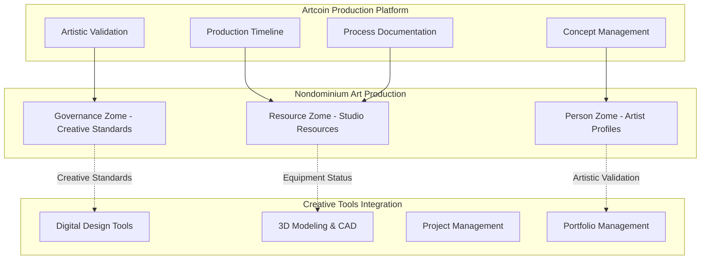

# User Story: Artist Production - Collaborative Art Creation & Fabrication

## Scenario: Artists Co-producing Large-Scale Installation Using Shared Studio Resources

**Context**: A collective of artists collaborates to create a large-scale public art installation, sharing specialized equipment and studio space through the Artcoin production network built on Nondominium.

---

## 🎨 The Players

### **Elena Vasquez** - Lead Artist & Concept Designer

- **Role**: Accountable Agent (Creative Director & Project Lead)
- **Goal**: Produce "Urban Canopy" - a 12-meter interactive light sculpture for public plaza
- **Reputation**: Established public artist with successful installations in 3 cities

### **Marcus Chen** - Fabrication Specialist

- **Role**: Primary Accountable Agent (Production Manager & Technical Lead)
- **Goal**: Coordinate multi-studio fabrication while maintaining artistic vision and technical integrity
- **Reputation**: Expert in large-scale sculpture fabrication with architectural integration experience

### **The Production Network**

- **Collaborating Studios**: 4 artist studios with complementary capabilities
- **Specialized Equipment**: Metal fabrication, 3D printing, electronics, lighting systems
- **Governance Rules**: Quality validation at each stage, intellectual property protection, safety compliance

---

## 🔄 Art Production Journey

### **Phase 1: Concept Development & Production Planning (Week 1-2)**

**Art Production Planning Process**:

1. **Commission Specification**: Elena defines "Urban Canopy" requirements:
   - Artistic vision: Interactive light sculpture responding to pedestrian movement
   - Technical specifications: 12m span, 500 LED nodes, weather-resistant
   - Timeline: 12 weeks from concept to installation
   - Budget: $85,000 including materials and studio time
2. **IP Protection**: Embedded governance rules protect artistic concept and collaboration agreements
3. **Capability Assessment**: Platform identifies studios with required fabrication equipment and expertise
4. **Safety Compliance**: Public art safety requirements and structural engineering standards embedded

### **Phase 2: Studio Network Discovery & Collaboration Formation (Week 3)**

**Studio Collaboration Formation**:

1. **Studio Network Assembly**: Four studios with complementary capabilities:
   - **Studio A (Marcus)**: Metal fabrication and structural engineering
   - **Studio B**: 3D printing and prototyping
   - **Studio C**: Electronics and interactive systems
   - **Studio D**: Lighting design and programming
2. **Expertise Validation**: Each studio's artistic and technical capabilities verified:
   - Previous public art collaborations ✅
   - Equipment specifications and certifications ✅
   - Artistic alignment and portfolio quality ✅
   - Collaboration reputation and reliability ✅
3. **Creative Agreement**: Smart contract outlines:
   - Creative attribution and ownership percentages
   - Quality standards and artistic vision adherence
   - Timeline coordination and milestone payments
   - Exhibition rights and documentation requirements

### **Phase 3: Multi-Studio Production Coordination (Weeks 4-9)**

**Distributed Art Production Process**:

1. **Stage 1 - Specialized Component Creation** (Weeks 4-6):
   - **Studio A**: Fabricate structural aluminum frame with weather-resistant coating
   - **Studio B**: 3D print interactive sensor housings and artistic decorative elements
   - **Studio C**: Develop custom sensor arrays and microcontroller systems
   - **Studio D**: Program custom LED lighting sequences and create light diffusers
2. **Stage 2 - Technical Integration** (Weeks 6-7):
   - Assembly of structural frame with mounting points for electronics
   - Integration of sensor systems and interactive response programming
   - Installation of lighting systems with power distribution and control
   - Software development for pedestrian interaction and light response patterns
3. **Stage 3 - Artistic Refinement** (Weeks 8-9):
   - Visual testing and artistic adjustments based on Elena's creative vision
   - Calibration of interactive responses for optimal public engagement
   - Quality assurance for weather resistance and public safety
   - Final artistic approval and documentation of creative process

### **Phase 4: Creative Validation & Documentation (Week 10-11)**

**Artistic Validation Process**:

1. **Creative Vision Verification**: Elena validates that the installation meets her artistic concept:
   - Visual impact and aesthetic quality ✅
   - Interactive engagement effectiveness ✅
   - Technical innovation and artistic merit ✅
   - Public safety and durability standards ✅
2. **Collaboration Documentation**: Creative contributions from each studio documented and attributed
3. **Innovation Recognition**: New techniques and approaches recorded for artistic community knowledge sharing
4. **Production Completion**: All studios receive PPRs for their creative and technical contributions

---

## 📊 Art Production Analytics & Creative Collaboration

### **Creative Production Monitoring Dashboard**

**Creative Collaboration Outcomes**:

- **Artistic Achievement**: Successful realization of complex interactive public art vision
- **Innovation Recognition**: New approaches to interactive sculpture and pedestrian engagement
- **Collaboration Excellence**: Seamless coordination across 4 studios with complementary expertise
- **Technical Quality**: Museum-level fabrication and weather resistance for public installation

### **Artistic Reputation Development**

---

## 🏗️ Art Production Platform Architecture

### **Creative Production Management System**

### **Advanced Art Production Features**

**Creative Collaboration Tools**:

- **Concept Sharing**: Secure development environment for sharing early-stage artistic concepts
- **Progressive Reveal**: Staged sharing of technical details while protecting artistic IP
- **Creative Feedback**: Structured artistic critique and validation processes
- **Documentation**: Automatic creation of process documentation for archival and educational purposes

**Resource Sharing Capabilities**:

- **Equipment Marketplace**: Shared access to expensive specialized fabrication equipment
- **Studio Time Trading**: Token-based system for trading studio access and expertise
- **Material Sourcing**: Collective purchasing power for bulk art material acquisition
- **Skill Exchange**: Knowledge sharing and skill development between collaborating artists

---

## 💡 Artistic Innovation Benefits

### **Creative Collaboration Advantages**

- **Scale Enablement**: Artists can undertake larger, more ambitious projects than possible individually
- **Specialization Access**: Access to specialized technical skills without becoming expert in all areas
- **Risk Distribution**: Shared financial and creative risks across collaborative network
- **Innovation Cross-Pollination**: New ideas emerging from intersection of different artistic approaches

### **Economic & Artistic Impact**

### **Technology-Enhanced Art Creation**

- **Digital Fabrication**: Integration of traditional art techniques with advanced manufacturing
- **Interactive Art**: New possibilities for art that responds to audience and environment
- **Process Documentation**: Complete digital record of creative process for educational purposes
- **Innovation Sharing**: Platform for sharing new techniques and approaches with artistic community

---

## 🎯 Strategic Art Production Outcomes

### **Immediate Creative Benefits**

- ✅ **Artistic Achievement**: Successfully completed complex interactive sculpture
- ✅ **Innovation Recognition**: Developed new approaches to pedestrian-responsive art
- ✅ **Collaboration Excellence**: Established model for multi-studio artistic production
- ✅ **Public Impact**: Installation received critical acclaim and community engagement

### **Long-Term Artistic Development**

- **Production Network**: Established ongoing collaborative relationships for ambitious projects
- **Technical Innovation**: Developed new fabrication and integration techniques now being adopted by other artists
- **Artistic Growth**: All collaborating artists expanded their creative capabilities and portfolios
- **Community Building**: Created framework for supporting large-scale public art in the community

### **Platform Evolution**

- **Production Templates**: Standardized workflows for different types of collaborative art production
- **Innovation Library**: Growing database of new techniques and approaches developed through collaboration
- **Artist Marketplace**: Enhanced platform connecting artists with complementary skills and resources
- **Educational Resources**: Documentation and case studies for artistic community learning

---

## 🔮 Future Art Production Scenarios

### **Advanced Creative Collaboration**

- **Virtual Reality Collaboration**: Immersive collaborative design environments for distributed artistic teams
- **AI-Assisted Creation**: Integration of AI tools for concept development and technical problem-solving
- **Blockchain Art History**: Complete provenance tracking for collaborative artworks with attribution recorded on blockchain
- **Global Production Networks**: International collaboration between artists across different cultural contexts

### **New Art Forms Enabled**

- **Generative Art**: Collaborative creation of art that evolves and responds to environmental inputs
- **Participatory Installation**: Large-scale works involving community members in creation process
- **Responsive Architecture**: Art that becomes integrated with building systems and responsive to occupancy
- **Digital-Physical Hybrid**: Works that exist simultaneously in physical and digital realms

---

**This user story demonstrates how Nondominium enables artists to scale their creative vision through collaborative production networks, combining artistic creativity with technical expertise while maintaining creative control and fair attribution through decentralized governance and reputation systems.**

---

_"Urban Canopy" installation successfully completed and installed in downtown plaza, receiving widespread public acclaim. The collaborative production model has since been adopted by 3 other artist collectives for projects ranging from interactive museum installations to responsive environmental artworks._
