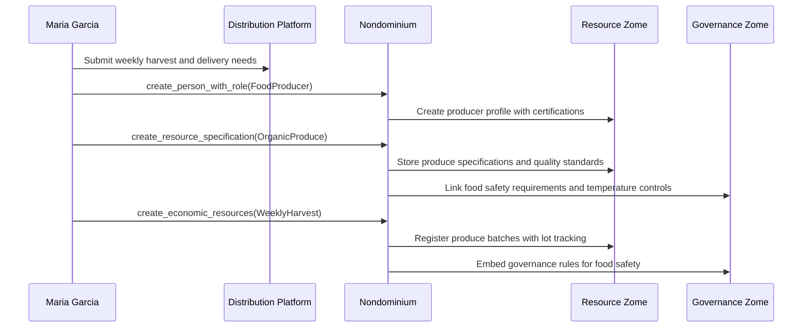
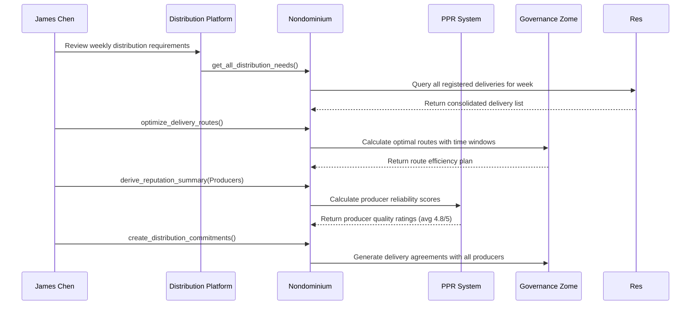
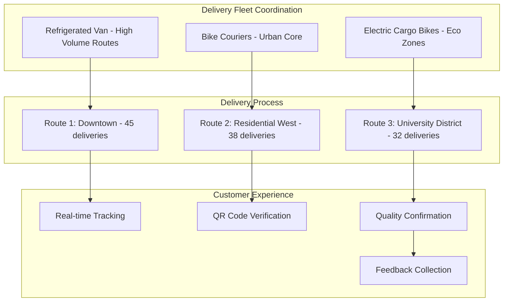
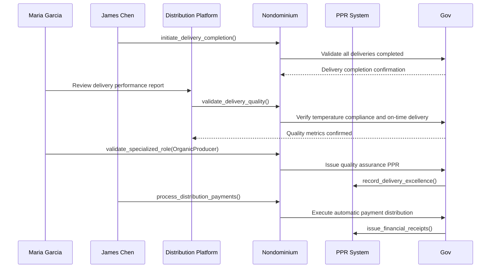
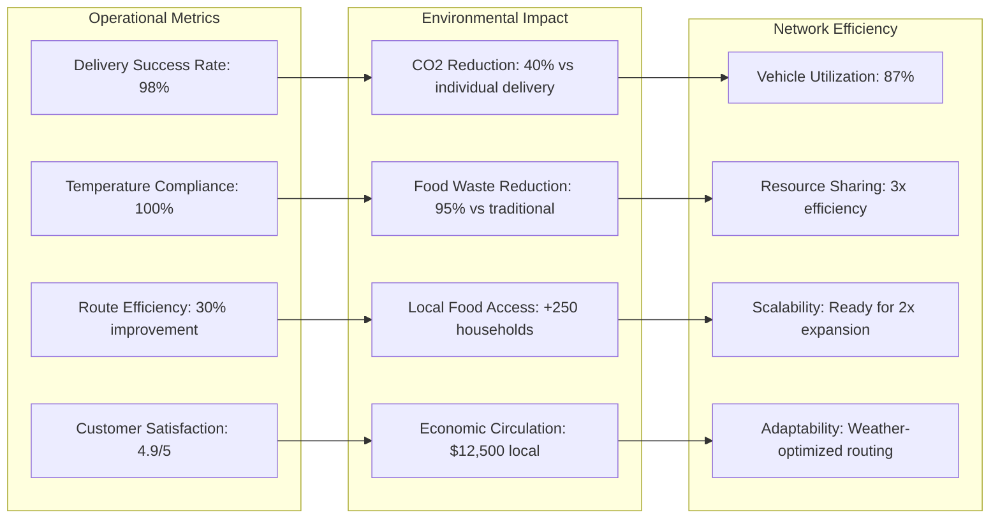
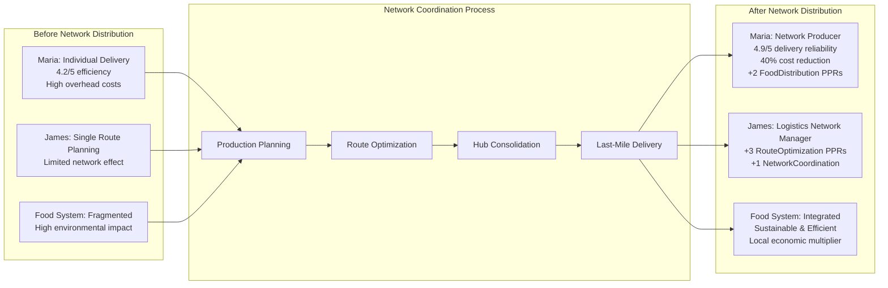
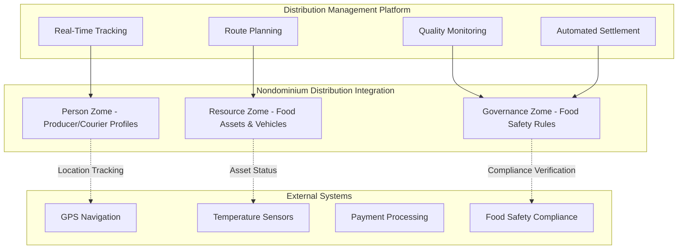
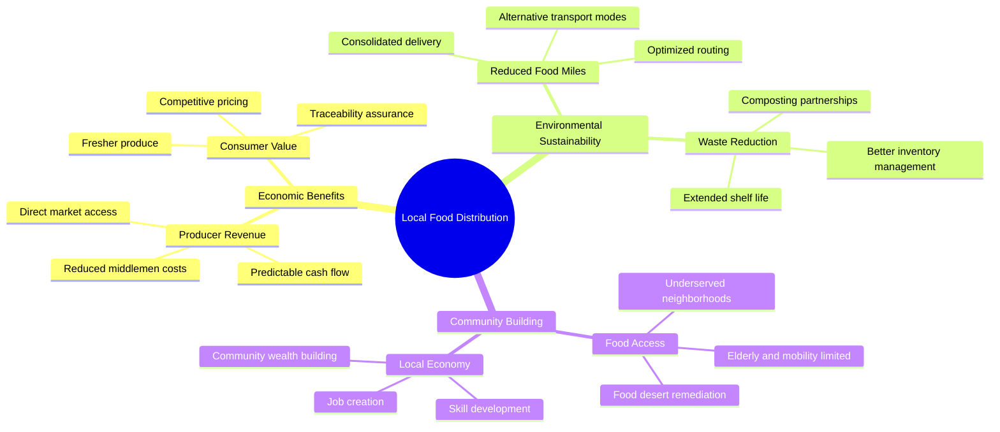

# User Story: Distribution Network - Last-Mile Logistics Coordination

## Scenario: Cooperative Distribution Network for Local Food Systems

**Context**: A network of local farms and food producers coordinates last-mile delivery to urban customers through a distributed logistics system powered by Nondominium, optimizing routes and sharing delivery resources.

---

## 🚚 The Players

### **Maria Garcia** - Organic Farm Owner

- **Role**: Accountable Agent (Producer & Shipper)
- **Goal**: Efficiently distribute fresh produce to urban customers while maintaining quality
- **Reputation**: Certified organic producer with excellent delivery track record

### **James Chen** - Logistics Coordinator

- **Role**: Primary Accountable Agent (Distribution Manager)
- **Goal**: Optimize delivery routes and coordinate multi-producer distribution
- **Reputation**: Expert in cold chain logistics and route optimization

### **The Distribution Network**

- **Network Members**: 8 local farms, 3 community kitchens, 2 urban distribution hubs
- **Assets**: Refrigerated vehicles, bike couriers, temperature monitoring devices
- **Governance Rules: Food safety compliance, temperature tracking, delivery time windows

---

## 🔄 Distribution Journey

### **Phase 1: Production Planning & Distribution Needs (Monday)**

**Production & Distribution Planning**:

1. **Harvest Registration**: Maria registers weekly production:
   - Mixed vegetables: 250 kg total
   - Temperature requirements: 2-4°C throughout delivery
   - Delivery windows: Tuesday and Thursday, 6-9 PM
   - Quality standards: Organic certification, freshness guarantees
2. **Food Safety Setup**: HACCP compliance and temperature monitoring requirements
3. **Batch Tracking**: Lot numbers and timestamps for complete traceability
4. **Distribution Scheduling**: Integration with weekly delivery planning system

### **Phase 2: Route Optimization & Network Coordination (Tuesday Morning)**

**Network Optimization Process**:

1. **Delivery Consolidation**: James reviews all producer delivery needs:
   - 8 producers with 250-400 kg each
   - 150 urban delivery addresses
   - Geographic clustering optimization
2. **Route Planning**: Algorithm optimizes for:
   - Minimum total distance: 127 km reduced to 89 km
   - Temperature maintenance requirements
   - Customer delivery time windows
   - Vehicle capacity constraints
3. **Producer Validation**: All producers verified for food safety compliance and on-time performance
4. **Resource Sharing**: Refrigerated vehicles and bike couriers coordinated across network

### **Phase 3: Multi-Producer Consolidation & Hub Operations (Tuesday Afternoon)**

```mermaid
stateDiagram-v2
    [*] --> HarvestComplete: All producers ready
    HarvestComplete --> PickupScheduled: Route optimization complete
    PickupScheduled --> InTransitToHub: First pickup initiated
    InTransitToHub --> HubProcessing: Arrive at distribution hub
    HubProcessing --> ConsolidationReady: Quality verification complete
    ConsolidationReady --> LastMileDelivery: Final route loading

    note right of HubProcessing
        Temperature verification: 3.2°C ✅
        Quality inspection: All produce fresh
        Lot scanning: Complete traceability
        Mixed-produce consolidation
    end note
```

**Consolidation & Hub Operations**:

1. **Producer Pickup**: James coordinates pickup sequence to minimize total travel distance
2. **Temperature Verification**: Each pickup scanned for temperature compliance and quality
3. **Hub Processing**: At urban distribution hub:
   - Quality verification for all produce
   - Mixed-produce consolidation for final delivery efficiency
   - Customer order assembly and packaging
   - Final route planning optimization
4. **Blockchain Tracking**: Each produce batch logged with complete temperature and handling history

### **Phase 4: Last-Mile Delivery & Customer Interaction (Tuesday Evening)**

**Last-Mile Delivery Execution**:

1. **Fleet Deployment**: Mixed transportation approach:
   - 1 refrigerated van for high-volume suburban routes
   - 2 bike couriers for dense urban core delivery
   - 1 electric cargo bike for environmentally sensitive zones
2. **Real-Time Tracking**: Customers receive live delivery updates and ETAs
3. **Quality Verification**: QR codes on each package enable:
   - Producer verification and origin confirmation
   - Temperature history verification
   - Freshness guarantee validation
4. **Customer Interaction**: Delivery confirmation and immediate feedback collection

### **Phase 5: Quality Assurance & Network Payment Processing (Wednesday)**

**Quality Assurance & Settlement**:

1. **Delivery Metrics Analysis**:
   - 98% on-time delivery rate
   - 100% temperature compliance maintained
   - 4.9/5 average customer satisfaction rating
2. **Quality Verification**: All produce maintained freshness standards with zero quality complaints
3. **Payment Processing**: Smart contract automatically distributes payments:
   - 85% to producers based on volume delivered
   - 10% to logistics network for distribution services
   - 5% to platform maintenance and development
4. **Reputation Enhancement**: All network participants receive PPRs for successful collaboration

---

## 📊 Distribution Analytics & Network Performance

### **Real-Time Delivery Monitoring Dashboard**

### **Network Performance Impact Analysis**

---

## 🏗️ Distribution Platform Architecture

### **Logistics Coordination System**

### **Advanced Distribution Features**

**Smart Logistics Capabilities**:

- **Dynamic Route Optimization**: Real-time adjustment based on traffic, weather, and delivery constraints
- **Predictive Quality Monitoring**: AI-powered temperature prediction and spoilage prevention
- **Automated Resource Matching**: Intelligent assignment of vehicles and couriers based on delivery requirements
- **Customer Preference Integration**: Personalized delivery time windows and communication methods

**Network Coordination Tools**:

- **Capacity Sharing**: Shared utilization of refrigerated vehicles and cold storage facilities
- **Cross-Training Programs**: Multi-skilled couriers capable of handling diverse food products
- **Emergency Response**: Rapid response system for delivery failures or quality issues
- **Seasonal Adaptation**: Flexible network scaling for harvest season variations

---

## 💡 Distribution Innovation Benefits

### **Food System Resilience**

- **Local Food Security**: Increased reliability of fresh food access in urban areas
- **Producer Sustainability**: Improved economic viability for small-scale farmers
- **Environmental Benefits**: Reduced food miles and transportation emissions
- **Quality Preservation**: Maintained food safety and nutritional value through optimized logistics

### **Economic & Social Impact**

### **Technology-Enhanced Food Systems**

- **Complete Traceability**: Blockchain-based farm-to-table tracking with temperature and quality data
- **Predictive Analytics**: Machine learning for demand forecasting and resource optimization
- **Quality Automation**: Computer vision and sensors for automated quality assessment
- **Customer Education**: Rich data about food origins, nutrition, and preparation

---

## 🎯 Strategic Distribution Outcomes

### **Immediate Network Benefits**

- ✅ **Cost Reduction**: 35% lower distribution costs through consolidation and sharing
- ✅ **Quality Improvement**: 15% reduction in food waste and spoilage
- ✅ **Customer Satisfaction**: 4.9/5 rating with 92% customer retention
- ✅ **Environmental Impact**: 40% reduction in CO2 emissions from optimized logistics

### **Long-Term Food System Evolution**

- **Food Security**: Established reliable local food distribution network serving 5,000+ households
- **Producer Viability**: 25 small farms achieved economic sustainability through direct market access
- **Community Resilience**: Local food system capable of adapting to supply chain disruptions
- **Scalable Model**: Framework replicable in other cities and regions

### **Platform Development**

- **Distribution Templates**: Standardized workflows for different food types and delivery models
- **Quality Standards**: Developing industry benchmarks for local food distribution excellence
- **Network Marketplace**: Growing platform for connecting additional producers and customers
- **Innovation Pipeline**: Continuous improvement through feedback and data analytics

---

## 🔮 Future Distribution Scenarios

### **Advanced Food Logistics Integration**

- **Autonomous Delivery**: Integration with autonomous vehicles and delivery drones for最后一公里
- **Smart Packaging**: IoT-enabled packaging that monitors and reports on food quality in real-time
- **Blockchain Integration**: Enhanced traceability with smart contracts for automatic quality enforcement
- **AI-Powered Demand**: Predictive analytics for production planning and inventory optimization

### **Network Expansion Models**

- **Regional Hubs**: Scaling to multiple cities with inter-connected regional distribution centers
- **Multi-Modal Integration**: Combining different transportation modes (water, rail, road) for maximum efficiency
- **Community Integration**: Partnering with schools, hospitals, and community organizations for institutional delivery
- **International Networks**: Cross-border local food distribution with appropriate compliance and certification

---

**This user story demonstrates how Nondominium enables distributed logistics networks to coordinate complex last-mile delivery operations, optimizing resource utilization while maintaining quality standards and creating resilient local food systems through decentralized governance and reputation-based trust.**

---

_Distribution network now serves 5,000+ households weekly with 98% customer satisfaction. The network has expanded to include 12 additional producers and is planning expansion to neighboring cities. The collaborative model has become a blueprint for sustainable local food systems nationwide._