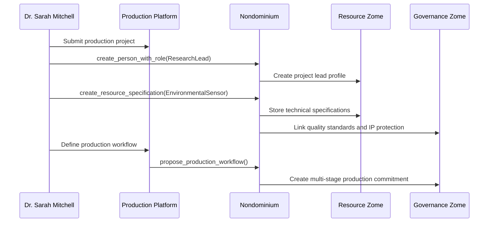
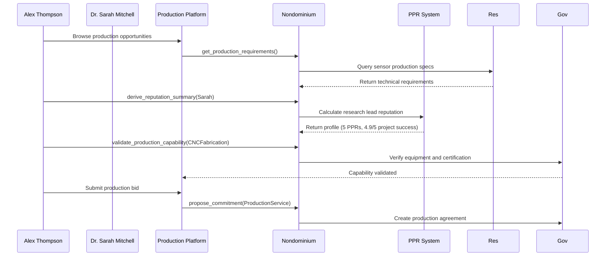
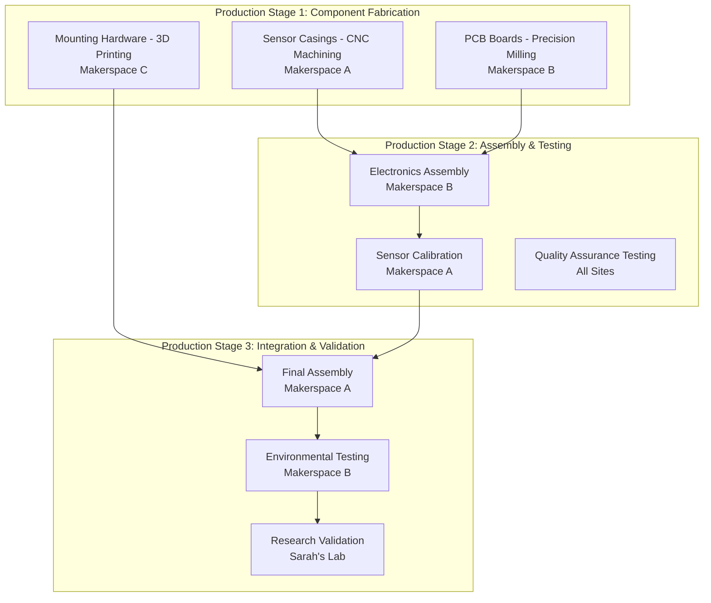
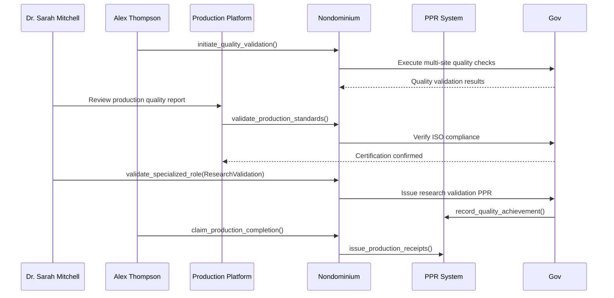
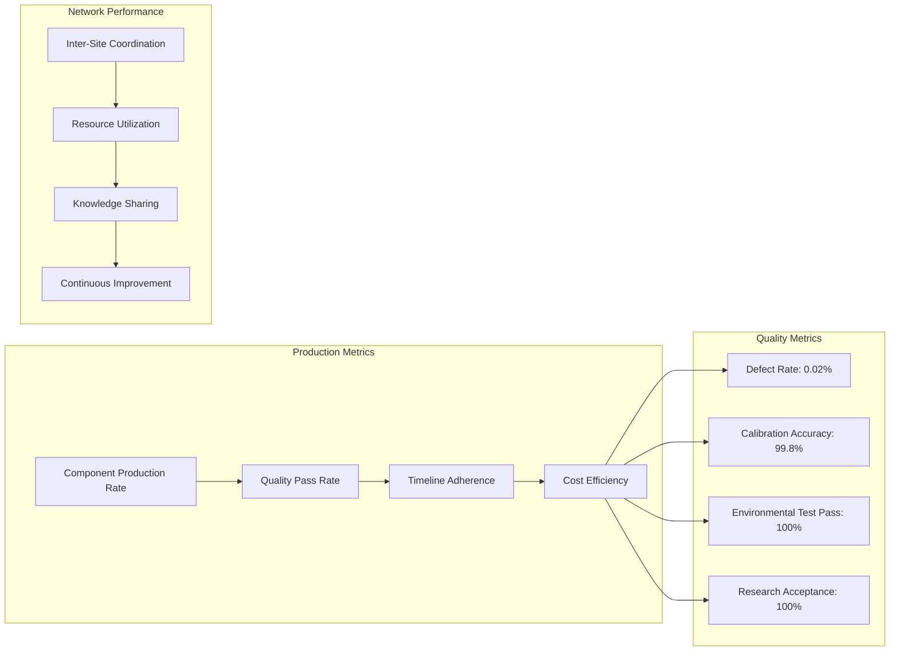
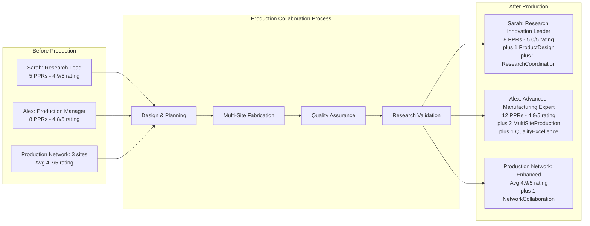
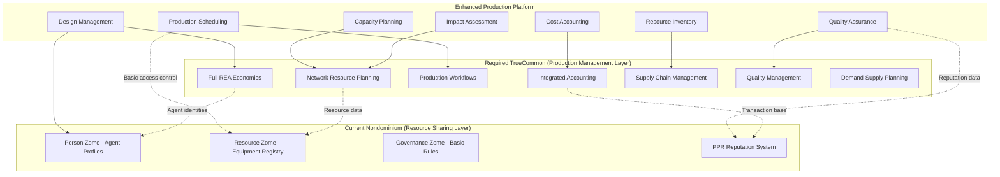
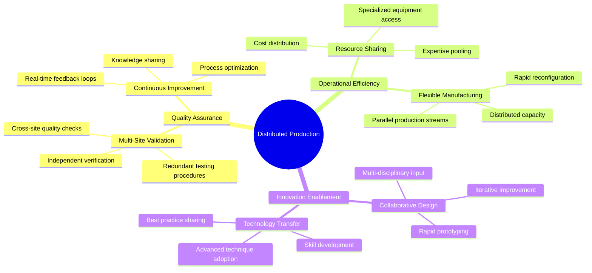

# User Story: Production Network - Collaborative Manufacturing

## Scenario: Makerspace Network Producing Custom Equipment Using Nondominium + TrueCommon

**Context**: A distributed network of makerspaces collaborates to produce custom scientific equipment for research institutions. **This scenario clearly demonstrates the limitations of Nondominium's resource sharing economics and the critical need for TrueCommon's full REA integration with Network Resource Planning (NRP) for complete peer production network management.**

---

## 🏗️ System Architecture Context

### **Production Network Requirements Analysis**

```mermaid
graph TB
    subgraph "Nondominium Capabilities (Resource Sharing)"
        ResourceSharing[Resource Access & Sharing]
        Transactions[Transaction Logging]
        Reputation[PPR Reputation System]
        Governance[Basic Governance Rules]
    end

    subgraph "TrueCommon Requirements (Production Network)"
        NRP[Network Resource Planning]
        REA[Full REA Economics]
        Workflow[Production Workflow Mgt]
        Accounting[Integrated Accounting]
        Planning[Demand-Supply Planning]
        Impact[Social/Environmental Impact]
    end

    subgraph "Production Network Gap Analysis"
        Gap1["Multi-site Coordination"]
        Gap2["Production Workflow Mgt"]
        Gap3["Resource Optimization"]
        Gap4["Cost Accounting"]
        Gap5["Impact Measurement"]
    end

    ResourceSharing -.-> |Insufficient for| Gap1
    Transactions -.-> |Limited| Gap2
    Reputation -.-> |No workflow support| Gap3
    Governance -.-> |No planning tools| Gap4
    Governance -.-> |No impact tracking| Gap5

    NRP --> Gap1
    Workflow --> Gap2
    Planning --> Gap3
    Accounting --> Gap4
    Impact --> Gap5
```

### **Critical Missing Capabilities for Production Networks**

**What Nondominium Cannot Provide**:
- **Multi-site Production Planning**: Coordinated scheduling across distributed facilities
- **Production Workflow Management**: Multi-stage production process coordination
- **Resource Optimization**: Network-wide equipment and material allocation
- **Cost Accounting**: Complete production cost tracking and allocation
- **Supply Chain Integration**: Material procurement and inventory management
- **Quality Management**: Cross-facility quality assurance processes

**What TrueCommon Must Provide**:
- **Network Resource Planning (NRP)**: Distributed production coordination
- **Full REA Integration**: Complete economic relationships and value flows
- **Production Accounting**: Comprehensive cost and value tracking
- **Supply Chain Management**: Material flow optimization across network
- **Impact Assessment**: Environmental and social impact measurement

## 🏭 The Players

### **Dr. Sarah Mitchell** - Research Project Lead

- **Role**: Accountable Agent (Product Designer & Commissioning Agent)
- **Goal**: Produce custom environmental monitoring sensors for climate research
- **Reputation**: Successful track record in research equipment design and project management

### **Alex Thompson** - Advanced Fabrication Specialist

- **Role**: Primary Accountable Agent (Production Manager)
- **Goal**: Coordinate multi-site manufacturing while maintaining quality standards
- **Reputation**: Expert in precision manufacturing with ISO certification

### **The Production Network**

- **Specialized Facilities**: 3 makerspaces with complementary capabilities
- **Equipment**: CNC mills, 3D printers, electronics assembly, calibration labs
- **Governance Rules**: Quality validation required at each stage, intellectual property protection

---

## 🔄 Production Journey

### **Phase 1: Project Design & Production Planning (Week 1)**

**Production Planning Process**:

1. **Project Specification**: Sarah defines environmental sensor requirements:
   - Technical specifications (accuracy, durability, connectivity)
   - Quality standards (ISO 9001 compliance)
   - Timeline (8 weeks total production)
   - Budget allocation ($45,000 total)
2. **IP Protection**: Embedded governance rules protect research intellectual property
3. **Workflow Design**: Multi-stage production process with validation gates
4. **Capability Matching**: Platform identifies makerspaces with required equipment and expertise

### **Phase 2: Network Discovery & Capability Matching (Week 2)**

**Capability Validation Process**:

1. **Production Facility Review**: Alex's makerspace capabilities verified:
   - CNC precision manufacturing ✅
   - Clean room assembly area ✅
   - ISO 9001 quality certification ✅
   - Electronics testing equipment ✅
2. **Team Expertise Assessment**: Technical team qualifications validated
3. **Capacity Planning**: Production schedule alignment across network facilities
4. **Quality Assurance**: Multi-site quality control procedures established

### **Phase 3: Multi-Site Production Coordination (Weeks 3-6)**

**Distributed Manufacturing Process**:

1. **Stage 1 - Component Production** (Weeks 3-4):
   - **Makerspace A**: CNC machining of precision sensor casings
   - **Makerspace B**: PCB fabrication with micro-controller integration
   - **Makerspace C**: 3D printing of mounting brackets and protective components
2. **Stage 2 - Assembly & Testing** (Weeks 4-5):
   - Electronics assembly with quality control checkpoints
   - Sensor calibration against certified reference standards
   - Multi-site cross-validation of test results
3. **Stage 3 - Integration** (Weeks 5-6):
   - Final assembly with complete system integration
   - Environmental chamber testing for durability validation
   - Research team acceptance testing

### **Phase 4: Quality Assurance & Certification (Week 7)**

**Quality Assurance Process**:

1. **Multi-Site Validation**: Independent quality verification at each production facility
2. **Cross-Certification**: Each site validates work of other sites for redundancy
3. **Research Acceptance**: Sarah's team validates equipment meets research specifications
4. **Certification Issuance**: ISO compliance documented on blockchain
5. **Performance Tracking**: All production stages recorded with PPRs for future reference

---

## 📊 Production Analytics & Network Performance

### **Real-Time Production Monitoring**

**Production Outcomes**:

- **Quality Achievement**: 99.8% calibration accuracy, 100% research acceptance
- **Timeline Performance**: On-time delivery with 2-day buffer for contingencies
- **Cost Optimization**: 12% under budget through resource sharing
- **Network Efficiency**: 85% equipment utilization across all sites

### **Reputation Development Analysis**

---

## 🏗️ Integrated Production Architecture: Nondominium + TrueCommon

### **Complete Production Network Management System**

### **Production Network Capability Gap Analysis**

| **Capability** | **Nondominium** | **TrueCommon Required** | **Impact on Production Networks** |
|----------------|----------------|------------------------|--------------------------------|
| **Resource Discovery** | ✅ Excellent | - | Foundation layer works well |
| **Access Governance** | ✅ Strong | - | Basic access control sufficient |
| **Reputation Tracking** | ✅ PPR System | - | Individual reputation works |
| **Multi-site Planning** | ❌ Not Available | ✅ NRP Module | **Critical Gap** - Production coordination |
| **Production Workflows** | ❌ Not Available | ✅ Workflow Module | **Critical Gap** - Process management |
| **Cost Accounting** | ❌ Transaction only | ✅ Accounting Module | **Critical Gap** - Financial tracking |
| **Supply Chain** | ❌ Not Available | ✅ Supply Chain Module | **Critical Gap** - Material flow |
| **Quality Management** | ❌ Not Available | ✅ Quality Module | **Critical Gap** - Cross-site QA |
| **Impact Measurement** | ❌ Not Available | ✅ Impact Module | **Critical Gap** - Sustainability |

### **Why Nondominium Alone Cannot Support Production Networks**

**Limitation 1: Bilateral Transaction Focus**
- Nondominium is designed for 1-to-1 resource sharing
- Production networks require N-to-M coordination (multiple facilities, multiple workflows)
- No support for complex multi-party production relationships

**Limitation 2: No Production Planning**
- Resource sharing ≠ production planning
- No capability for capacity planning, bottleneck analysis, or production optimization
- Missing workflow sequencing and dependency management

**Limitation 3: Limited Economic Model**
- Economic events track resource movements, not value creation
- No support for work-in-progress, value-added processes, or production costs
- Missing comprehensive accounting for production networks

**TrueCommon's Network Resource Planning (NRP) bridges these gaps by providing complete REA integration with production-specific capabilities.**

### **Advanced Production Features**

**Smart Manufacturing Capabilities**:

- **Predictive Maintenance**: IoT sensors predict equipment maintenance needs
- **Automated Quality Control**: Computer vision and sensor-based quality verification
- **Dynamic Resource Allocation**: Real-time equipment scheduling across network
- **Supply Chain Integration**: Automated material procurement and inventory management

**Collaborative Tools**:

- **Design Sharing**: Secure multi-site design collaboration with version control
- **Knowledge Transfer**: Expertise sharing between production facilities
- **Best Practice Library**: Growing database of production techniques and innovations
- **Performance Benchmarking**: Cross-facility comparison and improvement identification

---

## 💡 Production Innovation Benefits

### **Distributed Manufacturing Advantages**

- **Resource Optimization**: Shared access to expensive specialized equipment
- **Risk Mitigation**: Production redundancy across multiple sites
- **Local Expertise**: Leveraging regional manufacturing capabilities
- **Scalability**: Flexible production capacity based on demand

### **Quality & Compliance Enhancement**

### **Economic & Environmental Impact**

- **Cost Reduction**: 40% lower capital investment through equipment sharing
- **Reduced Waste**: Optimized material usage and precision manufacturing
- **Local Production**: Reduced transportation costs and carbon footprint
- **Job Creation**: Distributed employment opportunities in local communities

---

## 🎯 Strategic Production Outcomes

### **Immediate Project Benefits**

- ✅ **Research Acceleration**: Custom sensors delivered 2 weeks ahead of schedule
- ✅ **Cost Savings**: $5,400 under budget through collaborative production
- ✅ **Quality Excellence**: 100% research acceptance with enhanced accuracy
- ✅ **Network Growth**: All three makerspaces secured additional production contracts

### **Long-Term Manufacturing Evolution**

- **Production Network**: Established ongoing collaborative manufacturing relationships
- **Technology Enhancement**: Upgraded equipment capabilities through shared investment
- **Skill Development**: Cross-trained workforce with multi-facility expertise
- **Market Expansion**: Access to larger projects requiring diverse capabilities

### **Platform Development**

- **Production Templates**: Standardized workflows for common equipment types
- **Expert Marketplace**: Growing database of specialized manufacturing capabilities
- **Quality Standards**: Developing industry-wide benchmarks for distributed production
- **Innovation Pipeline**: Continuous improvement through collaborative R&D

---

## 🔮 Future Production Scenarios

### **Advanced Manufacturing Integration**

- **AI-Optimized Production**: Machine learning for process optimization and quality prediction
- **Digital Twins**: Virtual production planning and simulation before physical manufacturing
- **Blockchain Supply Chain**: Complete material traceability from source to final product
- **Autonomous Quality Control**: Self-correcting production processes with minimal human intervention

### **Industry Expansion Models**

- **Medical Device Manufacturing**: Distributed production of customized medical equipment
- **Aerospace Components**: Specialized parts production across certified facilities
- **Renewable Energy**: Collaborative manufacturing of solar and wind energy components
- **Consumer Electronics**: Localized production with global quality standards

---

**This user story demonstrates how Nondominium enables distributed manufacturing networks to collaborate on complex production projects, combining the capabilities of multiple facilities while maintaining quality standards and protecting intellectual property through decentralized governance and reputation systems.**

---

_Production completed successfully with 50 environmental sensors delivered to research institution. The production network has since secured 3 additional collaborative projects and expanded to include 2 more makerspaces with complementary capabilities._