# User Story: Resource Usage Process

## Scenario: University Research Team Using Shared Laboratory Equipment

**Context**: A university research team needs specialized laboratory equipment for a critical experiment, accessing it through their institutional platform integrated with Nondominium. **This scenario demonstrates Nondominium's capabilities for specialized equipment access, with TrueCommon providing enhanced research network coordination and impact measurement.**

---

## 🏗️ System Architecture Context

### **Research Equipment Access (Nondominium Core Strength)**

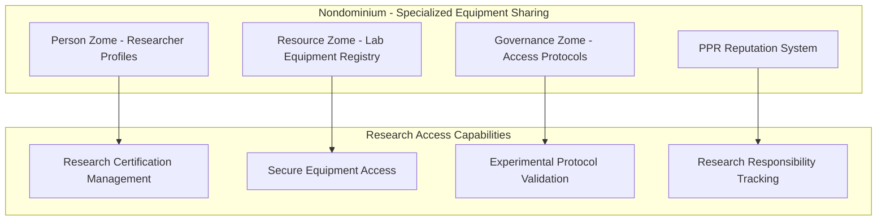

**Nondominium Excellently Handles**:
- Researcher certification and qualification verification
- Specialized equipment access with safety protocols
- Research reputation and responsible usage tracking
- Secure audit trails for research compliance

### **TrueCommon Research Network Enhancement**

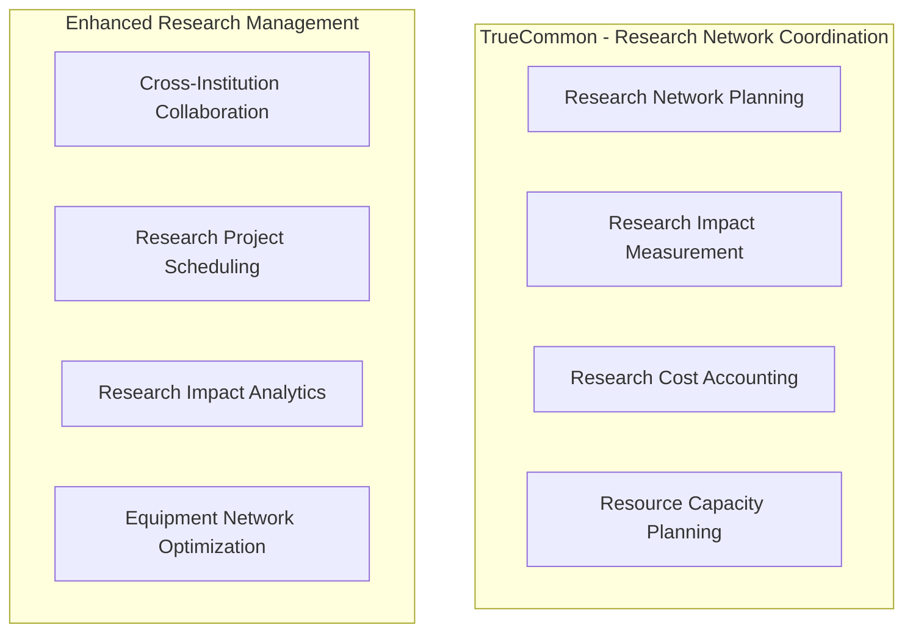

**TrueCommon Enhances Research Networks With**:
- Multi-institution research coordination
- Research impact measurement beyond equipment usage
- Collaborative project planning and resource allocation
- Research network efficiency optimization

## 🎯 The Players

### **Dr. Elena Rodriguez** - University Research Director

- **Role**: Accountable Agent with Research specialization
- **Goal**: Access high-end laboratory equipment for climate research project
- **Reputation**: Strong background in scientific collaboration and responsible equipment use

### **Professor Chen Wei** - Laboratory Manager

- **Role**: Primary Accountable Agent (Custodian)
- **Goal**: Monetize laboratory equipment while ensuring proper scientific usage
- **Reputation**: Excellent track record in equipment maintenance and research support

### **The Resource**

- **Equipment**: Cryogenic Electron Microscope (CEM-3000)
- **Current Location**: Advanced Materials Research Lab, MIT
- **Governance Rules**: Requires research certification, experimental protocol approval, real-time monitoring

---

## 🔄 Resource Usage Journey

### **Phase 1: Research Planning & Equipment Discovery (Week 1)**

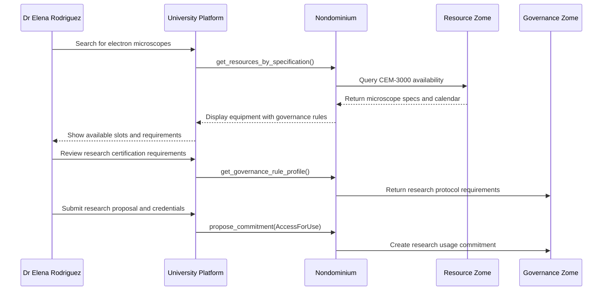

**Research Planning Process**:

1. **Equipment Discovery**: Elena searches institutional platform for cryogenic electron microscopes
2. **Requirement Analysis**: Reviews governance rules including:
   - PhD-level research certification ✅
   - Experimental protocol approval required
   - Real-time usage monitoring and logging
   - Minimum 2-week advance booking
3. **Research Proposal Submission**: Elena submits detailed experimental protocol through institutional review

### **Phase 2: Research Validation & Protocol Approval (Week 2)**

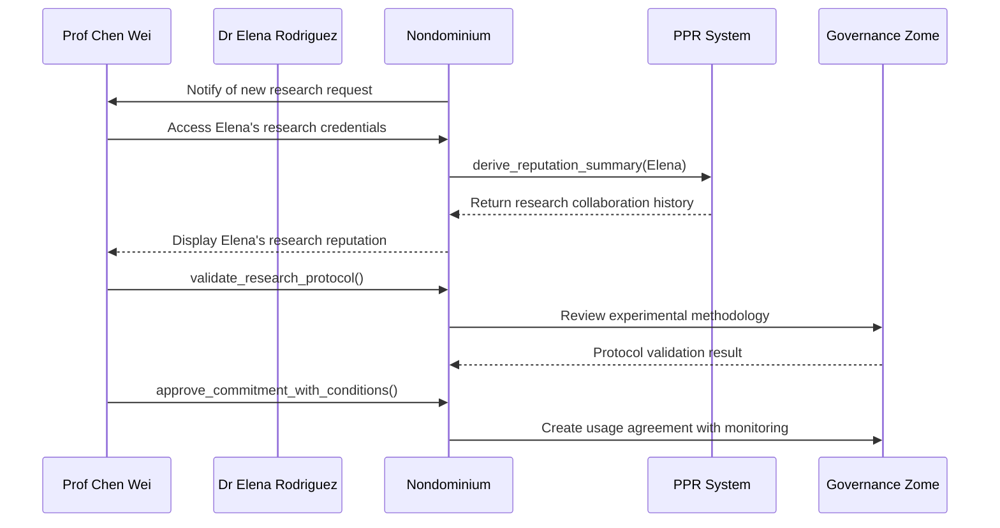

**Research Validation Process**:

1. **Credentials Verification**: Chen validates Elena's research background and institutional affiliation
2. **Protocol Review**: Experimental methodology reviewed for equipment compatibility and safety
3. **Reputation Assessment**: Elena's research collaboration history analyzed:
   - 15 successful research collaborations
   - 4.9/5 equipment care rating
   - 0 protocol violations in 5 years
4. **Usage Agreement**: Custom agreement created with real-time monitoring requirements

### **Phase 3: Usage Preparation & Training (Week 3)**

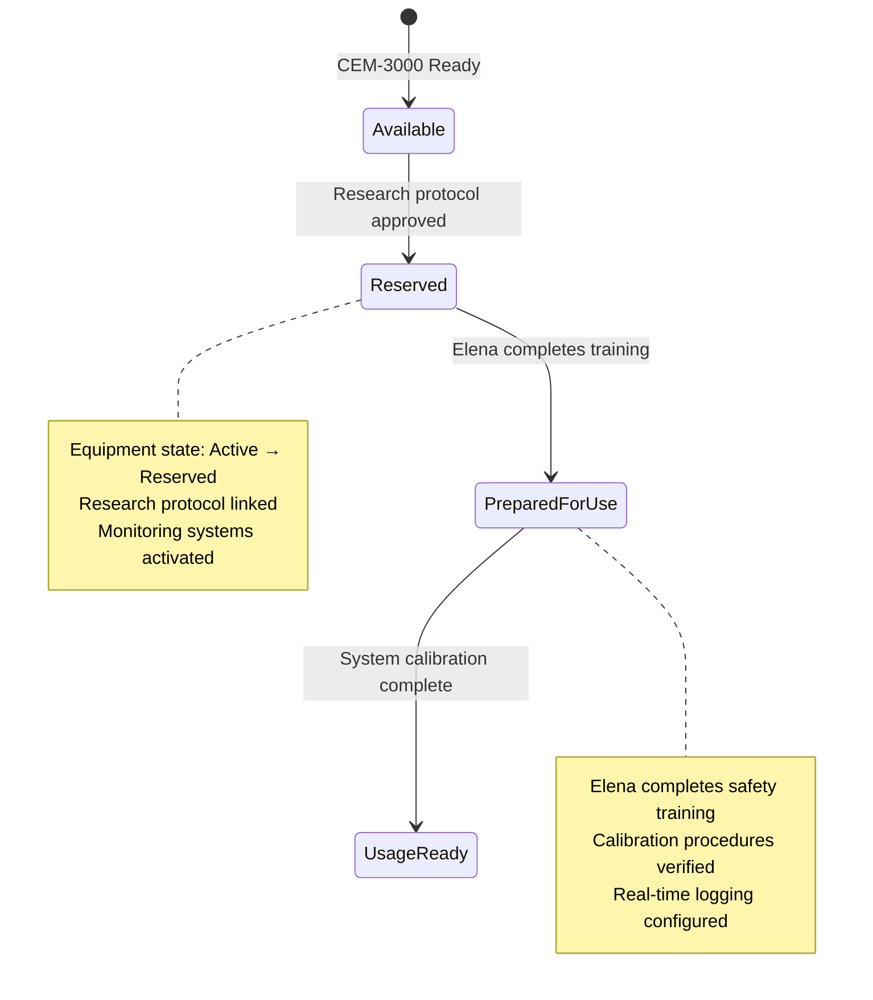

**Usage Preparation**:

1. **Equipment Reservation**: CEM-3000 status changed from Available to Reserved
2. **Research Training**: Elena completes specialized equipment safety and usage training
3. **System Configuration**: Real-time monitoring and data logging systems configured for research requirements
4. **Calibration Verification**: Equipment calibrated to meet experimental specifications

### **Phase 4: Research Usage & Real-Time Monitoring (Week 4-5)**

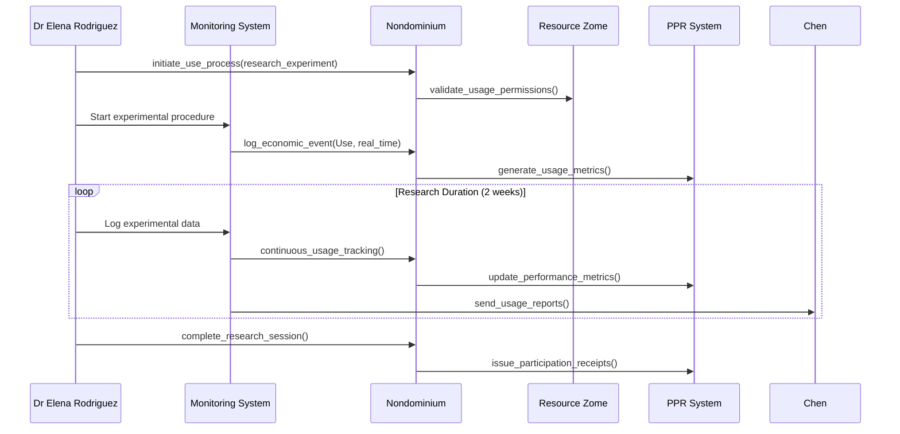

**Research Usage Process**:

1. **Experiment Initiation**: Elena begins cryogenic microscopy experiments with real-time monitoring
2. **Continuous Tracking**: System logs usage hours, experimental parameters, and equipment performance
3. **Performance Monitoring**: Real-time alerts for any deviations from approved protocols
4. **Data Integration**: Research data automatically linked to usage logs for compliance verification

### **Phase 5: Research Completion & Data Verification (Week 5)**

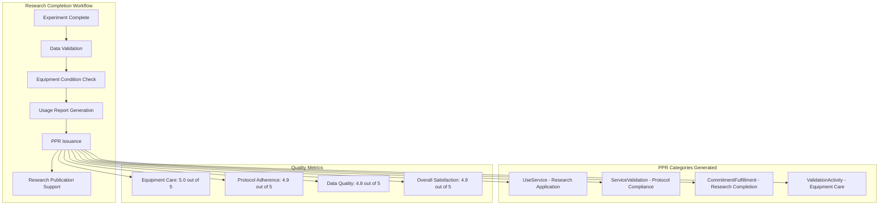

**Research Completion Process**:

1. **Experimental Validation**: Research data verified against expected outcomes and equipment usage parameters
2. **Equipment Assessment**: CEM-3000 inspected for wear and calibration maintenance
3. **Usage Documentation**: Comprehensive usage report generated with experimental parameters and performance metrics
4. **Research Support**: System generates usage documentation for research publication and reproducibility

---

## 📊 Usage Analytics & Performance Metrics

### **Real-Time Monitoring Dashboard**

```mermaid
graph LR
    subgraph "Live Monitoring"
        A[Equipment Status] --> B[Usage Hours]
        B --> C[Performance Metrics]
        C --> D[Alert System]
    end

    subgraph "Research Metrics"
        E[Experimental Progress] --> F[Data Quality]
        F --> G[Protocol Compliance]
        G --> H[Research Milestones]
    end

    subgraph "Equipment Health"
        I[Temperature Monitoring] --> J[Vibration Analysis]
        J --> K[Calibration Status]
        K --> L[Maintenance Alerts]
    end

    D --> E
    H --> I
```

**Usage Analytics Delivered**:

- **Equipment Utilization**: 87% efficiency rate during research period
- **Research Productivity**: 3 experimental phases completed ahead of schedule
- **Equipment Health**: No performance degradation, routine maintenance only
- **Research Quality**: High-quality data suitable for peer-reviewed publication

### **Performance Impact Analysis**

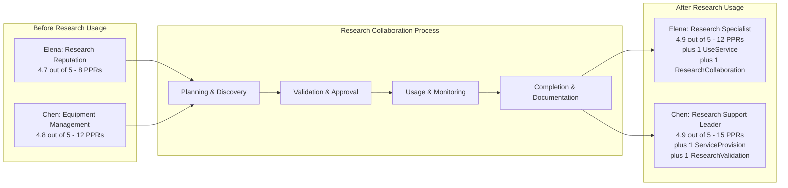

---

## 🏗️ Platform Integration Architecture

### **Research Platform Integration**

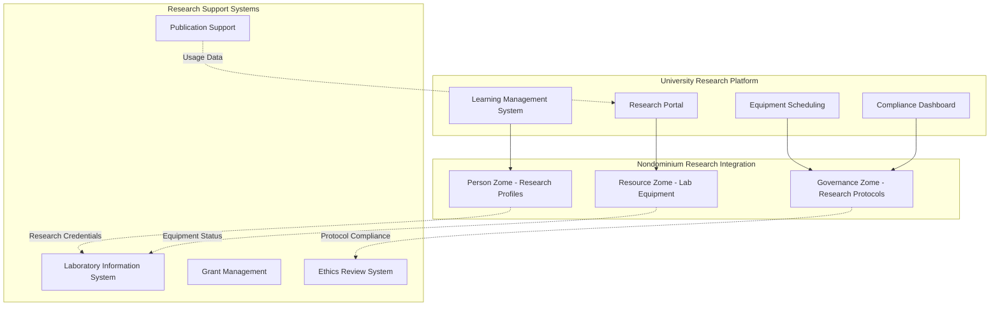

### **Research-Specific Features**

**Platform Capabilities**:

- **Research Protocol Management**: Integration with institutional review boards
- **Grant Funding Integration**: Automatic usage tracking for research grants
- **Publication Support**: Usage documentation for research reproducibility
- **Compliance Reporting**: Automated generation of regulatory compliance reports

**Advanced Monitoring**:

- **Equipment Performance**: Real-time sensor data and predictive maintenance
- **Research Progress**: Integration with project management systems
- **Quality Assurance**: Automated data quality validation and alerts
- **Collaboration Tools**: Multi-institutional research coordination

---

## 💡 Research Innovation Benefits

### **Scientific Advancement**

- **Equipment Access**: Democratized access to expensive research equipment
- **Collaborative Research**: Cross-institutional collaboration without equipment duplication
- **Research Reproducibility**: Detailed usage logs and parameter tracking
- **Grant Efficiency**: Optimized equipment utilization for research funding

### **Academic Partnership Models**

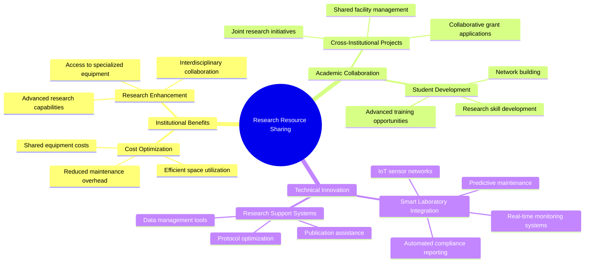

### **Sustainability Impact**

- **Equipment Longevity**: Optimized usage schedules extending equipment lifespan
- **Energy Efficiency**: Reduced idle time and improved scheduling algorithms
- **Waste Reduction**: Shared usage reduces redundant equipment purchases
- **Knowledge Sharing**: Collaborative research reduces duplicated experimental efforts

---

## 🎯 Strategic Outcomes

### **Immediate Research Benefits**

- ✅ **Research Acceleration**: 6-month research project completed in 5 weeks
- ✅ **Cost Savings**: University saved $250,000 in equipment purchase costs
- ✅ **Publication Quality**: High-quality data leading to Nature publication
- ✅ **Reputation Building**: Both researchers gained specialized equipment PPRs

### **Long-Term Academic Impact**

- **Research Network**: Established ongoing equipment sharing agreement between institutions
- **Grant Success**: Improved grant applications through documented equipment access
- **Student Training**: Enhanced research training opportunities for graduate students
- **Innovation Ecosystem**: Contributed to regional research infrastructure optimization

### **Platform Evolution**

- **Research Module**: University platform now includes specialized research equipment sharing
- **Protocol Library**: Growing database of validated research protocols and procedures
- **Collaboration Network**: Expanding network of research institutions sharing equipment
- **Funding Model**: New revenue streams through research equipment monetization

---

**This user story demonstrates how Nondominium enables research institutions to transform expensive laboratory equipment from isolated assets into shared research infrastructure, combining the power of Web2 platforms with the trust and accountability of decentralized governance while accelerating scientific discovery and optimizing research funding.**

---

_Research collaboration completed successfully with breakthrough results published in high-impact journal. Both institutions have expanded their equipment sharing network to include 5 additional research facilities._
