# Private Participation Receipts (PPR)

## Overview

Private Participation Receipts are cryptographically signed, cumulative records stored as private entries in an agent's source chain. They serve as proof of reliable participation in the nondominium network and form the foundation for a generative reputation system.

## Core Principles

- **Bi-directional Issuance**: Receipts are issued between agents involved in each economic interaction
- **Cryptographic Integrity**: All receipts are cryptographically signed for authenticity
- **Multi-role Support**: Agents can accumulate receipts across multiple roles simultaneously
- **Privacy Preservation**: Receipt details remain private while enabling reputation derivation
- **ValueFlows Compliance**: Modeled as specialized Claims within the ValueFlows ontology

## Fundamental Concepts

### Commitments and Fulfillments
- **Commitments**: Actions (resource creation, transfer, maintenance) are formally committed by agents
- **Validations**: Fulfillments that confirm commitments have been properly executed
- **Good Faith Usage**: Users commit to honest usage practices (reporting damage, avoiding monopolization)

### Receipt Generation Logic
- **Two Receipts Per Action**: Each economic interaction generates exactly 2 bi-directional receipts between participating agents
- **Implicit Resource Validation**: Resource validation is implicit through agent validation (except for creation events)
- **Agent-Focused**: Receipts track agent behavior and reliability, not resource state changes

## PPR Issuance Categories

### 1. Genesis Role - Network Entry

#### Resource Creation Events

**1.1 Resource Creation & Validation (Single Transaction)**
- **Trigger**: A resource is registered on the network and validated by another agent
- **Generated Receipts** (2 total):
  1. **Creator Agent**: Receives "successful resource contribution" receipt
  2. **Validator Agent**: Receives "network validation performed" receipt
- **Special Case**: Resource creation is the only event requiring explicit validation receipts, as it establishes the resource's entry into the network

### 2. Core Usage Role - Custodianship

#### Custody Transfer Events
**2.1 Resource Custody Transfer**
- **Trigger**: Resource custody is transferred between agents
- **Generated Receipts** (2 total):
  1. **Outgoing Custodian**: Receives "responsible custody transfer" receipt
  2. **Incoming Custodian**: Receives "custody acceptance" receipt
- **Note**: Resource validation is implicit through the custodian agents' reliability; no separate validation receipts needed

### 3. Intermediate Roles - Specialized Services

#### Role Chaining Mechanics
- **Multi-role Agents**: Agents can hold multiple intermediate roles simultaneously
- **Action Chaining**: Agents can chain multiple actions (transport → repair → transport) within a single commitment
- **Participant Structure**: Involves 2-3 agents (original custodian, intermediate service provider, final recipient)

#### Flexibility Features
- **Dynamic Recipients**: Final recipient may differ from original custodian
- **Self-Managed Chains**: Intermediate steps don't require external validation
- **Atomic Transactions**: Entire chain treated as single commitment/fulfillment cycle

#### Specialized Service Receipts

**3.1 Maintenance Service**
- **Commitment Phase**: Service provider commits to maintenance duties
- **Generated Receipts** (2 total):
  1. **Maintenance Agent**: Receives "maintenance commitment accepted" receipt
  2. **Custodian Agent**: Receives "Good faith transfer" receipt
- **Fulfillment Phase**: Commitment is fulfilled through completed maintenance and resource available again
- **Generated Receipts** (2 total):
  1. **Maintenance Agent**: Receives "maintenance fulfillment completed" receipt
  2. **Resource Recipient**: Receives "maintained resource claim verified" receipt

**3.2 Storage Service**
- **Commitment Phase**: Service provider commits to storage duties
- **Generated Receipts** (2 total):
  1. **Storage Agent**: Receives "storage commitment accepted" receipt
  2. **Custodian Agent**: Receives "Good faith transfer" receipt
- **Fulfillment Phase**: Commitment is fulfilled through resource custodian transfer
- **Generated Receipts** (2 total):
  1. **Storage Agent**: Receives "storage fulfillment completed" receipt
  2. **Resource Recipient**: Receives "stored resource claim verified" receipt

**3.3 Transport Service**
- **Commitment Phase**: Service provider commits to transport duties
- **Generated Receipts** (2 total):
  1. **Transport Agent**: Receives "transport commitment accepted" receipt
  2. **Custodian Agent**: Receives "Good faith transfer" receipt
- **Fulfillment Phase**: Commitment is fulfilled through completed transport and resource delivery
- **Generated Receipts** (2 total):
  1. **Transport Agent**: Receives "transport fulfillment completed" receipt
  2. **Resource Recipient**: Receives "transported resource claim verified" receipt

#### Example Workflow: Transport + Repair Service
```
Initial State: Lynn (custodian) → Resource needs repair
Service Request: Lynn requests Bob (transport + repair credentials) to service resource

Commitment Phase:
1. Bob commits to: receive → transport → repair → transport → deliver
2. Mutual signatures create bi-directional receipts:
   - Lynn → Bob: "Service commitment accepted" receipt
   - Bob → Lynn: "Good faith transfer" receipt

Execution Phase:
3. Bob executes action chain without intermediate validation
4. Internal status changes (transport → repair → transport) are self-managed

Completion Phase:
5. Resource delivered to final recipient (Lynn or designated third party)
6. Final bi-directional receipts:
   - Bob → Recipient: "Service completion" receipt
   - Recipient → Bob: "Custody transfer acknowledgment" receipt
```

## Additional PPR Contexts

### 4. Network Governance
- **Dispute Resolution Participation**: Receipts for constructive participation in conflict resolution
- **Validation Activities**: Receipts for performing validation duties beyond specific transactions
- **Rule Compliance**: Receipts for consistent adherence to governance protocols

### 5. Quality Assurance
- **Economic Event Completion**: Receipts for successfully completing any EconomicEvent
- **Commitment Fulfillment**: Receipts when claims properly link commitments to their fulfillment
- **Performance Standards**: Receipts for meeting or exceeding quality thresholds

## ValueFlows Integration

PPRs are implemented as specialized `PrivateParticipationClaim` entries that extend the standard ValueFlows Claim structure:

```rust
pub struct PrivateParticipationClaim {
    // Standard ValueFlows fields
    pub fulfills: ActionHash,           // References the commitment fulfilled
    pub fulfilled_by: ActionHash,       // References the economic event
    pub claimed_at: Timestamp,

    // PPR-specific extensions
    pub claim_type: ParticipationClaimType,
    pub performance_metrics: PerformanceMetrics,
    pub bilateral_signature: CryptographicSignature,
}
```

This design maintains ValueFlows compliance while enabling the cumulative reputation system essential for nondominium governance.

## Resource End-of-Life Management

### 6. Resource Decommissioning

#### Critical Lifecycle Completion
Resources require formal end-of-life processing to prevent abuse vectors and maintain network integrity.

**6.1 Resource End-of-Life Declaration**
- **Trigger**: Resource becomes permanently unusable, damaged beyond repair, or deliberately retired
- **Security Concern**: This event is a potential attack vector where agents might claim resources are "destroyed" to steal or monopolize them
- **Generated Receipts** (2 total):
  1. **Declaring Agent**: Receives "end-of-life declaration submitted" receipt
  2. **Validator Agent**: Receives "end-of-life validation performed" receipt

#### Strict Validation Requirements
To prevent end-of-life abuse:

- **Multiple Validators Required**: Minimum 2-3 validators must confirm end-of-life status
 - The number of validators required can be adjusted based on the resource's value and sensitivity
 - The declarator agent can't be a validator and even less than the disposal agent
 - The validators must be experts (maintainers) that can validate the resource's condition and authenticity
- **Evidence Documentation**: Physical evidence (photos, inspection reports) required
- **Validator Accountability**: Validators become liable for false end-of-life approvals
- **Historical Review**: Past custodians notified and can challenge the declaration
- **Time-Delayed Finalization**: 7-14 day challenge period before final decommissioning
- **Reputation Impact**: False end-of-life declarations severely impact declaring agent's reputation
- **Resource final transfer**: Resource can not stay with the declaring agent. Validators can transfer the resource to a storage for broken resource in waiting for reparation attempt or definitively decommission it.

#### Complete Resource Lifecycle
```
Genesis → Active Use → Service Cycles → End-of-Life → Decommissioned
   ↓         ↓             ↓              ↓             ↓
Creation  Transfers   Maintenance    Declaration   Validation
Receipt   Receipts    Receipts       Receipt       Receipt
```

This comprehensive lifecycle ensures complete accountability from resource creation through final decommissioning, with enhanced security measures protecting against end-of-life abuse vectors.

## PPR Process Flow Diagram

```mermaid
graph TD
    %% Genesis Phase
    subgraph Genesis["Genesis Phase"]
        RC[Resource Creation]
        Creator[Creator Agent]
        Validator1[Validator Agent]
        CreatorReceipt[Receipt: Resource Contribution]
        ValidatorReceipt[Receipt: Network Validation]

        RC --> Creator
        RC --> Validator1
        Creator --> CreatorReceipt
        Validator1 --> ValidatorReceipt
    end

    %% Active Use Phase
    subgraph ActiveUse["Active Use Phase"]
        Transfer[Custody Transfer]
        CustodianOut[Outgoing Custodian]
        CustodianIn[Incoming Custodian]
        OutReceipt[Receipt: Responsible Transfer]
        InReceipt[Receipt: Custody Acceptance]

        Transfer --> CustodianOut
        Transfer --> CustodianIn
        CustodianOut --> OutReceipt
        CustodianIn --> InReceipt
    end

    %% Service Phase
    subgraph ServicePhase["Service Phase"]
        ServiceCommitment[Service Commitment]
        ServiceFulfillment[Service Fulfillment]
        ServiceAgent[Service Provider]
        CustodianAgent[Custodian Agent]
        ResourceRecipient[Resource Recipient]

        CommitmentReceipt1[Receipt: Commitment Accepted]
        CommitmentReceipt2[Receipt: Good Faith Transfer]
        FulfillmentReceipt1[Receipt: Fulfillment Completed]
        FulfillmentReceipt2[Receipt: Resource Claim Verified]

        ServiceCommitment --> ServiceAgent
        ServiceCommitment --> CustodianAgent
        ServiceAgent --> CommitmentReceipt1
        CustodianAgent --> CommitmentReceipt2

        ServiceFulfillment --> ServiceAgent
        ServiceFulfillment --> ResourceRecipient
        ServiceAgent --> FulfillmentReceipt1
        ResourceRecipient --> FulfillmentReceipt2
    end

    %% End of Life Phase
    subgraph EndOfLife["End-of-Life Phase"]
        EOLDeclaration[End-of-Life Declaration]
        DeclaringAgent[Declaring Agent]
        ExpertValidator[Expert Validator - 2-3 Required]
        PastCustodians[Past Custodians Notification]
        ChallengePeriod[7-14 Day Challenge Period]
        FinalDisposal[Final Disposal/Storage]
        ValidationReview[Validation Review]
        EOLReceipt[Receipt: EOL Declaration]
        ValidationReceipt[Receipt: EOL Validation]

        EOLDeclaration --> DeclaringAgent
        EOLDeclaration --> ExpertValidator
        EOLDeclaration --> PastCustodians

        ExpertValidator --> ChallengePeriod
        ChallengePeriod -->|No Challenges| FinalDisposal
        ChallengePeriod -->|Challenge Raised| ValidationReview

        DeclaringAgent --> EOLReceipt
        ExpertValidator --> ValidationReceipt
    end

    %% Phase Connections
    RC -->|Validated| Transfer
    Transfer -->|May Need Service| ServiceCommitment
    ServiceCommitment --> ServiceFulfillment
    ServiceFulfillment -->|Return to Use| Transfer
    Transfer -->|End of Lifecycle| EOLDeclaration

    class CreatorReceipt,ValidatorReceipt,OutReceipt,InReceipt,CommitmentReceipt1,CommitmentReceipt2,FulfillmentReceipt1,FulfillmentReceipt2,EOLReceipt,ValidationReceipt receiptStyle
    class Creator,Validator1,CustodianOut,CustodianIn,ServiceAgent,CustodianAgent,ResourceRecipient,DeclaringAgent,ExpertValidator agentStyle
    class RC,Transfer,ServiceCommitment,ServiceFulfillment,EOLDeclaration eventStyle
    class ChallengePeriod,ValidationReview,FinalDisposal securityStyle
```



### Diagram Key Features:

1. **Four Main Phases**: Genesis → Active Use → Service Cycles → End-of-Life
2. **Bi-directional Receipts**: Each interaction generates exactly 2 receipts between agents
3. **Security Constraints**: Visual indicators for end-of-life restrictions
4. **Validation Requirements**: Shows multi-validator requirement and challenge period
5. **Lifecycle Loops**: Service phase can cycle multiple times during active use
6. **Complete Accountability**: Every phase tracked with appropriate receipts
