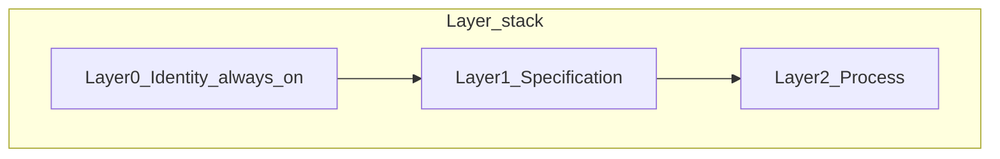

# nondominium Implementation Plan

## 1. Executive Summary

This plan details the phased implementation of the nondominium hApp, a decentralized, organization-agnostic resource management system built on Holochain and ValueFlows. The implementation builds incrementally on the existing working foundation to deliver Economic Processes, Private Participation Receipt (PPR) reputation, agent capability progression, and cross-zome coordination, while aligning with the **generic Nondominium Object (NDO)** model where that work is scheduled.

**MVP vs post-MVP (normative boundary):** Per [requirements.md §2.3](requirements/requirements.md), the **current MVP** in this repository is the combination of `ResourceSpecification`, `EconomicResource`, and `GovernanceRule` with governance-as-operator patterns. **NDO-wide** requirements (three-layer model, lifecycle versus operational state, capability slots, migration, REQ-NDO-*) live in [ndo_prima_materia.md](requirements/ndo_prima_materia.md) and are **not** implied by the MVP DNA until explicitly implemented. Phases 2–4 below are mostly **MVP core** delivery; the **NDO model and migration** track extends or refactors that foundation when scheduled. Post-MVP agent ontology (REQ-AGENT-*, REQ-NDO-AGENT-*) is specified in [requirements.md §4.4](requirements/requirements.md), with background analysis in [archives/agent.md](archives/agent.md).

### 1.1 Requirements map (normative sources)

| Source | Role |
|--------|------|
| [requirements.md](requirements/requirements.md) | PRD; REQ-USER-*, REQ-RES-*, REQ-GOV-*, REQ-PROC-*, REQ-AGENT-* (§4.4 post-MVP agent ontology) |
| [ndo_prima_materia.md](requirements/ndo_prima_materia.md) | NDO layers (L0/L1/L2), lifecycle and operational state, capability surface, COP framing; REQ-NDO-* (§9), migration (§10) |
| [ui_design.md](requirements/ui_design.md) | UI specifications (complements [specifications/ui_architecture.md](../specifications/ui_architecture.md)) |
| [post-mvp/unyt-integration.md](requirements/post-mvp/unyt-integration.md) | Unyt / RAVE / economic agreement slots (REQ-NDO-CS-07–CS-11) |
| [post-mvp/flowsta-integration.md](requirements/post-mvp/flowsta-integration.md) | Flowsta identity slots and Tier 1/2 governance (REQ-NDO-CS-12–CS-15) |
| [post-mvp/many-to-many-flows.md](requirements/post-mvp/many-to-many-flows.md) | N-ary custody and ValueFlows events; plan after shared custody / `AgentContext` model matures |
| [post-mvp/versioning.md](requirements/post-mvp/versioning.md) | Version DAG for resources and app-as-resource; complements REQ-NDO-L1-03 (multiple specs per NDO) |
| [post-mvp/digital-resource-integrity.md](requirements/post-mvp/digital-resource-integrity.md) | Manifests and verifiable digital assets; aligns with Layer 1 `DigitalAsset` capability slots (prima materia §9.2) |
| [post-mvp/resource-transport-flow-protocol.md](requirements/post-mvp/resource-transport-flow-protocol.md) | Multi-dimensional transport/flow semantics over economic events |
| [post-mvp/valueflows-dsl.md](requirements/post-mvp/valueflows-dsl.md) | DSL for recipes, bulk bootstrap, scripted coordination (operational tooling track) |
| [post-mvp/lobby-dna.md](requirements/post-mvp/lobby-dna.md) | Multi-network federation: Lobby DNA (public registry), Group DNA (per-group coordination), NDO DNA extensions (`NdoHardLink`, `Contribution`, `Agreement`); dual deployment (standalone + Moss applet) — REQ-LOBBY-*, REQ-GROUP-*, REQ-NDO-EXT-* |
| [archives/resources.md](archives/resources.md), [archives/governance.md](archives/governance.md) | Ontology and gap-analysis context (non-normative for REQ IDs) |

---

## 2. Implementation Principles

- **Incremental Enhancement**: Build on existing working code without breaking changes, extending functionality through new modules and functions
- **ValueFlows Compliance**: All data structures and flows adhere to the ValueFlows standard with Economic Process integration
- **Agent-Centric Design**: All data and validation flows from the perspective of individual agents with capability progression
- **Progressive Trust**: Agents earn capabilities through validation (Simple → Accountable → Primary Accountable Agent) with PPR reputation tracking
- **Embedded Governance**: Rules and access control are enforced at the resource and agent level with Economic Process integration
- **Capability-Based Security**: All access is managed through Holochain capability tokens with role-based process access
- **Privacy-Preserving Accountability**: PPR system enables reputation without compromising privacy through selective disclosure
- **Process-Aware Infrastructure**: Economic Processes (Use, Transport, Storage, Repair) integrated throughout the system architecture
- **NDO alignment**: When implementing the NDO track, follow pay-as-you-grow **layer activation** (L0 identity always on; L1 specification and L2 process when complexity demands) and keep **LifecycleStage** (on identity) orthogonal to **OperationalState** (on resource instances), with the governance zome as state-transition operator (REQ-NDO-LC-02, REQ-NDO-OS-02)

---

## 3. Architecture alignment (NDO prima materia)

The **three-layer model** ([ndo_prima_materia.md §4](requirements/ndo_prima_materia.md)) structures resources as:

- **Layer 0 — Identity**: `NondominiumIdentity` (stable anchor, tombstone at end of life); only `lifecycle_stage` evolves after creation (REQ-NDO-L0-*).
- **Layer 1 — Specification**: Activated by `NDOToSpecification` → `ResourceSpecification` (governance rules, discoverable form); may be dormant/archived while L0 remains (REQ-NDO-L1-*).
- **Layer 2 — Process**: Activated by `NDOToProcess` → ValueFlows `Process`; hosts commitments, claims, events, PPRs (REQ-NDO-L2-*).

**Two state dimensions** ([§5](requirements/ndo_prima_materia.md)): `LifecycleStage` lives on the identity (maturity of the artefact); `OperationalState` lives on `EconomicResource` (transient process condition). Transitions on one must not imply transitions on the other (REQ-NDO-OS-04).

---

## 4. Implementation tracks

Work below is grouped into **parallel tracks** so MVP delivery, NDO migration, agent ontology, integrations, and extended specs are not confused as a single serial timeline.

| Track | Intent | Primary references |
|--------|--------|-------------------|
| **MVP core** | Phases 2–4 in Section 5: private data sharing, economic processes, PPR, promotion, security, cross-zome coordination | [requirements.md](requirements/requirements.md) REQ-USER / REQ-PROC / REQ-GOV |
| **NDO model and migration** | `NondominiumIdentity`, `NDOToSpecification` / `NDOToProcess`, holonic links, `CapabilitySlot`, lifecycle plus operational split, faceted discovery links, one-time migration (REQ-NDO-MIG-*) | [ndo_prima_materia.md](requirements/ndo_prima_materia.md) §§8–10, §9 |
| **Agent ontology** | REQ-AGENT-* / REQ-NDO-AGENT-* items under Phases 2–4 | [requirements.md §4.4](requirements/requirements.md); [archives/agent.md](archives/agent.md) for OVN background |
| **Unyt / Flowsta** | Phased integration; governance enforcement in later phases | Section 12.2–12.3; REQ-NDO-CS-07–CS-15 |
| **Extended post-MVP** | Many-to-many flows, versioning, digital integrity, RTP-FP, VF DSL, **Lobby DNA federation layer** — reference and ordering only in Section 12.5–12.6 | `documentation/requirements/post-mvp/*.md` |

**Phase 2.2 and the NDO track:** Checklists for `LifecycleStage` / `OperationalState`, split discovery links, and process-aware resource work **implement REQ-NDO-LC-*, REQ-NDO-OS-*, and parts of REQ-NDO-L2-*** once `NondominiumIdentity` and NDO links exist; until then, some items remain preparatory. Full L0-first creation and migration follow Section 12.1 and REQ-NDO-MIG-*.

---

## 5. Implementation Phases

### Phase 1: Foundation Layer ✅ **COMPLETED** (Existing Working Code)

#### 3.1 Agent Identity & Role System (`zome_person`) ✅ **COMPLETED**

- [x] Implement `Person` (public info) and `PrivateData` (private entry, PII).
- [x] Implement `PersonRole` entry with validation metadata and links to validation receipts.
- [x] **Modular Architecture**: Refactored into `person.rs`, `private_data.rs`, `role.rs` modules
- [x] **Comprehensive Error Handling**: PersonError enum with detailed error types
- [x] **Core Functions**: Profile management, role assignment, private data storage
- [x] **Testing**: Comprehensive test suite with foundation, integration, and scenario tests

#### 3.2 Resource Management (`zome_resource`) ✅ **COMPLETED**

- [x] Implement `ResourceSpecification` with embedded governance rules.
- [x] Implement `EconomicResource` with custodian tracking and state management.
- [x] **Modular Architecture**: Refactored into `resource_specification.rs`, `economic_resource.rs`, `governance_rule.rs`
- [x] **Comprehensive Error Handling**: ResourceError enum with governance violation support
- [x] **Signal System**: Complete post-commit signal handling for DHT coordination
- [x] **Core Functions**: Resource specification and economic resource CRUD operations
- [x] **Testing**: Comprehensive test suite with integration and scenario coverage

#### 3.3 Governance Foundation (`zome_gouvernance`) ✅ **CORE COMPLETE**

- [x] **Basic VfAction Enum**: Type-safe economic action vocabulary
- [x] **Validation Infrastructure**: ValidationReceipt creation and management
- [x] **Economic Event Logging**: Basic economic event recording
- [x] **Cross-Zome Functions**: Core validation functions for resource and agent validation
- [x] **Error Handling**: GovernanceError enum with comprehensive error types

---

### Phase 2: Enhanced Governance & Process Integration 🚀 **HIGH PRIORITY**

#### 2.1 Enhanced Private Data Sharing (`zome_person`) 📋 **NEXT SPRINT**

_Building on existing private data infrastructure without breaking changes_

- [ ] **Data Access Request System** (NEW):
  - [ ] `DataAccessRequest` entry type with status tracking
  - [ ] `request_private_data_access()` function for requesting specific fields
  - [ ] `respond_to_data_request()` function for approving/denying requests
  - [ ] Bidirectional linking system for request tracking
- [ ] **Data Access Grant System** (NEW):
  - [ ] `DataAccessGrant` entry type with expiration and field control
  - [ ] `grant_private_data_access()` function for direct grants
  - [ ] `get_granted_private_data()` function for accessing granted data
  - [ ] `revoke_data_access_grant()` function for revoking access
- [ ] **Governance Integration** (NEW):
  - [ ] `get_private_data_for_governance_validation()` function for cross-zome access
  - [ ] Agent promotion workflow integration with private data validation
  - [ ] Enhanced role validation with identity verification

#### 2.2 Economic Process Infrastructure (`zome_resource`) 📋 **CURRENT SPRINT**

_Extending existing resource management with process-aware workflows. **NDO track overlap:** state split and discovery links map to REQ-NDO-LC-*, REQ-NDO-OS-*, REQ-NDO-OS-06; process and PPR linkage align with REQ-NDO-L2-* once Layer 2 is modeled via `NDOToProcess` (see [ndo_prima_materia.md §4.4](requirements/ndo_prima_materia.md))._

- [ ] **Economic Process Data Structures** (NEW):
  - [ ] `EconomicProcess` entry type with status tracking and role requirements
  - [ ] `ProcessStatus` enum (Planned, InProgress, Completed, Suspended, Cancelled, Failed)
  - [ ] **Split `ResourceState` into `LifecycleStage` + `OperationalState`** (see ndo_prima_materia.md Section 5):
    - [ ] `LifecycleStage` enum on `NondominiumIdentity` (Layer 0) — maturity/evolutionary phase
    - [ ] `OperationalState` enum on `EconomicResource` (Layer 2) — current process condition (`Available`, `Reserved`, `InTransit`, `InStorage`, `InMaintenance`, `InUse`, `PendingValidation`)
    - [ ] Update governance zome state transition logic to manage both enums independently
    - [ ] Split `ResourcesByState` link type into `ResourcesByLifecycleStage` and `ResourcesByOperationalState`
  - [ ] `OperationalState` transitions aligned with process outcomes (begin/end of transport, storage, maintenance processes)
- [ ] **Process Management Functions** (NEW):
  - [ ] `initiate_economic_process()` with role-based access control
  - [ ] `complete_economic_process()` with state change validation
  - [ ] Process query functions by type, status, and agent
  - [ ] Process-resource relationship tracking
- [ ] **Enhanced Cross-Zome Integration** (EXTEND):
  - [ ] Role validation calls to person zome for process initiation
  - [ ] Governance zome integration for process validation and PPR generation
  - [ ] Private data coordination for custody transfers

#### 2.3 Private Participation Receipt (PPR) System (`zome_gouvernance`) 🌟 **MAJOR FEATURE**

_Adding comprehensive reputation system on top of existing governance infrastructure_

- [ ] **PPR Data Structures** (NEW):
  - [ ] `PrivateParticipationClaim` entry type (private entry)
  - [ ] `ParticipationClaimType` enum with 16 claim categories
  - [ ] `PerformanceMetrics` structure for quantitative assessment
  - [ ] `CryptographicSignature` structure for bilateral authentication
- [ ] **PPR Management Functions** (NEW):
  - [ ] `issue_participation_receipts()` for bi-directional PPR issuance
  - [ ] `sign_participation_claim()` for cryptographic verification
  - [ ] `validate_participation_claim_signature()` for authenticity validation
  - [ ] `get_my_participation_claims()` for private receipt retrieval
  - [ ] `derive_reputation_summary()` for privacy-preserving reputation calculation
- [ ] **Process Integration** (NEW):
  - [ ] Automatic PPR generation for all Commitment-Claim-Event cycles
  - [ ] Economic Process completion triggers specialized PPR categories
  - [ ] Agent promotion generates appropriate PPR types

#### 2.4 Complete Agent Capability Progression 🎯 **GOVERNANCE CRITICAL**

_Implementing the full Simple → Accountable → Primary Accountable Agent progression_

- [ ] **Enhanced Agent Promotion** (EXTEND existing `promote_agent_to_accountable`):
  - [ ] Cross-zome coordination with governance validation
  - [ ] Private data quality assessment for promotion eligibility
  - [ ] Automatic PPR generation for promotion activities
  - [ ] Capability token progression (general → restricted → full)
- [ ] **Specialized Role Validation** (EXTEND existing role assignment):
  - [ ] Enhanced role validation for Transport, Repair, Storage roles
  - [ ] Primary Accountable Agent validation requirements
  - [ ] Role-specific PPR generation for validation activities
- [ ] **Cross-Zome Validation Workflows** (NEW):
  - [ ] Resource validation during first access events
  - [ ] Agent identity validation with private data verification
  - [ ] Specialized role validation with existing role holder approval

**Agent Ontology Items (Post-MVP, Phase 2 — see [requirements.md §4.4](requirements/requirements.md) and [archives/agent.md](archives/agent.md) §5.3; `REQ-AGENT-*`):**

- [ ] **[G13] Fix `request_role_promotion` stub** (HIGH PRIORITY — broken workflow):
  - [ ] Create a real `RolePromotionRequest` entry type in `zome_person` integrity, replacing the current placeholder hash return
  - [ ] Add `AllPromotionRequests` anchor link for approver discovery
  - [ ] Add `AgentToPromotionRequest` and `PromotionRequestToAgent` bidirectional links
  - [ ] Implement `get_pending_promotion_requests()` query function for authorised approvers
  - [ ] See `REQ-AGENT-16` and code TODO in `role.rs`
- [ ] **[G6] `AffiliationRecord` entry type** (NEW):
  - [ ] Define `AffiliationRecord` struct: `agent`, `network_id`, `documents_acknowledged: Vec<DocumentAck>`, `signed_at`, `signature`, `witness: Option<AgentPubKey>`
  - [ ] Define `DocumentAck` struct: `document_hash`, `document_title`, `document_version`
  - [ ] Implement `create_affiliation_record(input)` — agent cryptographically signs ToP, Nondominium & Custodian agreement, Benefit Redistribution Algorithm
  - [ ] Link: `agent_pubkey → affiliation_record_hash` (`AgentToAffiliation`)
  - [ ] UI: prompt agent to create `AffiliationRecord` during `Person` creation flow
  - [ ] See `REQ-AGENT-05`
- [ ] **[G2] Derived affiliation state** (NEW — computed, not stored):
  - [ ] Implement `get_affiliation_state(agent_pubkey) -> AffiliationState` as a composed query:
    - `UnaffiliatedStranger`: no `Person` entry
    - `CloseAffiliate`: `Person` exists but no `AffiliationRecord` and zero contributions
    - `ActiveAffiliate`: `AffiliationRecord` exists + tracked contributions (economic events) within configurable recency window
    - `CoreAffiliate`: `ActiveAffiliate` whose PPR-derived contribution rate exceeds configurable threshold
    - `InactiveAffiliate`: `AffiliationRecord` exists, previously active, but no contributions within recency window
  - [ ] Expose affiliation state as part of `get_person_profile()` response
  - [ ] Use affiliation state in governance access decisions (Active/Core affiliates for governance participation)
  - [ ] See `REQ-AGENT-04`

---

### Phase 3: Advanced Security & Cross-Zome Coordination 🔒 **PRODUCTION READINESS**

#### 3.1 Enhanced Capability-Based Security

_Building on existing capability infrastructure with Economic Process integration_

- [ ] **Progressive Capability Tokens** (EXTEND):
  - [ ] `general_access` tokens for Simple Agents (existing foundation)
  - [ ] `restricted_access` tokens for Accountable Agents (PPR-enabled)
  - [ ] `full_access` tokens for Primary Accountable Agents (custodianship-enabled)
  - [ ] Automatic capability progression triggered by PPR milestones
- [ ] **Economic Process Access Control** (NEW):
  - [ ] Role-based process access validation (Transport, Repair, Storage)
  - [ ] Dynamic capability checking for specialized Economic Processes
  - [ ] PPR-derived reputation influencing process access permissions
- [ ] **Function-Level Security** (EXTEND):
  - [ ] Apply capability requirements to all new Economic Process functions
  - [ ] Enhanced private data access control with granular field permissions
  - [ ] Cross-zome capability validation for complex workflows

**Agent Ontology Items (Post-MVP, Phase 3 — see [requirements.md §4.4](requirements/requirements.md) and [archives/agent.md](archives/agent.md) §5.3; `REQ-AGENT-*`):**

- [ ] **[G1] `AgentEntityType` configuration** (NEW):
  - [ ] Define `AgentEntityType` enum in `zome_person` integrity: `Individual`, `Collective(String)`, `Project(ActionHash)`, `Network(ActionHash)`, `Bot { capabilities: Vec<String>, operator: AgentPubKey }`, `ExternalOrganisation(String)`
  - [ ] Define `AgentContext` entry: `agent_type: AgentEntityType`, `person_hash: Option<ActionHash>`, `created_at`, `network_seed`
  - [ ] Collective, Project, and Network types reference an NDO hash — no separate `Person` entry required
  - [ ] Update governance role-gating logic to account for non-individual agent types
  - [ ] See `REQ-AGENT-01`, `REQ-AGENT-02`
- [ ] **[G15] CapabilitySlot on Person** (NEW):
  - [ ] Implement `CapabilitySlot` link type from `Person` entry hash to external capability targets (DID documents, credential wallets, reputation oracles)
  - [ ] Reuse `CapabilitySlotTag` / `SlotType` pattern from `ndo_prima_materia.md` §8.3 — same pattern applied at agent identity level
  - [ ] Implement `attach_agent_capability_slot(person_hash, slot_type, target_hash)` and `get_agent_capability_slots(person_hash)`
  - [ ] See `REQ-AGENT-11`
- [ ] **[G3] Composable `AgentProfile` view** (NEW):
  - [ ] Implement `get_agent_profile(agent_pubkey) -> AgentProfile` as a composed query — NOT a new stored entry:
    - Identity: `AgentPubKey`, `Person`, `AffiliationState`, `AgentEntityType`
    - Capability: `roles: Vec<PersonRole>`, `capability_level`, `capability_slots: Vec<CapabilitySlotInfo>`
    - Reputation: `reputation_summary: Option<ReputationSummary>`, `economic_reliability_score: Option<f64>`
    - Participation: `active_commitments_count`, `economic_events_count`, `resource_custodianships_count`
    - Social: `network_affiliations: Vec<NetworkAffiliation>`, `peer_vouches: Option<u32>`
    - Temporal: `joined_at`, `last_active_at`
  - [ ] Agent controls which sections are exposed by granting access to constituent entries
  - [ ] See `REQ-AGENT-07`
- [ ] **[G4] `AgentRelationship` link type** (NEW):
  - [ ] Define bidirectional `AgentRelationship` link type with typed tags: `Colleague`, `Collaborator`, `Trusted`, `Voucher`
  - [ ] Store as private links (agent-to-agent, not publicly discoverable)
  - [ ] Implement `create_agent_relationship(target, relationship_type)` and `get_my_relationships()`
  - [ ] See `REQ-AGENT-08`
- [ ] **[G5] Network affiliation links** (NEW):
  - [ ] Define `NetworkAffiliation` link type from `Person` hash to NDO instance hashes
  - [ ] Implement `add_network_affiliation(person_hash, ndo_hash, affiliation_type)` and `get_network_affiliations(person_hash)`
  - [ ] An agent's multi-network membership is visible as part of the composable `AgentProfile`
  - [ ] See `REQ-AGENT-09`
- [ ] **[G14] Configurable role taxonomy** (NEW):
  - [ ] Define `RoleDefinition` entry type: `role_name`, `capability_level`, `description`, `validation_requirements`, `network_id`
  - [ ] Replace hard-coded `RoleType` enum with `RoleDefinition` registry; predefined six roles created as default entries at network genesis
  - [ ] Update `assign_person_role` to accept any role name present in the network's `RoleDefinition` registry
  - [ ] See `REQ-AGENT-06`
- [ ] **[G1+Resource] Collective agent custodianship** (NEW — resource-agent integration):
  - [ ] Define `AgentContext` union type usable wherever `AgentPubKey` currently identifies a custodian or initiator
  - [ ] Update `EconomicResource.custodian` from `AgentPubKey` to `AgentContext`
  - [ ] Update `TransitionContext.target_custodian` from `Option<AgentPubKey>` to `Option<AgentContext>`
  - [ ] Update `NondominiumIdentity.initiator` from `AgentPubKey` to `AgentContext`
  - [ ] Update custody transfer validation to handle collective agent auth (no single private key — requires collective signature or designated operator key)
  - [ ] See `REQ-AGENT-02`, `resources.md §5.3`, `governance-operator-architecture.md §2.1`
- [ ] **[G2+Resource] Affiliation-gated resource access** (NEW — resource-agent integration):
  - [ ] Extend `GovernanceRule.rule_data` JSON schema to support `min_affiliation` condition: `"min_affiliation": "ActiveAffiliate" | "CoreAffiliate"`
  - [ ] Extend governance zome `evaluate_transition` to cross-zome query `zome_person` for requesting agent's `AffiliationState` when `min_affiliation` is present in an applicable GovernanceRule
  - [ ] Surface affiliation state as an enumerated result field in `GovernanceDecision.role_permissions` entries
  - [ ] Add `affiliation_gated_access: bool` flag to governance defaults engine output so UIs can surface relevant access requirements
  - [ ] Write integration tests: agent with `UnaffiliatedStranger` state rejected for `min_affiliation: ActiveAffiliate` governed resource; `ActiveAffiliate` agent accepted
  - [ ] See `REQ-AGENT-03`, `REQ-AGENT-05`, `resources.md §5.3 (Affiliation-gated resource access row)`, `governance-operator-architecture.md §2.1 TODO G2`

**Governance Agent Ontology Integration (Post-MVP, Phase 3 — see `governance.md §3.6`, `§6.4`, `§6.6`):**

- [ ] **[G1+Governance] Extend core governance entry types to AgentContext**:
  - [ ] `GovernanceTransitionRequest.requesting_agent`: `AgentPubKey` → `AgentContext`
  - [ ] `ResourceStateChange.initiated_by`: `AgentPubKey` → `AgentContext`
  - [ ] `ValidationReceipt.validator`: `AgentPubKey` → `AgentContext`
  - [ ] `EconomicEvent.provider` and `.receiver`: `AgentPubKey` → `AgentContext`
  - [ ] `Commitment.provider` and `.receiver`: `AgentPubKey` → `AgentContext`
  - [ ] `PrivateParticipationClaim.counterparty`: `AgentPubKey` → `AgentContext`
  - [ ] Implement `AgentContext` → `signing_key` resolution: for `Individual` = the key itself;
        for `Collective` = designated `PrimaryAccountableAgent` key from collective NDO;
        for `Bot` = operator `AgentPubKey`
  - [ ] See `REQ-GOV-16`, `governance.md §3.6.1`, `§6.6`
- [ ] **[G6+Governance] AffiliationRecord governance ceremony**:
  - [ ] Implement `create_affiliation_record()` in governance zome using `Commitment`/`EconomicEvent` cycle
  - [ ] Create `AffiliationRecordSigned` PPR (bilateral, private) on ceremony completion
  - [ ] Ensure `AffiliationState` derivation in `zome_person` reads `AffiliationRecord` presence from DHT
  - [ ] See `REQ-GOV-15`, `governance.md §3.6.3`, `§4.4`
- [ ] **[G2+Governance] Affiliation-gated governance access**:
  - [ ] Extend governance `evaluate_transition` to check `GovernanceRule.rule_data["min_affiliation"]`
        specifically for GOVERNANCE PARTICIPATION (distinct from resource access gating)
  - [ ] Implement governance_weight formula from `governance.md §6.4`:
        `affiliation_state` gate → 0 if `< ActiveAffiliate`; `core_multiplier` if `CoreAffiliate`
  - [ ] See `REQ-GOV-14`, `governance.md §6.4`

#### 3.2 Comprehensive Cross-Zome Coordination

_Ensuring atomic operations and consistency across the three-zome architecture_

- [ ] **Transaction Consistency** (NEW):
  - [ ] Atomic custody transfer operations spanning resource and governance zomes
  - [ ] Economic Process completion consistency across resource and governance validation
  - [ ] PPR generation consistency with resource state changes
- [ ] **Error Handling Coordination** (EXTEND):
  - [ ] Standardized error translation between zomes (implemented in docs)
  - [ ] Rollback mechanisms for failed cross-zome operations
  - [ ] Comprehensive error context preservation across zome boundaries
- [ ] **State Synchronization** (NEW):
  - [ ] Resource state changes coordinated with Economic Process status
  - [ ] Agent capability progression synchronized with PPR generation
  - [ ] Role assignments coordinated with governance validation workflows

#### 3.3 Advanced Validation & Dispute Resolution

_Building on basic validation infrastructure with sophisticated governance_

- [ ] **Enhanced Validation Schemes** (EXTEND):
  - [ ] 2-of-3, N-of-M reviewer support with PPR-weighted selection
  - [ ] Reputation-based validator selection for Economic Process validation
  - [ ] Multi-tiered validation for different resource and process types
- [ ] **Dispute Resolution Infrastructure** (NEW):
  - [ ] Edge-based dispute resolution involving recent interaction partners
  - [ ] PPR-based reputation context for dispute resolution
  - [ ] Private data access coordination for dispute mediation
- [ ] **Governance Rule Enforcement** (NEW):
  - [ ] Dynamic governance rule evaluation for Economic Processes
  - [ ] Conditional logic support for complex resource access rules
  - [ ] Community-driven governance parameter adjustment

---

### Phase 4: Network Maturity & Advanced Features 🌐 **SCALING & OPTIMIZATION**

#### 4.1 Advanced Economic Process Workflows

_Building sophisticated process chaining and automation on established foundation_

- [ ] **Process Chaining & Automation** (NEW):
  - [ ] Multi-step Economic Process workflows (Transport → Repair → Transport)
  - [ ] Conditional process logic based on resource state and agent performance
  - [ ] Automated process matching and agent selection based on PPR reputation
- [ ] **Advanced Resource Management** (EXTEND):
  - [ ] Resource booking and reservation system for Economic Processes
  - [ ] Time-based resource availability and process scheduling
  - [ ] Multi-agent process coordination and collaborative workflows
- [ ] **Performance Analytics** (NEW):
  - [ ] Economic Process performance tracking and optimization recommendations
  - [ ] Resource utilization analytics and efficiency metrics
  - [ ] Agent performance trends and specialization insights

**Agent Ontology Items (Post-MVP, Phase 4 — see [requirements.md §4.4](requirements/requirements.md) and [archives/agent.md](archives/agent.md) §5.3; `REQ-AGENT-*`):**

- [ ] **[G8] `PortableCredential` structure and export** (NEW):
  - [ ] Define `PortableCredential` struct: `issuing_network` (DNA hash), `agent`, `credential_type: PortableCredentialType`, `claims`, `issued_at`, `valid_until`, `issuer_signature`, `agent_signature`
  - [ ] `PortableCredentialType` variants: `RoleCredential(String)`, `ReputationCredential`, `CompetencyCredential(String)`, `AffiliationCredential`
  - [ ] Implement `issue_portable_credential(agent, credential_type)` — requires `PrimaryAccountableAgent` issuer + agent countersign
  - [ ] Implement `verify_portable_credential(credential)` — validates both signatures against issuing network DNA hash
  - [ ] See `REQ-AGENT-12` and `REQ-PPR-15`
- [ ] **[G7] ZKP capability proofs** (NEW — requires external ZKP library integration):
  - [ ] Research and select ZKP library compatible with Holochain WASM compilation target (e.g., `bellman`, `arkworks`, or ZKP-compatible VC layer)
  - [ ] Define `prove_capability(condition: CapabilityCondition) -> ZKProof` — e.g., "I have ≥ N claims of type T" without revealing counterparties or timestamps
  - [ ] Allow governance functions to accept ZKProof in lieu of raw `ReputationSummary` for access decisions
  - [ ] See `REQ-AGENT-13` and `REQ-PPR-14`
- [ ] **[G9] Sybil resistance mechanism** (NEW — configurable per network):
  - [ ] Option A — Social vouching: N existing `ActiveAffiliate` agents must co-sign a new agent's `AffiliationRecord`
  - [ ] Option B — Biometric opt-in: integrate with external biometric verification service; store proof hash in `AffiliationRecord`
  - [ ] Option C — Proof-of-Personhood: integrate with existing PoP protocols (e.g., Proof of Humanity, Worldcoin) as membrane proof
  - [ ] Network genesis configuration selects which option(s) apply
  - [ ] See `REQ-AGENT-15`
- [ ] **[G10] Pseudonymous participation mode** (NEW):
  - [ ] Allow ephemeral `AgentPubKey` to contribute without creating a `Person` entry or `AffiliationRecord`
  - [ ] PPRs are issued to the ephemeral key; reputation accumulates but is unlinkable to physical identity
  - [ ] Agent can optionally link an ephemeral key to their main `Person` entry later (explicit opt-in de-anonymisation)
  - [ ] See `REQ-AGENT-14`
- [ ] **[G11] AI/bot delegation (`DelegatedAgent`)** (NEW):
  - [ ] Define `DelegatedAgent` entry: `delegating_person: AgentPubKey`, `delegate_key: AgentPubKey`, `scope: Vec<String>`, `valid_until: Timestamp`, `signature`
  - [ ] Bot/AI keys act within declared scope; their actions are attributed to the delegating person for PPR purposes
  - [ ] See `REQ-AGENT-03`
- [ ] **[G12] `AgentNeedsWants` profile extension** (NEW):
  - [ ] Define optional `AgentNeedsWants` entry: `needs: Vec<ResourceNeed>`, `offers: Vec<ResourceOffer>`, `updated_at`
  - [ ] Link from `Person` hash; update via `update_agent_needs_wants(input)`
  - [ ] Enable network-level matching: `find_matching_agents(resource_type, quantity)` queries NeedsWants entries
  - [ ] See `REQ-AGENT-10`

#### 4.2 Advanced PPR & Reputation Systems

_Enhancing the reputation system with AI and cross-network capabilities_

- [ ] **Advanced Reputation Algorithms** (EXTEND):
  - [ ] Machine learning-based trust prediction and recommendation systems
  - [ ] Context-aware reputation weighting for different Economic Process types
  - [ ] Dynamic reputation thresholds based on network maturity and agent density
- [ ] **Cross-Network Reputation** (NEW):
  - [ ] PPR reputation portability across multiple nondominium networks
  - [ ] Federated identity management with reputation synchronization
  - [ ] Inter-network agent validation and reputation verification
- [ ] **Reputation-Based Governance** (NEW):
  - [ ] Dynamic capability levels based on PPR-derived reputation scores
  - [ ] Reputation-weighted validation schemes for community governance
  - [ ] Automated role progression based on performance metrics and community recognition

#### 4.3 Performance & Scalability Optimization

_Optimizing the system for large-scale network operation_

- [ ] **DHT & Query Optimization** (EXTEND):
  - [ ] Advanced DHT anchor strategies for efficient Economic Process discovery
  - [ ] Parallel validation processing for large-scale governance operations
  - [ ] Caching strategies for frequently accessed PPR and reputation data
- [ ] **Network Health & Monitoring** (NEW):
  - [ ] Real-time network health dashboards and metrics
  - [ ] Automated performance bottleneck detection and resolution
  - [ ] Predictive scaling based on Economic Process demand patterns
- [ ] **Cross-Zome Performance** (OPTIMIZE):
  - [ ] Optimized cross-zome call patterns for complex workflows
  - [ ] Batched operations for multiple Economic Process coordination
  - [ ] Efficient state synchronization across distributed agent networks

---

## 6. Quality Assurance

- **Test-Driven Development**: Write tests before implementation.
- **Incremental Integration**: Continuous integration between zomes.
- **Documentation-First**: Update specs before coding changes.
- **Unit, Integration, and Network Testing**: Validate all workflows, especially validation and promotion.

---

## 5. Risk Mitigation

- **Cross-Zome Dependencies**: Mitigated by interface design and testing.
- **Validation Complexity**: Addressed through modular validation functions.
- **Performance Bottlenecks**: Handled via incremental optimization and monitoring.
- **Validation Gaming**: Prevented through multi-reviewer schemes and audit trails.

---

## 8. Success Metrics & Implementation Tracking

### Phase 1 Achievements ✅ **FOUNDATION COMPLETE**

- [x] **Person Management**: Complete agent identity system with public/private data separation
- [x] **Resource Management**: Full resource specification and economic resource lifecycle
- [x] **Governance Foundation**: Basic validation infrastructure and cross-zome functions
- [x] **Modular Architecture**: Clean separation of concerns across all three zomes
- [x] **Comprehensive Testing**: Foundation, integration, and scenario test coverage
- [x] **Error Handling**: Robust error types and proper DHT signal handling

### Phase 2 Targets 🎯 **GOVERNANCE & PROCESSES**

- [ ] **Enhanced Private Data Sharing**: Request/grant workflows with time-limited grants (30-day maximum per capability metadata) and field-specific control
- [ ] **Economic Process Infrastructure**: Four structured processes (Use, Transport, Storage, Repair) with role-based access
- [ ] **PPR Reputation System**: Bi-directional Private Participation Receipts with cryptographic signatures
- [ ] **Agent Capability Progression**: Complete Simple → Accountable → Primary Accountable Agent advancement
- [ ] **Cross-Zome Integration**: Seamless coordination across person, resource, and governance zomes
- [ ] **Validation Workflows**: Resource validation, agent promotion, and specialized role validation operational

### Phase 3 Targets 🔒 **PRODUCTION SECURITY**

- [ ] **Progressive Capability Security**: Automatic capability token progression based on PPR milestones
- [ ] **Economic Process Access Control**: Role-validated access to specialized processes with reputation influence
- [ ] **Transaction Consistency**: Atomic operations across all three zomes with comprehensive rollback
- [ ] **Advanced Validation Schemes**: PPR-weighted validator selection and reputation-based consensus
- [ ] **Dispute Resolution**: Edge-based conflict resolution with PPR context and private data coordination

### Phase 4 Targets 🌐 **NETWORK MATURITY**

- [ ] **Advanced Process Workflows**: Multi-step process chaining with automated agent selection
- [ ] **AI-Enhanced Reputation**: Machine learning-based trust prediction and context-aware weighting
- [ ] **Cross-Network Integration**: PPR portability and federated identity management
- [ ] **Performance Optimization**: Large-scale network operation with predictive scaling
- [ ] **Community Governance**: Reputation-weighted validation and automated role progression

---

## 7. UI Development Plan 🎨 **ENHANCED FOR COMPREHENSIVE BACKEND**

### Current Frontend Status

- **Base Setup**: Svelte 5.0 + TypeScript + Vite 6.2.5 development environment
- **Holochain Client**: @holochain/client 0.19.0 integration ready
- **Architecture Foundation**: Prepared for 7-layer Effect-TS architecture supporting Economic Processes and PPR

### Phase 1: Enhanced Foundation UI 🚀 **IMMEDIATE PRIORITY**

- [ ] **SvelteKit Migration**: Convert to full-stack framework with Economic Process support
- [ ] **UnoCSS + Melt UI next-gen Integration**: Design system (UnoCSS preset-wind, preset-icons) and headless components supporting role-based UI and process workflows (see #83)
- [ ] **Effect-TS Integration**: Functional programming layer for complex async state including PPR tracking
- [ ] **Enhanced HolochainClientService**: Type-safe DHT connection with Economic Process and PPR integration

### Phase 2: Comprehensive Service Layer 🏗️

- [ ] **PersonService**: Person + PrivateData + DataAccessRequest/Grant workflows
- [ ] **ResourceService**: Resource + EconomicProcess + state management + custody transfers
- [ ] **GovernanceService**: ValidationReceipt + EconomicEvent + PPR + reputation management
- [ ] **RoleService**: Role assignment + capability progression + specialized role validation
- [ ] **ProcessService**: Economic Process initiation, tracking, completion, and chaining
- [ ] **ReputationService**: PPR retrieval, reputation calculation, and selective disclosure

### Phase 3: Advanced Store Architecture (Effect-TS) 📊

- [ ] **PersonStore**: Agent profiles + private data sharing + capability progression tracking
- [ ] **ResourceStore**: Resources + processes + custody + state transitions + process scheduling
- [ ] **GovernanceStore**: Validation workflows + PPR tracking + reputation summaries
- [ ] **ProcessStore**: Economic Process workflows + status tracking + performance metrics + chaining
- [ ] **ReputationStore**: PPR management + reputation calculation + selective sharing controls
- [ ] **ValidationStore**: Validation status + approval processes + audit trails + dispute resolution

### Phase 4: Advanced UI Components & Process Workflows 🖼️

- [ ] **Enhanced Person Management**: Profile + private data sharing + role progression + reputation display
- [ ] **Economic Process Workflows**: Process initiation + tracking + completion + chaining interface
- [ ] **Resource Lifecycle Management**: Creation + validation + processes + custody + end-of-life
- [ ] **Governance & Validation Interface**: Validation workflows + PPR generation + reputation context
- [ ] **Role-Based Dynamic UI**: Progressive capability unlocking + specialized process access
- [ ] **Reputation Dashboard**: PPR tracking + reputation summaries + selective disclosure controls

### Phase 5: Advanced Features & Analytics 📈

- [ ] **Process Analytics**: Performance tracking + efficiency metrics + optimization suggestions
- [ ] **Network Health Dashboard**: Agent activity + resource utilization + process completion rates
- [ ] **Reputation Insights**: Trend analysis + role performance + network trust metrics
- [ ] **Advanced Workflow Management**: Multi-step process orchestration + automated agent matching

### UI Architecture Benefits for Enhanced System

- **Complete Backend Integration**: Full mapping to person, resource, and governance zomes
- **Economic Process Support**: Native UI for all four process types with role-based access
- **PPR Integration**: Real-time reputation tracking and selective disclosure interface
- **Agent Progression UI**: Visual capability advancement and role acquisition workflows
- **Type Safety**: End-to-end type safety from Rust entries through Economic Processes to UI
- **Progressive Enhancement**: Phase 1 foundation supports immediate demonstration, Phase 2+ unlocks full capabilities

---

## 10. Enhanced Roadmap & Future Enhancements

### Immediate Development Priorities (Next 6 Months)

- **Phase 2.1**: Enhanced private data sharing system implementation
- **Phase 2.2**: Economic Process infrastructure with four process types
- **Phase 2.3**: Private Participation Receipt system with reputation tracking
- **UI Phase 1-2**: Foundation UI with Economic Process and PPR support

### Medium-Term Enhancements (6-18 Months)

- **Phase 3**: Production security with progressive capability tokens
- **Phase 4.1**: Advanced process workflows and automation
- **NDO migration track** (when scheduled): L0-first resource creation, retroactive anchoring, capability slots — Section 12.1 and REQ-NDO-MIG-*
- **Cross-Network Integration**: Federated nondominium networks with PPR portability
- **Mobile Interface**: Progressive Web App with full Economic Process support

### Long-Term Vision (18+ Months)

- **AI-Enhanced Governance**: Machine learning-based validation and process optimization
- **Interoperability**: Deep integration with other ValueFlows and commons-based systems
- **Network Federation**: Multi-network reputation and resource sharing protocols
- **Governance Evolution**: Community-driven rule evolution with reputation-weighted decision making

### Success Indicators

- **Network Health**: >1000 active agents with >90% successful Economic Process completion
- **Reputation System**: >80% agent participation in PPR system with meaningful reputation differentiation
- **Process Efficiency**: Average Economic Process completion time <24 hours with automated matching
- **Community Governance**: >70% community validation participation with dispute resolution <1% of transactions
- **NDO readiness** (when the track is active): new resources created via L0; legacy specs migrated without data loss; independent queries for lifecycle versus operational facets (REQ-NDO-MIG-01–MIG-05, REQ-NDO-OS-06)

---

## 11. Implementation Strategy Summary

This enhanced implementation plan transforms the nondominium hApp from a foundational resource management system into a comprehensive, production-ready ecosystem for decentralized commons governance. The plan:

### MVP core (near-term)

- Ship user-visible flows in Section 5 Phases 2–4: private data access, four economic process types, PPR issuance and reputation summaries, promotion and specialized roles, capability hardening, and cross-zome consistency — measured against REQ-USER-*, REQ-PROC-*, and REQ-GOV-* in [requirements.md](requirements/requirements.md).

### **Builds Incrementally on Existing Code**

- Preserves all existing working functionality without breaking changes
- Extends current data structures and functions rather than replacing them
- Maintains backward compatibility while adding advanced features

### **Delivers Complete Economic Process Integration**

- Four structured Economic Processes (Use, Transport, Storage, Repair) with role-based access
- Complete agent capability progression (Simple → Accountable → Primary Accountable Agent)
- Sophisticated cross-zome coordination ensuring atomic operations and consistency

### **Implements Privacy-Preserving Reputation**

- Bi-directional Private Participation Receipts with cryptographic signatures
- Privacy-preserving reputation calculation with selective disclosure
- Performance metrics enabling quality assurance and trust without central authority

### **Ensures Production Readiness**

- Progressive capability-based security with automatic token advancement
- Comprehensive error handling and rollback mechanisms across all zomes
- Advanced validation schemes with reputation-weighted consensus and dispute resolution

This plan ensures the nondominium hApp will fulfill its vision of decentralized, commons-based resource management with sophisticated governance, Economic Process management, privacy-preserving reputation tracking, and embedded accountability, in alignment with [requirements.md](requirements/requirements.md) and, when scheduled, the NDO model in [ndo_prima_materia.md](requirements/ndo_prima_materia.md).

### NDO track (when prioritized)

- Introduce L0/L1/L2 structures, migration, and capability surface without breaking existing MVP flows until migration windows are defined (REQ-NDO-MIG-*).
- Preserve governance-as-operator invariants while splitting lifecycle and operational dimensions (REQ-ARCH-07, REQ-NDO-LC-02, REQ-NDO-OS-02).

---

## 12. Post-MVP design tracks (NDO, integrations, extensions)

**Status:** specified in documentation; **not** part of the MVP WASM deliverable until explicitly scheduled. Normative NDO requirements: [ndo_prima_materia.md](requirements/ndo_prima_materia.md) (§9 REQ-NDO-*, §10 migration). Integration stubs: [unyt-integration.md](requirements/post-mvp/unyt-integration.md), [flowsta-integration.md](requirements/post-mvp/flowsta-integration.md). Supplementary ontology context: [archives/resources.md](archives/resources.md), [archives/agent.md](archives/agent.md), [archives/governance.md](archives/governance.md).

### 12.1 Generic NDO (three-layer model, lifecycle split)

- [ ] Introduce `NondominiumIdentity` (Layer 0), `NDOToSpecification` / `NDOToProcess` / holonic links, capability slot surface — see [ndo_prima_materia.md](requirements/ndo_prima_materia.md) §§4, 8, 10.
- [ ] Split `ResourceState` into `LifecycleStage` + `OperationalState`; split discovery links (`REQ-NDO-OS-06`) — detailed in Phase 2.2 (Section 5); align with prima materia §5 / §9.4.

### 12.2 Unyt integration (three phases, parallel to prima materia §6.6)

- [ ] **Phase 1 — Capability surface:** `UnytAgreement` `SlotType`; Tier 1 proposals on NDO identity hashes (`REQ-NDO-CS-07`, `REQ-NDO-CS-08`).
- [ ] **Phase 2 — Governance rules:** typed `EconomicAgreement` on `GovernanceRule` / `GovernanceRuleType` (`REQ-NDO-CS-09`); zome_resource / integrity changes only.
- [ ] **Phase 3 — Governance zome:** `evaluate_transition_request` requires valid `rave_hash` when rules trigger; cross-cell RAVE validation; PPR `settlement_rave_hash` (`REQ-NDO-CS-10`, `REQ-NDO-CS-11`).

### 12.3 Flowsta integration (three phases, parallel to prima materia §6.7)

- [ ] **Phase 1 — DNA + slots:** `FlowstaIdentity` in `SlotType`; bundle `flowsta-agent-linking` integrity + coordinator zomes; Tier 1 linking only (`REQ-NDO-CS-12`, `REQ-NDO-CS-13`).
- [ ] **Phase 2 — UI / Vault UX:** link flows, DID display, Vault backup APIs — see [flowsta-integration.md](requirements/post-mvp/flowsta-integration.md) §6.
- [ ] **Phase 3 — Governance enforcement:** `IdentityVerification` (or equivalent) + REQ-NDO-CS-15 checks in transition evaluation (`REQ-NDO-CS-14`); fold into same operator story as Unyt Phase 3.

### 12.4 Agent capability surface (G15)

- [ ] `Person` entry hash as stigmergic attachment point for `FlowstaIdentity` and future slots (`REQ-NDO-AGENT-07`, `REQ-AGENT-11`) — see [archives/agent.md](archives/agent.md) §3.2, [person_zome.md](zomes/person_zome.md) Person TODO.

### 12.5 Extended post-MVP specifications

High-level ordering and dependencies (detailed requirements live in each file):

- **[many-to-many-flows.md](requirements/post-mvp/many-to-many-flows.md):** Shared custody and n-ary `EconomicEvent` / `Commitment` participants — plan after **AgentContext** / collective custodianship (Phase 3 agent ontology) stabilizes; PPR rules must be extended for multi-party flows.
- **[versioning.md](requirements/post-mvp/versioning.md):** DAG of versions across material, digital, and app-as-resource — complements **REQ-NDO-L1-03** (multiple `ResourceSpecification` links per NDO); non-breaking addition over existing spec/resource entries.
- **[digital-resource-integrity.md](requirements/post-mvp/digital-resource-integrity.md):** Content-addressed manifests and hierarchical verification — attach via Layer 1 **DigitalAsset** capability slots (prima materia §9.2); aligns with distributed storage expectations for specs.
- **[resource-transport-flow-protocol.md](requirements/post-mvp/resource-transport-flow-protocol.md):** Multi-dimensional transport and flow semantics — builds on mature **EconomicEvent** metadata and process modeling; cross-link to operational state and RTP-style location/custody dimensions.
- **[valueflows-dsl.md](requirements/post-mvp/valueflows-dsl.md):** Scriptable network bootstrap and recipe definition — operational tooling; depends on stable VF entry types and governance evaluation surfaces in the DNA.
- **[lobby-dna.md](requirements/post-mvp/lobby-dna.md):** Multi-network federation — see §12.6 below.

### 12.6 Lobby DNA — multi-network federation

Requirements: [lobby-dna.md](requirements/post-mvp/lobby-dna.md) (REQ-LOBBY-*, REQ-GROUP-*, REQ-NDO-EXT-*)
Architecture: [specifications/post-mvp/lobby-architecture.md](specifications/post-mvp/lobby-architecture.md)

Two implementation sub-scopes with different delivery ordering:

**New DNAs (Lobby + Group) — plan after NDO governance-as-operator stabilizes:**
- [ ] Lobby DNA: `zome_lobby_integrity` + `zome_lobby_coordinator` — `LobbyAgentProfile`, `NdoDescriptor`, faceted discovery links
- [ ] Group DNA: `zome_group_integrity` + `zome_group_coordinator` — `GroupDescriptor`, `GroupMembership`, `WorkLog`, `SoftLink`, `GroupGovernanceRule`
- [ ] `happ.yaml` roles: `lobby` (fixed `network_seed: "nondominium-lobby-v1"`), `group` (cloning_limit 255), `nondominium` (cloning_limit 1024)
- [ ] Moss WeApplet contract (`ui/src/we-applet.ts`) — `search`, `getAssetInfo`, `openAsset`

**NDO DNA extensions (zome_gouvernance) — plan after Governance-as-Operator (#41–#44) lands:**
- [ ] `NdoHardLink` entry type + `NdoToHardLinks` / `HardLinkByType` link types — immutable, requires AccountableAgent + valid EconomicEvent fulfillment (REQ-NDO-EXT-01–06)
  - *Stage 2 (pre-Lobby, single cell):* `to_ndo_dna_hash` equals the shared DNA hash (same cell for source and target). *Stage 3 (per-NDO clone):* `to_ndo_dna_hash` is the target cell's unique hash. Same struct, no breaking change. See lobby-architecture.md §6.1.
- [ ] `Contribution` entry type + `NdoToContributions` / `AgentToContributions` / `ContributionToEvent` link types — requires at least one AccountableAgent validator (REQ-NDO-EXT-07–11)
- [ ] `Agreement` entry type (VF: `vf:Agreement`) + `NdoToAgreement` / `AgreementUpdates` link types — versioned, AccountableAgent-controlled (REQ-NDO-EXT-12–16)

**Dependencies:**
- Lobby + Group DNAs: NDO Layer 0 complete ✅, Sweettest patterns established ✅
- NDO DNA extensions: Governance-as-Operator (#41–#44) for AccountableAgent cross-zome role check
- Unyt integration (§12.2) activates `Agreement.clauses` with `BenefitType::Monetary`
- Flowsta Phase 3 (§12.3) replaces `GroupMembership.ndo_pubkey_map` with `IsSamePersonEntry` attestations (REQ-LOBBY-INT-01)

---

## 13. Open questions / research

- **Coordination economics:** How do the NDO model and the nondominium hApp mitigate coordination costs, communication overhead, and free-rider dynamics? See design rationale in [ndo_prima_materia.md §2](requirements/ndo_prima_materia.md) (complexity economics, pay-as-you-grow layers) and COP/testing notes in §3.