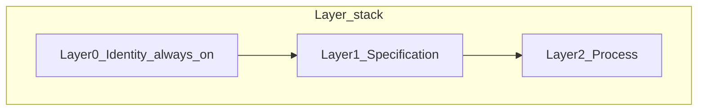

# nondominium Implementation Plan

## 1. Executive Summary

This plan details the phased implementation of the nondominium hApp, a decentralized, organization-agnostic resource management system built on Holochain and ValueFlows. The implementation builds incrementally on the existing working foundation to deliver Economic Processes, Private Participation Receipt (PPR) reputation, agent capability progression, and cross-zome coordination, while aligning with the **generic Nondominium Object (NDO)** model where that work is scheduled.

**MVP vs post-MVP (normative boundary):** Per [requirements.md §2.3](requirements/requirements.md), the MVP resource substrate is `ResourceSpecification`, `EconomicResource`, and `GovernanceRule`. The repository has also implemented NDO Layer 0 (`NondominiumIdentity`), Lobby and Group DNAs, PPR prototypes, and NDO federation extensions. **Governance-as-Operator** remains specified rather than coded as a Request→Evaluate→Apply path. **NDO-wide** requirements beyond the implemented subset (Layers 1/2 activation, operational-state split, capability slots, migration, REQ-NDO-*) remain governed by [ndo_prima_materia.md](requirements/ndo_prima_materia.md). Phases 2–4 below distinguish implemented foundations from remaining production workflows. Post-MVP agent ontology (REQ-AGENT-*, REQ-NDO-AGENT-*) is specified in [requirements.md §4.4](requirements/requirements.md). **Source-NDO** is an **optional application profile** (REQ-SOURCE-APP-*, [requirements.md §4.6](requirements/requirements.md)) — not required for Project NDOs or resource-mutualisation apps; see §12.7.

### 1.1 Requirements map (normative sources)

This index is the entry point for phased delivery. **Current implementation baseline:** Layer 0 identity and lifecycle UI are implemented; Resources, Governance, and Activity tabs render existing service-backed data, while Composition remains a placeholder. Layer 1 activation (`NDOToSpecification`) and Layer 2 activation (`NDOToProcess`) are normative but not yet wired in DNA. The next work should connect those layers and complete Economic Process, governance-rule evaluation, and authenticated PPR workflows rather than recreate already-shipped entry types and APIs. Status cross-check: [IMPLEMENTATION_STATUS.md](IMPLEMENTATION_STATUS.md).

#### Core normative (PRD, NDO model, UI, data model)

| Source | Role |
|--------|------|
| [requirements.md](requirements/requirements.md) | PRD — REQ-USER-*, REQ-RES-*, REQ-GOV-*, REQ-PROC-*, REQ-AGENT-* (§4.4 post-MVP agent ontology); REQ-UI-* (§4.5 MVP UI); REQ-SOURCE-APP-* / REQ-SOURCE-* (§4.6 optional Source profile) |
| [ndo_prima_materia.md](requirements/ndo_prima_materia.md) | NDO layers (L0/L1/L2), lifecycle vs operational state, capability surface; **REQ-NDO-L1-*** (§9.2), **REQ-NDO-L2-*** (§9.3), REQ-NDO-* (§9), migration (§10) |
| [ui_design.md](requirements/ui_design.md) | UI vision — MVP Layer 0 complete; Resources, Governance, and Activity tabs service-backed; Composition and Join NDO remain incomplete |
| [specifications/ui_architecture.md](specifications/ui_architecture.md) | Implemented UI stack, routes, stores, services (`resource.service.ts`, `governance.service.ts`), component map |
| [specifications/specifications.md](specifications/specifications.md) | Technical data structures — `ResourceSpecification`, `GovernanceRule`, `EconomicResource`, `EconomicProcess`, VfAction, cross-zome governance interface |

#### Layer 1 — Specification (resource form)

| Source | Role |
|--------|------|
| [zomes/resource_zome.md](zomes/resource_zome.md) | **Implemented** coordinator/integrity API — `ResourceSpecification`, `GovernanceRule`, `EconomicResource`; planned `NDOToSpecification` / `DigitalAsset` links |
| [requirements/resources.md](requirements/resources.md) | Resource ontology — implemented vs planned; Layer 1 activation gap; governance defaults from `PropertyRegime` × `ResourceNature` (non-normative REQ IDs) |
| [post-mvp/project-type-ndo-specifications.md](requirements/post-mvp/project-type-ndo-specifications.md) | Structured know-how bundles for project-type NDOs (OSHWA / Open Know-How → Layer 1 assets); lifecycle-matched completeness |
| [post-mvp/source-ndo-requirements.md](requirements/post-mvp/source-ndo-requirements.md) | **Source-NDO (optional profile)** — `Source` as third flow endpoint when an application governs generative systems; `SourceProfile`, adaptive loop, `vf:Source` (REQ-SOURCE-*); applicability REQ-SOURCE-APP-* in [requirements.md §4.6](requirements/requirements.md) |
| [post-mvp/Source-NDO.md](requirements/post-mvp/Source-NDO.md) | Paper planning scaffold — thesis, Ostrom/VF argument structure (informative) |
| [post-mvp/source-ndo-paper.md](requirements/post-mvp/source-ndo-paper.md) | Academic grounding: Occam's razor proof, river case study, Ostrom SES mapping (informative) |
| [post-mvp/ndo-versioning.md](requirements/post-mvp/ndo-versioning.md) | Version DAG — **REQ-NDO-L1-03** (multiple `ResourceSpecification` links per NDO identity) |
| [post-mvp/digital-resource-integrity.md](requirements/post-mvp/digital-resource-integrity.md) | Content-addressed manifests, composable verification — **REQ-NDO-L1-06** `DigitalAsset` capability slots (prima materia §9.2) |
| [post-mvp/fractal-composable-resource-architecture.md](requirements/post-mvp/fractal-composable-resource-architecture.md) | Archival design — atomic / component / composite nesting; informs integrity (R5–R6) and Composition tab (post-MVP) |

#### Governance (embedded rules → operator enforcement)

| Source | Role |
|--------|------|
| [requirements/governance.md](requirements/governance.md) | Governance ontology — governance-as-operator, PPR, validation, role tiers; gap analysis (non-normative REQ IDs) |
| [specifications/governance/governance-operator-architecture.md](specifications/governance/governance-operator-architecture.md) | **REQ-ARCH-07/09** — `GovernanceTransitionRequest` / `evaluate_state_transition`; rules on spec, enforcement in `zome_gouvernance` |
| [specifications/governance/governance-operator-implementation-guide.md](specifications/governance/governance-operator-implementation-guide.md) | Implementation patterns for rule evaluation and cross-zome calls |
| [specifications/governance/private-participation-receipt.md](specifications/governance/private-participation-receipt.md) | PPR categories and bilateral receipts — accountability after governed process completion |
| [zomes/governance_zome.md](zomes/governance_zome.md) | Coordinator API — commitments, events, claims, validation, PPR issuance |
| [post-mvp/unyt-integration.md](requirements/post-mvp/unyt-integration.md) | Typed **`EconomicAgreement`** governance rules, RAVE settlement (REQ-NDO-CS-07–CS-11) — Layer 1 rule family |
| [post-mvp/flowsta-integration.md](requirements/post-mvp/flowsta-integration.md) | **`IdentityVerification`** / `FlowstaIdentity` slots (REQ-NDO-CS-12–CS-15) — agent identity gates on high-trust transitions |

#### Process (Layer 2 — what agents do with resources)

| Source | Role |
|--------|------|
| [requirements.md §5](requirements/requirements.md) | **REQ-PROC-*** — Use, Transport, Storage, Repair; role-gated initiation; process validation and chaining |
| [ndo_prima_materia.md §4.4](requirements/ndo_prima_materia.md) | Layer 2 activation via `NDOToProcess`; hosts Commitments, Claims, EconomicEvents, PPRs (**REQ-NDO-L2-***) |
| [post-mvp/resource-transport-flow-protocol.md](requirements/post-mvp/resource-transport-flow-protocol.md) | Multi-dimensional transport/flow semantics (physical, custodial, value, legal, information) over **EconomicEvent** metadata — post-MVP |
| [post-mvp/many-to-many-flows.md](requirements/post-mvp/many-to-many-flows.md) | N-ary custody and multi-party events — after shared custody / `AgentContext` model matures |
| [post-mvp/valueflows-dsl.md](requirements/post-mvp/valueflows-dsl.md) | VF DSL for recipes, bulk bootstrap, scripted coordination — operational tooling track |

#### Federation, agent context, and supplementary ontology

| Source | Role |
|--------|------|
| [lobby-dna.md](requirements/lobby-dna.md) | Multi-network federation — Lobby / Group / NDO DNA extensions (REQ-LOBBY-*, REQ-GROUP-*, REQ-NDO-EXT-*) |
| [requirements/agent.md](requirements/agent.md) | Agent ontology — roles, affiliation, `AgentContext` (post-MVP); background for governance participation and process access |

### 1.2 Status synchronization convention

- [IMPLEMENTATION_STATUS.md](IMPLEMENTATION_STATUS.md) is the evidence-based inventory of current code.
- In this plan, `[x]` means the stated scope exists now; `[ ]` means remaining work. A checked foundation does not imply that its unchecked production workflow is complete.
- When a feature ships, update both documents in the same change: record evidence and limitations in the status document, then close or split the corresponding plan task.
- Do not mark a whole phase complete while it still contains implementation tasks; use “foundation delivered” or “partial” for mixed phases.

---

## 2. Implementation Principles

Development follows **Complexity Driven Development (CDD)** and **Complexity Oriented Programming (COP)**: software as an evolving **coordination structure**, not a deterministic machine. The design unit is `agent → process → resource → relation → network`, not `function → class → module`. Methodology reference: [archives/complexity_oriented_programming.md](archives/complexity_oriented_programming.md); operational checklist: `.claude/skills/complexity-oriented-programming/SKILL.md`.

Judge outcomes by **systemic viability** — anti-fragility, evolvability, coordination capacity, holonic health, trust composability — not only delivery speed or defect rate.

### 2.1 CDD / COP foundations

| Principle | Implementation requirement |
|-----------|---------------------------|
| **Dynamic complexity matching** | Match governance overhead and schema rigidity to *actual* social complexity — not the imagined maximum. Apply **subsidiarity**: resolve decisions at the most local level that can handle them (agent, group, NDO, network); escalate only when broader context is genuinely required. |
| **Progressive activation** | Artifacts begin as low-complexity intent and accrue structure over time. **Layer 0** identity always on; **Layer 1** specification and **Layer 2** process activate only when coordination demands it (REQ-NDO-L1-*, REQ-NDO-L2-*). UI and DNA must not force full spec/governance/process surfaces on `Ideation`-stage NDOs. |
| **Governance-as-operator** | Decouple the **data substrate** (`zome_resource`) from **regulatory signaling** (`zome_gouvernance`). Business and governance logic must not be hard-coded into core entry schemas; rules evolve as mutable data without destructive migrations (REQ-ARCH-07, REQ-ARCH-08). |
| **Stigmergic coordination** | Prefer discoverable traces, anchor links, reputation signals (PPRs), and **CapabilitySlot** attachments over central orchestrators. Agents coordinate by modifying a shared environment — the DHT — not by a mediating platform service. |
| **Fractal composability** | Use the same coordination primitives at agent, group, NDO, and federation scales. **Trust and integrity compose** through hierarchies (atomic → component → composite): local verification at each level yields global coherence; changes re-verify only affected paths (digital integrity, holonic NDO links — post-MVP). |
| **Path-dependency awareness** | Before refactors or major UI/API contracts, scan legacy choices (orphan `ResourceSpecification` entries, pre-NDO economic-resource flows, four-regime frontend types, and remaining placeholder surfaces). The localStorage Group shell has already migrated to cloned Group cells; only per-Group presentation preferences remain local. Document migration windows (REQ-NDO-MIG-*) when Layer 1 bridges old and new models. |
| **Anti-fragility** | Disruption should teach, not only hurt. Disputes, validation failures, and adversarial behaviour must generate auditable signals (PPRs, validation receipts, governance events) that improve future coordination — not merely error screens. |

### 2.2 Nondominium enactments

- **Incremental enhancement**: Extend working code through new modules and functions; avoid breaking MVP flows until migration windows are defined.
- **ValueFlows compliance**: Data structures and flows adhere to ValueFlows — Knowledge (`ResourceSpecification`), Plan (`Commitment`), Observation (`EconomicEvent`, `Claim`) — with Economic Process integration (REQ-PROC-*).
- **Agent-centric design**: Data and validation originate on each agent's source chain; capability progression (Simple → Accountable → Primary Accountable) gates sensitive actions. Post-MVP: requirements must hold for holonic actors (`AgentContext`), not only individual `AgentPubKey`s (REQ-AGENT-01, REQ-GOV-16).
- **Resources as autonomous entities**: Resources carry embedded governance, stable identity (Layer 0), and lifecycle — they are coordination objects, not passive CRUD rows. **LifecycleStage** (identity maturity) stays orthogonal to **OperationalState** (instance process condition) (REQ-NDO-LC-02, REQ-NDO-OS-02, REQ-NDO-OS-04).
- **Embedded governance (Social DNA)**: `GovernanceRule` entries on Layer 1 `ResourceSpecification` define how agents may interact; the governance zome evaluates transitions against them. Rules are **mutable data** communities can amend; identity anchors are not.
- **Capability-based security**: Holochain capability tokens plus role-gated process access (REQ-SEC-01, REQ-SEC-02); field-level private data grants with expiry and explicit revocation.
- **Privacy-preserving accountability**: Bilateral PPRs and derivable `ReputationSummary` — user-sovereign, no global scoring aggregator (REQ-PPR-10, REQ-PPR-11).
- **Process-aware infrastructure**: Use, Transport, Storage, Repair processes are first-class; initiation, validation, and chaining follow embedded rules and role credentials (REQ-PROC-01–REQ-PROC-09).

### 2.3 Layer 1 UI and cross-layer discipline

- **Mirror the zome boundary in the UI**: Specification tab → data model (`ResourceSpecification`, assets, version links); Governance tab → embedded rules and their semantics; Activity / process surfaces → Layer 2 readiness gated by rules — do not collapse layers into a single undifferentiated form.
- **Complexity-matched affordances**: Expose creation/editing depth proportional to `LifecycleStage` and layer activation (e.g. lightweight spec at `Specification`, full governance editor when rules matter, process actions only when Layer 2 or MVP process APIs exist).
- **Service-layer contract stability**: UI calls Effect-TS services (`resource.service.ts`, `governance.service.ts`); zome function names and shared types (`@nondominium/shared-types`) are the integration seam — keep components free of raw zome payloads.
- **Correctness over cleverness**: Governance infrastructure for real economic relationships; a wrong validation rule on the DHT cannot be rolled back — prefer explicit, reviewable rule data over implicit UI magic.

---

## 3. Architecture alignment (NDO prima materia)

The **three-layer model** ([ndo_prima_materia.md §4](requirements/ndo_prima_materia.md)) structures resources as:

- **Layer 0 — Identity**: `NondominiumIdentity` (stable anchor, tombstone at end of life); identity fields are immutable while lifecycle updates may change `lifecycle_stage`, `hibernation_origin`, and the one-time `successor_ndo_hash` (REQ-NDO-L0-*).
- **Layer 1 — Specification**: Activated by `NDOToSpecification` → `ResourceSpecification` (governance rules, discoverable form); may be dormant/archived while L0 remains (REQ-NDO-L1-*).
- **Layer 2 — Process**: Activated by `NDOToProcess` → ValueFlows `Process`; hosts commitments, claims, events, PPRs (REQ-NDO-L2-*).

**Two state dimensions** ([§5](requirements/ndo_prima_materia.md)): `LifecycleStage` lives on the identity (maturity of the artefact); `OperationalState` lives on `EconomicResource` (transient process condition). Transitions on one must not imply transitions on the other (REQ-NDO-OS-04).


```mermaid
flowchart TB
  subgraph layers [Layer_stack]
    L2[Layer2_Process]
    L1[Layer1_Specification]
    L0[Layer0_Identity_always_on]
    L0 --> L1
    L1 --> L2
  end
```

---

## 4. Implementation tracks

Work below is grouped into **parallel tracks** so MVP delivery, NDO migration, agent ontology, integrations, and extended specs are not confused as a single serial timeline.

| Track | Intent | Primary references |
|--------|--------|-------------------|
| **MVP core** | Phases 2–4 in Section 5: private data sharing, economic processes, PPR, promotion, security, cross-zome coordination | [requirements.md](requirements/requirements.md) REQ-USER / REQ-PROC / REQ-GOV |
| **NDO model and migration** | `NondominiumIdentity`, `NDOToSpecification` / `NDOToProcess`, holonic links, `CapabilitySlot`, lifecycle plus operational split, faceted discovery links, one-time migration (REQ-NDO-MIG-*) | [ndo_prima_materia.md](requirements/ndo_prima_materia.md) §§8–10, §9 |
| **Agent ontology** | REQ-AGENT-* / REQ-NDO-AGENT-* items under Phases 2–4 | [requirements.md §4.4](requirements/requirements.md); [requirements/agent.md](requirements/agent.md) for OVN background |
| **Unyt / Flowsta** | Phased integration; governance enforcement in later phases | Section 12.2–12.3; REQ-NDO-CS-07–CS-15 |
| **Source-NDO application profile** | Optional third VF primitive (`vf:Source`) for applications governing generative ecological/knowledge systems — **not** activated for ordinary Project NDOs or mature-resource mutualisation (e.g. shared 3D printer). Opt-in modules only; default UI stays Agent + Resource. | [requirements.md §4.6](requirements/requirements.md) REQ-SOURCE-APP-*; [source-ndo-requirements.md](requirements/post-mvp/source-ndo-requirements.md); §12.7 |
| **Extended post-MVP** | Many-to-many flows, full version DAG, digital integrity, RTP-FP, VF DSL, Moss contract, and remaining federation work. Lobby/Group DNAs and the first NDO federation primitives are already implemented. | `documentation/requirements/post-mvp/*.md` |

**Phase 2.2 and the NDO track:** `NondominiumIdentity`, `LifecycleStage`, lifecycle validation, and lifecycle facet links already exist. Remaining work implements `OperationalState`, `NDOToSpecification` / `NDOToProcess`, process-aware resource transitions, and the rest of REQ-NDO-LC-*, REQ-NDO-OS-*, and REQ-NDO-L2-*. Legacy-resource migration remains in Section 12.1 and REQ-NDO-MIG-*.

**Source-NDO track (optional application profile):** Follows **dynamic complexity matching** — Agent + Resource remain the universal baseline. Source modules activate only when an application's domain requires governing a generative system (watershed, river, fishery, knowledge commons) and its boundary effects. **Not in scope** for Project-type NDOs (e.g. open-hardware design) or resource-mutualisation NDOs (e.g. sharing a 3D printer within or between Groups). When enabled, the track adds `SourceProfile`, coupling links, the `Steward` role, `vf:Source` boundary events, and an adaptive governance loop. Full adaptive enforcement depends on Governance-as-Operator (§12.7); Phases A–B can proceed on opt-in data model and event recording without changing the default NDO creation UI.

---

## 5. Implementation Phases

### Phase 1: Foundation Layer ✅ **DELIVERED** (Existing Working Code)

#### 1.1 Agent Identity & Role System (`zome_person`) ✅ **CORE IMPLEMENTED**

- [x] Implement `Person` (public info) and `PrivatePersonData` (private entry, PII).
- [x] Implement `PersonRole` entry with validation metadata and links to validation receipts.
- [x] **Modular Architecture**: Refactored into `person.rs`, `private_data.rs`, `role.rs` modules
- [x] **Comprehensive Error Handling**: PersonError enum with detailed error types
- [x] **Core Functions**: Profile management, role assignment, private data storage
- [x] **Multi-device identity**: `Device` and `AgentPersonRelationship` entries, links, and coordinator APIs
- [x] **Foundation testing**: Active Person/hREA Sweettests
- [ ] **Remaining testing**: Complete capability, role, device, and promotion Sweettest coverage

#### 1.2 Resource Management (`zome_resource`) ✅ **CORE IMPLEMENTED**

- [x] Implement `ResourceSpecification` with separately stored and linked `GovernanceRule` entries.
- [x] Implement `EconomicResource` with custodian tracking and state management.
- [x] **Modular Architecture**: Refactored into `resource_specification.rs`, `economic_resource.rs`, `governance_rule.rs`
- [x] **Comprehensive Error Handling**: ResourceError enum with governance violation support
- [x] **Signal System**: Complete post-commit signal handling for DHT coordination
- [x] **Core Functions**: Resource specification and economic resource CRUD operations
- [x] **NDO Layer 0**: `NondominiumIdentity`, 10-stage lifecycle validation, hibernation/successor metadata, and discovery facets
- [x] **Foundation testing**: Active Resource/NDO Sweettests
- [ ] **Remaining testing**: Close uncovered Resource/NDO integrity and workflow paths

#### 1.3 Governance Foundation (`zome_gouvernance`) 🔄 **FOUNDATION IMPLEMENTED**

- [x] **Basic VfAction Enum**: Type-safe economic action vocabulary
- [x] **Validation Infrastructure**: ValidationReceipt creation and management
- [x] **Economic Event Logging**: Basic economic event recording
- [x] **Cross-Zome Functions**: Core validation functions for resource and agent validation
- [x] **Error Handling**: GovernanceError enum with comprehensive error types
- [ ] **Governance-as-Operator path**: Implement `GovernanceTransitionRequest` / `TransitionContext` / `GovernanceTransitionResult`, `evaluate_state_transition`, and resource-zome `request_resource_transition`
- [ ] **Governance-as-Operator completion**: Typed rule evaluation, consistent authorization, and automatic event/PPR generation

---

### Phase 2: Enhanced Governance & Process Integration 🚀 **HIGH PRIORITY**

#### 2.1 Enhanced Private Data Sharing (`zome_person`) 🔄 **PARTIAL**

_Field-level direct grants are implemented. The outstanding work is the request/approval ceremony, lifecycle visibility, auditing, and full workflow tests._

- [ ] **Data Access Request System**:
  - [ ] `DataAccessRequest` entry type with status tracking
  - [ ] `request_private_data_access()` function for requesting specific fields
  - [ ] `respond_to_data_request()` function for approving/denying requests
  - [ ] Bidirectional linking system for request tracking
- [x] **Direct Capability Grant Foundation**:
  - [x] `PrivateDataCapabilityMetadata` with allowed fields, context, expiry, grantor/grantee, and local capability secret
  - [x] Field filtering through `FilteredPrivateData` response views
  - [x] Grant, claim, retrieval, revoke, owned-grant, role-based, and transferable grant APIs under their current names (`grant_private_data_access`, `get_private_data_with_capability`, `revoke_private_data_access`, etc.)
  - [x] Governance-oriented private-data validation API
- [ ] **Grant Lifecycle Completion**:
  - [ ] Enforce a true maximum grant duration; current callable grants accept arbitrary `expires_in_days`
  - [ ] Remove mock/fallback retrieval paths and harden revocation discovery
  - [ ] `get_expiring_grants()` for proactive renewal/expiry handling
  - [ ] Auditable private-data access events
  - [ ] End-to-end request→approval→access→revocation Sweettests
- [ ] **Governance Integration Completion**:
  - [ ] Connect private-data eligibility checks to a real, queryable promotion-request workflow
  - [ ] Replace specialized-role auto-approval with credential and approver validation

#### 2.2 Economic Process Infrastructure (`zome_resource`) 📋 **HIGH PRIORITY**

_Extending existing resource management with process-aware workflows. **NDO track overlap:** state split and discovery links map to REQ-NDO-LC-*, REQ-NDO-OS-*, REQ-NDO-OS-06; process and PPR linkage align with REQ-NDO-L2-* once Layer 2 is modeled via `NDOToProcess` (see [ndo_prima_materia.md §4.4](requirements/ndo_prima_materia.md))._

- [ ] **Economic Process Data Structures** (NEW):
  - [ ] `EconomicProcess` entry type with status tracking and role requirements
  - [ ] `ProcessStatus` enum (Planned, InProgress, Completed, Suspended, Cancelled, Failed)
  - [x] **Split legacy `ResourceState` into `LifecycleStage` + `OperationalState`** (see ndo_prima_materia.md Section 5):
    - [x] `LifecycleStage` enum on `NondominiumIdentity` (Layer 0) — 10 stages with integrity-validated transitions
    - [x] `OperationalState` enum on `EconomicResource` — 7 process states; default `PendingValidation` on create
    - [ ] Update governance zome state transition logic to manage both enums independently (REQ-NDO-OS-02/03 — deferred)
    - [x] Add NDO lifecycle discovery through `NdoByLifecycleStage`
    - [x] Replace legacy `ResourcesByState` with `ResourcesByOperationalState`; lifecycle discovery remains on Layer 0
  - [ ] `OperationalState` transitions aligned with process outcomes (begin/end of transport, storage, maintenance processes)
- [ ] **Process Management Functions** (NEW):
  - [ ] `initiate_economic_process()` with role-based access control
  - [ ] `complete_economic_process()` with state change validation
  - [ ] Process query functions by type, status, and agent
  - [ ] Process-resource relationship tracking
- [ ] **Enhanced Cross-Zome Integration** (EXTEND):
  - [ ] Role validation calls to person zome for process initiation
  - [ ] Governance zome integration for process validation and PPR generation
  - [ ] Private data coordination for custody transfers

#### 2.3 Private Participation Receipt (PPR) System (`zome_gouvernance`) 🔄 **PROTOTYPE IMPLEMENTED**

_The private entry model, 16 categories, coordinator APIs, signature validation, and local summary calculation exist. The production milestone is authenticated bilateral coordination and automatic workflow integration._

- [x] **PPR Data Structures**:
  - [x] `PrivateParticipationClaim` private entry type
  - [x] `ParticipationClaimType` enum with 16 claim categories
  - [x] `PerformanceMetrics`, `CryptographicSignature`, and `ReputationSummary`
- [x] **PPR Coordinator Prototype**:
  - [x] `issue_participation_receipts()`
  - [x] `sign_participation_claim()`
  - [x] `validate_participation_claim_signature()` and enhanced validation variant
  - [x] `get_my_participation_claims()` via DHT discovery links
  - [x] `derive_reputation_summary()` from the calling agent's linked receipts
- [ ] **Bilateral Authentication Completion**:
  - [ ] Remove the placeholder counterparty signature from initial issuance
  - [ ] Complete a counterparty-authenticated signing exchange with replay/idempotency handling
  - [ ] Eliminate DHT discovery links to private claim action hashes, or redefine the privacy model explicitly
  - [ ] Add active multi-agent Sweettests for issuance, countersigning, validation, privacy, and summaries
- [ ] **Process Integration**:
  - [ ] Automatic PPR generation for all Commitment-Claim-Event cycles
  - [ ] Economic Process completion triggers specialized PPR categories
  - [ ] Agent promotion generates appropriate PPR types

#### 2.4 Complete Agent Capability Progression 🔄 **GOVERNANCE CRITICAL**

_Role entries, assignment APIs, promotion externs, and governance validation entry points exist. The request artifact and several authorization/credential checks remain incomplete._

- [x] **Promotion Foundation**:
  - [x] `PersonRole` entries and six predefined role variants
  - [x] Promotion request/approval coordinator entry points
  - [x] Cross-zome governance and private-data validation entry points
- [ ] **Enhanced Agent Promotion**:
  - [ ] Replace the placeholder request hash with a queryable `RolePromotionRequest`
  - [ ] Enforce authorization and private-data quality requirements end-to-end
  - [ ] Automatic PPR generation for promotion activities
  - [ ] Capability token progression (general → restricted → full)
- [ ] **Specialized Role Validation**:
  - [ ] Replace current auto-approval with credential checks for Transport, Repair, and Storage
  - [ ] Primary Accountable Agent validation requirements
  - [ ] Role-specific PPR generation for validation activities
- [ ] **Cross-Zome Validation Workflow Completion**:
  - [x] Resource/process/agent validation entry types and coordinator APIs
  - [ ] Connect resource validation to first-access events
  - [ ] Enforce agent identity validation with private data verification
  - [ ] Specialized role validation with existing role holder approval

**Agent Ontology Items (Post-MVP, Phase 2 — see [requirements.md §4.4](requirements/requirements.md) and [requirements/agent.md](requirements/agent.md) §5.3; `REQ-AGENT-*`):**

- [ ] **[G13] Fix `request_role_promotion` stub** (HIGH PRIORITY — broken workflow):
  - [ ] Create a real `RolePromotionRequest` entry type in `zome_person` integrity, replacing the current placeholder hash return
  - [ ] Add `AllPromotionRequests` anchor link for approver discovery
  - [ ] Add `AgentToPromotionRequest` and `PromotionRequestToAgent` bidirectional links
  - [ ] Implement `get_pending_promotion_requests()` query function for authorised approvers
  - [ ] See `REQ-AGENT-16` and code TODO in `role.rs`
- [ ] **[G6] `AffiliationRecord` entry type** (NEW):
  - [ ] Define `AffiliationRecord` struct: `agent`, `network_id`, `documents_acknowledged: Vec<DocumentAck>`, `signed_at`, `signature`, `witness: Option<AgentPubKey>`
  - [ ] Define `DocumentAck` struct: `document_hash`, `document_title`, `document_version`
  - [ ] Implement `create_affiliation_record(input)` — agent cryptographically signs ToP, Nondominium & Custodian agreement, Benefit Redistribution Algorithm
  - [ ] Link: `agent_pubkey → affiliation_record_hash` (`AgentToAffiliation`)
  - [ ] UI: prompt agent to create `AffiliationRecord` during `Person` creation flow
  - [ ] See `REQ-AGENT-05`
- [ ] **[G2] Derived affiliation state** (NEW — computed, not stored):
  - [ ] Implement `get_affiliation_state(agent_pubkey) -> AffiliationState` as a composed query:
    - `UnaffiliatedStranger`: no `Person` entry
    - `CloseAffiliate`: `Person` exists but no `AffiliationRecord` and zero contributions
    - `ActiveAffiliate`: `AffiliationRecord` exists + tracked contributions (economic events) within configurable recency window
    - `CoreAffiliate`: `ActiveAffiliate` whose PPR-derived contribution rate exceeds configurable threshold
    - `InactiveAffiliate`: `AffiliationRecord` exists, previously active, but no contributions within recency window
  - [ ] Expose affiliation state as part of `get_person_profile()` response
  - [ ] Use affiliation state in governance access decisions (Active/Core affiliates for governance participation)
  - [ ] See `REQ-AGENT-04`

---

### Phase 3: Advanced Security & Cross-Zome Coordination 🔒 **PRODUCTION READINESS**

#### 3.1 Enhanced Capability-Based Security

_Building on existing capability infrastructure with Economic Process integration_

- [ ] **Progressive Capability Tokens** (EXTEND):
  - [ ] `general_access` tokens for Simple Agents (existing foundation)
  - [ ] `restricted_access` tokens for Accountable Agents (PPR-enabled)
  - [ ] `full_access` tokens for Primary Accountable Agents (custodianship-enabled)
  - [ ] Automatic capability progression triggered by PPR milestones
- [ ] **Economic Process Access Control** (NEW):
  - [ ] Role-based process access validation (Transport, Repair, Storage)
  - [ ] Dynamic capability checking for specialized Economic Processes
  - [ ] PPR-derived reputation influencing process access permissions
- [ ] **Function-Level Security** (EXTEND):
  - [ ] Apply capability requirements to all new Economic Process functions
  - [ ] Enhanced private data access control with granular field permissions
  - [ ] Cross-zome capability validation for complex workflows

**Agent Ontology Items (Post-MVP, Phase 3 — see [requirements.md §4.4](requirements/requirements.md) and [requirements/agent.md](requirements/agent.md) §5.3; `REQ-AGENT-*`):**

- [ ] **[G1] `AgentEntityType` configuration** (NEW):
  - [ ] Define `AgentEntityType` enum in `zome_person` integrity: `Individual`, `Collective(String)`, `Project(ActionHash)`, `Network(ActionHash)`, `Bot { capabilities: Vec<String>, operator: AgentPubKey }`, `ExternalOrganisation(String)`
  - [ ] Define `AgentContext` entry: `agent_type: AgentEntityType`, `person_hash: Option<ActionHash>`, `created_at`, `network_seed`
  - [ ] Collective, Project, and Network types reference an NDO hash — no separate `Person` entry required
  - [ ] Update governance role-gating logic to account for non-individual agent types
  - [ ] See `REQ-AGENT-01`, `REQ-AGENT-02`
- [ ] **[G15] CapabilitySlot on Person** (NEW):
  - [ ] Implement `CapabilitySlot` link type from `Person` entry hash to external capability targets (DID documents, credential wallets, reputation oracles)
  - [ ] Reuse `CapabilitySlotTag` / `SlotType` pattern from `ndo_prima_materia.md` §8.3 — same pattern applied at agent identity level
  - [ ] Implement `attach_agent_capability_slot(person_hash, slot_type, target_hash)` and `get_agent_capability_slots(person_hash)`
  - [ ] See `REQ-AGENT-11`
- [ ] **[G3] Composable `AgentProfile` view** (NEW):
  - [ ] Implement `get_agent_profile(agent_pubkey) -> AgentProfile` as a composed query — NOT a new stored entry:
    - Identity: `AgentPubKey`, `Person`, `AffiliationState`, `AgentEntityType`
    - Capability: `roles: Vec<PersonRole>`, `capability_level`, `capability_slots: Vec<CapabilitySlotInfo>`
    - Reputation: `reputation_summary: Option<ReputationSummary>`, `economic_reliability_score: Option<f64>`
    - Participation: `active_commitments_count`, `economic_events_count`, `resource_custodianships_count`
    - Social: `network_affiliations: Vec<NetworkAffiliation>`, `peer_vouches: Option<u32>`
    - Temporal: `joined_at`, `last_active_at`
  - [ ] Agent controls which sections are exposed by granting access to constituent entries
  - [ ] See `REQ-AGENT-07`
- [ ] **[G4] `AgentRelationship` link type** (NEW):
  - [ ] Define bidirectional `AgentRelationship` link type with typed tags: `Colleague`, `Collaborator`, `Trusted`, `Voucher`
  - [ ] Store as private links (agent-to-agent, not publicly discoverable)
  - [ ] Implement `create_agent_relationship(target, relationship_type)` and `get_my_relationships()`
  - [ ] See `REQ-AGENT-08`
- [ ] **[G5] Network affiliation links** (NEW):
  - [ ] Define `NetworkAffiliation` link type from `Person` hash to NDO instance hashes
  - [ ] Implement `add_network_affiliation(person_hash, ndo_hash, affiliation_type)` and `get_network_affiliations(person_hash)`
  - [ ] An agent's multi-network membership is visible as part of the composable `AgentProfile`
  - [ ] See `REQ-AGENT-09`
- [ ] **[G14] Configurable role taxonomy** (NEW):
  - [ ] Define `RoleDefinition` entry type: `role_name`, `capability_level`, `description`, `validation_requirements`, `network_id`
  - [ ] Replace hard-coded `RoleType` enum with `RoleDefinition` registry; predefined six roles created as default entries at network genesis
  - [ ] Update `assign_person_role` to accept any role name present in the network's `RoleDefinition` registry
  - [ ] See `REQ-AGENT-06`
- [ ] **[G1+Resource] Collective agent custodianship** (NEW — resource-agent integration):
  - [ ] Define `AgentContext` union type usable wherever `AgentPubKey` currently identifies a custodian or initiator
  - [ ] Update `EconomicResource.custodian` from `AgentPubKey` to `AgentContext`
  - [ ] Update `TransitionContext.target_custodian` from `Option<AgentPubKey>` to `Option<AgentContext>`
  - [ ] Update `NondominiumIdentity.initiator` from `AgentPubKey` to `AgentContext`
  - [ ] Update custody transfer validation to handle collective agent auth (no single private key — requires collective signature or designated operator key)
  - [ ] See `REQ-AGENT-02`, `resources.md §5.3`, `governance-operator-architecture.md §2.1`
- [ ] **[G2+Resource] Affiliation-gated resource access** (NEW — resource-agent integration):
  - [ ] Extend `GovernanceRule.rule_data` JSON schema to support `min_affiliation` condition: `"min_affiliation": "ActiveAffiliate" | "CoreAffiliate"`
  - [ ] Extend governance zome `evaluate_transition` to cross-zome query `zome_person` for requesting agent's `AffiliationState` when `min_affiliation` is present in an applicable GovernanceRule
  - [ ] Surface affiliation state as an enumerated result field in `GovernanceDecision.role_permissions` entries
  - [ ] Add `affiliation_gated_access: bool` flag to governance defaults engine output so UIs can surface relevant access requirements
  - [ ] Write integration tests: agent with `UnaffiliatedStranger` state rejected for `min_affiliation: ActiveAffiliate` governed resource; `ActiveAffiliate` agent accepted
  - [ ] See `REQ-AGENT-03`, `REQ-AGENT-05`, `resources.md §5.3 (Affiliation-gated resource access row)`, `governance-operator-architecture.md §2.1 TODO G2`

**Governance Agent Ontology Integration (Post-MVP, Phase 3 — see `governance.md §3.6`, `§6.4`, `§6.6`):**

- [ ] **[G1+Governance] Extend core governance entry types to AgentContext**:
  - [ ] `GovernanceTransitionRequest.requesting_agent`: `AgentPubKey` → `AgentContext`
  - [ ] `ResourceStateChange.initiated_by`: `AgentPubKey` → `AgentContext`
  - [ ] `ValidationReceipt.validator`: `AgentPubKey` → `AgentContext`
  - [ ] `EconomicEvent.provider` and `.receiver`: `AgentPubKey` → `AgentContext`
  - [ ] `Commitment.provider` and `.receiver`: `AgentPubKey` → `AgentContext`
  - [ ] `PrivateParticipationClaim.counterparty`: `AgentPubKey` → `AgentContext`
  - [ ] Implement `AgentContext` → `signing_key` resolution: for `Individual` = the key itself;
        for `Collective` = designated `PrimaryAccountableAgent` key from collective NDO;
        for `Bot` = operator `AgentPubKey`
  - [ ] See `REQ-GOV-16`, `governance.md §3.6.1`, `§6.6`
- [ ] **[G6+Governance] AffiliationRecord governance ceremony**:
  - [ ] Implement `create_affiliation_record()` in governance zome using `Commitment`/`EconomicEvent` cycle
  - [ ] Create `AffiliationRecordSigned` PPR (bilateral, private) on ceremony completion
  - [ ] Ensure `AffiliationState` derivation in `zome_person` reads `AffiliationRecord` presence from DHT
  - [ ] See `REQ-GOV-15`, `governance.md §3.6.3`, `§4.4`
- [ ] **[G2+Governance] Affiliation-gated governance access**:
  - [ ] Extend governance `evaluate_transition` to check `GovernanceRule.rule_data["min_affiliation"]`
        specifically for GOVERNANCE PARTICIPATION (distinct from resource access gating)
  - [ ] Implement governance_weight formula from `governance.md §6.4`:
        `affiliation_state` gate → 0 if `< ActiveAffiliate`; `core_multiplier` if `CoreAffiliate`
  - [ ] See `REQ-GOV-14`, `governance.md §6.4`

#### 3.2 Comprehensive Cross-Zome Coordination

_Ensuring atomic operations and consistency across the three-zome architecture_

- [ ] **Transaction Consistency** (NEW):
  - [ ] Atomic custody transfer operations spanning resource and governance zomes
  - [ ] Economic Process completion consistency across resource and governance validation
  - [ ] PPR generation consistency with resource state changes
- [ ] **Error Handling Coordination** (EXTEND):
  - [ ] Standardized error translation between zomes (implemented in docs)
  - [ ] Rollback mechanisms for failed cross-zome operations
  - [ ] Comprehensive error context preservation across zome boundaries
- [ ] **State Synchronization** (NEW):
  - [ ] Resource state changes coordinated with Economic Process status
  - [ ] Agent capability progression synchronized with PPR generation
  - [ ] Role assignments coordinated with governance validation workflows

#### 3.3 Advanced Validation & Dispute Resolution

_Building on basic validation infrastructure with sophisticated governance_

- [ ] **Enhanced Validation Schemes** (EXTEND):
  - [ ] 2-of-3, N-of-M reviewer support with PPR-weighted selection
  - [ ] Reputation-based validator selection for Economic Process validation
  - [ ] Multi-tiered validation for different resource and process types
- [ ] **Dispute Resolution Infrastructure** (NEW):
  - [ ] Edge-based dispute resolution involving recent interaction partners
  - [ ] PPR-based reputation context for dispute resolution
  - [ ] Private data access coordination for dispute mediation
- [ ] **Governance Rule Enforcement** (NEW):
  - [ ] Dynamic governance rule evaluation for Economic Processes
  - [ ] Conditional logic support for complex resource access rules
  - [ ] Community-driven governance parameter adjustment

---

### Phase 4: Network Maturity & Advanced Features 🌐 **SCALING & OPTIMIZATION**

#### 4.1 Advanced Economic Process Workflows

_Building sophisticated process chaining and automation on established foundation_

- [ ] **Process Chaining & Automation** (NEW):
  - [ ] Multi-step Economic Process workflows (Transport → Repair → Transport)
  - [ ] Conditional process logic based on resource state and agent performance
  - [ ] Automated process matching and agent selection based on PPR reputation
- [ ] **Advanced Resource Management** (EXTEND):
  - [ ] Resource booking and reservation system for Economic Processes
  - [ ] Time-based resource availability and process scheduling
  - [ ] Multi-agent process coordination and collaborative workflows
- [ ] **Performance Analytics** (NEW):
  - [ ] Economic Process performance tracking and optimization recommendations
  - [ ] Resource utilization analytics and efficiency metrics
  - [ ] Agent performance trends and specialization insights

**Agent Ontology Items (Post-MVP, Phase 4 — see [requirements.md §4.4](requirements/requirements.md) and [requirements/agent.md](requirements/agent.md) §5.3; `REQ-AGENT-*`):**

- [ ] **[G8] `PortableCredential` structure and export** (NEW):
  - [ ] Define `PortableCredential` struct: `issuing_network` (DNA hash), `agent`, `credential_type: PortableCredentialType`, `claims`, `issued_at`, `valid_until`, `issuer_signature`, `agent_signature`
  - [ ] `PortableCredentialType` variants: `RoleCredential(String)`, `ReputationCredential`, `CompetencyCredential(String)`, `AffiliationCredential`
  - [ ] Implement `issue_portable_credential(agent, credential_type)` — requires `PrimaryAccountableAgent` issuer + agent countersign
  - [ ] Implement `verify_portable_credential(credential)` — validates both signatures against issuing network DNA hash
  - [ ] See `REQ-AGENT-12` and `REQ-PPR-15`
- [ ] **[G7] ZKP capability proofs** (NEW — requires external ZKP library integration):
  - [ ] Research and select ZKP library compatible with Holochain WASM compilation target (e.g., `bellman`, `arkworks`, or ZKP-compatible VC layer)
  - [ ] Define `prove_capability(condition: CapabilityCondition) -> ZKProof` — e.g., "I have ≥ N claims of type T" without revealing counterparties or timestamps
  - [ ] Allow governance functions to accept ZKProof in lieu of raw `ReputationSummary` for access decisions
  - [ ] See `REQ-AGENT-13` and `REQ-PPR-14`
- [ ] **[G9] Sybil resistance mechanism** (NEW — configurable per network):
  - [ ] Option A — Social vouching: N existing `ActiveAffiliate` agents must co-sign a new agent's `AffiliationRecord`
  - [ ] Option B — Biometric opt-in: integrate with external biometric verification service; store proof hash in `AffiliationRecord`
  - [ ] Option C — Proof-of-Personhood: integrate with existing PoP protocols (e.g., Proof of Humanity, Worldcoin) as membrane proof
  - [ ] Network genesis configuration selects which option(s) apply
  - [ ] See `REQ-AGENT-15`
- [ ] **[G10] Pseudonymous participation mode** (NEW):
  - [ ] Allow ephemeral `AgentPubKey` to contribute without creating a `Person` entry or `AffiliationRecord`
  - [ ] PPRs are issued to the ephemeral key; reputation accumulates but is unlinkable to physical identity
  - [ ] Agent can optionally link an ephemeral key to their main `Person` entry later (explicit opt-in de-anonymisation)
  - [ ] See `REQ-AGENT-14`
- [ ] **[G11] AI/bot delegation (`DelegatedAgent`)** (NEW):
  - [ ] Define `DelegatedAgent` entry: `delegating_person: AgentPubKey`, `delegate_key: AgentPubKey`, `scope: Vec<String>`, `valid_until: Timestamp`, `signature`
  - [ ] Bot/AI keys act within declared scope; their actions are attributed to the delegating person for PPR purposes
  - [ ] See `REQ-AGENT-03`
- [ ] **[G12] `AgentNeedsWants` profile extension** (NEW):
  - [ ] Define optional `AgentNeedsWants` entry: `needs: Vec<ResourceNeed>`, `offers: Vec<ResourceOffer>`, `updated_at`
  - [ ] Link from `Person` hash; update via `update_agent_needs_wants(input)`
  - [ ] Enable network-level matching: `find_matching_agents(resource_type, quantity)` queries NeedsWants entries
  - [ ] See `REQ-AGENT-10`

#### 4.2 Advanced PPR & Reputation Systems

_Enhancing the reputation system with AI and cross-network capabilities_

- [ ] **Advanced Reputation Algorithms** (EXTEND):
  - [ ] Machine learning-based trust prediction and recommendation systems
  - [ ] Context-aware reputation weighting for different Economic Process types
  - [ ] Dynamic reputation thresholds based on network maturity and agent density
- [ ] **Cross-Network Reputation** (NEW):
  - [ ] PPR reputation portability across multiple nondominium networks
  - [ ] Federated identity management with reputation synchronization
  - [ ] Inter-network agent validation and reputation verification
- [ ] **Reputation-Based Governance** (NEW):
  - [ ] Dynamic capability levels based on PPR-derived reputation scores
  - [ ] Reputation-weighted validation schemes for community governance
  - [ ] Automated role progression based on performance metrics and community recognition

#### 4.3 Performance & Scalability Optimization

_Optimizing the system for large-scale network operation_

- [ ] **DHT & Query Optimization** (EXTEND):
  - [ ] Advanced DHT anchor strategies for efficient Economic Process discovery
  - [ ] Parallel validation processing for large-scale governance operations
  - [ ] Caching strategies for frequently accessed PPR and reputation data
- [ ] **Network Health & Monitoring** (NEW):
  - [ ] Real-time network health dashboards and metrics
  - [ ] Automated performance bottleneck detection and resolution
  - [ ] Predictive scaling based on Economic Process demand patterns
- [ ] **Cross-Zome Performance** (OPTIMIZE):
  - [ ] Optimized cross-zome call patterns for complex workflows
  - [ ] Batched operations for multiple Economic Process coordination
  - [ ] Efficient state synchronization across distributed agent networks

---

## 6. Quality Assurance

- **Test-Driven Development**: Write tests before implementation.
- **Incremental Integration**: Continuous integration between zomes.
- **Documentation-First**: Update specs before coding changes.
- **Unit, Integration, and Network Testing**: Validate all workflows, especially validation and promotion.

---

## 7. Risk Mitigation

- **Cross-Zome Dependencies**: Mitigated by interface design and testing.
- **Validation Complexity**: Addressed through modular validation functions.
- **Performance Bottlenecks**: Handled via incremental optimization and monitoring.
- **Validation Gaming**: Prevented through multi-reviewer schemes and audit trails.

---

## 8. Success Metrics & Implementation Tracking

### Phase 1 Achievements ✅ **FOUNDATION DELIVERED**

- [x] **Person Management Foundation**: Public/private identity, roles, capability metadata, Agent↔Person mapping, and devices
- [x] **Resource Management Foundation**: ResourceSpecification/EconomicResource CRUD plus NDO Layer 0 lifecycle
- [x] **Governance Foundation**: Validation infrastructure, EconomicEvents, and cross-zome validation helpers
- [ ] **Governance-as-Operator**: Request→Evaluate→Apply path and typed rule evaluation are still outstanding
- [x] **Modular Architecture**: Clean separation of concerns across all three zomes
- [x] **Active Sweettest suites**: Core Nondominium, Lobby, and Group DNA integration coverage
- [ ] **Coverage completion**: PPR, capability/device, promotion, ignored Agreement/Contribution, and partially stubbed governance workflows
- [x] **Error Handling**: Robust error types and proper DHT signal handling

### Phase 2 Targets 🎯 **GOVERNANCE & PROCESSES**

- [ ] **Enhanced Private Data Sharing**: Direct field-level grants are prototyped; complete request/approval, expiry enforcement, mock-path removal, audit, and workflow tests
- [ ] **Economic Process Infrastructure**: Four structured processes (Use, Transport, Storage, Repair) with role-based access
- [ ] **PPR Reputation System**: Prototype structures/APIs are implemented; complete authenticated bilateral exchange, privacy-model hardening, and automatic workflow issuance
- [ ] **Agent Capability Progression**: Complete Simple → Accountable → Primary Accountable Agent advancement
- [ ] **Cross-Zome Integration**: Implement and harden the Request→Evaluate→Apply Governance-as-Operator path
- [ ] **Validation Workflows**: Existing validation APIs must become fully authorized and connected to resource access, promotion, and specialized roles

### Phase 3 Targets 🔒 **PRODUCTION SECURITY**

- [ ] **Progressive Capability Security**: Automatic capability token progression based on PPR milestones
- [ ] **Economic Process Access Control**: Role-validated access to specialized processes with reputation influence
- [ ] **Transaction Consistency**: Atomic operations across all three zomes with comprehensive rollback
- [ ] **Advanced Validation Schemes**: PPR-weighted validator selection and reputation-based consensus
- [ ] **Dispute Resolution**: Edge-based conflict resolution with PPR context and private data coordination

### Phase 4 Targets 🌐 **NETWORK MATURITY**

- [ ] **Advanced Process Workflows**: Multi-step process chaining with automated agent selection
- [ ] **AI-Enhanced Reputation**: Machine learning-based trust prediction and context-aware weighting
- [ ] **Cross-Network Integration**: PPR portability and federated identity management
- [ ] **Performance Optimization**: Large-scale network operation with predictive scaling
- [ ] **Community Governance**: Reputation-weighted validation and automated role progression

---

## 9. UI Development Plan 🎨

### Current Frontend Status

- **MVP UI**: ✅ Implemented — persistent Lobby sidebar + Group panel + NDO detail page with full NDO lifecycle management, Join NDO placeholder ("Coming soon"), **Associate with group** modal, multi-member group invites + DHT member lists + reactive join + idempotent membership self-heal (`ensureMembership`), pull-based reactivity for shared-group items (tab focus + gentle poll; `TODO(signals)` for push), fork friction modal, and reliable NDO data display via cache + DHT refresh
- **NDO tabs**: Resources, Governance, and Activity render current data; Composition remains a placeholder
- **PropertyRegime**: ✅ Seven canonical regimes (`Private`, `Commons`, `Collective`, `Pool`, `CommonPool`, `Public`, `Nondominium`) in Rust and fully exposed in frontend shared types, schemas, creation controls, filters, and badges. Regime-driven governance enforcement is Phase B (see §12.8).
- **Stack**: SvelteKit 2 + Svelte 5 runes + TypeScript + UnoCSS + Melt UI next-gen + Effect-TS
- **Dev runtime**: Browser (web) — `hc-spin`/Electron superseded by `scripts/launch-happ.mjs`, which runs one Vite dev server per agent on consecutive ports (`VITE_DEV_AGENT`-pinned), writes `ui/static/hc-connection.json`, and auto-opens a browser tab per agent (`NO_OPEN=1` to disable). See `ui_architecture.md §15`
- **Service Layer**: ✅ Complete (PR #97 + MVP UI work) — all three zome services + NDO/Lobby services with Effect-TS `Context.Tag` / `Layer` / `E.gen` pattern
- **Architecture reference**: `documentation/specifications/ui_architecture.md`

### Phase 1: Foundation UI ✅ **COMPLETE**

- [x] **SvelteKit + UnoCSS + Melt UI next-gen**: Fully scaffolded (see `vite.config.ts`, `uno.config.ts`)
- [x] **Effect-TS service layer**: All three zome services + NdoService + LobbyService (PR #97 + MVP UI)
- [x] **HolochainClientService**: `wrapZomeCallWithErrorFactory` pattern, `Context.Tag` injection

### Phase 2: MVP UI — Lobby → Group → NDO 🔄 **FOUNDATION IMPLEMENTED; GAPS TRACKED**

Implements `documentation/requirements/ui_design.md` MVP section and reconciled requirements from GitHub Issue #102. Includes UI-restructure sprint that made the Lobby the persistent outer shell and fixed NDO data display.

#### Foundation (initial delivery)

- [x] **Three-level identity model foundation**: `LobbyUserProfile` (localStorage), `GroupMemberProfile` (localStorage), and Person service/store wiring
- [ ] **First-action Person creation**: Enforce automatic `Person` creation on the agent's first DHT-active action in the UI flow
- [x] **Shared types foundation**: `NdoInput`, `UpdateLifecycleStageInput`, `NdoTransitionHistoryEvent`, `LobbyUserProfile`, `GroupMemberProfile`, extended `GroupDescriptor` and `NdoDescriptor`
- [x] **PropertyRegime reconciliation**: All seven canonical variants (`Private`, `Commons`, `Collective`, `Pool`, `CommonPool`, `Public`, `Nondominium`) in frontend shared types, schemas, creation controls, filters, and display maps
- [x] **NDO service methods**: `createNdo`, `updateLifecycleStage`, `getNdoTransitionHistory`, `getGroupNdoDescriptors`, `getLobbyNdoDescriptors` — `ndo.service.ts`
- [x] **Resource service methods**: `createNdo`, `getNdo` (return type corrected to `NondominiumIdentity | null` matching Rust `Option<NondominiumIdentity>`), `updateLifecycleStage`, filtered queries, history — `resource.service.ts`
- [x] **Lobby/Group service (Group + Lobby DNA)**: `getMyGroups`, `createGroup` (clone cell → `create_group` → `join_group` → `announce_group`), `joinGroup` (clone cell + `is_member` guard + best-effort `join_group`, gossip-retry `fetchGroupProfileWithRetry` + invite-payload fallback for reactive sidebar; `TODO(signals)`), `ensureMembership` (idempotent membership self-heal so a joined agent always reconciles into the member list), `generateInviteLink`; only the Level 2 `GroupMemberProfile` stays in `localStorage` — `lobby.service.ts` (Group DNA backend complete, PR #107)
- [x] **Shared-group pull reactivity**: `group.store.refreshCurrentGroup()` + `GroupView` tab-focus/visibility + gentle ~8 s poll keep members/NDOs fresh as peers' changes gossip in, without a manual reload; `loadGroupData` silent mode avoids flicker. Push upgrade tracked as `TODO(signals)` (`remote_signal` from `zome_group`)
- [x] **app.context**: `lobbyUserProfile` state with localStorage hydration
- [x] **lobby.store**: `activeFilters`, `filteredNdos`, `createGroup`, `joinGroup`; `loadLobby()` now invoked from root layout
- [x] **group.store**: `group`, `groupNdos`, `members`, `loadGroupData`, `refreshCurrentGroup`, `createNdo`, and **`associateNdoWithGroup`** backed by Group-cell `SoftLink` entries
- [x] **ndo-cache.ts** *(new)*: in-memory descriptor cache keyed by hash; populated on card click to seed NDO page instantly
- [x] **UserProfileForm.svelte**: Lobby profile create/edit, modal + page modes, nickname required
- [x] **GroupProfileModal.svelte**: Per-group disclosure preferences (first visit only)
- [x] **NdoBrowser.svelte**: Multi-select filter chips (LifecycleStage × ResourceNature × PropertyRegime); covers all seven regimes
- [x] **NdoCard.svelte**: Populates `ndo-cache` before navigating to NDO page
- [x] **NdoCreateModal.svelte**: 5-field form (4-variant regime), uniqueness check, Effect-TS errors, navigation on success
- [x] **NdoIdentityLayer.svelte**: Initiator profile link, lifecycle transition button (initiator-only), TransitionHistoryPanel; 4-variant regime color map
- [x] **LifecycleTransitionModal.svelte**: Full state machine, Deprecated/Hibernating special cases
- [x] **TransitionHistoryPanel.svelte**: Collapsible history panel with copy-to-clipboard
- [x] **ForkNdoModal.svelte**: Informational fork friction modal, copy-pubkey CTA
- [x] **AssociateNdoModal.svelte**: multi-select modal of groups **not** already linked to this NDO; confirms via `associateNdoWithGroup`, which creates a Group-cell `SoftLink`

#### UI-restructure sprint (persistent Lobby shell)

- [x] **`+layout.svelte`** (root): `onMount` initialises agent key, calls `loadLobby()`, triggers first-time profile modal if no lobby profile exists — ensures sidebar data available on every route
- [x] **`Sidebar.svelte`** (rewritten as LobbySidebar): Browse NDOs link, live groups list (`/group/:id`), inline "+ New Group" form, inline "→ Join Group" form, "My Profile / Edit profile" at bottom; global "New NDO" link removed (creation is group-scoped only)
- [x] **`LobbyView.svelte`** (simplified): removed GroupSidebar and onMount data loading; renders page header + NdoBrowser only; **`$effect` no longer assigns `appContext.currentView = 'lobby'`** (that clobbered the NDO route when both Lobby and NDO views were reactive); `currentView` is set where the routed page applies (e.g. `NdoView` sets `'ndo'`)
- [x] **`GroupView.svelte`**: replaced `onMount` with `$effect` so group name and NDO list reload correctly when navigating between groups via the sidebar
- [x] **`NdoView.svelte`** (extended): NDO detail card (Description, Property Regime, Resource Nature, Lifecycle Stage, Created); loading skeleton; retry-able error banner; Join NDO placeholder (inline "Coming soon"); **Associate with a group** (always visible header button → `AssociateNdoModal`); Fork button (Holochain + agent connected); descriptor seeded from `ndo-cache`, refreshed from DHT in background; **`$effect` that sets `selectedNdoId` must decode into a local `hash` variable** — assigning `selectedNdoId = specActionHash` immediately after mutating `$state(specActionHash)` created a self-referential dependency and **`effect_update_depth_exceeded`** (broken header buttons); fixed by passing the local `Uint8Array` reference only
- [x] **NDO data tabs**: Resources, Governance, and Activity render existing zome/service data
- [ ] **Composition tab**: Replace placeholder with hard-link/component/version graph data
- [ ] **Join NDO**: Implement backend membership and replace the current "Coming soon" UI
- [x] **`/group/[id]` route**: `?createNdo=1` query param still supported
- [x] **`/ndo/new` route**: redirects to active group or shows instruction screen

### Phase 3: Service Layer (Post-MVP) 🏗️

- [ ] **PersonService extensions**: Expose existing capability-grant/device APIs and add the new `DataAccessRequest` approval workflow
- [ ] **ResourceService**: Economic Process initiation + state management + custody transfers
- [ ] **GovernanceService**: Expose the existing PPR prototype APIs, then support the completed bilateral workflow
- [ ] **ProcessService**: Economic Process lifecycle (initiate, track, complete, chain)
- [ ] **ReputationService**: PPR retrieval + selective disclosure

### Phase 4: Store Architecture Extensions 📊

- [ ] **PersonStore**: Private data sharing + capability progression
- [ ] **ProcessStore**: Economic Process workflows + status tracking
- [ ] **ReputationStore**: PPR management + reputation calculation + selective sharing
- [ ] **ValidationStore**: Validation status + approval processes

### Phase 5: Advanced UI Components 🖼️

- [ ] **Person management components**: Profile + private data sharing + role progression + reputation display (issue #8)
- [ ] **Economic Process Workflows**: Process initiation + tracking + completion + chaining interface (issues #28–#32)
- [ ] **Governance & Validation Interface**: Validation workflows + PPR generation + reputation context
- [ ] **Role-Based Dynamic UI**: Progressive capability unlocking + specialized process access
- [ ] **Reputation Dashboard**: PPR tracking + summaries + selective disclosure controls (issue #22)

### Phase 6: Group DNA Backend & Post-MVP UI 🌐

- [x] **Group DNA backend** ✅ Complete for current scope (PR #107): cloned-cell `zome_group` (4 entry types, 16 coordinator externs, 13 Sweettest cases); `LobbyService`/`GroupService` call the Group + Lobby DNAs directly (clone cells, `announce_group`, `get_my_group`, SoftLinks). Only the Level 2 `GroupMemberProfile` presentation choice remains in `localStorage`
- [ ] **Push reactivity via Holochain signals** (`TODO(signals)`): `zome_group` `remote_signal`s members on `join_group` / `create_soft_link` / `log_work`; UI refreshes `refreshCurrentGroup()` on those signals; the current pull layer (per-open reconcile + focus + poll) is kept only as an offline/missed-signal fallback. Design note in `dnas/group/zomes/coordinator/zome_group/src/lib.rs`
- [ ] **NDO cell cloning**: Per-NDO DHT, once Holochain cloning stabilises
- [ ] **Fork submission flow**: Claim, vote, and Unyt stake (after Unyt integration §12.2)
- [ ] **Moss WeApplet**: `ui/src/we-applet.ts` — `search`, `getAssetInfo`, `openAsset` (see §12.6)

---

## 10. Enhanced Roadmap & Future Enhancements

### Immediate Development Priorities (Next 6 Months)

- **Phase 2.1**: Complete private-data request/approval, expiry enforcement, mock-path removal, audit, and tests on the grant prototype
- **Phase 2.2**: Economic Process infrastructure with four process types
- **Phase 2.3**: Complete authenticated bilateral PPR exchange, privacy-model hardening, and automatic issuance on the implemented prototype
- **Governance-as-Operator**: Implement the Request→Evaluate→Apply path, typed GovernanceRule evaluation, authorization hardening, and uniform event/PPR generation
- **UI**: ✅ Seven-variant PropertyRegime parity complete; next: Economic Process and PPR workflows
- **PropertyRegime Phase B**: Regime-driven governance enforcement (transfer-rights matrix, Nondominium/Public no-alienation guard, GovernanceDefaultsEngine) — see §12.8

### Medium-Term Enhancements (6-18 Months)

- **Phase 3**: Production security with progressive capability tokens
- **Phase 4.1**: Advanced process workflows and automation
- **NDO migration track** (when scheduled): L0-first creation already exists; add retroactive anchoring for legacy specs, Layers 1/2 activation, operational state, and capability slots — Section 12.1 and REQ-NDO-MIG-*
- **Source-NDO application profile** (optional, when scheduled): Opt-in `SourceProfile`, boundary events, adaptive stewardship — Section 12.7; only for applications whose domain requires it; not a dependency for Project or resource-sharing deployments
- **Cross-Network Integration**: Federated nondominium networks with PPR portability
- **Mobile Interface**: Progressive Web App with full Economic Process support

### Long-Term Vision (18+ Months)

- **AI-Enhanced Governance**: Machine learning-based validation and process optimization
- **Interoperability**: Deep integration with other ValueFlows and commons-based systems
- **Network Federation**: Multi-network reputation and resource sharing protocols
- **Governance Evolution**: Community-driven rule evolution with reputation-weighted decision making

### Success Indicators

- **Network Health**: >1000 active agents with >90% successful Economic Process completion
- **Reputation System**: >80% agent participation in PPR system with meaningful reputation differentiation
- **Process Efficiency**: Average Economic Process completion time <24 hours with automated matching
- **Community Governance**: >70% community validation participation with dispute resolution <1% of transactions
- **NDO readiness** (when the track is active): new resources created via L0; legacy specs migrated without data loss; independent queries for lifecycle versus operational facets (REQ-NDO-MIG-01–MIG-05, REQ-NDO-OS-06)

---

## 11. Implementation Strategy Summary

This enhanced implementation plan transforms the nondominium hApp from a foundational resource management system into a comprehensive, production-ready ecosystem for decentralized commons governance. The plan:

### MVP core (near-term)

- Ship user-visible flows in Section 5 Phases 2–4: private data access, four economic process types, PPR issuance and reputation summaries, promotion and specialized roles, capability hardening, and cross-zome consistency — measured against REQ-USER-*, REQ-PROC-*, and REQ-GOV-* in [requirements.md](requirements/requirements.md).

### **Builds Incrementally on Existing Code**

- Preserves all existing working functionality without breaking changes
- Extends current data structures and functions rather than replacing them
- Maintains backward compatibility while adding advanced features

### **Delivers Complete Economic Process Integration**

- Four structured Economic Processes (Use, Transport, Storage, Repair) with role-based access
- Complete agent capability progression (Simple → Accountable → Primary Accountable Agent)
- Sophisticated cross-zome coordination ensuring atomic operations and consistency

### **Implements Privacy-Preserving Reputation**

- Bi-directional Private Participation Receipts with cryptographic signatures
- Privacy-preserving reputation calculation with selective disclosure
- Performance metrics enabling quality assurance and trust without central authority

### **Ensures Production Readiness**

- Progressive capability-based security with automatic token advancement
- Comprehensive error handling and rollback mechanisms across all zomes
- Advanced validation schemes with reputation-weighted consensus and dispute resolution

This plan ensures the nondominium hApp will fulfill its vision of decentralized, commons-based resource management with sophisticated governance, Economic Process management, privacy-preserving reputation tracking, and embedded accountability, in alignment with [requirements.md](requirements/requirements.md) and the remaining NDO work in [ndo_prima_materia.md](requirements/ndo_prima_materia.md).

### NDO track (when prioritized)

- Build from implemented Layer 0 into Layer 1/2 activation, legacy migration, and capability surfaces without breaking existing MVP flows (REQ-NDO-MIG-*).
- Preserve governance-as-operator invariants while splitting lifecycle and operational dimensions (REQ-ARCH-07, REQ-NDO-LC-02, REQ-NDO-OS-02).

### Source-NDO application profile (optional — when domain requires it)

- Implement as opt-in profile modules per REQ-SOURCE-APP-*; do not block Project NDO or resource-mutualisation delivery on Source phases (§12.7).
- Default hApp and UI remain Agent + Resource complete; ecological/knowledge-commons deployments enable the profile explicitly.

---

## 12. Post-MVP design tracks (NDO, integrations, extensions)

**Status:** This section mixes implemented post-MVP foundations with unscheduled design tracks. Checked items are present in the current WASM/UI; unchecked items remain specifications until scheduled. Normative NDO requirements: [ndo_prima_materia.md](requirements/ndo_prima_materia.md) (§9 REQ-NDO-*, §10 migration). Integration stubs: [unyt-integration.md](requirements/post-mvp/unyt-integration.md), [flowsta-integration.md](requirements/post-mvp/flowsta-integration.md). Supplementary ontology context: [requirements/resources.md](requirements/resources.md), [requirements/agent.md](requirements/agent.md), [requirements/governance.md](requirements/governance.md).

### 12.1 Generic NDO (three-layer model, lifecycle split)

- [x] Implement `NondominiumIdentity` Layer 0 with permanent identity, seven `PropertyRegime` variants, five `ResourceNature` variants, lifecycle metadata, and validated updates.
- [x] Implement `LifecycleStage` and Layer 0 discovery facets (`NdoByLifecycleStage`, `NdoByNature`, `NdoByPropertyRegime`).
- [ ] Add `NDOToSpecification`, `NDOToProcess`, holonic links beyond the implemented federation primitives, and the `CapabilitySlot` surface.
- [x] Replace legacy `ResourceState` with `OperationalState` on `EconomicResource` and `ResourcesByOperationalState` discovery (`REQ-NDO-OS-01`, `REQ-NDO-OS-06`).
- [ ] Integrate lifecycle transitions with Governance-as-Operator, required EconomicEvents, role authorization, and EndOfLife challenge periods.
- [ ] Implement retroactive anchoring/migration for legacy ResourceSpecifications (REQ-NDO-MIG-*).

### 12.1.1 PropertyRegime Phase B — regime-driven governance (post Phase A)

Phase A (complete): seven-variant enum + semantic helpers on `nondominium_shared::PropertyRegime` (`is_rivalrous`, `permits_ownership_transfer`, `is_uncapturable`, `default_accessibility`) + full UI/doc parity.

Phase B (tracked — not yet implemented; `zome_gouvernance` currently has zero `PropertyRegime` references):

- [ ] Enforce the transfer-rights matrix per regime (ownership vs custody vs use vs benefit) — `resources.md` §4.4.5
- [ ] `Nondominium` and `Public` no-alienation guard: reject ownership-changing `Transfer` / ownership-asserting `GovernanceRule`s; allow `TransferCustody`
- [ ] `GovernanceDefaultsEngine`: derive default `GovernanceRule` templates from `PropertyRegime` × `ResourceNature` (× Rivalry when modelled) — `resources.md` §6.6
- [ ] Wire into the governance-as-operator path (`request_resource_transition` / `evaluate_state_transition`)

### 12.2 Unyt integration (three phases, parallel to prima materia §6.6)

- [ ] **Phase 1 — Capability surface:** `UnytAgreement` `SlotType`; Tier 1 proposals on NDO identity hashes (`REQ-NDO-CS-07`, `REQ-NDO-CS-08`).
- [ ] **Phase 2 — Governance rules:** typed `EconomicAgreement` on `GovernanceRule` / `GovernanceRuleType` (`REQ-NDO-CS-09`); zome_resource / integrity changes only.
- [ ] **Phase 3 — Governance zome:** `evaluate_transition_request` requires valid `rave_hash` when rules trigger; cross-cell RAVE validation; PPR `settlement_rave_hash` (`REQ-NDO-CS-10`, `REQ-NDO-CS-11`).

### 12.3 Flowsta integration (three phases, parallel to prima materia §6.7)

- [ ] **Phase 1 — DNA + slots:** `FlowstaIdentity` in `SlotType`; bundle `flowsta-agent-linking` integrity + coordinator zomes; Tier 1 linking only (`REQ-NDO-CS-12`, `REQ-NDO-CS-13`).
- [ ] **Phase 2 — UI / Vault UX:** link flows, DID display, Vault backup APIs — see [flowsta-integration.md](requirements/post-mvp/flowsta-integration.md) §6.
- [ ] **Phase 3 — Governance enforcement:** `IdentityVerification` (or equivalent) + REQ-NDO-CS-15 checks in transition evaluation (`REQ-NDO-CS-14`); fold into same operator story as Unyt Phase 3.

### 12.4 Agent capability surface (G15)

- [ ] `Person` entry hash as stigmergic attachment point for `FlowstaIdentity` and future slots (`REQ-NDO-AGENT-07`, `REQ-AGENT-11`) — see [requirements/agent.md](requirements/agent.md) §3.2, [person_zome.md](zomes/person_zome.md) Person TODO.

### 12.5 Extended post-MVP specifications

High-level ordering and dependencies (detailed requirements live in each file):

- **[many-to-many-flows.md](requirements/post-mvp/many-to-many-flows.md):** Shared custody and n-ary `EconomicEvent` / `Commitment` participants — plan after **AgentContext** / collective custodianship (Phase 3 agent ontology) stabilizes; PPR rules must be extended for multi-party flows.
- **[ndo-versioning.md](requirements/post-mvp/ndo-versioning.md):** DAG of versions across material, digital, and app-as-resource — complements **REQ-NDO-L1-03** (multiple `ResourceSpecification` links per NDO); non-breaking addition over existing spec/resource entries.
- **[digital-resource-integrity.md](requirements/post-mvp/digital-resource-integrity.md):** Content-addressed manifests and hierarchical verification — attach via Layer 1 **DigitalAsset** capability slots (prima materia §9.2); aligns with distributed storage expectations for specs.
- **[resource-transport-flow-protocol.md](requirements/post-mvp/resource-transport-flow-protocol.md):** Multi-dimensional transport and flow semantics — builds on mature **EconomicEvent** metadata and process modeling; cross-link to operational state and RTP-style location/custody dimensions.
- **[valueflows-dsl.md](requirements/post-mvp/valueflows-dsl.md):** Scriptable network bootstrap and recipe definition — operational tooling; depends on stable VF entry types and governance evaluation surfaces in the DNA.
- **[source-ndo-requirements.md](requirements/post-mvp/source-ndo-requirements.md):** Optional `Source` application profile; progressive activation per REQ-SOURCE-APP-* — see §12.7; PRD anchor [requirements.md §4.6](requirements/requirements.md)
- **[lobby-dna.md](requirements/lobby-dna.md):** Federation foundation is implemented; remaining Moss, push-signal, per-NDO-cell, and integration work is tracked in §12.6.

### 12.6 Lobby DNA — multi-network federation

Requirements: [lobby-dna.md](requirements/lobby-dna.md) (REQ-LOBBY-*, REQ-GROUP-*, REQ-NDO-EXT-*)
Architecture: [specifications/lobby-architecture.md](specifications/lobby-architecture.md)

Two implementation sub-scopes with different delivery ordering:

**Implemented federation foundation:**
- [x] Lobby DNA: `zome_lobby_integrity` + `zome_lobby_coordinator` — `LobbyAgentProfile`, `GroupAnnouncement`, discovery/update links, 9 coordinator externs, and 5 Sweettest scenarios
- [x] Group DNA: isolated cloned cells with `GroupProfile`, `GroupMembership`, `WorkLog`, and `SoftLink`; 16 coordinator externs and 13 Sweettest scenarios
- [x] `happ.yaml` roles for fixed Lobby, core Nondominium, bundled hREA, and deferred Group cloning (`clone_limit: 64`)
- [x] Frontend Group clone provisioning, invites, Lobby announcement, DHT membership reconciliation, SoftLink-based NDO association, and pull reactivity
- [x] `NdoHardLink` entry type + `NdoToHardLinks` / `HardLinkByType` link types — immutable, requires valid EconomicEvent fulfillment (REQ-NDO-EXT-01–06)
  - *Stage 2 (pre-Lobby, single cell):* `to_ndo_dna_hash` equals the shared DNA hash (same cell for source and target). *Stage 3 (per-NDO clone):* `to_ndo_dna_hash` is the target cell's unique hash. Same struct, no breaking change. See lobby-architecture.md §6.1.
- [x] `Contribution` entry type + `NdoToContributions` / `AgentToContributions` / `ContributionToEvent` link types — peer-validated Work/Modify contributions (REQ-NDO-EXT-07–11)
- [x] `Agreement` entry type + `NdoToAgreement` / `AgreementUpdates` link types — versioned benefit-redistribution clauses (REQ-NDO-EXT-12–16)
- Note: federation Sweettests are partial — hard-link coverage is active; Agreement and Contribution scenarios are currently ignored.

**Remaining federation work:**
- [ ] Push reactivity through Group `remote_signal`, retaining focus/poll as an offline fallback
- [ ] Moss WeApplet contract (`ui/src/we-applet.ts`) — `search`, `getAssetInfo`, `openAsset`
- [ ] Per-NDO cloned cells and cross-cell hard-link operation when that deployment model is adopted
- [ ] Full version DAG and upstream contribution/benefit propagation
- [ ] Unyt activation of monetary Agreement clauses and Flowsta cross-app identity mapping
- [ ] Activate ignored Agreement/Contribution Sweettests and any missing AccountableAgent setup they require

**Dependencies for the remaining work:**
- Implementation of Governance-as-Operator Request→Evaluate→Apply for uniform typed rule and authorization checks
- Unyt integration (§12.2) for monetary Agreement execution
- Flowsta Phase 3 (§12.3) for cross-app identity attestations (REQ-LOBBY-INT-01)

### 12.7 Source-NDO — optional generative-commons application profile (post-MVP)

Normative requirements: [source-ndo-requirements.md](requirements/post-mvp/source-ndo-requirements.md) (REQ-SOURCE-*); applicability and UI gating: [requirements.md §4.6](requirements/requirements.md) (REQ-SOURCE-APP-01 – -04, REQ-UI-SOURCE-*). Academic grounding: [source-ndo-paper.md](requirements/post-mvp/source-ndo-paper.md). Sibling NDO type (no Source required): [project-type-ndo-specifications.md](requirements/post-mvp/project-type-ndo-specifications.md).

**Profile boundary (dynamic complexity matching):** The generic NDO baseline is **Agent + Resource**. Source is an **opt-in application profile**, not a mandatory third primitive in every hApp or NDO UI. Communities enable it only when coordination must govern a generative system's condition, boundary flows, regeneration, or assimilation capacity.

| Normally **enable** Source | Normally **do not** enable Source |
|---|---|
| Governance targets a resource *system* (watershed, river, fishery) not just appropriable units | Project NDO coordinating open-hardware design — Agents + Resources suffice |
| Extraction, loading, or regeneration must be visible on-ledger against the system | Mature-resource mutualisation (e.g. shared 3D printer) — custody, access, maintenance, Resource events suffice |
| Adaptive stewardship must respond to accumulated condition signals | No generative Source boundary is being governed (provenance from nature alone ≠ Source activation) |

**REQ-SOURCE-APP checklist (implementation):**

- [ ] **Profile flag / membrane config**: Application or DNA profile declares Source support enabled (REQ-SOURCE-APP-01)
- [ ] **Complexity-matched code paths**: Default flows complete with Agent/Resource only; Source zome modules and APIs load only when profile is on (REQ-SOURCE-APP-02, REQ-SOURCE-APP-04)
- [ ] **No universal UI burden**: Default `REQ-UI-NDO-01` creation form and Project/resource detail views unchanged when profile is off — no Source type selectors, regime panels, or steward workflows (REQ-SOURCE-APP-03, REQ-UI-SOURCE-01)

**Problem addressed (when profile is on):** ValueFlows models **Agent** and **Resource**. A watershed, river, forest, or knowledge commons fits neither honestly — forcing a river into `EconomicResource` implies ownership (`primaryAccountable`); avoiding it hides depletion via `raise`; typing it as `Agent` for pollution receivers imports false agency. **`Source`** is the third flow endpoint for those domains only: generative, non-ownable, partially unknowable systems that yield resources, absorb effects, and carry adaptive governance.

**Ostrom / SES mapping (operationalised):**

| SES concept | Source-NDO |
|---|---|
| Resource system | **Source** (`SourceProfile` on Layer 0) |
| Resource unit | **`EconomicResource`** |
| Governance system | `GovernanceRule` + adaptive loop (requirements §6.6) |
| Users / actors | **Agents** (+ **`Steward`** functional role, profile-only) |

**Layer model:** Same three layers as all NDOs. Layer 0 = `NondominiumIdentity` + linked **`SourceProfile`**. Layer 1 = **`SourceSpecification`**. Layer 2 = boundary **EconomicEvents**, commitments, claims, PPRs. **`property_regime`** SHALL be **`Nondominium`** or **`CommonPool`** only (REQ-SOURCE-ONT-02, REQ-SOURCE-GOV-02).

**ValueFlows extension:** Add **`vf:Source`** in Source-enabled applications so flows may originate from and terminate in Sources (REQ-SOURCE-EVENT-01 – -03).

**Adaptive governance loop** (profile Phase C+; beyond static rule evaluation):

```text
boundary events → ledger on Source L0 hash → ecological interpretation
  → governance rule revision → access affordances → conditioned future events
```

Black-box stance: govern observable boundary signals and `SourceRegimeState` transitions; do not model ecological interiors (REQ-SOURCE-GOV-01 – -08).

**Implementation phasing** (from [source-ndo-requirements.md §9](requirements/post-mvp/source-ndo-requirements.md); all phases assume profile enabled):

| Phase | Deliverable | Depends on |
|---|---|---|
| **A — Data model** | `SourceProfile`, `SourceType`, `SourceRegimeState`, `SourceCouplingLink`; Layer 0 ↔ SourceProfile link; **`Steward`** role (profile-only) | NDO Layer 0 ✅; REQ-SOURCE-APP-04 |
| **B — Boundary events** | `vf:Source` on `EconomicEvent`; extraction, loading, use, regeneration; governance-validated stock/assimilation updates | Phase A; `VfAction` vocabulary ✅ |
| **C — Adaptive governance** | Access-affordance rules; `SourceRegimeState` transitions; precautionary block at `tipping_threshold`; monitoring-obligation `GovernanceRule` type | **Governance-as-Operator** ❌; Phase B |
| **D — Layer 1 value + PPR** | Ecological value vector on `SourceSpecification`; stewardship PPR categories | PPR prototype 🔄; Phase C |
| **E — Federation** | Cross-DNA source hierarchies; federation-level source governance | Lobby/Group/federation ✅; Phase C |

**Zome touchpoints (profile-only modules — do not alter default Agent/Resource paths):**

- **`zome_resource`**: `SourceProfile`, coupling links, opt-in Source-NDO creation API (separate from generic `create_ndo`)
- **`zome_gouvernance`**: Source-as-provider/receiver on `EconomicEvent`; regime-driven evaluation; ledger queries by Source L0 hash
- **`zome_person`**: `Steward` in `RoleType` when profile enabled (REQ-SOURCE-GOV-07)

**UI (Source-enabled applications only — REQ-UI-SOURCE-*):**

- [ ] Distinct Source-NDO creation variant (`Nondominium` / `CommonPool`, `SourceType`, stewards); generic form unchanged when profile off
- [ ] Source detail panels (regime state, condition indicators, stewards, boundary-event history) — omitted from Project/resource mutualisation views
- [ ] Source hierarchy / coupling visualization (Composition tab extension, profile apps)
- [ ] Steward dashboard (monitoring obligations, regime transitions, access-affordance proposals)

**REQ traceability:** REQ-SOURCE-APP-01 – -04 (profile), REQ-SOURCE-ONT-01 – -04, REQ-SOURCE-DATA-01 – -03, REQ-SOURCE-GOV-01 – -08, REQ-SOURCE-EVENT-01 – -03, REQ-USER-ST-01 – -09, REQ-UI-SOURCE-01 – -04. Does not modify REQ-NDO-* invariants or require existing NDOs to migrate.

**Dependencies:**

- NDO Layer 0 and lifecycle facets ✅
- Governance-as-Operator Request→Evaluate→Apply path ❌ (blocks full Phase C)
- Typed `GovernanceRule` evaluation ❌
- PPR authenticated bilateral workflow ❌ (Phase D)
- Seven-regime `PropertyRegime` UI parity ✅ (Source variant still needs `Nondominium` / `CommonPool` when profile on)
- **Explicit non-dependency:** Project NDO track, resource mutualisation, and MVP UI completion do **not** require Source phases A–E

---

## 13. Open questions / research

- **Coordination economics:** How do the NDO model and the nondominium hApp mitigate coordination costs, communication overhead, and free-rider dynamics? See design rationale in [ndo_prima_materia.md §2](requirements/ndo_prima_materia.md) (complexity economics, pay-as-you-grow layers) and COP/testing notes in §3.