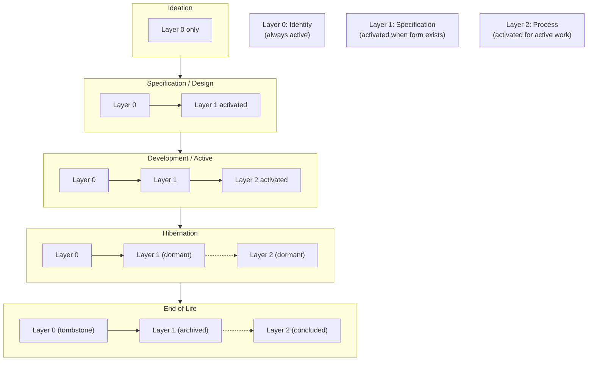
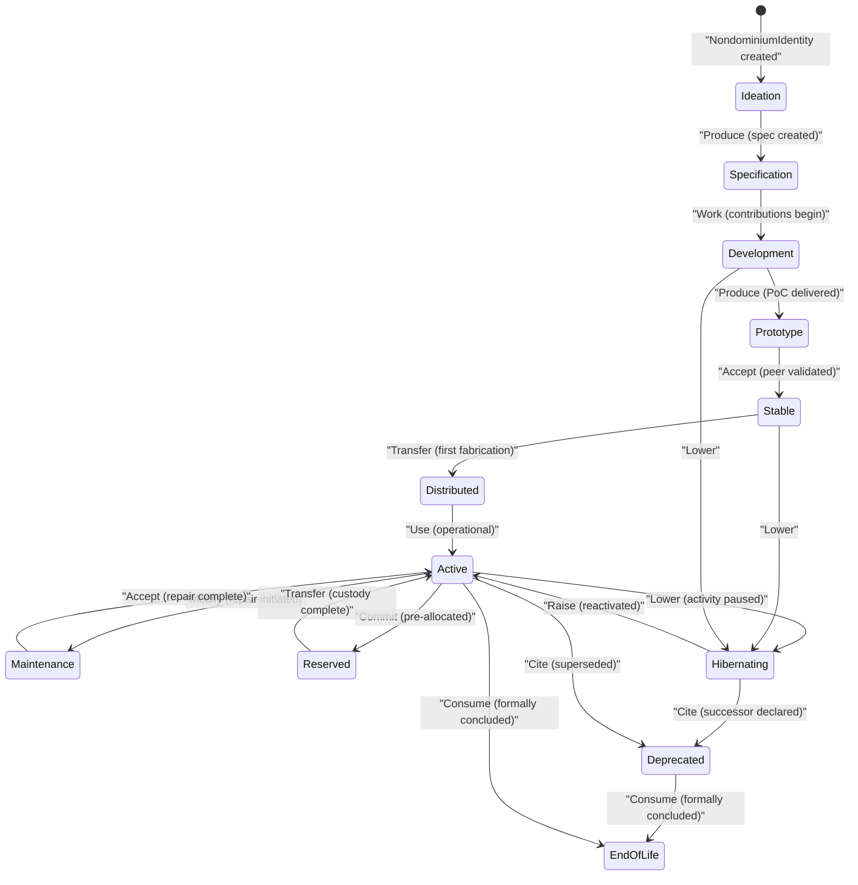
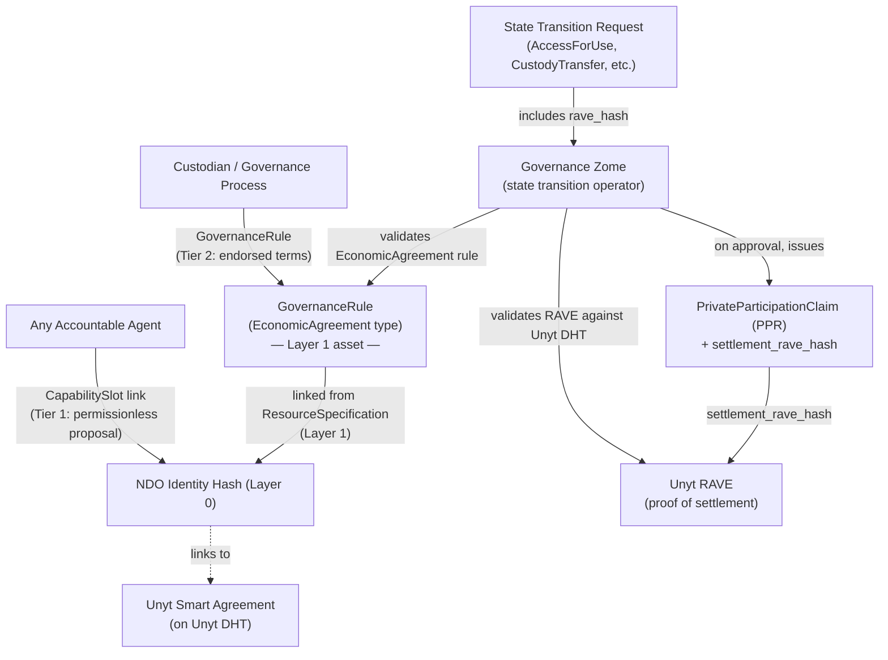
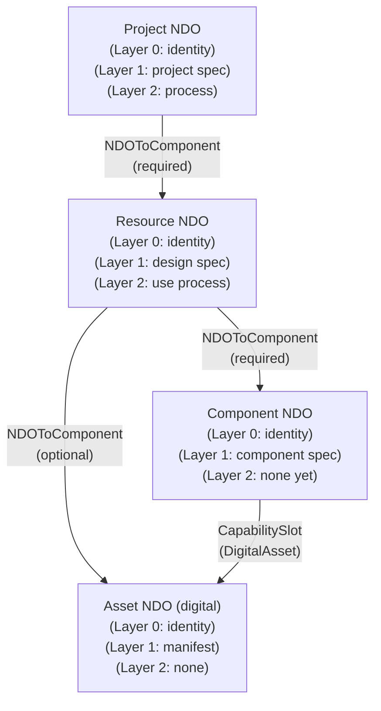
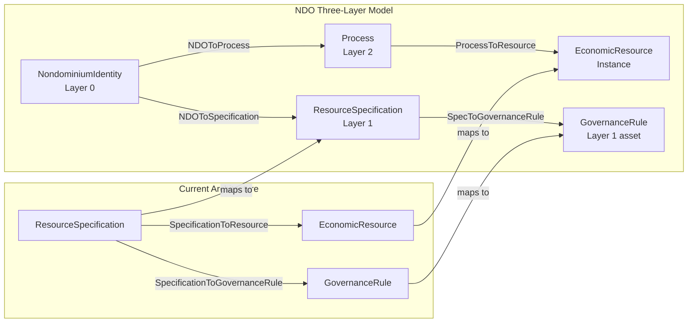

# Nondominium Prima Materia

**Status**: Post-MVP Design Document  
**Created**: 2026-03-10  
**Authors**: Nondominium project  
**Relates to**: `many-to-many-flows.md`, `versioning.md`, `digital-resource-integrity.md`, `unyt-integration.md`

---

## Table of Contents

1. [What is the Prima Materia?](#1-what-is-the-prima-materia)
2. [Complexity Economics as Architectural Foundation](#2-complexity-economics-as-architectural-foundation)
3. [Complexity Oriented Programming](#3-complexity-oriented-programming)
4. [The Three-Layer Model: The Prima Materia](#4-the-three-layer-model-the-prima-materia)
5. [Lifecycle State Machine](#5-lifecycle-state-machine)
6. [The Surface of Attachment — Capability Slots](#6-the-surface-of-attachment--capability-slots)
7. [Design Patterns](#7-design-patterns)
8. [DHT Data Structures](#8-dht-data-structures)
9. [Requirements](#9-requirements)
10. [Migration from Current Architecture](#10-migration-from-current-architecture)
11. [Relationship to Other Post-MVP Work](#11-relationship-to-other-post-mvp-work)

---

## 1. What is the Prima Materia?

In medieval alchemy, the *prima materia* is the primordial, undifferentiated substance that underlies all matter — the formless potential from which everything is made. Before a substance becomes gold, lead, or salt, it passes through the prima materia: an essential, minimal state that carries the capacity to become anything. The alchemists were not simply mystifying chemistry. They were describing a pattern: complex things begin as nearly nothing, and their nature reveals itself progressively through process.

This document borrows that metaphor deliberately. A Nondominium Object (NDO) is the prima materia of the Nondominium system: a minimal DHT structure that carries the potential to become any kind of resource — digital or physical, simple or composite, idea or fabricated artifact — and that grows in structure and function as the resource it represents grows in complexity and social embeddedness.

### 1.1 The Gap in the Current Model

The current Nondominium data model contains two primary entry types for resources:

- `ResourceSpecification` — the type or template of a resource: name, description, category, governance rules
- `EconomicResource` — an instance of a resource: quantity, unit, custodian, location, state

This model is well-grounded in the ValueFlows standard and works well for resources that already exist in a stable, operational form. But it has a fundamental limitation: **it represents being, not becoming.**

There is no structure in the current model for a resource that is:
- an idea that has not yet been designed
- a project in active development
- a design under peer review before any physical instance exists
- an artifact entering hibernation, not end-of-life
- a project record that persists as institutional memory after activity has ceased

The current `ResourceState` enum (`PendingValidation`, `Active`, `Maintenance`, `Retired`, `Reserved`) describes operational states of an existing resource. It does not describe the emergence of a resource from nothing, nor its graceful retirement into archival memory.

### 1.2 The Intent of the Prima Materia

The prima materia defines a **minimal DHT object** that:

1. **Exists as a placeholder from the moment of conception** — before design, before specification, before any physical instantiation
2. **Grows in structure progressively** — gaining specification, governance rules, assets, and process infrastructure as the resource matures
3. **Carries a permanent, stable identity** — a content-addressed anchor that persists through all transformations, including end-of-life
4. **Provides a surface of attachment** for capabilities that cannot be anticipated in advance — external hApps, governance tools, fabrication queues, issue trackers
5. **Represents the full lifecycle** — from the first spark of an idea to archival tombstone

### 1.3 The Key Example: Nondominium Itself

The Nondominium hApp is itself an NDO. It began as an idea (Ideation), passed through design (Specification), prototype implementation (Development → Prototype), and is now moving toward its first stable release. Its assets are code on GitHub. Its process is the collaborative work of contributors. Its governance rules are embedded in the code. Its identity is stable across all versions.

When someone starts a hardware design project for a shared CNC machine, they create an NDO. When they publish the 3D files for distributed fabrication, Layer 1 (Specification) is activated. When contributors begin working, Layer 2 (Process) is activated. When the design is mature and being fabricated by many, all three layers are fully active. When the design becomes obsolete, Layers 1 and 2 are archived, but the NDO identity remains — a permanent record that the thing existed, who created it, and what happened to it.

---

## 2. Complexity Economics as Architectural Foundation

The three-layer design of the NDO is not an arbitrary architectural preference. It is a direct consequence of applying complexity economics to the problem of representing resources in a decentralized peer-to-peer system. Three theoretical pillars justify the design.

### 2.1 Bar-Yam: Complexity Matching

Yaneer Bar-Yam's central thesis in *Complexity Rising* is that **a system's behavioral complexity must match the complexity of the challenges it faces**. When the environment's complexity exceeds a system's adaptive capacity, the system fails. Hierarchical command-and-control structures have cognitive ceilings — there is only so much complexity a centralized decision-maker can handle. As the environment grows more complex, decentralized, networked systems with distributed decision-making become necessary.

Applied to DHT data design, this principle has a direct corollary: **do not pre-classify a resource at creation time**. At the moment a resource is conceived, its full lifecycle complexity is unknowable. A project started as a personal experiment may become a global standard. A community tool may be adopted by thousands of fabrication networks. A hardware design may spawn dozens of forks and regional variants. Committing to a fixed classification at t=0 is the data equivalent of hierarchical overreach — assuming a knowledge of the future that no agent possesses.

The OVN computational model (ovn.world) demonstrates this formally: Finite State Machines, the computational model underlying most fixed-classification systems, require a number of states that grows exponentially with social complexity — quickly reaching numbers exceeding the atoms in the observable universe for even modestly complex communities. FSMs are not inadequate; they are categorically incompatible with governing complex human systems. A resource data model built on fixed state at creation is an FSM in disguise.

The solution is the adjacent possible (Kauffman): at any moment, only the next step is visible. The NDO model respects this by making **layer activation a response to rising environmental complexity**, not a commitment made at genesis.

### 2.2 Benkler: Information Opportunity Costs

Yochai Benkler's analysis of commons-based peer production (*Coase's Penguin*, 2002; *The Wealth of Networks*, 2006) identifies the primary economic advantage of P2P coordination as **lower information opportunity costs**. Markets and managerial hierarchies are informationally lossy — they filter, aggregate, and approximate the rich information available in a distributed network. P2P systems process this information with lower loss because agents at the edges of the network can sense and act on local information directly, without routing it through central aggregators.

In the NDO context, this principle justifies the **pay-as-you-grow** structure of layer activation. Each layer carries a coordination overhead:

- Layer 0 (Identity) has near-zero coordination cost: one agent creates one entry.
- Layer 1 (Specification) has moderate cost: governance rules must be written, assets attached, peer review coordinated.
- Layer 2 (Process) has the highest cost: economic events must be recorded, commitments tracked, PPRs issued, multi-agent consent coordinated.

In a hierarchical system, all resources would bear the full overhead of the richest representation, regardless of their current needs. Benkler's insight says this is wasteful — it imposes coordination costs that exceed the information value returned. The NDO model matches coordination cost to actual coordination demand: a tool lent between neighbors needs no Process layer; a shared fabrication standard being actively developed by a distributed network needs all three.

### 2.3 Morin: The Seven Principles of Complexity

Edgar Morin's seven principles of complex thought, applied in the SENSORICA complexity economics framework, provide a philosophical grounding for the NDO's structure. Each principle finds direct expression in the design:

| Morin's Principle | Expression in the NDO |
|---|---|
| **Systemic** (interdependence) | Every NDO exists in relation to agents, processes, and other NDOs; its identity is defined by its links, not its content alone |
| **Holographic** (part reflects whole) | Every NDO carries the full three-layer potential, regardless of its current activation state |
| **Retroactive** (feedback loops) | Lifecycle stage changes are triggered by economic events (outputs of the system feeding back as inputs) |
| **Recursive** (products as producers) | An NDO representing a project produces NDOs representing its outputs; Nondominium-the-hApp produces Nondominium-as-resource |
| **Dialogical** (antagonisms coexist) | The NDO holds the tension between digital and physical, between stability (identity) and change (process), between public (spec) and private (governance) |
| **Reintroduction of the subject** | Agent motivation and contribution are first-class: PPRs, custody, and contribution tracking are built into the NDO's process layer |
| **Ecology of action** | No action guarantees its outcome; the NDO's stigmergic capability surface allows unforeseen capabilities to attach — the system is never fully knowable from the source code alone |

### 2.4 Holonic Structure

The NDO is a **holon** in the sense used by the OVN model: an entity that is simultaneously a whole in itself and a part of a larger whole. Arthur Koestler coined the term *holon* to describe systems where every level of organization is both complete and a component. Holonic systems are characteristic of living organisms, ecosystems, and complex economies.

An NDO is:
- **A whole**: it has its own identity, specification, and process — it is a complete self-describing object
- **A part**: it is embedded in networks of other NDOs — a Project NDO contains Resource NDOs, which contain Design NDOs, which reference Component NDOs

This recursive self-similarity is what makes the NDO fractal. Each NDO carries the same structural potential; the difference between a sub-component and a top-level project is only one of social context and activation state, not of structural type.

---

## 3. Complexity Oriented Programming

The NDO's design embodies a programming paradigm that does not yet have a formal name but is emerging in practice. We call it **Complexity Oriented Programming (COP)**.

### 3.1 The Reductive Paradigm and Its Limits

All dominant programming paradigms share a common epistemological assumption: **complexity is a problem to be eliminated through abstraction**.

- Object-Oriented Programming (OOP) *encapsulates* complexity behind interfaces, hiding internal state
- Functional Programming (FP) *eliminates* side effects, reducing programs to pure transformations
- Procedural programming *linearizes* execution, replacing concurrency with sequence

These strategies are powerful for building closed, bounded systems where the programmer can anticipate all relevant states in advance. But they break down when applied to open, complex, emergent systems — precisely the kind of systems that P2P infrastructure must support.

The failure mode is always the same: the abstraction boundary becomes a wall that the system's actual complexity cannot respect. Side effects leak through interfaces. State escapes encapsulation. The linear pipeline encounters a feedback loop it was not designed to handle. The FSM reaches a state it was not designed to represent.

### 3.2 Complexity Oriented Programming: The Inversion

COP inverts the reductive assumption. Instead of hiding complexity through abstraction, **COP models complexity faithfully and works with it as the primary material**. The vocabulary shifts:

| Reductive Paradigm | Complexity Oriented Programming |
|---|---|
| Single source of truth | Distributed state with coherence protocols |
| Deterministic pipelines | Adaptive feedback architectures |
| Contained side effects | Typed relational events flowing through a graph |
| Static type at creation | Dynamic layer activation in response to context |
| Closed system design | Conditions designed for emergence |

The epistemological shift is from **programmer as god** (designs a closed, fully known system) to **programmer as ecologist** (designs conditions, observes what arises). The system is never fully knowable from the source code alone.

### 3.3 Where COP Already Exists

COP is not invented here — it is being discovered simultaneously in several places:

- **Holochain's agent-centric model**: there is no global state machine. Each agent runs local validation rules, and global coherence *emerges* from the aggregate of local actions. The DHT is not designed; it arises.
- **ValueFlows/REA**: the economic model is not a state machine but a flow of events. Resources do not "have states" in the FSM sense — they *accumulate* economic events that describe what has happened to them. The past is permanent; the present is an interpretation of the past.
- **Actor model concurrency**: concurrent entities with private state communicating through asynchronous messages — the distributed system coordinates without shared mutable state.
- **Reactive/dataflow systems (FRP, signals)**: time and context are primary, not afterthoughts. Computation is driven by the flow of values through a graph, not by sequential instruction execution.
- **Cellular automata**: global patterns emerge from purely local rules. Complexity at the macro level is not programmed; it is grown.

### 3.4 The NDO as a COP Primitive

The NDO is the fundamental COP primitive in the Nondominium system. Its design embodies COP in every structural choice:

- **Layer activation** is not a state machine transition — it is a *response to rising environmental complexity*, designed to allow emergence rather than constrain it
- **Capability slots** are not predefined interfaces — they are *typed relational events* that flow through the DHT link graph, allowing unforeseen tools to attach without modifying the NDO entry
- **Lifecycle transitions** are not deterministic state machine edges — they are *feedback arcs* driven by economic events (agents' actions feeding back into the resource's representation of itself)
- **The tombstone** at end of life is not a deletion — it is the *permanent memory* that the system was alive, respecting the append-only nature of the DHT as a feature, not a constraint

The honest challenge of COP, noted in the complexity_oriented_programming archive: tooling. Debuggers, type systems, and unit tests all assume reducibility. COP requires new verification paradigms — closer to simulation and formal methods than conventional testing. This is reflected in the Nondominium testing strategy, which relies on multi-agent Tryorama scenarios rather than isolated unit tests.

---

## 4. The Three-Layer Model: The Prima Materia

The prima materia is realized in the NDO as a **three-layer structure**, where each layer corresponds to a different register of complexity and is activated independently in response to the resource's current context.

### 4.1 The Brain Architecture Analogy

The human brain provides the most vivid structural analogy. It did not evolve as a single organ — it evolved in layers, each built on and coupled to the previous:

- The **brainstem** handles vital functions: breathing, heartbeat, arousal. It is always active. The organism cannot survive without it. It is the oldest evolutionary layer.
- The **cerebellum** handles coordination, posture, and procedural memory — the *form* of the body's activity. It evolved on top of the brainstem and is coupled to it, but can be understood as a distinct functional layer.
- The **cortex** handles higher cognition, agency, and deliberate action. It evolved on top of the cerebellum and is the most recently evolved layer. It is situational — not all cognitive tasks require cortical engagement.

These layers do not replace each other. They are **coupled and co-active**. The cortex does not work without the brainstem. But the brainstem can sustain basic life without the cortex (as in the case of brain death with brainstem function preserved). And at death, the cortex goes first.

The NDO mirrors this exactly:

```
┌─────────────────────────────────────────────────────────────────┐
│ Layer 2 — PROCESS                                               │
│ (cortex: agency, higher cognition, multi-agent economic work)   │
│ Activated situationally. Deactivated at hibernation / EOL.      │
├─────────────────────────────────────────────────────────────────┤
│ Layer 1 — SPECIFICATION                                         │
│ (cerebellum: coordination, form, replication)                   │
│ Activated when form needs to be shared. Archived at EOL.        │
├─────────────────────────────────────────────────────────────────┤
│ Layer 0 — IDENTITY                                              │
│ (brainstem: vital functions, always on, the tombstone)          │
│ Always active. The last thing standing. Never voided.           │
└─────────────────────────────────────────────────────────────────┘
```

### 4.2 Layer 0: Identity — The Permanent Anchor

Layer 0 is the prima materia in its most essential form. It is the minimum viable NDO — the smallest structure that gives a resource a stable, cryptographically-anchored identity in the DHT.

**Structure:**
```rust
struct NondominiumIdentity {
    name: String,
    initiator: AgentPubKey,
    property_regime: PropertyRegime,
    resource_nature: ResourceNature,
    lifecycle_stage: LifecycleStage,
    created_at: Timestamp,
    // Optional: a brief human-readable description
    description: Option<String>,
}
```

**Key properties:**
- The **action hash** of this genesis entry becomes the permanent, stable identity of the NDO — a DID-like namespace that all other layers and capabilities link to
- It is **never voided** — Holochain's append-only DHT makes deletion impossible, and this is correct: the identity of a resource that ever existed should be permanently accessible
- The only field that evolves is `lifecycle_stage`, updated through governance-validated transitions
- At end of life, Layer 0 alone remains as the **tombstone**: a permanent record that the resource existed, who created it, its nature, and when it concluded

**When Layer 0 exists alone:**
- A stub registration: "this thing exists, I intend to develop it"
- A tombstone: all other layers have been archived, the identity remains
- The minimal representation of an idea that has not yet been designed

### 4.3 Layer 1: Specification — The Form

Layer 1 is activated when a resource has a form that needs to be communicated to others — when the resource is ready to be described, shared, peer-reviewed, or replicated.

**Activation mechanism:** Creation of an `NDOToSpecification` link from the Layer 0 identity hash to a `ResourceSpecification` entry.

**Layer 1 carries:**
- Design intent and description (what the resource is)
- Governance rules (who can access it and how)
- Assets: files, 3D models, code references, digital integrity manifests, documentation links
- Tags and categories for discovery

**When to activate Layer 1:**
- The resource has a design worth sharing with others
- Distributed fabrication is intended (the spec is the product)
- Peer review or validation of the design is needed
- The resource needs to be discoverable by category or tag

**When Layer 1 becomes dormant:**
- The resource enters hibernation or end of life
- The specification is archived (`is_active: false`)
- The `NDOToSpecification` link remains readable (DHT is append-only), but no new updates are made to the spec

**The design file as the product:** In the distributed fabrication context (cosmolocal production), the Layer 1 specification *is* the product in the most meaningful sense. When a hardware design reaches `Stable` lifecycle stage, anyone with a 3D printer and the fabrication spec can produce a local instance. The spec is not documentation for a product — it *is* the shareable, replicable artifact. This is the nondominium model's most radical departure from capitalist product logic.

### 4.4 Layer 2: Process — The Activity

Layer 2 is activated when there is active multi-agent economic work around the resource — when contributions are being tracked, custody is being transferred, use events are being recorded, or commitments are being made.

**Activation mechanism:** Creation of an `NDOToProcess` link from the Layer 0 identity hash to a ValueFlows `Process` entry.

**Layer 2 carries:**
- `EconomicEvent` records of all actions taken on or with the resource
- `Commitment` records of agents' intentions to perform future actions
- `Claim` records linking commitments to fulfilling events
- `PrivateParticipationClaim` (PPR) records issued to participants
- Labor contribution tracking for OVN-compliant attribution

**When to activate Layer 2:**
- A second agent becomes involved (multi-agent coordination begins)
- Development work begins in earnest and contributions need to be tracked
- Custody transfers are required
- Use events or resource access need to be recorded
- PPRs need to be issued (any economically accountable interaction)

**When Layer 2 becomes dormant:**
- The process concludes: all commitments are fulfilled or cancelled, all events are finalized
- The resource enters hibernation (process paused, not terminated)
- End of life: process is formally concluded with terminal events

### 4.5 Layer Composition Across the Lifecycle



---

## 5. Lifecycle State Machine

The current `ResourceState` enum (`PendingValidation`, `Active`, `Maintenance`, `Retired`, `Reserved`) describes operational states but does not capture the full lifecycle from emergence to archival. The NDO requires a richer vocabulary.

### 5.1 LifecycleStage Enum

```rust
pub enum LifecycleStage {
    // --- Emergence Phase ---
    Ideation,       // Placeholder: name and intent only. Layer 0 alone.
    Specification,  // Design/requirements being written. Layer 1 activating.
    Development,    // Active construction, prototyping. Layers 0+1+2 active.
    Prototype,      // PoC exists, not production-ready. Layers 0+1+2 active.

    // --- Maturity Phase ---
    Stable,         // Production-ready, design is replicable. All layers active.
    Distributed,    // Being actively fabricated/used across the network.

    // --- Operation Phase ---
    Active,         // In normal use. All layers active.
    Maintenance,    // Under repair or servicing. All layers active.
    Reserved,       // Allocated but not yet in active use.

    // --- Suspension ---
    Hibernating,    // Not end-of-life — dormant. Layers 1+2 dormant, L0 active.

    // --- Terminal ---
    Deprecated,     // Superseded by a newer version. Links to successor.
    EndOfLife,      // Concluded. L0 tombstone, L1 archived, L2 concluded.
}
```

### 5.2 Lifecycle → Layer Activation Table

| Lifecycle Stage | Layer 0 | Layer 1 | Layer 2 | Notes |
|---|---|---|---|---|
| `Ideation` | Active | — | — | Pure stub: name + property regime |
| `Specification` | Active | Activating | — | Spec being written, governance rules defined |
| `Development` | Active | Active | Active | Multi-agent contributions begin |
| `Prototype` | Active | Active | Active | PoC exists, process ongoing |
| `Stable` | Active | Active | Active | Spec is production-ready |
| `Distributed` | Active | Active | Active | Use events flowing |
| `Active` | Active | Active | Active | Normal operational state |
| `Maintenance` | Active | Active | Active | Repair process underway |
| `Reserved` | Active | Active | Active | Custody pre-allocated |
| `Hibernating` | Active | Dormant | Dormant | Identity preserved; no new events |
| `Deprecated` | Active | Archived | Concluded | Successor NDO linked |
| `EndOfLife` | Active (tombstone) | Archived | Concluded | Permanent record only |

### 5.3 Lifecycle Transitions and Governing Events

Each transition between lifecycle stages is driven by a **VfAction economic event**, validated by the governance zome acting as state transition operator. This is consistent with the existing governance-as-operator architecture (`REQ-ARCH-07`).



**Transition authorization by role:**

| Transition | Authorized by |
|---|---|
| Ideation → Specification | Initiator (Layer 0 creator) |
| Specification → Development | Initiator or any Accountable Agent with contribution |
| Development → Prototype | Custodian + governance validation |
| Prototype → Stable | Multi-agent peer validation (configurable N-of-M) |
| Any → Hibernating | Current custodian(s) |
| Hibernating → Active | Current custodian(s) |
| Any → Deprecated | Custodian + declaration of successor NDO |
| Any → EndOfLife | Custodian + challenge period (see REQ-GOV-11 to REQ-GOV-13) |

---

## 6. The Surface of Attachment — Capability Slots

A central requirement of the NDO is that it must not need to anticipate all future capabilities at design time. Like Discord channels to which anyone can add integrations, or like the MOSS Weave Interaction Pattern where hApps can link to any Weave Asset, the NDO must provide a **surface of attachment** for capabilities that do not yet exist.

### 6.1 The COP Principle of the Attachment Surface

In COP terms: you cannot design the attachment surface in advance. The DHT link space *is* the surface. Any agent, any hApp, any future tool that knows the Layer 0 identity hash can create a link from that hash to whatever it needs to attach. The NDO entry itself does not change.

This is **stigmergy** in the complexity economics sense: indirect coordination through the environment. Ants coordinate the construction of a nest not by communicating plans but by leaving pheromone trails (environmental modifications) that other ants respond to. The NDO's Layer 0 hash is the pheromone trail — any agent can respond to it by attaching capabilities.

### 6.2 Stigmergic Link Channels

The attachment mechanism uses typed DHT links with structured link tags:

```
NDO_identity_hash →[LinkType: CapabilitySlot, tag: { slot_type, author, attached_at }]→ capability_target_hash
```

**Predefined slot type vocabulary** (extensible):

| Slot Type | Description | Typical target |
|---|---|---|
| `Documentation` | Human-readable docs, wiki, manuals | Wiki entry hash or external URI |
| `IssueTracker` | Bug reports, feature requests | Issue tracker hApp cell hash |
| `FabricationQueue` | Distributed manufacturing requests | Fabrication process hash |
| `GovernanceDAO` | Governance proposals and voting | DAO hApp cell hash |
| `VersionGraph` | Version history and forks | Versioned entity hash (see `versioning.md`) |
| `DigitalAsset` | Files, 3D models, code, manifests | Asset manifest hash |
| `WeaveWAL` | Moss/Weave Asset Link | WAL (Weave Asset Locator) |
| `UnytAgreement` | Programmable economic terms governing value flows triggered by resource interactions | Unyt Smart Agreement entry hash (cross-cell reference) |
| `CustomApp` | Any other hApp integration | Any hash, labelled by consumer |

### 6.3 MOSS / Weave Integration

The [Weave Interaction Pattern](https://dev.theweave.social/concepts/introduction.html) defines an open standard for creating, searching, linking, and organizing "social space units" — precisely what an NDO is. MOSS integration works as follows:

1. The NDO is declared as a Weave Asset by creating a `WeaveWAL` capability slot pointing to the asset's WAL
2. Other MOSS tools (issue trackers, document editors, governance DAOs, fabrication queues) can attach to the NDO's Layer 0 hash via the Weave protocol without modifying the NDO entry
3. As the NDO gains lifecycle stages, MOSS tools can respond to those transitions — a fabrication queue tool might automatically activate when the NDO reaches `Stable`

### 6.4 Governance of the Attachment Surface

The stigmergic surface is permissionless at the DHT level — any agent can create a capability link. But the governance layer determines which links are **trusted** and surfaced to other agents, versus which are ignored or filtered:

- Links created by the initiator or custodians are trusted by default
- Links created by Accountable Agents are conditionally trusted
- Links created by unknown agents are filtered until governance validation
- The governance zome can validate capability attachments using the same `validate_new_resource` pattern already in place

This mirrors the approach taken in the wider complex systems literature: edge-based sensing and attachment is permissionless (lower information opportunity costs), while trust propagation and filtering happens through distributed consensus rather than centralized gatekeeping.

### 6.5 Economic Agreement Slots — Unyt Integration

*A detailed analysis of the `UnytAgreement` slot type, its relationship to the governance layer, and the three-phase integration path.*

#### Why Unyt Is a Capability, Not a Layer

The prima materia model has three structural layers. It might seem natural to propose a fourth — an "Economic Layer" — for payment and value-flow infrastructure. This would be the wrong architecture.

The COP principle of pay-as-you-grow is explicit: impose only the coordination overhead that the resource's current social complexity demands. Not all resources need payment infrastructure. A bicycle lent between neighbours does not need a Unyt Smart Agreement. A shared CNC machine used by fifty contributors under a usage-fee model does. Imposing economic infrastructure at NDO creation — making it structural — would repeat the reductive paradigm mistake that the three-layer model was designed to avoid. It would be a fixed classification at t=0 of a future that no agent can know.

Unyt belongs in the capability surface for the same reason that governance DAOs, fabrication queues, and issue trackers do: it is an economic operator that some resources need and others do not, and its attachment should emerge from the network's actual practice rather than be prescribed by the programmer.

The `UnytAgreement` slot type has one property that other slot types do not: it is **governance-enforceable**. A `Documentation` link is informational — the governance zome does not condition state transitions on it. A `UnytAgreement` link, when endorsed through a `GovernanceRule` of type `EconomicAgreement`, becomes a precondition for transition approval. This makes it a hybrid: permissionless at the attachment surface, authoritative at the governance layer.

#### Two-Tier Economic Authority

The `UnytAgreement` capability slot operates at two tiers.

**Tier 1 — Permissionless Proposal (CapabilitySlot)**

Any Accountable Agent can attach a Unyt Smart Agreement to any NDO by creating a `CapabilitySlot` link of type `UnytAgreement`. This is an assertion: "I believe this agreement should govern interactions with this resource." The governance zome does not enforce it. Other agents can read it as a proposal, a community suggestion, or a pricing signal. Multiple competing proposals may coexist.

This tier respects the stigmergic principle: lower information opportunity costs, permissionless economic expression, no gatekeeping on proposals.

**Tier 2 — Governance Endorsement (GovernanceRule)**

When the NDO's custodian — or a community governance process — formally endorses a Unyt Smart Agreement by creating a `GovernanceRule` entry of type `EconomicAgreement`, the agreement becomes enforceable. State transitions that trigger it (Access, CustodyTransfer, service processes) require the requesting agent to provide a valid Unyt RAVE as proof of economic settlement before the governance zome approves the transition.

The capability slot (Tier 1) and the governance rule (Tier 2) are independent but complementary: the slot makes the agreement **discoverable**; the rule makes it **mandatory**.



#### Unyt Smart Agreement as Economic GovernanceRule

The current `GovernanceRule` entry in `zome_resource` carries `rule_type`, `rule_data` (JSON-encoded), and an optional `enforced_by` role requirement. The Unyt integration adds a new `rule_type` variant and a corresponding structured `rule_data` schema:

```rust
// New variant in GovernanceRuleType enum (zome_resource integrity)
pub enum GovernanceRuleType {
    // ... existing rule types ...
    EconomicAgreement, // rule_data: JSON-serialized EconomicAgreementRuleData
}

// rule_data schema for EconomicAgreement rules
#[derive(Serialize, Deserialize)]
pub struct EconomicAgreementRuleData {
    pub unyt_alliance_id: String,          // Network seed of the Unyt Alliance
    pub smart_agreement_hash: String,       // Entry hash of the Unyt Smart Agreement
    pub trigger_actions: Vec<VfAction>,     // Which VfActions trigger this agreement
    pub settlement_window_secs: u64,        // Max time between RAVE execution and transition request
    pub note: Option<String>,               // Human-readable description of the economic terms
}
```

When the governance zome encounters an `EconomicAgreement` rule during a state transition evaluation, it executes the following validation sequence:

1. Confirms that the transition's `VfAction` is in the rule's `trigger_actions` list
2. Requires a `rave_hash` field in the transition request payload
3. Queries the Unyt DHT (via cross-DNA `call()`) to retrieve and validate the RAVE
4. Confirms the RAVE was executed within the declared `settlement_window_secs`
5. Confirms the RAVE's inputs match the transition context (resource identity, provider, receiver, quantity or duration)
6. Only then approves the state transition and issues the PPR

This makes the governance zome's approval conditional on cryptographic proof of economic settlement — the resource does not move (physically, digitally, or in custody) until the agreed value has flowed.

#### Value Flow Patterns

Four standard patterns map the most common resource-interaction economics onto Unyt's Smart Agreement library:

| Pattern | Trigger VfAction | Unyt Agreement Template | Economic logic |
|---|---|---|---|
| **Access Fee** | `AccessForUse` | Conditional Forward | User pre-pays; access granted on RAVE |
| **Service Billing** | `Work` (fulfilled Claim) | Proof-of-Service | Provider paid on validated Claim |
| **Revenue Sharing** | `Transfer` | Aggregate Payment | Proceeds split: custodian / protocol / creator |
| **Custody Bond** | `TransferCustody` | Conditional Forward (escrowed) | Bond held; returned on clean handoff with PPR |

These map directly to the Smart Agreement templates in the [Unyt Smart Agreement Library](https://github.com/unytco/smart_agreement_library). The `Conditional Forward` template is the workhorse for access and custody patterns; `Aggregate Payment` and `Proof of Service` serve billing and revenue distribution.

The templates use RHAI scripting — the same logic that currently drives Unyt's DePIN billing (Log → Invoice → Agreement → Settlement). For Nondominium, the "log" is the Nondominium `Commitment + Claim + ValidationReceipt` chain; the invoice is implicit in the `EconomicAgreementRuleData`; the settlement is the RAVE.

#### PPR and RAVE: A Complete Provenance Chain

When a state transition is approved with a valid RAVE, the `PrivateParticipationClaim` generated for the interaction carries the RAVE hash as an optional field:

```rust
pub struct PrivateParticipationClaim {
    // ... existing fields ...
    pub settlement_rave_hash: Option<String>, // Unyt RAVE hash, if economic settlement occurred
}
```

This creates a complete, cross-verifiable provenance chain:

```
Commitment
  └─ (fulfilled by) EconomicEvent
       └─ (generates) PrivateParticipationClaim (PPR)
            └─ settlement_rave_hash → Unyt RAVE
                 └─ (verifiable on Unyt DHT: inputs, outputs, agreement, executor)
```

The PPR is the **participation proof**: who did what, at what quality, in which role. The RAVE is the **economic proof**: what value flowed, to whom, under what rules, verified by Unyt peers. Together, they constitute a full, mutually-reinforcing record of a resource interaction that neither system alone can provide.

This linkage also feeds back into the credit system: agents whose PPRs consistently carry RAVEs (meaning they reliably execute their economic obligations) earn higher reputation scores, which in turn increases their Unyt credit limits (see `unyt-integration.md`). Reputation and credit become two readings of the same underlying participation data.

#### The Resource as Economic Actor

When an NDO has an endorsed `EconomicAgreement` governance rule, it becomes a **self-pricing, self-settling economic actor**. No platform intermediary determines what the resource costs, no rent is extracted by infrastructure owners, and no contract enforcement requires a legal system. The community that embedded the rule in the resource's Layer 1 specification determines the economic terms, and Unyt enforces them cryptographically among peers.

This is the nondominium model's deepest departure from platform economics. Platform platforms capture value by positioning themselves between resource and user — Airbnb between host and guest, Uber between driver and passenger. In the NDO model, the "platform" is the DHT itself: owned by no one, accessible to everyone, governed by the rules the community wrote into the resource. The resource is simultaneously a physical or digital artifact, a governance system, and an economic agent.

In complexity economics terms: the resource has become a **holon with economic agency**. Not only does it exist within the economic web (participating in ValueFlows events), it actively shapes the economic flows that run through it — enforcing its own terms, rewarding its stewards, and settling its debts, all without human intermediation.

#### Integration Path

The Unyt integration is structured as three independent phases, each delivering immediate value and requiring no rollback of prior work.

**Phase 1 — Capability Surface Extension** *(no zome structural changes required)*

Add `UnytAgreement(String)` to the `SlotType` enum. Any Accountable Agent can now attach a proposed Unyt Smart Agreement to any NDO. The governance zome does not enforce these links — they are informational, discoverable proposals. This phase delivers: economic expression in the network (market pricing signals without enforcement), tooling foundations (UIs can surface proposed payment terms), and community standard-setting (the network can develop shared pricing conventions before enforcement is added).

**Phase 2 — Governance Rule Extension** *(zome_resource changes only)*

Add `EconomicAgreement` to the `GovernanceRuleType` enum and define the `EconomicAgreementRuleData` schema. Custodians can now formally endorse a Unyt Smart Agreement by creating a `GovernanceRule` entry. The governance zome reads these rules but does not yet enforce them at transition time — Phase 2 makes the endorsement discoverable and legible to the network without yet conditioning transitions on RAVEs. This phase delivers: governance-layer economic declarations, tooling for custodians to set and communicate official payment terms, and the data structure foundation for Phase 3.

**Phase 3 — Governance Zome Integration** *(zome_gouvernance changes)*

The governance zome's `evaluate_transition_request` function is extended to: (a) check for `EconomicAgreement` governance rules when processing relevant `VfAction` events; (b) require a `rave_hash` in transition requests when such a rule exists; (c) validate the RAVE via cross-DNA call to the Unyt cell; (d) link the RAVE hash into the generated PPR via `settlement_rave_hash`. This phase delivers: full enforcement, automatic settlement, and the complete PPR↔RAVE provenance chain. The NDO becomes a fully self-pricing economic actor.

---

## 7. Design Patterns

The NDO embodies six named design patterns. These patterns are architectural idioms that recur throughout the system and should guide implementation decisions.

### Pattern 1: Identity Anchor

**Intent:** Give every resource a stable, cryptographically-secure identity anchor that persists through all transformations, including end of life.

**Structure:** The `NondominiumIdentity` genesis entry. Its action hash is the stable namespace for all other entries and links. Nothing else in the system references a resource by any other handle.

**Rationale:** In complex adaptive systems, identity must be decoupled from form. A person's identity persists even as their body, beliefs, and relationships change. A corporation's identity persists through restructuring. The NDO's identity must persist through design changes, custody transfers, version forks, and end of life. Content-addressing in Holochain makes this natural: the action hash of the genesis entry never changes.

**Holochain idiom:**
```rust
// Layer 0 creation — returns the stable identity hash
let ndo_hash = create_entry(&EntryTypes::NondominiumIdentity(identity))?;
// Everything else links to ndo_hash
```

---

### Pattern 2: Complexity-Matched Layer Activation

**Intent:** Activate only the structural complexity that the current coordination environment demands. Do not pay coordination costs in advance of need.

**Structure:** Layer activation via link creation. Layer 1 activates when `NDOToSpecification` link is created. Layer 2 activates when `NDOToProcess` link is created. Both can be created retroactively, at any lifecycle stage.

**Rationale:** Benkler's information opportunity cost analysis: overhead that exceeds the value of the coordination it enables is pure waste. A tool being lent between friends does not need a full ValueFlows process. A community hardware standard being developed across fifty fabrication networks does. The NDO model allows the system's complexity to grow with the resource's social complexity, not ahead of it.

**Holochain idiom:**
```rust
// Activate Layer 1 — link identity to specification
create_link(ndo_hash, spec_hash, LinkTypes::NDOToSpecification, ())?;

// Activate Layer 2 — link identity to process
create_link(ndo_hash, process_hash, LinkTypes::NDOToProcess, ())?;
```

---

### Pattern 3: Holonic Composition

**Intent:** Allow NDOs to contain other NDOs, creating fractal hierarchies where every level of organization has the same structural potential.

**Structure:** `NDOToComponent` links from a parent NDO's identity hash to child NDO identity hashes. A Project NDO links to Resource NDOs. A Resource NDO links to Design NDOs. A Design NDO links to Component NDOs.

**Rationale:** Morin's holographic principle and the fractal composable resource architecture (documented in `digital-resource-integrity.md`). In complex systems, the same structure appears at every scale. The NDO's three-layer potential is the same whether the resource is an atomic component or a multi-organization project.

**Holochain idiom:**
```rust
// Link parent NDO to child NDO
create_link(
    parent_ndo_hash,
    child_ndo_hash,
    LinkTypes::NDOToComponent,
    LinkTag::new(component_role.as_str()), // e.g., "required", "optional", "alternative"
)?;
```

---

### Pattern 4: Progressive Disclosure

**Intent:** Present resources at the appropriate level of complexity for the current context, without exposing structural complexity that is not yet active.

**Structure:** Three starting archetypes that correspond to common initialization states, presented as UI choices that set the initial lifecycle stage. These are starting configurations, not permanent classifications.

| Archetype | Layers active | Lifecycle stage | Use when |
|---|---|---|---|
| Stub | L0 only | `Ideation` | Registering an intention |
| Open Design | L0 + L1 | `Specification` | Sharing a design |
| Active Project | L0 + L1 + L2 | `Development` | Starting work with collaborators |

**Rationale:** Kauffman's adjacent possible — present only what is currently achievable. An agent creating their first NDO should not be confronted with the full complexity of the three-layer model. The system should reveal its depth progressively as the resource's context demands it.

---

### Pattern 5: Tombstone

**Intent:** Preserve permanent identity records for all resources that have ever existed, including those that have reached end of life, been deprecated, or been abandoned.

**Structure:** At end of life, only Layer 0 remains active. Layers 1 and 2 are archived (spec `is_active: false`, process concluded with terminal `EconomicEvent`). The identity entry is never deleted.

**Rationale:** The DHT is append-only — this is not a limitation, it is a feature. The permanent memory of what resources existed, who created them, and what happened to them is institutional knowledge. Tombstones enable:
- OVN-compliant contribution tracking even after a project ends
- Versioning lineage that traces forks back to their origins
- Historical record for the network

**Holochain idiom:**
```rust
// End-of-life transition — archive layers
update_entry(spec_hash, &ResourceSpecification { is_active: false, ..spec })?;
// Create terminal EconomicEvent for Layer 2
create_entry(&EntryTypes::EconomicEvent(EconomicEvent {
    action: VfAction::Consume,
    lifecycle_transition: Some(LifecycleStage::EndOfLife),
    ..
}))?;
// Layer 0 NondominiumIdentity is NOT deleted — it becomes the tombstone
```

---

### Pattern 6: Stigmergic Capability Attachment

**Intent:** Allow any agent or external hApp to attach capabilities to an NDO without modifying the NDO entry, without requiring permission from the NDO's custodian, and without needing to have been anticipated by the NDO's designer.

**Structure:** `CapabilitySlot` links from the Layer 0 identity hash to capability targets. Link tags carry the slot type, author, and attachment timestamp. Governance layer filters trusted vs untrusted links.

**Rationale:** Morin's ecology of action: no action guarantees its outcome. The capabilities that will be most useful to attach to a resource cannot be known at creation time. The attachment surface must be open. Centralized gatekeeping of capabilities (requiring permission from the NDO custodian before attaching) would impose coordination costs that violate Benkler's information opportunity cost principle.

**Holochain idiom:**
```rust
let slot_tag = CapabilitySlotTag {
    slot_type: SlotType::IssueTracker,
    attached_at: sys_time()?,
};
create_link(
    ndo_identity_hash,
    issue_tracker_cell_hash,
    LinkTypes::CapabilitySlot,
    LinkTag::new(serde_json::to_vec(&slot_tag)?),
)?;
```

---

## 8. DHT Data Structures

### 8.1 NondominiumIdentity Entry (Layer 0)

```rust
#[hdk_entry_helper]
#[derive(Clone, PartialEq)]
pub struct NondominiumIdentity {
    // Core identity fields
    pub name: String,
    pub description: Option<String>,
    pub initiator: AgentPubKey,

    // Classification
    pub property_regime: PropertyRegime,
    pub resource_nature: ResourceNature,

    // Initial lifecycle state
    pub lifecycle_stage: LifecycleStage,

    // Timestamp
    pub created_at: Timestamp,
}
```

### 8.2 Supporting Enums

```rust
#[derive(Clone, PartialEq, Debug, Serialize, Deserialize)]
pub enum PropertyRegime {
    Commons,      // Governed as a commons (no individual ownership)
    Individual,   // Individual stewardship/ownership
    Collective,   // Collective/cooperative ownership
    Mixed,        // Hybrid regime (defined in governance rules)
}

#[derive(Clone, PartialEq, Debug, Serialize, Deserialize)]
pub enum ResourceNature {
    Digital,   // Software, data, design files, documents
    Physical,  // Material objects, equipment, spaces
    Hybrid,    // Digital twin of a physical resource, or physical+digital bundle
}

#[derive(Clone, PartialEq, Debug, Serialize, Deserialize, Default)]
pub enum LifecycleStage {
    // Emergence
    #[default]
    Ideation,
    Specification,
    Development,
    Prototype,

    // Maturity
    Stable,
    Distributed,

    // Operation
    Active,
    Maintenance,
    Reserved,

    // Suspension
    Hibernating,

    // Terminal
    Deprecated,
    EndOfLife,
}
```

### 8.3 Capability Slot Link Tag

```rust
#[derive(Clone, Debug, Serialize, Deserialize)]
pub struct CapabilitySlotTag {
    pub slot_type: SlotType,
    pub attached_at: Timestamp,
    pub label: Option<String>, // Human-readable label for this specific slot
}

#[derive(Clone, Debug, Serialize, Deserialize)]
pub enum SlotType {
    Documentation,
    IssueTracker,
    FabricationQueue,
    GovernanceDAO,
    VersionGraph,
    DigitalAsset,
    WeaveWAL,
    UnytAgreement(String), // Unyt Alliance network seed identifier (empty string = sandbox default)
    CustomApp(String),     // Extensible: custom slot type identified by string
}
```

### 8.4 New Link Types (additions to zome_resource integrity)

```rust
// In zome_resource integrity LinkTypes enum — new variants to add:
pub enum LinkTypes {
    // ... existing link types ...

    // --- NDO Three-Layer Links ---
    NDOToSpecification,     // NondominiumIdentity → ResourceSpecification (Layer 1 activation)
    NDOToProcess,           // NondominiumIdentity → Process (Layer 2 activation)
    NDOToComponent,         // NondominiumIdentity → NondominiumIdentity (holonic composition)

    // --- Capability Surface ---
    CapabilitySlot,         // NondominiumIdentity → capability target (typed by tag)

    // --- Discovery ---
    AllNDOs,                // Anchor → NondominiumIdentity (global discovery)
    NDOsByLifecycleStage,   // LifecyclePath → NondominiumIdentity
    NDOsByNature,           // NaturePath → NondominiumIdentity
    NDOsByRegime,           // RegimePath → NondominiumIdentity

    // --- Lifecycle History ---
    NDOLifecycleHistory,    // NondominiumIdentity → LifecycleEvent (audit trail)
}
```

### 8.5 NondominiumIdentity Updates

Layer 0 entries may be updated only to change `lifecycle_stage`. All other fields are immutable after creation. This preserves the identity anchor property: the content of the NDO changes as little as possible, while the DHT link graph around it grows freely.

```rust
// Only lifecycle_stage updates are permitted
pub struct UpdateNDOLifecycleInput {
    pub original_action_hash: ActionHash,
    pub previous_action_hash: ActionHash,
    pub new_stage: LifecycleStage,
    pub transition_event_hash: ActionHash, // Must reference a valid EconomicEvent
}
```

### 8.6 Holonic Composition Diagram



---

## 9. Requirements

### 9.1 Layer 0 — Identity Requirements

- **REQ-NDO-L0-01**: The system shall support the creation of a `NondominiumIdentity` entry as the minimal representation of any Nondominium Object, requiring only `name`, `initiator`, `property_regime`, `resource_nature`, `lifecycle_stage`, and `created_at`.
- **REQ-NDO-L0-02**: The action hash of the `NondominiumIdentity` genesis entry shall be the stable, permanent identity of the NDO for its entire existence and shall never be voided or replaced.
- **REQ-NDO-L0-03**: A `NondominiumIdentity` entry shall never be deletable by any agent or governance action. Its permanent presence in the DHT is a design guarantee, not a policy choice.
- **REQ-NDO-L0-04**: Only the `lifecycle_stage` field of a `NondominiumIdentity` entry may be updated after creation. All other fields are immutable.
- **REQ-NDO-L0-05**: Every update to `lifecycle_stage` shall reference a valid `EconomicEvent` action hash as the triggering transition event.
- **REQ-NDO-L0-06**: At end of life (`LifecycleStage::EndOfLife`), the `NondominiumIdentity` entry shall remain fully readable and discoverable, serving as a tombstone.
- **REQ-NDO-L0-07**: The system shall support discovery of NDOs by `lifecycle_stage`, `resource_nature`, and `property_regime` via DHT path-based anchors.

### 9.2 Layer 1 — Specification Requirements

- **REQ-NDO-L1-01**: Layer 1 shall be activated by creating an `NDOToSpecification` link from the NDO identity hash to a `ResourceSpecification` entry. No modification of the `NondominiumIdentity` entry is required for activation.
- **REQ-NDO-L1-02**: Layer 1 may be activated at any lifecycle stage at or after `Ideation`. Retroactive activation (for NDOs that began at `Ideation` without a spec) shall be fully supported.
- **REQ-NDO-L1-03**: Multiple `ResourceSpecification` entries may be linked to one NDO identity, representing version evolution. The most recent link shall be considered the canonical Layer 1 specification.
- **REQ-NDO-L1-04**: When Layer 1 enters dormant state (hibernation or end of life), the specification shall be marked `is_active: false`. The `NDOToSpecification` link shall remain readable.
- **REQ-NDO-L1-05**: `GovernanceRule` entries shall continue to be linked to `ResourceSpecification` entries as currently implemented. They are considered Layer 1 assets.
- **REQ-NDO-L1-06**: Digital asset references (files, 3D models, code, integrity manifests) shall be attached to the NDO via `CapabilitySlot` links of type `DigitalAsset`, not embedded in the `ResourceSpecification` entry.

### 9.3 Layer 2 — Process Requirements

- **REQ-NDO-L2-01**: Layer 2 shall be activated by creating an `NDOToProcess` link from the NDO identity hash to a ValueFlows `Process` entry.
- **REQ-NDO-L2-02**: Layer 2 may be activated at any lifecycle stage at or after `Specification`.
- **REQ-NDO-L2-03**: All `EconomicEvent`, `Commitment`, `Claim`, and `PrivateParticipationClaim` entries associated with an NDO shall be linked through the active Layer 2 process.
- **REQ-NDO-L2-04**: When a process concludes (all commitments fulfilled or cancelled), a terminal `EconomicEvent` with `VfAction::Consume` shall be recorded, formally concluding Layer 2.
- **REQ-NDO-L2-05**: A new Layer 2 process may be activated for the same NDO after a previous process has concluded (e.g., a second development cycle after hibernation).
- **REQ-NDO-L2-06**: `EconomicResource` entries (physical instances of the resource) shall be linked to the NDO via the Layer 2 process, not directly to the Layer 0 identity.

### 9.4 Lifecycle Requirements

- **REQ-NDO-LC-01**: The system shall implement the `LifecycleStage` enum as defined in Section 5.1, replacing the current `ResourceState` enum. The migration mapping in Section 10 shall be used for backward compatibility.
- **REQ-NDO-LC-02**: Lifecycle stage transitions shall be validated by the governance zome acting as state transition operator, consistent with `REQ-ARCH-07` (governance-as-operator).
- **REQ-NDO-LC-03**: Each lifecycle transition shall generate a corresponding `EconomicEvent` with the triggering `VfAction`, creating an auditable lifecycle history.
- **REQ-NDO-LC-04**: The `Hibernating` stage shall be clearly distinguished from `Deprecated` and `EndOfLife`. A hibernating resource may be reactivated; deprecated and end-of-life resources may not be reactivated.
- **REQ-NDO-LC-05**: Transition to `EndOfLife` shall respect the challenge period defined in `REQ-GOV-13`.
- **REQ-NDO-LC-06**: The `Deprecated` stage shall require a link to a successor NDO identity hash. Deprecation without a declared successor is not permitted.
- **REQ-NDO-LC-07**: The governance zome shall enforce the authorized role for each lifecycle transition as defined in Section 5.3.

### 9.5 Capability Surface Requirements

- **REQ-NDO-CS-01**: The system shall support `CapabilitySlot` links from any NDO identity hash to any DHT hash or external reference, using the `CapabilitySlotTag` structure defined in Section 8.3.
- **REQ-NDO-CS-02**: Any Accountable Agent shall be able to create a `CapabilitySlot` link to any NDO, without requiring permission from the NDO's custodian. Permissionless attachment at the DHT level is a design guarantee.
- **REQ-NDO-CS-03**: The governance zome shall support validation of `CapabilitySlot` links, allowing custodians and Accountable Agents to mark specific slots as trusted or untrusted.
- **REQ-NDO-CS-04**: The system shall support all `SlotType` variants defined in Section 8.3, including `CustomApp(String)` for extensibility.
- **REQ-NDO-CS-05**: The `WeaveWAL` slot type shall be supported as the integration point for MOSS/Weave tools, enabling NDOs to appear as Weave Assets.
- **REQ-NDO-CS-06**: The capability surface shall remain open across all lifecycle stages, including `Hibernating` and `EndOfLife`. Historical attachments on archived NDOs shall remain readable.
- **REQ-NDO-CS-07**: The system shall support a `UnytAgreement(String)` slot type in the `SlotType` enum, where the String carries the Unyt Alliance network seed. The target of a `UnytAgreement` capability slot link shall be a Unyt Smart Agreement entry hash (cross-cell reference).
- **REQ-NDO-CS-08**: Any Accountable Agent shall be able to create a `UnytAgreement` capability slot on any NDO (Tier 1: permissionless proposal). The governance zome shall not require validation of Tier 1 `UnytAgreement` slots beyond the standard capability surface governance defined in REQ-NDO-CS-03.
- **REQ-NDO-CS-09**: The `GovernanceRuleType` enum in `zome_resource` integrity shall support an `EconomicAgreement` variant. A `GovernanceRule` entry of this type shall carry `EconomicAgreementRuleData` as its `rule_data`, including: `unyt_alliance_id`, `smart_agreement_hash`, `trigger_actions` (list of `VfAction` values), `settlement_window_secs`, and an optional `note`.
- **REQ-NDO-CS-10**: When the governance zome processes a state transition whose `VfAction` matches a `trigger_actions` entry in an endorsed `EconomicAgreement` governance rule, the transition request shall be required to include a `rave_hash`. The governance zome shall validate the RAVE against the Unyt DHT (via cross-DNA call) before approving the transition.
- **REQ-NDO-CS-11**: When a state transition is approved in the presence of a valid `EconomicAgreement` rule, the `PrivateParticipationClaim` generated for all participating agents shall include the `settlement_rave_hash` field referencing the validated Unyt RAVE. This field shall be `None` for all transitions where no economic agreement was triggered.

### 9.6 Migration Requirements

- **REQ-NDO-MIG-01**: All new resources created after the introduction of the NDO model shall begin with a `NondominiumIdentity` creation as their first action.
- **REQ-NDO-MIG-02**: Existing `ResourceSpecification` entries created before the NDO model shall be retroactively anchored to a new `NondominiumIdentity` entry. This operation shall be additive (no existing entries are modified or deleted).
- **REQ-NDO-MIG-03**: The `ResourceState` enum shall be deprecated and replaced by `LifecycleStage`. Existing records using `ResourceState` values shall be mapped using the migration table in Section 10.2 without data loss.
- **REQ-NDO-MIG-04**: Existing `EconomicResource` entries shall not require migration. They shall be linked to the new NDO model via Layer 2 process links when the NDO is retroactively created.
- **REQ-NDO-MIG-05**: The migration shall be implemented as a one-time migration coordinator function, not as a permanent API change, to avoid polluting the steady-state code with migration logic.

---

## 10. Migration from Current Architecture

### 10.1 Current Architecture Overview

The current Nondominium zome architecture has three resource-related entry types:

```
ResourceSpecification  (zome_resource)
  ↓ SpecificationToResource
EconomicResource       (zome_resource)
  - custodian: AgentPubKey
  - state: ResourceState  { PendingValidation, Active, Maintenance, Retired, Reserved }

GovernanceRule         (zome_resource)
  (linked from ResourceSpecification via SpecificationToGovernanceRule)

EconomicEvent          (zome_gouvernance)
  - provider: AgentPubKey
  - receiver: AgentPubKey
  - resource_inventoried_as: ActionHash → EconomicResource
```

### 10.2 Migration Mapping



**Detailed mapping table:**

| Current construct | NDO model | Change type | Notes |
|---|---|---|---|
| `ResourceSpecification` | Layer 1 (`ResourceSpecification`) | No structural change | Gains `NDOToSpecification` link from Layer 0 |
| `EconomicResource` | Layer 2 artifact (resource instance) | No structural change | Linked via Process, not directly to NDO |
| `ResourceState` enum | `LifecycleStage` enum | Extended replacement | See migration map below |
| `GovernanceRule` | Layer 1 asset | No structural change | Still linked from `ResourceSpecification` |
| `EconomicEvent` | Layer 2 component | No structural change | Now linked through Process entry |
| `Commitment` / `Claim` | Layer 2 components | No structural change | Now linked through Process entry |
| *(none)* | `NondominiumIdentity` | **New** | Root Layer 0 entry for all resources |
| *(none)* | `NDOToSpecification` link | **New** | Layer 1 activation link |
| *(none)* | `NDOToProcess` link | **New** | Layer 2 activation link |
| *(none)* | `NDOToComponent` link | **New** | Holonic composition |
| *(none)* | `CapabilitySlot` link | **New** | Stigmergic capability attachment |
| *(none)* | `LifecycleStage` transitions | **New** | Governed by zome_gouvernance |

### 10.3 ResourceState → LifecycleStage Migration Map

| Current `ResourceState` | Mapped `LifecycleStage` | Notes |
|---|---|---|
| `PendingValidation` | `Prototype` | Was first operational state; now maps to pre-validation maturity stage |
| `Active` | `Active` | Direct mapping |
| `Maintenance` | `Maintenance` | Direct mapping |
| `Retired` | `Deprecated` or `EndOfLife` | Determine by whether a successor exists |
| `Reserved` | `Reserved` | Direct mapping |

The pre-operational stages (`Ideation`, `Specification`, `Development`) have no equivalent in the current model and will apply only to newly created NDOs.

### 10.4 Migration Strategy

The migration is **strictly additive** — no existing entries are modified or deleted. The append-only nature of the DHT is respected throughout.

**Phase 1 — Forward compatibility (immediate):**
- All new resources created after the NDO model lands must begin with `NondominiumIdentity` creation
- New `NDOToSpecification` and `NDOToProcess` link types are added to the integrity zome
- `LifecycleStage` replaces `ResourceState` for new resources

**Phase 2 — Retroactive anchoring (migration coordinator):**
- For each existing `ResourceSpecification` entry, create a `NondominiumIdentity` entry and the corresponding `NDOToSpecification` link
- The `NondominiumIdentity` is created by the original author of the `ResourceSpecification` (or by a designated migration agent)
- Map the existing `ResourceState` to the corresponding `LifecycleStage`
- Link existing `EconomicResource` instances to the new NDO via a retroactive Process entry

**Phase 3 — Cleanup (optional, post-migration):**
- Deprecate the `ResourceState` enum in code (keep for deserialization compatibility)
- Update the UI to show `LifecycleStage` vocabulary
- Activate capability slots for resources that have associated external assets

**What is not required:**
- No deletion of any existing entries
- No update to any existing `ResourceSpecification` or `EconomicResource` entries
- No data migration (existing data remains valid in both old and new reading code)

---

## 11. Relationship to Other Post-MVP Work

### 11.1 Many-to-Many Flows

`many-to-many-flows.md` defines shared custody and multi-party resource transfers. In the NDO model:

- Shared custody (co-custodians) is expressed at **Layer 0**: the `NondominiumIdentity` carries a reference to shared custodianship state, or the governance zome maintains co-custodian records linked from the identity hash
- Multi-party transfer events (`REQ-MMF-06` through `REQ-MMF-14`) are Layer 2 `EconomicEvent` records with multiple providers/receivers
- The Layer 0 identity hash provides the stable anchor for all custodian-to-resource links across custody transfers

### 11.2 Versioning

`versioning.md` defines a DAG of versions for resources. In the NDO model:

- The `R-VERS-01` requirement for "base identity vs version nodes" maps directly to the NDO: **Layer 0 is the base identity**; `ResourceSpecification` versions linked via `NDOToSpecification` are the version nodes
- The version DAG is expressed as a `VersionGraph` capability slot linking the NDO identity to a versioning system
- Fork relationships (`ForkedFrom`, `EvolvedFrom`) are expressed between `ResourceSpecification` entries linked to (potentially different) NDO identities
- The `Deprecated` lifecycle stage with a mandatory successor link implements the `R-VERS-01` base identity continuity requirement

### 11.3 Digital Resource Integrity

`digital-resource-integrity.md` defines cryptographic integrity manifests for digital resources. In the NDO model:

- Digital asset manifests are attached to the NDO via `CapabilitySlot` links of type `DigitalAsset`
- The fractal composable resource architecture (atomic → component → composite) maps directly to the **Holonic Composition Pattern**: each component is itself an NDO, with `NDOToComponent` links expressing the assembly hierarchy
- The `VersionGraph` capability slot integrates with manifest-backed versions (`R-VERS-DIG-01`)

### 11.4 MOSS / Weave Integration

The Weave Interaction Pattern defines how hApps create, search, link, and organize social space units into complex social fabric. The NDO is the fundamental social space unit in Nondominium:

- Layer 0 identity hash → declared as a Weave Asset via `WeaveWAL` capability slot
- MOSS tools (governance DAOs, fabrication queues, issue trackers) attach via the stigmergic capability surface without requiring NDO entry modifications
- Lifecycle stage transitions can be signaled to MOSS via Holochain signals, allowing MOSS tools to respond dynamically to NDO state changes

### 11.5 Unyt Integration

`unyt-integration.md` defines Unyt as the transactional layer for Nondominium — peer-to-peer accounting infrastructure built on Holochain, providing currencies, Smart Agreements, and agent-centric value flows. In the NDO model, Unyt integrates at three points:

- **Capability surface**: `UnytAgreement` slot type (Section 6.5) is the permissionless attachment point — any agent can propose economic terms for any NDO
- **Layer 1**: `GovernanceRule` entries of type `EconomicAgreement` carry endorsed Unyt Smart Agreement references as Layer 1 assets, sitting alongside other governance rules in the resource's specification
- **Layer 2**: RAVE hashes (Recorded Agreement Verifiably Executed) link into `PrivateParticipationClaim` entries via `settlement_rave_hash`, binding economic settlement records to participation records in the Layer 2 process

The NDO three-layer model and Unyt are architecturally complementary: the NDO tracks *what* happens (resource events, custody, quality, lifecycle); Unyt tracks *who owes what to whom* (credits, debits, settlement). The governance zome is the bridge that conditions resource state transitions on proof of economic settlement, making the resource itself the enforcement mechanism for its own economic terms.

The PPR system and Unyt credit limits form a feedback loop: agents' `ReputationSummary` (derived from their accumulated PPRs) feeds into the Unyt `Compute Credit Limit Agreement`, making participation history the collateral for economic access in the commons network. This is the primary mechanism by which the Nondominium commons becomes self-sustaining without platform intermediaries or administrative overhead.

---

*This document is post-MVP. The NDO Three-Layer Model will be implemented after the first Nondominium proof-of-concept is complete. The proof-of-concept uses `ResourceSpecification` + `EconomicResource` + `GovernanceRule` as defined in the current `zome_resource` integrity zome. The migration described in Section 10 will be the bridge between the two architectures.*
