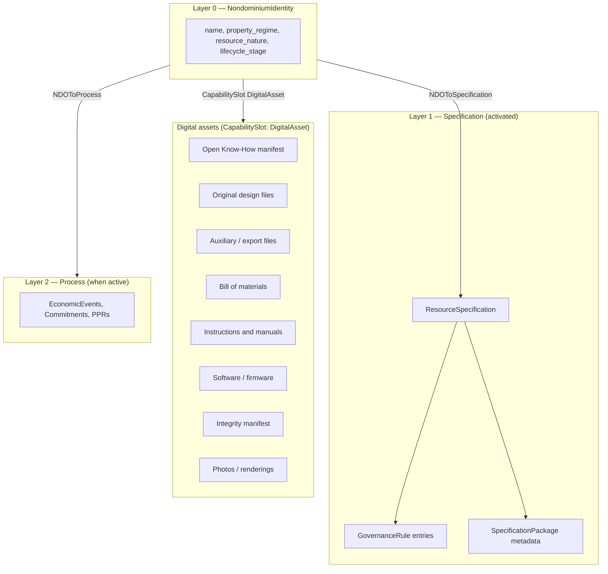

# Project-Type NDO Specifications (Post-MVP)

**Status**: Post-MVP Requirements  
**Created**: 2026-06-16  
**Relates to**: [`ndo_prima_materia.md`](../ndo_prima_materia.md), [`resources.md`](../resources.md), [`open-know-how-iopa.md`](open-know-how-iopa.md), [`digital-resource-integrity.md`](digital-resource-integrity.md), [`ndo-versioning.md`](ndo-versioning.md), [`fractal-composable-resource-architecture.md`](fractal-composable-resource-architecture.md)  
**Sibling NDO type**: [`source-ndo-requirements.md`](source-ndo-requirements.md) — Source-NDO covers generative ecological systems (watersheds, rivers, forests) that yield resources and receive ecological effects. Where project-type NDOs specify *design intent*, Source-NDOs specify *generative ecological conditions*. Both use the NDO three-layer model and governance-as-operator pattern; Source-NDOs add an adaptive cybernetic governance loop and the `vf:Source` ValueFlows extension.  
**External references**: [OSHWA — Best Practices for Open Source Hardware 1.0](https://oshwa.org/resources/sharing-best-practices/), [Open Know-How Specification (IOPA)](https://iopa.pubpub.org/pub/okh)

---

## 1. Problem Statement

A **project-type NDO** is a resource in development: an idea, design, prototype, or mature specification moving through `LifecycleStage` from `Ideation` toward `Stable` or `Distributed`. It may represent:

- a **digital resource** in development (software, digital book, CAD library), or  
- a **material resource** in development (electronic board, sensor, furniture, tool).

For **material** project-type NDOs, the NDO on the DHT is not the physical artefact — it is the **digital representation** of that resource. When the design reaches `Stable` or `Distributed`, the specification bundle (blueprints, 3D models, fabrication instructions, user manual, BOM, firmware, etc.) *is* the shareable product in the cosmolocal sense described in `ndo_prima_materia.md` §4.3: anyone with the spec and appropriate fabrication capacity can produce a local instance.

Today the MVP `ResourceSpecification` entry carries only name, description, category, tags, and image URL. It does not model the structured know-how bundle that open hardware communities (OSHWA) and the Internet of Production Alliance (Open Know-How) have converged on as best practice, nor does it connect that bundle to NDO Layer 1 activation, `DigitalAsset` capability slots, or integrity manifests.

This document defines **post-MVP requirements** for how project-type NDOs shall represent mature specifications — synthesizing OSHWA sharing practices, Open Know-How Level 1 discoverability, and the Nondominium three-layer resource model.

---

## 2. Scope

### 2.1 In scope

- Layer 1 **specification packages** for project-type NDOs (`ResourceNature`: `Physical`, `Digital`, `Hybrid`, and optionally `Information` for pure documentation products).
- Progressive completeness requirements matched to `LifecycleStage` (complexity matching).
- Mapping of OSHWA and Open Know-How artifact types to NDO data structures.
- Integrity, versioning, composability, and licensing requirements for specification assets.
- Governance preconditions for lifecycle transitions that claim fabrication-readiness (`Stable`, `Distributed`).

### 2.2 Out of scope

- Layer 2 process tracking, PPR issuance, and custody of **physical instances** (`EconomicResource`) — covered by existing governance and [`many-to-many-flows.md`](many-to-many-flows.md).
- Full Open Know-How **Level 2** (portable structured bundles) and **Level 3** (distributed aggregation) implementation — referenced as forward targets; Level 1 discoverability is the MVP target for this specification track.
- UI/wizard implementation details — see [`ui_design.md`](../ui_design.md) and [`specifications/ui_architecture.md`](../../specifications/ui_architecture.md).
- Replacing or duplicating [`complete-resource-specification.md`](complete-resource-specification.md) (extended property model for all NDO types); this document focuses on **project-in-development** specification bundles.

### 2.3 Normative dependencies

| ID | Requirement source |
|---|---|
| REQ-NDO-L1-01 – REQ-NDO-L1-06 | Layer 1 activation and asset attachment ([`ndo_prima_materia.md`](../ndo_prima_materia.md) §9.2) |
| REQ-NDO-LC-01 – REQ-NDO-LC-07 | Lifecycle transitions ([`ndo_prima_materia.md`](../ndo_prima_materia.md) §9.4) |
| REQ-NDO-CS-01 – REQ-NDO-CS-06 | Capability slot surface |
| R1 – R9 | Digital Resource Integrity ([`digital-resource-integrity.md`](digital-resource-integrity.md)) |
| R-VERS-* | Version DAG ([`ndo-versioning.md`](ndo-versioning.md)) |

---

## 3. Conceptual Model

### 3.1 Project-type NDO as specification carrier



- **Layer 0** holds immutable identity and **lifecycle maturity** (`LifecycleStage`).
- **Layer 1** holds human-readable summary (`ResourceSpecification`), embedded **governance**, and structured **SpecificationPackage** metadata describing the know-how bundle.
- **Digital assets** (files, manifests, external repo pointers) attach via **`DigitalAsset` capability slots** on the Layer 0 hash (REQ-NDO-L1-06), not as opaque blobs inside `ResourceSpecification`.
- **Layer 2** records contribution and validation activity around the evolving specification; it does not replace the specification bundle.

### 3.2 Original vs auxiliary design files (OSHWA)

Following OSHWA best practices, the system shall distinguish:

| Class | Role | NDO rule |
|---|---|---|
| **Original design files** | Native editable sources (CAD, KiCad, Inkscape, repo source tree) | **Required** for `Stable` physical/hybrid NDOs claiming open-source hardware status; auxiliary formats never substitute |
| **Auxiliary design files** | Interchange, manufacturing-ready, or view-only exports (STEP, STL, Gerber, PDF schematic) | **Recommended**; enables fabrication and review without proprietary tools |
| **Documentation sources** | Editable instructions (Markdown, wiki, ODT), not PDF-only | **Recommended**; supports fork and remix |

### 3.3 Open Know-How maturity alignment

Open Know-How defines progressive openness ([`open-know-how-iopa.md`](open-know-how-iopa.md) §1.1):

| OKH level | Intent | NDO mapping (post-MVP target) |
|---|---|---|
| **Level 1 — Discoverable** | Metadata manifest indexes know-how location | **`SpecificationPackage`** + OKH-compatible manifest as a `DigitalAsset`; DHT discovery via Layer 0 anchors |
| **Level 2 — Portable** | Consistent structured bundle format | Export/import of full specification package between NDO instances (future) |
| **Level 3 — Distributed** | Federated aggregation without central control | Cross-network indexing via Lobby / federation DNA (future) |

**REQ-PROJ-SPEC-* requirements below implement Level 1** as the baseline, with hooks for Level 2/3.

### 3.4 Sub-components and fractal composition

Material specifications rarely stand alone. A desk may reference open legs, a sensor board may reference an MCU module. Following the fractal composable resource model ([`fractal-composable-resource-architecture.md`](fractal-composable-resource-architecture.md)) and Open Know-How `sub` / `derivative-of` / `variant-of` fields:

- **Sub-assemblies** that are themselves maintained as open know-how shall be linked as **child NDOs** via `NDOToComponent` (or equivalent) links, not duplicated inline.
- **Derivatives and variants** shall use the version DAG ([`ndo-versioning.md`](ndo-versioning.md)) with `ForkedFrom`, `EvolvedFrom`, or OKH-aligned variant manifests.

---

## 4. SpecificationPackage Structure

The **SpecificationPackage** is post-MVP structured metadata attached to Layer 1. It describes *what* artifacts exist, *where* they live, and *how complete* the bundle is — without embedding file bytes in the DHT entry.

### 4.1 Core metadata (Open Know-How Level 1 — mandatory subset)

The following fields align with Open Know-How manifest §4.5–4.8. At minimum, a discoverable project specification shall expose:

| Field | OKH field | Required when |
|---|---|---|
| Title | `title` | Layer 1 active |
| Description | `description` | Layer 1 active |
| Documentation entry | `documentation-home` **or** `project-link` | Layer 1 active |
| Version label | `version` | `Prototype` and later |
| Development stage | `development-stage` | maps to `LifecycleStage` |
| License block | `license` (SPDX: hardware, documentation, software) | `Stable` and later |
| Language | `manifest_language`, `documentation_language` | recommended always |

Recommended OKH fields the NDO should support in `SpecificationPackage` or linked manifest:

- `indended-use`, `keywords`, `image`, `health-safety-notice`, `contact`, `contributors`
- `made`, `made-independently` (fabrication verification flags)
- `standards-used`, `derivative-of`, `variant-of`, `sub`
- `date-created`, `date-updated`, `manifest-author`

### 4.2 Documentation artifact slots (OSHWA + OKH)

Each artifact type is a **typed slot** in the specification package, pointing to one or more `DigitalAsset` capability targets:

| Slot type | OSHWA element | OKH field | Physical | Digital | Hybrid |
|---|---|---|---|---|---|
| `Overview` | Overview / introduction | (in `description`) | ✓ | ✓ | ✓ |
| `OriginalDesignFiles` | Original design files | `design-files` | ✓ | ✓ (source) | ✓ |
| `AuxiliaryDesignFiles` | Auxiliary / export files | `schematics`, `manufacturing-files` | ✓ | ✓ (build artifacts) | ✓ |
| `BillOfMaterials` | BOM | `bom` | ✓ | optional | ✓ |
| `ToolList` | (in making instructions) | `tool-list` | ✓ | ✓ (build deps) | ✓ |
| `MakingInstructions` | Instructions — making | `making-instructions` | ✓ | ✓ (build) | ✓ |
| `OperatingInstructions` | Instructions — using | `operating-instructions` | ✓ | ✓ (user docs) | ✓ |
| `MaintenanceInstructions` | (OSHWA) | `maintenance-instructions` | ✓ | ✓ | ✓ |
| `DisposalInstructions` | (OKH) | `disposal-instructions` | ✓ | — | ✓ |
| `DesignRationale` | Design rationale | (documentation) | recommended | recommended | recommended |
| `SoftwareFirmware` | Software and firmware | `software` | if applicable | ✓ | ✓ |
| `QualityInstructions` | (OKH) | `quality-instructions` | recommended | recommended | recommended |
| `RiskAssessment` | (OKH) | `risk-assessment` | recommended | optional | recommended |
| `ToolSettings` | (OKH) | `tool-settings` | if applicable | — | if applicable |
| `Photos` | Photos | `image` (+ gallery assets) | recommended | optional | recommended |
| `ArchiveDownload` | (OKH) | `archive-download` | recommended | recommended | recommended |
| `IntegrityManifest` | (NDO) | — | ✓ at Stable+ | ✓ at Stable+ | ✓ at Stable+ |
| `OpenKnowHowManifest` | (OKH) | `okh.yml` | recommended | recommended | recommended |

### 4.3 Bill of materials requirements (OSHWA)

When a BOM is provided:

- It shall be a **separate artifact** (not inferred solely from CAD).
- Each line shall be mappable to design reference designators where applicable.
- Fields shall support at minimum: reference designator, description, part number, supplier(s), quantity, optional unit cost.
- BOM format shall be machine-readable (CSV, spreadsheet, or structured JSON) in addition to any human-readable export.

### 4.4 Software and firmware (OSHWA)

When the resource includes programmable logic:

- **Source code** shall be linked (repository URL or content-addressed archive), with build instructions.
- Build dependencies and toolchain versions shall be documented.
- Software license shall be declared separately (SPDX) in the license block.
- Firmware binary releases, if distributed, shall be content-addressed and listed in the integrity manifest.

### 4.5 Licensing (OSHWA + OKH)

The specification package shall declare licenses using **SPDX identifiers** for up to three channels:

- `hardware` / design files (e.g. `CERN-OHL-2.0-W`, `CERN-OHL-2.0-P`, `Solderpad-2.1`)
- `documentation` (e.g. `CC-BY-4.0`, `CC-BY-SA-4.0`)
- `software` (e.g. `Apache-2.0`, `GPL-3.0-only`)

Licenses with `NC` (non-commercial) or `ND` (no derivatives) clauses shall **not** be accepted for NDOs under `PropertyRegime::Nondominium` or `Commons` when governance claims open-source hardware compliance (aligned with OSHWA and Open Source Hardware Definition).

---

## 5. Lifecycle-Progressive Completeness

Specification burden shall match social complexity ([`resources.md`](../resources.md) §1.4, [`ndo_prima_materia.md`](../ndo_prima_materia.md) §2.3). The governance zome may enforce minimum package completeness on lifecycle transitions.

### 5.1 Minimum artifacts by lifecycle stage

| LifecycleStage | Layer 1 | Minimum specification content |
|---|---|---|
| `Ideation` | optional | Layer 0 only; name + intent in `description` |
| `Specification` | activating | Title, description, intended use; draft design pointers optional |
| `Development` | active | Original design files **or** documented repo; WIP BOM encouraged |
| `Prototype` | active | Original design files, auxiliary exports for primary fabrication path, BOM, making instructions (WIP acceptable), version label |
| `Stable` | active | **Full fabrication package** (see §5.2); integrity manifest; licenses; operating instructions |
| `Distributed` | active | Stable requirements + evidence of independent fabrication (`made-independently`) or peer validation record |
| `Active` | active | Stable package maintained; change control via versioning (REQ-NDO-L1-03) |
| `Hibernating` | dormant | Package frozen; `is_active: false` on spec; assets remain readable |
| `Deprecated` / `EndOfLife` | archived | Package archived; successor NDO link if deprecated |

### 5.2 Stable material resource — “complete representation” definition

For a **project-type material NDO** at `LifecycleStage::Stable` or later, a **complete digital representation** shall include all of the following unless explicitly marked not applicable (`N/A`) with governance-approved rationale:

1. **Overview** — general-audience introduction with photo or rendering  
2. **Original design files** — editable sources for every custom part (CAD, PCB, drawings)  
3. **Auxiliary manufacturing files** — at least one fabrication-ready export per custom part (e.g. STL, Gerber, DXF)  
4. **Bill of materials** — separate, reference-designator-aligned BOM  
5. **Making instructions** — fabrication and assembly, tools required, special processes noted  
6. **Operating instructions** — setup, use, safety notices (`health-safety-notice` summary at minimum)  
7. **Software/firmware** — if any; otherwise explicit `N/A`  
8. **License block** — SPDX for design, documentation, and software channels  
9. **Integrity manifest** — content-addressed manifest per [`digital-resource-integrity.md`](digital-resource-integrity.md) covering all bundled assets  
10. **Version identifier** — correlates spec bundle with physical instances and OKH manifest  

Recommended additions: maintenance instructions, quality/test instructions, design rationale, photos from multiple build stages, `archive-download` zip of full bundle.

### 5.3 Stable digital resource — “complete representation” definition

For **Digital** `resource_nature` at `Stable`:

1. **Source repository or archive** (original design files)  
2. **Build/install instructions** (making instructions equivalent)  
3. **User/documentation** (operating instructions equivalent)  
4. **Dependency manifest** (analogous to BOM: lockfiles, requirements.txt, etc.)  
5. **License block** and **integrity manifest**  
6. **Version identifier**  

### 5.4 Hybrid resources

Hybrid NDOs (`resource_nature: Hybrid`) shall satisfy **both** §5.2 and §5.3 for the physical and digital aspects, with explicit linkage between digital twin assets and physical fabrication assets (e.g. firmware version ↔ PCB revision).

---

## 6. NDO Architecture Mapping

### 6.1 Entry and link types (proposed)

```rust
/// Structured index of know-how artifacts for a project-type NDO.
/// Linked from ResourceSpecification; does not embed file bytes.
pub struct SpecificationPackage {
    pub spec_version: String,           // package schema version
    pub okh_manifest_hash: Option<ActionHash>, // DigitalAsset target
    pub artifact_index: Vec<ArtifactRef>,
    pub completeness: CompletenessReport,
    pub license: LicenseBlock,
    pub fabrication_evidence: FabricationEvidence,
    pub created_at: Timestamp,
    pub updated_at: Timestamp,
}

pub struct ArtifactRef {
    pub slot: SpecificationArtifactType,
    pub digital_asset_slot: ActionHash, // CapabilitySlot link hash
    pub title: Option<String>,
    pub format: Option<String>,           // e.g. "kicad", "step", "csv"
    pub is_original: bool,              // true = OSHWA "original design file"
}

pub struct LicenseBlock {
    pub hardware: Option<String>,       // SPDX
    pub documentation: Option<String>,
    pub software: Option<String>,
    pub licensor: Option<String>,
}

pub struct FabricationEvidence {
    pub made: bool,
    pub made_independently: bool,
    pub validation_receipt: Option<ActionHash>,
}
```

Existing types retained:

- `ResourceSpecification` — summary discovery fields (name, description, category, tags).  
- `GovernanceRule` — access, validation, and transition rules on the spec.  
- `CapabilitySlot` + `DigitalAsset` — content pointers and integrity manifests.  
- `NDOToSpecification` — Layer 1 activation (REQ-NDO-L1-01).  
- `NDOToComponent` — fractal child NDO references.

### 6.2 Open Know-How manifest interchange

- The system **should** accept an **`okh.yml`** (Open Know-How Manifest 1.0) as a `DigitalAsset`, parse it into `SpecificationPackage`, and/or generate `okh.yml` from DHT state for export.
- Field names shall follow OKH YAML schema ([`open-know-how-iopa.md`](open-know-how-iopa.md) §4.3–4.9) to maximize portability (OKH Level 1).
- `development-stage` in OKH manifests shall map to `LifecycleStage` via a published translation table maintained in implementation docs.

### 6.3 Integrity and storage

- Every file bundle claiming `Stable` or later shall have a **Digital Resource Integrity manifest** (R1–R4) attached as a `DigitalAsset`.
- Large files shall use chunked, content-addressed storage (R2); the DHT stores manifests and capability slot pointers, not bulk binaries.
- Composite products shall use fractal verification (R5–R9): child NDO components verify independently; parent assembly manifest references child manifest roots.

### 6.4 Versioning

- Each materially changed specification bundle shall create a new `ResourceSpecification` + `SpecificationPackage` pair linked under the same Layer 0 identity (REQ-NDO-L1-03).
- Version DAG relations (`EvolvedFrom`, `ForkedFrom`) shall align with OKH `derivative-of` / `variant-of` metadata.
- Physical instances (`EconomicResource`) created from a spec shall record the **`ResourceSpecification` action hash** (and package version) they conform to.

---

## 7. Requirements

### 7.1 Specification package core

- **REQ-PROJ-SPEC-01**: The system shall support a `SpecificationPackage` entry type linked to `ResourceSpecification` on Layer 1 activation, indexing all know-how artifacts for a project-type NDO without embedding file content in the entry.
- **REQ-PROJ-SPEC-02**: The system shall classify specification artifacts using typed slots aligned with OSHWA best-practice elements and Open Know-How documentation fields (§4.2 table).
- **REQ-PROJ-SPEC-03**: All file, repository, and manifest pointers shall be attached via `CapabilitySlot` links of type `DigitalAsset` on the Layer 0 `NondominiumIdentity` hash (REQ-NDO-L1-06); `SpecificationPackage` shall reference those slots by hash.
- **REQ-PROJ-SPEC-04**: The system shall distinguish **original design files** from **auxiliary design files** in `ArtifactRef.is_original` and enforce that auxiliary files never satisfy original-file requirements alone (OSHWA).

### 7.2 Metadata and discoverability (Open Know-How Level 1)

- **REQ-PROJ-SPEC-05**: Every active Layer 1 project specification shall expose at minimum: title, description, and documentation entry URL (`documentation-home` or `project-link` equivalent).
- **REQ-PROJ-SPEC-06**: The system should support import and export of **Open Know-How Manifest 1.0** (`okh.yml`) as a `DigitalAsset`, bidirectionally mapped to `SpecificationPackage` fields.
- **REQ-PROJ-SPEC-07**: `SpecificationPackage` shall record `manifest_language` and `documentation_language` using BCP 47 language tags when provided.
- **REQ-PROJ-SPEC-08**: Keywords, intended use, health/safety notice, contact, and contributors shall be storable in `SpecificationPackage` or linked OKH manifest per OKH §4.5–4.6.

### 7.3 Material resource bundles

- **REQ-PROJ-SPEC-10**: For `ResourceNature::Physical` or `Hybrid` NDOs at `LifecycleStage::Stable` or later, the specification package shall include: overview, original design files, auxiliary manufacturing files, BOM, making instructions, operating instructions, and license block (§5.2).
- **REQ-PROJ-SPEC-11**: BOM shall be a separate artifact with reference-designator alignment to design files when the design uses reference designators (OSHWA).
- **REQ-PROJ-SPEC-12**: Making instructions shall link to tool lists and, where applicable, tool settings, quality/test instructions, and risk assessments (OKH recommended fields).
- **REQ-PROJ-SPEC-13**: Maintenance and disposal instructions shall be supported as optional artifact slots; governance templates for `Pool` and `CommonPool` regimes should recommend them.

### 7.4 Digital resource bundles

- **REQ-PROJ-SPEC-20**: For `ResourceNature::Digital` NDOs at `LifecycleStage::Stable` or later, the specification package shall include: source repository or archive, build/install instructions, user documentation, dependency manifest, license block, and integrity manifest (§5.3).
- **REQ-PROJ-SPEC-21**: Software/firmware source shall include build procedure documentation sufficient for an independent developer to reproduce binaries (OSHWA software section).

### 7.5 Licensing

- **REQ-PROJ-SPEC-30**: `SpecificationPackage.license` shall use SPDX identifiers for hardware/design, documentation, and software channels (OKH §4.6.18).
- **REQ-PROJ-SPEC-31**: Governance shall reject lifecycle promotion to `Stable` for `PropertyRegime::Nondominium` or `Commons` NDOs whose license block includes NC or ND SPDX qualifiers on design or documentation channels.

### 7.6 Integrity and verification

- **REQ-PROJ-SPEC-40**: Specification bundles at `Stable` or later shall reference a Digital Resource Integrity manifest (`digital-resource-integrity.md` R1–R4) covering all `DigitalAsset` files in the package.
- **REQ-PROJ-SPEC-41**: Peer validation of a new resource (`REQ-GOV-02`) shall verify integrity manifest presence and successful manifest signature check before approving `Prototype → Stable` transitions for physical/hybrid NDOs.
- **REQ-PROJ-SPEC-42**: `FabricationEvidence.made_independently` shall be settable only with a linked `ValidationReceipt` or documented independent-build attestation approved by governance rules.

### 7.7 Composability and provenance

- **REQ-PROJ-SPEC-50**: Sub-assemblies available as separate open know-how shall be referenced via `NDOToComponent` links to child NDO identities, with OKH-aligned `sub` metadata in `SpecificationPackage` (not duplicated file trees).
- **REQ-PROJ-SPEC-51**: Forks and variants shall link to predecessor NDOs or specification versions via the version DAG (`ndo-versioning.md`) and OKH `derivative-of` / `variant-of` fields.
- **REQ-PROJ-SPEC-52**: `SpecificationPackage` shall record `standards-used` references (OKH §4.6.14) when design or documentation follows external standards (ISO, OSHWA certification, etc.).

### 7.8 Lifecycle governance integration

- **REQ-PROJ-SPEC-60**: The governance zome shall evaluate `SpecificationPackage.completeness` against stage-specific minimums (§5.1) when processing `update_lifecycle_stage` transitions.
- **REQ-PROJ-SPEC-61**: Transition to `Stable` shall be **blocked** if required artifact slots for the NDO's `resource_nature` are missing or lack trusted `DigitalAsset` attachments.
- **REQ-PROJ-SPEC-62**: Transition to `Distributed` shall require `Stable` completeness plus fabrication evidence (`made` true) and either `made_independently` or multi-reviewer validation per `ResourceValidation` scheme.
- **REQ-PROJ-SPEC-63**: Transition to `Specification` or `Development` shall **not** require full Stable bundles (pay-as-you-grow); only metadata sufficient for discovery and collaboration.

### 7.9 Hosting and distribution practices (OSHWA process)

- **REQ-PROJ-SPEC-70**: `SpecificationPackage` should support linking to version-controlled repositories (Git) as `DigitalAsset` targets, with commit/tag references recorded in the package version field.
- **REQ-PROJ-SPEC-71**: Published physical instances derived from the spec should be able to record the specification version on the instance record for traceability (OSHWA distribution: match physical object to design version).
- **REQ-PROJ-SPEC-72**: UI and export tools should support generating an `archive-download` asset (full bundle zip) with embedded `okh.yml` for offline sharing (OKH §4.8.2).

### 7.10 Completeness reporting

- **REQ-PROJ-SPEC-80**: `SpecificationPackage.completeness` shall compute a machine-readable report: required vs present vs `N/A` waived slots, per lifecycle stage profile.
- **REQ-PROJ-SPEC-81**: Discovery queries shall expose completeness percentage and missing slot types for Lobby / Group NDO browsers (feeds REQ-UI-LOBBY-01 filter semantics).

---

## 8. Governance Defaults by Property Regime

Aligned with [`resources.md`](../resources.md) §4.4.4 and §6.6:

| PropertyRegime | Stable-stage emphasis |
|---|---|
| `Commons` / `Nondominium` | Full open bundle; reciprocal or permissive OS licenses; attribution in contributors |
| `Private` | Complete spec for authorized fabricators; governance may restrict `DigitalAsset` capability grants |
| `Pool` / `CommonPool` | Stable spec plus maintenance/disposal instructions; access gated by role and (post-MVP) affiliation |
| `Collective` | Spec co-maintained; N-of-M validation for Stable promotion |

---

## 9. Relationship to Agent Model

Project-type NDOs often correspond to **Project** collective agents ([`REQ-NDO-AGENT-02`](../ndo_prima_materia.md)): the **agent face** participates in economic events; the **resource face** (this NDO) carries the specification bundle. Contributors credited in OKH `contributors` should map to PPR-traceable participation in Layer 2, but contributor lists in the spec package are documentary — authoritative contribution history remains in PPRs and economic events.

---

## 10. Implementation Phasing (informative)

| Phase | Deliverable |
|---|---|
| **Phase A** | `SpecificationPackage` entry + artifact slot enum; manual `DigitalAsset` attachment; completeness report (no governance enforcement) |
| **Phase B** | OKH manifest import/export; integrity manifest requirement; governance blocks on `→ Stable` |
| **Phase C** | Fractal child NDO links; version DAG integration; `Distributed` fabrication evidence |
| **Phase D** | OKH Level 2 portable bundle export; federated discoverability (OKH Level 3) |

---

## 11. Traceability Matrix

| External source | NDO requirement IDs |
|---|---|
| OSHWA — Overview | REQ-PROJ-SPEC-02, -10 |
| OSHWA — Original / auxiliary design files | REQ-PROJ-SPEC-04, -10 |
| OSHWA — BOM | REQ-PROJ-SPEC-02, -11 |
| OSHWA — Software/firmware | REQ-PROJ-SPEC-02, -21 |
| OSHWA — Photos | REQ-PROJ-SPEC-02 |
| OSHWA — Instructions (make, use, rationale) | REQ-PROJ-SPEC-02, -10, -12 |
| OSHWA — Licensing | REQ-PROJ-SPEC-30, -31 |
| OKH — Manifest metadata | REQ-PROJ-SPEC-05 – -08 |
| OKH — Documentation fields §4.8 | REQ-PROJ-SPEC-02, -12, -13 |
| OKH — `sub`, `derivative-of`, `variant-of` | REQ-PROJ-SPEC-50, -51 |
| OKH — Maturity Level 1 | REQ-PROJ-SPEC-05, -06 |
| NDO Layer 1 | REQ-NDO-L1-01 – -06, REQ-PROJ-SPEC-01, -03 |
| Digital Resource Integrity | REQ-PROJ-SPEC-40, -41 |
| Complexity matching / lifecycle | REQ-PROJ-SPEC-60 – -63, §5 |

---

---

## 12. Sibling NDO Type: Source-NDO

A **Source-NDO** is a sibling specification type that governs *generative ecological systems* (watersheds, rivers, forests, fisheries) and *knowledge commons* rather than design artefacts in development. While project-type NDOs specify design intent — what a thing is supposed to be and how to fabricate it — Source-NDOs specify generative ecological conditions: what a source yields, what effects it receives, how its condition evolves, and how governance rules must adapt as its event ledger accumulates.

Key differences:

| Dimension | Project-type NDO | Source-NDO |
|---|---|---|
| Represents | Resource in development (design → production) | Generative ecological system (watershed, fishery) |
| Layer 1 content | `SpecificationPackage` — OSHWA/OKH artifacts | `SourceSpecification` — boundary conditions, monitoring framework |
| Governance pattern | Rule evaluation at transition request | Adaptive cybernetic loop: events → interpretation → rule revision → conditioned events |
| Custodian | `primaryAccountable` (custody, not ownership) | `stewardedBy` — stewardship obligations, no ownership |
| PropertyRegime | Any | `Nondominium` or `CommonPool` only |
| ValueFlows extension | Standard VF events | `vf:Source` flow endpoint role |

Normative requirements for Source-NDO are in [`source-ndo-requirements.md`](source-ndo-requirements.md).

---

*This is a normative post-MVP requirements document. Implementation shall not contradict [`ndo_prima_materia.md`](../ndo_prima_materia.md) REQ-NDO-* IDs. When OSHWA or Open Know-How standards update, §4 field mappings should be revised without changing the underlying NDO architectural invariants (Layer 0 identity, Layer 1 spec + DigitalAsset slots, governance-as-operator).*
