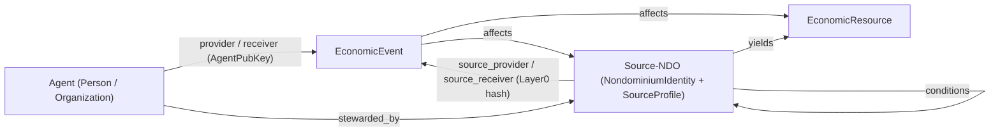
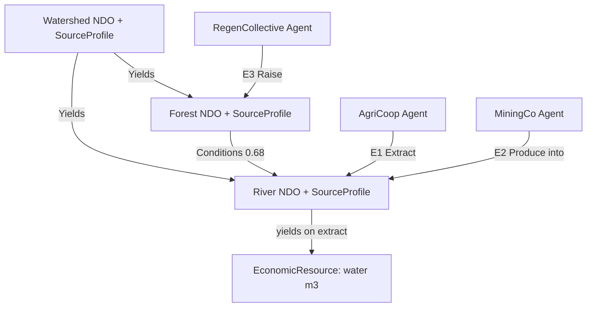

# Source–Valueflows Integration Design

**Status**: Post-MVP design (implementation-informing)  
**Created**: 2026-07-05  
**Relates to**: `[source-ndo-requirements.md](source-ndo-requirements.md)`, `[Source-NDO.md](Source-NDO.md)`, `[ndo_prima_materia.md](../ndo_prima_materia.md)`, `[specifications.md](../../specifications/specifications.md)`  
**Normative requirements**: REQ-SOURCE-* in `[source-ndo-requirements.md](source-ndo-requirements.md)`

---

## Purpose

This document integrates the `vf:Source` primitive into nondominium's Valueflows model. It is structured as two deliberately separated discussions:


| Part                      | Scope                                    | Audience               |
| ------------------------- | ---------------------------------------- | ---------------------- |
| **Part I — Valueflows**   | Implementation-agnostic ontology         | Any REA/VF implementer |
| **Part II — Nondominium** | This Holochain hApp's Rust/TS data model | nondominium developers |


Parts III–IV apply both layers in a worked use case and concrete data model. Part V records open decisions before implementation.

This document **does not modify zome code**. It informs Phase A–E implementation described in `source-ndo-requirements.md` [§9](source-ndo-requirements.md).

---


Valueflows
> **Scope**: Pure ontology. No Holochain, no NDO layers, no governance-as-operator. Any Valueflows-compliant system could adopt this extension.


## 1.1 Valueflows primitive recap

Valueflows is an open vocabulary built on the REA (Resource–Event–Agent) accounting ontology. It models economic activity through three knowledge/plan/observation layers:


| VF layer        | Purpose               | Core types                                               |
| --------------- | --------------------- | -------------------------------------------------------- |
| **Knowledge**   | Types and templates   | `ResourceSpecification`, `ProcessSpecification` (Recipe) |
| **Plan**        | Intent and obligation | `Intent`, `Commitment`, `Agreement`                      |
| **Observation** | What happened         | `EconomicEvent`, `Claim`                                 |


**Agents** (`vf:Person`, `vf:Organization`, `vf:EcologicalAgent`) are entities that initiate, receive, commit to, and bear responsibility for economic flows.

**Resources** (`vf:EconomicResource`) are inventoried instances conforming to a `ResourceSpecification`. Each resource may carry a `primaryAccountable` agent — the agent with primary rights and responsibilities (ownership/accounting association).

**Events** (`vf:EconomicEvent`) record observed economic activity. Each event has:

- `action` — one of the VF action vocabulary (`produce`, `consume`, `use`, `transfer`, `raise`, `lower`, …)
- `provider` — the agent from whom the flow is initiated
- `receiver` — the agent to whom the flow is directed
- `resourceInventoriedAs` / `affects` — the economic resource affected
- `resourceQuantity` — amount and unit

**Processes** group inputs and outputs. **Commitments** promise future events; **Claims** link fulfilled events back to commitments.

nondominium's MVP implements this pattern in `zome_gouvernance` (`EconomicEvent`, `Commitment`, `Claim`) and `zome_resource` (`ResourceSpecification`, `EconomicResource`), with 16 `VfAction` variants including nondominium extensions (`InitialTransfer`, `AccessForUse`, `TransferCustody`).

## 1.2 The endpoint constraint (why the gap exists)

The Valueflows specification defines typed ranges for flow endpoints. From the official ontology (`/valueflows/valueflows`, `all_vf.html`):

```turtle
vf:provider
  rdfs:comment "The economic agent from whom the intended, committed, or actual economic event is initiated."
  rdfs:range vf:Agent .

vf:receiver
  rdfs:comment "The economic agent to whom the intended, committed, or actual economic event is directed."
  rdfs:range vf:Agent .

vf:primaryAccountable
  rdfs:comment "The agent currently with primary rights and responsibilites for the economic resource."
  rdfs:range vf:Agent .
```

**Consequence**: in Valueflows 1.0, every flow endpoint and every resource accountability anchor **must** be an `Agent`. Resources are inventoried outputs; they are never providers, receivers, or sinks for ecological loading.

This is correct for appropriable economic outputs (water in a tank, fish landed, timber cut). It is **incorrect** for generative ecological systems (rivers, watersheds, forests, fisheries, knowledge commons) that:

- **yield** resources without being owned
- **receive** pollution and ecological effects without possessing agency
- **condition** other generative systems (forest → river infiltration)
- accumulate an event ledger that should drive adaptive governance


## 1.3 The ontological gap

A river under a **nondominium** property regime fits neither category honestly:


| If modelled as…                 | Problem                                                                                                |
| ------------------------------- | ------------------------------------------------------------------------------------------------------ |
| `EconomicResource`              | Requires `primaryAccountable` — a false ownership claim, the inverse of nondominium                    |
| `Agent` **/** `EcologicalAgent` | Attributes intention the river does not possess; human representatives speak for it                    |
| **Avoided entirely**            | Abstraction appears as `raise` (resource from nowhere); depletion and pollution vanish from the ledger |


Ostrom's Social-Ecological Systems framework already distinguishes **resource system** (fishery, watershed) from **resource unit** (fish, gallons of water). Valueflows collapses both into `EconomicResource` + `Agent`, losing the resource-system category at the executable layer.

### Three active fictions (Model A)

Using Valueflows 1.0 as-is for a watershed commons produces:

1. **False ownership** — `EconomicResource { primaryAccountable: StewardOrg }` records dominium in the ledger meant to be authoritative.
2. **Resource from nowhere** — `raise` creates water inventory with no provider; the river is never debited; sustainability is unaccountable.
3. **Resource/Agent contradiction** — river typed as Resource for extraction and as EcologicalAgent to receive MiningCo's effluent; one entity, two incompatible types.


### Four inexpressible residues

1. **Source hierarchy** — watershed → river cannot be expressed as generation (only containment or free text).
2. **Cross-source coupling** — forest conditions river flow; no native edge.
3. **Black-box epistemics** — no construct for "interior opaque; govern boundary only."
4. **Governance reflexivity** — events → policy → access rules cannot close on the ecological object itself.

See `Source-NDO.md` [§3–§5](Source-NDO.md) for the full river/watershed worked comparison and Occam's-razor analysis.

## 1.4 The `vf:Source` proposal

`vf:Source` is a third ontological primitive alongside `Agent` and `EconomicResource`:

```
AGENT    — acts, intends, commits, bears responsibility
           (individuals, organisations, networks, bots)

RESOURCE — appropriable, inventoriable output
           (water in a tank, fish landed, timber cut, a design file in custody)

SOURCE   — generative system that yields Resources, receives effects,
           conditions future possibilities, regenerates or degrades
           (not owned, not an agent, not merely a stock behind a flow)
```

**Single new affordance**: *flows may originate from and terminate in Sources, not only in Agents or Resources.*

At the RDF level this implies extending `vf:provider` and `vf:receiver` domains to include `vf:Source`, and introducing `vf:Source` as a class distinct from `vf:Agent` and `vf:EconomicResource`. Nondominium's implementation details are in Part II.

### Ostrom mapping


| Ostrom / SES      | vf:Source extension                                           |
| ----------------- | ------------------------------------------------------------- |
| Resource system   | **Source**                                                    |
| Resource unit     | **Resource** (`EconomicResource`)                             |
| Governance system | Governance rules attached to Source (implementation-specific) |
| Users / actors    | **Agent**                                                     |
| Action situation  | **EconomicEvent**, Commitment, Claim                          |


## 1.5 Event shapes with Source endpoints

Boundary events on a Source use standard VF actions with Source as provider or receiver:

### Extraction (Source as provider)

```
EconomicEvent {
  action: extract,           // see §1.6 — VF core vocabulary note
  provider: River (Source),
  receiver: AgriCoop (Agent),
  resourceConformsTo: WaterSpec,
  resourceQuantity: 10000 m³
}
→ decrements River.currentStock; depletion is visible
```


### Non-consumptive use (Source as provider of flux)

```
EconomicEvent {
  action: use,
  provider: River (Source),
  receiver: HydroDam (Agent),
  effect: River.regimeState    // altered timing/sediment, not stock volume
}
```


### Pollution / loading (Source as receiver)

```
EconomicEvent {
  action: produce,
  provider: MiningCo (Agent),
  receiver: River (Source),
  resourceQuantity: 50 kg heavy metals
}
→ debits River.assimilationCapacity; pollution is visible
```


### Regeneration (Agent raises a Source)

```
EconomicEvent {
  action: raise,
  target: Forest (Source),
  provider: RegenCollective (Agent),
  resourceQuantity: 1000 trees
}
→ Forest.conditions(River): improved infiltration raises River.fluxRate and resilience
```


### Source-to-Source relations (not events — structural links)

```
Source --yields--> Source       (watershed yields river)
Source --conditions--> Source   (forest conditions river flow)
Source --yields--> Resource     (river yields gallons when abstracted)
```


## 1.6 Action vocabulary note: `extract`

Valueflows core actions include `consume`, `lower`, `raise`, `produce`, `use`, `transfer`, etc., but **no dedicated** `extract` **action**. Source-NDO literature uses `extract` informally for "withdraw from a generative system without transferring ownership."


| Option                                        | Semantics                                             | Trade-off                                                            |
| --------------------------------------------- | ----------------------------------------------------- | -------------------------------------------------------------------- |
| **Add** `Extract` to extended VF vocabulary   | Clearest semantics for Source withdrawal              | New action; all VF implementations must recognise it                 |
| **Map to** `Consume`                          | Resource leaves the Source and enters agent inventory | Conflates rivalrous depletion with generic consumption               |
| **Map to** `Lower`                            | Decrements quantity at Source                         | Closest to stock debit; less intuitive for "yield to inventory"      |
| **Map to** `Transfer` with Source as provider | Flow from Source to Agent                             | Requires Source as legal provider (the whole point of the extension) |


**Recommendation for nondominium**: add `Extract` as a 17th `VfAction` variant in `crates/shared/src/types.rs`, documented as "withdraw quantity from a Source into an inventoried Resource; debits Source condition state." This preserves semantic clarity for governance rules (`max extract per season`) and PPR categorisation. Until implemented, `Lower` on the Source plus `Raise`/`Transfer` on the derived Resource is an acceptable interim mapping.

## 1.7 What the extension removes


| Removed                             | Description                                                       |
| ----------------------------------- | ----------------------------------------------------------------- |
| False ownership claim               | Source has no `primaryAccountable`; stewardship ≠ dominium        |
| Resource-from-nowhere `raise`       | Extraction debits the Source; depletion is visible                |
| Resource/Agent dual-typing          | Source receives pollution without agency                          |
| Inexpressible source hierarchy      | `Source yields Source` is a native edge                           |
| Inexpressible cross-source coupling | `Source conditions Source` is a native edge                       |
| Missing black-box epistemics        | `complexInterior: true`, `regimeState` encode partial knowability |
| Missing governance reflexivity      | Event ledger on Source → rules adapt → future events conditioned  |


### Occam's razor verdict

Adding **one** primitive (`vf:Source`) removes **three fictions and four residues**. Refusing to name the Source does not remove it from the world — it forces smuggling via mismatched parts. The augmented ontology is more parsimonious at the level that matters: the furniture of reality the model commits to.

---


# Part II — Nondominium Discussion

> **Scope**: How `vf:Source` lands on this hApp's Rust zomes, TypeScript shared types, governance-as-operator pattern, and NDO three-layer model.


## 2.1 Current-state mapping


| Valueflows concept                      | nondominium implementation                                                                  | Source gap                                           |
| --------------------------------------- | ------------------------------------------------------------------------------------------- | ---------------------------------------------------- |
| `Agent`                                 | `AgentPubKey` + `Person` (`zome_person`)                                                    | OK                                                   |
| `ResourceSpecification`                 | `ResourceSpecification` (`zome_resource`)                                                   | OK for inventoriable types                           |
| `EconomicResource`                      | `EconomicResource { custodian: AgentPubKey, … }`                                            | `custodian` = ownership/custody fiction for Sources  |
| `EconomicEvent.provider`                | `AgentPubKey`                                                                               | Cannot be a Source                                   |
| `EconomicEvent.receiver`                | `AgentPubKey`                                                                               | Cannot receive pollution into a Source               |
| `EconomicEvent.resource_inventoried_as` | `ActionHash` → `EconomicResource`                                                           | REQ-SOURCE-EVENT-01 also targets Source Layer 0 hash |
| `primaryAccountable`                    | `EconomicResource.custodian`                                                                | Inappropriate for Source-NDO                         |
| `Commitment` / `Claim`                  | `zome_gouvernance` entries                                                                  | Need Source-aware evaluation                         |
| `GovernanceRule`                        | `rule_data: RuleData` (4 typed variants, #132)                                              | No Source-aware variant; adaptive rules need a new one |
| Layer 0 identity                        | `NondominiumIdentity`                                                                       | Permanent anchor; Source-NDO uses same entry         |
| NDO federation links                    | `NdoHardLink` (`Component`, `DerivedFrom`, `Supersedes`)                                    | Cross-NDO; not Source coupling                       |
| `VfAction`                              | 16 variants in `crates/shared/src/types.rs`                                                 | No `Extract`                                         |
| Design-system types                     | `SourceProfile`, `SourceType`, `SourceRegimeState` in `packages/ndo-ui/src/domain/types.ts` | UI scaffold only; not in Rust zomes yet              |


Current `EconomicEvent` (ground truth):

```rust
pub struct EconomicEvent {
  pub action: VfAction,
  pub provider: AgentPubKey,
  pub receiver: AgentPubKey,
  pub resource_inventoried_as: ActionHash,
  pub affects: ActionHash,
  pub resource_quantity: f64,
  pub event_time: Timestamp,
  pub note: Option<String>,
}
```


## 2.2 Central design decision: Source as flow endpoint

How does a Source participate as provider or receiver in an `EconomicEvent`?

### Option A — `FlowEndpoint` enum (breaking)

Replace `provider`/`receiver: AgentPubKey` with `FlowEndpoint { Agent(AgentPubKey), Source(ActionHash) }`.

- **Pros**: Cleanest semantics; one field per role; aligns with vf:Source long-term.
- **Cons**: Breaking change to every existing event, commitment, test, and UI binding.


### Option B — Additive optional fields (recommended)

Keep existing Agent fields; add parallel Source fields:

```rust
pub struct EconomicEvent {
  // … existing fields …
  pub source_provider: Option<ActionHash>,  // NondominiumIdentity Layer 0 hash
  pub source_receiver: Option<ActionHash>,
}
```

Integrity validation: exactly one of `{ provider, source_provider }` must be set for the initiating side; same for receiver. Agent–Agent events unchanged.

- **Pros**: Non-breaking; post-MVP additive; Sweettest can cover Source events without migrating history.
- **Cons**: Two parallel representations; callers must check both fields.


### Option C — Overload `resource_inventoried_as` / `affects`

Per REQ-SOURCE-EVENT-01, point `resource_inventoried_as` at the Source's Layer 0 hash; infer provider/receiver role from `action` direction.

- **Pros**: Minimal schema change.
- **Cons**: Overloads a field meant for inventoried resources; ambiguous for events affecting both Source and Resource; weak type safety.

**Recommendation**: **Option B** for Phase B implementation; consider Option A as a major-version migration once Source events are stable.

## 2.3 `SourceProfile` as Layer 0 extension

REQ-SOURCE-ONT-04 and REQ-NDO-L0 immutability require Source condition state **not** on `NondominiumIdentity` itself. Implement as a separate entry linked from Layer 0:

```rust
pub struct SourceProfile {
  pub ndo_identity_hash: ActionHash,
  pub source_type: SourceType,
  pub regime_state: SourceRegimeState,
  pub stewarded_by: Vec<AgentPubKey>,
  pub current_stock: Option<f64>,
  pub flux_rate: Option<f64>,
  pub assimilation_capacity: Option<f64>,
  pub resilience: Option<f64>,
  pub tipping_threshold: Option<f64>,
  pub adaptive_capacity: Option<f64>,
  pub generative_capacity: Option<f64>,
  pub dependency_index: Option<f64>,
  pub complex_interior: bool,
  pub created_at: Timestamp,
  pub last_condition_update: Timestamp,
}
```

**Link**: `NondominiumIdentity (action_hash) → SourceProfile` via `LinkTypes::NdoToSourceProfile`.

**Archetype flag**: UI uses `ndo_archetype: "source_ndo"` (`packages/ndo-ui/src/domain/types.ts`); Rust may add an optional marker or infer from linked `SourceProfile`.

**Layer 1**: `SourceSpecification` (boundary definitions, monitoring framework, ecological value vector) — activated when governance is formalised; links via future `NDOToSpecification`.

Enums align with design-system TS: `SourceType`, `SourceRegimeState`, `EcologicalValueDimension`.

## 2.4 Source-to-Source coupling links

Distinct from `NdoHardLink` (cross-DNA federation). Intra-network ecological structure:

```rust
pub enum SourceLinkType { Yields, Conditions, ProvidedBy }

pub struct SourceCouplingLink {
  pub from_source_hash: ActionHash,  // Layer 0 hash
  pub to_source_hash: ActionHash,
  pub link_type: SourceLinkType,
  pub coupling_strength: Option<f64>,
  pub notes: Option<String>,
}
```

Anchor: `SourceCoupling(from_hash, link_type) → to_hash`.

## 2.5 Stewardship model

Source-NDOs use **stewardship**, not custody or ownership:


| Concept           | Standard NDO / Resource      | Source-NDO                                    |
| ----------------- | ---------------------------- | --------------------------------------------- |
| Holder            | `EconomicResource.custodian` | Not applicable                                |
| Responsible party | `PrimaryAccountableAgent`    | `SourceProfile.stewarded_by`                  |
| Role              | `PrimaryAccountableAgent`    | `Steward` (new `RoleType` variant)            |
| Transfer          | Custody transfer event       | Stewardship succession (governance-validated) |


`Steward` carries **obligations** (monitoring, access decisions, rule implementation) without **alienation rights**. No steward can privatise a Source-NDO. Governance rejects rules asserting ownership (REQ-SOURCE-ONT-02).

Current `RoleType` (`zome_person`): `SimpleAgent`, `AccountableAgent`, `PrimaryAccountableAgent`, `Transport`, `Repair`, `Storage`. Phase A adds `Steward`.

## 2.6 Adaptive governance loop

Extends governance-as-operator (`zome_gouvernance` evaluates; `zome_resource` holds data) into a **cybernetic loop** for complex Sources:

```
Boundary events (extract, load, restore, use)
       ↓
Event ledger (linked to Source Layer 0 hash)
       ↓
Ecological interpretation (stewards, scientists, community signals)
       ↓
GovernanceRule adaptation (versioned rule entries on Layer 1)
       ↓
Access affordances (quantitative constraints in rule_data JSON)
       ↓
Conditioned future events (governance operator blocks or requires approval)
       ↓ (loop)
```

**Black-box principle**: stewards observe boundary signals (withdrawals, pollutant loads, sensor readings, narrative assessments) — not the full watershed interior. `SourceProfile.complex_interior: true` encodes this epistemic stance.

**State updates** (REQ-SOURCE-EVENT-02): `current_stock`, `assimilation_capacity`, etc. are updated **only** through governance-validated transitions triggered by approved events — never by direct write from the extracting agent.

Example affordance rule (`GovernanceRule`):

```json
{
  "rule_type": "source_access_affordance",
  "rule_data": {
    "source_hash": "<river_layer0>",
    "agent_role": "AccountableAgent",
    "action": "Extract",
    "max_quantity_per_period": 8000,
    "period": "season",
    "resource_unit": "m3"
  }
}
```


## 2.7 PropertyRegime constraints

Source-NDOs **MUST** use `PropertyRegime::Nondominium` or `PropertyRegime::CommonPool` (REQ-SOURCE-ONT-02). Integrity validation on `create_ndo` when `SourceProfile` is linked should reject `Private`, `Commons`, `Pool`, `Collective` for Source archetypes.

Governance operator rejects `GovernanceRule` entries that assert transferable ownership over a Source Layer 0 hash.

## 2.8 VfAction extension

Add to `crates/shared/src/types.rs`:

```rust
Extract,  // Withdraw from Source into inventoried Resource; debits Source condition
```

Semantic methods (mirroring existing `VfAction` helpers):

- `Extract.requires_source_provider()` → true
- `Produce` with `source_receiver` → loading/pollution
- `Raise` with Source as `affects` → regeneration


## 2.9 PPR mapping for Source interactions


| Activity                                     | PPR category                                                        |
| -------------------------------------------- | ------------------------------------------------------------------- |
| Source-NDO registration + initial assessment | `ResourceCreation`                                                  |
| Monitoring data submission                   | `ValidationActivity`                                                |
| Compliance with extract/discharge limits     | `RuleCompliance`                                                    |
| Restoration commitment / fulfillment         | `MaintenanceCommitmentAccepted` / `MaintenanceFulfillmentCompleted` |
| Dispute over condition or access             | `DisputeResolutionParticipation`                                    |
| Stewardship succession                       | `GoodFaithTransfer`                                                 |
| Regime state transition validation           | `ValidationActivity`                                                |


Stewardship participation accumulates governance standing via existing PPR → `ReputationSummary` path; no new PPR categories required for MVP.

---


# Part III — Worked Use Case

> Each scenario appears twice: abstract VF (Part I style) then nondominium instance data (Part II structures).


## 3.1 River / watershed (primary)


### The case

A watershed feeds a river. Eight agents interact with conflicting interests:


| Agent               | Interaction                  | Externality                                     |
| ------------------- | ---------------------------- | ----------------------------------------------- |
| **AgriCoop**        | Irrigation — consumes water  | Nutrient runoff (N, P) downstream               |
| **CityUtility**     | Public water supply          | Needs clean water; harmed by upstream pollution |
| **MiningCo**        | Abstraction + effluent       | Heavy metals; conflicts with agriculture        |
| **HydroDam**        | Non-consumptive flow use     | Alters timing; starves downstream agriculture   |
| **FisherGuild**     | Fish extraction              | Overfishing degrades biological regime          |
| **RiverTours**      | Recreation / transport       | Low impact; harmed by pollution and low flow    |
| **ForestryOp**      | Watershed logging            | Reduces infiltration → flow and quality         |
| **RegenCollective** | Reforestation, riparian work | Raises generative capacity of coupled Sources   |


Governance goal: align agents toward sustainable use — Ostrom commons stewardship extended into the **complex** domain (probe–sense–respond, not design-once rules).

### Source hierarchy

```
WATERSHED  (complex system — black box)
  ├── RIVER     (sub-source)  ── yields ──► water m³ (EconomicResource)
  ├── FOREST    (sub-source)  ── yields ──► timber (EconomicResource)
  │   └── conditions RIVER
  ├── FAUNA     (sub-source)  ── yields ──► fish
  └── FLORA     (sub-source)  ── yields ──► herbs
```


### Model A breaks (VF 1.0 as-is)

**Fiction 1 — false ownership**

```
EconomicResource River { primaryAccountable: StewardOrg }
EconomicEvent { action: transfer, provider: StewardOrg, receiver: AgriCoop, quantity: 10000 m³ }
```

Records dominium in the authoritative ledger; violates nondominium property regime.

**Fiction 2 — depletion invisible**

```
EconomicEvent { action: raise, resourceInventoriedAs: Water#agri, quantity: 10000 m³ }
// provider: none — river never debited
```

**Fiction 3 — pollution dual-typing**

```
EconomicEvent { action: produce, provider: MiningCo, receiver: ??? }
// River-as-Resource cannot receive → forced EcologicalAgent typing
```

**Residues**: no `Watershed yields River` edge; no `Forest conditions River`; no `complexInterior`; no closed governance loop on the river object.

### Model B — vf:Source (abstract VF)

```
// Abstraction — depletion visible
EconomicEvent { action: extract, provider: River(Source), receiver: AgriCoop, quantity: 10000 m³ }

// Pollution — loading visible
EconomicEvent { action: produce, provider: MiningCo, receiver: River(Source), quantity: 50 kg }

// Regeneration — cross-source coupling
EconomicEvent { action: raise, provider: RegenCollective, target: Forest(Source), quantity: 1000 trees }
→ Forest.conditions(River): fluxRate ↑, resilience ↑
```


### nondominium instance data

Three Source-NDOs registered in a Group via `create_ndo` + linked `SourceProfile`:


| NDO           | `property_regime` | `source_type`  | Key `SourceProfile` fields                                                                                                                      |
| ------------- | ----------------- | -------------- | ----------------------------------------------------------------------------------------------------------------------------------------------- |
| **Watershed** | `Nondominium`     | (parent)       | `complex_interior: true`, `regime_state: Stable`                                                                                                |
| **River**     | `Nondominium`     | `Hydrological` | `current_stock: 5_000_000 m³`, `flux_rate: 120_000 m³/month`, `assimilation_capacity: 500 kg`, `stewarded_by: [WatershedCouncil, RiverKeepers]` |
| **Forest**    | `Nondominium`     | `Biological`   | `current_stock: 0.85` (canopy index), `resilience: 0.72`, `stewarded_by: [ForestryBoard]`                                                       |


**Coupling links** (`SourceCouplingLink`):


| from      | link_type    | to     | coupling_strength |
| --------- | ------------ | ------ | ----------------- |
| Watershed | `Yields`     | River  | —                 |
| Watershed | `Yields`     | Forest | —                 |
| Forest    | `Conditions` | River  | 0.68              |


**Sample events** (Option B schema):


| #   | action    | provider        | receiver        | source_provider | source_receiver | affects (Layer 0) | qty        | Effect                                               |
| --- | --------- | --------------- | --------------- | --------------- | --------------- | ----------------- | ---------- | ---------------------------------------------------- |
| E1  | `Extract` | AgriCoop        | AgriCoop        | —               | —               | River             | 10_000 m³  | `current_stock` −10_000                              |
| E2  | `Produce` | MiningCo        | —               | —               | River           | River             | 50 kg      | `assimilation_capacity` −50                          |
| E3  | `Raise`   | RegenCollective | RegenCollective | —               | —               | Forest            | 1000 trees | Forest stock ↑; propagates to River via `Conditions` |


**Governance rules** (Layer 1, `GovernanceRule`):


| rule_id   | type                           | summary                                      |
| --------- | ------------------------------ | -------------------------------------------- |
| R-2026-03 | `source_access_affordance`     | MiningCo: max 10 kg/month pollutants         |
| R-2026-04 | `source_access_affordance`     | AgriCoop: max 8000 m³/season extract         |
| R-2026-05 | `source_monitoring_obligation` | Extractors must submit monthly flow readings |


After E1–E3 accumulate on the River ledger, stewards revise R-2026-04 downward if `regime_state` transitions toward `Stressed` (REQ-SOURCE-GOV-05).

---


## 3.2 Knowledge commons (parallel)

Shows `vf:Source` generalises beyond ecology — directly relevant to nondominium's design-file and open-hardware NDOs.

### The case

**OpenCNC Designs** — an open-source CNC machine design repository under `PropertyRegime::Nondominium`, `SourceType::KnowledgeCommons`.


| Agent             | Interaction                           |
| ----------------- | ------------------------------------- |
| **DesignerAlice** | Contributes CAD files                 |
| **FabLabBerlin**  | Forks design for local materials      |
| **PartSupplier**  | Fabricates parts from published specs |
| **MaintainerBob** | Curates quality, merges contributions |


### VF abstract

```
Source OpenCNC {
  source_type: KnowledgeCommons,
  complex_interior: false,   // designs are inspectable unlike watershed
  stewarded_by: [MaintainerBob, DesignCouncil]
}

// Contribution enriches the Source
EconomicEvent { action: work, provider: DesignerAlice, receiver: OpenCNC(Source) }

// Fork creates derived Source coupled to parent
Source FabLabFork --providedBy--> OpenCNC
Source OpenCNC --yields--> ResourceSpecification "CNC-v3.2"

// Fabrication extracts inventoriable instance from Source
EconomicEvent { action: extract, provider: OpenCNC(Source), receiver: PartSupplier,
                 resourceConformsTo: CNC-v3.2, quantity: 1 }
```

Non-rival: `extract` copies the design without depleting the Source (`current_stock` unchanged; `generative_capacity` and `dependency_index` track usage).

### nondominium instance data


| NDO                   | `resource_nature` | `source_type`      | Notes                                      |
| --------------------- | ----------------- | ------------------ | ------------------------------------------ |
| **OpenCNC**           | `Information`     | `KnowledgeCommons` | `flux_rate: N/A`, `dependency_index: 0.45` |
| **FabLabBerlin-Fork** | `Information`     | `KnowledgeCommons` | `ProvidedBy → OpenCNC`                     |


| Event | action    | Flow                                      | Effect                                                           |
| ----- | --------- | ----------------------------------------- | ---------------------------------------------------------------- |
| K1    | `Work`    | DesignerAlice → OpenCNC (source_receiver) | Contribution logged; `LearningValue` ↑                           |
| K2    | `Extract` | OpenCNC (source_provider) → PartSupplier  | New `EconomicResource` instance; Source undiminished             |
| K3    | `Cite`    | FabLabFork → OpenCNC                      | Attribution edge; `Conditions` coupling for upstream propagation |


Governance: `GovernanceRule` requires `Cite` on fork; `RuleCompliance` PPR for maintainers enforcing attribution.

---


# Part IV — Data Model


## 4.1 Three-primitive relationship diagram




## 4.2 Entity definitions (design-level Rust)


### Enums (`crates/shared/src/types.rs` — proposed additions)

```rust
pub enum SourceType {
  Hydrological,
  Biological,
  Atmospheric,
  KnowledgeCommons,
  SocialCommons,
}

pub enum SourceRegimeState {
  Pristine,
  Stable,
  Stressed,
  Degraded,
  Critical,
  Transformed,
}

pub enum SourceLinkType {
  Yields,
  Conditions,
  ProvidedBy,
}

// VfAction extension
// Extract,  // add to existing enum
```


### `SourceProfile` (`zome_resource` integrity — proposed)

See §2.3. Linked from `NondominiumIdentity` action hash. Updated only via governance-validated coordinator functions (`apply_source_condition_update`).

### Extended `EconomicEvent` (`zome_gouvernance` integrity — Option B)

```rust
pub struct EconomicEvent {
  pub action: VfAction,
  pub provider: AgentPubKey,
  pub receiver: AgentPubKey,
  pub source_provider: Option<ActionHash>,
  pub source_receiver: Option<ActionHash>,
  pub resource_inventoried_as: ActionHash,
  pub affects: ActionHash,
  pub resource_quantity: f64,
  pub event_time: Timestamp,
  pub note: Option<String>,
}
```

Integrity rules:

- `(provider set XOR source_provider set)` for initiating side when action requires a provider
- `(receiver set XOR source_receiver set)` for receiving side when action requires a receiver
- `affects` MUST reference either an `EconomicResource` or a Source Layer 0 `NondominiumIdentity` hash (discriminated by link presence of `SourceProfile`)
- Agent–Agent events: both Source fields `None` (backward compatible)


### `SourceCouplingLink` (`zome_resource` integrity — proposed)

See §2.4.

### TypeScript mirror (`packages/ndo-ui/src/domain/types.ts`)

Existing types `SourceProfile`, `SourceType`, `SourceRegimeState`, `EcologicalValueDimension`, `NdoArchetypeId::source_ndo` remain the UI contract. Backend implementation must serialize compatibly.

## 4.3 River instance graph




### Concrete instance rows

**NDO Layer 0**


| hash (example)  | name             | property_regime | lifecycle_stage |
| --------------- | ---------------- | --------------- | --------------- |
| `ndo:watershed` | Alpine Watershed | Nondominium     | Active          |
| `ndo:river`     | Alpine River     | Nondominium     | Active          |
| `ndo:forest`    | Alpine Forest    | Nondominium     | Active          |


**SourceProfile snapshots (after E1–E3)**


| source | current_stock | assimilation_capacity | resilience | regime_state |
| ------ | ------------- | --------------------- | ---------- | ------------ |
| River  | 4_990_000 m³  | 450 kg                | 0.71       | Stable       |
| Forest | 0.87 canopy   | —                     | 0.74       | Stable       |


**Events**

```
E1: { action: Extract, provider: AgriCoop, source_provider: ndo:river,
      affects: ndo:river, quantity: 10000, unit: m3, event_hash: evt:e1 }

E2: { action: Produce, provider: MiningCo, source_receiver: ndo:river,
      affects: ndo:river, quantity: 50, unit: kg, note: "heavy metals", event_hash: evt:e2 }

E3: { action: Raise, provider: RegenCollective, affects: ndo:forest,
      quantity: 1000, unit: trees, event_hash: evt:e3 }
```

**GovernanceRule rows**

```
R-2026-04: { max_extract_m3_per_season: 8000, source: ndo:river, enforced_by: "Steward" }
R-2026-03: { max_load_kg_per_month: 10, source: ndo:river, pollutant: "heavy_metals" }
```


## 4.4 Knowledge-commons instance rows


| hash              | name               | source_type      | property_regime |
| ----------------- | ------------------ | ---------------- | --------------- |
| `ndo:opencnc`     | OpenCNC Designs    | KnowledgeCommons | Nondominium     |
| `ndo:fablab-fork` | FabLab Berlin Fork | KnowledgeCommons | Nondominium     |


| link                              | type         |
| --------------------------------- | ------------ |
| `ndo:fablab-fork` → `ndo:opencnc` | `ProvidedBy` |


| Event                         | Effect on SourceProfile                   |
| ----------------------------- | ----------------------------------------- |
| K1 Work into OpenCNC          | `ecological_values.LearningValue` ↑       |
| K2 Extract spec to fabricator | `dependency_index` ↑; stock unchanged     |
| K3 Cite on fork               | attribution recorded; coupling maintained |


## 4.5 Data-relationship walkthrough


### Extract debits stock (E1)

1. AgriCoop submits `Extract` with `source_provider = ndo:river`.
2. Governance operator evaluates R-2026-04: 10_000 > 8_000 seasonal cap → **reject** OR multi-validator override if emergency.
3. If approved: create `EconomicEvent`; link `NdoToTransitionEvent` / Source event anchor on `ndo:river`.
4. Coordinator calls `apply_source_condition_update`: `current_stock -= 10000`.
5. Check `tipping_threshold`: if `current_stock / flux_rate` ratio critical → block further extracts (REQ-SOURCE-GOV-03).
6. Issue PPRs: AgriCoop `RuleCompliance` or violation record; stewards `ValidationActivity` if monitoring submitted.


### Raise propagates via Conditions (E3)

1. RegenCollective `Raise` on `ndo:forest` approved.
2. `SourceProfile` for Forest: canopy index ↑, `resilience` ↑.
3. Traverse `SourceCouplingLink { Forest → Conditions → River }` with `coupling_strength: 0.68`.
4. Derived update on River: `flux_rate += delta * 0.68`, `resilience += delta * 0.68` (formula configurable in governance module).
5. River ledger now shows regeneration pathway — forest–river sustainability is an **accounting fact**, not external analysis.

---


# Part V — Open Questions and Traceability


## 5.1 Pre-implementation decisions


| #   | Question                     | Options                                   | Recommendation                                      |
| --- | ---------------------------- | ----------------------------------------- | --------------------------------------------------- |
| 1   | Flow endpoint representation | A enum / B additive / C overload          | **B** now; A at major version                       |
| 2   | `Extract` action             | New variant / map to `Lower`              | **New** `Extract` **variant**                       |
| 3   | `SourceProfile` shape        | Monolithic / split state vs value-vector  | Monolithic MVP; split Layer 1 value vector later    |
| 4   | Stock update authority       | Agent-writable / governance-only          | **Governance-validated only** (REQ-SOURCE-EVENT-02) |
| 5   | Cross-DNA Source hierarchy   | Same cell links / `NdoHardLink` extension | Phase E: extend federation pattern                  |
| 6   | `affects` typing             | Tag link / separate field `affects_kind`  | Tag link `SourceProfile` presence discriminates     |
| 7   | Fauna/Flora sub-sources      | Separate NDOs / folded into Forest        | Separate NDOs when distinct governance needed       |


## 5.2 Implementation phasing (from REQ doc)


| Phase | This document section | Deliverable                                                |
| ----- | --------------------- | ---------------------------------------------------------- |
| **A** | §2.3, §2.4, §2.5      | `SourceProfile`, enums, coupling links, `Steward` role     |
| **B** | §2.2, §2.8, §4.5      | Option B event fields, `Extract`, boundary event recording |
| **C** | §2.6                  | Adaptive loop, regime transitions, affordance rules        |
| **D** | §3.2, Layer 1         | Ecological value vector, PPR integration                   |
| **E** | §5.1 #5               | Cross-DNA watershed federation                             |


## 5.3 REQ-SOURCE-* traceability


| Requirement              | Addressed in               |
| ------------------------ | -------------------------- |
| REQ-SOURCE-ONT-01        | Part I §1.4; Part II §2.2  |
| REQ-SOURCE-ONT-02        | Part II §2.5, §2.7         |
| REQ-SOURCE-ONT-03        | Part II §2.4; Part IV §4.2 |
| REQ-SOURCE-ONT-04        | Part II §2.3; Part IV §4.3 |
| REQ-SOURCE-DATA-01       | Part II §2.3; Part IV §4.2 |
| REQ-SOURCE-DATA-02       | Part II §2.6; Part IV §4.5 |
| REQ-SOURCE-DATA-03       | Part III §3.2; Phase D     |
| REQ-SOURCE-GOV-01 – 08   | Part II §2.6               |
| REQ-SOURCE-EVENT-01 – 03 | Part II §2.2; Part IV §4.5 |


## 5.4 Related documents


| Document                                                             | Role                                                 |
| -------------------------------------------------------------------- | ---------------------------------------------------- |
| `[source-ndo-requirements.md](source-ndo-requirements.md)`           | Normative REQ-SOURCE-* requirements                  |
| `[Source-NDO.md](Source-NDO.md)`                                     | Academic grounding, river case study, Occam analysis |
| `[ndo_prima_materia.md](../ndo_prima_materia.md)`                    | NDO three-layer model, Layer 0 invariants            |
| `[specifications.md](../../specifications/specifications.md)`        | MVP `EconomicEvent`, governance-as-operator          |
| [Valueflows specification](https://github.com/valueflows/valueflows) | VF 1.0 ontology baseline                             |


---

*This design document extends Valueflows at the flow-endpoint level and maps the extension onto nondominium's existing NDO, governance-as-operator, and PPR architecture without breaking Layer 0 permanence or MVP event history.*