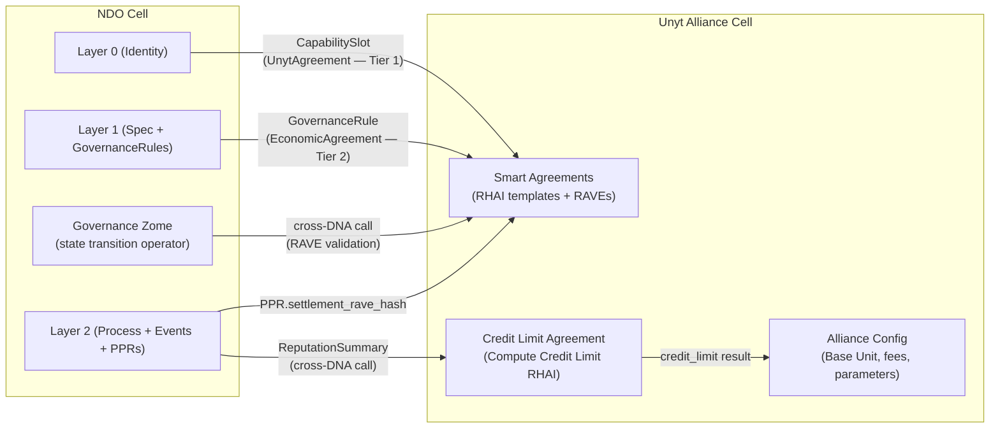

# Unyt Integration: Economic Closure for the Nondominium Object

**Status**: Post-MVP Design Document  
**Created**: 2026-03-11  
**Authors**: Nondominium project  
**Relates to**: `nondominium-prima-materia.md`, `many-to-many-flows.md`, `versioning.md`

---

## Table of Contents

1. [Framing: The Generic NDO and Nondominium as Instantiation](#1-framing)
2. [The Economic Closure Problem](#2-the-economic-closure-problem)
3. [The NDO Economic Loop](#3-the-ndo-economic-loop)
4. [Unyt as Economic Operator](#4-unyt-as-economic-operator)
5. [Integration Architecture](#5-integration-architecture)
6. [Alliance Design Patterns](#6-alliance-design-patterns)
7. [The Reputation-Credit Mechanism](#7-the-reputation-credit-mechanism)
8. [Economic Governance](#8-economic-governance)
9. [Generic NDO and Nondominium as Instantiation](#9-generic-ndo-and-nondominium-as-instantiation)
10. [Integration Path](#10-integration-path)
11. [Requirements](#11-requirements)

---

## 1. Framing: The Generic NDO and Nondominium as Instantiation

This document is written in the context of a conceptual shift in the Nondominium project's post-MVP trajectory. The Nondominium Object (NDO) — the three-layer DHT primitive described in `nondominium-prima-materia.md` — is being recognised as generic infrastructure that should exist independently of any specific application domain.

The plan:

- A **new project** (working name: *NDO Commons*) will implement the three-layer model (Identity, Specification, Process), the lifecycle state machine, the capability slot surface, the governance-as-operator architecture, and the PPR system as a generic, reusable Holochain hApp primitive
- **Nondominium** (this project) will become one **instantiation** of that generic primitive: a peer resource-sharing economy built on top of NDO Commons, adding resource-domain-specific entry types, PPR categories, role structures, and economic configurations
- Other projects can build their own NDO instantiations: fabrication networks, cooperative enterprises, local economic systems, digital commons — any community that needs a cryptographically-accountable, self-governing, lifecycle-aware object infrastructure

This document specifies how Unyt integrates with the **generic NDO**. The Unyt integration is designed to be:

- **Optional** — the NDO functions without it; economic settlement is a capability communities activate when they need it, not a structural requirement
- **Modular** — it connects to the NDO via the capability slot mechanism (Section 6 of `nondominium-prima-materia.md`) and a standard GovernanceRule type, requiring no modifications to the NDO's core data model
- **Alliance-configurable** — each NDO community defines its own Unyt Alliance: its unit of account, its credit limit algorithm, its Smart Agreement templates, its fee policy
- **Lifecycle-aware** — economic terms can differ across NDO lifecycle stages; a resource under development may be accessed freely while the same resource in `Active` state requires economic settlement

Nondominium's specific Unyt configuration (resource-sharing currencies, Commons Alliance archetype, credit limit algorithm based on physical resource PPRs) is described in Section 9 as an instantiation example, not as the generic specification.

---

## 2. The Economic Closure Problem

The ValueFlows standard, on which the NDO is built, provides rigorous primitives for describing and observing economic activity: Resources, Events, Agents, Processes, Commitments, Claims. It is a complete accounting ontology — a language for *observing* what happens economically.

What ValueFlows does not provide is **settlement**. It accurately records who did what, with what resource, at what time. It does not close the loop by specifying what economic value subsequently flows to the people who contributed. The observation is complete; the consequence is absent.

This is the **economic closure problem**: a system that observes all economic activity but produces no economic consequence cannot sustain the incentive structures needed for long-term participation. Agents contribute, validate, steward, repair, transport — and the system records all of it — but nothing economically meaningful follows from the record. The loop is open.

Open loops break commons economies. The digital commons (FLOSS, Wikipedia) can survive on open loops because information is non-rivalrous: sharing a file costs nothing. Physical commons — shared tools, equipment, spaces, transport capacity, repair skill — are rivalrous. Physical stewardship has real costs: time, expertise, risk of damage to one's equipment, opportunity cost. A system that observes stewardship without rewarding it will reliably attract less of it, and will ultimately fail to retain the agents who are best at it.

The closure Unyt provides has four dimensions:

1. **Settlement** — economic value flows as a direct consequence of observed events; the RAVE (Recorded Agreement Verifiably Executed) is the cryptographic proof that value flowed
2. **Currencies** — communities define their own units of account, matched to the actual value their resources produce; credits earned through contribution can be spent on access, services, or governance
3. **Credit** — participation history determines economic capacity; the past record of an agent becomes collateral for future engagement, without requiring financial deposits or social vouching
4. **Governance weight** — economic standing feeds back into governance authority; those who have contributed most to the commons have the most legitimate standing to shape its rules

When all four dimensions are active, the loop closes. The sections that follow trace that loop in full.

---

## 3. The NDO Economic Loop

The NDO's three layers provide the structural basis for description and observation. Unyt provides the settlement layer that makes observation consequential. Together they define a complete, self-reinforcing economic loop.

```
┌──────────────────────────────────────────────────────────────────────────┐
│                        THE NDO ECONOMIC LOOP                             │
│                                                                           │
│  DESCRIPTION  (Layer 1)                                                   │
│    What the resource is. What governance rules apply.                     │
│    What economic terms govern access, contribution, and benefit.          │
│    ↓                                                                      │
│  OBSERVATION  (Layer 2)                                                   │
│    What happens: events, commitments, claims, quality receipts (PPRs).   │
│    Who did what, when, with what resource, at what quality.               │
│    ↓                                                                      │
│  SETTLEMENT  (Unyt Smart Agreement → RAVE)                                │
│    Value flows as a direct consequence of observed events.                │
│    Smart Agreement executed → RAVE produced → credits flow to stewards.  │
│    ↓                                                                      │
│  REPUTATION  (PPR + RAVE linkage)                                         │
│    The permanent record of participation quality and economic reliability.│
│    PPR: who did what, how well (quality proof).                           │
│    RAVE: who settled what, to whom, under what rules (economic proof).    │
│    Together: a complete, cross-verifiable agent economic identity.        │
│    ↓                                                                      │
│  CREDIT  (Compute Credit Limit Agreement)                                 │
│    Reputation → economic capacity in the commons.                         │
│    New agents: minimal credit (minimal track record).                     │
│    Reliable stewards: expanded credit (demonstrated trustworthiness).     │
│    The past record becomes collateral for future engagement.              │
│    ↓                                                                      │
│  ACCESS  (UnytAgreement enforcement + RAVE as precondition)               │
│    Credit + agreement execution → state transition approved.              │
│    Resources governed by their own economic terms, enforced by peers.     │
│    ↓                                                                      │
│  MOTIVATION                                                               │
│    Participation in the commons earns economic standing.                  │
│    Economic standing unlocks access to more of the commons.               │
│    The incentive to contribute aligns perfectly with the incentive        │
│    to participate: they are the same incentive.                           │
│    ↓                                                                      │
│  GOVERNANCE                                                               │
│    Economic standing → governance weight.                                 │
│    Those who have contributed most to the commons have the most          │
│    standing to shape its rules. Smart Agreements ARE governance rules.    │
│    ↓                                                                      │
│  DESCRIPTION  (Layer 1 — updated through governance)                     │
│    Governance decisions update economic terms.                            │
│    New Smart Agreements are endorsed as GovernanceRules.                  │
│    Credit limit algorithms are recalibrated.                              │
│    The resource's economic self-description evolves with the community.   │
│    [loop]                                                                 │
└──────────────────────────────────────────────────────────────────────────┘
```

Each element of the loop maps to specific technical primitives:

| Loop element | NDO primitive | Unyt primitive |
|---|---|---|
| Description | Layer 1 (`ResourceSpecification` + `GovernanceRule`) | `EconomicAgreementRuleData` (in `GovernanceRule`) |
| Observation | Layer 2 (`EconomicEvent`, `Commitment`, `Claim`, `PPR`) | — |
| Settlement | — | Unyt Smart Agreement + RAVE |
| Reputation | `PrivateParticipationClaim` (PPR) | `settlement_rave_hash` field (on PPR) |
| Credit | — | `Compute Credit Limit Agreement` (RHAI) |
| Access | Governance zome (state transition) | `UnytAgreement` enforcement + RAVE validation |
| Motivation | — | Credit capacity as economic signal |
| Governance | `GovernanceRule` + role-based access | Smart Agreements as economic governance rules |

The loop is the architecture. Every design decision in the integration should be evaluated against how it strengthens or weakens the loop's coherence.

---

## 4. Unyt as Economic Operator

Unyt ([unyt.co](https://unyt.co)) is peer-to-peer accounting infrastructure built on Holochain. Each participant runs the application on their own device, maintains their own cryptographically-signed chain of records, and validates peers directly. There are no central servers, miners, or stakers. Like the NDO, it is agent-centric and DHT-based — both systems share the same foundational architecture.

This architectural compatibility is not incidental. It means:

- The same agent key that signs NDO events also signs Unyt transactions. Cross-cell calls between the NDO cell and the Unyt cell share the same cryptographic identity without trust bridges or API integrations.
- The NDO's agent-centric observation (Layer 2 events, PPRs on each agent's source chain) can be accessed by Unyt's credit limit algorithm via cross-DNA calls to the same node — no data replication, no synchronization protocol.
- Both systems use Holochain's append-only DHT and source chain model, so RAVEs are as permanent and tamper-evident as PPRs; neither can be retroactively altered.

**Unyt's key primitives in the NDO context:**

**Unyt Alliance** — A configured deployment of the Unyt system. Each Alliance defines its own Base Unit (unit of account), credit limit algorithms, transaction fee policies, Smart Agreement templates, Service Networks (sub-communities), and governance. For the generic NDO: each NDO community that activates economic settlement configures a Unyt Alliance. The Alliance is the community's economic constitution, parallel to but separate from the NDO's governance constitution (GovernanceRules).

**Smart Agreement** — Programmable economic rules governing value flows, credit extension, and coordination. Validated by peers, not by central servers. For the NDO: Smart Agreements are the economic complement to GovernanceRules — where GovernanceRules specify *who may take what action*, Smart Agreements specify *what economic consequence follows when they do*.

**RAVE (Recorded Agreement Verifiably Executed)** — The immutable artifact produced when a Smart Agreement executes. Contains inputs used, the agreement reference, and outputs produced. Any participant can independently verify the execution. For the NDO: the RAVE is the economic proof that complements the PPR's participation proof. Together they constitute a complete, doubly-verifiable record that neither system alone can provide.

**Compute Credit Limit Agreement** — A configurable Smart Agreement (RHAI script) that dynamically calculates each agent's credit capacity. For the NDO: this is the bridge between observation and economic capacity. The agent's participation history, expressed through their `ReputationSummary`, becomes the primary input — making reputation the collateral for economic access.

**Source Chain** — Each agent's append-only, cryptographically-signed record of all their actions. In Holochain, this is the same structure in both the NDO cell and the Unyt cell. An agent's economic history in Unyt and their participation history in the NDO are both part of the same cryptographic identity — they are two aspects of a single coherent agent record.

---

## 5. Integration Architecture

The NDO-Unyt integration uses four coupling points, designed to be independently activatable across the three integration phases described in Section 10.

### 5.1 Capability Slot (Layer 0 — discovery surface)

The `UnytAgreement(String)` slot type in the `SlotType` enum (defined in `nondominium-prima-materia.md` Section 8.3) is the permissionless discovery surface. Any Accountable Agent can attach a proposed Unyt Smart Agreement to any NDO's Layer 0 identity hash. This is informational — a proposal, a market signal, a community suggestion. Multiple competing proposals may coexist. The governance zome does not enforce Tier 1 slots.

The `String` parameter carries the Unyt Alliance network seed, allowing a single NDO to be referenced by agreements on different Alliance instances (for inter-community bridging or migration scenarios).

### 5.2 GovernanceRule — EconomicAgreement Type (Layer 1 — authoritative terms)

`GovernanceRule` entries of type `EconomicAgreement` are the authoritative economic terms. When a custodian or governance process creates this rule, it endorses a specific Unyt Smart Agreement as the economic condition for a set of `VfAction` events. The rule carries:

```rust
// New variant in GovernanceRuleType enum (zome_resource integrity)
pub enum GovernanceRuleType {
    // ... existing rule types ...
    EconomicAgreement, // rule_data: JSON-serialized EconomicAgreementRuleData
}

#[derive(Serialize, Deserialize)]
pub struct EconomicAgreementRuleData {
    pub unyt_alliance_id: String,         // Network seed of the Unyt Alliance
    pub smart_agreement_hash: String,      // Entry hash of the Unyt Smart Agreement
    pub trigger_actions: Vec<VfAction>,    // Which VfActions trigger settlement
    pub settlement_window_secs: u64,       // Max seconds between RAVE execution and transition
    pub note: Option<String>,              // Human-readable description of economic terms
}
```

This rule lives in Layer 1 alongside other GovernanceRules — access control, role requirements, validation schemes. It is the economic layer of the resource's governance specification.

### 5.3 State Transition Enforcement (Governance Zome — enforcement bridge)

When the governance zome processes a state transition whose `VfAction` matches a `trigger_actions` entry in an endorsed `EconomicAgreement` rule, the transition request must include a `rave_hash`. The governance zome:

1. Confirms the transition's `VfAction` is in the rule's `trigger_actions` list
2. Retrieves and validates the RAVE from the Unyt DHT (cross-DNA call)
3. Confirms the RAVE was executed within `settlement_window_secs`
4. Confirms RAVE inputs match the transition context (resource identity, provider, receiver, quantity or duration)
5. Approves the transition and generates the PPR with `settlement_rave_hash` populated

This makes the governance zome's approval conditional on cryptographic proof of economic settlement — the resource does not move, change state, or transfer custody until the agreed value has flowed.

### 5.4 PPR + RAVE Linkage (Layer 2 — provenance chain closure)

The `settlement_rave_hash` field on `PrivateParticipationClaim` entries is the binding point between the NDO's participation record and Unyt's economic record:

```rust
pub struct PrivateParticipationClaim {
    // ... existing fields ...
    pub settlement_rave_hash: Option<String>, // Unyt RAVE hash; None if no economic rule triggered
}
```

This creates a complete, cross-verifiable provenance chain:

```
Commitment
  └─ (fulfilled by) EconomicEvent
       └─ (generates) PrivateParticipationClaim (PPR)
            ├── performance_metrics: { timeliness, quality, reliability, communication }
            ├── bilateral_signatures: (provider_sig, receiver_sig)
            └── settlement_rave_hash → Unyt RAVE
                     └─ (verifiable on Unyt DHT: inputs, agreement, outputs, executor)
```

The PPR is the **participation proof**: who did what, with what quality, in which role. The RAVE is the **economic proof**: what value flowed, to whom, under what rules, verified by Unyt peers. Together, they constitute a record of a resource interaction that is complete in both the participation and economic dimensions — and that feeds back into both the reputation system and the credit limit algorithm.

### 5.5 Unyt Alliance (external, per-community)

The Unyt Alliance is a separate Holochain cell (or Unyt Sandbox deployment) that the NDO cell interacts with via cross-DNA calls. It is not embedded in the NDO — it is federated alongside it. Each NDO community configures its own Alliance.



---

## 6. Alliance Design Patterns

Different NDO communities have very different economic needs. The Unyt Alliance is configurable enough to support a broad spectrum. Three archetypes cover the most common patterns; communities can combine and extend them freely.

### 6.1 Gift Economy Alliance

**When to use**: Communities where sharing is unconditional, economic tracking is for awareness not enforcement. Time banks, mutual aid networks, close-knit cooperatives, family or neighbourhood resource sharing.

**Base Unit**: A contribution token (e.g. "GiftHour") with no monetary exchange value — a formal record of giving, not a claim on receiving. The unit's purpose is visibility, not pricing.

**Credit limit**: Generous and largely uniform. Participation history is tracked but does not gate access. Reputation is public and affirming, not exclusionary.

**Smart Agreements**: None that gate resource access. Optionally: `Aggregate Payment` agreements that route a fraction of activity-generated tokens to the NDO's governance pool (funding maintenance, shared infrastructure, community operations).

**Fees**: Zero. Always.

**NDO Integration**: `UnytAgreement` capability slots are informational only (Tier 1). No `EconomicAgreement` governance rules enforced. Settlement is voluntary, reciprocal, and community-normed rather than system-enforced.

**Loop dynamics**: In this archetype, Unyt's primary contribution is visibility and soft incentive, not enforcement. The observation → settlement → reputation path is active, but the credit → access gate is open. The loop is complete but runs on social rather than economic pressure.

### 6.2 Commons Alliance

**When to use**: Shared resources with real stewardship costs; access should be earned through contribution; non-contributing access-seekers should pay fees. Tool libraries, maker spaces, shared equipment pools, repair networks.

**Base Unit**: A commons credit (e.g. "CommonHour" or "FabCredit") earned through contribution, validation, and stewardship; spent on access and services.

**Credit limit**: Dynamically derived from `ReputationSummary` (see Section 7). New members get minimal credit (observer access only). Each validated contribution, stewardship event, or governance participation increases credit. Long-term reliable stewards have the highest credit capacity.

**Smart Agreements**:
- `Conditional Forward` for access fees (non-contributors pay before access; contributors access freely within credit)
- `Aggregate Payment` for stewardship compensation (custodian + maintenance fund + optional protocol treasury)
- `Proof of Service` for service billing (transport, repair, storage providers automatically settled on validated Claim)

**Fees**: Small, directed entirely to the community's maintenance fund. No fees to Unyt as a platform — Unyt does not require fees to operate.

**NDO Integration**: Full integration across all three phases. `EconomicAgreement` governance rules enforce access and service settlement. PPR + RAVE linkage generates reputation. Credit limit derived from PPRs creates the graduation gradient.

**Loop dynamics**: This is the fully-closed loop archetype. Every element is active: description → observation → settlement → reputation → credit → access → motivation → governance → description. The commons is economically self-sustaining.

### 6.3 Cooperative Alliance

**When to use**: Productive communities with shared output and shared revenue; contributors should receive proportional benefit from what they collectively created. Open hardware design communities, fabrication networks, cooperative software projects, distributed manufacturing.

**Base Unit**: A contribution token tied to a revenue-distribution mechanism. The token is less a currency than an accounting ledger entry — a share in the cooperative's outputs.

**Credit limit**: Contribution depth. Agents who have produced more (validated commits, design iterations, test fabrications, governance participation) have higher standing and thus higher credit capacity.

**Smart Agreements**:
- `Aggregate Payment` with proportional distribution: each contributor receives a share of revenue proportional to their verified Layer 2 contribution history
- Revenue sharing tables managed by governance, updated as the community's understanding of contribution value evolves

**Fees**: Zero. All economic flows are internal to the cooperative; no platform extraction is appropriate.

**NDO Integration**: Full integration. The Layer 2 contribution tracking (EconomicEvents, PPRs) feeds directly into Unyt's revenue distribution algorithm. The NDO's observation layer *is* the distribution basis — there is no separate contribution ledger.

**Loop dynamics**: The loop here runs most visibly through the governance dimension: as contributors earn revenue shares, they become more invested in governance (they have economic skin in the game), which improves decision-making quality, which improves the product, which generates more revenue, which distributes to contributors — a virtuous cycle.

---

## 7. The Reputation-Credit Mechanism

The feedback from reputation to credit is the backbone of the self-sustaining commons. This section specifies it in full.

### 7.1 ReputationSummary as Credit Input

The NDO's governance zome derives `ReputationSummary` entries from an agent's accumulated PPRs. The Unyt integration adds one new field to this summary:

```rust
pub struct ReputationSummary {
    pub agent: AgentPubKey,
    pub period_start: Timestamp,
    pub period_end: Timestamp,

    // Existing fields
    pub average_performance_score: f64,  // Weighted avg across all PPR categories (0.0-1.0)
    pub creation_count: u32,             // ResourceCreation + ResourceValidation PPRs
    pub custody_count: u32,              // CustodyTransfer + CustodyAcceptance PPRs
    pub service_count: u32,              // Maintenance + Storage + Transport PPRs
    pub governance_count: u32,           // DisputeResolution + ValidationActivity + RuleCompliance PPRs

    // New field, enabled by Unyt integration
    pub economic_reliability_score: f64, // Fraction of settlement-required interactions settled
                                         // cleanly (RAVE within window, no disputes, no reclaims)
                                         // Range: 0.0 (never settled) to 1.0 (always settled)
}
```

The `economic_reliability_score` is the economic analogue of the existing quality metrics. It answers the question: when this agent was required to settle economically (access fee, service payment, custody bond), did they follow through? An agent with high quality scores but low economic reliability is a participation risk. An agent with both high quality and high economic reliability is the ideal steward.

This field is `0.0` for all agents before Unyt integration is active (no settlement records exist). It becomes meaningful as soon as an agent begins interacting with economically-governed resources.

### 7.2 Compute Credit Limit Agreement (RHAI)

The Unyt Alliance's `Compute Credit Limit Agreement` is a RHAI script that receives the agent's `ReputationSummary` as input (sourced from the NDO governance zome via cross-DNA call) and produces a credit limit as output.

A reference implementation suitable for the Commons Alliance archetype:

```rhai
// Inputs provided by Unyt framework:
//   reputation (ReputationSummary), config (Alliance Global Config parameters)

let base_credit = config.base_credit_limit;

// Performance multiplier: quality of past interactions
let performance_bonus = base_credit
    * reputation.average_performance_score
    * config.performance_weight;

// Depth bonuses: breadth and depth of network contribution
let custody_bonus  = reputation.custody_count  * config.custody_credit_per_event;
let service_bonus  = reputation.service_count  * config.service_credit_per_event;
let governance_bonus = reputation.governance_count * config.governance_credit_per_event;

// Capacity before reliability adjustment
let capacity = base_credit + performance_bonus
    + custody_bonus + service_bonus + governance_bonus;

// Economic reliability multiplier: agents who settle cleanly get full capacity;
// agents who routinely fail to settle are capped at 50% of earned capacity.
// This is the most important guard against economic free-riding.
let reliability_multiplier = 0.5 + (0.5 * reputation.economic_reliability_score);

capacity * reliability_multiplier
```

All `config.*` parameters are set in the Alliance's Global Configuration and can be updated through community governance without modifying the RHAI script. The community tunes the model as it learns what parameter values produce the outcomes it wants.

### 7.3 The Graduation Gradient

New agents start with `base_credit_limit` and no bonuses. Their first interactions are therefore constrained — they can access resources with low economic requirements, but not those with high access fees or custody bonds. This is intentional: it protects the commons from agents with no track record.

As agents accumulate PPRs with RAVE linkage, their credit capacity grows continuously:

| Agent standing | Typical credit capacity | Enabled interactions |
|---|---|---|
| New (no PPRs) | Base credit only | Low-cost access; observation; contribution proposals |
| Emerging (5–20 PPRs) | Base + moderate bonuses | Standard access; simple service commitments |
| Established (20+ PPRs, high quality) | Full bonuses | Full access; custody responsibility; complex service chains |
| Senior (50+ PPRs, specialist roles) | Maximum credit | High-value custody; governance weight; inter-alliance bridging |

The gradient is a continuous function, not a hard gate. Agents grow into the commons economically as they demonstrate trustworthiness, reliability, and economic responsibility. The system never stops anyone permanently — it calibrates access to demonstrated track record.

A key property: this system is **self-regulating without administrators**. No human decides who gets how much credit. The RHAI script is the credit policy; PPRs are the evidence; peers validate both. The community designs the rules (through governance); the algorithm enforces them (through Unyt); the DHT records everything permanently.

---

## 8. Economic Governance

The deepest dimension of the Unyt integration is its role in governance. This is not simply about who pays for access. It is about who has the standing to shape the rules, and about making rule-setting itself consequential.

### 8.1 Smart Agreements as Governance Rules

The NDO's governance model separates governance-as-operator (the governance zome evaluates rules and approves transitions) from the data model (zome_resource stores the rules). Unyt extends this model: **Smart Agreements are economic governance rules**. They specify not just what may happen, but what must economically flow when it does.

A resource's complete governance constitution therefore has three layers:

1. **Access rules** — `GovernanceRule` entries specifying who may take what action (role requirements, validation requirements, agent tier checks)
2. **Economic rules** — `GovernanceRule` entries of type `EconomicAgreement` specifying what must settle before the action is approved
3. **Settlement logic** — Unyt Smart Agreement RHAI scripts specifying exactly how value flows when settlement is triggered

Together, these three layers constitute a complete, peer-enforced, cryptographically-guaranteed economic constitution for the resource. No legal system, no platform, no administrator required. The rules are in the DHT; the enforcement is in the validation logic; the settlement is in Unyt. The "governance engine" is the network of peers running the same code.

This is the fullest expression of what `nondominium-prima-materia.md` calls the **governance-as-operator architecture**: not just governance deciding who can act, but governance specifying the complete economic context of action — including consequences, settlement flows, and redistribution rules.

### 8.2 Economic Standing as Governance Weight

A commons governance system faces a persistent challenge: how do you weight decision-making authority? Options include one-agent-one-vote (ignores contribution depth), stake-weighted voting (replicates capital concentration), or delegated representation (reintroduces hierarchy).

The Unyt integration offers a fourth option: **contribution-weighted governance**. Because the NDO's PPR system tracks participation quality and the Unyt integration tracks economic reliability, the `ReputationSummary` is a natural, continuously-updated, peer-validated measure of an agent's depth of investment in the commons. This can serve as governance weight without requiring any additional infrastructure.

Specific governance applications in the NDO context:

- **N-of-M validation schemes**: validators for lifecycle transitions (e.g. `Prototype → Stable`) can be weighted by their governance PPR count and economic reliability score, ensuring that the most engaged participants have the most influence over quality gates
- **Dispute resolution authority**: access to `DisputeResolutionParticipation` PPR roles can require minimum credit standing, ensuring only economically embedded agents serve as dispute resolvers
- **Economic rule amendments**: amendments to `EconomicAgreement` governance rules (changing payment terms, credit limit parameters) can require supermajority consent from agents above a minimum credit tier, preventing rule changes by agents with no stake in the outcome

These are optional governance configurations — not requirements of the generic NDO. Each NDO instantiation decides which governance weightings make sense for its community.

### 8.3 Commons Treasury and Protocol Economics

For communities that configure non-zero fees (Commons Alliance, Cooperative Alliance), accumulated fees constitute a **commons treasury**. Unyt's Service Network mechanism allows this treasury to be managed by a designated steward, a multisig group, or a DAO-style governance process.

The treasury's purpose is to make the commons economically self-sustaining: paying for maintenance and repair of physical infrastructure, funding development of shared digital resources, compensating governance work (validation, dispute resolution, rule-writing), and building bridge deposits for inter-alliance connectivity.

Critically: the treasury's distribution rules are themselves Unyt Smart Agreements — configurable by the community, enforced by Unyt, updatable through governance. No central administrator manages the treasury. The rules manage it.

### 8.4 Inter-NDO Economic Bridges

When multiple NDO communities (multiple Unyt Alliances) want to connect, Unyt's inter-Alliance bridging mechanism allows value to flow between them. This enables:

- A hardware design commons and a regional fabrication network to exchange credits (design access in exchange for fabrication capacity)
- A tool library and a repair cooperative to share economic infrastructure (repair credits earned by tool library members; tool access earned by repair members)
- A network of local resource-sharing communities to maintain separate identities and governance while exchanging value

At the generic NDO level, inter-community bridging is an Alliance configuration decision. Each Alliance decides whether to enable bridging, with which Alliances, and at what conversion rates. The Layer 0 NDO identity hash provides a stable cross-network reference point — an NDO is always identifiable regardless of which Alliance is processing a transaction involving it.

Unyt's EVM blockchain bridge is the mechanism for communities that need to interface with the conventional monetary economy: paying for insurance, physical storage rent, online services, or participating in markets beyond the peer network. Organisations can lock real-world value (ETH, stablecoins) and mirror it into the commons network as credits; participants can redeem back out when needed.

---

## 9. Generic NDO and Nondominium as Instantiation

This section makes the generic/specific distinction concrete — what is part of the reusable NDO infrastructure and what is Nondominium's domain-specific contribution.

### 9.1 What the Generic NDO Infrastructure Provides (Unyt Layer)

The generic NDO project implements these Unyt integration points at the Holochain level:

- `UnytAgreement(String)` variant in the `SlotType` enum
- `EconomicAgreement` variant in the `GovernanceRuleType` enum with `EconomicAgreementRuleData` schema
- `settlement_rave_hash: Option<String>` field on `PrivateParticipationClaim`
- `economic_reliability_score: f64` field on `ReputationSummary`
- Cross-DNA call interface: `get_reputation_summary(agent, period) -> ReputationSummary`
- Cross-DNA call interface: `validate_ndo_context(resource_hash, provider, receiver, action) -> ValidationResult`
- Governance zome extension: `EconomicAgreement` rule detection and RAVE validation in `evaluate_transition_request`

The generic NDO does **not** implement:
- Any specific Unyt Alliance configuration (currencies, credit algorithms, fee policies)
- Any specific Smart Agreement templates (RHAI scripts)
- Any specific resource domain types or PPR categories
- Any specific governance weight calculations

### 9.2 What Nondominium Adds as an Instantiation

Nondominium (this project), built on the generic NDO, adds:

- **Resource domain types**: the specific VfActions (`AccessForUse`, `TransferCustody`, etc.) and four economic processes (Transport, Storage, Repair, Use)
- **PPR category domain**: the 16 `ParticipationClaimType` variants specific to physical resource sharing (see governance zome documentation)
- **Default Alliance configuration**: Commons Alliance archetype, tuned for physical resource sharing economies
- **Standard Smart Agreement templates**: the four value flow patterns defined in `nondominium-prima-materia.md` Section 6.5 (Access Fee, Service Billing, Revenue Sharing, Custody Bond)
- **Credit limit algorithm**: the RHAI script from Section 7.2, with parameter defaults tuned for physical resource stewardship economies
- **Role-based credit tiers**: mapping SimpleAgent / AccountableAgent / PrimaryAccountableAgent role promotions onto credit gradient thresholds

### 9.3 The Separation

```
┌─────────────────────────────────────────────────────────────────┐
│                  GENERIC NDO INFRASTRUCTURE                      │
│  (implements prima-materia + this document's integration layer) │
│                                                                  │
│  • Three-layer model (L0, L1, L2)                               │
│  • Lifecycle state machine                                       │
│  • Capability slot surface (incl. UnytAgreement type)           │
│  • GovernanceRule framework (incl. EconomicAgreement type)      │
│  • PPR system (incl. settlement_rave_hash, economic_reliability) │
│  • Cross-DNA Unyt call interfaces                               │
│  • Governance zome RAVE validation                              │
└──────────────────────┬──────────────────────┬───────────────────┘
                       │                      │
            ┌──────────▼──────┐    ┌──────────▼──────────────────┐
            │  NONDOMINIUM    │    │  OTHER NDO INSTANTIATIONS    │
            │  (this project) │    │  (future)                    │
            │                 │    │                              │
            │  • Resource     │    │  • Fabrication network       │
            │    domain types │    │  • Local currency system     │
            │  • 16 PPR       │    │  • Cooperative enterprise    │
            │    categories   │    │  • Digital commons           │
            │  • Commons      │    │  • Art circulation network   │
            │    Alliance     │    │  • etc.                      │
            │    config       │    │                              │
            └────────┬────────┘    └─────────────────────────────┘
                     │
            ┌────────▼────────────────────────────────┐
            │  UNYT ALLIANCE (per NDO community)      │
            │                                          │
            │  • Base Unit (community currency)        │
            │  • Credit limit RHAI script + params     │
            │  • Smart Agreement templates             │
            │  • Fee policy (default: zero)            │
            │  • Service Networks                      │
            │  • Treasury management                   │
            │  • Inter-alliance bridge config          │
            └──────────────────────────────────────────┘
```

---

## 10. Integration Path

The integration is structured as four sequential phases. Each phase delivers independent value; none require rollback of prior work.

### Phase 1 — NDO Foundation *(Generic NDO project; no Unyt deployment needed)*

Implement in the generic NDO project at the Holochain level:

- `UnytAgreement(String)` in `SlotType` enum
- `EconomicAgreement` in `GovernanceRuleType` enum with `EconomicAgreementRuleData` schema
- `settlement_rave_hash: Option<String>` on `PrivateParticipationClaim`
- `economic_reliability_score: f64` on `ReputationSummary` (computed as `0.0` when no RAVE data exists)
- Cross-DNA call stubs (return placeholder data until Phase 3)

**What this delivers**: The generic NDO is structurally Unyt-ready. Any NDO instantiation can inherit these integration points. No Unyt Alliance is required to run. The stubs ensure that zomes compile and pass validation; they just don't execute economic logic yet.

### Phase 2 — Alliance Configuration *(Per-community, parallel to Phase 1)*

Configure Unyt Alliances for communities that want to activate economic settlement:

- Deploy Unyt Sandbox for the community's Alliance
- Define Base Unit (name, symbol, initial supply or mutual credit parameters)
- Configure credit limit algorithm (RHAI script with initial parameters)
- Create standard Smart Agreement templates using the [Unyt Smart Agreement Library](https://github.com/unytco/smart_agreement_library) as starting point
- Set fee policy
- Register Alliance network seed in NDO capability slots (`UnytAgreement` Tier 1 links)

**What this delivers**: The Alliance exists and is functional. Agents can use it for voluntary payments and reputation-building before enforcement is active. Economic infrastructure is in place; it runs in parallel with the NDO without being coupled to it yet.

### Phase 3 — Enforcement *(zome_gouvernance changes)*

Implement in the NDO governance zome:

- `evaluate_transition_request` extended to detect `EconomicAgreement` governance rules
- Cross-DNA call to Unyt cell implementing the RAVE validation sequence (Section 5.3)
- `rave_hash` requirement in transition request payloads for governed resources
- PPR generation updated to populate `settlement_rave_hash` on valid RAVEs
- `economic_reliability_score` computation in `ReputationSummary` derivation

**What this delivers**: Full enforcement. Resources with economic terms are now automatically governed by them. The NDO economic loop is closed. A resource without a Unyt agreement is unaffected; a resource with one enforces it peer-to-peer.

### Phase 4 — Ecosystem *(post-basic integration)*

- Inter-Alliance bridging for multi-community NDO networks (bridging configuration in Alliance + NDO discovery via Layer 0 identity hashes)
- Governance weight calculations using `ReputationSummary` + `economic_reliability_score` for weighted N-of-M validation and governance participation
- Treasury management Smart Agreements for commons maintenance funding
- EVM blockchain bridging for fiat/crypto on-off ramp (for communities requiring interface with the conventional economy)

**What this delivers**: The NDO network effect. Multiple communities sharing NDO infrastructure, exchanging value across Unyt Alliance bridges, with governance informed by cross-community economic standing.

---

## 11. Requirements

### 11.1 Generic NDO Integration Layer Requirements

- **REQ-UNYT-NDO-01**: The generic NDO shall implement `UnytAgreement(String)` as a named `SlotType` variant where the String carries the Unyt Alliance network seed identifier.
- **REQ-UNYT-NDO-02**: The generic NDO shall implement `EconomicAgreement` as a named `GovernanceRuleType` variant with `EconomicAgreementRuleData` as its structured `rule_data` schema, carrying `unyt_alliance_id`, `smart_agreement_hash`, `trigger_actions`, `settlement_window_secs`, and optional `note`.
- **REQ-UNYT-NDO-03**: The `PrivateParticipationClaim` entry type shall include `settlement_rave_hash: Option<String>`. This field shall be `None` for all transitions where no `EconomicAgreement` rule was triggered.
- **REQ-UNYT-NDO-04**: The `ReputationSummary` derived type shall include `economic_reliability_score: f64`, computed as the fraction of an agent's settlement-required interactions that were settled cleanly. The value shall be `0.0` for agents with no settlement history.
- **REQ-UNYT-NDO-05**: The governance zome shall expose a cross-DNA-callable function `get_reputation_summary(agent: AgentPubKey, period: Option<TimePeriod>) -> ReputationSummary` for use by Unyt's Compute Credit Limit Agreement.
- **REQ-UNYT-NDO-06**: The governance zome shall expose a cross-DNA-callable function `validate_ndo_context(resource_hash: ActionHash, provider: AgentPubKey, receiver: AgentPubKey, action: VfAction) -> ValidationResult` for use by Unyt RAVE input validation.
- **REQ-UNYT-NDO-07**: Cross-DNA call stubs for Unyt interfaces shall be implemented in Phase 1 and shall return placeholder passing results until Phase 3 activates live Unyt connections.

### 11.2 Alliance Configuration Requirements

- **REQ-UNYT-AL-01**: Each NDO community activating economic settlement shall configure a Unyt Alliance with at minimum: `unyt_alliance_id`, `base_credit_limit`, a `Compute Credit Limit Agreement` RHAI script accepting `ReputationSummary` as input, and at least one Smart Agreement template matching the community's primary economic interaction patterns.
- **REQ-UNYT-AL-02**: The Alliance's `Compute Credit Limit Agreement` shall accept `ReputationSummary` as an input parameter, sourced from the NDO governance zome via cross-DNA call.
- **REQ-UNYT-AL-03**: Alliance fee policies shall default to zero. Non-zero fees require explicit community configuration through Alliance governance. No fees to the Unyt platform are mandatory.
- **REQ-UNYT-AL-04**: Alliance Global Configuration parameters (credit weights, bonus rates, reliability multiplier) shall be independently updatable through community governance, without modifying or redeploying the RHAI credit limit script.

### 11.3 State Transition Enforcement Requirements

- **REQ-UNYT-ENF-01**: When the governance zome processes a state transition whose `VfAction` matches a `trigger_actions` entry in an endorsed `EconomicAgreement` governance rule, the transition request shall include a `rave_hash`. Requests without a required `rave_hash` shall be rejected with a `SettlementRequired` rejection reason.
- **REQ-UNYT-ENF-02**: RAVE validation shall include: (a) retrieval from the Unyt DHT, (b) confirmation of execution within `settlement_window_secs`, (c) confirmation that RAVE inputs match the transition context (resource identity, provider, receiver, VfAction, quantity or duration within tolerance).
- **REQ-UNYT-ENF-03**: Approved transitions with valid RAVEs shall generate PPRs with `settlement_rave_hash` populated for all participating agents. Approved transitions without economic rules shall generate PPRs with `settlement_rave_hash: None`.
- **REQ-UNYT-ENF-04**: RAVE validation failures shall produce a `GovernanceTransitionResult::Rejected` with a specific `rejection_reason` indicating the settlement failure (RAVE not found, RAVE expired, context mismatch). The agent may re-execute the Unyt agreement and resubmit the transition request.

### 11.4 Economic Governance Requirements

- **REQ-UNYT-GOV-01**: NDO instantiations may optionally use `economic_reliability_score` and PPR category counts as weights in N-of-M validation schemes. The generic NDO shall expose these through its governance query API without mandating their use.
- **REQ-UNYT-GOV-02**: Amendments to `EconomicAgreement` governance rules shall require authorization by the role defined in the rule's `enforced_by` field, consistent with the governance-as-operator architecture (`REQ-ARCH-07`).
- **REQ-UNYT-GOV-03**: The credit limit graduation gradient (base credit, bonus parameters, reliability multiplier) shall be community-configurable via Alliance Global Configuration parameters. Hard-coded credit tiers in the generic NDO code are not permitted.
- **REQ-UNYT-GOV-04**: An NDO resource that has no endorsed `EconomicAgreement` governance rule shall be fully accessible according to its non-economic governance rules alone. Unyt integration shall be invisible and non-blocking for resources that have not opted into it.

---

*This document is post-MVP. It describes the integration of Unyt as the economic settlement layer for the generic NDO primitive. The generic NDO project (implementing `nondominium-prima-materia.md` as a standalone hApp) has not yet begun. When it is created, Nondominium (this project) will migrate to it as one instantiation, inheriting the Unyt integration layer described here. The integration path in Section 10 applies to the generic NDO project first, and to Nondominium thereafter.*
