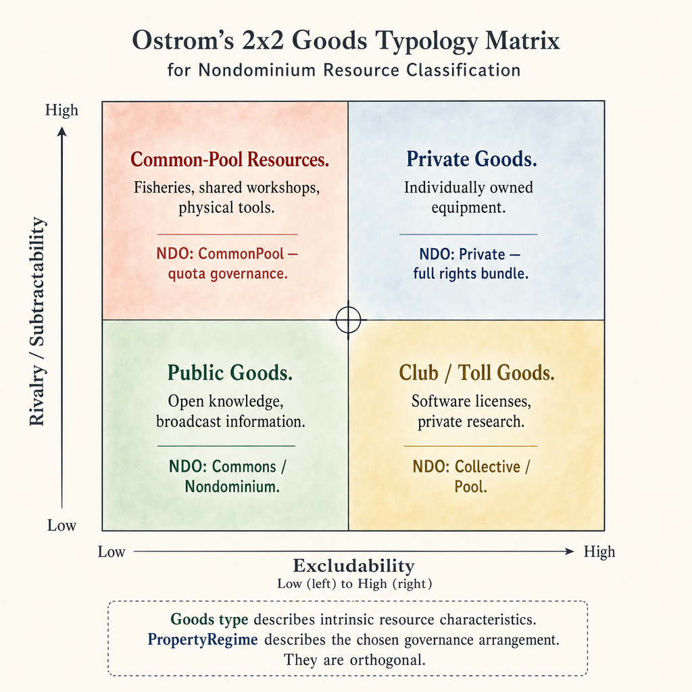
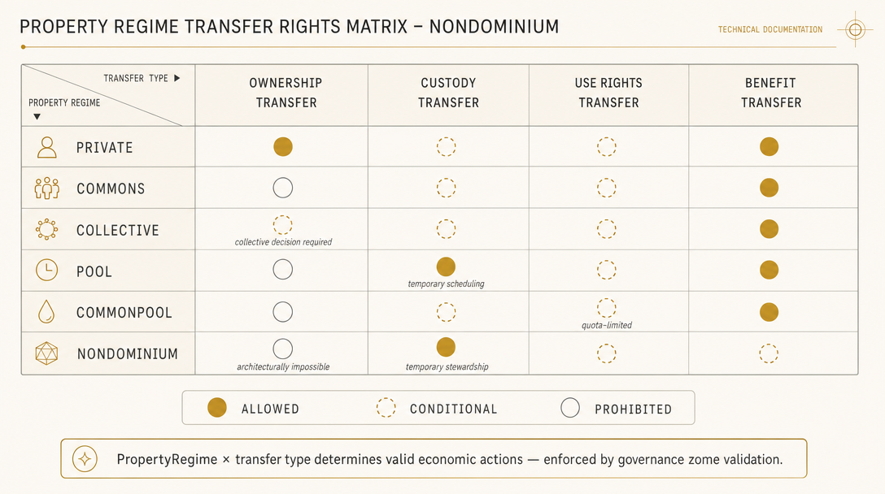
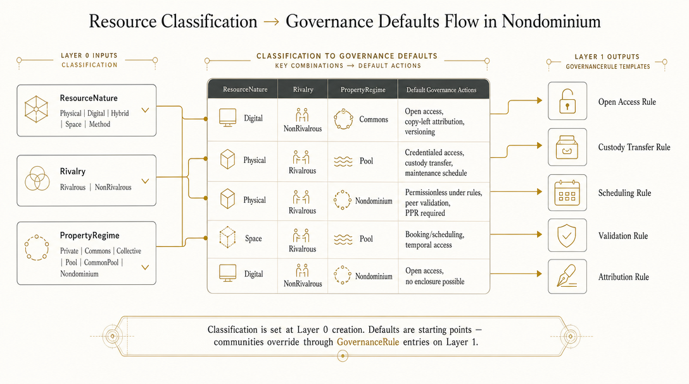

# Resources: Ontology, Implementation, and Forward Map

**Type**: Archive / Knowledge Base Document  
**Created**: 2026-03-11  
**Last updated**: 2026-06-16 (synced with NDO Layer 0 + federation code)  
**Relates to**: `ndo_prima_materia.md`, `versioning.md`, `digital-resource-integrity.md`, `unyt-integration.md`, `flowsta-integration.md`, `IMPLEMENTATION_STATUS.md`  
**Sources**: MVP code (`zome_resource`, `zome_gouvernance`), shared types ([`crates/shared/src/types.rs`](../../crates/shared/src/types.rs)), NDO coordinator ([`dnas/nondominium/zomes/coordinator/zome_resource/src/ndo_identity.rs`](../../dnas/nondominium/zomes/coordinator/zome_resource/src/ndo_identity.rs)), federation modules (`zome_gouvernance` `hard_link.rs`, `contribution.rs`, `agreement.rs`), post-MVP design documents, [OVN wiki — Resource](https://ovn.world/index.php?title=Resource), [OVN wiki — Resource type](https://ovn.world/index.php?title=Resource_type)

---

## Purpose

This document maps the three states of Resource understanding in this Nondominium / NDO project:

1. **Implemented** — what exists today in the MVP `zome_resource` and `zome_gouvernance` codebases (including NDO Layer 0 and federation extensions)
2. **Planned** — what is designed in the post-MVP requirements documents
3. **Remaining** — what the OVN wiki's 15 years of commons-based peer production practice contains that NDO does not yet plan to implement, and which should inform the generic NDO design

The goal is to ensure that the generic NDO — which will be built as a standalone hApp and then instantiated by Nondominium and other projects — represents a complete and principled resource ontology, not an accidental by-product of a single use-case.

---

## 1. Conceptual Foundation: Resources in P2P Complexity Economics

Before mapping what is and is not implemented, it is necessary to establish what a Resource *is* in the theoretical context this project operates within. The OVN wiki defines resources from the REA (Resources, Events, Agents) ontology and extends it through 15 years of Sensorica practice. The NDO builds further on this.

### 1.1 Beyond REA Primitives

In standard REA accounting, a Resource is simply an entity that has economic value and can be tracked as it flows through Events performed by Agents. This is a correct but minimal definition — adequate for accounting, inadequate for governance.

In peer production, a resource is also:
- An **information carrier**: it encodes design intent, provenance, contribution history, and quality evidence
- A **coordination node**: agents discover it, express intent to use it, negotiate access, and coordinate around it
- A **trust anchor**: its history of use (how it has been treated, maintained, transacted) is evidence about the agents who interacted with it
- An **economic attractor**: governance rules embedded in a resource determine who can access it (to improve / develop use, maintain it), and therefore shape the economic topology of the network around it.

This richer conception changes the design requirements fundamentally. A Resource is not merely a record in a ledger — it is a *socially embedded DHT object* with its own identity, governance constitution, and economic role.

### 1.2 The Tragedy of the Commons Solved by Embedded Governance

Hardin's "tragedy of the commons" (1968) argued that shared resources are inevitably depleted because individual agents have incentives to overuse. His solution was privatisation or central regulation. Ostrom's work (*Governing the Commons*, 1990) empirically refuted this: communities have sustainably governed shared resources for centuries through embedded, peer-enforced rules — without privatisation and without central authorities.

The NDO is, architecturally, an implementation of Ostrom's finding. The GovernanceRule entries embedded in ResourceSpecifications are exactly the "locally evolved institutions" that Ostrom identified as the mechanism of successful commons governance. The peer validation of economic events, PPR generation, and role-based access control are the "monitoring and sanctioning" mechanisms she observed.

This theoretical grounding is not academic decoration. It justifies specific design choices: governance rules must be *embedded in the resource* (not in a separate administrative system), enforcement must be *peer-based* (not authority-based), and participation in governance must generate *reputational stake* for participants.

### 1.3 Rivalrous vs. Non-Rivalrous: The Governance Fork

Benkler (*The Wealth of Networks*, 2006) identifies the rivalry or non-rivalry of a resource as the primary determinant of optimal governance strategy:

- **Non-rivalrous resources** (digital designs, methods, documentation, software): can be copied and shared at near-zero marginal cost. Restricting access does not preserve the resource — it only reduces total value creation. Default governance: open access, attribution-based, copy-left.
- **Rivalrous resources** (physical tools, equipment, spaces, materials): use by one agent excludes others. Restricting access is necessary to prevent overuse and ensure maintenance. Default governance: Ostromian embedded rules, reputation-gated access, stewardship requirements.

This distinction has profound implications for NDO Resource modeling. A resource's governance defaults, access rules, lifecycle requirements, and Unyt integration patterns should all differ based on rivalry. The current implementation does not model rivalry explicitly — this is a fundamental gap. - ToDo

### 1.4 Complexity Matching: Governance Overhead Must Match Resource Complexity

Bar-Yam's complexity matching principle states that the governance complexity of a system must match the complexity of the challenges it manages. Applied to resources:

- A simple idea (Layer 0 only, `Ideation` lifecycle stage) requires near-zero governance overhead
- A design file shared across a network requires moderate governance (attribution, versioning, integrity)
- A physical CNC machine used by 50 agents requires substantial governance (access rules, maintenance scheduling, custody chains, reliability tracking)

The NDO's three-layer model (`ndo_prima_materia.md`) directly implements this principle. **`LifecycleStage` on Layer 0 is implemented** (10 stages, integrity-validated transitions); governance overhead can now be matched to maturity for NDO identity. This document still argues the forward map needs further refinement — `OperationalState` split, rivalry/scope classification, and Layers 1 & 2 activation — to model the full spectrum of resource types in practice.

### 1.5 Resources as Social Infrastructure

The OVN wiki goes further than REA in recognising **intangible resources**: social capital, trust, community sense, governance knowledge, competencies, synergy. These are not commodifiable — they cannot be transferred, traded, or priced. But they are inputs to productive processes and outputs of participation.

In complexity economics terms: these intangibles are the *emergent properties* of the social system. They cannot be designed in; they arise from the right conditions. But they can be cultivated, protected, and damaged. A governance system that only models material and digital resources is blind to a large fraction of the actual value that flows in peer production communities.

The NDO does not need to *track* intangible resources in the same way it tracks a bicycle or a CAD file. But it must be *aware* of them — as a category of resource type — to avoid designing governance mechanisms that damage them.

### 1.6 Source: the Third Category

The REA ontology that underpins ValueFlows operates with two primitives: **Agent** and **Resource**. The resource classification work in sections 1.1–1.5 implicitly accepts this duality. But 15 years of OVN practice and a growing literature on socio-ecological systems accounting reveal a case where neither primitive is adequate: *generative ecological systems* — watersheds, rivers, forests, fisheries, atmospheric assimilation capacity — that yield resources, receive ecological effects, and condition future possibilities without being ownable, intentional, or inventoriable in the standard sense.

The academic paper [`source-ndo-paper.md`](post-mvp/source-ndo-paper.md) demonstrates with Occam's razor that modelling a watershed under `Nondominium` governance without a `Source` primitive requires three active ontological fictions and leaves four economic relations inexpressible. Adding one new primitive removes all seven distortions.

**`Source` is a third ontological category**: a generative, non-ownable, partially unknowable system that:
- **yields** Resources (a river yields cubic metres of water when abstracted)
- **receives** ecological effects (a river receives heavy-metal discharge)
- **conditions** other Sources (a forest conditions river flow and resilience)
- **accumulates** a historical ledger of boundary events for adaptive governance

Sources are represented in the Nondominium architecture as **Source-NDOs**: `NondominiumIdentity` entries with `PropertyRegime::Nondominium` (or `CommonPool`), a linked `SourceProfile` extension for condition indicators, and a `stewardedBy` relation instead of `primaryAccountable`. No agent owns a Source; stewards carry obligations to maintain the event ledger and adapt governance rules as the source ledger grows.

This is the cybernetic governance loop: boundary events accumulate → stewards interpret conditions → governance rules adapt → access affordances change → future events are conditioned. It extends the governance-as-operator pattern from complicated (rule-evaluable) to complex (adaptive, signal-based) governance contexts.

Normative requirements for Source-NDO are in [`source-ndo-requirements.md`](post-mvp/source-ndo-requirements.md). This subsection is an ontological framing note; the detailed data model, governance patterns, and ValueFlows extension (`vf:Source`) are in that document.

---

## 2. Current Implementation (MVP)

### 2.1 Entry Types in `zome_resource` Integrity

The MVP implements **four** entry types in `zome_resource` integrity, plus shared NDO enums in [`crates/shared/src/types.rs`](../../crates/shared/src/types.rs) (imported by both integrity and coordinator zomes):

**`NondominiumIdentity`** (NDO Layer 0 — ✅ implemented, PR #80/#84)

```rust
pub struct NondominiumIdentity {
    pub name: String,
    pub initiator: AgentPubKey,
    pub property_regime: PropertyRegime,
    pub resource_nature: ResourceNature,
    pub lifecycle_stage: LifecycleStage,
    pub created_at: Timestamp,
    pub description: Option<String>,
    pub successor_ndo_hash: Option<ActionHash>,   // set once on Deprecated (REQ-NDO-LC-06)
    pub hibernation_origin: Option<LifecycleStage>, // set on → Hibernating; cleared on resume
}
```

The original `create_ndo` action hash is the stable Layer 0 identity for all time. `property_regime`, `resource_nature`, and `lifecycle_stage` live on Layer 0 (not on `ResourceSpecification` or `EconomicResource`). Only `lifecycle_stage`, `successor_ndo_hash` (once), and `hibernation_origin` (Hibernating transitions) may change after creation; all other fields are integrity-validated as immutable. Deletes are always invalid (permanent tombstone at EndOfLife).

Coordinator API: `create_ndo`, `get_ndo`, `get_all_ndos`, `get_my_ndos`, `update_lifecycle_stage`, `get_ndos_by_lifecycle_stage`, `get_ndos_by_nature`, `get_ndos_by_property_regime` — see `ndo_identity.rs`.

**Shared enums on Layer 0** (defined in `crates/shared/src/types.rs`):

```rust
pub enum LifecycleStage {
    Ideation, Specification, Development, Prototype,
    Stable, Distributed, Active,
    Hibernating, Deprecated, EndOfLife,
}

pub enum PropertyRegime {
    Private, Commons, Collective, Pool, CommonPool, Nondominium,
}

pub enum ResourceNature {
    Physical, Digital, Service, Hybrid, Information,
}
```

> **Doc/code consistency:** `PropertyRegime` has six variants in Rust but the UI (`packages/shared-types`) and `IMPLEMENTATION_STATUS.md` document four (Collective and Pool described as removed after design review). See §2.6. `ResourceNature` in code adds `Service` and `Information` beyond the three-variant design in `ndo_prima_materia.md`; forward-map variants `Space`, `Method`, and `Currency` (§6.2) are not yet in code.

**`ResourceSpecification`**
```rust
pub struct ResourceSpecification {
    pub name: String,
    pub description: String,
    pub category: String,
    pub image_url: Option<String>,
    pub tags: Vec<String>,
    pub is_active: bool,
}
```
This is the **knowledge layer** in ValueFlows terminology: the type or template of a resource. It corresponds to the OVN concept of "Resource Type" — an abstract representation that groups interchangeable concrete instances.

**`EconomicResource`**
```rust
pub struct EconomicResource {
    pub quantity: f64,
    pub unit: String,
    pub custodian: AgentPubKey, // TODO (G1, REQ-AGENT-02): replace with AgentContext post-MVP
                                // to support Collective, Project, Network, and Bot agents as
                                // Primary Accountable Agents. Currently assumes individual agent.
    pub current_location: Option<String>,
    pub state: ResourceState,
}
```
This is the **observation layer**: a specific instance of a resource at a point in time, held by a specific custodian.

**`GovernanceRule`**
```rust
pub struct GovernanceRule {
    pub rule_type: String,   // free-form string (e.g., "access_requirement")
    pub rule_data: String,   // JSON-encoded, completely untyped
    pub enforced_by: Option<String>,
}
```
Economic rules governing access and use. Currently entirely untyped — `rule_data` is a free-form JSON string with no schema enforcement. - ToDo: explore how to make governance rules machine readable and executable, typed. 

**`ResourceState`** (enum on `EconomicResource`) — *still conflated; `OperationalState` split pending (`REQ-NDO-OS-06`)*

```
PendingValidation | Active | Maintenance | Retired | Reserved
```

`LifecycleStage` is **implemented** on `NondominiumIdentity` (see above). The legacy `ResourceState` on `EconomicResource` still conflates maturity and operational condition. The code contains an explicit `TODO` to split into:

- **`LifecycleStage`** — on `NondominiumIdentity` (✅ implemented)
- **`OperationalState`** — on `EconomicResource` (🔄 not implemented): `PendingValidation | Available | Reserved | InTransit | InStorage | InMaintenance | InUse`

`Maintenance` and `Reserved` in the current enum are operational conditions, not lifecycle milestones. A resource being repaired is still `LifecycleStage::Active` — it would have `OperationalState::InMaintenance` once the split lands.

### 2.2 Link Graph

The link types model resource discovery and navigation:

**Legacy resource/spec links** (`zome_resource`):
- Anchor links for global discovery (`AllResourceSpecifications`, `AllEconomicResources`, `AllGovernanceRules`)
- Hierarchical links (`SpecificationToResource`, `SpecificationToGovernanceRule`)
- Agent-centric links (`CustodianToResource`, `AgentToOwnedSpecs`, `AgentToManagedResources`)
- Faceted search links (`SpecsByCategory`, `ResourcesByLocation`, `ResourcesByState`, `RulesByType`)
- Governance links (`ResourceToValidation`)
- Update chain links (for Holochain's append-only update pattern)

**NDO Layer 0 links** (✅ implemented, PR #80/#84):
- `AllNdos` — global anchor at path `"ndo_identities"` → all `NondominiumIdentity` action hashes
- `AgentToNdo` — initiator `AgentPubKey` → NDOs they created
- `NdoByLifecycleStage` — path `"ndo.lifecycle.{Stage}"` → NDOs at that stage (moved on transition)
- `NdoByNature` — path `"ndo.nature.{Nature}"` → NDOs of that nature (immutable after creation)
- `NdoByPropertyRegime` — path `"ndo.regime.{Regime}"` → NDOs under that regime (immutable after creation)
- `NdoToSuccessor` — deprecated NDO → successor `NondominiumIdentity` (REQ-NDO-LC-06)
- `NdoToTransitionEvent` — NDO → triggering `EconomicEvent` action hash (REQ-NDO-L0-05; link only, cross-zome event validation deferred)

> **Not yet implemented:** `NDOToSpecification` and `NDOToProcess` links (Layers 1 & 2 activation per `ndo_prima_materia.md` §4).

### 2.3 What the MVP Does Well

- **Permanent Layer 0 identity anchor** — `NondominiumIdentity` with field-level immutability and integrity-validated lifecycle state machine (forward chain, Hibernating resume, Deprecated + successor, EndOfLife tombstone)
- **Faceted NDO discovery** — global, per-agent, and categorization anchors by lifecycle stage, nature, and property regime
- Clean separation of specification (type/template) from resource (instance) — consistent with ValueFlows Knowledge/Observation layering
- Single-custodian model is appropriate for the current Artcoin/simple sharing use case
- GovernanceRule linked to ResourceSpecification rather than EconomicResource is architecturally correct: rules belong to the type, not the instance
- The anchor link pattern enables permissionless discovery
- **Cross-NDO federation primitives** — typed hard links, peer-validated contributions, and benefit-redistribution agreements in `zome_gouvernance` (PR #103; see §2.5)

### 2.4 Known Gaps in the MVP

| Gap | Impact | Status / planned fix |
|---|---|---|
| `ResourceState` conflates lifecycle and operational dimensions on `EconomicResource` | Cannot model in-transit, in-storage, or in-maintenance instances independently of Layer 0 lifecycle | 🔄 **`OperationalState` split pending** (`REQ-NDO-OS-06`); `LifecycleStage` on Layer 0 is ✅ done |
| ~~No property regime field~~ | ~~Cannot distinguish nondominium from commons from individual stewardship~~ | ✅ **`PropertyRegime` on `NondominiumIdentity`** (see §2.6 for 6-vs-4 variant reconciliation) |
| ~~No resource nature field~~ | ~~Cannot distinguish digital from physical from hybrid~~ | ✅ **`ResourceNature` on `NondominiumIdentity`** (5 variants in code; see §2.6) |
| `GovernanceRule.rule_data` is untyped JSON string | No schema enforcement, no tooling support, no peer validation of rule semantics | 🔄 `GovernanceRuleType` enum with typed schemas (`ndo_prima_materia.md` + `unyt-integration.md`) |
| ~~No lifecycle before `PendingValidation`~~ | ~~Cannot model resources in ideation, design, development stages~~ | ✅ **`LifecycleStage` (10 stages) on Layer 0** with full transition validation |
| Single custodian only | Cannot model shared tools, collective custody, resource pools | 🔄 Many-to-many flows (post-MVP) |
| ~~No resource-level identity separate from specification hash~~ | ~~Identity changes when specification is updated~~ | ✅ **`NondominiumIdentity` Layer 0** — stable action hash independent of spec updates |
| No full versioning DAG | Cannot track all design-evolution relations (fork, merge, repair, augment) | 🔄 Partial via `NdoHardLink` (§2.5); full DAG in `versioning.md` |
| No digital integrity | Cannot verify downloaded digital resource data | 🔄 Digital Resource Integrity (post-MVP) |
| No rivalry/non-rivalry modeling | Governance defaults are the same for all resource types | Gap — see Section 5 |
| No scope classification | Cannot determine network-wide vs. project-specific visibility | Gap — see Section 5 |
| No resource reliability | No way to track a tool's track record independent of custodian reputation | Gap — see Section 5 |
| No cross-app identity or DID | Agents cannot prove identity across Holochain apps or networks; reputation is local to this DHT; no key recovery mechanism | 🔄 `FlowstaIdentity` CapabilitySlot on `Person` entry hash (`ndo_prima_materia.md` Section 6.7) |
| No agent key recovery | If agent loses device, signing key (and all private entries/PPRs) are inaccessible; no deterministic key regeneration | 🔄 Flowsta Vault BIP39 recovery phrases; auto-backup; CAL-compliant data export (`ndo_prima_materia.md` Section 6.7) |
| Layers 1 & 2 not linked to Layer 0 | Specification and process activity not activated via `NDOToSpecification` / `NDOToProcess` | 🔄 `ndo_prima_materia.md` §4 |
| Governance-as-operator for lifecycle transitions | Transitions validated in integrity zome only; no automatic EconomicEvent generation | 🔄 REQ-NDO-LC-02, REQ-NDO-LC-03, REQ-NDO-LC-07 |

### 2.5 Federation, versioning & contribution layer (`zome_gouvernance`, ✅ PR #103)

Beyond `zome_resource`, the governance zome implements NDO federation and contribution primitives that partially address versioning, composability, and OVN contribution tracking:

**`NdoHardLink`** — typed cross-NDO (cross-DNA) relationships:

```rust
pub enum NdoLinkType { Component, DerivedFrom, Supersedes }

pub struct NdoHardLink {
    pub from_ndo_identity_hash: ActionHash,
    pub to_ndo_dna_hash: DnaHash,
    pub to_ndo_identity_hash: ActionHash,
    pub link_type: NdoLinkType,
    pub fulfillment_hash: ActionHash, // EconomicEvent backing this link
    // ...
}
```

Partial coverage of the versioning DAG (`versioning.md`): `DerivedFrom` and `Supersedes` map to evolution/supersession relations; `Component` supports composable/fractal resource architecture. Not a full DAG (no `ForkedFrom`, `MergedFrom`, `RepairedFrom`, etc.).

**`Contribution`** — peer-validated work on an NDO (ValueFlows Work/Modify semantics):

```rust
pub struct Contribution {
    pub provider: AgentPubKey,
    pub action: VfAction,
    pub ndo_identity_hash: ActionHash,
    pub validated_by: Vec<AgentPubKey>, // min 1 AccountableAgent
    pub effort_quantity: Option<f64>,
    // optional cross-DNA WorkLog reference (Group DNA)
    // ...
}
```

**`Agreement`** — benefit redistribution clauses on an NDO (partial Unyt/BRD primitive):

```rust
pub struct Agreement {
    pub ndo_identity_hash: ActionHash,
    pub version: u32,
    pub clauses: Vec<BenefitClause>,
    pub primary_accountable: Vec<AgentPubKey>,
    // ...
}
```

Coordinator modules: `hard_link.rs`, `contribution.rs`, `agreement.rs`. Sweettest coverage in `dnas/nondominium/tests/src/governance/mod.rs`. Not yet wired to Unyt RAVE validation or full upstream contribution propagation.

### 2.6 Doc/code consistency notes (reconciliation recommended)

| Topic | Code (ground truth) | Other docs | Recommendation |
|---|---|---|---|
| **`PropertyRegime` variant count** | 6 variants in `crates/shared/src/types.rs` and integrity validation | `IMPLEMENTATION_STATUS.md` and UI shared-types document 4 (Private, Commons, Nondominium, CommonPool — "Collective and Pool removed after design review") | Reconcile in a dedicated pass: either remove Collective/Pool from Rust or restore them in UI/docs |
| **`ResourceNature` variants** | `Physical, Digital, Service, Hybrid, Information` (5) | This doc §6.2 forward map adds `Space, Method, Currency`; `ndo_prima_materia.md` specifies 3 | Treat code's 5 variants as implemented; forward-map additions remain post-MVP |
| **Lifecycle governance** | Initiator-only `update_lifecycle_stage` (MVP) | REQ-NDO-LC-07 role-based authorization | Defer to governance-as-operator integration |
| **Transition events** | `NdoToTransitionEvent` link optional; `transition_event_hash` often `null` in UI | REQ-NDO-LC-03 automatic EconomicEvent generation | Backend Phase 2.3 |

---

## 3. Post-MVP Roadmap

The following improvements are designed in the post-MVP documentation. Items marked **✅ Implemented** are live in the codebase; others remain planned or partial. Full specifications are in the referenced documents.

### 3.1 NDO Three-Layer Model (`ndo_prima_materia.md`)

The most significant architectural change. Replaces the flat `ResourceSpecification + EconomicResource` model with a progressive three-layer structure:

- **Layer 0 — NondominiumIdentity**: ✅ **Implemented** (PR #80/#84). A permanent, immutable identity anchor. The genesis entry whose action hash becomes the stable identifier for the resource across its entire existence. Contains `name`, `description`, `initiator`, `property_regime`, `resource_nature`, `lifecycle_stage`, `created_at`, `successor_ndo_hash`, `hibernation_origin`. Never voided — serves as the tombstone at end of life.
- **Layer 1 — ResourceSpecification** (activated by `NDOToSpecification` link): 🔄 **Not started**. The form of the resource — design, governance rules, assets, digital integrity manifests. Activated when the resource has a form worth sharing. Legacy `ResourceSpecification` entries exist but are not yet linked to Layer 0.
- **Layer 2 — Process** (activated by `NDOToProcess` link): 🔄 **Not started**. The activity around the resource — EconomicEvents, Commitments, Claims, PPRs. Activated when multi-agent coordination begins. ValueFlows cycle exists in `zome_gouvernance` but is not yet linked to NDO identity via `NDOToProcess`.

This model directly implements the complexity matching principle: coordination overhead grows with actual social complexity, not at resource creation. The three-layer structure describes the **resource face** of any entity — including collective entities. When a collective (project-organisation, cooperative, network) has an associated NDO, that NDO is its digital twin as a Resource: its permanent identity, lifecycle, specification, and governance. The collective also has an **agent face** (`AgentContext`) through which it participates in economic events. These are distinct — see `agent.md §3.1` for the dual-face model.

### 3.2 Property Regime and Resource Nature

✅ **Implemented on `NondominiumIdentity`** (shared crate + integrity validation). Canonical Rust definitions:

```rust
pub enum PropertyRegime {
    Private,        // Full rights bundle; individual ownership
    Commons,        // Non-rivalrous shared resource; governance via licensing/attribution
    Collective,     // Cooperative/collective ownership
    Pool,           // Pool of shareables: rivalrous shared resources; custody/scheduling/maintenance
    CommonPool,     // Rivalrous consumable resource; governance via quota/depletion rules
    Nondominium,    // Uncapturable by design; contribution-based access; no alienation permitted
}

pub enum ResourceNature {
    Physical,     // Material objects, equipment, consumables
    Digital,      // Software, data, design files, documents
    Service,      // Software services, knowledge assets (extends spec's 3-variant set)
    Hybrid,       // Digital twin of a physical resource
    Information,  // Knowledge assets, data sets (extends spec's 3-variant set)
}
```

These enums are part of `NondominiumIdentity` (Layer 0) — they classify the resource at creation and remain stable across its lifecycle (integrity-enforced). The `PropertyRegime` enum is reconciled from the OVN property regime taxonomy (§4.4.3) — see §4.4.6 for the full analysis.

> **Consistency caveat:** UI and `IMPLEMENTATION_STATUS.md` document four `PropertyRegime` variants; Rust retains six. See §2.6.

### 3.3 LifecycleStage and OperationalState

**`LifecycleStage`** — ✅ **Implemented** on `NondominiumIdentity` (10 stages, integrity-validated state machine, initiator-only updates in MVP):

```
Ideation → Specification → Development → Prototype →
Stable → Distributed → Active →
Hibernating → Deprecated → EndOfLife
```

Hibernating records `hibernation_origin` and resumes to that stage. Deprecated requires `successor_ndo_hash` (REQ-NDO-LC-06). EndOfLife is terminal.

**`OperationalState`** — 🔄 **Not implemented** on `EconomicResource`. The legacy 5-state `ResourceState` enum still conflates both dimensions (`REQ-NDO-OS-06`):

```
PendingValidation | Available | Reserved | InTransit | InStorage | InMaintenance | InUse
```

`Maintenance` and `Reserved` in the current `ResourceState` enum are operational conditions, not lifecycle milestones. Transport, storage, and maintenance are *processes* that can apply to a resource at *any* lifecycle stage (a `Prototype` can be `InTransit` between labs; an `Active` resource can be `InMaintenance`).

Each lifecycle transition **should** be governance-validated (the governance zome as state transition operator), generate an economic event, and create a lifecycle history audit trail (REQ-NDO-LC-02/03). Today: integrity zome validates transitions; automatic EconomicEvent generation and governance-as-operator evaluation are deferred.

### 3.4 Versioning (`versioning.md`)

🔄 **Partially implemented** via `NdoHardLink` (`NdoLinkType`: Component, DerivedFrom, Supersedes) in `zome_gouvernance` (PR #103). Cross-DNA hard links support federation-scale composition and supersession.

Full DAG-based version graph (typed relations: `EvolvedFrom`, `ForkedFrom`, `MergedFrom`, `RepairedFrom`, `AugmentedFrom`, `PortedToPlatform`) and OVN-compliant contribution propagation upstream through the version graph remain planned — see `versioning.md`.

### 3.5 Digital Resource Integrity (`digital-resource-integrity.md`)

Cryptographic integrity verification for digital resources: SHA-256 content addressing per 64KB chunk, Merkle tree structure for selective verification, composable/fractal resource architecture (atomic → component → composite), supply chain transparency.

### 3.6 Many-to-Many Flows (`many-to-many-flows.md`)

Extension of the single-custodian model to shared custody with weights and roles, one-to-many/many-to-one/many-to-many custody transfers, resource pools, co-custodian delegation.

### 3.7 Unyt Integration (`unyt-integration.md`)

🔄 **Planned (post-MVP).** Economic settlement layer via Unyt Smart Agreements and RAVEs. `EconomicAgreement` GovernanceRule type, RAVE validation as state transition precondition, PPR↔RAVE provenance chain, reputation-derived credit limits.

> **Partial primitive:** `Agreement` + `BenefitClause` entries exist in `zome_gouvernance` (PR #103) as a benefit-redistribution data model on NDO identity hashes. Not yet wired to Unyt cells, RHAI scripts, or RAVE validation.

### 3.8 Flowsta Integration (`flowsta-integration.md`)

🔄 **Planned (post-MVP).** Decentralized identity and authentication layer via Flowsta agent linking. `FlowstaIdentity` CapabilitySlot on `Person` entry hash, providing W3C DID (`did:flowsta:uhCAk...`) without modifying the `Person` entry schema. Two-tier identity authority: Tier 1 (permissionless attestation via CapabilitySlot link) and Tier 2 (governance-enforced identity verification for role promotions and high-value transitions). Flowsta Vault provides BIP39 key recovery and auto-backup for agent data resilience (CAL-compliant). PPR `ReputationSummary` becomes attributable to a cross-app DID, enabling portable reputation across Flowsta-linked Holochain apps.

---

## 4. OVN Resource Ontology: 15 Years of Practice

The OVN wiki ([Resource](https://ovn.world/index.php?title=Resource), [Resource type](https://ovn.world/index.php?title=Resource_type)) represents the distilled understanding of commons-based peer production at Sensorica. This section synthesises its key concepts in the context of NDO design, with complexity economics justifications.

### 4.1 Resource Primitives (Greg Cassel / OVN)

The OVN wiki adopts Greg Cassel's resource primitive taxonomy: mental resources, identity, physical resources, and media resources. This is broader than REA.

**Mental resources** — thoughts, feelings, ideas, knowledge that exists in agents' minds. Cannot be modelled directly in a DHT system (they are in the agent's head, not on a public ledger), but they are inputs to productive processes. In NDO terms: mental resources become visible when an agent creates an `Ideation`-stage NDO (Layer 0 only), which is the externalization of a mental resource into a public intent. The Ideation lifecycle stage is precisely the mechanism by which mental resources enter the observable network.

**Identity** — the capacity to distinguish agents and resources. In NDO terms: the `NondominiumIdentity` entry is the identity resource for every NDO object. Agent identity is handled by `zome_person`.

**Physical resources** — material objects with physical properties. NDO's `Physical` nature classification and the full custody/maintenance/transport/repair process suite cover this category.

**Media resources** — information superimposed on mediums: signs, signals, streams, messages, items, channels. This maps to NDO's `Digital` nature classification but is richer: the OVN taxonomy distinguishes between a design file (media item) and the channel through which it is shared (media channel). NDO currently does not make this distinction — a `Digital` resource could be either.

**Complexity economics note**: Mental resources and media resources are both non-rivalrous. Their governance implications differ from physical resources. Encoding this distinction at the resource type level is prerequisite to correct governance defaults.

### 4.2 Value Chain Maturity

The OVN wiki characterises resources by their stage of development:

| OVN stage | Description | NDO `LifecycleStage` equivalent |
|---|---|---|
| Idea | Documented, contextualised intent | `Ideation` |
| Design | Formalised in CAD, SPICE, etc. | `Specification`, `Development` |
| Study | Documented R&D | `Development`, `Prototype` |
| Prototype | Tangible, somewhat functional | `Prototype` |
| Usable artifact | Ready-to-use product | `Stable`, `Distributed`, `Active` |

The NDO `LifecycleStage` enum covers and extends this taxonomy with the addition of post-operational stages (`Hibernating`, `Deprecated`, `EndOfLife`) that OVN implies but does not formally enumerate. The NDO model is thus more complete in this dimension.

**Complexity economics note**: A resource's governance complexity should match its value-chain maturity. An `Ideation`-stage resource (someone's declared intent) requires near-zero governance. A `Stable` design that is being distributed for fabrication requires full governance, integrity verification, and versioning. The NDO's pay-as-you-grow layer activation model directly implements this — it is why the three-layer model is correct.

### 4.3 Production Process Resource Types

The OVN wiki classifies what production processes need:

| OVN type | Description | NDO coverage |
|---|---|---|
| Human labor | Time spent working | **Not modeled** as a resource type; covered by PPR participation records |
| Usables | Non-consumed inputs (tools, equipment) | Physical resources in NDO |
| Consumables | Depleted inputs (glue, components) | Physical resources in NDO; quantity tracking covers depletion |
| Space | Physical or virtual locations | **Not explicitly modeled** as a resource type |
| Method | Protocol, recipe, sequence | **Not modeled** as a resource type |
| Currency | Symbolic value exchange system | **Not modeled** as a resource type; partially addressed by Unyt integration |

The most significant gaps here are **Method** (documented processes, recipes, protocols) and **Space** (physical locations with governance, scheduling, and access control needs). Both are important in commons-based peer production settings.

**Method resources** are particularly interesting in the NDO context: a fabrication method (how to assemble a CNC machine) is a non-rivalrous digital resource — it can be copied freely. But it is also a *governance-bearing* resource: it defines the conditions under which physical resources should be used, encoding safety requirements, quality standards, and attribution requirements. In NDO terms, a Method would be a Digital NDO whose Layer 1 specification includes both the documented process and governance rules referencing it.

**Space resources** are rivalrous (only one person can use the CNC machine bay at a time) and require scheduling/booking mechanics that the current NDO does not model. A future generic NDO should be able to express temporal availability as a dimension of resource governance.

### 4.4 Property Regimes

#### 4.4.1 What Property Is

The OVN wiki opens its treatment of property with a definition that reorients the entire concept away from legal formalism: "Property is about the **relationship between agents and things**. These relationships are institutionalized, meaning that they are codified as norms or rules or laws, are made public and are widely accepted by everyone in a social setting."

Property is not an object — it is a *bundle of rights and obligations* connecting a subject (agent) to an object (resource). Bentham identified four key classes of stakeholder rights in this bundle:

| Right | Description | NDO mapping |
|---|---|---|
| **Use** | Exclusive or otherwise — the right to interact with the resource | Role-gated VfAction execution; GovernanceRule `access_requirement` |
| **Usufruct** | The fruits of use — the right to benefit from what the resource produces | Benefit redistribution algorithm; PPR-based credit distribution |
| **Management** | The right to define how the resource is governed | GovernanceRule creation; role-gated rule modification |
| **Custody/Stewardship** | The right and obligation to maintain and protect the resource | `EconomicResource.custodian`; custody transfer protocols |

These four rights are not always bundled together. A Simple Agent may have Use rights without Management rights. A maintenance specialist has Custody rights for the duration of a repair without having Management rights. The NDO's role system and GovernanceRule architecture partially implements this unbundling, but without explicit modelling of which rights each role confers.

#### 4.4.2 Goods Typology: The Excludability × Rivalry Matrix



*Ostrom's four quadrants: Common-Pool Resources (high rivalry, low excludability → CommonPool regime), Private Goods (high/high → Private), Public Goods (low/low → Commons/Nondominium), Club/Toll Goods (low rivalry, high excludability → Collective/Pool). Goods type describes intrinsic characteristics; PropertyRegime describes the chosen governance arrangement.*

Before classifying property regimes, Ostrom (following Samuelson) establishes a goods typology based on two independent axes:

- **Excludability**: can non-payers or non-members be excluded from use?
- **Rivalry (subtractability)**: does one agent's use reduce availability for others?

| | Low excludability | High excludability |
|---|---|---|
| **Low subtractability** | Public goods (open knowledge, broadcast) | Toll / Club goods (private park, cable TV, software) |
| **High subtractability** | Common-pool resources (fisheries, physical tools) | Private goods (equipment owned by one person) |

Critically: goods types exist independently of property regimes. A common-pool resource (high subtractability, low excludability) can be owned as government property, private property, community property, or no-one's property. The goods type characterises the resource's *physical or informational nature*; the property regime characterises the *social arrangement* governing it.

This distinction matters for the NDO: `ResourceNature` and `Rivalry` describe the *intrinsic* characteristics of the resource. `PropertyRegime` describes the *chosen governance arrangement*. They are orthogonal fields.

#### 4.4.3 The Full Property Regime Taxonomy

The OVN wiki distinguishes more regime types than the current NDO plan. All are important for the generic NDO:

| Regime | Rivalry | Excludability | Description | NDO coverage |
|---|---|---|---|---|
| **Private** | Any | High | Owned by one agent; full rights bundle; protected by a higher authority (or by Nondominium design) | `Private` (NDO forward map) |
| **Public** | Any | Low | Owned by the state; accessible under conditions; not relevant in a stateless P2P context | Not planned (stateless system) |
| **Commons** | Non-rivalrous | Low | Pool of tangible but immaterial resources (designs, knowledge, software) with use governance (licences, attribution). Technically can be privatised through governance capture | `Commons` (NDO forward map) |
| **Pool of Shareables** | Rivalrous | Medium | Tangible material resources intended for sharing within a network; individually governed by property regime and intrinsic characteristics; designed for preservation and perpetual access | `Pool` (NDO forward map) |
| **Common-pool resource** | Rivalrous | Low | Mostly consumables, governed in bulk with rules for prevention of depletion; community-managed quotas | `CommonPool` (NDO forward map) |
| **Condominium** | Rivalrous | High | Resource divided into privately owned parts with collective governance of the whole (infrastructure, integrity, shared structures) | Not planned (can be added as a future variant) |
| **Nondominium** | Any | High (by design) | Requires *extremely high costs of control*, making it virtually uncontrollable by any entity — not even nation states. Does not need external protection because no actor can capture it. Examples: Bitcoin network, open seas, indigenous forest commons | `Nondominium` (NDO forward map) |
| **Toll goods (club goods)** | Non-rivalrous | High | Excludable but non-rivalrous up to a point (congestion); fee-based or membership-based access | Not planned (can be added as a future variant) |

**The three most critical distinctions for the NDO:**

**Commons ≠ Pool of Shareables**: The OVN wiki makes an important distinction. Commons are immaterial (non-rivalrous) resources — sharing a design file costs nothing and excludes no one. Pool of Shareables are material (rivalrous) — sharing a 3D printer requires scheduling, maintenance, and custody transfer. These have different governance requirements and should map to different `PropertyRegime` variants.

**Commons ≠ Nondominium**: In the OVN model:
- **Commons**: governed resources with shared stewardship; theoretically, governance capture could privatise a commons (a bad actor could modify the governance rules to extract exclusive control)
- **Nondominium**: *uncapturable by design* — no one can assert ownership, no organisation can enclose them. The property regime exists independently of governance rules: even if governance rules were to declare individual ownership, the cryptographic architecture makes it technically unenforceable

The NDO's architecture (append-only DHT, no admin key, agent-centric source chains) is a Nondominium implementation at the infrastructure level. This should be formally reflected in the data model.

**Nondominium is defined by cost of capture, not by intent**: The OVN wiki is precise — "The conditions for it to exist is to have extremely high costs of control, making it virtually uncontrollable by any entity, not even by nation states." This is a *technical* condition, not a legal or normative one. The NDO's `PropertyRegime::Nondominium` variant should encode a *validation constraint*: a resource declared as Nondominium must have governance rules that do not permit ownership assignment or transfer, and the system should reject GovernanceRule updates that attempt to add such rules.

#### 4.4.4 Property Regime Determines Possible Economic Models

The OVN wiki makes a point that is central to the NDO's relationship with Unyt: "once the property regime is fixed, only a limited number of motivation and incentive models are possible on top of that (call it economic model or business model). In turn, this determines people's values and behaviour within that organization."

This has direct architectural implications:

| PropertyRegime | Allowable economic models | Unyt implications |
|---|---|---|
| `Private` | Full market (buy/sell/rent/lend); individual benefit capture | Smart Agreement can specify price, rental, usage fees |
| `Commons` | Attribution-based; copyleft/open source | Smart Agreement triggers on share events, not sale events |
| `Pool` | Scheduling-based access; contribution-weighted priority; insurance/maintenance pools | Smart Agreement triggers on custody transfer; maintenance settlement. Post-MVP: access eligibility should also gate on `AffiliationState` ≥ `ActiveAffiliate` (TODO G2) |
| `CommonPool` | Quota-based; depletion taxes; collective replenishment | Smart Agreement governs extraction rate |
| `Nondominium` | Contribution-based; access is earned but not purchased; no alienation | Smart Agreement can distribute benefits of use but cannot assign ownership. Post-MVP: high-stakes access should gate on `AffiliationState` ≥ `ActiveAffiliate` or `CoreAffiliate` (TODO G2) |

The `PropertyRegime` on `NondominiumIdentity` should therefore be a *hard constraint* on which GovernanceRules and Unyt Smart Agreements are valid for that resource. The governance zome should enforce this: an attempt to attach a `sale` Smart Agreement to a `Nondominium` resource must be rejected.

#### 4.4.5 Property and Distribution — Transfer Rights



*Six PropertyRegime variants × four transfer types (Ownership, Custody, Use Rights, Benefit). Nondominium blocks ownership transfer architecturally. Pool allows temporary custody scheduling. Commons blocks ownership but allows stewardship. Enforced by governance zome validation.*

The OVN wiki observes: "Distribution is a change in status, a transfer of rights and obligations associated with that thing... Distribution is not possible without the notion of property."

In the NDO, different property regimes enable different types of transfers:

| Regime | Ownership transfer | Custody transfer | Use rights transfer | Benefit transfer |
|---|---|---|---|---|
| `Private` | ✅ Full alienation | ✅ | ✅ | ✅ |
| `Commons` | ❌ | ✅ (stewardship) | ✅ | ✅ (attribution) |
| `Pool` | ❌ (stays in pool) | ✅ (temporary custody) | ✅ (scheduled) | ✅ |
| `CommonPool` | ❌ | ✅ (extraction) | ✅ (quota-limited) | ✅ |
| `Nondominium` | ❌ (architecturally impossible) | ✅ | ✅ | ✅ |

The current NDO models custody transfer well (through `EconomicResource.custodian` and `TransferCustody` VfAction). It does not model ownership transfer, benefit transfer, or the regime-specific restrictions on which transfers are valid. The governance zome should enforce regime-appropriate transfer restrictions.

#### 4.4.6 OVN Analysis and NDO `PropertyRegime` Reconciliation

The OVN wiki identifies eight property regime types (§4.4.3 table). The current NDO plan (`Commons`, `Individual`, `Collective`, `Mixed`) is too narrow. The full OVN taxonomy is preserved in §4.4.3 as an analytical reference. The NDO forward map (§6.3) selects the six regimes that are architecturally relevant to the generic NDO:

```rust
pub enum PropertyRegime {
    Private,        // Full rights bundle; individual ownership
    Commons,        // Non-rivalrous shared resource; governance via licensing/attribution
    Collective,     // Cooperative/collective ownership
    Pool,           // Pool of shareables: rivalrous shared resources; custody/scheduling/maintenance
    CommonPool,     // Rivalrous consumable resource; governance via quota/depletion rules
    Nondominium,    // Uncapturable by design; contribution-based access; no alienation permitted
}
```

`Mixed` is removed — mixed regimes should be expressed as compound governance rules on top of a primary regime, not as a separate enum variant (which conveys no information about what the mix contains). `Individual` is renamed to `Private` to align with OVN property vocabulary. `Condominium` and `TollGoods` are omitted from the initial generic NDO — they can be added as future variants if communities require them.

**Complexity economics note**: The OVN wiki states: "Property regime is not merely a legal classification, it shapes the entire economic topology of flows. A resource under the Nondominium regime cannot be enclosed, which is a stronger guarantee than a Commons resource (which can theoretically be privatised through governance capture)." This is precisely the Bar-Yam complexity matching principle applied to governance: the information requirements for different property regimes are vastly different. A `Private` resource can be governed by simple bilateral contracts. A `Nondominium` resource requires cryptographic enforcement of uncapturability — human agreements are insufficient. The NDO's Holochain DHT architecture provides the technical foundation for Nondominium governance at scale; encoding the regime explicitly in the data model closes the loop between the technical guarantee and the social norm.

### 4.5 Accessibility, Availability, and Rivalry

The OVN wiki provides three orthogonal classification axes that NDO does not yet model:

**Accessibility** (who can access the resource):
- Free: public, no restrictions
- Protected/regulated: requires credentials — skill, role, reputation, or payment. In the NDO, "credentialed" access encompasses:
  - **Role-based**: existing `RoleType` membership, enforced by GovernanceRule `enforced_by` field
  - **AffiliationState-based** (post-MVP, TODO G2): derived from participation history via `AffiliationRecord` entries — e.g. `ActiveAffiliate` or `CoreAffiliate` tier. Not declared but computed; harder to game than assigned roles
  - **PortableCredential-based** (post-MVP, TODO G8): cross-network verifiable claims from allied networks, enabling recognition of contribution history that happened elsewhere
  - **ZKP-based** (post-MVP, TODO G7): privacy-preserving proofs of the form "I have ≥ N claims of type T" without revealing raw scores, counterparties, or timestamps — prerequisite for governance access without surveillance
  - **FlowstaIdentity-based** (post-MVP): cross-app identity via `FlowstaIdentity` CapabilitySlot on the agent's `Person` entry hash pointing to a dual-signed `IsSamePersonEntry` (Vault agent linking). Tier 1 (REQ-NDO-CS-12/CS-13) is a voluntary trust signal; Tier 2 (REQ-NDO-CS-14/CS-15) lets governance require a valid link for high-value or high-risk resource access — sybil resistance and cross-network accountability without revealing private PPR data
- Formally restricted: requires formal approval procedures

This maps to governance rule patterns in NDO but is not a first-class property. Encoding it explicitly would allow the system to set appropriate governance defaults and UI affordances automatically.

**Availability** (how much is there):
- Abundant: near-zero marginal reproduction cost (ideas, designs, documents)
- Scarce: high marginal reproduction cost (physical tools, equipment, materials)

And the related distinction:
- Rivalrous: access by one agent excludes others
- Non-rivalrous: multiple agents can access simultaneously without exclusion

**This is the most critical missing dimension in the NDO plan.** Rivalry determines optimal governance strategy more directly than any other property. Non-rivalrous resources should default to open access (information wants to be free); rivalrous resources require access scheduling, usage tracking, and maintenance governance. The generic NDO should model rivalry explicitly as a first-class `EconomicResource` property.

**Complexity economics note**: Benkler's entire argument for commons-based peer production rests on the distinction between rivalrous and non-rivalrous resources. A P2P governance system that does not formally model this distinction will produce governance rules that are either too restrictive for non-rival resources (inefficient) or too permissive for rival resources (destructive).

### 4.6 Transferability

| OVN transferability | Description | NDO coverage |
|---|---|---|
| Transferable | Can change ownership (currency, consumables) | Custody transfer in EconomicResource; ownership transfer in EconomicEvents |
| Non-transferable | Cannot be sold or given (social capital, reputation) | PPRs are non-transferable by design (cryptographic linkage to agent key) |
| Shareable | Commons / pool items — shared without ownership transfer | GovernanceRules can encode this but it is not a first-class classification |

The OVN wiki makes an important observation: allowing non-transferable assets (like reputation) to be transferred would destroy their value — "allowing this would in fact destroy the reputation system, as its meaning would be called into question." This is why Nondominium PPRs are cryptographically linked to the generating agent's key pair and cannot be assigned to another agent.

Flowsta's `FlowstaIdentity` CapabilitySlot introduces an important nuance: PPR reputation becomes *attributable* across apps (via a verified W3C DID) without becoming *transferable*. The DID is a stable cross-app reference key — other Flowsta-linked apps can verify that a given reputation history belongs to a specific cross-app identity — but the underlying `PrivateParticipationClaim` entries remain cryptographically bound to the generating agent's key pair on this DHT. Attribution portability and claim transferability are orthogonal: the former enables cross-network trust signals; the latter remains forbidden to preserve the integrity of the reputation system.

**Complexity economics note**: Transferability determines what kind of market or exchange system applies to a resource. Non-transferable resources require non-market coordination mechanisms (gifting, contribution tracking, reputation systems). The NDO already enforces non-transferability of PPRs at the cryptographic level. Extending this concept to other resources (should a method always be shareable? should equipment ever be non-transferable? these are governance questions) requires transferability to be a formal property.

### 4.7 Scope

The OVN wiki classifies resources by the domain they can affect:

| Scope | Description | Examples |
|---|---|---|
| Project / Venture | Benefit mostly the specific project team | A bespoke chemical solution for a single R&D project |
| Network | Benefit the entire organisational network | A shared lab space, the network website |
| Public | Commons accessible to the entire world | Open source designs, documented methods |

This dimension is completely absent from the current NDO data model. Its importance for the generic NDO is significant: visibility, discovery, and governance rules for a network-scoped resource should differ from those of a public resource. A public design file should be discoverable globally; a project-scoped resource should only be visible to project participants.

### 4.8 Source

The OVN wiki tracks resource provenance:

| Source | Description |
|---|---|
| OVN | Created within the network; part of commons/nondominium/pool |
| Partners | Contributed by allied networks with possible use restrictions |
| Purchased | Acquired through market exchange; property of the network |

In the NDO, this is modelled as a `ResourceSource` enum on `NondominiumIdentity` (Layer 0, see §6.1). It matters for governance (a purchased resource may still be owned by its buyer and not be a true nondominium) and for attribution (OVN-sourced resources carry contribution history; purchased resources do not).

### 4.9 Reliability

The OVN wiki identifies reliability as a property of **material usables** — distinct from, but analogous to, agent reputation:

> "Material resources, mostly usables, should have a parameter of reliability, which is related to the risk associated with their use... Is that piece of equipment going to break during the fabrication process? Is that sensor going to present accurate data?"

This is currently absent from the NDO model. A resource can have high-quality custodians (good PPR scores) but be itself unreliable (it breaks frequently, produces defective outputs, or presents safety risks). Resource reliability should be:
- Accumulated from economic events: repair events, usage incidents, quality validation failures
- Independent of custodian reputation: a reliable agent can custody an unreliable tool
- A governance input: unreliable resources may require pre-access inspection, reduced access frequency, or mandatory insurance

**Complexity economics note**: In information theory, reliability is a measure of signal-to-noise ratio. A governance system that cannot distinguish reliable from unreliable resources is processing high-noise information — it cannot direct maintenance effort, access restrictions, or replacement decisions to where they are most needed.

### 4.10 Intangibles as Resources

The OVN wiki provides the most extensive taxonomy in the entire resource ontology for intangibles, identifying:

- Brand (network and deliverable identity)
- Social capital (opening markets, driving campaigns)
- Group dynamics (energising and animating a community)
- Member/customer loyalty
- Synergy (linking ventures in value systems)
- Internal structure and relationships (weaving agent networks)
- Incentive systems (designing and embedding incentives)
- Competencies (individual skill, group know-how)
- Cultural values (maintaining and evolving culture)
- Governance resources (decision-making knowledge and mechanisms)
- Trust (trust by members in the network, in its metrics, in its fairness)
- Sense of community

These cannot be traded, transferred, or precisely measured. But they are:
- Outputs of participation (being part of a well-functioning community increases social capital)
- Inputs to production (communities with high trust and good governance outperform those without)
- Destroyable by bad governance (surveillance capitalism, governance capture, and unfair systems all erode intangibles)

For the generic NDO, the implication is: **do not model intangible resources as DHT entries**. Instead, design the system's governance and participation architecture so that positive interactions *generate* intangibles as emergent properties. The PPR system, the reputation-credit loop, the transparent governance architecture, the permissionless access — these are design choices that cultivate social capital, trust, and community sense without attempting to track them as assets. The NDO should be consciously designed as an intangible resource *producer*, not just a material resource *tracker*.

---

## 5. Gap Analysis

### 5.1 Mapped — OVN coverage implemented or planned in NDO

| OVN concept | NDO implementation | Status |
|---|---|---|
| Resource Type (specification/instance distinction) | `ResourceSpecification` + `EconomicResource` | ✅ Implemented |
| NDO Layer 0 identity anchor | `NondominiumIdentity` + discovery anchors | ✅ Implemented (PR #80/#84) |
| Property regimes (Private, Commons, Collective, Pool, CommonPool, Nondominium) | `PropertyRegime` enum on Layer 0 | ✅ Implemented in Rust (6 variants; UI/docs show 4 — see §2.6) |
| Value chain maturity stages | `LifecycleStage` enum (10 stages) on Layer 0 | ✅ Implemented |
| Embedded governance rules | `GovernanceRule` entries linked to `ResourceSpecification` | ✅ Implemented (weakly typed) |
| Physical resource custody | `EconomicResource.custodian`, custody transfer | ✅ Implemented (single custodian, assumed individual agent — gap: collective agent custodianship not supported; TODO G1) |
| Multi-custodian / shared custody | Many-to-many flows | 🔄 Planned |
| Capture resistance | DHT architecture + Holochain's append-only model + Layer 0 permanence | ✅ Architectural property |
| Digital resources (composable, integrity) | Digital Resource Integrity | 🔄 Planned |
| Versioning / DAG evolution | `NdoHardLink` (Component/DerivedFrom/Supersedes) + `versioning.md` full DAG | 🔄 Partial (`NdoHardLink` ✅; full DAG planned) |
| Contribution tracking | PPR system, `Contribution` entry, Layer 2 EconomicEvents | ✅ Implemented (PPR structures + `Contribution`; Layer 2 NDO link pending) |
| OVN license / contribution propagation | `Contribution` + versioning upstream propagation | 🔄 Partial (`Contribution` ✅; upstream propagation not) |
| Benefit redistribution / economic agreements | `Agreement` + `BenefitClause` on NDO identity | 🔄 Partial (data model ✅; Unyt/RAVE wiring not) |
| Economic settlement | Unyt integration | 🔄 Planned (post-MVP) |
| Cross-app identity / DID | `FlowstaIdentity` CapabilitySlot via Flowsta agent linking (`ndo_prima_materia.md` Section 6.7) | 🔄 Planned (post-MVP) |
| Agent key recovery | Flowsta Vault BIP39 recovery, auto-backup, CAL-compliant data export | 🔄 Planned (post-MVP) |

### 5.2 Partial — concepts present in OVN and partially covered in NDO

| OVN concept | NDO partial coverage | Gap |
|---|---|---|
| Resource nature (physical/digital/media) | `ResourceNature` enum on Layer 0 (`Physical, Digital, Service, Hybrid, Information`) | Missing `Mental` analog (represented by Ideation-stage NDOs); media channel vs. media item distinction absent; forward-map `Space`/`Method`/`Currency` (§6.2) not in code |
| Operational vs lifecycle state | `LifecycleStage` on Layer 0 ✅; legacy `ResourceState` on `EconomicResource` | `OperationalState` split not implemented (`REQ-NDO-OS-06`) |
| Governance of access (role-based) | Role-based `enforced_by` in GovernanceRule | Rule types are untyped strings; no first-class accessibility classification |
| Material/Immaterial behavior | Physical vs. Digital/Information/Service nature | No formal rivalrous/non-rivalrous property |
| Method as resource | `Digital` or `Information` nature covers some cases | No dedicated `Method` variant or template/recipe entry type |
| Property regime: Nondominium vs. Commons | `Nondominium` distinct variant in `PropertyRegime` (§6.3) | ✅ Resolved in code — no-enclosure guarantees distinct from `Commons`; UI may expose subset |
| Transferability | Custody transfer + PPR non-transferability | No formal `transferability` classification on resources |
| Reliability | Not modelled at resource level | PPR tracks agent quality, not resource condition/reliability |
| NDO three-layer activation | Layer 0 ✅ | Layers 1 & 2 link types (`NDOToSpecification`, `NDOToProcess`) not implemented |

### 5.3 Missing — OVN concepts not yet planned in NDO

These represent the forward agenda for the generic NDO design:

| OVN concept | Gap description | Proposed resolution |
|---|---|---|
| **Rivalrous / Non-rivalrous** | Fundamental governance fork not modelled; all resources treated equivalently | Add `rivalry: Rivalrous \| NonRivalrous` field to `NondominiumIdentity` (Layer 0, see §6.1); derive governance defaults from this property |
| **Resource scope** (Project / Network / Public) | Visibility and governance should differ by scope; not modelled | Add `ResourceScope` enum to `NondominiumIdentity`; drive discovery anchor selection from scope |
| **Resource source** (OVN / Partner / Purchased) | Provenance matters for attribution and governance | Add `ResourceSource` enum to `NondominiumIdentity` |
| **Space as resource type** | Physical spaces need scheduling, booking, temporal availability | Add `Space` to `ResourceNature` (§6.2 forward map); **not in code** — design temporal availability governance patterns |
| **Method / Recipe as resource type** | Process documentation is a resource with its own governance | Add `Method` to `ResourceNature` (§6.2 forward map); **not in code** — link methods to the physical resources they govern |
| **Currency as resource type** | Currencies (including Unyt Base Units) are resources in the OVN model | Add `Currency` to `ResourceNature` (§6.2 forward map); **not in code** — Unyt Alliance represents a currency resource |
| **Resource reliability** | A tool's track record (failure rate, repair history) is independent of custodian reputation | Add `reliability_score: Option<f64>` derived from EconomicEvents (repair, incident PPRs); update on each Repair/Maintenance event |
| **Accessibility classification** | Free / Protected / Restricted as a first-class property | Add `Accessibility` enum; governance defaults derived from this |
| **Transferability classification** | Formal encoding of transferable / non-transferable / shareable | Add `Transferability` enum; informs custody transfer governance |
| **Nondominium as distinct PropertyRegime** | Nondominium (no-enclosure guarantee) ≠ Commons (shared stewardship) | Resolved in §6.3 — `Nondominium` variant added to `PropertyRegime` with validation that no governance rule can assert or transfer ownership |
| **Affiliation-gated resource access** | Role membership alone is insufficient for high-stakes access to rivalrous resources — participation quality (affiliation tier) should also gate access. `GovernanceRule` currently evaluates only role membership, not derived `AffiliationState` | Extend `GovernanceRule.rule_data` schema with `min_affiliation` field (e.g. `"min_affiliation": "ActiveAffiliate"`); extend governance operator `evaluate_transition` to cross-zome query `AffiliationState` from `zome_person` (refs G2, REQ-AGENT-03, REQ-AGENT-05) |
| **Cross-app identity verification** | No mechanism for an agent to prove they are the same person across multiple Holochain apps or external systems. PPR reputation is local to this DHT; no cross-network trust signal | Add `FlowstaIdentity` CapabilitySlot on `Person` hash (`ndo_prima_materia.md` Section 6.7, REQ-NDO-CS-12). Governance rules can require Tier 2–validated Flowsta linking for high-value access (REQ-NDO-CS-14, Flowsta Phase 3). Flowsta DID provides the cross-app identity anchor for portable credentials (REQ-NDO-AGENT-08) |
| **Collective agent custodianship** | `EconomicResource.custodian` is currently `AgentPubKey`, assuming individual agent. Collective, Project, Network, and Bot agents (G1) should also be valid custodians | Replace `AgentPubKey` with `AgentContext` (union type) across `EconomicResource.custodian`, `TransitionContext.target_custodian`, and `NondominiumIdentity.initiator` (ref G1, REQ-AGENT-02) |
| **Intangibles** | Social capital, trust, competencies — not tracked but should be preserved | Design principle: NDO governance architecture should cultivate intangibles as emergent properties, not track them as entries |
| **Source as ontological primitive** | Generative ecological systems (watersheds, fisheries, forests) and knowledge commons fit neither `Agent` nor `Resource` faithfully. Modelling them as resources requires false `primaryAccountable` ownership; omitting them leaves depletion and ecological loading invisible | Introduce `Source` as a typed NDO specialization: `SourceProfile` entry linked to Layer 0, `stewardedBy` relation replacing custodian, `vf:Source` ValueFlows extension for flow endpoints. See [`source-ndo-requirements.md`](post-mvp/source-ndo-requirements.md) |

---

## 6. Forward Map: Generic NDO Resource Ontology

Based on the gap analysis, the generic NDO should extend its resource classification to the following model. This is a design proposal, not a requirements document — it will be refined as the generic NDO project begins.

### 6.1 Extended `NondominiumIdentity` (Layer 0)

> **Implementation status:** Core Layer 0 fields (`name`, `description`, `initiator`, `property_regime`, `resource_nature`, `lifecycle_stage`, `created_at`, `successor_ndo_hash`, `hibernation_origin`) are ✅ implemented. Classification fields below marked NEW are forward-map additions not yet in code.

```rust
pub struct NondominiumIdentity {
    // Existing fields
    pub name: String,
    pub description: Option<String>,
    pub initiator: AgentPubKey,
    pub lifecycle_stage: LifecycleStage,
    pub created_at: Timestamp,

    // Classification fields (drive governance defaults)
    pub property_regime: PropertyRegime,  // existing
    pub resource_nature: ResourceNature,  // extended
    pub rivalry: Rivalry,                 // NEW
    pub scope: ResourceScope,             // NEW
    pub source: ResourceSource,           // NEW
    pub accessibility: Accessibility,     // NEW
    pub transferability: Transferability, // NEW
}
```

### 6.2 Extended `ResourceNature`

> **Implementation status:** Code implements `Physical, Digital, Service, Hybrid, Information` (see §2.1). Forward-map variants `Space`, `Method`, and `Currency` below are **not yet in code**.

```rust
pub enum ResourceNature {
    Physical,   // ✅ Material objects: tools, equipment, consumables
    Digital,    // ✅ Software, data, design files, documents
    Service,    // ✅ Software services, knowledge assets (in code, not in original forward map)
    Hybrid,     // ✅ Digital twin of a physical resource
    Information,// ✅ Knowledge assets, data sets (in code, not in original forward map)
    Space,      // 🔄 Physical or virtual locations with temporal availability
    Method,     // 🔄 Documented process, recipe, protocol
    Currency,   // 🔄 Symbolic value exchange system (including Unyt Alliance Base Units)
    // Note: Mental resources are represented by Ideation-stage NDOs, not a separate type
}
```

### 6.3 Extended `PropertyRegime`

> **Implementation status:** All six variants below are ✅ in Rust (`crates/shared/src/types.rs`). UI may expose a subset of four — see §2.6.

```rust
pub enum PropertyRegime {
    Private,        // Full rights bundle; individual ownership (renamed from Individual per OVN vocabulary)
    Commons,        // Non-rivalrous shared resource; governance via licensing/attribution
    Collective,     // Cooperative/collective ownership
    Pool,           // Pool of shareables: rivalrous shared resources; custody/scheduling/maintenance
    CommonPool,     // Rivalrous consumable resource; governance via quota/depletion rules
    Nondominium,    // Uncapturable by design; contribution-based access; no alienation permitted
}
```

### 6.4 New Classification Enums

```rust
pub enum Rivalry {
    Rivalrous,    // Use by one agent excludes others; access governance required
    NonRivalrous, // Multiple agents can access simultaneously; open access preferred
}

pub enum ResourceScope {
    Project,  // Benefits mostly the specific project/venture team
    Network,  // Benefits the entire organisational network
    Public,   // Commons accessible to the entire world
}

pub enum ResourceSource {
    Network,   // Created within the network (OVN/nondominium)
    Partner,   // Contributed by allied networks (may have use restrictions)
    Purchased, // Acquired through market exchange
    Donated,   // Gifted with conditions
}

pub enum Accessibility {
    Free,       // Open access, no restrictions
    Credentialed, // Requires role, reputation, or demonstrated skill
    Gated,      // Requires formal application and approval
}

pub enum Transferability {
    Transferable,    // Ownership can change (exchange, gifting)
    NonTransferable, // Cannot be exchanged or gifted (reputation, social capital)
    Shareable,       // Pool/commons items: shared without ownership transfer
}
```

### 6.5 Resource Reliability (Layer 2 derived property)

Resource reliability should be derived from Layer 2 EconomicEvents rather than stored as a static field — it is an emergent property of the resource's history, not a declared attribute:

```
reliability_score ← derived from:
  - Repair event frequency (more repairs = lower reliability)
  - Maintenance completion rate (scheduled vs. emergency maintenance ratio)
  - Incident reports (damage, failure, safety events)
  - Quality validation results (passed vs. failed inspections)
```

This score accumulates over time and is queryable from the governance zome alongside the custodian's ReputationSummary. A resource reliability score and a custodian reputation score together give a complete picture of a resource interaction's risk profile.

### 6.6 Governance Defaults from Classification



*Three classification axes (ResourceNature, Rivalry, PropertyRegime) determine which governance rule templates apply. Digital + NonRivalrous + Commons → open access + copy-left. Physical + Rivalrous + Pool → credentialed access + custody transfer + maintenance schedule. Defaults are starting points overridable by community GovernanceRule entries on Layer 1.*

The power of explicit resource classification is that it enables automatic governance defaults. The generic NDO should define a `GovernanceDefaultsEngine` that derives appropriate starting governance rule templates from the classification:

| Nature | Rivalry | Property | Governance defaults |
|---|---|---|---|
| Digital | NonRivalrous | Commons | Open access, copy-left attribution, versioning required |
| Digital | NonRivalrous | Nondominium | Open access, attribution, no enclosure possible |
| Physical | Rivalrous | Pool | Credentialed access, custody transfer required, maintenance schedule |
| Physical | Rivalrous | Nondominium | Permissionless access under rules, peer validation, PPR required |
| Space | Rivalrous | Pool | Booking/scheduling, temporal access governance |
| Method | NonRivalrous | Commons | Open access, execution tracking, version-linked |
| Currency | NonRivalrous | Network | Defined by Unyt Alliance configuration |

These defaults are starting points — communities override them through the GovernanceRule entries on Layer 1. But having well-considered defaults dramatically reduces the governance design burden for community members setting up new resources.

> **TODO (G2, G7, G8 — post-MVP)**: The `Credentialed access` defaults shown for `Pool` (Physical/Rivalrous/Pool) and `Nondominium` rows above will eventually support three additional credential dimensions beyond role membership:
> - `AffiliationState`-based gating (G2): the governance operator queries `zome_person` for the requesting agent's derived affiliation tier and compares it to the `min_affiliation` condition in `GovernanceRule.rule_data`
> - `PortableCredential` acceptance (G8): governance rules can declare which external credential types they accept, enabling cross-network access without re-joining
> - ZKP-compatible evaluation (G7): reputation proofs are verified without revealing raw PPR scores or counterparties
> - **`FlowstaIdentity` Tier 1 (Flowsta Phase 1; REQ-NDO-CS-12, REQ-NDO-CS-13)**: Agents can attach a `FlowstaIdentity` slot on their `Person` hash to a valid `IsSamePersonEntry` (Vault dual-signed attestation), making a DID discoverable and enabling cross-app **attribution** of reputation — without `AffiliationRecord`, `PortableCredential`, or ZKP infrastructure. The governance zome does **not** enforce Tier 1 (`ndo_prima_materia.md` Section 6.7).
> - **`FlowstaIdentity` Tier 2 (Flowsta Phase 3; REQ-NDO-CS-14, REQ-NDO-CS-15)**: Governance rules can **require** a valid Flowsta link (per REQ-NDO-CS-15 checks) for credentialed access to resources that need sybil resistance or cross-network accountability — same phase and pattern as Unyt governance-operator enforcement (`ndo_prima_materia.md` Section 6.7).
>
> The AffiliationState, PortableCredential, and ZKP dimensions above require the `AffiliationRecord` entry type (REQ-AGENT-05), cross-zome `AffiliationState` queries, and/or ZKP proof infrastructure — all post-MVP. **Flowsta Tier 1** is the exception among trust signals: voluntary linking can ship in Flowsta Phase 1 without those dependencies. **Flowsta Tier 2** enforcement requires Flowsta Phase 3 (`zome_gouvernance` changes), not Phase 1.

---

## 7. Complexity Economics Justification: Why Each Classification Matters

**Rivalry** matters because it determines the fundamental economic logic. Non-rivalrous resources exhibit positive sum dynamics — sharing them creates more value, never less. Rivalrous resources exhibit zero-sum dynamics in the short term — access by one agent genuinely prevents access by another. Conflating these in a governance system produces either over-restriction (damaging information flows) or under-restriction (depleting physical commons). No other classification has more direct governance consequences.

**Scope** matters because it determines information propagation. Benkler's analysis of networked information environments shows that scope determines who needs to know about a resource for it to produce value. A method that benefits the entire world should propagate globally; a specialised tool scoped to one project should not create noise in the global discovery layer. Scope-driven discovery anchors reduce the information overhead of the global DHT.

**Property regime** matters because it encodes the relationship between the resource and its community. A Nondominium resource cannot be captured, enclosed, or removed from the commons — this is a hard guarantee built into its governance validation rules. A Commons resource can be governed into restriction by its stewards. Individual-owned resources can be withheld. The economic consequences of each regime are profound and should be permanent attributes of the resource's identity, not mutable governance settings.

**Reliability** matters because it is information. In a P2P system with no central quality control, agents making decisions about which resources to access, which tools to borrow, which methods to follow, need reliable information about the track record of those resources. A resource with a high failure rate imposes hidden costs on the network — missed deadlines, wasted materials, unsafe working conditions. Making reliability visible and queryable converts hidden costs into explicit governance inputs.

**Resource nature and method resources** matter because the governance architecture for a documented protocol is fundamentally different from the governance architecture for a physical tool. A method (recipe, process, protocol) is non-rivalrous, can be forked and adapted, should be versioned and attributed, and its quality affects every physical process it governs. Modelling methods as first-class resources enables the network to track method provenance, quality, and evolution — and to connect method quality to the physical resource outcomes produced using those methods.

**Intangibles** matter negatively — as a design constraint. The OVN wiki's extensive treatment of intangibles is a warning: governance systems that ignore social capital, trust, and community sense will inadvertently destroy them through surveillance, commodification, or capture. The NDO's design choices (peer validation rather than central authority, private PPRs rather than public scoring, permissionless access rather than gatekeeping) are intangible-preserving choices. They should be recognised as such, so that future design decisions are evaluated against the same standard.

**Source as third ontological category** matters because omitting it makes ecological commons invisible to the economic ledger. Without `Source`, depletion events appear as `raise` (resource-from-nowhere), ecological loading disappears entirely, and the false fiction of an owning agent must be maintained for every watershed and fishery under `Nondominium` governance. The governance-as-operator architecture is exactly suited to Source-NDOs: the event ledger accumulates boundary signals, stewards interpret them, governance rules adapt, and future access is conditioned by source health — a cybernetic loop that implements adaptive governance for complex ecological systems. This matters because the single most important use case for the `Nondominium` property regime in natural commons is ecological: fisheries, watersheds, forests. A governance system that cannot model these without distortion is unsuitable for the most important commons of all.

---

*This is a living document. As the generic NDO project begins, the gap analysis in Section 5.3 should be converted into formal requirements. The forward map in Section 6 should be reviewed against the actual NDO project scope and prioritised accordingly. The OVN wiki at [ovn.world](https://ovn.world) remains the authoritative reference for community-validated resource ontology concepts.*
