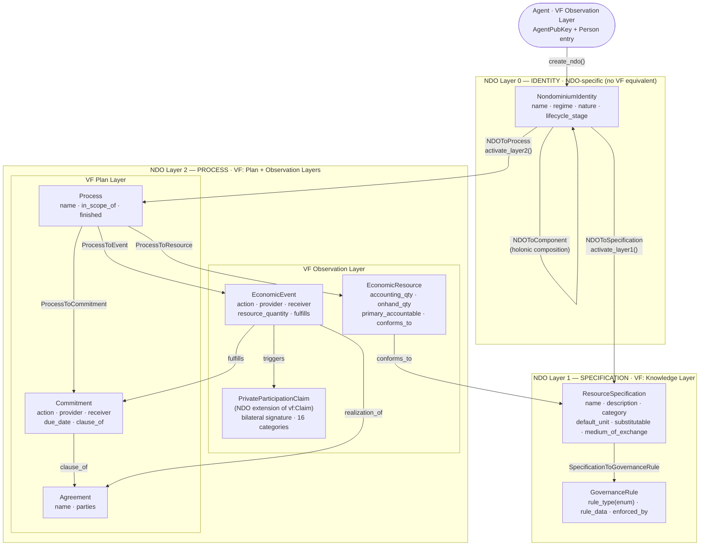
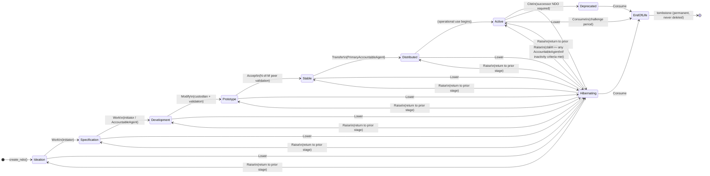
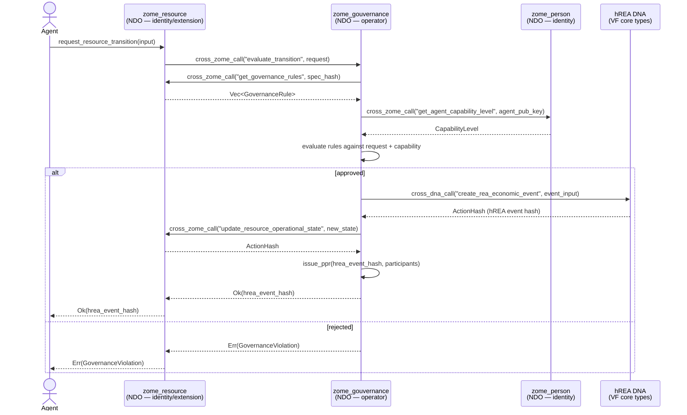

# Nondominium v1.0 — Architecture & Data Model Design

**Design session:** 2026-03-25
**Basis:** ValueFlows 1.0 ontology + [NDO Prima Materia](../requirements/ndo_prima_materia.md)
**Scope:** Three-zome Holochain DNA — data model, VF compliance, zome boundaries, coordinator signatures

---

## 1. Design Principles

### 1.0 Dual-DNA Architecture (Ground Rule)

Nondominium runs as a **dual-DNA hApp** — `hrea` DNA + `ndo` DNA, both registered as roles in `happ.yaml`. NDO does **not** re-implement VF entry types. All VF core types are owned by the `hrea` DNA. NDO coordinates governance, identity, and accountability on top of hREA via cross-DNA calls (`CallTargetCell::OtherRole("hrea")`).

| Lives in hREA DNA               | Lives in NDO DNA                       |
| ------------------------------- | -------------------------------------- |
| EconomicResource, EconomicEvent | NondominiumIdentity (Layer 0)          |
| Commitment, Agreement, Plan     | GovernanceRule, CapabilitySlot         |
| ResourceSpecification (VF core) | PrivateParticipationClaim (PPR)        |
| Process, Intent (post-v1.0)     | ValidationReceipt, ResourceValidation  |
| ReaAgent, ReaUnit               | EncryptedProfile, Person               |
| All VF 1.0 types                | All NDO governance/identity extensions |

NDO zomes interact with hREA via:

- `call(CallTargetCell::OtherRole("hrea"), "hrea", fn_name, input)` — from coordinator
- Storing returned `ActionHash` values in NDO-side link structures for traversal

**hREA dependency:** NDO v1.0 depends on hREA reaching a target compliance state. See `documentation/hREA/strategic-roadmap.md` (Phase 1 gap closure) and `documentation/hREA/valueflows-1.0-compliance.md` for the full audit. P0 gaps (`effortQuantity`, `vf:Claim`) must land in hREA before NDO's full work-event and reciprocity workflows are available.

### 1.1 VF 1.0 as the Floor, NDO Innovations as the Extension

ValueFlows 1.0 defines the economic ontology. VF core classes are provided by the hREA DNA. Every VF class either:

- **Delegated to hREA** — NDO calls hREA coordinator functions and stores returned hashes
- **Extended by NDO** — NDO adds a companion entry type with NDO-specific fields linked to the hREA hash
- **Is deferred** from v1.0 scope (Intent, vf:Claim as reciprocity — handled by hREA post-Phase 1)

NDO adds above the VF floor:
| NDO Extension | Relationship to VF |
|---|---|
| `NondominiumIdentity` (Layer 0) | Not in VF — resource identity anchor |
| `LifecycleStage` | Not in VF — resource maturity stages |
| `OperationalState` | Replaces VF's string `state` with typed enum |
| `PropertyRegime` | Not in VF — governance classification |
| `ResourceNature` | Not in VF — Digital/Physical/Hybrid |
| `GovernanceRule` | Not in VF — embedded Ostromian governance |
| `CapabilitySlot` surface | Not in VF — stigmergic attachment |
| `PrivateParticipationClaim` (PPR) | Extends vf:Claim with bilateral signatures |

### 1.2 Governance-as-Operator (preserve)

`zome_resource` = pure data model. No business logic.
`zome_gouvernance` = state transition operator. Reads resource state, evaluates rules, approves or rejects transitions, generates EconomicEvents.

This boundary is non-negotiable. It enables swappable governance without touching the data model.

### 1.3 Three-Layer NDO (new in v1.0)

Every resource begins as a Layer 0 identity anchor and grows in structural complexity as its social complexity demands:

```
Layer 2 — PROCESS (EconomicEvents, Commitments, PPRs)
     ↑ activated by NDOToProcess link
Layer 1 — SPECIFICATION (ResourceSpecification, GovernanceRules)
     ↑ activated by NDOToSpecification link
Layer 0 — IDENTITY (NondominiumIdentity — permanent, immutable name+regime+nature+lifecycle)
```

---

## 2. VF 1.0 Class Mapping

Legend: **hREA** = provided by hREA DNA (cross-DNA call from NDO) · **NDO** = native NDO entry type · **NDO+hREA** = NDO extends hREA with a companion entry

| VF Class                   | DNA      | Entry / Mechanism                                                           | NDO Zome           | v1.0 Status               | Notes                                                   |
| -------------------------- | -------- | --------------------------------------------------------------------------- | ------------------ | ------------------------- | ------------------------------------------------------- |
| `vf:Agent`                 | hREA     | `ReaAgent` via cross-DNA call                                               | `zome_person`      | Partial — individual only | NDO also stores `AgentPubKey` + `Person`                |
| `vf:EconomicResource`      | hREA     | `ReaEconomicResource` via cross-DNA                                         | `zome_resource`    | Full (via hREA)           | NDO stores returned hash; links to NondominiumIdentity  |
| `vf:ResourceSpecification` | NDO+hREA | `ReaResourceSpecification` (hREA) + `ResourceSpecification` extension (NDO) | `zome_resource`    | Full                      | NDO extension holds: category, tags, is_active, image   |
| `vf:EconomicEvent`         | hREA     | `ReaEconomicEvent` via cross-DNA                                            | `zome_gouvernance` | Full (via hREA)           | NDO calls hREA; stores hash for PPR linkage             |
| `vf:Commitment`            | hREA     | `ReaCommitment` via cross-DNA                                               | `zome_gouvernance` | Full (via hREA)           | NDO calls hREA; links PPR to hREA Commitment hash       |
| `vf:Agreement`             | hREA     | `ReaAgreement` via cross-DNA                                                | `zome_gouvernance` | Full (via hREA)           | NDO calls hREA post-Phase 1a (reciprocal fields)        |
| `vf:Claim`                 | NDO      | `Fulfillment` (Rust: `Claim` — ADR-004)                                     | `zome_gouvernance` | Partial                   | NDO fulfillment bridge; hREA `vf:Claim` = post-Phase 1c |
| `vf:Process`               | hREA     | `ReaProcess` via cross-DNA                                                  | `zome_gouvernance` | Basic (via hREA)          | NDO Layer 2 activation links to hREA Process hash       |
| `vf:Unit`                  | NDO      | `Unit`                                                                      | `zome_resource`    | Full                      | NDO-local for now; may delegate to hREA post-v1.0       |
| `vf:Intent`                | —        | —                                                                           | —                  | Post-v1.0                 | Valid VF 1.0 class — deferred; CapabilitySlot path      |
| NDO: `NondominiumIdentity` | NDO      | `NondominiumIdentity`                                                       | `zome_resource`    | New                       | Layer 0 permanent identity anchor                       |
| NDO: `GovernanceRule`      | NDO      | `GovernanceRule`                                                            | `zome_resource`    | Enhanced                  | `GovernanceRuleType` enum (was String)                  |
| NDO: PPR                   | NDO      | `PrivateParticipationClaim`                                                 | `zome_gouvernance` | Unchanged                 | Bilateral cryptographic accountability                  |

---

## 3. Complete Entry Type Specifications

### 3.1 zome_resource Integrity

#### Supporting Types (shared)

```rust
#[derive(Clone, PartialEq, Debug, Serialize, Deserialize)]
pub struct QuantityValue {
    pub has_numerical_value: f64,
    pub has_unit: ActionHash, // → Unit entry
}

#[derive(Clone, PartialEq, Debug, Serialize, Deserialize)]
pub enum PropertyRegime {
    Private,       // Full rights bundle; individual ownership
    Commons,       // Non-rivalrous; governance via licensing/attribution
    Collective,    // Cooperative/collective ownership
    Pool,          // Rivalrous shared; custody/scheduling/maintenance
    CommonPool,    // Rivalrous consumable; quota/depletion rules
    Nondominium,   // Uncapturable; contribution-based access; no alienation
}

#[derive(Clone, PartialEq, Debug, Serialize, Deserialize)]
pub enum ResourceNature {
    Digital,   // Software, data, design files, documents
    Physical,  // Material objects, equipment, spaces
    Hybrid,    // Digital twin of a physical resource
}

#[derive(Clone, PartialEq, Debug, Serialize, Deserialize, Default)]
pub enum LifecycleStage {
    #[default]
    Ideation,       // Idea registered, no form yet
    Specification,  // Form defined; design or spec exists
    Development,    // Active work; not yet distributable
    Prototype,      // Working prototype; validation in progress
    Stable,         // Peer-validated; ready for active use
    Distributed,    // Actively used across multiple agents/locations
    Active,         // In active operational use
    Hibernating,    // Temporarily inactive; may be reactivated
    Deprecated,     // Superseded; has declared successor NDO
    EndOfLife,      // Permanently concluded; tombstone only
}

#[derive(Clone, PartialEq, Debug, Serialize, Deserialize, Default)]
pub enum OperationalState {
    #[default]
    Available,         // No active process; ready for use
    PendingValidation, // Initial state; awaiting peer validation
    Reserved,          // Commitment accepted; process not yet started
    InTransit,         // Transport process active (Move/TransferCustody event open)
    InStorage,         // Storage service commitment active
    InMaintenance,     // Repair/modify process active
    InUse,             // Use event open; actively being used
}

#[derive(Clone, PartialEq, Debug, Serialize, Deserialize)]
pub enum GovernanceRuleType {
    AccessRequirement,    // Role/affiliation/capability required for access
    MaintenanceSchedule,  // Maintenance obligations and intervals
    RoleRequirement,      // Specific role required for a given VfAction
    UsageLimit,           // Quantity/time/frequency limits
    TransferCondition,    // Conditions for custody/ownership transfer
    IdentityVerification, // Requires Flowsta cross-app identity (Tier 2)
    EconomicAgreement,    // Unyt Smart Agreement binding (stub; Phase 3)
}

#[derive(Clone, Debug, Serialize, Deserialize)]
pub struct CapabilitySlotTag {
    pub slot_type: SlotType,
    pub attached_at: Timestamp,
    pub label: Option<String>,
}

#[derive(Clone, Debug, Serialize, Deserialize)]
pub enum SlotType {
    Documentation,
    IssueTracker,
    FabricationQueue,
    GovernanceDAO,
    VersionGraph,
    DigitalAsset,
    WeaveWAL,
    FlowstaIdentity,        // IsSamePersonEntry action hash (Flowsta cross-app identity)
    UnytAgreement(String),  // Unyt Alliance network seed
    CustomApp(String),      // Extensible
}
```

#### Entry Types

```rust
// vf:Unit — first-class unit of measure
#[hdk_entry_helper]
pub struct Unit {
    pub label: String,          // "kilogram", "hour", "each", "piece"
    pub symbol: Option<String>, // "kg", "h", "ea"
}

// NDO Layer 0 — permanent identity anchor for every Nondominium Object
#[hdk_entry_helper]
pub struct NondominiumIdentity {
    pub name: String,
    pub description: Option<String>,
    pub initiator: AgentPubKey,        // Post-v1.0: AgentContext (collective agents)
    pub property_regime: PropertyRegime,
    pub resource_nature: ResourceNature,
    pub lifecycle_stage: LifecycleStage, // Only field mutable after creation
    pub created_at: Timestamp,
}
// Immutability rules: initiator, property_regime, resource_nature, name, description = immutable.
// lifecycle_stage = only mutable field. Every update must reference a triggering EconomicEvent hash.
// Deletion: ALWAYS INVALID. NondominiumIdentity entries are permanent DHT records.

// vf:ResourceSpecification — Layer 1 form definition
#[hdk_entry_helper]
pub struct ResourceSpecification {
    pub name: String,
    pub description: String,
    pub category: String,
    pub image_url: Option<String>,
    pub tags: Vec<String>,
    pub is_active: bool,
    // VF 1.0 additions:
    pub default_unit_of_resource: Option<ActionHash>, // → Unit
    pub default_unit_of_effort: Option<ActionHash>,   // → Unit
    pub medium_of_exchange: bool,  // Is this a currency-like resource?
    pub substitutable: bool,       // Can instances be freely swapped?
}

// vf:EconomicResource — Layer 2 physical/digital instance
#[hdk_entry_helper]
pub struct EconomicResource {
    // VF 1.0 compliant fields:
    pub accounting_quantity: QuantityValue, // Committed/on-books quantity
    pub onhand_quantity: QuantityValue,     // Physically available quantity
    pub primary_accountable: AgentPubKey,  // Accountable agent (was: custodian)
    pub custodian: Option<AgentPubKey>,    // Physical custody (may differ from accountable)
    pub conforms_to: ActionHash,           // → ResourceSpecification (required, embedded)
    pub current_location: Option<String>,
    // NDO-specific:
    pub state: OperationalState,           // Was: ResourceState (now typed correctly)
    pub tracking_identifier: Option<String>, // Serial number, QR code, etc.
}

// Typed governance rule — replaces untyped String rule_type
#[hdk_entry_helper]
pub struct GovernanceRule {
    pub rule_type: GovernanceRuleType,  // Was: String — now typed enum
    pub rule_data: String,              // JSON-encoded parameters (typed per rule_type in Phase 2)
    pub enforced_by: Option<String>,    // Role name string (post-v1.0: GovernanceRoleRef)
}
```

#### Link Types (zome_resource)

```rust
#[hdk_link_types]
pub enum LinkTypes {
    // Existing discovery anchors (preserved):
    AllResourceSpecifications,
    AllEconomicResources,
    AllGovernanceRules,
    SpecificationToResource,
    CustodianToResource,           // → renamed to AccountableToResource in Phase 2
    SpecificationToGovernanceRule,
    AgentToOwnedSpecs,
    AgentToManagedResources,
    AgentToOwnedRules,
    SpecsByCategory,
    ResourcesByLocation,
    ResourcesByState,              // DEPRECATED → split below
    RulesByType,
    ResourceToValidation,
    ResourceSpecificationUpdates,
    EconomicResourceUpdates,
    GovernanceRuleUpdates,

    // NEW — NDO Three-Layer Links:
    AllNDOs,                   // Anchor → NondominiumIdentity
    NDOsByLifecycleStage,      // LifecyclePath → NondominiumIdentity
    NDOsByNature,              // NaturePath → NondominiumIdentity
    NDOsByRegime,              // RegimePath → NondominiumIdentity
    NDOLifecycleHistory,       // NondominiumIdentity → LifecycleEvent (audit trail)
    NDOToSpecification,        // NondominiumIdentity → ResourceSpecification (Layer 1 activation)
    NDOToProcess,              // NondominiumIdentity → Process (Layer 2 activation)
    NDOToComponent,            // NondominiumIdentity → NondominiumIdentity (holonic composition)

    // NEW — Capability Surface:
    CapabilitySlot,            // NondominiumIdentity → capability target (tag carries SlotType)

    // NEW — VF ResourceState split:
    ResourcesByOperationalState, // OperationalState → EconomicResource (replaces ResourcesByState)

    // NEW — Unit discovery:
    AllUnits,                  // Anchor → Unit
}
```

---

### 3.2 zome_gouvernance Integrity

#### New Entry Types

```rust
// vf:Process — Layer 2 anchor; records the economic activity around an NDO
#[hdk_entry_helper]
pub struct Process {
    pub name: String,
    pub note: Option<String>,
    pub in_scope_of: Option<AgentPubKey>, // Post-v1.0: AgentContext
    pub created_at: Timestamp,
    pub finished: bool,
}

// vf:Agreement — set of reciprocal commitments among agents
#[hdk_entry_helper]
pub struct Agreement {
    pub name: String,
    pub description: Option<String>,
    pub parties: Vec<AgentPubKey>,   // Post-v1.0: Vec<AgentContext>
    pub created_at: Timestamp,
    pub note: Option<String>,
}
```

#### Updated Entry Types

```rust
// vf:EconomicEvent — observed economic flow (updated for VF 1.0)
#[hdk_entry_helper]
pub struct EconomicEvent {
    pub action: VfAction,
    pub provider: AgentPubKey,
    pub receiver: AgentPubKey,
    pub resource_inventoried_as: ActionHash,
    pub affects: ActionHash,
    pub resource_quantity: QuantityValue,  // Was: f64 — now VF-compliant QuantityValue
    pub effort_quantity: Option<QuantityValue>, // NEW: labor/effort measure
    pub event_time: Timestamp,
    pub note: Option<String>,
    pub at_location: Option<String>,            // NEW: event location
    pub to_location: Option<String>,            // NEW: destination (transport)
    // VF 1.0 relations:
    pub fulfills: Option<ActionHash>,           // NEW: → Commitment (direct VF link)
    pub realization_of: Option<ActionHash>,     // NEW: → Agreement
    pub triggered_claim: Option<ActionHash>,    // NEW: → Fulfillment (audit bridge)
}

// vf:Commitment — planned economic flow (updated for VF 1.0)
#[hdk_entry_helper]
pub struct Commitment {
    pub action: VfAction,
    pub provider: AgentPubKey,
    pub receiver: AgentPubKey,
    pub resource_inventoried_as: Option<ActionHash>,
    pub resource_conforms_to: Option<ActionHash>,
    pub input_of: Option<ActionHash>,         // → Process
    pub due_date: Timestamp,
    pub note: Option<String>,
    pub committed_at: Timestamp,
    // VF 1.0 addition:
    pub clause_of: Option<ActionHash>,        // NEW: → Agreement
}

// NDO Fulfillment — fulfillment bridge (renamed from Claim for semantic clarity)
// Note: Keeps "Claim" as the Rust type name for backwards compatibility in this zome,
// but semantically acts as a VF fulfillment record.
#[hdk_entry_helper]
pub struct Claim {
    pub fulfills: ActionHash,     // → Commitment
    pub fulfilled_by: ActionHash, // → EconomicEvent
    pub claimed_at: Timestamp,
    pub note: Option<String>,
}

// Existing entries preserved:
// ValidationReceipt, ResourceValidation, PrivateParticipationClaim (PPR — unchanged)
```

#### Updated Link Types (zome_gouvernance)

```rust
#[hdk_link_types]
pub enum LinkTypes {
    // Existing (preserved):
    ValidatedItemToReceipt,
    ResourceToValidation,
    CommitmentToClaim,
    ResourceToEvent,
    AllValidationReceipts,
    AllEconomicEvents,
    AllCommitments,
    AllClaims,
    AllResourceValidations,
    AgentToPrivateParticipationClaims,
    EventToPrivateParticipationClaims,
    CommitmentToPrivateParticipationClaims,
    ResourceToPrivateParticipationClaims,

    // NEW:
    AllProcesses,              // Anchor → Process
    AllAgreements,             // Anchor → Agreement
    AgreementToCommitment,     // Agreement → Commitment (stipulates)
    AgreementToEvent,          // Agreement → EconomicEvent (realizes)
    ProcessToEvent,            // Process → EconomicEvent
    ProcessToCommitment,       // Process → Commitment
}
```

---

## 4. Three-Layer Activation Model



**Activation rules:**

- Layer 0 is created first; its `ActionHash` is the stable NDO identifier forever
- Layer 1 activates via `NDOToSpecification` link — retroactive activation is supported
- Layer 2 activates via `NDOToProcess` link — requires Layer 1 to be active first
- `EconomicResource` instances link through the Process, never directly to Layer 0
- An NDO can contain other NDOs via `NDOToComponent` (holonic composition)

### Lifecycle Transition State Machine



### Transition Authorization Table

| Transition                             | Authorized by                                                                    | VfAction trigger |
| -------------------------------------- | -------------------------------------------------------------------------------- | ---------------- |
| Ideation → Specification               | Initiator                                                                        | Work             |
| Specification → Development            | Initiator or any Accountable Agent                                               | Work             |
| Development → Prototype                | Custodian + governance validation                                                | Modify           |
| Prototype → Stable                     | N-of-M peer validation                                                           | Accept           |
| Stable / Active → Distributed          | Primary Accountable Agent                                                        | Transfer         |
| Any → Hibernating                      | Current custodian(s)                                                             | Lower            |
| Hibernating → [prior stage]            | Current custodian(s)                                                             | Raise            |
| Hibernating → Active (custodian claim) | Any AccountableAgent — inactivity criteria met (governance-configured threshold) | Raise            |
| Any → Deprecated                       | Custodian + successor NDO declared                                               | Cite             |
| Any → EndOfLife                        | Custodian + challenge period elapsed                                             | Consume          |

---

## 5. Zome Responsibility Boundaries

### hREA DNA — VF Core Layer

**Owns:** All VF 1.0 core types. Accessed via `CallTargetCell::OtherRole("hrea")`.

- Entry types: `ReaEconomicResource`, `ReaEconomicEvent`, `ReaCommitment`, `ReaAgreement`, `ReaProcess`, `ReaResourceSpecification`, `ReaAgent`, `ReaUnit`, + all other VF types
- NDO interacts with hREA only through its coordinator public functions — never reads hREA's source chain directly
- hREA Phase 1+2 roadmap: `documentation/hREA/strategic-roadmap.md`

### zome_resource — NDO Identity & Extension Layer

**Owns:** NDO-specific resource data. No business logic. Cross-DNA calls to hREA for VF operations.

- Entry types: `Unit`, `NondominiumIdentity`, `ResourceSpecification` (NDO extension — category, tags, image, is_active), `GovernanceRule`
- Responsibility: Layer 0 identity anchors, NDO resource spec extensions, governance rule storage, capability slots
- Cross-DNA calls: `create_rea_resource_specification`, `create_rea_economic_resource` (stores returned hashes)
- Does NOT: Own VF core types, evaluate governance rules, issue PPRs, approve state transitions

### zome_gouvernance — Operator & Accountability

**Owns:** NDO governance logic. NDO-specific accountability types. Orchestrates hREA economic events.

- Entry types: `Fulfillment` (Rust: `Claim` — ADR-004), `ValidationReceipt`, `ResourceValidation`, `PrivateParticipationClaim`
- Responsibility: Receive transition requests. Evaluate GovernanceRules. Call hREA to create EconomicEvents, Commitments, Agreements. Issue PPRs after hREA call succeeds.
- Cross-DNA calls: `create_rea_economic_event`, `create_rea_commitment`, `create_rea_agreement`, `create_rea_process`
- Does NOT: Create hREA entries without governance evaluation; own VF core types

### zome_person — Identity & Privacy

**Owns:** Agent identity, capability grants, roles, devices.

- No changes in v1.0.
- Post-v1.0: Add `AgentContext` union type, `AffiliationRecord`.

### Cross-DNA + Cross-Zome Call Pattern (governance-as-operator)



---

## 6. Coordinator Function Signatures (New & Updated)

### zome_resource — New Functions

```rust
// Unit management
fn create_unit(input: CreateUnitInput) -> ExternResult<ActionHash>
fn get_unit(unit_hash: ActionHash) -> ExternResult<Option<Record>>
fn get_all_units() -> ExternResult<Vec<UnitRecord>>

// NDO Layer 0 management
fn create_ndo(input: CreateNDOInput) -> ExternResult<ActionHash>
fn get_ndo(ndo_hash: ActionHash) -> ExternResult<Option<Record>>
fn get_all_ndos() -> ExternResult<Vec<NDORecord>>
fn get_ndos_by_lifecycle_stage(stage: LifecycleStage) -> ExternResult<Vec<ActionHash>>
fn get_ndos_by_nature(nature: ResourceNature) -> ExternResult<Vec<ActionHash>>
fn get_ndos_by_regime(regime: PropertyRegime) -> ExternResult<Vec<ActionHash>>
fn update_ndo_lifecycle(input: UpdateNDOLifecycleInput) -> ExternResult<ActionHash>
// UpdateNDOLifecycleInput { original_hash, previous_hash, new_stage, transition_event_hash }

// Layer activation
fn activate_layer1(ndo_hash: ActionHash, spec_hash: ActionHash) -> ExternResult<()>
fn activate_layer2(ndo_hash: ActionHash, process_hash: ActionHash) -> ExternResult<()>
fn get_ndo_layer1(ndo_hash: ActionHash) -> ExternResult<Option<Record>> // latest ResourceSpec
fn get_ndo_layer2(ndo_hash: ActionHash) -> ExternResult<Option<Record>> // active Process

// Capability slots
fn add_capability_slot(input: AddCapabilitySlotInput) -> ExternResult<()>
// AddCapabilitySlotInput { ndo_hash, target_hash, slot_type, label }
fn get_capability_slots(ndo_hash: ActionHash) -> ExternResult<Vec<CapabilitySlotRecord>>
fn get_slots_by_type(ndo_hash: ActionHash, slot_type: SlotType) -> ExternResult<Vec<ActionHash>>
```

### zome_resource — Updated Signatures

```rust
// ResourceSpecification now includes VF fields
fn create_resource_specification(input: CreateResourceSpecInput) -> ExternResult<ActionHash>
// CreateResourceSpecInput adds: default_unit_of_resource, default_unit_of_effort,
//   medium_of_exchange, substitutable

// EconomicResource now uses QuantityValue, primary_accountable, conforms_to
fn create_economic_resource(input: CreateEconomicResourceInput) -> ExternResult<ActionHash>
// CreateEconomicResourceInput: accounting_quantity: QuantityValue, onhand_quantity: QuantityValue,
//   primary_accountable: AgentPubKey, custodian: Option<AgentPubKey>,
//   conforms_to: ActionHash, current_location: Option<String>

// State update now uses OperationalState
fn update_economic_resource_operational_state(
    input: UpdateOperationalStateInput
) -> ExternResult<ActionHash>
// UpdateOperationalStateInput { original_hash, previous_hash, new_state: OperationalState,
//   triggering_event_hash: ActionHash }
```

### zome_gouvernance — New Functions

```rust
// Process management
fn create_process(input: CreateProcessInput) -> ExternResult<ActionHash>
fn get_process(process_hash: ActionHash) -> ExternResult<Option<Record>>
fn get_all_processes() -> ExternResult<Vec<ProcessRecord>>
fn conclude_process(process_hash: ActionHash, terminal_event_hash: ActionHash) -> ExternResult<()>

// Agreement management
fn create_agreement(input: CreateAgreementInput) -> ExternResult<ActionHash>
fn get_agreement(agreement_hash: ActionHash) -> ExternResult<Option<Record>>
fn get_all_agreements() -> ExternResult<Vec<AgreementRecord>>
fn get_agreement_commitments(agreement_hash: ActionHash) -> ExternResult<Vec<ActionHash>>
fn get_agreement_events(agreement_hash: ActionHash) -> ExternResult<Vec<ActionHash>>
```

---

## 7. VfAction — Preserved + Context

The VfAction enum is **unchanged** in v1.0. NDO-specific extensions (InitialTransfer, AccessForUse, TransferCustody) are preserved. The semantic methods (`requires_existing_resource`, `creates_resource`, `modifies_quantity`, `changes_custody`) are preserved.

Post-v1.0 addition: `corrects → EconomicEvent` (correction events) — not yet in scope.

---

## 8. PPR System — Preserved Unchanged

The `PrivateParticipationClaim` (16-category bilateral cryptographic participation receipts) is unchanged in v1.0. It is not a VF class — it is an NDO innovation that extends VF's Claim concept with bilateral accountability.

The PPR `PerformanceMetrics` struct (timeliness, quality, reliability, communication weights) is unchanged.

`ReputationSummary` computation is unchanged.

---

## 9. Explicit Out-of-Scope for v1.0

| Feature                                                             | Reason                                                                                            | Phase     |
| ------------------------------------------------------------------- | ------------------------------------------------------------------------------------------------- | --------- |
| `AgentContext` union (collective, project, network, bot)            | Requires governance refactoring across all 3 zomes                                                | Post-v1.0 |
| `AffiliationRecord` + `AffiliationState` derivation                 | Depends on AgentContext                                                                           | Post-v1.0 |
| Flowsta Phase 2/3 (governance enforcement of identity verification) | Stub in GovernanceRuleType; UI/governance integration separate                                    | Post-v1.0 |
| Unyt Smart Agreement full integration                               | Stub in GovernanceRuleType + SlotType; RAVE proof validation separate                             | Post-v1.0 |
| `vf:Intent`                                                         | Valid VF 1.0 class — deferred post-v1.0; extension path via CapabilitySlot surface                | Post-v1.0 |
| `vf:Claim` (reciprocity, settlement)                                | NDO Fulfillment entry (Rust: `Claim`) has fulfillment semantics; VF reciprocity Claim = post-v1.0 | Post-v1.0 |
| `ProcessSpecification`                                              | Not yet needed                                                                                    | Post-v1.0 |
| Many-to-many flows (multi-custodian)                                | Architecture requires AgentContext                                                                | Post-v1.0 |
| Versioning DAG / digital resource integrity                         | Separate specification                                                                            | Post-v1.0 |
| Network and federation governance layers                            | Requires holonic governance design                                                                | Post-v1.0 |
| Non-binary decision mechanisms (conviction voting, quadratic)       | Governance extension                                                                              | Post-v1.0 |
| ZKP proofs for affiliation privacy                                  | Cryptographic infrastructure                                                                      | Post-v1.0 |
| Dispute resolution mechanism                                        | Beyond PPR category placeholder                                                                   | Post-v1.0 |
| Frontend updates                                                    | Separate work                                                                                     | Separate  |
| GovernanceRule typed rule_data schemas (per GovernanceRuleType)     | Phase 2 governance work                                                                           | Post-v1.0 |

---

## 10. Architecture Decision Records

### ADR-001: QuantityValue as mandatory (not Option)

- **Status:** Accepted
- **Decision:** `accounting_quantity` and `onhand_quantity` are required fields on `EconomicResource`, not Optional. Unit entry must exist before EconomicResource creation.
- **Rationale:** VF compliance. Optional quantity is meaningless for resource tracking. If quantity is unknown, use 0.0 with an appropriate unit.
- **Consequence:** All EconomicResource creation call sites must be updated. Test fixtures need Unit entries created first.

### ADR-002: conforms_to as embedded ActionHash (not link-only)

- **Status:** Accepted
- **Decision:** `EconomicResource.conforms_to: ActionHash` is embedded in the entry, not expressed only via `SpecificationToResource` link.
- **Rationale:** VF compliance. Bi-directional: embed on resource (resource knows its spec) + keep link from spec (spec knows its instances). Discovery works both ways.
- **Consequence:** `conforms_to` is required on creation. Cannot have an EconomicResource without a ResourceSpecification.

### ADR-003: GovernanceRule.rule_data remains String in v1.0

- **Status:** Accepted
- **Decision:** `GovernanceRule.rule_type` changes to `GovernanceRuleType` enum, but `rule_data: String` (JSON) remains untyped in v1.0.
- **Rationale:** Defining typed schemas for each `GovernanceRuleType` variant (AccessRequirement params, MaintenanceSchedule params, etc.) is substantial design work beyond v1.0 scope. The enum gives us type-safety on the category without requiring complete schema for each.
- **Consequence:** Runtime validation of rule_data remains the responsibility of the coordinator. Phase 2 will add typed rule_data per variant.

### ADR-004: NDO's Claim entry retains name but repurposed as Fulfillment

- **Status:** Accepted
- **Decision:** The current `Claim` entry (fulfills → Commitment, fulfilled_by → EconomicEvent) is semantically a VF "fulfillment bridge." It is NOT VF's `vf:Claim` (reciprocity). Rust struct keeps name `Claim`; design docs call it "Fulfillment."
- **Rationale:** Renaming the Rust type in v1.0 would be a larger refactor than the value it provides. VF compliance is achieved via `EconomicEvent.fulfills → Commitment` (direct field); the bridge entry becomes redundant but is kept for audit trail.
- **Consequence:** Post-v1.0, the Claim entry may be renamed to Fulfillment and VF's reciprocity Claim added as a new entry type.

### ADR-005: Process entry type lives in zome_gouvernance

- **Status:** Accepted
- **Decision:** `Process` entry type is defined in `zome_gouvernance` integrity, not `zome_resource`.
- **Rationale:** Processes are governed economic activities. Layer 2 activation link (`NDOToProcess`) in `zome_resource` LinkTypes points to a `Process` entry hash in `zome_gouvernance` — cross-zome ActionHash references are valid in Holochain.
- **Consequence:** The NDO Layer 2 activation is a cross-zome link. `get_ndo_layer2(ndo_hash)` in the resource coordinator must make a cross-zome call to retrieve the Process record.

### ADR-006: VF core types delegated to hREA DNA, not reimplemented in NDO

- **Status:** Accepted
- **Decision:** NDO does not re-implement VF entry types (EconomicResource, EconomicEvent, Commitment, Agreement, Process, ResourceSpecification). All VF core types are owned by the `hrea` DNA (registered as `OtherRole("hrea")` in `happ.yaml`). NDO coordinator zomes call hREA functions and store returned `ActionHash` values.
- **Rationale:** Avoids duplication and divergence. hREA is the canonical VF 1.0 implementation. NDO's value is in governance, identity, and accountability layers — not in reimplementing economic primitives. The `vendor/hrea` submodule is already a live runtime DNA in the bundle.
- **Consequence:** NDO v1.0 capabilities are bounded by hREA's current compliance level (~65% VF 1.0). P0 gaps in hREA (`effortQuantity`, `vf:Claim`) must be resolved before NDO's work-event recording and claim-based reciprocity workflows are available. See `documentation/hREA/strategic-roadmap.md` for the Phase 1 gap closure plan.

---

## 11. Migration Notes (Current → v1.0)

| Current                                   | v1.0                                                                                      | Migration                                                                                                                             |
| ----------------------------------------- | ----------------------------------------------------------------------------------------- | ------------------------------------------------------------------------------------------------------------------------------------- |
| `EconomicResource.quantity: f64`          | `accounting_quantity: QuantityValue` + `onhand_quantity: QuantityValue`                   | All creation call sites; test fixtures need Unit entries                                                                              |
| `EconomicResource.unit: String`           | Removed (unit is in QuantityValue)                                                        | See above                                                                                                                             |
| `EconomicResource.custodian: AgentPubKey` | `primary_accountable: AgentPubKey` + `custodian: Option<AgentPubKey>`                     | Rename + add physical custody field                                                                                                   |
| `ResourceState` enum                      | `OperationalState` enum (on EconomicResource) + `LifecycleStage` (on NondominiumIdentity) | State mapping: Active→Available, PendingValidation→PendingValidation, Maintenance→InMaintenance, Retired→EndOfLife, Reserved→Reserved |
| `GovernanceRule.rule_type: String`        | `GovernanceRule.rule_type: GovernanceRuleType`                                            | All coordinator match arms                                                                                                            |
| `EconomicEvent.resource_quantity: f64`    | `resource_quantity: QuantityValue`                                                        | Same as EconomicResource quantity migration                                                                                           |
| No Agreement                              | `Agreement` entry in zome_gouvernance                                                     | New entry type, new coordinator functions                                                                                             |
| No NondominiumIdentity                    | `NondominiumIdentity` entry in zome_resource                                              | New entry type; no existing entries to migrate                                                                                        |
| No Process entry                          | `Process` entry in zome_gouvernance                                                       | New entry type for Layer 2 activation                                                                                                 |
| No Unit entry                             | `Unit` entry in zome_resource                                                             | New entry type; must be created before EconomicResource                                                                               |
