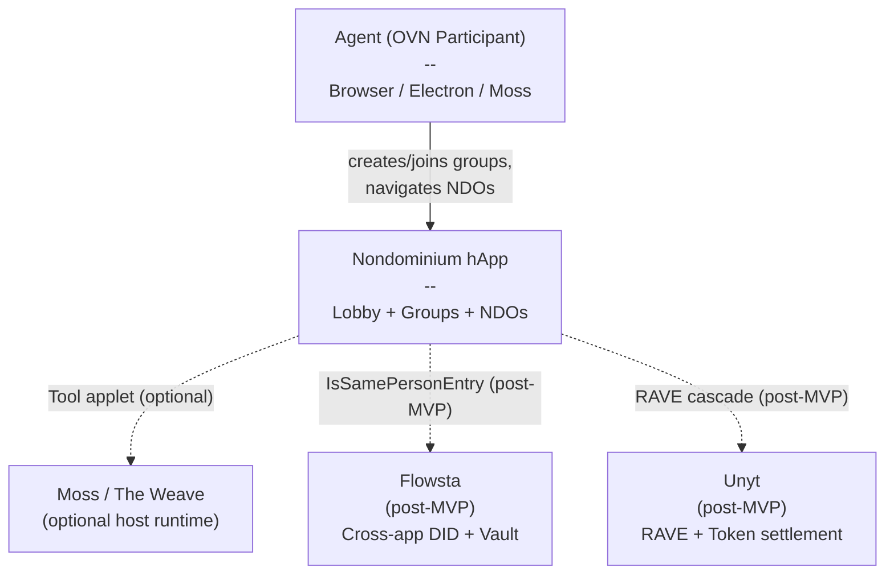
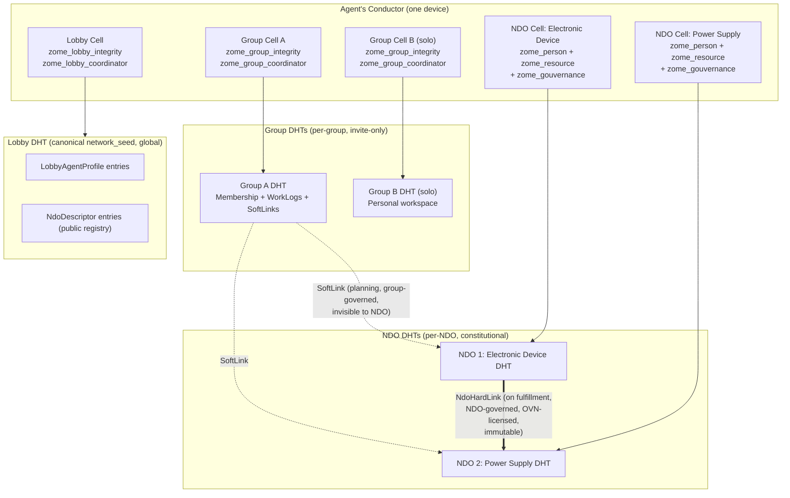
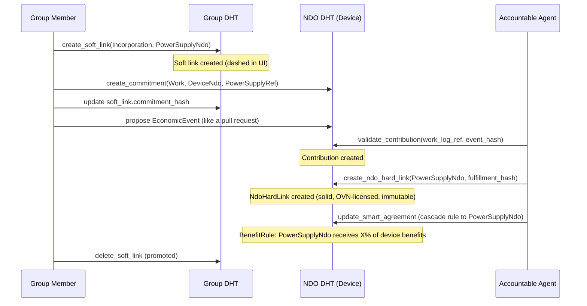
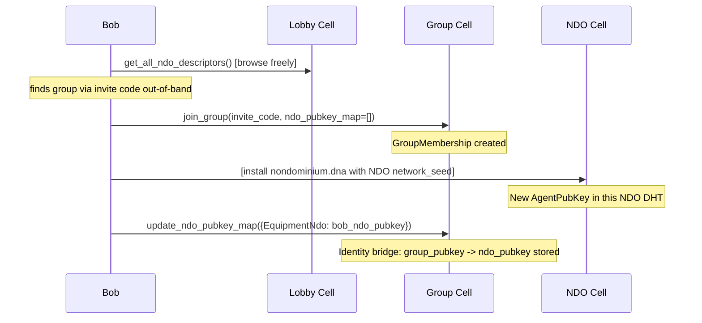

# Nondominium Lobby DNA — Architecture Design

**Design session:** 2026-04-14
**Basis:** Requirements discovery session + Moss/Weave ecosystem research
**Scope:** Lobby DNA + Group DNA (new) + NDO DNA extensions (zome_gouvernance)
**Requirements:** `documentation/requirements/post-mvp/lobby-dna.md`

---

## Table of Contents

1. [System context (C4 L1)](#1-system-context-c4-l1)
2. [Container architecture (C4 L2)](#2-container-architecture-c4-l2)
3. [hApp DNA manifest](#3-happ-dna-manifest)
4. [Lobby DNA schema](#4-lobby-dna-schema)
5. [Group DNA schema](#5-group-dna-schema)
6. [NDO DNA extensions](#6-ndo-dna-extensions)
7. [Key pipelines](#7-key-pipelines)
8. [UI component architecture](#8-ui-component-architecture)
9. [Moss integration contract](#9-moss-integration-contract)
10. [Architecture decision records](#10-architecture-decision-records)
11. [Post-MVP extension points](#11-post-mvp-extension-points)

---

## 1. System Context (C4 L1)



**Design principle:** Nondominium runs fully standalone. Moss, Flowsta, and Unyt are optional
integration layers that can be adopted independently (pay-as-you-grow). The same DNA code
powers both standalone and Moss-hosted modes.

---

## 2. Container Architecture (C4 L2)

### Three-layer DHT model



### Trust boundaries

| Layer | Trust model | Data stored | Anti-spam |
|-------|-------------|-------------|-----------|
| Lobby DHT | Zero-trust, public | Agent handles, NDO metadata stubs | Valid DnaHash required |
| Group DHT | Invite-trust | Membership, work logs, soft links, rules | DHT cost + invite gate |
| NDO DHT | Constitution-trust | Resources, events, contributions, hard links, smart agreements | Accountable Agent gate |

---

## 3. hApp DNA Manifest

### Standalone deployment

```yaml
# happ.yaml
manifest_version: '1'
name: nondominium
description: Nondominium OVN resource sharing network

roles:
  - name: lobby
    dna:
      path: ./lobby/lobby.dna
      modifiers:
        network_seed: "nondominium-lobby-v1"  # canonical, hardcoded
    # No cloning: one global Lobby DHT

  - name: group
    dna:
      path: ./group/group.dna
    cloning_limit: 255
    # Cloned per group: network_seed = invite code (or random on create)

  - name: nondominium
    dna:
      path: ./nondominium/nondominium.dna
    cloning_limit: 1024
    # Cloned per NDO: network_seed random on create, shared via NdoDescriptor
```

### New workspace structure

```
dnas/
  lobby/
    workdir/dna.yaml
    zomes/
      integrity/zome_lobby_integrity/src/lib.rs   # NEW
      coordinator/zome_lobby_coordinator/src/lib.rs  # NEW
  group/
    workdir/dna.yaml
    zomes/
      integrity/zome_group_integrity/src/lib.rs   # NEW
      coordinator/zome_group_coordinator/src/lib.rs  # NEW
  nondominium/                                     # EXISTING, extended
    zomes/
      coordinator/zome_gouvernance/src/hard_link.rs   # NEW file
      coordinator/zome_gouvernance/src/contribution.rs  # NEW file
      coordinator/zome_gouvernance/src/smart_agreement.rs  # NEW file
      integrity/zome_gouvernance/src/lib.rs        # +NdoHardLink, +Contribution, +SmartAgreement
```

---

## 4. Lobby DNA Schema

### 4.1 Entry types

```rust
/// Public profile for an agent in the Lobby DHT. Permissionless.
#[hdk_entry_helper]
pub struct LobbyAgentProfile {
    pub handle: String,                    // max 64 chars, non-empty
    pub avatar_url: Option<String>,        // must be https:// if present
    pub bio: Option<String>,               // max 500 chars
    pub lobby_pubkey: AgentPubKey,         // must equal action.author
    pub created_at: Timestamp,
}

/// Public descriptor for a registered NDO. Mirrors NondominiumIdentity key fields.
/// Registered by the NDO initiator; lifecycle_stage is the only mutable field.
/// Cannot be deleted (mirrors permanence of NondominiumIdentity).
#[hdk_entry_helper]
pub struct NdoDescriptor {
    pub ndo_name: String,
    pub ndo_dna_hash: DnaHash,
    pub network_seed: String,
    pub ndo_identity_hash: ActionHash,     // Layer 0 anchor inside the NDO DHT
    pub lifecycle_stage: LifecycleStage,
    pub property_regime: PropertyRegime,
    pub resource_nature: ResourceNature,
    pub description: Option<String>,
    pub registered_by: AgentPubKey,        // must equal action.author
    pub registered_at: Timestamp,
}
```

### 4.2 Link types

```rust
#[hdk_link_types]
pub enum LinkTypes {
    AllLobbyAgents,           // Path("lobby.agents") -> LobbyAgentProfile
    AgentProfileUpdates,      // LobbyAgentProfile -> LobbyAgentProfile (versioning)
    AllNdoDescriptors,        // Path("lobby.ndos") -> NdoDescriptor
    NdoDescriptorByLifecycle, // Path("lobby.ndo.lifecycle.{Stage}") -> NdoDescriptor
    NdoDescriptorByNature,    // Path("lobby.ndo.nature.{Nature}") -> NdoDescriptor
    NdoDescriptorByRegime,    // Path("lobby.ndo.regime.{Regime}") -> NdoDescriptor
    AgentToRegisteredNdos,    // registered_by pubkey -> NdoDescriptor
    NdoDescriptorUpdates,     // NdoDescriptor -> NdoDescriptor (lifecycle chain)
}
```

### 4.3 Coordinator API

```rust
// Agent profiles
pub fn upsert_lobby_agent_profile(input: LobbyAgentProfileInput) -> ExternResult<ActionHash>;
pub fn get_lobby_agent_profile(agent: AgentPubKey) -> ExternResult<Option<LobbyAgentProfile>>;
pub fn get_all_lobby_agents(_: ()) -> ExternResult<Vec<LobbyAgentProfileRecord>>;

// NDO descriptor registry
pub fn register_ndo_descriptor(input: RegisterNdoInput) -> ExternResult<ActionHash>;
pub fn update_ndo_descriptor_lifecycle(input: UpdateNdoLifecycleInput) -> ExternResult<ActionHash>;
pub fn get_all_ndo_descriptors(_: ()) -> ExternResult<Vec<NdoDescriptorRecord>>;
pub fn get_ndo_descriptors_by_lifecycle(stage: LifecycleStage) -> ExternResult<Vec<NdoDescriptorRecord>>;
pub fn get_ndo_descriptors_by_nature(nature: ResourceNature) -> ExternResult<Vec<NdoDescriptorRecord>>;
pub fn get_ndo_descriptors_by_regime(regime: PropertyRegime) -> ExternResult<Vec<NdoDescriptorRecord>>;
pub fn get_my_registered_ndos(_: ()) -> ExternResult<Vec<NdoDescriptorRecord>>;
```

### 4.4 Validation rules

```
create LobbyAgentProfile:
  handle non-empty, max 64 chars
  lobby_pubkey == action.author
  avatar_url starts with "https://" if present

update LobbyAgentProfile:
  author == original.lobby_pubkey (self-only)
  lobby_pubkey field immutable

delete LobbyAgentProfile: INVALID (permanent anchor)

create NdoDescriptor:
  registered_by == action.author
  ndo_name non-empty
  lifecycle_stage not Deprecated or EndOfLife at registration
  successor_ndo_hash and hibernation_origin must be None

update NdoDescriptor:
  author == original.registered_by
  only lifecycle_stage may change
  follows NondominiumIdentity state machine rules

delete NdoDescriptor: INVALID (mirrors Layer 0 permanence)
```

---

## 5. Group DNA Schema

### 5.1 Entry types

```rust
/// Immutable group descriptor. Created by the progenitor on first launch.
#[hdk_entry_helper]
pub struct GroupDescriptor {
    pub name: String,                      // max 128 chars
    pub description: Option<String>,
    pub progenitor: AgentPubKey,           // must equal action.author
    pub is_solo: bool,                     // true = personal group-of-one
    pub created_at: Timestamp,
}
// Immutable after creation.

/// Per-agent membership. Stores the cross-DHT pubkey map (Moss pattern).
#[hdk_entry_helper]
pub struct GroupMembership {
    pub agent_pubkey: AgentPubKey,         // must equal action.author
    pub invited_by: Option<AgentPubKey>,
    pub ndo_pubkey_map: Vec<NdoPubkeyEntry>, // cross-DHT identity bridge (MVP)
    pub joined_at: Timestamp,
}

/// Maps group pubkey to NDO-DHT pubkey for one NDO. Stored inside GroupMembership.
#[derive(Clone, PartialEq, Serialize, Deserialize)]
pub struct NdoPubkeyEntry {
    pub ndo_dna_hash: DnaHash,
    pub ndo_pubkey: AgentPubKey,
    pub joined_ndo_at: Timestamp,
}

/// Informal work record. Lives in Group DHT only. Invisible to target NDO.
#[hdk_entry_helper]
pub struct WorkLog {
    pub author: AgentPubKey,               // must equal action.author
    pub ndo_dna_hash: DnaHash,
    pub ndo_identity_hash: ActionHash,
    pub process_context: Option<String>,   // e.g. "maintenance", "development"
    pub description: String,               // max 2000 chars
    pub effort_hours: Option<f64>,         // 0.0 to 10000.0
    pub attachments: Vec<String>,
    pub logged_at: Timestamp,
}

/// Soft link: group-level planning relationship to an NDO. Permissionless.
/// Invisible to target NDO. Subject to group governance only.
#[hdk_entry_helper]
pub struct SoftLink {
    pub from_ndo_dna_hash: Option<DnaHash>,
    pub from_ndo_identity_hash: Option<ActionHash>,
    pub to_ndo_dna_hash: DnaHash,
    pub to_ndo_identity_hash: ActionHash,
    pub link_purpose: SoftLinkPurpose,
    pub commitment_hash: Option<ActionHash>, // optional NDO DHT Commitment reference
    pub created_by: AgentPubKey,             // must equal action.author
    pub created_at: Timestamp,
    pub note: Option<String>,
}

#[derive(Clone, PartialEq, Debug, Serialize, Deserialize)]
pub enum SoftLinkPurpose {
    Incorporation,  // planning to incorporate to_ndo structurally into from_ndo
    Use,            // using to_ndo as a tool or equipment
    Monitoring,     // observing to_ndo lifecycle only
}

/// Group governance rule (flat string MVP; typed enum post-MVP).
#[hdk_entry_helper]
pub struct GroupGovernanceRule {
    pub rule_name: String,
    pub rule_data: String,
    pub created_by: AgentPubKey,           // must be progenitor (MVP)
    pub created_at: Timestamp,
}
```

### 5.2 Link types

```rust
#[hdk_link_types]
pub enum LinkTypes {
    AllMembers,          // Path("group.members") -> GroupMembership
    MembershipUpdates,   // GroupMembership -> GroupMembership (ndo_pubkey_map updates)
    AgentToMembership,   // AgentPubKey -> GroupMembership (fast self-lookup)
    AllWorkLogs,         // Path("group.worklogs") -> WorkLog
    AgentToWorkLogs,     // AgentPubKey -> WorkLog
    NdoToWorkLogs,       // ndo_identity_hash -> WorkLog
    AllSoftLinks,        // Path("group.softlinks") -> SoftLink
    SoftLinkToNdo,       // ndo_identity_hash -> SoftLink (by target NDO)
    AllGovernanceRules,  // Path("group.rules") -> GroupGovernanceRule
    GovernanceRuleUpdates, // GroupGovernanceRule -> GroupGovernanceRule
}
```

### 5.3 Coordinator API

```rust
// Initialization
pub fn init_group(input: InitGroupInput) -> ExternResult<ActionHash>;
pub fn get_group_descriptor(_: ()) -> ExternResult<Option<GroupDescriptor>>;

// Membership
pub fn join_group(input: JoinGroupInput) -> ExternResult<ActionHash>;
pub fn update_ndo_pubkey_map(input: UpdateNdoPubkeyMapInput) -> ExternResult<ActionHash>;
pub fn get_all_members(_: ()) -> ExternResult<Vec<GroupMembershipRecord>>;
pub fn get_member_ndo_pubkey(input: GetMemberNdoPubkeyInput) -> ExternResult<Option<AgentPubKey>>;

// Work logs
pub fn log_work(input: LogWorkInput) -> ExternResult<ActionHash>;
pub fn get_work_logs(ndo_filter: Option<DnaHash>) -> ExternResult<Vec<WorkLogRecord>>;
pub fn get_my_work_logs(_: ()) -> ExternResult<Vec<WorkLogRecord>>;

// Soft links
pub fn create_soft_link(input: CreateSoftLinkInput) -> ExternResult<ActionHash>;
pub fn delete_soft_link(soft_link_hash: ActionHash) -> ExternResult<()>;
pub fn get_all_soft_links(_: ()) -> ExternResult<Vec<SoftLinkRecord>>;
pub fn get_soft_links_to_ndo(ndo_identity_hash: ActionHash) -> ExternResult<Vec<SoftLinkRecord>>;

// Governance
pub fn add_governance_rule(rule: GroupGovernanceRule) -> ExternResult<ActionHash>;
pub fn get_governance_rules(_: ()) -> ExternResult<Vec<GroupGovernanceRuleRecord>>;
```

### 5.4 Validation rules

```
create GroupDescriptor:
  progenitor == action.author
  name non-empty, max 128 chars
update GroupDescriptor: INVALID (immutable)

create GroupMembership:
  agent_pubkey == action.author

create WorkLog:
  author == action.author
  description non-empty, max 2000 chars
  effort_hours if present in [0.0, 10000.0]

create SoftLink:
  created_by == action.author
  to_ndo_dna_hash non-empty
  if Incorporation: from_ndo_* fields must both be Some

delete SoftLink:
  author == original.created_by OR author == progenitor

create GroupGovernanceRule:
  MVP: author must be progenitor
  rule_name non-empty
```

---

## 6. NDO DNA Extensions

New entry types and coordinator functions added to the **existing** `zome_gouvernance`. All existing entry types are unchanged.

### 6.1 New entry types

```rust
/// Permanent, validated structural link between two NDOs.
/// Created only on EconomicEvent Fulfillment. Immutable and undeletable.
/// Intrinsic to the NDO DHT (OVN license requirement).
#[hdk_entry_helper]
pub struct NdoHardLink {
    pub from_ndo_identity_hash: ActionHash, // Layer 0 hash of this (parent) NDO
    pub to_ndo_dna_hash: DnaHash,
    pub to_ndo_identity_hash: ActionHash,   // Layer 0 hash of the component NDO
    pub link_type: NdoLinkType,
    pub fulfillment_hash: ActionHash,       // EconomicEvent backing this link
    pub created_by: AgentPubKey,            // must be AccountableAgent
    pub created_at: Timestamp,
}

#[derive(Clone, PartialEq, Debug, Serialize, Deserialize)]
pub enum NdoLinkType {
    Component,    // target is a structural component of source
    DerivedFrom,  // source was derived/forked from target
    Supersedes,   // source formally replaces target in the network
}

/// Peer-validated work contribution. Created after AccountableAgent acceptance.
#[hdk_entry_helper]
pub struct Contribution {
    pub contributor: AgentPubKey,
    pub work_log_group_dna_hash: Option<DnaHash>, // off-chain reference (informational)
    pub work_log_action_hash: Option<ActionHash>,
    pub ndo_identity_hash: ActionHash,
    pub process_context: Option<String>,
    pub description: String,
    pub effort_hours: Option<f64>,
    pub validated_by: Vec<AgentPubKey>,    // at least one AccountableAgent required
    pub fulfillment_hash: Option<ActionHash>,
    pub contributed_at: Timestamp,
    pub validated_at: Timestamp,
}

/// Benefit redistribution agreement. AccountableAgent-controlled. Versioned.
#[hdk_entry_helper]
pub struct SmartAgreement {
    pub ndo_identity_hash: ActionHash,
    pub version: u32,
    pub rules: Vec<BenefitRule>,
    pub accountable_agents: Vec<AgentPubKey>,
    pub created_by: AgentPubKey,
    pub created_at: Timestamp,
}

#[derive(Clone, PartialEq, Serialize, Deserialize)]
pub struct BenefitRule {
    pub beneficiary: BeneficiaryRef,
    pub share_percent: f64,                // 0.0 to 100.0
    pub benefit_type: BenefitType,
    pub conditions: Option<String>,
}

#[derive(Clone, PartialEq, Serialize, Deserialize)]
pub enum BeneficiaryRef {
    Agent(AgentPubKey),
    NdoComponent { ndo_dna_hash: DnaHash, ndo_identity_hash: ActionHash },
}

#[derive(Clone, PartialEq, Serialize, Deserialize)]
pub enum BenefitType {
    Monetary,                 // Unyt token distribution (post-MVP)
    GovernanceWeight,         // voting weight in NDO governance
    AccessRight(String),      // e.g. "use_equipment", "read_design"
}
```

### 6.2 New link types (additions to existing enum)

```rust
// Add to existing zome_gouvernance_integrity LinkTypes:
NdoToHardLinks,         // from_ndo_identity_hash -> NdoHardLink
HardLinkByType,         // Path("ndo.hardlink.{NdoLinkType}") -> NdoHardLink
NdoToContributions,     // ndo_identity_hash -> Contribution
AgentToContributions,   // AgentPubKey -> Contribution
ContributionToEvent,    // Contribution -> EconomicEvent
NdoToSmartAgreement,    // ndo_identity_hash -> SmartAgreement (latest)
SmartAgreementUpdates,  // SmartAgreement -> SmartAgreement (version chain)
```

### 6.3 New coordinator functions

```rust
// hard_link.rs
pub fn create_ndo_hard_link(input: CreateNdoHardLinkInput) -> ExternResult<ActionHash>;
pub fn get_ndo_hard_links(_: ()) -> ExternResult<Vec<NdoHardLinkRecord>>;
pub fn get_ndo_hard_links_by_type(link_type: NdoLinkType) -> ExternResult<Vec<NdoHardLinkRecord>>;

// contribution.rs
pub fn validate_contribution(input: ValidateContributionInput) -> ExternResult<ActionHash>;
pub fn get_ndo_contributions(_: ()) -> ExternResult<Vec<ContributionRecord>>;
pub fn get_agent_contributions(agent: AgentPubKey) -> ExternResult<Vec<ContributionRecord>>;

// smart_agreement.rs
pub fn create_smart_agreement(input: CreateSmartAgreementInput) -> ExternResult<ActionHash>;
pub fn update_smart_agreement(input: UpdateSmartAgreementInput) -> ExternResult<ActionHash>;
pub fn get_current_smart_agreement(_: ()) -> ExternResult<Option<SmartAgreementRecord>>;
```

### 6.4 Validation rules

```
create NdoHardLink:
  author must hold AccountableAgent or PrimaryAccountableAgent role (cross-zome check)
  fulfillment_hash must resolve to valid EconomicEvent in this DHT
  event.action must be Work | Produce | Combine | Modify
  from_ndo_identity_hash must exist in this DHT

update NdoHardLink: INVALID (hard links are immutable)
delete NdoHardLink: INVALID (hard links are permanent, OVN license requirement)

create Contribution:
  validated_by must be non-empty
  description non-empty
  effort_hours if present in [0.0, 10000.0]

create SmartAgreement:
  accountable_agents non-empty
  all share_percents in [0.0, 100.0]
```

---

## 7. Key Pipelines

### 7.1 Incorporation pipeline (Soft Link to Hard Link)



### 7.2 Process pipeline (Work Log to Contribution)

```mermaid
sequenceDiagram
    participant GM as Group Member
    participant GD as Group DHT
    participant ND as NDO DHT (Equipment)
    participant AA as Accountable Agent

    GM->>GD: create_soft_link(Use, EquipmentNdo)
    GM->>GD: log_work(EquipmentNdo, "maintenance", 3h)
    Note over GD: WorkLog: informal, invisible to NDO

    GM->>ND: propose EconomicEvent(Work, Maintenance)
    Note over ND: NDO state: Active -> InMaintenance

    AA->>ND: validate_contribution(work_log_ref, event_hash)
    Note over ND: Contribution created; agent in contributor list

    AA->>ND: update_lifecycle_stage(Active)
    Note over ND: NDO state: InMaintenance -> Active
```

### 7.3 Group join pipeline (with identity map)



---

## 8. UI Component Architecture

Built with Svelte 5 + UnoCSS + Melt UI (matching existing stack).

```
App.svelte
  conductorClient: AppClient
  activeCells: Map<string, CellId>    // lobby, group-N, ndo-N

LobbyView.svelte
  GroupSidebar.svelte
    GroupCard.svelte          { name, member count, NDO count, solo badge }
    CreateGroupModal.svelte
    JoinGroupModal.svelte     { invite code input }
  NdoBrowser.svelte
    NdoFilter.svelte          { lifecycle, nature, regime }
    NdoCard.svelte            { name, lifecycle badge (color-coded), regime chip }
  LobbyAgentProfile.svelte

GroupView.svelte
  GroupHeader.svelte          { name, member count, rules }
  MemberList.svelte
  NdoLinkList.svelte
    SoftLinkCard.svelte       { border-dashed, purpose badge, commitment status }
    PromotedLinkCard.svelte   { border-solid green, hard link confirmed }
    AddNdoLinkModal.svelte    { purpose: Incorporation | Use | Monitoring }
  WorkLogFeed.svelte
    WorkLogCard.svelte        { author, NDO, hours, status: pending|submitted|validated }
    LogWorkModal.svelte
  CommitmentBoard.svelte      { Kanban: Planned -> Submitted -> Validated }

NdoView.svelte
  NdoHeader.svelte            { name, lifecycle badge, regime, nature, description }
  CompositionGraph.svelte     { D3: NDO nodes + hard link edges, zoomable }
    NdoNode.svelte            { color = lifecycle stage }
    HardLinkEdge.svelte       { solid line, NdoLinkType label }
  ProcessTimeline.svelte      { EconomicEvents, state transitions }
  ContributorList.svelte      { validated agents, contribution counts }
  SmartAgreementPanel.svelte  { benefit rules, read-only for non-AccountableAgents }
  GovernancePanel.svelte      { AccountableAgents, rules, create hard link action }
```

### Visual conventions

| Element | Style | Meaning |
|---------|-------|---------|
| Soft link card | `border-dashed border-gray-400` | Planning, not yet real |
| Promoted link | `border-solid border-green-500` | Hard link confirmed |
| Hard link edge | Solid 2px blue stroke | Permanent, OVN-licensed |
| AccountableAgent action | `bg-amber-100` button | Governance-gated |

---

## 9. Moss Integration Contract

When deployed inside Moss, Nondominium appears as **one Tool applet**. Moss handles: group
invites, agent identity at the surface, and the app sidebar. Nondominium owns its internal
complexity (Group DHTs, NDO DHTs, hard links, smart agreements).

### Moss vs standalone feature map

| Feature | Standalone | Inside Moss |
|---------|-----------|-------------|
| Group creation | Lobby DNA (new DHT) | Moss group (Moss DHT) |
| Invite codes | Group DNA | Moss invite system |
| Agent identity (lobby) | LobbyAgentProfile | Moss profile |
| Cross-NDO identity | GroupMembership.ndo_pubkey_map | AppletToJoinedAgent links |
| NDO registry | Lobby DHT | Nondominium Lobby Tool DHT |
| Cross-tool asset refs | N/A | WAL (Weave Asset Locator) |
| NDO DHTs | Cloned cells | Cloned cells (same) |

### Moss Tool entry point (TypeScript)

```typescript
// ui/src/we-applet.ts
export default {
  async appletServices(weaveClient: WeaveClient): Promise<AppletServices> {
    return {
      search: async (filter: string) => {
        const ndos = await weaveClient.callZome(
          { role: 'lobby', zome: 'zome_lobby_coordinator' },
          'get_all_ndo_descriptors', null
        );
        return ndos
          .filter(ndo => ndo.entry.ndo_name.toLowerCase().includes(filter.toLowerCase()))
          .map(ndo => ({
            hrl: [ndo.entry.ndo_dna_hash, ndo.action_hash],
            context: { type: 'ndo', lifecycle: ndo.entry.lifecycle_stage },
          }));
      },
      getAssetInfo: async (hrl) => { /* resolve HRL to NDO metadata */ },
      openAsset: (hrl) => { /* navigate to NdoView */ },
    };
  },
};
```

---

## 10. Architecture Decision Records

### ADR-01: Group-per-DHT

**Status:** Accepted

**Decision:** Each Group occupies its own DHT (like Moss groups), not entries in the Lobby DHT.

**Rationale:** DHT isolation gives each group independent governance and natural anti-spam
(creating a DHT has computational cost). Invite-only means no public spam registration.
NDO discoverability is graph-based (through group relationships).

**Trade-off:** Conductor manages N group cells. Acceptable at expected OVN community scale.

---

### ADR-02: Soft links are invisible to NDOs

**Status:** Accepted

**Decision:** Soft links live entirely in the Group DHT. NDOs are never aware of who links to them.

**Rationale:** Permissionless linking is safe when the NDO has zero awareness of it. NDO state
changes require explicit AccountableAgent validation regardless. Groups can monitor any NDO
freely without creating governance burden on the NDO.

---

### ADR-03: Hard links require fulfillment, not commitment

**Status:** Accepted

**Decision:** NdoHardLink entries are created only on validated EconomicEvent Fulfillment.
Commitments create soft links (planning). Fulfillments create hard links (reality).

**Rationale:** OVN license requirement: hard links represent what has actually happened, not
what was planned. A hard link is cryptographically backed by a specific EconomicEvent.

---

### ADR-04: Lobby network seed is canonical and hardcoded

**Status:** Accepted

**Decision:** `network_seed: "nondominium-lobby-v1"` is hardcoded in happ.yaml.

**Rationale:** All users must share one global Lobby DHT. A fork with a different seed creates
a fragmented network. The canonical seed is the authoritative Nondominium network identifier.

**Consequence:** Seed changes require a coordinated migration; old Lobby DHT remains readable.

---

### ADR-05: MVP identity via conductor bridge calls; Flowsta post-MVP

**Status:** Accepted

**Decision:** MVP uses `GroupMembership.ndo_pubkey_map` per Moss's `AppletToJoinedAgent`
pattern. Same conductor holds all cells; bridge calls resolve identity intra-conductor.

**Rationale:** Sufficient for single-conductor use (one device, one user). Multi-device and
multi-conductor federation requires Flowsta `IsSamePersonEntry`.

**Forward compatibility:** `ndo_pubkey_map` schema allows Flowsta DID addition without
breaking existing records.

---

### ADR-06: NdoHardLink is immutable and undeletable

**Status:** Accepted

**Decision:** No updates or deletions permitted on NdoHardLink entries.

**Rationale:** OVN license semantics: if a power supply was incorporated into a device at
time T, that historical fact is permanent even if the device is later disassembled. Allowing
deletion would enable retroactive manipulation of contribution history and benefit attribution.
The SmartAgreement can be updated to change future benefit flows; the historical link stands.

---

### ADR-07: SmartAgreement is versioned, not replaced

**Status:** Accepted

**Decision:** SmartAgreement updates create a new versioned entry linked via
`SmartAgreementUpdates`. Full history preserved. `version: u32` enables fast "is this latest?"
checks without full chain traversal.

**Rationale:** Contribution attribution at time T should reference the SmartAgreement version
active at T. Full audit history supports OVN accounting and Unyt integration.

---

## 11. Post-MVP Extension Points

### Flowsta integration (REQ-NDO-CS-12 through CS-15)

Replace `GroupMembership.ndo_pubkey_map` with `FlowstaIdentity` capability slots on `Person`
entries. Each agent's lobby, group, and NDO pubkeys are linked via `IsSamePersonEntry`
dual-signed attestations. W3C DID becomes the stable cross-network identity anchor.

See `documentation/requirements/post-mvp/flowsta-integration.md`.

### Unyt integration (benefit cascade)

`SmartAgreement.rules` with `BenefitType::Monetary` activate via Unyt:
- Validated `Contribution` triggers a RAVE event in the Unyt cell
- `NdoHardLink` of type `Component` triggers cascade: parent NDO RAVE distributions include
  a percentage flowing to the component NDO's SmartAgreement
- Monetary contributions routed via Lobby: `donate_to_ndo(ndo_dna_hash, amount)`

See `documentation/requirements/post-mvp/unyt-integration.md`.

### Many-to-many flows (REQ-MMF-*)

NdoHardLink creation currently requires one AccountableAgent signature. Post-MVP:
multi-party consent for structural incorporation per
`documentation/requirements/post-mvp/many-to-many-flows.md`.

### Typed group governance

`GroupGovernanceRule.rule_data: String` (JSON MVP) evolves to a typed enum matching the NDO
`GovernanceRule` pattern, enabling programmatic group governance evaluation.
