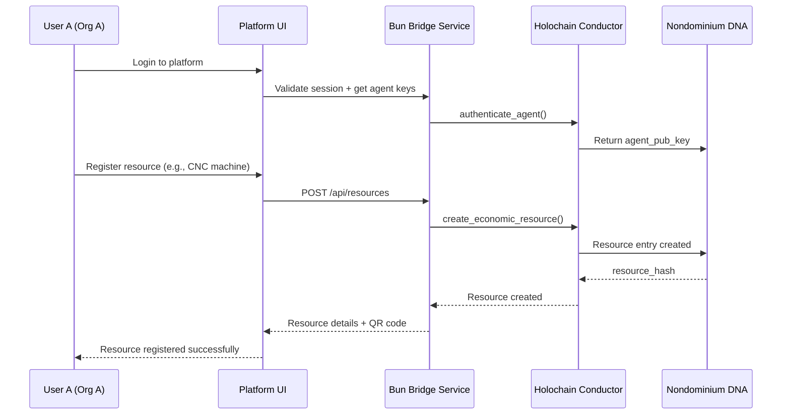
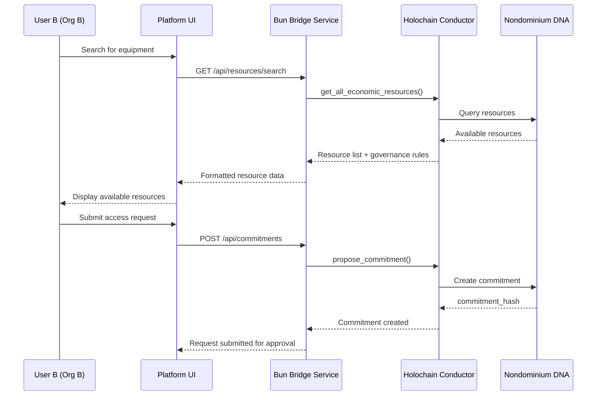
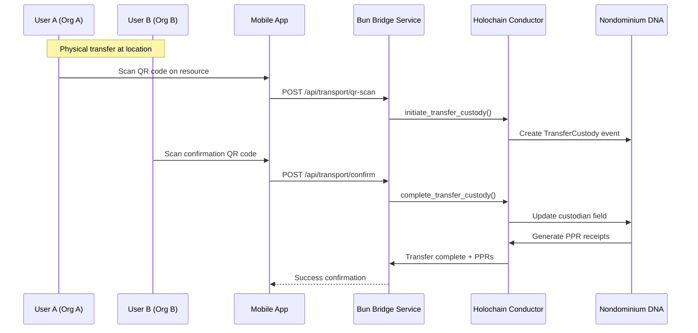
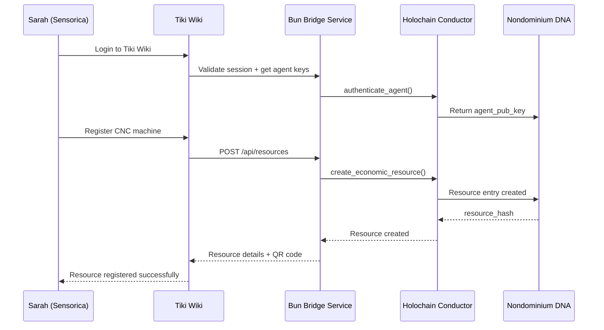
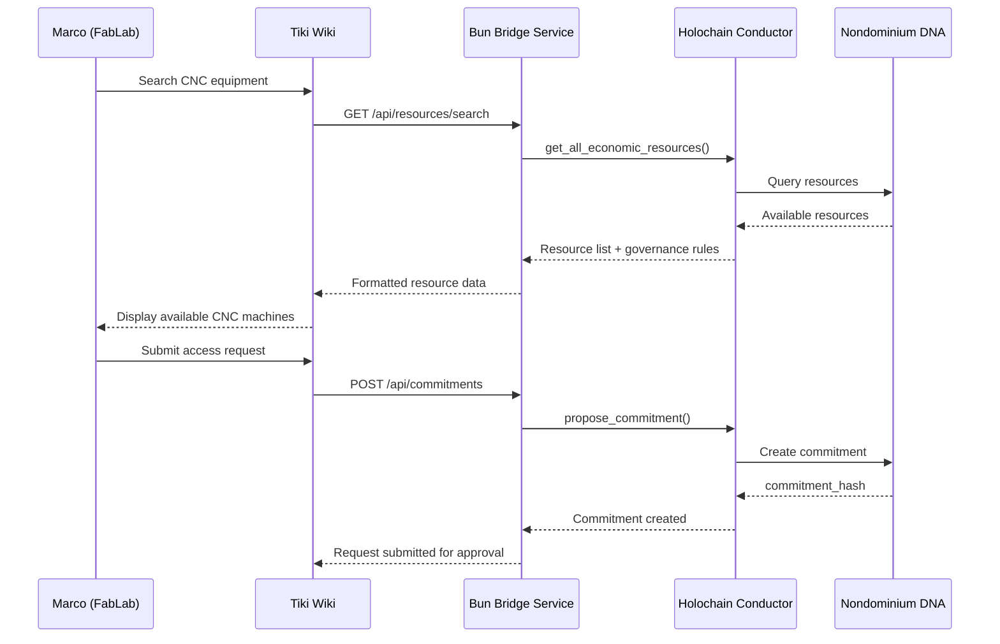
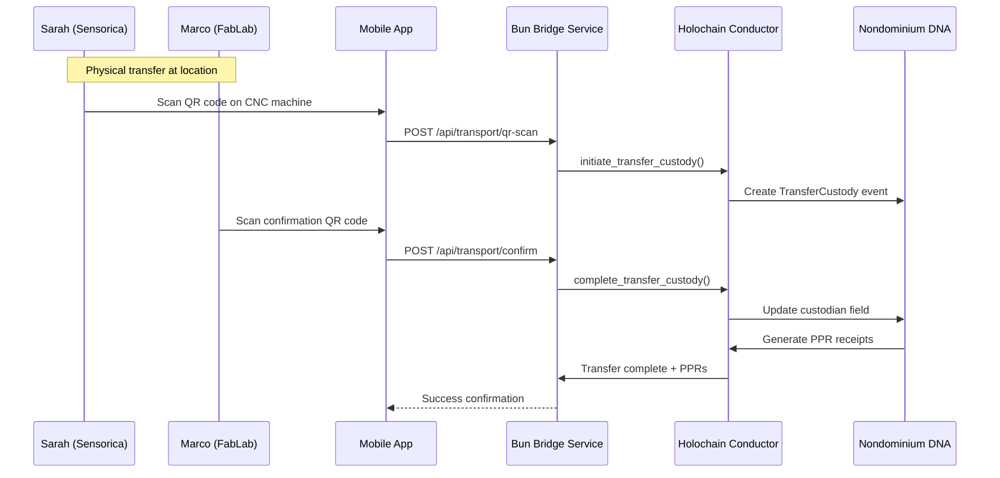

# Protocol Bridge Specifications for Nondominium

## Executive Summary

This document outlines the technical requirements for integrating Nondominium's Holochain-based resource sharing protocol with external platforms using a **Bun Bridge Service** powered by the official `@holochain/client` library. This approach provides full-featured, real-time integration while allowing each platform (Tiki Wiki, Odoo/ERPLibre, Dolibarr, etc.) to maintain its familiar workflow.

The architecture separates concerns into two layers:
1. **Protocol Bridge** (generic, reusable): Bun/TypeScript service translating REST/JSON to Holochain WebSocket
2. **Platform Integration Layer** (per-platform): Business logic, data mapping, and UI specific to each platform

---

## 1. Architecture Overview

### 1.1 Two-Layer Architecture (Protocol Bridge + Platform Module)

```mermaid
graph TB
    subgraph "Platform Layer (per-platform)"
        PlatformUI[Platform Web Interface]
        PlatformBackend[Platform Backend]
        MobileApp[Mobile Application]
    end

    subgraph "Bun Bridge Service"
        BridgeAPI[REST API Layer]
        HoloClient[@holochain/client]
        Cache[Redis Cache]
        Queue[Job Queue]
        SignalHandler[Signal Handler]
    end

    subgraph "Holochain Infrastructure"
        Conductor[Holochain Conductor]
        DNA[Nondominium DNA]
        DHT[Distributed Hash Table]
    end

    PlatformUI --> PlatformBackend
    PlatformBackend --> BridgeAPI
    MobileApp --> BridgeAPI
    BridgeAPI --> HoloClient
    HoloClient <--> Conductor
    SignalHandler --> PlatformBackend
    BridgeAPI --> Cache
    BridgeAPI --> Queue
    Conductor <--> DNA
    DNA <--> DHT
```

### 1.2 Component Specifications

#### 1. Bun Bridge Service

- **Purpose**: Official WebSocket-based bridge between platform backends and Holochain
- **Technology**: Bun with `@holochain/client` library and Hono framework
- **Key Features**:
  - RESTful API for platform modules (PHP, Python, Java, etc.)
  - Full WebSocket connectivity to Holochain Conductor
  - Real-time signal subscription and forwarding
  - Request batching and caching (Redis)
  - Async job queue for long-running operations
  - Proper zome call signing and capability management
  - Health monitoring and logging

**Why Bun + Hono?**
- **Consistency**: The main nondominium repo already uses Bun as its runtime
- **Official Support**: `@holochain/client` is maintained by Holochain core team and works with Bun
- **Full Features**: Real-time signals, proper signing, batch operations
- **Performance**: Bun's fast startup, native WebSocket, and low memory footprint; Hono's lightweight routing
- **Built-in TypeScript**: No transpilation step needed
- **RESTful Interface**: Clean Hono API for any platform to consume
- **Caching & Queuing**: Performance optimization built-in

#### 2. Holochain Conductor

- **Purpose**: Run Nondominium hApp and manage agent keys
- **Deployment**: Docker containerized
- **Configuration**:
  - Admin WebSocket on port 8000
  - App WebSocket on port 8888
  - Support for multiple concurrent agents (organizations)
  - Automatic conductor configuration via bridge service

#### 3. Platform Integration Layer

- **Purpose**: Connect platform user accounts to Holochain agents
- **Requirements** (per-platform):
  - Platform session token validation
  - Holochain agent key generation and management
  - Role-based access control mapping
  - Secure credential storage
  - Single Sign-On (SSO) compatibility

### 1.3 Organization-as-Agent Model

Based on the ERP-Holochain bridge analysis, platforms operate in an **Organizational Context** with the following implications:

#### Identity Architecture
- **Platform Group/Organization** -> **Holochain Organization Agent**
- **Platform User** -> **Delegate Key** (with scoped permissions)
- **Delegation Pattern**: Required for all zome calls signed by users on behalf of organizations

#### Reputation Aggregation
- External PPRs accrue to the **Organization**
- Internal attribution tracked via `performed_by` metadata
- New users inherit the organization's reputation (trust by association)

#### Governance Model
- **Policy-Driven**: Automated rules based on platform group permissions
- **Multi-Sig Support**: High-value transactions require multiple delegate approvals
- **Automated Approval**: ERP-style workflows (e.g., "Auto-approve Use requests < $500")

#### Custody vs. Ownership
- **Organization** owns the resource
- **Individual users** (employees) hold temporary custody
- Internal transfers (between users in same org) may not trigger DHT events

#### Device Management
- **Shared Terminals**: Warehouse tablets used by multiple staff members
- **Session Management**: Rapid login/logout of different delegates
- **SSO Integration**: Map platform session tokens to Holochain capability tokens

### 1.4 Why Bun Bridge (Not HTTP Gateway)?

The Bun Bridge Service using `@holochain/client` is the **only recommended approach** for production platform-Nondominium integration:

**Key Advantages:**
- **Official Library**: `@holochain/client` is maintained by Holochain core team
- **Full Features**: Real-time signals, proper zome call signing, batch operations
- **Production-Ready**: Built-in connection management, retry logic, health checks
- **Performance**: Persistent WebSocket connection, Redis caching, job queues
- **Clean API**: RESTful interface familiar to developers of all platforms

**HTTP Gateway Alternative (Not Recommended for Production):**
- GET-only requests with Base64-encoded payloads
- No native signal support for real-time updates
- Limited batch operations and session management
- Performance constraints (connection overhead per request)

> **Note**: The `hc-http-gw` HTTP Gateway is suitable for PoC/prototyping. See the [nondominium-erp-bridge](https://github.com/Sensorica/nondominium-erp-bridge) repository for a Python PoC reference implementation using hc-http-gw with 101 tests.

---

## 2. Integration API Specifications

### 2.1 Bridge Architecture

The **Bun Bridge Service** architecture provides a clean RESTful interface for any platform's backend code:

**Architecture:**
```
Platform Backend <--HTTP/JSON--> Bun Bridge (@holochain/client) <--WebSocket--> Holochain Conductor <--> Nondominium DHT
```

**How It Works:**
1. Platform modules make standard HTTP requests to the Bun Bridge REST API
2. Bun Bridge maintains persistent WebSocket connection to Holochain
3. Bridge handles zome call signing, capability tokens, and signal subscriptions
4. Real-time signals from Holochain pushed to platforms via webhooks
5. Redis caching for frequently accessed data (resource lists, reputation scores)
6. Job queue for async operations (batch syncs, long-running processes)

**Benefits:**
- **Clean Interface**: Platform developers work with familiar REST/JSON
- **Full Features**: Access to all Holochain capabilities (signals, signing, etc.)
- **Performance**: Caching, batching, connection pooling
- **Reliability**: Built-in retry logic, error handling, health checks
- **Real-time**: WebSocket signals forwarded to platforms instantly

### 2.2 Core REST API Endpoints

#### Bun Bridge REST API

```bash
# Resource Discovery
POST /api/resources
GET  /api/resources/{resource_id}
GET  /api/resources/search?query=CNC

# Resource Operations
POST   /api/resources
PUT    /api/resources/{resource_id}
DELETE /api/resources/{resource_id}
PATCH  /api/resources/{resource_id}/state

# Transaction Management
POST /api/commitments
GET  /api/commitments/{commitment_id}
POST /api/events
GET  /api/events/by-resource/{resource_id}

# Reputation System
GET /api/reputation/{agent_id}/summary
GET /api/reputation/{agent_id}/receipts

# Batch Operations
POST /api/batch
```

### 2.3 Bun Bridge Service Implementation

```javascript
// bridge-service.js
import { AppWebsocket, AdminWebsocket } from '@holochain/client';
import { Hono } from 'hono';
import { createClient } from 'redis';

class NondominiumBridgeService {
  constructor(config) {
    this.appWs = null;
    this.adminWs = null;
    this.redis = createClient({ url: config.redisUrl });
    this.config = config;
  }

  async connect() {
    // Connect to Holochain Admin API
    this.adminWs = await AdminWebsocket.connect({
      url: new URL(this.config.adminWsUrl),
      wsClientOptions: { origin: 'nondominium-bridge' }
    });

    // Connect to App WebSocket
    const token = await this.adminWs.issueAppAuthenticationToken({
      installed_app_id: this.config.appId
    });

    this.appWs = await AppWebsocket.connect({
      url: new URL(this.config.appWsUrl),
      token: token.token,
      wsClientOptions: { origin: 'nondominium-bridge' }
    });

    // Subscribe to signals
    this.appWs.on('signal', this.handleSignal.bind(this));

    await this.redis.connect();
    console.log('Bridge connected to Holochain and Redis');
  }

  async handleSignal(signal) {
    console.log('Received signal:', signal);
    // Push signal to registered webhook endpoints
    await this.notifyWebhooks(signal);
  }

  async notifyWebhooks(signal) {
    // POST to registered platform webhook endpoints
    for (const [url, config] of this.webhooks) {
      const response = await fetch(url, {
        method: 'POST',
        headers: {
          'Content-Type': 'application/json',
          'X-Nondominium-Signature': this.generateSignature(signal)
        },
        body: JSON.stringify({
          type: signal.data.type,
          payload: signal.data.payload
        })
      });
      console.log(`Notified ${url}:`, response.status);
    }
  }

  async callZome(cellId, zomeName, fnName, payload) {
    const cacheKey = `zome:${zomeName}:${fnName}:${JSON.stringify(payload)}`;

    // Check cache for read operations
    if (fnName.startsWith('get_')) {
      const cached = await this.redis.get(cacheKey);
      if (cached) return JSON.parse(cached);
    }

    try {
      const result = await this.appWs.callZome({
        cell_id: cellId,
        zome_name: zomeName,
        fn_name: fnName,
        payload: payload
      }, 30000);

      // Cache read operations
      if (fnName.startsWith('get_')) {
        await this.redis.setEx(cacheKey, 300, JSON.stringify(result));
      }

      return result;
    } catch (error) {
      console.error('Zome call failed:', error);
      throw error;
    }
  }

  generateSignature(data) {
    // HMAC signature for webhook authentication
    return crypto.createHmac('sha256', this.config.webhookSecret)
      .update(JSON.stringify(data))
      .digest('hex');
  }
}

// Initialize bridge
const bridge = new NondominiumBridgeService({
  adminWsUrl: process.env.HC_ADMIN_WS_URL || 'ws://localhost:8000',
  appWsUrl: process.env.HC_APP_WS_URL || 'ws://localhost:8888',
  appId: process.env.HC_APP_ID || 'nondominium',
  redisUrl: process.env.REDIS_URL || 'redis://localhost:6379',
  webhookSecret: process.env.WEBHOOK_SECRET
});

await bridge.connect();

// Hono API
const app = new Hono();

function getCellId(body: any, query: any) {
  return [body?.dna_hash || query?.dna_hash, body?.agent_key || query?.agent_key];
}

// Resource Management
app.post('/api/resources', async (c) => {
  try {
    const body = await c.req.json();
    const cellId = getCellId(body, null);
    const result = await bridge.callZome(cellId, 'zome_resource', 'create_economic_resource', {
      spec_hash: body.spec_hash,
      quantity: body.quantity,
      unit: body.unit,
      custodian: body.custodian
    });
    return c.json({ success: true, data: result });
  } catch (error) {
    return c.json({ success: false, error: error.message }, 500);
  }
});

app.get('/api/resources/search', async (c) => {
  try {
    const query = c.req.query();
    const cellId = getCellId(null, query);
    const resources = await bridge.callZome(cellId, 'zome_resource', 'get_all_economic_resources', {
      query: query.query
    });
    return c.json({ success: true, data: resources });
  } catch (error) {
    return c.json({ success: false, error: error.message }, 500);
  }
});

// Batch operations
app.post('/api/batch', async (c) => {
  try {
    const body = await c.req.json();
    const cellId = getCellId(body, null);
    const results = await Promise.all(
      body.operations.map((op: any) =>
        bridge.callZome(cellId, op.zome, op.function, op.payload)
      )
    );
    return c.json({ success: true, data: results });
  } catch (error) {
    return c.json({ success: false, error: error.message }, 500);
  }
});

app.get('/health', (c) => {
  return c.json({
    status: 'ok',
    holochain: bridge.appWs ? 'connected' : 'disconnected',
    redis: bridge.redis.isOpen ? 'connected' : 'disconnected'
  });
});

const PORT = process.env.PORT || 3000;
export default { port: PORT, fetch: app.fetch };
```

---

## 3. Data Model Reference

### 3.1 Nondominium Zome Functions

The Nondominium hApp exposes three zomes. For the complete function reference, see the [ERP Bridge Technical Specifications](https://github.com/Sensorica/nondominium-erp-bridge/blob/main/documentation/specifications/erp_bridge_specifications.md) (Sections 4.3-4.4), which documents all coordinator functions for `zome_person`, `zome_resource`, and `zome_gouvernance`.

Summary of available zomes:

| Zome | Purpose | Key Functions |
|------|---------|---------------|
| `zome_person` | Agent identity, profiles, roles, capabilities | `create_person`, `assign_person_role`, `store_private_person_data`, `grant_private_data_access` |
| `zome_resource` | Resource specs, economic resources, governance rules | `create_resource_specification`, `create_economic_resource`, `transfer_custody`, `create_governance_rule` |
| `zome_gouvernance` | Commitments, events, validation, PPR | `propose_commitment`, `log_economic_event`, `issue_participation_receipts`, `create_validation_receipt` |

### 3.2 Critical Naming Conventions

Pydantic/JSON field names **must match Rust zome field names exactly** (Holochain uses JSON transcoding):

| Correct Field Name | NOT the REA/ValueFlows Name | Context |
|---|---|---|
| `spec_hash` | ~~`conforms_to`~~ | `EconomicResourceInput` — links resource to its specification |
| `category` | ~~`default_unit`~~ | `ResourceSpecification` — category string, not a unit |

**Enum Values (PascalCase strings):**

- `ResourceState`: `"PendingValidation"`, `"Active"`, `"Maintenance"`, `"Retired"`, `"Reserved"`
- `VfAction`: 16 variants — `"Transfer"`, `"Use"`, `"InitialTransfer"`, `"TransferCustody"`, etc.
- `ParticipationClaimType`: 16 variants — `"ResourceProvider"`, `"ResourceReceiver"`, `"Custodian"`, etc.

> **Reference**: The [nondominium-erp-bridge](https://github.com/Sensorica/nondominium-erp-bridge) Pydantic v2 models in `bridge/models.py` serve as the authoritative source for field names and types.

---

## 4. User Story Implementation Flow

### 4.1 Phase 1: Resource Discovery & Registration



### 4.2 Phase 2: Multi-Party Transaction Process



### 4.3 Phase 3: Custody Transfer with QR Codes



---

## 5. Mobile Application Requirements

### QR Code Scanning Features

```typescript
interface QRCodeData {
  resourceId: string;
  resourceHash: string;
  location: {
    latitude: number;
    longitude: number;
  };
  timestamp: string;
  custodianPubKey: string;
  sessionId: string;
}

// Scan result processing
function processQRScan(qrData: QRCodeData): Promise<TransferResult> {
  // Validate QR code authenticity
  // Initiate custody transfer
  // Generate cryptographic signatures
  // Update real-time status
}
```

### Offline Capabilities

- Cache critical resource data for offline access
- Queue custody transfer operations when connectivity lost
- Synchronize pending operations when connection restored
- Local storage of QR code scan history

### Push Notifications

```typescript
// Real-time transaction updates
interface NotificationPayload {
  type: "transaction_update" | "resource_available" | "ppr_update";
  title: string;
  message: string;
  data: any;
  priority: "high" | "normal" | "low";
}
```

---

## 6. Security & Authentication

### Identity Bridge Architecture

Based on the **Organizational Context** from the ERP bridge analysis, platforms operate in a **delegated agency model** where:
- Platform organizations are represented as Holochain agents
- Individual platform users act as **delegates/representatives** of the organization
- Delegation requires scope, expiry, and revocation mechanisms

#### Key Security Concepts

1. **Organization Agent Key**: Generated via Holochain Admin API, stored securely server-side
2. **Delegate Key**: Per-user signing key for acting on behalf of the organization
3. **Capability Grants**: Scoped, time-limited permissions granted to delegate keys
4. **Webhook Signatures**: HMAC-SHA256 signatures for verifying signal authenticity

### Data Privacy Controls

```typescript
// Privacy settings per resource
interface ResourcePrivacy {
  resourceId: string;
  publicFields: ("name" | "location" | "specifications")[];
  privateFields: ("owner_details" | "usage_history" | "maintenance_records")[];
  accessControl: "public" | "organization_only" | "approved_agents_only";
}
```

### Organizational vs. P2P Context

| Aspect | Organizational (ERP/Platform) | Pure P2P |
|--------|-------------------------------|----------|
| **Identity Model** | Platform Group = Org Agent, Users = Delegates | 1 Human = 1 Agent Key |
| **Signing Authority** | Delegated (users sign on behalf of org) | Direct (individual signs) |
| **Reputation** | Accrues to organization, internal attribution | Accrues to individual |
| **Governance** | Policy-driven, automated rules | Ad-hoc, social negotiation |
| **Device Usage** | Shared terminals, SSO integration | Personal devices |

---

## 7. Performance Requirements

### Response Time Targets

- **Resource Search**: < 2 seconds for basic queries
- **Transaction Updates**: < 500ms for status changes
- **QR Code Processing**: < 3 seconds end-to-end
- **Real-time Synchronization**: < 1 second for webhook delivery
- **Authentication**: < 1 second for user validation

### Scalability Requirements

```yaml
concurrent_users:
  target: 1000
  peak: 5000

resource_transactions:
  daily_volume: 10000
  peak_concurrent: 500

api_throughput:
  requests_per_second: 1000
  burst_capacity: 5000

data_storage:
  resources_per_organization: 10000
  transaction_history: 7_years
```

### Caching Strategy

```typescript
// Multi-level caching
interface CacheConfiguration {
  level1_memory: {
    user_sessions: "15 minutes";
    resource_metadata: "1 hour";
    reputation_scores: "30 minutes";
  };

  level2_redis: {
    search_results: "5 minutes";
    transaction_status: "real-time";
    availability_data: "2 minutes";
  };

  level3_cdn: {
    static_assets: "24 hours";
    api_responses: "5 minutes";
    qr_codes: "1 hour";
  };
}
```

---

## 8. Integration Workflow Requirements

### Data Synchronization

#### Master Data Management

```typescript
// Platform <-> Holochain sync mapping
interface SyncMapping {
  platformUser: HolochainAgent;
  platformResource: EconomicResource;
  platformTransaction: Commitment + EconomicEvent[];
  platformProfile: Person + EncryptedProfile;
}

// Bidirectional sync rules
const SYNC_RULES = {
  // Platform -> Holochain
  userRegistration: "create_holochain_agent",
  resourceCreation: "create_economic_resource",
  transactionInitiation: "create_commitment",

  // Holochain -> Platform
  reputationUpdates: "update_user_profile",
  transactionCompletion: "update_transaction_status",
  custodyTransfers: "update_resource_custodian"
};
```

#### Conflict Resolution

```typescript
interface ConflictResolution {
  strategy:
    | "holochain_master"
    | "platform_master"
    | "timestamp_win"
    | "manual_review";
  rules: {
    resource_metadata: "holochain_master";
    user_preferences: "platform_master";
    transaction_status: "timestamp_win";
    reputation_data: "holochain_master";
  };
}
```

### Error Handling & Recovery

#### Transaction Rollback

```typescript
interface RollbackStrategy {
  commitment_creation: [
    "delete_commitment_entry",
    "release_resource_reservation",
    "notify_stakeholders",
  ];

  custody_transfer: [
    "reverse_custody_update",
    "invalidate_ppr_receipts",
    "notify_transport_parties",
  ];
}
```

#### Fallback Procedures

```typescript
// Service degradation handling
const FALLBACK_PROCEDURES = {
  bridge_service_down: "cache_operations + retry_exponential_backoff",
  conductor_unavailable: "read_only_mode + queue_operations",
  network_partition: "local_validation + sync_when_available",
  high_load: "request_throttling + background_processing",
};
```

---

## 9. Testing Requirements

### Integration Test Scenarios

#### End-to-End User Journey Tests

```typescript
describe("Platform-Nondominium Integration", () => {
  test("Complete resource sharing workflow", async () => {
    // 1. User A registers resource through platform
    // 2. User B discovers resource via platform search
    // 3. Transaction negotiation through platform UI
    // 4. QR code-based custody transfer
    // 5. Usage tracking and PPR generation
    // 6. Return process and reputation updates
  });

  test("Multi-organization resource discovery", async () => {
    // 1. Multiple organizations register resources
    // 2. Cross-organization search functionality
    // 3. Trust validation between organizations
    // 4. Compliance with governance rules
  });
});
```

#### Performance & Load Testing

```typescript
interface LoadTestConfiguration {
  concurrent_users: [100, 500, 1000, 5000];
  scenarios: [
    "resource_search",
    "transaction_creation",
    "qr_scan",
    "real_time_sync",
  ];
  duration: "10 minutes per scenario";
  success_criteria: {
    response_time_p95: "< 2 seconds";
    error_rate: "< 0.1%";
    throughput: "> 500 requests/second";
  };
}
```

#### Security Testing

```typescript
interface SecurityTests {
  authentication_tests: [
    "invalid_session_token",
    "cross_organization_access",
    "privilege_escalation_attempts",
  ];

  data_privacy: [
    "sensitive_data_encryption",
    "access_control_enforcement",
    "audit_trail_completeness",
  ];

  api_security: [
    "rate_limiting_effectiveness",
    "input_validation",
    "sql_injection_prevention",
    "xss_protection",
  ];
}
```

---

## 10. Deployment Architecture

### Bridge Per Organization (Recommended)

Each organization runs its own full stack:

```
┌─────────────────────────┐     ┌─────────────────────────┐
│ Org A Server            │     │ Org B Server            │
│ ┌─────────────────────┐ │     │ ┌─────────────────────┐ │
│ │ Platform + Module   │ │     │ │ Platform + Module   │ │
│ ├─────────────────────┤ │     │ ├─────────────────────┤ │
│ │ Bun Bridge      │ │     │ │ Bun Bridge      │ │
│ ├─────────────────────┤ │     │ ├─────────────────────┤ │
│ │ Holochain Node      │ │     │ │ Holochain Node      │ │
│ │ (Org A Agent)       │ │     │ │ (Org B Agent)       │ │
│ └─────────────────────┘ │     │ └─────────────────────┘ │
└───────────┬─────────────┘     └───────────┬─────────────┘
            │                               │
            └───────────────────────────────┘
                        DHT Network
```

### Generic Docker Compose Template

```yaml
# docker-compose.yml (template - adapt for your platform)
services:
  platform:
    # Your platform (Tiki, Odoo, Dolibarr, etc.)
    depends_on:
      - bridge

  holochain:
    image: holochain/holochain:latest
    # NO public ports - internal only
    volumes:
      - ./nondominium.happ:/happ/nondominium.happ
      - holochain_data:/data
    command: holochain -c /data/conductor-config.yml

  bridge:
    build: ./bridge-service
    # NO public ports - internal only
    environment:
      - HC_ADMIN_WS_URL=ws://holochain:8000
      - HC_APP_WS_URL=ws://holochain:8888
      - HC_APP_ID=nondominium
      - REDIS_URL=redis://redis:6379
      - WEBHOOK_SECRET=${WEBHOOK_SECRET}
    depends_on:
      - holochain
      - redis

  redis:
    image: redis:7-alpine

volumes:
  holochain_data:
```

### Bridge Service Dockerfile

```dockerfile
# bridge-service/Dockerfile
FROM oven/bun:latest

WORKDIR /app

COPY package.json bun.lockb ./
RUN bun install --production

COPY . .

EXPOSE 3000

CMD ["bun", "run", "index.ts"]
```

### Shared Bridge Service (Managed) — Alternative

For organizations preferring managed infrastructure:

```
┌─────────────┐     ┌─────────────┐     ┌─────────────┐
│ Platform A  │     │ Platform B  │     │ Platform C  │
│ Org A       │     │ Org B       │     │ Org C       │
└──────┬──────┘     └──────┬──────┘     └──────┬──────┘
       │                   │                   │
       └───────────────────┼───────────────────┘
                           │
                  ┌────────▼────────┐
                  │ Managed Bridge  │  ← Multi-tenant
                  │ Service         │     API key per org
                  └────────┬────────┘
                           │
             ┌─────────────┼─────────────┐
             │             │             │
      ┌──────▼──────┐ ┌────▼─────┐ ┌──────▼──────┐
      │ Org A Node  │ │Org B Node│ │ Org C Node  │
      └─────────────┘ └──────────┘ └─────────────┘
```

---

## 11. Compliance & Governance

### Data Protection

- GDPR compliance for European users
- PII encryption at rest and in transit
- Right to be forgotten implementation
- Audit trail for all resource transactions

### Regulatory Compliance

- Equipment insurance validation integration
- Transport certification verification
- Safety protocol compliance tracking
- Tax reporting for resource usage fees

### Governance Framework

- Multi-stakeholder governance council
- Dispute resolution mechanism
- Protocol amendment process
- Emergency response procedures

---

## Appendix A: Tiki Wiki Platform Example

This appendix contains Tiki Wiki/PHP-specific implementation examples demonstrating how a PHP-based platform integrates with the Bun Bridge Service.

### A.1 PHP Client

```php
<?php
// Tiki module calling Bun Bridge Service

class NondominiumClient {
    private $bridge_url;
    private $dna_hash;
    private $agent_key;

    public function __construct($bridge_url, $dna_hash, $agent_key) {
        $this->bridge_url = $bridge_url;
        $this->dna_hash = $dna_hash;
        $this->agent_key = $agent_key;
    }

    /**
     * Search for resources
     */
    public function searchResources($query = null, $category = null) {
        $response = $this->makeRequest('GET', '/api/resources/search', [
            'query' => ['query' => $query, 'category' => $category, 'dna_hash' => $this->dna_hash, 'agent_key' => $this->agent_key]
        ]);
        return $response['data'];
    }

    /**
     * Create a new resource
     */
    public function createResource($spec_hash, $quantity, $unit) {
        $response = $this->makeRequest('POST', '/api/resources', [
            'json' => [
                'dna_hash' => $this->dna_hash,
                'agent_key' => $this->agent_key,
                'spec_hash' => $spec_hash,
                'quantity' => $quantity,
                'unit' => $unit,
                'custodian' => $this->agent_key
            ]
        ]);
        return $response['data'];
    }

    /**
     * Initiate use process
     */
    public function initiateUse($resource_hash, $receiver, $start_time, $end_time) {
        $response = $this->makeRequest('POST', "/api/resources/{$resource_hash}/use", [
            'json' => [
                'dna_hash' => $this->dna_hash,
                'agent_key' => $this->agent_key,
                'receiver' => $receiver,
                'start_time' => $start_time,
                'end_time' => $end_time
            ]
        ]);
        return $response['data'];
    }

    private function makeRequest($method, $path, $options = []) {
        $url = $this->bridge_url . $path;

        $ch = curl_init();
        curl_setopt($ch, CURLOPT_URL, $url);
        curl_setopt($ch, CURLOPT_RETURNTRANSFER, true);
        curl_setopt($ch, CURLOPT_CUSTOMREQUEST, $method);

        if (isset($options['query'])) {
            $url .= '?' . http_build_query($options['query']);
            curl_setopt($ch, CURLOPT_URL, $url);
        }

        if (isset($options['json'])) {
            $json = json_encode($options['json']);
            curl_setopt($ch, CURLOPT_POSTFIELDS, $json);
            curl_setopt($ch, CURLOPT_HTTPHEADER, ['Content-Type: application/json']);
        }

        $response = curl_exec($ch);
        $http_code = curl_getinfo($ch, CURLINFO_HTTP_CODE);
        curl_close($ch);

        if ($http_code !== 200) {
            throw new Exception("Bridge request failed: HTTP {$http_code}");
        }

        return json_decode($response, true);
    }
}
```

### A.2 Tiki Module Integration

```php
<?php
/**
 * Tiki Module: mod-nondominium_resources.php
 * Display available resources from Nondominium
 */

require_once('lib/nondominium/NondominiumBridge.php');

function module_nondominium_resources_info() {
    return [
        'name' => tr('Nondominium Resources'),
        'description' => tr('Display available shared resources from Nondominium network'),
        'prefs' => ['feature_nondominium'],
        'params' => [
            'max' => [
                'required' => false,
                'name' => tr('Maximum number of resources'),
                'description' => tr('Maximum number of resources to display'),
                'default' => 10,
            ],
        ],
    ];
}

function module_nondominium_resources($mod_reference_values) {
    global $prefs;

    $bridge = new NondominiumBridge(
        $prefs['nondominium_gateway_url'],
        $prefs['nondominium_dna_hash']
    );

    try {
        $resources = $bridge->searchResources();

        // Filter and format for Tiki display
        $smarty = TikiLib::lib('smarty');
        $smarty->assign('resources', array_slice($resources, 0, $mod_reference_values['max']));

        return $smarty->fetch('modules/mod-nondominium_resources.tpl');
    } catch (Exception $e) {
        return '<div class="alert alert-danger">' . tr('Error loading resources: ') . $e->getMessage() . '</div>';
    }
}
```

### A.3 Tiki Tracker Integration

```php
<?php
/**
 * Sync Tiki Tracker items with Nondominium resources
 */

class TikiNondominiumSync {
    private $bridge;
    private $tracker_id;

    public function __construct($bridge, $tracker_id) {
        $this->bridge = $bridge;
        $this->tracker_id = $tracker_id;
    }

    /**
     * Publish a Tiki Tracker item as a Nondominium resource
     */
    public function publishTrackerItem($item_id) {
        $trklib = TikiLib::lib('trk');
        $item = $trklib->get_tracker_item($item_id);

        // Map Tiki fields to Nondominium structure
        $resource_data = [
            'name' => $item['fields']['name'],
            'description' => $item['fields']['description'],
            'quantity' => $item['fields']['quantity'],
            'unit' => $item['fields']['unit'],
            'location' => $item['fields']['location']
        ];

        // Create ResourceSpecification in Nondominium
        $spec = $this->bridge->callZome('resource', 'create_resource_specification', [
            'name' => $resource_data['name'],
            'description' => $resource_data['description']
        ]);

        // Create EconomicResource
        $resource = $this->bridge->createResource(
            $spec['hash'],
            $resource_data['quantity'],
            $resource_data['unit'],
            $this->getCurrentUserAgentKey()
        );

        // Store Nondominium hash in Tiki tracker field
        $trklib->modify_field($item_id, 'nondominium_hash', $resource['hash']);

        return $resource;
    }

    /**
     * Sync Nondominium events back to Tiki
     */
    public function syncEventsToTiki($resource_hash) {
        $events = $this->bridge->callZome('gouvernance', 'get_events_by_resource', [
            'resource_hash' => $resource_hash
        ]);

        foreach ($events as $event) {
            // Log event in Tiki activity stream
            TikiLib::lib('logs')->add_log('nondominium_event', sprintf(
                'Resource %s: %s by %s',
                $resource_hash,
                $event['action'],
                $event['provider']
            ));
        }
    }

    private function getCurrentUserAgentKey() {
        global $user;
        $userlib = TikiLib::lib('user');
        return $userlib->get_user_preference($user, 'nondominium_agent_key');
    }
}
```

### A.4 Webhooks (PHP Handler)

```php
<?php
/**
 * webhook_nondominium.php
 * Handle real-time updates from Nondominium via webhooks
 */

// Authenticate webhook (verify signature)
function validate_webhook_signature($payload, $signature) {
    global $prefs;
    $expected = hash_hmac('sha256', $payload, $prefs['nondominium_webhook_secret']);
    return hash_equals($expected, $signature);
}

// Main webhook handler
$payload = file_get_contents('php://input');
$signature = $_SERVER['HTTP_X_NONDOMINIUM_SIGNATURE'] ?? '';

if (!validate_webhook_signature($payload, $signature)) {
    http_response_code(401);
    exit('Invalid signature');
}

$data = json_decode($payload, true);

switch ($data['type']) {
    case 'commitment.updated':
        handle_commitment_update($data);
        break;

    case 'resource.availability':
        handle_resource_availability($data);
        break;

    case 'reputation.updated':
        handle_reputation_update($data);
        break;

    default:
        http_response_code(400);
        exit('Unknown event type');
}

function handle_commitment_update($data) {
    $trklib = TikiLib::lib('trk');

    // Find Tiki tracker item by commitment hash
    $items = $trklib->list_items($tracker_id = get_commitment_tracker_id(), 0, -1, '', [
        'nondominium_hash' => $data['commitmentId']
    ]);

    if (!empty($items['data'])) {
        $item_id = $items['data'][0]['itemId'];

        // Update status field
        $trklib->modify_field($item_id, 'status', $data['status']);

        // Send notification to user
        send_tiki_notification(
            $item_id,
            'Commitment Status Updated',
            sprintf('Your resource request is now: %s', $data['status'])
        );
    }
}

function handle_resource_availability($data) {
    // Update Tiki tracker item availability status
    // Trigger intertracker reference updates if needed
}

function handle_reputation_update($data) {
    global $user;
    $userlib = TikiLib::lib('user');

    // Update user's reputation score in Tiki profile
    $userlib->set_user_preference(
        $user,
        'nondominium_reputation_score',
        $data['newScore']
    );

    // Display notification
    TikiLib::lib('smarty')->display_notification([
        'title' => 'Reputation Updated',
        'message' => sprintf('Your reputation score is now: %.2f', $data['newScore'])
    ]);
}

http_response_code(200);
echo json_encode(['status' => 'ok']);
```

### A.5 Identity Bridge (PHP)

```php
<?php
/**
 * TikiHolochainAuth.php
 * Manage identity mapping between Tiki users and Holochain agents
 */

class TikiHolochainAuth {
    /**
     * Generate or retrieve Holochain agent key for organization
     */
    public function getOrganizationAgentKey($org_id) {
        global $prefs;

        // Check if organization already has agent key
        $existing_key = $this->getOrgPreference($org_id, 'holochain_agent_key');

        if ($existing_key) {
            return $existing_key;
        }

        // Generate new agent key via Holochain admin API
        $admin_client = new HolochainAdminClient($prefs['holochain_admin_url']);
        $agent_key = $admin_client->generateAgentPubKey();

        // Store in Tiki
        $this->setOrgPreference($org_id, 'holochain_agent_key', $agent_key);

        return $agent_key;
    }

    /**
     * Create delegation for a Tiki user to act on behalf of organization
     */
    public function createDelegation($user, $org_id, $permissions, $expiry_days = 90) {
        $bridge = new NondominiumBridge(
            $GLOBALS['prefs']['nondominium_gateway_url'],
            $GLOBALS['prefs']['nondominium_dna_hash']
        );

        // Get organization's agent key
        $org_agent_key = $this->getOrganizationAgentKey($org_id);

        // Generate delegate key for this user
        $delegate_key = $this->getUserDelegateKey($user);

        // Create capability grant in Holochain
        $cap_grant = $bridge->callZome('person', 'grant_signing_key', [
            'cell_id' => [$GLOBALS['prefs']['nondominium_dna_hash'], $org_agent_key],
            'functions' => $permissions, // e.g., ['Transport', 'Use']
            'signing_key' => $delegate_key,
            'expiry' => time() + ($expiry_days * 86400)
        ]);

        // Store delegation in Tiki
        $this->storeDelegation([
            'user' => $user,
            'org_id' => $org_id,
            'delegate_key' => $delegate_key,
            'cap_secret' => $cap_grant['cap_secret'],
            'permissions' => json_encode($permissions),
            'expires_at' => time() + ($expiry_days * 86400)
        ]);

        return $cap_grant;
    }

    /**
     * Validate user's delegation and return signing credentials
     */
    public function validateDelegation($user, $org_id) {
        $delegation = $this->getDelegation($user, $org_id);

        if (!$delegation) {
            throw new Exception('No delegation found for user');
        }

        if ($delegation['expires_at'] < time()) {
            throw new Exception('Delegation has expired');
        }

        return [
            'org_agent_key' => $this->getOrganizationAgentKey($org_id),
            'delegate_key' => $delegation['delegate_key'],
            'cap_secret' => $delegation['cap_secret'],
            'permissions' => json_decode($delegation['permissions'], true)
        ];
    }

    /**
     * Revoke delegation (e.g., when user leaves organization)
     */
    public function revokeDelegation($user, $org_id) {
        $delegation = $this->getDelegation($user, $org_id);

        if ($delegation) {
            $bridge = new NondominiumBridge(
                $GLOBALS['prefs']['nondominium_gateway_url'],
                $GLOBALS['prefs']['nondominium_dna_hash']
            );

            // Revoke capability in Holochain
            $bridge->callZome('person', 'revoke_signing_key', [
                'cap_secret' => $delegation['cap_secret']
            ]);

            // Remove from Tiki database
            $this->deleteDelegation($user, $org_id);
        }
    }

    private function getUserDelegateKey($user) {
        $userlib = TikiLib::lib('user');
        $existing = $userlib->get_user_preference($user, 'holochain_delegate_key');

        if ($existing) {
            return $existing;
        }

        // Generate new delegate keypair
        $keypair = sodium_crypto_sign_keypair();
        $public_key = sodium_crypto_sign_publickey($keypair);

        // Store in user preferences (encrypted)
        $userlib->set_user_preference($user, 'holochain_delegate_key', base64_encode($public_key));
        $userlib->set_user_preference($user, 'holochain_delegate_keypair', base64_encode($keypair));

        return base64_encode($public_key);
    }

    private function storeDelegation($data) {
        global $tiki_p_nondominium_delegations;
        TikiDb::get()->query(
            "INSERT INTO `$tiki_p_nondominium_delegations`
            (`user`, `org_id`, `delegate_key`, `cap_secret`, `permissions`, `expires_at`)
            VALUES (?, ?, ?, ?, ?, ?)",
            [
                $data['user'],
                $data['org_id'],
                $data['delegate_key'],
                $data['cap_secret'],
                $data['permissions'],
                $data['expires_at']
            ]
        );
    }

    private function getDelegation($user, $org_id) {
        global $tiki_p_nondominium_delegations;
        return TikiDb::get()->getOne(
            "SELECT * FROM `$tiki_p_nondominium_delegations` WHERE `user` = ? AND `org_id` = ?",
            [$user, $org_id]
        );
    }

    private function deleteDelegation($user, $org_id) {
        global $tiki_p_nondominium_delegations;
        TikiDb::get()->query(
            "DELETE FROM `$tiki_p_nondominium_delegations` WHERE `user` = ? AND `org_id` = ?",
            [$user, $org_id]
        );
    }
}
```

### A.6 Organizational Delegation Workflow

```php
<?php
/**
 * Example: Tiki user Alice requests to transport a resource on behalf of Acme Corp
 */

$auth = new TikiHolochainAuth();
$bridge = new NondominiumBridge($gateway_url, $dna_hash);

// Step 1: Validate Alice's delegation
try {
    $credentials = $auth->validateDelegation('alice', $org_id = 123); // Acme Corp

    // Alice has permissions: ['Transport', 'Use']
    if (!in_array('Transport', $credentials['permissions'])) {
        throw new Exception('User not authorized for Transport');
    }

} catch (Exception $e) {
    die('Authorization failed: ' . $e->getMessage());
}

// Step 2: Sign the transport request with delegate key
$transport_payload = [
    'resource_hash' => $resource_hash,
    'from_location' => 'Warehouse A',
    'to_location' => 'Client Site B',
    'scheduled_date' => '2025-12-20'
];

// The zome call is signed by Alice's delegate key on behalf of Acme Corp
$result = $bridge->callZome('resource', 'initiate_transport_process', array_merge(
    $transport_payload,
    [
        'provenance' => $credentials['org_agent_key'], // Acme Corp's identity
        'performed_by' => $credentials['delegate_key']  // Alice's delegate key
    ]
));

// Step 3: Track internal attribution
// The organization (Acme Corp) gets the external PPR, but Tiki tracks that Alice performed it
TikiLib::lib('logs')->add_log('nondominium_transport', sprintf(
    'Transport initiated by %s on behalf of organization %d',
    'alice',
    $org_id
));
```

### A.7 Capability-Based Access Control (PHP)

```php
<?php
/**
 * Role-based permissions mapping for Tiki-Nondominium integration
 */

class NondominiumRoleManager {
    const ROLE_PERMISSIONS = [
        'Resource Coordinator' => ['view', 'request_access', 'transfer_custody'],
        'Technical Manager' => ['view', 'request_access', 'use_resource'],
        'Transport Specialist' => ['transfer_custody', 'view_transport_logs'],
        'Warehouse Manager' => ['view', 'create_resource', 'update_inventory'],
    ];

    /**
     * Get Holochain permissions for a Tiki group/role
     */
    public function getHolochainPermissions($tiki_role) {
        return self::ROLE_PERMISSIONS[$tiki_role] ?? [];
    }

    /**
     * Automatically delegate permissions when user joins a Tiki group
     */
    public function onUserAddedToGroup($user, $group, $org_id) {
        $auth = new TikiHolochainAuth();

        $permissions = $this->getHolochainPermissions($group);

        if (!empty($permissions)) {
            try {
                $auth->createDelegation($user, $org_id, $permissions);

                TikiLib::lib('logs')->add_log('nondominium_delegation', sprintf(
                    'Delegation created for user %s in group %s',
                    $user,
                    $group
                ));
            } catch (Exception $e) {
                TikiLib::lib('logs')->add_log('nondominium_error', $e->getMessage());
            }
        }
    }

    /**
     * Revoke delegation when user leaves group
     */
    public function onUserRemovedFromGroup($user, $group, $org_id) {
        $auth = new TikiHolochainAuth();
        $auth->revokeDelegation($user, $org_id);
    }
}
```

### A.8 Docker Compose (Tiki-Specific)

```yaml
# docker-compose.yml (Tiki Wiki deployment)
version: '3.8'

services:
  tiki:
    image: tiki/tiki:latest
    ports:
      - "80:80"
    environment:
      - DB_HOST=mysql
      - DB_NAME=tiki
      - DB_USER=tiki
      - DB_PASS=tiki
    volumes:
      - ./tiki_nondominium_plugin:/var/www/html/lib/nondominium
    depends_on:
      - mysql
      - bridge

  holochain:
    image: holochain/holochain:latest
    ports:
      - "8000:8000"  # Admin WebSocket
      - "8888:8888"  # App WebSocket
    volumes:
      - ./nondominium.happ:/happ/nondominium.happ
      - holochain_data:/data
    command: holochain -c /data/conductor-config.yml

  bridge:
    build: ./bridge-service
    ports:
      - "3000:3000"
    environment:
      - HC_ADMIN_WS_URL=ws://holochain:8000
      - HC_APP_WS_URL=ws://holochain:8888
      - HC_APP_ID=nondominium
      - REDIS_URL=redis://redis:6379
      - TIKI_WEBHOOK_URL=http://tiki/tiki/nondominium/webhook
      - WEBHOOK_SECRET=${WEBHOOK_SECRET}
    depends_on:
      - holochain
      - redis

  redis:
    image: redis:7-alpine
    ports:
      - "6379:6379"

  mysql:
    image: mysql:8
    environment:
      - MYSQL_ROOT_PASSWORD=root
      - MYSQL_DATABASE=tiki
      - MYSQL_USER=tiki
      - MYSQL_PASSWORD=tiki
    volumes:
      - mysql_data:/var/lib/mysql

volumes:
  holochain_data:
  mysql_data:
```

### A.9 Implementation Roadmap (Tiki-Specific)

#### Phase 1: Foundation (4 weeks)

- Set up development environment (Docker Compose)
- Deploy Holochain Conductor and Nondominium hApp
- Implement **Bun Bridge Service** with `@holochain/client`
- Create REST API endpoints for Tiki integration
- Create **organizational delegation system** (TikiHolochainAuth.php)
- Develop Tiki plugin skeleton with NondominiumClient.php

#### Phase 2: Core Features (6 weeks)

- Implement resource discovery and search (via PHP Bridge)
- Build transaction workflow with **delegation signing**
- Develop QR code scanning with **performed_by attribution**
- Create webhook handlers for real-time updates (webhook_nondominium.php)
- Implement **organizational PPR aggregation** and display
- Integrate Tiki Tracker items with Nondominium resources (TikiNondominiumSync.php)

#### Phase 3: Mobile & Advanced Features (4 weeks)

- Develop mobile application with QR scanning
- Implement push notifications
- Add offline capability support
- Create advanced analytics dashboard
- Implement multi-language support

#### Phase 4: Testing & Optimization (3 weeks)

- Comprehensive integration testing
- Performance optimization
- Security audit and penetration testing
- User acceptance testing with pilot organizations
- Documentation and training materials

#### Phase 5: Production Deployment (2 weeks)

- Production environment setup
- Data migration from pilot systems
- Go-live with monitoring and support
- Post-launch optimization and bug fixes

### A.10 Tiki-Specific Sequence Diagrams (Original User Story Versions)

These are the original sequence diagrams using the Tiki-specific participants (Sarah/Sensorica, Marco/FabLab) from the [user story](../Applications/user-story/user-story-resource-transaction.md).

#### Resource Registration (Sarah/Sensorica)



#### Resource Discovery (Marco/FabLab)



#### Custody Transfer (Sarah & Marco)



---

## Appendix B: Odoo/ERPLibre Platform Example

### B.1 PoC Reference Implementation

The Python PoC reference implementation is maintained in the **[nondominium-erp-bridge](https://github.com/Sensorica/nondominium-erp-bridge)** repository. It provides:

- **Pydantic v2 models** (`bridge/models.py`): Authoritative source for field names and types mapping 1:1 to Rust zome types. Covers `zome_resource` and `zome_gouvernance` (25+ governance types).
- **Typed gateway client** (`bridge/gateway_client.py`): HTTP client wrapping zome functions as typed Python methods (32+ methods across 2 zomes).
- **101 tests**: Comprehensive test suite covering model serialization, gateway client URL construction, ERP-to-Nondominium mapping, cross-org discovery, sync pipeline idempotency, governance models, and use process orchestration.
- **Development scripts**: `setup_conductor.sh`, `smoke_test.py`, `sync_inventory.py`, `demo_full_flow.py`.

The PoC uses `hc-http-gw` (HTTP GET with base64url-encoded payloads). In production (Phase 2), this repo evolves into or is replaced by the **Bun Protocol Bridge** described in this specification.

### B.2 Odoo Addon

The Odoo `nondominium_connector` addon is maintained in a separate repository: **[odoo-addons-nondominium](https://github.com/Sensorica/odoo-addons-nondominium)**. It provides:

- Docker Compose setup (Odoo 17 + PostgreSQL)
- Product sync from Odoo UI to Nondominium
- Configuration views for hc-http-gw connection settings

For the PoC, the addon calls hc-http-gw directly — this is acceptable given the PoC scope (each repo is self-contained). In production (Phase 2), the addon will be refactored to call the **Bun Protocol Bridge** REST API instead.

### B.3 PoC vs Production Approach

| Aspect | PoC (current) | Production (Phase 2) |
|--------|---------------|----------------------|
| Protocol Bridge | hc-http-gw (HTTP GET) | Bun with `@holochain/client` (WebSocket) |
| Python repo role | Reference impl, Pydantic models, test suite | Evolves into or replaced by Bun bridge |
| Odoo addon | Calls hc-http-gw directly | Calls Bun bridge REST API |
| Sync direction | ERP -> Nondominium | Bidirectional |
| Real-time | Polling | Signals + Webhooks |

---

## References

### Holochain Integration
- [Holochain Client JS](https://github.com/holochain/holochain-client-js)
- [Holochain Client JS API Docs](https://docs.holochain.org/)
- [Holochain HTTP Gateway](https://github.com/holochain/hc-http-gw) (PoC)
- [Bun Documentation](https://bun.sh/docs)
- [Hono Documentation](https://hono.dev/docs/)

### Nondominium & ValueFlows
- [Nondominium Repository](https://github.com/Sensorica/nondominium)
- [ValueFlows Ontology](https://www.valueflows.org/)
- [Nondominium Requirements](../requirements/requirements.md)
- [Nondominium Specifications](../specifications/specifications.md)

### ERP Bridge Reference Implementation
- [nondominium-erp-bridge](https://github.com/Sensorica/nondominium-erp-bridge) — Python PoC, Pydantic models, 101 tests
- [odoo-addons-nondominium](https://github.com/Sensorica/odoo-addons-nondominium) — Odoo addon
- [ERP Bridge Technical Specifications](https://github.com/Sensorica/nondominium-erp-bridge/blob/main/documentation/specifications/erp_bridge_specifications.md)

### Platform-Specific Resources
- [Tiki Wiki CMS Groupware](https://tiki.org/)
- [Tiki Developer Documentation](https://doc.tiki.org/Developer)
- [Odoo API Documentation](https://www.odoo.com/documentation/16.0/developer/reference/external_api.html)

---

**This protocol bridge specification enables any Web2 platform to become a gateway for Holochain-based resource sharing, maintaining platform familiarity while introducing trust and transparency capabilities through the Nondominium protocol. The Bun Bridge Service (using Hono for routing and `@holochain/client` for Holochain connectivity) provides full-featured, production-ready integration with real-time signals, proper zome call signing, and organizational delegation patterns.**
