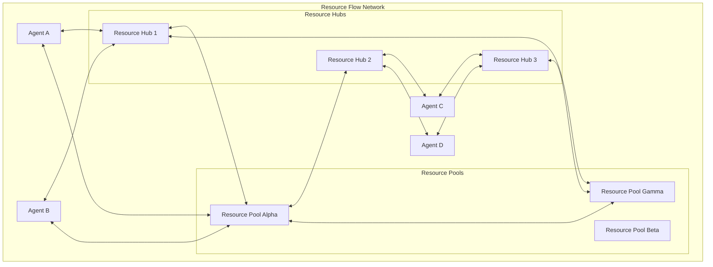
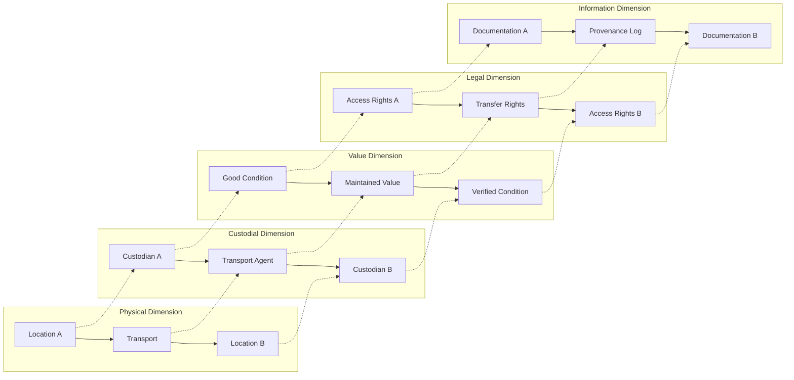

# Resource Transport/Flow Protocol (RTP-FP) Specification

**Version**: 0.2
**Date**: 2025-11-28
**Framework**: Holochain HDK 0.5.3 / hREA ValueFlows / JSON-LD 1.1
**License**: [Specify License]

## Abstract

The Resource Transport/Flow Protocol (RTP-FP) is a multi-dimensional protocol designed to facilitate low-friction resource flows in commons-based economies. Built on the foundation of ValueFlows semantic standards and JSON-LD interoperability, RTP-FP extends distributed economic resource management with five-dimensional transport tracking and PPR-based governance. Unlike static transfer protocols focused on ownership change, RTP-FP emphasizes the continuous movement, mutualization, and co-stewardship of shared resources throughout their complete lifecycle.

## 1. Fundamental Concepts

### 1.1 ValueFlows Foundation & JSON-LD Integration

#### 1.1.1 Semantic Web Foundation

RTP-FP is built upon the ValueFlows RDF specification (https://w3id.org/valueflows/ont/vf), providing a mature, standardized vocabulary for distributed economic networks. This foundation enables:

- **Standards Compliance**: Direct compatibility with existing ValueFlows implementations and tools
- **Semantic Interoperability**: Machine-readable relationships and validation rules
- **Cross-System Integration**: Seamless data exchange with supply chain and ERP systems
- **Network Effects**: Access to growing ValueFlows ecosystem and tooling

#### 1.1.2 JSON-LD 1.1 Implementation

RTP-FP utilizes JSON-LD 1.1 for semantic data serialization, providing:

```json
{
  "@context": [
    "https://w3id.org/valueflows/contexts/vf.jsonld",
    "https://nondominium.org/contexts/rtp.jsonld",
    "https://nondominium.org/contexts/ppr.jsonld"
  ],
  "@id": "rtp:resource-flow-123",
  "@type": ["vf:EconomicEvent", "rtp:ResourceFlowEvent"],
  "vf:action": "vf:transport-custody",
  "vf:provider": "did:hc:transport-agent-1",
  "vf:receiver": "did:hc:resource-custodian-2",
  "rtp:transportDimensions": {
    "rtp:physical": {
      "@type": "rtp:PhysicalDimension",
      "vf:currentLocation": {
        "@type": "vf:SpatialThing",
        "vf:lat": 45.5217,
        "vf:long": -73.6168
      }
    },
    "rtp:custodial": {
      "@type": "rtp:CustodialDimension",
      "rtp:custodyChain": ["did:hc:agent-1", "did:hc:agent-2"]
    }
  }
}
```

#### 1.1.3 Hybrid Architecture Pattern

**Internal Storage**: Native Holochain structs for performance

```rust
pub struct EconomicResource {
    // Holochain-native storage
    pub conforms_to: ActionHash,
    pub accounting_quantity: f64,
    pub primary_accountable: AgentPubKey,

    // JSON-LD semantic mapping
    pub vf_action: String,  // "vf:transport-custody"
    pub vf_resource_classified_as: Vec<String>,
}

impl EconomicResource {
    pub fn to_json_ld(&self) -> Result<Value, SerializationError> {
        // Convert to JSON-LD with RTP-FP context
    }
}
```

**External Interface**: JSON-LD serialization for interoperability

- REST APIs expose JSON-LD with ValueFlows + RTP-FP contexts
- Semantic validation using SHACL shapes
- Cross-system compatibility with existing standards

### 1.2 Transport vs Transfer Paradigm

**Traditional Transfer Protocol**:

- Linear ownership change: A → B
- Static endpoint focus
- Private ownership model
- Single transaction view

**Resource Transport/Flow Protocol**:

- Multi-dimensional flow: A ↔ Network ↔ B ↔ Network...
- Continuous lifecycle perspective
- Commons-based stewardship
- Multi-agent participation view

### 1.2 Core Principles

1. **Non-Linear Resource Flows**: Resources don't follow supply chains but participate in resource flows within commons networks
2. **Custodial Stewardship**: Resources have custodians, not owners, with responsibilities and benefits
3. **Multi-Dimensional Tracking**: Simultaneous tracking across physical, custodial, value, legal, and information dimensions
4. **Lifecycle Completeness**: End-to-end management from creation through decommissioning
5. **Low-Friction Movement**: Minimal transaction overhead for shared resource circulation

## 2. Multi-Dimensional Resource Flow Model

### 2.1 Five Transport Dimensions

#### 2.1.1 Physical Dimension

- **Definition**: Resource movement through space
- **Tracking**: Location, environmental conditions, transport status
- **Data Sources**: GPS, RFID, manual check-ins
- **Holochain Implementation**: `EconomicEvent` with location metadata

#### 2.1.2 Custodial Dimension

- **Definition**: Resource changes hands/stewards
- **Tracking**: Current custodian, custodial history, responsibility chains
- **Data Sources**: PPR receipts, commitment fulfillment
- **Holochain Implementation**: `EconomicEvent` with agent relationship links

#### 2.1.3 Value Dimension

- **Definition**: Resource's utility/purpose transforms
- **Tracking**: Resource condition, value changes, usage patterns
- **Data Sources**: Inspection reports, usage logs, performance metrics
- **Holochain Implementation**: `EconomicResource` state updates with `ResourceSpecification`

#### 2.1.4 Legal Dimension

- **Definition**: Rights and responsibilities shift
- **Tracking**: Access rights, usage permissions, compliance status
- **Data Sources**: Smart contracts, governance rules, PPR compliance
- **Holochain Implementation**: Commitment/claim validation with governance rules

#### 2.1.5 Information Dimension

- **Definition**: Data and metadata flows with the resource
- **Tracking**: Documentation, history, provenance, maintenance records
- **Data Sources**: Digital twins, blockchain entries, documentation
- **Holochain Implementation**: Link-based information architecture using DHT

### 2.2 Non-Linear Flow Patterns

#### 2.2.1 Traditional Supply Chain Flow


#### 2.2.2 Resource Flow Network Pattern



#### 2.2.3 Multi-Dimensional Resource Flow Example



**Key Characteristics:**

- **Dynamic**: Resources can flow through multiple paths simultaneously
- **Circular**: Resources return to pools for redistribution
- **Multi-path**: Multiple agents can access resources through different routes
- **Network-based**: No single point of failure or control

## 3. Protocol Architecture

### 3.1 Holochain Integration

#### 3.1.1 DNA/Zome Distribution

- **zome_person**: Agent identity, roles, custodial relationships
- **zome_resource**: Resource specifications, lifecycle management
- **zome_gouvernance**: PPR issuance, validation, governance rules
- **zome_semantic**: JSON-LD serialization, context management, external API

### 3.1.2 JSON-LD Rust Implementation

#### 3.1.2.1 Dependency Integration

```toml
[dependencies]
json-ld = "0.21"
iref = "3.1"
rdf-types = "0.22"
contextual = "0.3"
static-iref = "0.3"
```

#### 3.1.2.2 Context Management

```rust
use json_ld::{JsonLdProcessor, RemoteDocument, RemoteDocumentReference};
use static_iref::iri;

pub struct RtpContextManager {
    vocabulary: IndexVocabulary,
    loader: FsLoader,
}

impl RtpContextManager {
    pub fn new() -> Self {
        let mut loader = FsLoader::default();
        // Mount local contexts
        loader.mount(
            iri!("https://nondominium.org/contexts/").to_owned(),
            "contexts/"
        );
        loader.mount(
            iri!("https://w3id.org/valueflows/contexts/").to_owned(),
            "vendor/valueflows-contexts/"
        );

        Self {
            vocabulary: IndexVocabulary::new(),
            loader,
        }
    }

    pub async fn serialize_rtp_event(&mut self, event: &ResourceFlowEvent) -> Result<Value, SerializationError> {
        let json_ld_doc = event.to_json_ld_document()?;

        // Compact with RTP-FP context
        let compacted = json_ld_doc
            .compact_with(
                &RemoteDocumentReference::Iri(self.vocabulary.insert(
                    iri!("https://nondominium.org/contexts/rtp.jsonld")
                )),
                &mut self.vocabulary,
                &mut self.loader
            )
            .await?;

        Ok(compacted.into_serializable())
    }
}
```

#### 3.1.2.3 Semantic Validation with SHACL

```rust
use json_ld::expansion::ExpandedDocument;
use rdf_types::vocabulary::IriVocabularyMut;

pub struct RtpValidator {
    vocabulary: IndexVocabulary,
    governance_shapes: HashMap<String, NodeShape>,
}

impl RtpValidator {
    pub async fn validate_transport_event(&self, event: &ExpandedDocument) -> ValidationResult {
        // Validate against ValueFlows base shapes
        let vf_validation = self.validate_against_shape("vf:EconomicEvent", event)?;

        // Validate against RTP-FP specific shapes
        let rtp_validation = self.validate_against_shape("rtp:ResourceFlowEvent", event)?;

        // Apply governance rules
        let governance_validation = self.apply_governance_rules(event)?;

        ValidationResult::combine(vec![vf_validation, rtp_validation, governance_validation])
    }
}
```

#### 3.1.2 DHT Architecture Benefits

- **Agent-Centric Views**: Each agent maintains their perspective of resource flows
- **Multi-Source Truth**: No single point of failure, distributed validation
- **Cross-DNA Coordination**: Multiple graphs in unified network
- **Privacy Preservation**: Private entries with public validation capabilities

### 3.2 PPR Integration

#### 3.2.1 Transport-Specific Receipts

**3.2.1.1 Resource Creation & Validation**

```
Generated Receipts (2 total):
1. Creator Agent: "successful resource contribution" receipt
2. Validator Agent: "network validation performed" receipt
```

**3.2.1.2 Custody Transfer Events**

```
Generated Receipts (2 total):
1. Outgoing Custodian: "responsible custody transfer" receipt
2. Incoming Custodian: "custody acceptance" receipt
```

**3.2.1.3 Transport Service Events**

```
Commitment Phase (2 receipts):
1. Transport Agent: "transport commitment accepted" receipt
2. Custodian Agent: "good faith transfer" receipt

Fulfillment Phase (2 receipts):
1. Transport Agent: "transport fulfillment completed" receipt
2. Resource Recipient: "custody acceptance" receipt
```

#### 3.2.2 Role Chaining Support

- Multi-role agents (transport + maintenance + storage credentials)
- Action chaining (receive → transport → repair → transport → deliver)
- Self-managed intermediate steps
- Atomic transaction treatment

## 4. Protocol Operations

### 4.1 Resource Lifecycle Phases

#### 4.1.1 Genesis Phase - Network Entry

- Resource creation and validation
- Initial PPR receipt generation
- Resource specification registration
- Commons pool assignment

#### 4.1.2 Active Use Phase - Resource Circulation

- Custody transfers between agents
- Usage tracking and condition monitoring
- Value exchange and compensation
- Information flow maintenance

#### 4.1.3 Service Phase - Maintenance & Enhancement

- Maintenance service cycles
- Repair and upgrade operations
- Specialized service coordination
- Quality assurance validation

#### 4.1.4 End-of-Life Phase - Responsible Decommissioning

- End-of-life declaration and validation
- Multi-validator confirmation (2-3 experts)
- Challenge period (7-14 days)
- Final disposal or recycling

### 4.2 Low-Friction Design Patterns

#### 4.2.1 Implicit Resource Validation

- Resource validation implicit through agent validation
- No separate validation receipts for standard transfers
- PPR-based agent reliability assessment

#### 4.2.2 Bi-directional Receipt Generation

- Exactly 2 receipts per economic interaction
- Mutual acknowledgment and responsibility
- Cumulative reputation building

#### 4.2.3 Good Faith Transfers

- Resource transfer to service providers based on commitment
- Minimal validation overhead for trusted agents
- Atomic commitment/fulfillment cycles

## 5. Data Structures

### 5.1 Resource Flow Event with JSON-LD Integration

#### 5.1.1 Hybrid Storage Structure

```rust
pub struct ResourceFlowEvent {
    // Core ValueFlows fields (DHT storage)
    pub action: Action,                    // Maps to vf:action
    pub resource: ResourceHash,           // Maps to vf:resourceInventoriedAs
    pub provider: AgentPubKey,            // Maps to vf:provider
    pub receiver: AgentPubKey,            // Maps to vf:receiver
    pub has_point_in_time: Timestamp,     // Maps to vf:hasPointInTime
    pub has_duration: Option<Duration>,   // Maps to vf:hasDuration

    // JSON-LD semantic mapping (external interface)
    pub vf_action: String,                // e.g., "vf:transport-custody"
    pub vf_accountable_effect: String,    // e.g., "vf:AccountableEffect"
    pub vf_location_effect: String,       // e.g., "vf:LocationEffect"

    // Multi-dimensional tracking (RTP-FP extension)
    pub transport_dimensions: TransportDimensions,

    // PPR integration
    pub participation_receipts: Vec<ReceiptHash>,
    pub commitment_fulfillment: Option<CommitmentHash>,
}

impl ResourceFlowEvent {
    pub fn to_json_ld(&self) -> Result<Value, SerializationError> {
        Ok(json!({
            "@context": [
                "https://w3id.org/valueflows/contexts/vf.jsonld",
                "https://nondominium.org/contexts/rtp.jsonld",
                "https://nondominium.org/contexts/ppr.jsonld"
            ],
            "@id": format!("rtp:transport-event-{}", uuid::Uuid::new_v4()),
            "@type": ["vf:EconomicEvent", "rtp:ResourceFlowEvent"],
            "vf:action": self.vf_action,
            "vf:accountableEffect": self.vf_accountable_effect,
            "vf:locationEffect": self.vf_location_effect,
            "vf:provider": format!("did:hc:{}", self.provider.to_string()),
            "vf:receiver": format!("did:hc:{}", self.receiver.to_string()),
            "vf:hasPointInTime": self.has_point_in_time.as_secs(),
            "rtp:transportDimensions": self.transport_dimensions.to_json_ld()?,
            "rtp:pprReceipts": self.participation_receipts.iter()
                .map(|r| format!("did:hc:receipt:{}", r.to_string()))
                .collect::<Vec<_>>()
        }))
    }
}
```

#### 5.1.2 Transport Dimensions Structure

```rust
#[derive(Debug, Clone)]
pub struct TransportDimensions {
    pub physical: PhysicalDimension,
    pub custodial: CustodialDimension,
    pub value: ValueDimension,
    pub legal: LegalDimension,
    pub information: InformationDimension,
}

impl TransportDimensions {
    pub fn to_json_ld(&self) -> Result<Value, SerializationError> {
        Ok(json!({
            "rtp:physical": self.physical.to_json_ld()?,
            "rtp:custodial": self.custodial.to_json_ld()?,
            "rtp:value": self.value.to_json_ld()?,
            "rtp:legal": self.legal.to_json_ld()?,
            "rtp:information": self.information.to_json_ld()?
        }))
    }
}

#[derive(Debug, Clone)]
pub struct PhysicalDimension {
    pub location: Option<Location>,
    pub transport_method: TransportMethod,
    pub environmental_conditions: Option<EnvironmentalData>,
    pub timestamp: Timestamp,
}

impl PhysicalDimension {
    pub fn to_json_ld(&self) -> Result<Value, SerializationError> {
        let mut json = json!({
            "@type": "rtp:PhysicalDimension",
            "rtp:transportMethod": self.transport_method.to_string(),
            "rtp:timestamp": self.timestamp.as_secs()
        });

        if let Some(location) = &self.location {
            json["vf:currentLocation"] = json!({
                "@type": "vf:SpatialThing",
                "vf:lat": location.latitude,
                "vf:long": location.longitude,
                "vf:mappableAddress": location.address.clone()
            });
        }

        if let Some(env) = &self.environmental_conditions {
            json["rtp:environmentalConditions"] = json!(env.to_json_ld()?);
        }

        Ok(json)
    }
}
```

### 5.2 Resource Value State

```rust
pub struct ResourceValueState {
    pub condition: ResourceCondition,
    pub utilization_rate: f64,
    pub maintenance_status: MaintenanceStatus,
    pub current_valuation: Option<EconomicValue>,
    pub depreciation_factor: f64,
    pub usage_metrics: UsageMetrics,
}
```

### 5.3 Transport Path

```rust
pub struct TransportPath {
    pub resource: ResourceHash,
    pub journey_segments: Vec<JourneySegment>,
    pub current_status: TransportStatus,
    pub estimated_completion: Option<Timestamp>,
    pub risk_factors: Vec<RiskFactor>,
    pub environmental_conditions: Option<EnvironmentalData>,
}

pub struct JourneySegment {
    pub from_agent: AgentPubKey,
    pub to_agent: AgentPubKey,
    pub transport_method: TransportMethod,
    pub start_time: Timestamp,
    pub completion_time: Option<Timestamp>,
    pub conditions: SegmentConditions,
}
```

## 6. Validation & Governance Architecture

### 6.1 Multi-Layered Validation Pipeline

RTP-FP implements a comprehensive five-layer validation system that ensures data integrity, governance compliance, and trust establishment across all resource flows.

#### 6.1.1 Layer 1: Semantic Validation (JSON-LD/SHACL)

**Purpose**: Validate data structure, relationships, and compliance with ValueFlows and RTP-FP ontologies.

```rust
// SHACL Shape for Resource Flow Event Validation
pub const RTP_TRANSPORT_EVENT_SHAPE: &str = r#"
@prefix rtp: <https://nondominium.org/ontology/rtp#>
@prefix vf: <https://w3id.org/valueflows/ont/vf#>
@prefix sh: <http://www.w3.org/ns/shacl#>

[
  a sh:NodeShape ;
  sh:targetClass rtp:ResourceFlowEvent ;
  sh:property [
    sh:path vf:action ;
    sh:in (vf:transport-custody vf:transfer-custody vf:move) ;
    sh:minCount 1 ;
    sh:severity sh:Violation
  ] ;
  sh:property [
    sh:path vf:provider ;
    sh:nodeKind sh:IRI ;
    sh:minCount 1 ;
    sh:severity sh:Violation
  ] ;
  sh:property [
    sh:path vf:receiver ;
    sh:nodeKind sh:IRI ;
    sh:minCount 1 ;
    sh:severity sh:Violation
  ] ;
  sh:property [
    sh:path rtp:transportDimensions ;
    sh:node rtp:TransportDimensionsShape ;
    sh:minCount 1 ;
    sh:severity sh:Violation
  ]
]
"#;

pub struct SemanticValidator {
    shape_registry: HashMap<String, String>,
    json_ld_processor: JsonLdProcessor,
}

impl SemanticValidator {
    pub async fn validate_resource_flow(&self, event: &Value) -> SemanticValidationResult {
        // Expand JSON-LD for semantic analysis
        let expanded = self.json_ld_processor.expand(event).await?;

        // Validate against SHACL shapes
        let shape_validation = self.validate_against_shapes(&expanded)?;

        SemanticValidationResult {
            is_valid: shape_validation.conforms(),
            errors: shape_validation.violations(),
            warnings: shape_validation.warnings(),
        }
    }
}
```

#### 6.1.2 Layer 2: Business Rule Validation (RTP-FP Governance)

**Purpose**: Validate RTP-FP specific business rules, multi-dimensional consistency, and governance compliance.

```rust
pub struct RtpBusinessValidator {
    governance_rules: HashMap<String, GovernanceRule>,
    reputation_engine: PprReputationEngine,
    dimensional_validator: DimensionalConsistencyValidator,
}

impl RtpBusinessValidator {
    pub fn validate_transport_event(&self, event: &ResourceFlowEvent) -> BusinessValidationResult {
        let mut result = BusinessValidationResult::new();

        // Validate bi-directional receipt requirement (exactly 2 receipts per interaction)
        if !self.has_bidirectional_receipts(event) {
            result.add_error("MISSING_BIDIRECTIONAL_RECEIPTS",
                "RTP-FP requires exactly 2 receipts per economic interaction");
        }

        // Validate multi-dimensional consistency
        let dimensional_result = self.dimensional_validator.validate_consistency(event);
        if !dimensional_result.is_consistent() {
            result.add_errors(dimensional_result.errors());
        }

        // Validate reputation requirements for participants
        for participant in event.participants() {
            if !self.reputation_engine.validate_participant(participant) {
                result.add_error("INSUFFICIENT_REPUTATION",
                    &format!("Agent {} has insufficient reputation for this operation", participant));
            }
        }

        // Apply governance rules
        let rule_results = self.apply_governance_rules(event);
        result.extend(rule_results);

        result
    }

    fn validate_bidirectional_receipts(&self, event: &ResourceFlowEvent) -> bool {
        let provider_receipts = event.get_receipts_from_provider();
        let receiver_receipts = event.get_receipts_from_receiver();

        provider_receipts.len() == 1 && receiver_receipts.len() == 1
    }
}
```

#### 6.1.3 Layer 3: Cryptographic Validation (Holochain)

**Purpose**: Validate agent signatures, capability-based access, and data integrity through Holochain's cryptographic infrastructure.

```rust
pub struct HolochainValidator {
    agent_registry: AgentRegistry,
    capability_manager: CapabilityManager,
}

impl HolochainValidator {
    pub fn validate_signatures(&self, event: &ResourceFlowEvent) -> CryptoValidationResult {
        let mut result = CryptoValidationResult::new();

        // Validate provider signature
        if !self.agent_registry.verify_signature(
            &event.provider,
            &event.provider_signature
        )? {
            result.add_error("INVALID_PROVIDER_SIGNATURE");
        }

        // Validate receiver signature
        if !self.agent_registry.verify_signature(
            &event.receiver,
            &event.receiver_signature
        )? {
            result.add_error("INVALID_RECEIVER_SIGNATURE");
        }

        // Validate PPR receipt signatures
        for receipt in &event.participation_receipts {
            if !self.validate_ppr_signature(receipt)? {
                result.add_error("INVALID_PPR_SIGNATURE");
            }
        }

        result
    }

    pub fn validate_capabilities(&self, agent: &AgentPubKey, action: &str) -> Result<bool, CryptoError> {
        self.capability_manager.check_capability(agent, action)
    }
}
```

#### 6.1.4 Layer 4: Cross-System Validation

**Purpose**: Validate compliance with external regulations, standards, and cross-system requirements.

```rust
pub struct CrossSystemValidator {
    compliance_checker: ComplianceChecker,
    external_standards: ExternalStandardsRegistry,
}

impl CrossSystemValidator {
    pub async fn validate_external_compliance(&self, event: &ResourceFlowEvent) -> CrossSystemResult {
        let mut result = CrossSystemResult::new();

        // Regulatory compliance (environmental, safety, etc.)
        let regulatory_result = self.compliance_checker.check_regulatory_compliance(event).await?;
        if !regulatory_result.is_compliant() {
            result.add_violations(regulatory_result.violations());
        }

        // Supply chain standards (GS1, schema.org, etc.)
        let standards_result = self.external_standards.validate_standards_compliance(event).await?;
        if !standards_result.is_compliant() {
            result.add_violations(standards_result.violations());
        }

        result
    }
}
```

#### 6.1.5 Layer 5: Social/Reputation Validation (PPR System)

**Purpose**: Validate agent reputation, community trust, and social governance mechanisms.

```rust
pub struct ReputationValidator {
    reputation_calculator: ReputationCalculator,
    community_governance: CommunityGovernance,
}

impl ReputationValidator {
    pub fn validate_social_consensus(&self, event: &ResourceFlowEvent) -> ReputationResult {
        let mut result = ReputationResult::new();

        // Check overall social consensus
        let consensus_score = self.community_governance.calculate_consensus_score(event);
        if consensus_score < MINIMUM_CONSENSUS_THRESHOLD {
            result.add_error("INSUFFICIENT_SOCIAL_CONSENSUS");
        }

        // Validate individual agent reputations
        for participant in event.participants() {
            let reputation = self.reputation_calculator.calculate_reputation(participant);
            if reputation < MINIMUM_REPUTATION_THRESHOLD {
                result.add_error(&format!("LOW_REPUTATION_{}", participant));
            }
        }

        result
    }
}
```

### 6.2 Five-Dimensional Governance Model

#### 6.2.1 Physical Dimension Governance

**Scope**: Resource movement through space, location tracking, environmental conditions.

```rust
pub struct PhysicalDimensionGovernance {
    location_validator: LocationValidator,
    environmental_monitor: EnvironmentalMonitor,
    transport_authority: TransportAuthority,
}

impl PhysicalDimensionGovernance {
    pub fn validate_physical_dimension(&self, dimension: &PhysicalDimension) -> PhysicalResult {
        let mut result = PhysicalResult::new();

        // Location validation with multiple source verification
        if let Some(location) = &dimension.location {
            let location_verification = self.location_validator.verify_with_multiple_sources(location)?;
            if !location_verification.is_verified() {
                result.add_error("LOCATION_VERIFICATION_FAILED");
            }
        }

        // Environmental condition validation for sensitive resources
        if let Some(env_conditions) = &dimension.environmental_conditions {
            let env_validation = self.environmental_monitor.validate_conditions(env_conditions)?;
            if !env_validation.within_specifications() {
                result.add_violations(env_validation.violations());
            }
        }

        // Transport method appropriateness validation
        let method_validation = self.transport_authority.validate_method(
            &dimension.transport_method,
            dimension.resource_type
        )?;
        if !method_validation.is_approved() {
            result.add_error("TRANSPORT_METHOD_NOT_APPROVED");
        }

        result
    }
}
```

**Physical Dimension Governance Rules**:

```json
{
  "@context": "https://nondominium.org/contexts/physical-governance.jsonld",
  "@type": "rtp:PhysicalGovernanceRule",
  "@id": "rtp:physical-location-verification",
  "rtp:ruleName": "Multi-Source Location Verification",
  "rtp:conditions": {
    "rtp:minimumVerificationSources": 2,
    "rtp:acceptableLocationMethods": [
      "gps",
      "rfid",
      "manual_checkin",
      "ip_geolocation"
    ],
    "rtp:locationAccuracyRequirement": "10m",
    "rtp:timestampValidationWindow": "PT5M"
  },
  "rtp:enforcement": {
    "rtp:automaticEnforcement": true,
    "rtp:humanReviewRequired": "sensitive_resources",
    "rtp:escalationConditions": ["location_discrepancy", "verification_failure"]
  }
}
```

#### 6.2.2 Custodial Dimension Governance

**Scope**: Resource custodial transfers, responsibility chains, access rights.

```rust
pub struct CustodialDimensionGovernance {
    custody_chain_validator: CustodyChainValidator,
    permission_manager: PermissionManager,
    transfer_authorizer: TransferAuthorizer,
}

impl CustodialDimensionGovernance {
    pub fn validate_custody_transfer(&self,
        from_agent: &AgentPubKey,
        to_agent: &AgentPubKey,
        resource: &ResourceHash,
        transfer: &CustodyTransfer) -> CustodyResult {

        // Validate outgoing custodian authority
        let from_permissions = self.permission_manager.get_permissions(from_agent, resource)?;
        if !from_permissions.can_transfer() {
            return Err(CustodyError::InsufficientPermissions);
        }

        // Validate incoming custodian eligibility
        let to_permissions = self.permission_manager.get_permissions(to_agent, resource)?;
        if !to_permissions.can_receive() {
            return Err(CustodyError::NotEligibleForCustody);
        }

        // Validate custody chain continuity
        let chain_validation = self.custody_chain_validator.validate_continuity(
            from_agent,
            to_agent,
            resource
        )?;
        if !chain_validation.is_continuous() {
            return Err(CustodyError::CustodyChainBreak);
        }

        // Authorize transfer with business rule validation
        self.transfer_authorizer.authorize_transfer(from_agent, to_agent, resource, transfer)
    }

    pub fn validate_custody_chain(&self, resource: &ResourceHash) -> CustodyChainResult {
        let chain = self.custody_chain_validator.get_full_chain(resource)?;

        // Validate no circular references
        if self.has_circular_references(&chain) {
            return Err(CustodyChainError::CircularReference);
        }

        // Validate all transfers have proper documentation
        for transfer in chain.iter() {
            if !self.has_complete_documentation(transfer) {
                return Err(CustodyChainError::IncompleteDocumentation);
            }
        }

        // Validate chain integrity against business rules
        self.validate_chain_integrity(&chain)
    }
}
```

#### 6.2.3 Value Dimension Governance

**Scope**: Resource condition, value changes, utilization metrics, depreciation.

```rust
pub struct ValueDimensionGovernance {
    condition_assessor: ConditionAssessor,
    value_tracker: ValueTracker,
    utilization_analyzer: UtilizationAnalyzer,
}

impl ValueDimensionGovernance {
    pub fn validate_value_state_change(&self,
        resource: &ResourceHash,
        old_state: &ValueState,
        new_state: &ValueState,
        justification: &ValueChangeJustification) -> ValueResult {

        // Validate condition assessment credibility
        let condition_validation = self.condition_assessor.validate_assessment(
            &new_state.condition,
            justification.condition_evidence()
        )?;
        if !condition_validation.is_credible() {
            return Err(ValueError::IncredibleConditionAssessment);
        }

        // Validate value change justification
        let justification_validation = self.validate_justification(old_state, new_state, justification)?;
        if !justification_validation.is_justified() {
            return Err(ValueError::UnjustifiedValueChange);
        }

        // Validate utilization metrics accuracy
        let utilization_validation = self.utilization_analyzer.validate_metrics(
            &new_state.utilization_metrics,
            resource
        )?;
        if !utilization_validation.is_accurate() {
            return Err(ValueError::InaccurateUtilizationMetrics);
        }

        Ok(ValueResult::Validated)
    }

    pub fn calculate_depreciation(&self, resource: &EconomicResource) -> DepreciationResult {
        let depreciation_schedule = self.value_tracker.get_depreciation_schedule(resource)?;

        // Apply time-based depreciation
        let time_depreciation = depreciation_schedule.calculate_time_depreciation(
            resource.age_in_days()
        )?;

        // Apply usage-based depreciation
        let usage_depreciation = depreciation_schedule.calculate_usage_depreciation(
            &resource.utilization_metrics
        )?;

        // Apply condition-based depreciation
        let condition_depreciation = depreciation_schedule.calculate_condition_depreciation(
            &resource.current_condition
        )?;

        DepreciationResult {
            total_depreciation: time_depreciation + usage_depreciation + condition_depreciation,
            breakdown: DepreciationBreakdown {
                time: time_depreciation,
                usage: usage_depreciation,
                condition: condition_depreciation,
            },
            remaining_value: resource.original_value - (time_depreciation + usage_depreciation + condition_depreciation),
        }
    }
}
```

#### 6.2.4 Legal Dimension Governance

**Scope**: Access rights, usage permissions, regulatory compliance, liability.

```rust
pub struct LegalDimensionGovernance {
    rights_manager: RightsManager,
    compliance_checker: ComplianceChecker,
    liability_manager: LiabilityManager,
    regulatory_monitor: RegulatoryMonitor,
}

impl LegalDimensionGovernance {
    pub fn validate_legal_permissions(&self,
        agent: &AgentPubKey,
        resource: &ResourceHash,
        proposed_action: &LegalAction) -> LegalResult {

        // Validate access rights
        let access_rights = self.rights_manager.get_access_rights(agent, resource)?;
        if !access_rights.permits_action(proposed_action) {
            return Err(LegalError::InsufficientAccessRights);
        }

        // Validate usage permissions
        let usage_permissions = self.rights_manager.get_usage_permissions(agent, resource)?;
        if !usage_permissions.permits_usage(proposed_action.usage_type()) {
            return Err(LegalError::InsufficientUsagePermissions);
        }

        // Validate regulatory compliance
        let compliance_result = self.compliance_checker.check_compliance(
            agent, resource, proposed_action
        )?;
        if !compliance_result.is_compliant() {
            return Err(LegalError::RegulatoryNonCompliance);
        }

        // Validate liability coverage
        let liability_coverage = self.liability_manager.check_coverage(
            agent, resource, proposed_action
        )?;
        if !liability_coverage.is_sufficient() {
            return Err(LegalError::InsufficientLiabilityCoverage);
        }

        Ok(LegalResult::Permitted)
    }

    pub fn validate_contractual_obligations(&self,
        agent: &AgentPubKey,
        resource: &ResourceHash,
        context: &ContractContext) -> ContractResult {

        let obligations = self.regulatory_monitor.get_contractual_obligations(
            agent, resource, context
        )?;

        for obligation in obligations {
            if !obligation.is_fulfilled() {
                return Err(ContractError::ObligationNotFulfilled {
                    obligation_id: obligation.id,
                    description: obligation.description,
                    remedy: obligation.required_remedy,
                });
            }
        }

        Ok(ContractResult::Compliant)
    }
}
```

#### 6.2.5 Information Dimension Governance

**Scope**: Documentation, provenance, digital twins, audit trails.

```rust
pub struct InformationDimensionGovernance {
    documentation_validator: DocumentationValidator,
    provenance_tracker: ProvenanceTracker,
    audit_trail_manager: AuditTrailManager,
    digital_twin_synchronizer: DigitalTwinSynchronizer,
}

impl InformationDimensionGovernance {
    pub fn validate_information_completeness(&self,
        resource: &ResourceHash,
        required_documents: &Vec<DocumentType>) -> InfoResult {

        let mut result = InfoResult::new();

        for doc_type in required_documents {
            let doc_status = self.documentation_validator.validate_document_status(
                resource, doc_type
            )?;

            if !doc_status.is_present_and_valid() {
                result.add_missing_document(doc_type, doc_status.required_by());
            }

            if doc_status.is_expired() {
                result.add_expired_document(doc_type, doc_status.expiry_date());
            }
        }

        result
    }

    pub fn validate_provenance_integrity(&self,
        resource: &ResourceHash,
        event_chain: &Vec<ResourceFlowEvent>) -> ProvenanceResult {

        let provenance = self.provenance_tracker.build_provenance_chain(resource, event_chain)?;

        // Validate chain continuity
        if !provenance.is_continuous() {
            return Err(ProvenanceError::ChainBreak {
                break_point: provenance.first_break_point(),
                missing_links: provenance.missing_links(),
            });
        }

        // Validate cryptographic integrity
        if !provenance.cryptographically_integrity() {
            return Err(ProvenanceError::IntegrityViolation {
                affected_events: provenance.compromised_events(),
            });
        }

        // Validate temporal consistency
        if !provenance.temporally_consistent() {
            return Err(ProvenanceError::TemporalInconsistency);
        }

        Ok(ProvenanceResult::Valid(provenance))
    }

    pub fn synchronize_digital_twin(&self,
        resource: &EconomicResource,
        physical_state: &PhysicalState) -> DigitalTwinResult {

        let sync_result = self.digital_twin_synchronizer.synchronize(
            resource, physical_state
        )?;

        if !sync_result.is_synchronized() {
            return Err(DigitalTwinError::SynchronizationFailed {
                discrepancies: sync_result.discrepancies(),
                resolution_required: sync_result.resolution_steps(),
            });
        }

        Ok(DigitalTwinResult::Synchronized(sync_result.digital_twin()))
    }
}
```

### 6.3 PPR-Based Reputation System

#### 6.3.1 Reputation Calculation Model

```rust
pub struct ReputationCalculator {
    receipt_analyzer: ReceiptAnalyzer,
    reputation_weights: ReputationWeights,
    decay_calculator: DecayCalculator,
    community_feedback: CommunityFeedback,
}

impl ReputationCalculator {
    pub fn calculate_reputation(&self, agent: &AgentPubKey, time_window: Duration) -> ReputationScore {
        // Gather receipt history
        let receipts = self.receipt_analyzer.get_receipts_in_window(agent, time_window);

        // Calculate base score from receipts
        let mut base_score = 0.0;
        let mut weight_sum = 0.0;

        for receipt in receipts {
            let performance_score = receipt.performance_metrics.overall_score();
            let weight = self.reputation_weights.weight_for(&receipt.claim_type);
            let decay_factor = self.decay_calculator.calculate_decay(
                receipt.timestamp,
                std::time::SystemTime::now()
            );

            base_score += performance_score * weight * decay_factor;
            weight_sum += weight * decay_factor;
        }

        let normalized_base_score = if weight_sum > 0.0 {
            base_score / weight_sum
        } else {
            DEFAULT_REPUTATION_SCORE
        };

        // Apply community feedback adjustments
        let feedback_adjustment = self.community_feedback.calculate_feedback_adjustment(agent);

        // Calculate final reputation score
        let final_score = (normalized_base_score + feedback_adjustment)
            .clamp(MINIMUM_REPUTATION_SCORE, MAXIMUM_REPUTATION_SCORE);

        ReputationScore {
            score: final_score,
            level: self.determine_reputation_level(final_score),
            receipt_count: receipts.len(),
            last_updated: std::time::SystemTime::now(),
            breakdown: ReputationBreakdown {
                base_score: normalized_base_score,
                feedback_adjustment,
                receipt_count: receipts.len(),
            },
        }
    }

    pub fn determine_validation_level(&self, agent: &AgentPubKey, operation: &Operation) -> ValidationLevel {
        let reputation = self.calculate_reputation(agent, DEFAULT_TIME_WINDOW);
        let required_threshold = self.reputation_weights.threshold_for(operation);

        match reputation.score {
            score if score >= 0.9 => ValidationLevel::Implicit,      // Expert agents
            score if score >= 0.75 => ValidationLevel::Standard,    // Trusted agents
            score if score >= 0.5 => ValidationLevel::Enhanced,    // Established agents
            score if score >= 0.25 => ValidationLevel::Restricted,  // Known agents
            _ => ValidationLevel::Supervised,                     // New/untrusted agents
        }
    }
}
```

#### 6.3.2 PPR Receipt System

```rust
#[derive(Debug, Clone, Serialize, Deserialize)]
pub struct PprReceipt {
    pub id: ReceiptId,
    pub claim_type: ClaimType,
    pub claimant: AgentPubKey,
    pub counterparty: AgentPubKey,
    pub performance_metrics: PerformanceMetrics,
    pub evidence: Vec<Evidence>,
    pub timestamp: Timestamp,
    pub cryptographic_proof: CryptographicProof,
    pub context: ReceiptContext,
}

impl PprReceipt {
    pub fn validate_receipt(&self) -> ReceiptValidationResult {
        let mut result = ReceiptValidationResult::new();

        // Validate cryptographic proof
        if !self.cryptographic_proof.is_valid() {
            result.add_error("INVALID_CRYPTOGRAPHIC_PROOF");
        }

        // Validate timestamp within acceptable window
        if !self.timestamp.is_recent(RECEIPT_VALIDITY_WINDOW) {
            result.add_error("TIMESTAMP_OUT_OF_RANGE");
        }

        // Validate evidence completeness
        let required_evidence = self.claim_type.required_evidence();
        for evidence_type in required_evidence {
            if !self.has_evidence_type(evidence_type) {
                result.add_error(&format!("MISSING_EVIDENCE_{:?}", evidence_type));
            }
        }

        // Validate performance metrics credibility
        if !self.performance_metrics.is_credible() {
            result.add_error("CREDIBLE_PERFORMANCE_METRICS");
        }

        result
    }

    pub fn extract_knowledge(&self) -> ExtractedKnowledge {
        ExtractedKnowledge {
            agent_reliability: self.calculate_reliability_score(),
            performance_patterns: self.extract_performance_patterns(),
            risk_factors: self.identify_risk_factors(),
            collaboration_effectiveness: self.calculate_collaboration_score(),
            expertise_indicators: self.identify_expertise_areas(),
        }
    }
}
```

#### 6.3.3 Bi-Directional Receipt Generation

```rust
pub struct ReceiptGenerator {
    template_registry: ReceiptTemplateRegistry,
    evidence_collector: EvidenceCollector,
    proof_generator: CryptographicProofGenerator,
}

impl ReceiptGenerator {
    pub async fn generate_bidirectional_receipts(&self,
        event: &ResourceFlowEvent,
        provider_context: &ReceiptContext,
        receiver_context: &ReceiptContext) -> ReceiptPair {

        // Generate provider receipt
        let provider_receipt = self.generate_receipt(
            &event.provider,
            &event.receiver,
            &event.action,
            provider_context,
            ReceiptRole::Provider
        ).await?;

        // Generate receiver receipt
        let receiver_receipt = self.generate_receipt(
            &event.receiver,
            &event.provider,
            &event.action,
            receiver_context,
            ReceiptRole::Receiver
        ).await?;

        // Validate receipt pair consistency
        self.validate_receipt_pair(&provider_receipt, &receiver_receipt)?;

        ReceiptPair {
            provider_receipt,
            receiver_receipt,
            generation_timestamp: std::time::SystemTime::now(),
            validation_status: ReceiptPairStatus::Valid,
        }
    }

    async fn generate_receipt(&self,
        claimant: &AgentPubKey,
        counterparty: &AgentPubKey,
        action: &Action,
        context: &ReceiptContext,
        role: ReceiptRole) -> Result<PprReceipt, ReceiptError> {

        // Get appropriate receipt template
        let template = self.template_registry.get_template(action, role)?;

        // Collect evidence
        let evidence = self.evidence_collector.collect_evidence(context).await?;

        // Calculate performance metrics
        let performance_metrics = self.calculate_performance_metrics(evidence.clone())?;

        // Generate cryptographic proof
        let cryptographic_proof = self.proof_generator.generate_proof(
            claimant,
            &template.claim_type,
            &evidence,
            &performance_metrics
        )?;

        Ok(PprReceipt {
            id: ReceiptId::generate(),
            claim_type: template.claim_type,
            claimant: *claimant,
            counterparty: *counterparty,
            performance_metrics,
            evidence,
            timestamp: std::time::SystemTime::now(),
            cryptographic_proof,
            context: context.clone(),
        })
    }
}
```

### 6.4 Governance Rule Engine

#### 6.4.1 Dynamic Rule Management

```rust
pub struct GovernanceRuleEngine {
    rule_registry: RuleRegistry,
    rule_applicator: RuleApplicator,
    rule_validator: RuleValidator,
    evolution_manager: RuleEvolutionManager,
}

impl GovernanceRuleEngine {
    pub fn apply_rules(&self, event: &ResourceFlowEvent) -> RuleApplicationResult {
        let mut result = RuleApplicationResult::new();

        // Determine applicable rules
        let applicable_rules = self.rule_registry.get_applicable_rules(event);

        for rule in applicable_rules {
            let rule_result = self.rule_applicator.apply_rule(rule, event);

            match rule_result.severity {
                RuleSeverity::Violation => {
                    result.add_violation(rule_result);
                }
                RuleSeverity::Warning => {
                    result.add_warning(rule_result);
                }
                RuleSeverity::Info => {
                    result.add_info(rule_result);
                }
            }
        }

        result
    }

    pub async fn evolve_rules(&mut self, community_feedback: &CommunityFeedback) -> RuleEvolutionResult {
        // Analyze patterns in rule violations
        let violation_patterns = self.rule_analyzer.analyze_violation_patterns()?;

        // Analyze community feedback
        let feedback_analysis = community_feedback.analyze_feedback_patterns().await?;

        // Generate rule evolution proposals
        let proposals = self.evolution_manager.generate_evolution_proposals(
            violation_patterns,
            feedback_analysis
        )?;

        // Community voting on proposals
        let voting_results = self.community_voting.process_proposals(proposals).await?;

        // Apply approved rule changes
        let applied_changes = self.rule_registry.apply_approved_changes(voting_results.approved_changes())?;

        RuleEvolutionResult {
            applied_changes,
            rejected_proposals: voting_results.rejected_proposals(),
            next_evolution_cycle: std::time::Duration::from_secs(86400 * 30), // 30 days
        }
    }
}
```

#### 6.4.2 Rule Definition and Enforcement

```json
{
  "@context": "https://nondominium.org/contexts/governance-rules.jsonld",
  "@type": "rtp:GovernanceRuleSet",
  "@id": "rtp:transport-governance-rules-v1",
  "rtp:rules": [
    {
      "@id": "rtp:rule-custody-transfer-001",
      "@type": "rtp:GovernanceRule",
      "rtp:ruleName": "Custody Transfer Requirements",
      "rtp:ruleCategory": "rtp:TransferValidation",
      "rtp:applicableTo": ["rtp:TransportCustody", "rtp:TransferCustody"],
      "rtp:conditions": {
        "rtp:minReputationScore": 0.7,
        "rtp:requiredReceipts": 2,
        "rtp:validationWindow": "PT24H",
        "rtp:challengePeriod": "P7D",
        "rtp:requiresCustodyChainVerification": true,
        "rtp:requiresPhysicalConditionVerification": true
      },
      "rtp:enforcement": {
        "rtp:automaticEnforcement": true,
        "rtp:humanEscalationConditions": [
          "reputation_below_threshold",
          "high_value_resource"
        ],
        "rtp:penaltyForViolation": {
          "rtp:reputationDecay": 0.1,
          "rtp:temporaryRestriction": "P30D",
          "rtp:additionalValidation": "enhanced"
        },
        "rtp:escalationProcedure": "multi_validator_consensus"
      },
      "rtp:exceptions": [
        {
          "rtp:condition": "emergency_situations",
          "rtp:alternativeRequirements": {
            "rtp:postEventValidation": true,
            "rtp:emergencyDocumentation": true,
            "rtp:communityNotification": true
          }
        },
        {
          "rtp:condition": "trusted_agent_network",
          "rtp:alternativeRequirements": {
            "rtp:minReputationScore": 0.9,
            "rtp:simplifiedValidation": true,
            "rtp:postEventAudit": true
          }
        }
      ]
    },
    {
      "@id": "rtp:rule-resource-lifecycle-002",
      "@type": "rtp:GovernanceRule",
      "rtp:ruleName": "Resource Lifecycle Management",
      "rtp:ruleCategory": "rtp:LifecycleManagement",
      "rtp:applicableTo": [
        "rtp:EndOfLifeDeclaration",
        "rtp:ResourceRetirement"
      ],
      "rtp:conditions": {
        "rtp:minValidatorCount": 2,
        "rtp:maxValidatorCount": 3,
        "rtp:validatorReputationThreshold": 0.8,
        "rtp:requiredDocumentation": [
          "end_of_life_justification",
          "disposal_method",
          "environmental_impact"
        ],
        "rtp:publicChallengePeriod": "P14D",
        "rtp:requiresExpertValidation": true
      },
      "rtp:enforcement": {
        "rtp:automaticEnforcement": false,
        "rtp:requiredMultiValidatorConsensus": true,
        "rtp:transparencyRequirement": "public_disclosure",
        "rtp:appealProcess": "community_governance_committee",
        "rtp:appealPeriod": "P21D"
      }
    }
  ],
  "rtp:ruleEvolution": {
    "rtp:version": "1.0",
    "rtp:lastUpdated": "2025-01-28T00:00:00Z",
    "rtp:nextReviewDate": "2025-04-28T00:00:00Z",
    "rtp:evolutionCriteria": [
      "violation_patterns_exceed_threshold",
      "community_feedback_saturation",
      "regulatory_changes",
      "technology_advancements"
    ]
  }
}
```

### 6.5 Challenge and Dispute Resolution

#### 6.5.1 Multi-Validator Consensus Mechanism

```rust
pub struct DisputeResolutionSystem {
    validator_registry: ValidatorRegistry,
    consensus_engine: ConsensusEngine,
    evidence_collector: EvidenceCollector,
    resolution_implementer: ResolutionImplementer,
}

impl DisputeResolutionSystem {
    pub async fn initiate_challenge(&self,
        disputed_event: &ResourceFlowEvent,
        challenger: &AgentPubKey,
        challenge_reason: &ChallengeReason) -> ChallengeResult {

        // Validate challenge legitimacy
        if !self.validate_challenge_legitimacy(challenger, disputed_event, challenge_reason)? {
            return Err(ChallengeError::InvalidChallenge);
        }

        // Select appropriate validators based on expertise and reputation
        let selected_validators = self.validator_registry.select_validators(
            disputed_event,
            MIN_VALIDATORS,
            MAX_VALIDATORS
        )?;

        // Collect evidence from all parties
        let evidence = self.evidence_collector.collect_challenge_evidence(
            disputed_event, challenger, selected_validators.clone()
        ).await?;

        // Conduct validator analysis and voting
        let voting_result = self.consensus_engine.conduct_validator_voting(
            selected_validators,
            evidence,
            disputed_event
        ).await?;

        // Calculate consensus
        let consensus = self.calculate_consensus(voting_result)?;

        if consensus.meets_threshold() {
            // Implement resolution
            let resolution = self.resolution_implementer.implement_resolution(
                disputed_event,
                consensus.resolution,
                consensus.explanation
            ).await?;

            ChallengeResult::Resolved {
                resolution,
                consensus_score: consensus.score,
                validator_votes: voting_result.votes,
                resolution_implementation: std::time::SystemTime::now(),
            }
        } else {
            // Escalate or continue gathering evidence
            ChallengeResult::Escalated {
                consensus_score: consensus.score,
                additional_evidence_required: consensus.additional_evidence_needed,
                escalation_path: self.determine_escalation_path(consensus),
            }
        }
    }

    fn calculate_consensus(&self, voting_result: &ValidatorVotingResult) -> ConsensusResult {
        let total_weight: f64 = voting_result.votes.iter()
            .map(|vote| vote.validator_reputation)
            .sum();

        let agreement_weight: f64 = voting_result.votes.iter()
            .filter(|vote| vote.vote_direction == VoteDirection::Agree)
            .map(|vote| vote.validator_reputation)
            .sum();

        let consensus_score = if total_weight > 0.0 {
            agreement_weight / total_weight
        } else {
            0.0
        };

        ConsensusResult {
            score: consensus_score,
            meets_threshold: consensus_score >= MINIMUM_CONSENSUS_THRESHOLD,
            resolution: self.determine_resolution(voting_result),
            explanation: self.generate_consensus_explanation(voting_result),
            additional_evidence_needed: self.identify_additional_evidence_needs(voting_result),
        }
    }
}
```

#### 6.5.2 Automated Pattern-Based Resolution

```rust
pub struct AutomatedResolutionEngine {
    pattern_analyzer: PatternAnalyzer,
    resolution_templates: ResolutionTemplateRegistry,
    machine_learning_predictor: MLPredictor,
}

impl AutomatedResolutionEngine {
    pub async fn analyze_and_resolve(&self,
        dispute: &DisputeCase) -> AutomatedResolutionResult {

        // Analyze dispute patterns
        let patterns = self.pattern_analyzer.identify_patterns(dispute)?;

        // Check for matching resolution templates
        if let Some(template) = self.resolution_templates.find_matching_template(patterns) {
            // Apply template-based resolution
            let resolution = template.apply_to_dispute(dispute)?;

            return Ok(AutomatedResolutionResult {
                resolution_type: ResolutionType::TemplateBased,
                confidence: template.confidence_score,
                resolution,
                explanation: template.explanation,
            });
        }

        // Use ML prediction for complex cases
        let prediction = self.machine_learning_predictor.predict_resolution(dispute).await?;

        if prediction.confidence >= MIN_ML_CONFIDENCE {
            let resolution = prediction.generate_resolution(dispute)?;

            Ok(AutomatedResolutionResult {
                resolution_type: ResolutionType::MLPredicted,
                confidence: prediction.confidence,
                resolution,
                explanation: prediction.explanation,
            })
        } else {
            // Escalate to human validators
            Ok(AutomatedResolutionResult {
                resolution_type: ResolutionType::RequiresHumanReview,
                confidence: prediction.confidence,
                resolution: None,
                explanation: "Insufficient confidence for automated resolution".to_string(),
            })
        }
    }
}
```

This comprehensive validation and governance architecture ensures that every resource flow in the RTP-FP network is validated across multiple dimensions, governed by clear and enforceable rules, and supported by robust reputation and dispute resolution mechanisms. The system balances automated efficiency with human oversight, ensuring both performance and reliability while maintaining the flexibility to evolve as the network grows and new challenges emerge.

## 7. Performance & Scalability

### 7.1 Optimization Strategies

- Implicit validation to reduce transaction overhead
- Batch receipt generation for high-frequency operations
- DHT sharding for large-scale resource networks
- Caching strategies for frequently accessed resource states

### 7.2 Network Effects

- Reputation-based network resilience
- Trust propagation through PPR chains
- Resource pool efficiency gains
- Cross-pool resource circulation

## 8. Integration Points

### 8.1 ValueFlows Semantic Foundation

#### 8.1.1 Direct Vocabulary Compatibility

RTP-FP leverages existing ValueFlows classes and properties:

- **Core Classes**: `vf:EconomicEvent`, `vf:EconomicResource`, `vf:Agent`
- **Actions**: `vf:transport-custody`, `vf:transfer-custody`, `vf:move`
- **Effects**: `vf:AccountableEffect`, `vf:LocationEffect`, `vf:OnhandEffect`
- **Relationships**: `vf:provider`, `vf:receiver`, `vf:primaryAccountable`

#### 8.1.2 Extended RTP-FP Ontology

```json
{
  "@context": {
    "rtp": "https://nondominium.org/ontology/rtp#",
    "ppr": "https://nondominium.org/ontology/ppr#",
    "vf": "https://w3id.org/valueflows/ont/vf#",
    "prov": "http://www.w3.org/ns/prov#",
    "xsd": "http://www.w3.org/2001/XMLSchema#"
  },
  "rtp:ResourceFlowEvent": {
    "@id": "rtp:ResourceFlowEvent",
    "@type": "rdfs:Class",
    "rdfs:subClassOf": ["vf:EconomicEvent"],
    "rdfs:comment": "A multi-dimensional resource transport event"
  },
  "rtp:PhysicalDimension": {
    "@id": "rtp:PhysicalDimension",
    "@type": "rdfs:Class",
    "rdfs:comment": "Physical movement tracking information"
  },
  "rtp:TransportMethod": {
    "@id": "rtp:TransportMethod",
    "@type": "rdfs:Class",
    "rdfs:comment": "Method of physical resource transport"
  }
}
```

### 8.2 Cross-System Interoperability

#### 8.2.1 Supply Chain Standards Bridge

```json
{
  "@context": [
    "https://nondominium.org/contexts/rtp.jsonld",
    "https://w3id.org/valueflows/contexts/vf.jsonld",
    {
      "gs1": "https://gs1.org/voc/",
      "schema": "https://schema.org/",
      "dcterms": "http://purl.org/dc/terms/",
      "traceability": "https://w3id.org/traceability/v1#"
    }
  ],
  "@type": ["vf:EconomicEvent", "rtp:ResourceFlowEvent", "schema:TrackAction"],
  "vf:resourceClassifiedAs": ["gs1:TradeItem", "schema:Product"],
  "gs1:gtin": "01234567890123",
  "traceability:batch": ["LOT-2025-001"],
  "dcterms:identifier": ["serial-XYZ-001"]
}
```

#### 8.2.2 External System Integration

- **IoT Device Data**: Ingest through standardized JSON-LD interfaces
- **ERP System Integration**: Direct ValueFlows compatibility enables business process alignment
- **Payment Systems**: Semantic representation of value flows and compensation
- **Regulatory Reporting**: Compliance through standard semantic formats

### 8.3 JSON-LD API Interfaces

#### 8.3.1 REST API Example

```rust
#[get("/resources/{id}")]
async fn get_resource_json_ld(
    path: Path<String>,
    state: Data<AppState>
) -> Result<HttpResponse, ApiError> {
    let resource_id = path.into_inner();

    // Retrieve from Holochain DHT
    let resource = state.holochain_client
        .get_resource(&resource_id)
        .await?;

    // Convert to JSON-LD
    let json_ld = resource.to_json_ld()?;

    Ok(HttpResponse::Ok()
        .content_type("application/ld+json")
        .json(json_ld))
}

#[post("/events")]
async fn create_transport_event(
    event_data: Json<Value>,
    state: Data<AppState>
) -> Result<HttpResponse, ApiError> {
    // Validate against SHACL shapes
    let validation = state.semantic_validator
        .validate_transport_event(&event_data)
        .await?;

    if !validation.is_valid() {
        return Err(ApiError::Validation(validation.errors));
    }

    // Convert to internal format
    let event = ResourceFlowEvent::from_json_ld(event_data.into_inner())?;

    // Store in Holochain DHT
    let event_hash = state.holochain_client
        .create_event(event)
        .await?;

    Ok(HttpResponse::Created()
        .content_type("application/ld+json")
        .json(json!({"eventHash": event_hash.to_string()})))
}
```

#### 8.3.2 Semantic Discovery Endpoints

```rust
#[get("/resources")]
async fn discover_resources(
    query: Query<ResourceQuery>,
    state: Data<AppState>
) -> Result<HttpResponse, ApiError> {
    // Use semantic query patterns
    let sparql_query = format!(r#"
        PREFIX vf: <https://w3id.org/valueflows/ont/vf#>
        PREFIX rtp: <https://nondominium.org/ontology/rtp#>

        SELECT ?resource ?location ?custodian WHERE {{
            ?resource a vf:EconomicResource .
            ?resource vf:currentLocation ?location .
            ?resource vf:primaryAccountable ?custodian .
            FILTER(?location = ?lat_long)
        }}
    "#);

    let results = state.semantic_store
        .query(&sparql_query)
        .await?;

    Ok(HttpResponse::Ok()
        .content_type("application/ld+json")
        .json(results))
}
```

## 9. Use Cases & Applications

### 9.1 Tool Libraries & Makerspaces

- Tool sharing and tracking across communities
- Maintenance scheduling and responsibility allocation
- Usage-based cost distribution
- Skill-building through hands-on access

### 9.2 Transportation Pools

- Vehicle sharing and fleet management
- Maintenance scheduling and cost allocation
- Route optimization and resource pooling
- Environmental impact tracking

### 9.3 Equipment Rental & Sharing

- Industrial equipment sharing networks
- Condition monitoring and predictive maintenance
- Insurance and liability management
- Cross-organizational resource optimization

### 9.4 Digital Resource Commons

- Software tool and service sharing
- Digital infrastructure pooling
- Knowledge and intellectual property commons
- Collaborative development resources

## 10. Future Extensions

### 10.1 Advanced Features

- AI-powered resource allocation optimization
- Automated maintenance scheduling and predictive care
- Smart contract integration for complex governance rules
- Cross-chain interoperability with other distributed networks

### 10.2 Protocol Evolution

- Resource type-specific extensions
- Geographic region adaptations
- Industry-specific compliance modules
- Environmental impact tracking integration

## 11. Implementation Roadmap

### Phase 0: ValueFlows Integration Foundation (v0.1)

**Strategic Prerequisite**: Establish semantic foundation

- Integrate ValueFlows contexts and vocabularies
- Create RTP-FP extensions as modular ontologies
- Map existing Holochain structures to ValueFlows classes
- Set up JSON-LD Rust crate integration (`json-ld = "0.21"`)
- Establish context management and vocabulary systems

### Phase 1: Core Protocol with JSON-LD (v0.2)

- Basic multi-dimensional flow tracking with semantic annotations
- JSON-LD serialization for external APIs
- PPR integration with ValueFlows compatibility
- Holochain zome implementation with ValueFlows mappings
- Basic SHACL validation shapes for governance rules

### Phase 2: Advanced Semantic Features (v0.5)

- Enhanced JSON-LD API endpoints with full context support
- Advanced SHACL validation and automated governance enforcement
- Role chaining and service orchestration with semantic reasoning
- Performance optimizations with context caching and lazy serialization
- Cross-system integration bridges (GS1, schema.org, traceability)

### Phase 3: Ecosystem Development (v1.0)

- Cross-network interoperability with ValueFlows ecosystem
- Advanced semantic reasoning for resource optimization
- AI-assisted resource allocation using semantic patterns
- Industry-specific extensions and compliance modules
- Real-time semantic validation and automated compliance

### Implementation Priorities

#### Critical Path Dependencies:

1. **ValueFlows Context Integration** - Must be completed first
2. **JSON-LD Rust Crate Integration** - Foundation for all external interfaces
3. **Hybrid Architecture Implementation** - Performance optimization
4. **Semantic Validation System** - Governance and compliance automation

#### Success Metrics:

- **Interoperability**: Seamless data exchange with ValueFlows-compliant systems
- **Performance**: <100ms JSON-LD serialization for typical resource events
- **Validation**: 100% semantic validation coverage for governance rules
- **Standards Compliance**: Full ValueFlows and JSON-LD 1.1 compliance

## 12. Conclusion

### Strategic Transformation Through Semantic Foundation

The Resource Transport/Flow Protocol represents a paradigm shift from static, ownership-based transfer protocols to dynamic, commons-based resource flow management. The integration of ValueFlows semantic standards and JSON-LD 1.1 interoperability transforms RTP-FP from an innovative protocol to a strategically essential foundation for the next economy.

### Key Strategic Advantages

**Semantic Interoperability**: Built on the mature ValueFlows RDF specification, RTP-FP gains immediate compatibility with existing economic network tools and standards, enabling seamless integration with supply chain systems, ERP platforms, and regulatory frameworks.

**Network Effects**: By leveraging JSON-LD and established semantic web standards, RTP-FP participates in the growing ValueFlows ecosystem, creating network effects that accelerate adoption and enable cross-platform resource flows.

**Technical Excellence**: The hybrid architecture pattern combines Holochain's performance-optimized DHT storage with JSON-LD's semantic richness, providing both efficiency and interoperability without compromising either.

**Future-Proof Design**: The modular ontology approach allows for industry-specific extensions while maintaining core protocol compatibility, ensuring RTP-FP can evolve with emerging standards and use cases.

### Implementation Imperative

The discovery of ValueFlows' comprehensive RDF specification makes JSON-LD adoption not just advantageous but strategically essential for RTP-FP's success. The perfect semantic alignment between ValueFlows and RTP-FP's multi-dimensional transport model provides an unprecedented opportunity for standards compliance and ecosystem integration.

### Vision Realization

The protocol's emphasis on stewardship over ownership, combined with comprehensive lifecycle management, multi-agent coordination, and semantic interoperability, provides the foundation for next-generation resource sharing networks that prioritize sustainability, accessibility, and collective benefit over individual accumulation.

Through its ValueFlows foundation and JSON-LD implementation, RTP-FP enables the emergence of truly interoperable, intelligent resource economies that can scale from local makerspaces to global commons networks while maintaining semantic consistency and governance integrity.

---

_This specification is a living document that will evolve through implementation experience and community feedback. Contributions and collaboration are welcomed to advance the protocol toward its vision of enabling truly sustainable and equitable resource sharing economies._
