# Resource Transport/Flow Protocol (RTP-FP) Specification

- **Version**: 0.2
- **Date**: 2025-01-28
- **Audience**: Stakeholders, Project Partners, Community Members
- **License**: [Specify License]

## Executive Summary

The Resource Transport/Flow Protocol (RTP-FP) is a new approach to resource sharing that transforms how we think about ownership and access in commons-based economies. Instead of focusing on buying, selling, and permanent transfers, RTP-FP creates a system where resources can flow freely between people who need them, with clear tracking of responsibilities and conditions.

**Key Innovation**: Resources have _custodians_ rather than _owners_, enabling continuous circulation and shared benefit rather than static possession.

## The Problem We're Solving

**Traditional Resource Management:**

- Resources sit unused 80% of the time
- High barriers to access (purchase costs, insurance, maintenance)
- Complex logistics for sharing between organizations
- No standardized way to track resource condition and history
- Trust issues prevent efficient sharing networks

**RTP-FP Solution:**

- Resources flow continuously to where they're needed most
- Low-friction access through reputation-based trust
- Complete lifecycle tracking across five dimensions
- Built-in governance and dispute resolution
- Standards-based interoperability with existing systems

## Core Concept: Transport vs Transfer

### Traditional Transfer (What We Do Today)

### Resource Flow (What RTP-FP Enables)

```mermaid
graph TB
    subgraph "Dynamic Resource Flow Network"
        A[👤 Custodian A<br/>Active Use]
        B[👤 Custodian B<br/>Active Use]
        C[👤 Custodian C<br/>Active Use]
        D[👤 Custodian D<br/>Active Use]

        subgraph "Resource Pools"
            R1[🔧 Tool Pool 1<br/>High Utilization]
            R2[🚗 Vehicle Pool<br/>Shared Access]
            R3[🏠 Facility Pool<br/>Community Use]
        end
    end

    A <--> R1
    B <--> R1
    C <--> R2
    D <--> R2
    R1 <--> R2
    R2 <--> R3
    R3 <--> R1

    A -.-> C
    B -.-> D
    C -.-> A
    D -.-> B
```

**Key Difference**: Instead of one person owning a resource that sits unused most of the time, resources move continuously between custodians who take responsibility for them during use periods.

## 1. Five-Dimensional Resource Tracking

RTP-FP tracks resources across five key dimensions simultaneously, providing complete visibility into every aspect of resource movement and use.

```mermaid
mindmap
  root((Five-Dimensional<br/>Resource Tracking))
    Physical Dimension
      📍 Location
        GPS Coordinates
        Facility Names
        Transport Routes
      🌡️ Environment
        Temperature
        Humidity
        Conditions
      🚛 Movement
        Transport Method
        Journey Status
    Custodial Dimension
      👤 Current Custodian
        Identity Verification
        Access Rights
        Responsibility
      🔗 Custody Chain
        Transfer History
        Handover Records
        Continuity Validation
      🔐 Permissions
        Access Levels
        Usage Rights
        Time Constraints
    Value Dimension
      ✅ Resource Condition
        Quality Assessment
        Damage Reports
        Performance Metrics
      📈 Utilization Tracking
        Usage Statistics
        Wear Patterns
        Efficiency Metrics
      💰 Economic Value
        Depreciation
        Maintenance Costs
        Market Value
    Legal Dimension
      ⚖️ Regulatory Compliance
        Safety Standards
        Industry Regulations
        Certification Requirements
      🛡️ Insurance Coverage
        Liability Protection
        Risk Assessment
        Coverage Limits
      📋 Usage Permissions
        License Types
        Usage Restrictions
        Legal Obligations
    Information Dimension
      📚 Documentation
        User Manuals
        Technical Specs
        Maintenance Records
      🔍 Provenance
        Complete History
        Previous Users
        Maintenance Log
      📋 Audit Trail
        Transaction Records
        Validation Evidence
        Compliance Proof
```

Each dimension works together to provide complete visibility and control over resource flows while maintaining proper governance and accountability.

### 1.1 Physical Dimension - Where is the Resource?

**What We Track**: Location, movement, environmental conditions

**Why It Matters**: Ensures resources are where they need to be and in proper condition

**Examples**: GPS coordinates, temperature sensors, humidity monitoring, transport method

**Real-World Example**: A medical equipment transport from hospital to clinic includes temperature monitoring throughout the journey to ensure sensitive equipment remains within safe environmental ranges.

### 1.2 Custodial Dimension - Who is Responsible?

**What We Track**: Current custodian, responsibility chain, access rights

**Why It Matters**: Clear accountability and proper resource stewardship

**Examples**: Custodian handover receipts, responsibility documentation, access permissions

**Real-World Example**: When a maker space passes a 3D printer to a community center, both parties sign digital receipts acknowledging the transfer of responsibility and the printer's current condition.

### 1.3 Value Dimension - What Condition is It In?

**What We Track**: Resource condition, depreciation, usage patterns

**Why It Matters**: Maintains resource value and enables fair cost sharing

**Examples**: Condition assessments, usage metrics, maintenance history, depreciation calculations

**Real-World Example**: A shared vehicle's value dimension tracks mileage, maintenance records, and wear patterns to determine fair usage costs and maintenance scheduling.

### 1.4 Legal Dimension - What Are the Rules?

**What We Track**: Usage permissions, regulatory compliance, liability

**Why It Matters**: Ensures legal compliance and proper risk management

**Examples**: Usage licenses, insurance coverage, regulatory requirements, liability limits

**Real-World Example**: Industrial equipment rental requires verification that the current custodian has proper training and insurance coverage for that equipment type.

### 1.5 Information Dimension - What's the History?

**What We Track**: Documentation, maintenance records, user manuals, provenance

**Why It Matters**: Complete transparency and knowledge preservation

**Examples**: Maintenance logs, user guides, repair history, upgrade documentation

**Real-World Example**: A shared scientific instrument includes complete calibration records, previous research results, and maintenance documentation for each new user.

## 2. Core Principles

### 2.1 Resource Circulation Over Static Ownership

**Principle**: Resources should flow continuously to where they create most value rather than sitting idle under single ownership.

**Impact**: Reduces waste, increases access, creates more efficient use of existing resources.

### 2.2 Custodial Stewardship Model

**Principle**: People are custodians responsible for resources during their use period, not permanent owners.

**Impact**: Creates shared responsibility while maintaining clear accountability and proper care.

### 2.3 Multi-Dimensional Transparency

**Principle**: Complete visibility across all aspects of resource movement and condition.

**Impact**: Builds trust, enables proper valuation, ensures compliance, maintains knowledge.

### 2.4 Lifecycle Completeness

**Principle**: Resources are managed from creation through decommissioning, with responsible end-of-life handling.

**Impact**: Environmental responsibility, complete cost accounting, sustainable resource management.

### 2.5 Low-Friction Access

**Principle**: Minimize barriers to resource sharing while maintaining proper governance.

**Impact**: Increased resource utilization, reduced administrative overhead, faster circulation.

## 3. How Resource Flow Networks Work

### 3.1 Traditional Supply Chain vs Resource Flow Network

**Traditional Supply Chain** (Linear, One-Way):

```mermaid
graph LR
    subgraph "Linear Supply Chain Model"
        F[🏭 Factory<br/>Production]
        W[📦 Warehouse<br/>Storage]
        R[🏪 Retailer<br/>Distribution]
        C[👤 Consumer<br/>Final Use]
    end

    F -- "Ship" --> W
    W -- "Distribute" --> R
    R -- "Sell" --> C

    subgraph "Waste Stream"
        W1["⚠️  Waste<br/>Factory"]
        W2["⚠️  Waste<br/>Warehouse"]
        W3["⚠️  Waste<br/>Retailer"]
        W4["⚠️  Waste<br/>Consumer"]
    end

    F -.-> W1
    W -.-> W2
    R -.-> W3
    C -.-> W4
```

**Resource Flow Network** (Circular, Multi-Directional):

```mermaid
graph TB
    subgraph "Circular Resource Flow Network"
        subgraph "Community Members"
            P1["👤 Alice<br/>Maker"]
            P2["👤 Bob<br/>Farmer"]
            P3["👤 Carol<br/>Educator"]
            P4["👤 David<br/>Technician"]
            P5["👤 Eve<br/>Artist"]
        end

        subgraph "Shared Resource Pools"
            T1["🔧 Tool Library<br/>High Utilization"]
            V1["🚗 Vehicle Fleet<br/>Smart Access"]
            F1["🏠 Facilities<br/>Flexible Use"]
            S1["💻 Equipment<br/>Specialized"]
            E1["🌱 Resources<br/>Seasonal"]
        end

        subgraph "Benefits"
            B1["💰 Cost Savings<br/>80% Reduction"]
            B2["🤝 Community<br/>Stronger Bonds"]
            B3["🌱 Sustainability<br/>Less Waste"]
            B4["📈 Efficiency<br/>Higher Utilization"]
        end
    end

    P1 <--> T1
    P1 <--> F1
    P2 <--> V1
    P2 <--> E1
    P3 <--> S1
    P3 <--> F1
    P4 <--> T1
    P4 <--> S1
    P5 <--> V1
    P5 <--> E1

    T1 <--> V1
    T1 <--> S1
    V1 <--> E1
    F1 <--> T1
    S1 <--> E1
    E1 <--> F1

    T1 -.-> B1
    V1 -.-> B2
    F1 -.-> B3
    S1 -.-> B4
    E1 -.-> B1
```

### 3.2 Network Effects

**As More Resources Join**:

- More variety available to all participants
- Reduced individual ownership needs
- Increased specialization possible
- Lower costs through shared infrastructure

**As More People Participate**:

- Higher resource utilization rates
- Better maintenance coverage
- More diverse skills and knowledge
- Stronger community relationships

## 4. Real-World Applications

### 4.1 Makerspaces & Tool Libraries

**Scenario**: Community workshops and fabrication labs sharing expensive equipment

**How RTP-FP Helps**:

- Tools move between different maker spaces based on project demand
- Complete maintenance history follows each tool
- Users build reputation through proper care and timely returns
- Insurance and liability handled through the protocol

**Benefits**: 80% reduction in individual tool costs, access to specialized equipment, skill-building opportunities

### 4.2 Transportation & Vehicle Sharing

**Scenario**: Community vehicle pools, commercial fleet sharing, rural transportation networks

**How RTP-FP Helps**:

- Vehicles flow to where they're needed most
- Complete maintenance and usage history
- Driver qualification verification
- Automated insurance and liability management

**Benefits**: Reduced individual car ownership, optimized fleet utilization, lower transportation costs

### 4.3 Agricultural Equipment Sharing

**Scenario**: Small farms sharing expensive equipment across growing seasons

**How RTP-FP Helps**:

- Equipment flows to farms during their peak seasons
- GPS tracking and condition monitoring
- Usage-based cost allocation
- Maintenance scheduling and coordination

**Benefits**: Access to expensive equipment without capital investment, optimized scheduling across regions

### 4.4 Disaster Response & Emergency Equipment

**Scenario**: Rapid deployment of emergency supplies and equipment to crisis areas

**How RTP-FP Helps**:

- Equipment flows to areas of highest need
- Complete chain of custody for accountability
- Condition verification for critical equipment
- Cross-organization coordination and trust

**Benefits**: Faster response times, better resource allocation, complete accountability for donated equipment

## 5. Governance & Trust Building

### 5.1 Reputation-Based Access

**How It Works**: Participants build reputation through successful resource custodianship. Higher reputation leads to:

- Access to more valuable resources
- Reduced validation requirements
- Greater decision-making influence
- Priority access during high-demand periods

### 5.2 Dispute Resolution

**Process**: When issues arise, the protocol provides:

- Automatic evidence collection from all five dimensions
- Community validator selection based on expertise
- Transparent resolution processes
- Appeal mechanisms for complex cases

### 5.3 Adaptive Governance

**Evolution**: Rules evolve based on community experience:

- Successful patterns become standard procedures
- Problematic areas receive additional oversight
- Community voting on rule changes
- Industry-specific adaptations emerge

## 6. Economic Benefits

### 6.1 Cost Reduction

**Direct Savings**:

- 70-90% reduction in individual ownership costs
- Shared maintenance and insurance expenses
- Reduced storage and facility costs
- Lower administrative overhead

**Indirect Benefits**:

- Access to higher-quality equipment
- Specialized equipment availability
- Professional maintenance services
- Better resource utilization

### 6.2 Community Wealth Building

**Economic Circulation**:

- Money stays within community longer
- Local expertise development
- Job creation in resource coordination
- Reduced dependence on external suppliers

### 6.3 Environmental Benefits

**Sustainability Impact**:

- Reduced resource consumption
- Lower carbon footprint through sharing
- Extended equipment lifespans
- Better end-of-life management

## 7. Technology Foundation

### 7.1 Standards-Based Approach

RTP-FP is built on established standards to ensure compatibility and interoperability:

**ValueFlows Integration**: Uses the mature ValueFlows vocabulary for economic activities, enabling compatibility with existing supply chain and ERP systems.

**JSON-LD Semantic Structure**: Implements structured data formats that machines can understand, enabling automated processing and validation.

**Distributed Architecture**: Leverages Holochain's peer-to-peer network for resilience and community ownership.

### 7.2 Key Technical Features

**Five-Dimensional Tracking**: All information captured across physical location, custodial responsibility, value condition, legal compliance, and documentation history.

**Privacy-Preserving Transparency**: Sensitive information remains private while validation and accountability are maintained through cryptographic proofs.

**Offline-First Design**: Systems continue functioning during network outages, syncing when connectivity is restored.

**Scalable Governance**: Rules and validation mechanisms that work for small communities and large industrial networks alike.

## 8. Implementation Journey

### 8.1 Resource Lifecycle in Practice

#### 8.1.1 Phase 1: Resources Join the Network

**What Happens**: New resources are registered, validated, and made available to the community.

**Process**:

- Resource owner contributes to the network
- Community validators verify resource condition and documentation
- Resource is tagged with appropriate sharing rules and requirements
- Resource becomes available in community pools

#### 8.1.2 Phase 2: Active Resource Circulation

**What Happens**: Resources flow between custodians based on need and availability.

**Process**:

- Community members request resources for specific projects
- System evaluates reputation and availability
- Resources are transferred with complete documentation
- Usage and condition are tracked throughout

#### 8.1.3 Phase 3: Maintenance and Care

**What Happens**: Resources receive regular maintenance and upgrades to maintain value.

**Process**:

- Scheduled maintenance based on usage patterns
- Community experts handle repairs and improvements
- All maintenance activities are documented
- Resource value and availability are updated accordingly

#### 8.1.4 Phase 4: Responsible End-of-Life

**What Happens**: Resources are decommissioned or recycled when no longer useful.

**Process**:

- Community evaluation of remaining useful life
- Multiple experts confirm end-of-life determination
- Responsible recycling or disposal is arranged
- Complete lifecycle documentation is archived

### 8.2 Trust and Reputation System

#### 8.2.1 Building Trust Through Participation

**How It Works**: Every successful resource transfer and proper care action builds a participant's reputation.

**Reputation Benefits**:

- Access to more valuable and specialized resources
- Reduced validation requirements for routine transfers
- Greater influence in community governance decisions
- Priority access during high-demand periods

#### 8.2.2 Mutual Acknowledgment System

**Process**: Every interaction requires confirmation from both parties involved.

**Benefits**:

- Clear evidence of successful transfers
- Automatic dispute resolution material
- Community-wide visibility into participation patterns
- Protection against false claims or misrepresentation

## 9. Getting Started

### 9.1 For Communities

**Starting a Resource Flow Network**:

1. **Identify Shared Resources**: Catalog equipment, tools, and facilities that could be shared
2. **Establish Community Rules**: Define access requirements, maintenance standards, and governance processes
3. **Launch Pilot Program**: Start with a small group of well-understood resources
4. **Scale Gradually**: Add more resources and participants based on early success

### 9.2 For Organizations

**Implementing RTP-FP**:

1. **Resource Audit**: Identify underutilized assets that could be shared internally or with partners
2. **Stakeholder Engagement**: Build support across departments for resource sharing initiatives
3. **Process Integration**: Adapt existing procurement and maintenance processes to support resource flows
4. **Measurement Systems**: Track utilization, cost savings, and environmental benefits

### 9.3 For Individuals

**Participating in Resource Networks**:

1. **Start Small**: Begin with low-value items to build reputation
2. **Learn the System**: Understand documentation requirements and community expectations
3. **Build Relationships**: Connect with other participants for collaborative opportunities
4. **Contribute Back**: Share knowledge and help improve network processes

## 10. Success Metrics

### 10.1 Economic Indicators

- **Resource Utilization Rate**: Percentage of time resources are in active use
- **Cost Savings**: Reduction in individual ownership and maintenance expenses
- **Access Improvement**: Increased availability of specialized equipment and tools
- **Value Retention**: Extended useful lifespan of shared resources

### 10.2 Community Impact

- **Participation Growth**: Number of active participants and resources in the network
- **Skill Development**: New capabilities developed through resource access
- **Collaboration Projects**: Number of initiatives enabled by resource sharing
- **Environmental Benefits**: Reduced consumption and waste generation

### 10.3 Quality Measures

- **Resource Condition**: Maintenance quality and care standards
- **User Satisfaction**: Participant experience and network effectiveness
- **Dispute Resolution**: Time and success rate for conflict resolution
- **Innovation**: New uses and applications discovered through sharing

## 11. Vision and Future

### 11.1 Transformative Impact

```mermaid
graph TB
    subgraph "Local Community Scale"
        subgraph "Neighborhood Resources"
            TL["🔧 Tool Library<br/>Community Owned"]
            CG["🌱 Community Garden<br/>Shared Equipment"]
            MW["🏠 Maker Space<br/>Specialized Tools"]
            VP["🚗 Vehicle Pool<br/>Shared Cars"]
        end

        subgraph "Community Benefits"
            B1["💰 Cost Savings<br/>80% Reduction"]
            B2["🤝 Stronger Bonds<br/>Collaboration"]
            B3["🌱 Sustainability<br/>Less Waste"]
        end
    end

    subgraph "Regional Network Scale"
        subgraph "Regional Hubs"
            RH1["🏭 Industrial Equipment<br/>Factory Sharing"]
            RH2["🚜 Agricultural Tools<br/>Farm Pool"]
            RH3["🏥 Medical Equipment<br/>Hospital Network"]
            RH4["🚒 Emergency Response<br/>Disaster Equipment"]
        end

        subgraph "Regional Benefits"
            RB1["📈 Economic Efficiency<br/>Resource Optimization"]
            RB2["🛡️ Resilience<br/>Crisis Response"]
            RB3["⚖️ Equity<br/>Equal Access"]
        end
    end

    subgraph "Global Commons Scale"
        subgraph "Global Networks"
            GN1["🌍 International Sharing<br/>Research Equipment"]
            GN2["💡 Knowledge Exchange<br/>Best Practices"]
            GN3["🔗 Standards Development<br/>Protocol Evolution"]
        end

        subgraph "Global Impact"
            GB1["🌿 Environmental<br/>Reduced Consumption"]
            GB2["🤝 Social Impact<br/>Community Building"]
            GB3["💱 Economic Impact<br/>New Models"]
        end
    end

    TL <--> RH2
    MW <--> RH1
    VP <--> RH3
    CG <--> RH4

    RH1 --> GN1
    RH2 --> GN1
    RH3 --> GN2
    RH4 --> GN3

    TL -.-> B1
    MW -.-> B2
    CG -.-> B3

    RH1 -.-> RB1
    RH2 -.-> RB2
    RH3 -.-> RB3

    GN1 -.-> GB1
    GN2 -.-> GB2
    GN3 -.-> GB3
```

### 11.2 Transformative Impact

The Resource Transport/Flow Protocol represents a fundamental shift in how we think about resource ownership and access. By creating systems where resources flow continuously to where they create most value, we can:

**Reduce Waste**: Eliminate the 80% idle time that plagues most privately-owned resources
**Increase Access**: Provide everyone with access to tools and equipment they couldn't afford individually
**Build Community**: Create stronger connections through shared stewardship and mutual benefit
**Protect Environment**: Extend resource lifespans and reduce unnecessary production

### 11.2 Scalable Solutions

RTP-FP is designed to work at multiple scales:

**Local Communities**: Neighborhood tool libraries, makerspace collaborations, community gardens
**Regional Networks**: Agricultural equipment sharing, disaster response coordination, transportation pools
**Industrial Applications**: Manufacturing equipment sharing, research facility access, specialized tool networks
**Global Commons**: International resource sharing, knowledge exchange, collaborative innovation

### 11.3 Joining the Movement

RTP-FP isn't just technology—it's a movement toward more sustainable, equitable, and efficient resource use. Whether you're:

- A community organizer looking to start a tool library
- A business seeking to optimize equipment utilization
- A policy maker interested in circular economy solutions
- An individual wanting to reduce consumption while increasing capability

There are ways to participate and benefit from resource flow networks.

### 11.4 Next Steps

The protocol continues to evolve through implementation experience and community feedback. Early adopters are helping shape the future of resource sharing while realizing immediate benefits.

**Getting Involved**:

- Join pilot programs in your area
- Contribute to protocol development and testing
- Share your resource sharing stories and insights
- Help build the next generation of collaborative resource management

---

_This specification represents a collaborative effort to create more sustainable, efficient, and equitable resource systems. It will continue to evolve based on real-world implementation and community feedback._

## 12. Governance Framework

### 12.1 Multi-Dimensional Validation

RTP-FP implements comprehensive validation across all five dimensions to ensure resource flows are safe, legal, and beneficial.

- **Physical Validation**: Location tracking, environmental monitoring, transport method verification
- **Custodial Validation**: Authority verification, responsibility chain continuity, permission checking
- **Value Validation**: Condition assessment credibility, value change justification, utilization accuracy
- **Legal Validation**: Access rights verification, regulatory compliance, liability coverage
- **Information Validation**: Documentation completeness, provenance integrity, audit trail maintenance

### 12.2 Reputation-Based Trust System

Participants build trust through demonstrated reliable behavior:

- **Reputation Building**: Successful transfers and proper care increase reputation scores
- **Access Levels**: Higher reputation provides access to more valuable resources and reduced validation
- **Community Oversight**: Participants help validate and monitor network behavior
- **Adaptive Rules**: Governance evolves based on community experience and needs

### 12.3 Dispute Resolution Process

When conflicts arise, RTP-FP provides structured resolution:

- **Evidence Collection**: Automatic gathering of all relevant information from the five dimensions
- **Expert Selection**: Community validators chosen based on expertise and reputation
- **Transparent Process**: All parties can see evidence and reasoning behind decisions
- **Appeal Mechanisms**: Options for review when initial decisions are disputed

### 12.4 Adaptive Governance

The protocol evolves based on real-world experience:

- **Rule Evolution**: Successful patterns become standards, problematic areas receive additional oversight
- **Community Voting**: Participants vote on significant rule changes and governance improvements
- **Industry Adaptation**: Specific implementations develop specialized rules for different sectors
- **Learning Systems**: Networks share insights and best practices across communities

### 12.5 Key Success Factors

- **Strong Community Governance**: Clear, transparent rules developed and maintained by participants
- **Effective Reputation Systems**: Fair mechanisms to recognize reliable behavior and build trust
- **Comprehensive Documentation**: Complete information flows with all resource movements
- **Adaptive Learning**: Systems that improve based on real-world experience and community feedback
- **Accessibility**: User-friendly interfaces that lower barriers to participation
- **Interoperability**: Compatibility with existing systems and standards to enable widespread adoption
