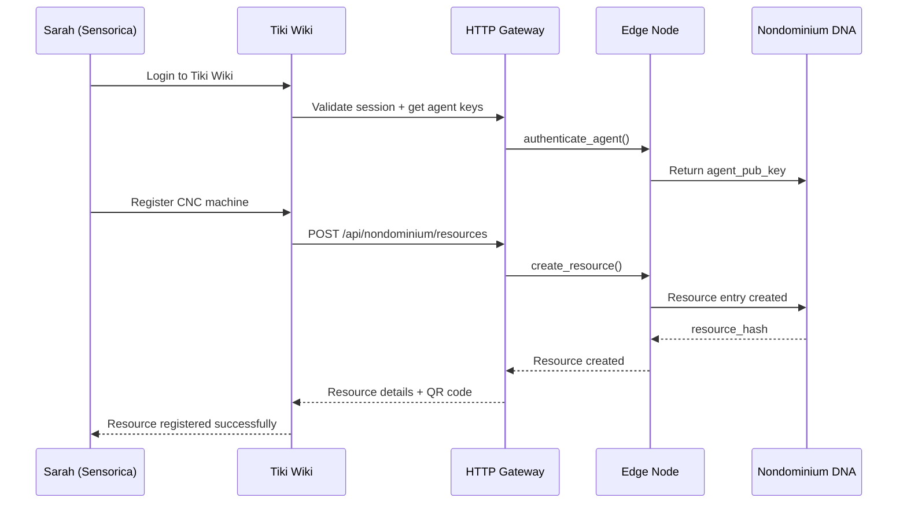
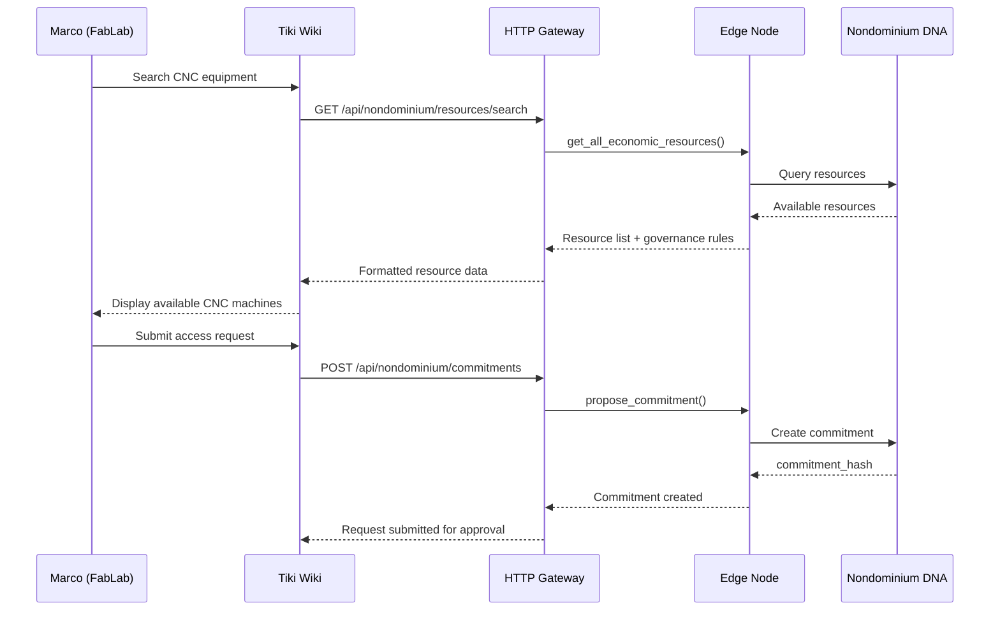
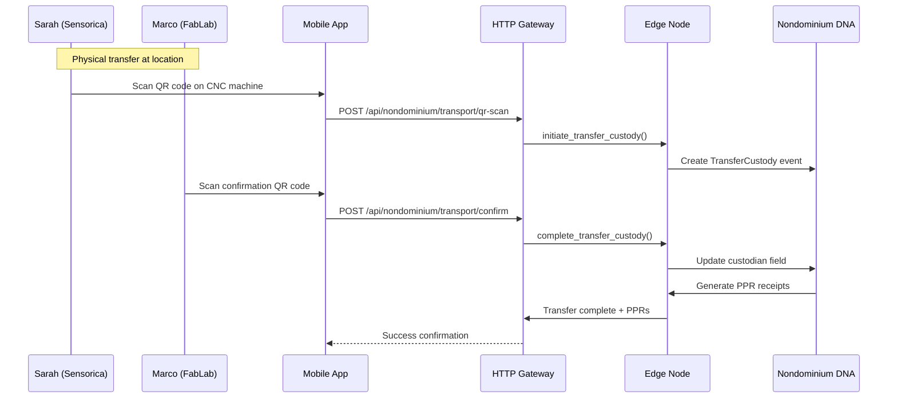

# Tiki Wiki Integration Requirements for Nondominium

## Executive Summary

This document outlines the technical requirements for integrating Nondominium's Holochain-based resource sharing protocol with Tiki Wiki platform using a **Node.js Bridge Service** powered by the official `@holochain/client` library. This approach provides full-featured, real-time integration while maintaining Tiki's familiar PHP-based workflow.

---

## Integration Objectives

### Primary Goals

- Enable Tiki Wiki users to discover and share physical resources through Nondominium
- Provide seamless Web2-to-Holochain bridge for resource transaction workflows
- Maintain Tiki's familiar UI/UX while adding Holochain-powered trust capabilities
- Support multi-organization resource sharing as demonstrated in the user story

### Success Criteria

- ✅ Sarah (Sensorica) can register CNC machine through Tiki interface
- ✅ Marco (FabLab) can discover and request resources via Tiki search
- ✅ Complete transaction workflow executed through Tiki UI
- ✅ Real-time PPR reputation updates displayed in Tiki profiles
- ✅ Mobile QR code scanning for custody transfer ceremonies

---

## Technical Architecture

### System Components

```mermaid
graph TB
    subgraph "Tiki Wiki Platform"
        TikiUI[Tiki Web Interface]
        TikiPHP[Tiki PHP Backend]
        MobileApp[Mobile Application]
    end

    subgraph "Node.js Bridge Service"
        BridgeAPI[REST API Layer]
        HoloClient[@holochain/client]
        Cache[Redis Cache]
        Queue[Job Queue]
        SignalHandler[Signal Handler]
    end

    subgraph "Holochain Infrastructure"
        Conductor[Holochain Conductor]
        DNA[Nondominium DNA]
        DHT[Distributed Hash Table]
    end

    TikiUI --> TikiPHP
    TikiPHP --> BridgeAPI
    MobileApp --> BridgeAPI
    BridgeAPI --> HoloClient
    HoloClient <--> Conductor
    SignalHandler --> TikiPHP
    BridgeAPI --> Cache
    BridgeAPI --> Queue
    Conductor <--> DNA
    DNA <--> DHT
```

### Component Specifications

#### 1. Node.js Bridge Service

- **Purpose**: Official WebSocket-based bridge between Tiki (PHP) and Holochain
- **Technology**: Node.js with `@holochain/client` library
- **Key Features**:
  - RESTful API for Tiki PHP modules
  - Full WebSocket connectivity to Holochain Conductor
  - Real-time signal subscription and forwarding
  - Request batching and caching (Redis)
  - Async job queue for long-running operations (Bull/BullMQ)
  - Proper zome call signing and capability management
  - Health monitoring and logging

**Why Node.js Bridge?**
- ✅ **Official Support**: `@holochain/client` is maintained by Holochain core team
- ✅ **Full Features**: Real-time signals, proper signing, batch operations
- ✅ **Production-Ready**: Built-in connection management, retry logic, error handling
- ✅ **RESTful Interface**: Clean API for PHP to consume
- ✅ **Caching & Queuing**: Performance optimization built-in

#### 2. Holochain Conductor

- **Purpose**: Run Nondominium hApp and manage agent keys
- **Deployment**: Docker containerized
- **Configuration**:
  - Admin WebSocket on port 8000
  - App WebSocket on port 8888
  - Support for multiple concurrent agents (organizations)
  - Automatic conductor configuration via bridge service

#### 3. Tiki PHP Integration Layer

- **Purpose**: Connect Tiki user accounts to Holochain agents
- **Requirements**:
  - Tiki session token validation
  - Holochain agent key generation and management
  - Role-based access control mapping
  - Secure credential storage
  - Single Sign-On (SSO) compatibility

### Why Node.js Bridge (Not HTTP Gateway)?

The Node.js Bridge Service using `@holochain/client` is the **only recommended approach** for production Tiki-Nondominium integration:

**Key Advantages:**
- ✅ **Official Library**: `@holochain/client` is maintained by Holochain core team
- ✅ **Full Features**: Real-time signals, proper zome call signing, batch operations
- ✅ **Production-Ready**: Built-in connection management, retry logic, health checks
- ✅ **Performance**: Persistent WebSocket connection, Redis caching, job queues
- ✅ **Clean API**: RESTful interface familiar to PHP developers

**HTTP Gateway Alternative (Not Recommended):**
- ❌ GET-only requests with Base64-encoded payloads
- ❌ No native signal support for real-time updates
- ❌ Limited batch operations and session management
- ❌ Performance constraints (connection overhead per request)

---

## Integration API Specifications

### Bridge Architecture for PHP/Tiki

We use a **Node.js Bridge Service** architecture that provides a clean RESTful interface for Tiki's PHP code:

**Architecture:**
```
Tiki (PHP) <--HTTP/JSON--> Node.js Bridge (@holochain/client) <--WebSocket--> Holochain Conductor <--> Nondominium DHT
```

**How It Works:**
1. Tiki PHP modules make standard HTTP requests to Node.js Bridge REST API
2. Node.js Bridge maintains persistent WebSocket connection to Holochain
3. Bridge handles zome call signing, capability tokens, and signal subscriptions
4. Real-time signals from Holochain pushed to Tiki via webhooks
5. Redis caching for frequently accessed data (resource lists, reputation scores)
6. Bull queue for async operations (batch syncs, long-running processes)

**Benefits:**
- ✅ **Clean Interface**: Tiki developers work with familiar REST/JSON
- ✅ **Full Features**: Access to all Holochain capabilities (signals, signing, etc.)
- ✅ **Performance**: Caching, batching, connection pooling
- ✅ **Reliability**: Built-in retry logic, error handling, health checks
- ✅ **Real-time**: WebSocket signals forwarded to Tiki instantly

### Core API Endpoints

#### Node.js Bridge REST API

```bash
# Resource Discovery
POST /api/resources
GET  /api/resources/{resource_id}
GET  /api/resources/search?query=CNC

# Resource Operations
POST   /api/resources
PUT    /api/resources/{resource_id}
DELETE /api/resources/{resource_id}
PATCH  /api/resources/{resource_id}/state

# Transaction Management
POST /api/commitments
GET  /api/commitments/{commitment_id}
POST /api/events
GET  /api/events/by-resource/{resource_id}

# Reputation System
GET /api/reputation/{agent_id}/summary
GET /api/reputation/{agent_id}/receipts

# Batch Operations
POST /api/batch
```

#### Example: Tiki PHP Calling Node.js Bridge

```php
<?php
// Tiki module calling Node.js Bridge Service

class NondominiumClient {
    private $bridge_url;
    private $dna_hash;
    private $agent_key;
    
    public function __construct($bridge_url, $dna_hash, $agent_key) {
        $this->bridge_url = $bridge_url;
        $this->dna_hash = $dna_hash;
        $this->agent_key = $agent_key;
    }
    
    /**
     * Search for resources
     */
    public function searchResources($query = null, $category = null) {
        $response = $this->makeRequest('GET', '/api/resources/search', [
            'query' => ['query' => $query, 'category' => $category, 'dna_hash' => $this->dna_hash, 'agent_key' => $this->agent_key]
        ]);
        return $response['data'];
    }
    
    /**
     * Create a new resource
     */
    public function createResource($spec_hash, $quantity, $unit) {
        $response = $this->makeRequest('POST', '/api/resources', [
            'json' => [
                'dna_hash' => $this->dna_hash,
                'agent_key' => $this->agent_key,
                'spec_hash' => $spec_hash,
                'quantity' => $quantity,
                'unit' => $unit,
                'custodian' => $this->agent_key
            ]
        ]);
        return $response['data'];
    }
    
    /**
     * Initiate use process
     */
    public function initiateUse($resource_hash, $receiver, $start_time, $end_time) {
        $response = $this->makeRequest('POST', "/api/resources/{$resource_hash}/use", [
            'json' => [
                'dna_hash' => $this->dna_hash,
                'agent_key' => $this->agent_key,
                'receiver' => $receiver,
                'start_time' => $start_time,
                'end_time' => $end_time
            ]
        ]);
        return $response['data'];
    }
    
    private function makeRequest($method, $path, $options = []) {
        $url = $this->bridge_url . $path;
        
        $ch = curl_init();
        curl_setopt($ch, CURLOPT_URL, $url);
        curl_setopt($ch, CURLOPT_RETURNTRANSFER, true);
        curl_setopt($ch, CURLOPT_CUSTOMREQUEST, $method);
        
        if (isset($options['query'])) {
            $url .= '?' . http_build_query($options['query']);
            curl_setopt($ch, CURLOPT_URL, $url);
        }
        
        if (isset($options['json'])) {
            $json = json_encode($options['json']);
            curl_setopt($ch, CURLOPT_POSTFIELDS, $json);
            curl_setopt($ch, CURLOPT_HTTPHEADER, ['Content-Type: application/json']);
        }
        
        $response = curl_exec($ch);
        $http_code = curl_getinfo($ch, CURLINFO_HTTP_CODE);
        curl_close($ch);
        
        if ($http_code !== 200) {
            throw new Exception("Bridge request failed: HTTP {$http_code}");
        }
        
        return json_decode($response, true);
    }
}
```

### Node.js Bridge Service Implementation

```javascript
// bridge-service.js
import { AppWebsocket, AdminWebsocket } from '@holochain/client';
import express from 'express';
import { createClient } from 'redis';
import Bull from 'bull';

class NondominiumBridgeService {
  constructor(config) {
    this.appWs = null;
    this.adminWs = null;
    this.redis = createClient({ url: config.redisUrl });
    this.queue = new Bull('nondominium', config.redisUrl);
    this.config = config;
  }

  async connect() {
    // Connect to Holochain Admin API
    this.adminWs = await AdminWebsocket.connect({
      url: new URL(this.config.adminWsUrl),
      wsClientOptions: { origin: 'tiki-nondominium' }
    });

    // Connect to App WebSocket
    const token = await this.adminWs.issueAppAuthenticationToken({
      installed_app_id: this.config.appId
    });

    this.appWs = await AppWebsocket.connect({
      url: new URL(this.config.appWsUrl),
      token: token.token,
      wsClientOptions: { origin: 'tiki-nondominium' }
    });

    // Subscribe to signals
    this.appWs.on('signal', this.handleSignal.bind(this));

    await this.redis.connect();
    console.log('Bridge connected to Holochain and Redis');
  }

  async handleSignal(signal) {
    console.log('Received signal:', signal);
    // Push signal to Tiki via webhook
    await this.notifyTiki(signal);
  }

  async notifyTiki(signal) {
    // POST to Tiki webhook endpoint
    const response = await fetch(this.config.tikiWebhookUrl, {
      method: 'POST',
      headers: { 
        'Content-Type': 'application/json',
        'X-Nondominium-Signature': this.generateSignature(signal)
      },
      body: JSON.stringify({
        type: signal.data.type,
        payload: signal.data.payload
      })
    });
    console.log('Notified Tiki:', response.status);
  }

  async callZome(cellId, zomeName, fnName, payload) {
    const cacheKey = `zome:${zomeName}:${fnName}:${JSON.stringify(payload)}`;
    
    // Check cache for read operations
    if (fnName.startsWith('get_')) {
      const cached = await this.redis.get(cacheKey);
      if (cached) return JSON.parse(cached);
    }

    try {
      const result = await this.appWs.callZome({
        cell_id: cellId,
        zome_name: zomeName,
        fn_name: fnName,
        payload: payload
      }, 30000);

      // Cache read operations
      if (fnName.startsWith('get_')) {
        await this.redis.setEx(cacheKey, 300, JSON.stringify(result));
      }

      return result;
    } catch (error) {
      console.error('Zome call failed:', error);
      throw error;
    }
  }

  generateSignature(data) {
    // HMAC signature for webhook authentication
    return crypto.createHmac('sha256', this.config.webhookSecret)
      .update(JSON.stringify(data))
      .digest('hex');
  }
}

// Initialize bridge
const bridge = new NondominiumBridgeService({
  adminWsUrl: process.env.HC_ADMIN_WS_URL || 'ws://localhost:8000',
  appWsUrl: process.env.HC_APP_WS_URL || 'ws://localhost:8888',
  appId: process.env.HC_APP_ID || 'nondominium',
  redisUrl: process.env.REDIS_URL || 'redis://localhost:6379',
  tikiWebhookUrl: process.env.TIKI_WEBHOOK_URL || 'http://localhost/tiki/nondominium/webhook',
  webhookSecret: process.env.WEBHOOK_SECRET
});

await bridge.connect();

// Express API
const app = express();
app.use(express.json());

function getCellId(req) {
  return [req.body.dna_hash || req.query.dna_hash, req.body.agent_key || req.query.agent_key];
}

// Resource Management
app.post('/api/resources', async (req, res) => {
  try {
    const cellId = getCellId(req);
    const result = await bridge.callZome(cellId, 'zome_resource', 'create_economic_resource', {
      conforms_to: req.body.spec_hash,
      quantity: req.body.quantity,
      unit: req.body.unit,
      custodian: req.body.custodian
    });
    res.json({ success: true, data: result });
  } catch (error) {
    res.status(500).json({ success: false, error: error.message });
  }
});

app.get('/api/resources/search', async (req, res) => {
  try {
    const cellId = getCellId(req);
    const resources = await bridge.callZome(cellId, 'zome_resource', 'get_all_resources', {
      query: req.query.query
    });
    res.json({ success: true, data: resources });
  } catch (error) {
    res.status(500).json({ success: false, error: error.message });
  }
});

// Batch operations
app.post('/api/batch', async (req, res) => {
  try {
    const cellId = getCellId(req);
    const results = await Promise.all(
      req.body.operations.map(op => 
        bridge.callZome(cellId, op.zome, op.function, op.payload)
      )
    );
    res.json({ success: true, data: results });
  } catch (error) {
    res.status(500).json({ success: false, error: error.message });
  }
});

app.get('/health', (req, res) => {
  res.json({ 
    status: 'ok', 
    holochain: bridge.appWs ? 'connected' : 'disconnected',
    redis: bridge.redis.isOpen ? 'connected' : 'disconnected'
  });
});

const PORT = process.env.PORT || 3000;
app.listen(PORT, () => console.log(`Bridge running on port ${PORT}`));
```

### Tiki Module Integration Example

```php
<?php
/**
 * Tiki Module: mod-nondominium_resources.php
 * Display available resources from Nondominium
 */

require_once('lib/nondominium/NondominiumBridge.php');

function module_nondominium_resources_info() {
    return [
        'name' => tr('Nondominium Resources'),
        'description' => tr('Display available shared resources from Nondominium network'),
        'prefs' => ['feature_nondominium'],
        'params' => [
            'max' => [
                'required' => false,
                'name' => tr('Maximum number of resources'),
                'description' => tr('Maximum number of resources to display'),
                'default' => 10,
            ],
        ],
    ];
}

function module_nondominium_resources($mod_reference_values) {
    global $prefs;
    
    $bridge = new NondominiumBridge(
        $prefs['nondominium_gateway_url'],
        $prefs['nondominium_dna_hash']
    );
    
    try {
        $resources = $bridge->searchResources();
        
        // Filter and format for Tiki display
        $smarty = TikiLib::lib('smarty');
        $smarty->assign('resources', array_slice($resources, 0, $mod_reference_values['max']));
        
        return $smarty->fetch('modules/mod-nondominium_resources.tpl');
    } catch (Exception $e) {
        return '<div class="alert alert-danger">' . tr('Error loading resources: ') . $e->getMessage() . '</div>';
    }
}
```

### Tiki Tracker Integration (Resource Management)

```php
<?php
/**
 * Sync Tiki Tracker items with Nondominium resources
 */

class TikiNondominiumSync {
    private $bridge;
    private $tracker_id;
    
    public function __construct($bridge, $tracker_id) {
        $this->bridge = $bridge;
        $this->tracker_id = $tracker_id;
    }
    
    /**
     * Publish a Tiki Tracker item as a Nondominium resource
     */
    public function publishTrackerItem($item_id) {
        $trklib = TikiLib::lib('trk');
        $item = $trklib->get_tracker_item($item_id);
        
        // Map Tiki fields to Nondominium structure
        $resource_data = [
            'name' => $item['fields']['name'],
            'description' => $item['fields']['description'],
            'quantity' => $item['fields']['quantity'],
            'unit' => $item['fields']['unit'],
            'location' => $item['fields']['location']
        ];
        
        // Create ResourceSpecification in Nondominium
        $spec = $this->bridge->callZome('resource', 'create_resource_specification', [
            'name' => $resource_data['name'],
            'description' => $resource_data['description']
        ]);
        
        // Create EconomicResource
        $resource = $this->bridge->createResource(
            $spec['hash'],
            $resource_data['quantity'],
            $resource_data['unit'],
            $this->getCurrentUserAgentKey()
        );
        
        // Store Nondominium hash in Tiki tracker field
        $trklib->modify_field($item_id, 'nondominium_hash', $resource['hash']);
        
        return $resource;
    }
    
    /**
     * Sync Nondominium events back to Tiki
     */
    public function syncEventsToTiki($resource_hash) {
        $events = $this->bridge->callZome('gouvernance', 'get_events_by_resource', [
            'resource_hash' => $resource_hash
        ]);
        
        foreach ($events as $event) {
            // Log event in Tiki activity stream
            TikiLib::lib('logs')->add_log('nondominium_event', sprintf(
                'Resource %s: %s by %s',
                $resource_hash,
                $event['action'],
                $event['provider']
            ));
        }
    }
    
    private function getCurrentUserAgentKey() {
        global $user;
        $userlib = TikiLib::lib('user');
        return $userlib->get_user_preference($user, 'nondominium_agent_key');
    }
}
```

### Real-time Webhooks (PHP Handler)

```php
<?php
/**
 * webhook_nondominium.php
 * Handle real-time updates from Nondominium via webhooks
 */

// Authenticate webhook (verify signature)
function validate_webhook_signature($payload, $signature) {
    global $prefs;
    $expected = hash_hmac('sha256', $payload, $prefs['nondominium_webhook_secret']);
    return hash_equals($expected, $signature);
}

// Main webhook handler
$payload = file_get_contents('php://input');
$signature = $_SERVER['HTTP_X_NONDOMINIUM_SIGNATURE'] ?? '';

if (!validate_webhook_signature($payload, $signature)) {
    http_response_code(401);
    exit('Invalid signature');
}

$data = json_decode($payload, true);

switch ($data['type']) {
    case 'commitment.updated':
        handle_commitment_update($data);
        break;
        
    case 'resource.availability':
        handle_resource_availability($data);
        break;
        
    case 'reputation.updated':
        handle_reputation_update($data);
        break;
        
    default:
        http_response_code(400);
        exit('Unknown event type');
}

function handle_commitment_update($data) {
    $trklib = TikiLib::lib('trk');
    
    // Find Tiki tracker item by commitment hash
    $items = $trklib->list_items($tracker_id = get_commitment_tracker_id(), 0, -1, '', [
        'nondominium_hash' => $data['commitmentId']
    ]);
    
    if (!empty($items['data'])) {
        $item_id = $items['data'][0]['itemId'];
        
        // Update status field
        $trklib->modify_field($item_id, 'status', $data['status']);
        
        // Send notification to user
        send_tiki_notification(
            $item_id,
            'Commitment Status Updated',
            sprintf('Your resource request is now: %s', $data['status'])
        );
    }
}

function handle_resource_availability($data) {
    // Update Tiki tracker item availability status
    // Trigger intertracker reference updates if needed
}

function handle_reputation_update($data) {
    global $user;
    $userlib = TikiLib::lib('user');
    
    // Update user's reputation score in Tiki profile
    $userlib->set_user_preference(
        $user,
        'nondominium_reputation_score',
        $data['newScore']
    );
    
    // Display notification
    TikiLib::lib('smarty')->display_notification([
        'title' => 'Reputation Updated',
        'message' => sprintf('Your reputation score is now: %.2f', $data['newScore'])
    ]);
}

http_response_code(200);
echo json_encode(['status' => 'ok']);
```

---

## 🔄 User Story Implementation Flow

### Phase 1: Resource Discovery & Registration



### Phase 2: Multi-Party Transaction Process



### Phase 3: Custody Transfer with QR Codes



---

## 📱 Mobile Application Requirements

### QR Code Scanning Features

```typescript
interface QRCodeData {
  resourceId: string;
  resourceHash: string;
  location: {
    latitude: number;
    longitude: number;
  };
  timestamp: string;
  custodianPubKey: string;
  sessionId: string;
}

// Scan result processing
function processQRScan(qrData: QRCodeData): Promise<TransferResult> {
  // Validate QR code authenticity
  // Initiate custody transfer
  // Generate cryptographic signatures
  // Update real-time status
}
```

### Offline Capabilities

- Cache critical resource data for offline access
- Queue custody transfer operations when connectivity lost
- Synchronize pending operations when connection restored
- Local storage of QR code scan history

### Push Notifications

```typescript
// Real-time transaction updates
interface NotificationPayload {
  type: "transaction_update" | "resource_available" | "ppr_update";
  title: string;
  message: string;
  data: any;
  priority: "high" | "normal" | "low";
}
```

---

## 🔐 Security & Authentication

### Tiki-Holochain Identity Bridge (PHP Implementation)

Based on the **Organizational Context** from the ERP bridge analysis, Tiki operates in a **delegated agency model** where:
- Tiki organizations are represented as Holochain agents
- Individual Tiki users act as **delegates/representatives** of the organization
- Delegation requires scope, expiry, and revocation mechanisms

```php
<?php
/**
 * TikiHolochainAuth.php
 * Manage identity mapping between Tiki users and Holochain agents
 */

class TikiHolochainAuth {
    /**
     * Generate or retrieve Holochain agent key for organization
     */
    public function getOrganizationAgentKey($org_id) {
        global $prefs;
        
        // Check if organization already has agent key
        $existing_key = $this->getOrgPreference($org_id, 'holochain_agent_key');
        
        if ($existing_key) {
            return $existing_key;
        }
        
        // Generate new agent key via Holochain admin API
        $admin_client = new HolochainAdminClient($prefs['holochain_admin_url']);
        $agent_key = $admin_client->generateAgentPubKey();
        
        // Store in Tiki
        $this->setOrgPreference($org_id, 'holochain_agent_key', $agent_key);
        
        return $agent_key;
    }
    
    /**
     * Create delegation for a Tiki user to act on behalf of organization
     */
    public function createDelegation($user, $org_id, $permissions, $expiry_days = 90) {
        $bridge = new NondominiumBridge(
            $GLOBALS['prefs']['nondominium_gateway_url'],
            $GLOBALS['prefs']['nondominium_dna_hash']
        );
        
        // Get organization's agent key
        $org_agent_key = $this->getOrganizationAgentKey($org_id);
        
        // Generate delegate key for this user
        $delegate_key = $this->getUserDelegateKey($user);
        
        // Create capability grant in Holochain
        $cap_grant = $bridge->callZome('person', 'grant_signing_key', [
            'cell_id' => [$GLOBALS['prefs']['nondominium_dna_hash'], $org_agent_key],
            'functions' => $permissions, // e.g., ['Transport', 'Use']
            'signing_key' => $delegate_key,
            'expiry' => time() + ($expiry_days * 86400)
        ]);
        
        // Store delegation in Tiki
        $this->storeDelegation([
            'user' => $user,
            'org_id' => $org_id,
            'delegate_key' => $delegate_key,
            'cap_secret' => $cap_grant['cap_secret'],
            'permissions' => json_encode($permissions),
            'expires_at' => time() + ($expiry_days * 86400)
        ]);
        
        return $cap_grant;
    }
    
    /**
     * Validate user's delegation and return signing credentials
     */
    public function validateDelegation($user, $org_id) {
        $delegation = $this->getDelegation($user, $org_id);
        
        if (!$delegation) {
            throw new Exception('No delegation found for user');
        }
        
        if ($delegation['expires_at'] < time()) {
            throw new Exception('Delegation has expired');
        }
        
        return [
            'org_agent_key' => $this->getOrganizationAgentKey($org_id),
            'delegate_key' => $delegation['delegate_key'],
            'cap_secret' => $delegation['cap_secret'],
            'permissions' => json_decode($delegation['permissions'], true)
        ];
    }
    
    /**
     * Revoke delegation (e.g., when user leaves organization)
     */
    public function revokeDelegation($user, $org_id) {
        $delegation = $this->getDelegation($user, $org_id);
        
        if ($delegation) {
            $bridge = new NondominiumBridge(
                $GLOBALS['prefs']['nondominium_gateway_url'],
                $GLOBALS['prefs']['nondominium_dna_hash']
            );
            
            // Revoke capability in Holochain
            $bridge->callZome('person', 'revoke_signing_key', [
                'cap_secret' => $delegation['cap_secret']
            ]);
            
            // Remove from Tiki database
            $this->deleteDelegation($user, $org_id);
        }
    }
    
    private function getUserDelegateKey($user) {
        $userlib = TikiLib::lib('user');
        $existing = $userlib->get_user_preference($user, 'holochain_delegate_key');
        
        if ($existing) {
            return $existing;
        }
        
        // Generate new delegate keypair
        $keypair = sodium_crypto_sign_keypair();
        $public_key = sodium_crypto_sign_publickey($keypair);
        
        // Store in user preferences (encrypted)
        $userlib->set_user_preference($user, 'holochain_delegate_key', base64_encode($public_key));
        $userlib->set_user_preference($user, 'holochain_delegate_keypair', base64_encode($keypair));
        
        return base64_encode($public_key);
    }
    
    private function storeDelegation($data) {
        global $tiki_p_nondominium_delegations;
        TikiDb::get()->query(
            "INSERT INTO `$tiki_p_nondominium_delegations` 
            (`user`, `org_id`, `delegate_key`, `cap_secret`, `permissions`, `expires_at`) 
            VALUES (?, ?, ?, ?, ?, ?)",
            [
                $data['user'],
                $data['org_id'],
                $data['delegate_key'],
                $data['cap_secret'],
                $data['permissions'],
                $data['expires_at']
            ]
        );
    }
    
    private function getDelegation($user, $org_id) {
        global $tiki_p_nondominium_delegations;
        return TikiDb::get()->getOne(
            "SELECT * FROM `$tiki_p_nondominium_delegations` WHERE `user` = ? AND `org_id` = ?",
            [$user, $org_id]
        );
    }
    
    private function deleteDelegation($user, $org_id) {
        global $tiki_p_nondominium_delegations;
        TikiDb::get()->query(
            "DELETE FROM `$tiki_p_nondominium_delegations` WHERE `user` = ? AND `org_id` = ?",
            [$user, $org_id]
        );
    }
}
```

### Organizational Delegation Workflow Example

```php
<?php
/**
 * Example: Tiki user Alice requests to transport a resource on behalf of Acme Corp
 */

$auth = new TikiHolochainAuth();
$bridge = new NondominiumBridge($gateway_url, $dna_hash);

// Step 1: Validate Alice's delegation
try {
    $credentials = $auth->validateDelegation('alice', $org_id = 123); // Acme Corp
    
    // Alice has permissions: ['Transport', 'Use']
    if (!in_array('Transport', $credentials['permissions'])) {
        throw new Exception('User not authorized for Transport');
    }
    
} catch (Exception $e) {
    die('Authorization failed: ' . $e->getMessage());
}

// Step 2: Sign the transport request with delegate key
$transport_payload = [
    'resource_hash' => $resource_hash,
    'from_location' => 'Warehouse A',
    'to_location' => 'Client Site B',
    'scheduled_date' => '2025-12-20'
];

// The zome call is signed by Alice's delegate key on behalf of Acme Corp
$result = $bridge->callZome('resource', 'initiate_transport_process', array_merge(
    $transport_payload,
    [
        'provenance' => $credentials['org_agent_key'], // Acme Corp's identity
        'performed_by' => $credentials['delegate_key']  // Alice's delegate key
    ]
));

// Step 3: Track internal attribution
// The organization (Acme Corp) gets the external PPR, but Tiki tracks that Alice performed it
TikiLib::lib('logs')->add_log('nondominium_transport', sprintf(
    'Transport initiated by %s on behalf of organization %d',
    'alice',
    $org_id
));
```

### Capability-Based Access Control (PHP)

```php
<?php
/**
 * Role-based permissions mapping for Tiki-Nondominium integration
 */

class NondominiumRoleManager {
    const ROLE_PERMISSIONS = [
        'Resource Coordinator' => ['view', 'request_access', 'transfer_custody'],
        'Technical Manager' => ['view', 'request_access', 'use_resource'],
        'Transport Specialist' => ['transfer_custody', 'view_transport_logs'],
        'Warehouse Manager' => ['view', 'create_resource', 'update_inventory'],
    ];
    
    /**
     * Get Holochain permissions for a Tiki group/role
     */
    public function getHolochainPermissions($tiki_role) {
        return self::ROLE_PERMISSIONS[$tiki_role] ?? [];
    }
    
    /**
     * Automatically delegate permissions when user joins a Tiki group
     */
    public function onUserAddedToGroup($user, $group, $org_id) {
        $auth = new TikiHolochainAuth();
        
        $permissions = $this->getHolochainPermissions($group);
        
        if (!empty($permissions)) {
            try {
                $auth->createDelegation($user, $org_id, $permissions);
                
                TikiLib::lib('logs')->add_log('nondominium_delegation', sprintf(
                    'Delegation created for user %s in group %s',
                    $user,
                    $group
                ));
            } catch (Exception $e) {
                TikiLib::lib('logs')->add_log('nondominium_error', $e->getMessage());
            }
        }
    }
    
    /**
     * Revoke delegation when user leaves group
     */
    public function onUserRemovedFromGroup($user, $group, $org_id) {
        $auth = new TikiHolochainAuth();
        $auth->revokeDelegation($user, $org_id);
    }
}
```

### Data Privacy Controls

```typescript
// Privacy settings per resource
interface ResourcePrivacy {
  resourceId: string;
  publicFields: ("name" | "location" | "specifications")[];
  privateFields: ("owner_details" | "usage_history" | "maintenance_records")[];
  accessControl: "public" | "organization_only" | "approved_agents_only";
}
```

---

## 📊 Performance Requirements

### Response Time Targets

- **Resource Search**: < 2 seconds for basic queries
- **Transaction Updates**: < 500ms for status changes
- **QR Code Processing**: < 3 seconds end-to-end
- **Real-time Synchronization**: < 1 second for webhook delivery
- **Authentication**: < 1 second for user validation

### Scalability Requirements

```yaml
concurrent_users:
  target: 1000
  peak: 5000

resource_transactions:
  daily_volume: 10000
  peak_concurrent: 500

api_throughput:
  requests_per_second: 1000
  burst_capacity: 5000

data_storage:
  resources_per_organization: 10000
  transaction_history: 7_years
```

### Caching Strategy

```typescript
// Multi-level caching
interface CacheConfiguration {
  level1_memory: {
    user_sessions: "15 minutes";
    resource_metadata: "1 hour";
    reputation_scores: "30 minutes";
  };

  level2_redis: {
    search_results: "5 minutes";
    transaction_status: "real-time";
    availability_data: "2 minutes";
  };

  level3_cdn: {
    static_assets: "24 hours";
    api_responses: "5 minutes";
    qr_codes: "1 hour";
  };
}
```

---

## 🔄 Integration Workflow Requirements

### Data Synchronization

#### Master Data Management

```typescript
// Tiki ↔ Holochain sync mapping
interface SyncMapping {
  tikiUser: HolochainAgent;
  tikiResource: EconomicResource;
  tikiTransaction: Commitment + EconomicEvent[];
  tikiProfile: Person + EncryptedProfile;
}

// Bidirectional sync rules
const SYNC_RULES = {
  // Tiki → Holochain
  userRegistration: "create_holochain_agent",
  resourceCreation: "create_economic_resource",
  transactionInitiation: "create_commitment",

  // Holochain → Tiki
  reputationUpdates: "update_user_profile",
  transactionCompletion: "update_transaction_status",
  custodyTransfers: "update_resource_custodian"
};
```

#### Conflict Resolution

```typescript
interface ConflictResolution {
  strategy:
    | "holochain_master"
    | "tiki_master"
    | "timestamp_win"
    | "manual_review";
  rules: {
    resource_metadata: "holochain_master";
    user_preferences: "tiki_master";
    transaction_status: "timestamp_win";
    reputation_data: "holochain_master";
  };
}
```

### Error Handling & Recovery

#### Transaction Rollback

```typescript
interface RollbackStrategy {
  commitment_creation: [
    "delete_commitment_entry",
    "release_resource_reservation",
    "notify_stakeholders",
  ];

  custody_transfer: [
    "reverse_custody_update",
    "invalidate_ppr_receipts",
    "notify_transport_parties",
  ];
}
```

#### Fallback Procedures

```typescript
// Service degradation handling
const FALLBACK_PROCEDURES = {
  http_gateway_down: "cache_operations + retry_exponential_backoff",
  edge_node_unavailable: "read_only_mode + queue_operations",
  network_partition: "local_validation + sync_when_available",
  high_load: "request_throttling + background_processing",
};
```

---

## 🧪 Testing Requirements

### Integration Test Scenarios

#### End-to-End User Journey Tests

```typescript
describe("Tiki-Nondominium Integration", () => {
  test("Complete resource sharing workflow", async () => {
    // 1. Sarah registers CNC machine through Tiki
    // 2. Marco discovers resource via Tiki search
    // 3. Transaction negotiation through Tiki UI
    // 4. QR code-based custody transfer
    // 5. Usage tracking and PPR generation
    // 6. Return process and reputation updates
  });

  test("Multi-organization resource discovery", async () => {
    // 1. Multiple organizations register resources
    // 2. Cross-organization search functionality
    // 3. Trust validation between organizations
    // 4. Compliance with governance rules
  });
});
```

#### Performance & Load Testing

```typescript
interface LoadTestConfiguration {
  concurrent_users: [100, 500, 1000, 5000];
  scenarios: [
    "resource_search",
    "transaction_creation",
    "qr_scan",
    "real_time_sync",
  ];
  duration: "10 minutes per scenario";
  success_criteria: {
    response_time_p95: "< 2 seconds";
    error_rate: "< 0.1%";
    throughput: "> 500 requests/second";
  };
}
```

#### Security Testing

```typescript
interface SecurityTests {
  authentication_tests: [
    "invalid_session_token",
    "cross_organization_access",
    "privilege_escalation_attempts",
  ];

  data_privacy: [
    "sensitive_data_encryption",
    "access_control_enforcement",
    "audit_trail_completeness",
  ];

  api_security: [
    "rate_limiting_effectiveness",
    "input_validation",
    "sql_injection_prevention",
    "xss_protection",
  ];
}
```

---

## 🏢 Organizational vs. P2P Context Adaptations

Based on the ERP-Holochain bridge analysis, Tiki operates in an **Organizational Context** with the following implications:

### Identity Architecture
- **Tiki Group** → **Holochain Organization Agent**
- **Tiki User** → **Delegate Key** (with scoped permissions)
- **Delegation Pattern**: Required for all zome calls signed by users on behalf of organizations

### Reputation Aggregation
- External PPRs accrue to the **Tiki Group/Organization**
- Internal attribution tracked via `performed_by` metadata
- New users inherit the organization's reputation (trust by association)

### Governance Model
- **Policy-Driven**: Automated rules based on Tiki group permissions
- **Multi-Sig Support**: High-value transactions require multiple delegate approvals
- **Automated Approval**: ERP-style workflows (e.g., "Auto-approve Use requests < $500")

### Custody vs. Ownership
- **Organization** owns the resource
- **Individual users** (employees) hold temporary custody
- Internal transfers (between Tiki users in same org) may not trigger DHT events

### Device Management
- **Shared Terminals**: Warehouse tablets used by multiple staff members
- **Session Management**: Rapid login/logout of different delegates
- **SSO Integration**: Map Tiki session tokens to Holochain capability tokens

## 📋 Implementation Roadmap

### Phase 1: Foundation (4 weeks)

- ✅ Set up development environment (Docker Compose)
- ✅ Deploy Holochain Conductor and Nondominium hApp
- ✅ Implement **Node.js Bridge Service** with `@holochain/client`
- ✅ Create REST API endpoints for Tiki integration
- ✅ Create **organizational delegation system** (TikiHolochainAuth.php)
- ✅ Develop Tiki plugin skeleton with NondominiumClient.php

### Phase 2: Core Features (6 weeks)

- ✅ Implement resource discovery and search (via PHP Bridge)
- ✅ Build transaction workflow with **delegation signing**
- ✅ Develop QR code scanning with **performed_by attribution**
- ✅ Create webhook handlers for real-time updates (webhook_nondominium.php)
- ✅ Implement **organizational PPR aggregation** and display
- ✅ Integrate Tiki Tracker items with Nondominium resources (TikiNondominiumSync.php)

### Phase 3: Mobile & Advanced Features (4 weeks)

- ✅ Develop mobile application with QR scanning
- ✅ Implement push notifications
- ✅ Add offline capability support
- ✅ Create advanced analytics dashboard
- ✅ Implement multi-language support

### Phase 4: Testing & Optimization (3 weeks)

- ✅ Comprehensive integration testing
- ✅ Performance optimization
- ✅ Security audit and penetration testing
- ✅ User acceptance testing with pilot organizations
- ✅ Documentation and training materials

### Phase 5: Production Deployment (2 weeks)

- ✅ Production environment setup
- ✅ Data migration from pilot systems
- ✅ Go-live with monitoring and support
- ✅ Post-launch optimization and bug fixes

## 🐳 Deployment Architecture

### Docker Compose Setup

```yaml
# docker-compose.yml
version: '3.8'

services:
  tiki:
    image: tiki/tiki:latest
    ports:
      - "80:80"
    environment:
      - DB_HOST=mysql
      - DB_NAME=tiki
      - DB_USER=tiki
      - DB_PASS=tiki
    volumes:
      - ./tiki_nondominium_plugin:/var/www/html/lib/nondominium
    depends_on:
      - mysql
      - bridge

  holochain:
    image: holochain/holochain:latest
    ports:
      - "8000:8000"  # Admin WebSocket
      - "8888:8888"  # App WebSocket
    volumes:
      - ./nondominium.happ:/happ/nondominium.happ
      - holochain_data:/data
    command: holochain -c /data/conductor-config.yml

  bridge:
    build: ./bridge-service
    ports:
      - "3000:3000"
    environment:
      - HC_ADMIN_WS_URL=ws://holochain:8000
      - HC_APP_WS_URL=ws://holochain:8888
      - HC_APP_ID=nondominium
      - REDIS_URL=redis://redis:6379
      - TIKI_WEBHOOK_URL=http://tiki/tiki/nondominium/webhook
      - WEBHOOK_SECRET=${WEBHOOK_SECRET}
    depends_on:
      - holochain
      - redis

  redis:
    image: redis:7-alpine
    ports:
      - "6379:6379"

  mysql:
    image: mysql:8
    environment:
      - MYSQL_ROOT_PASSWORD=root
      - MYSQL_DATABASE=tiki
      - MYSQL_USER=tiki
      - MYSQL_PASSWORD=tiki
    volumes:
      - mysql_data:/var/lib/mysql

volumes:
  holochain_data:
  mysql_data:
```

### Bridge Service Dockerfile

```dockerfile
# bridge-service/Dockerfile
FROM node:20-alpine

WORKDIR /app

COPY package*.json ./
RUN npm ci --only=production

COPY . .

EXPOSE 3000

CMD ["node", "index.js"]
```

## 🔒 Compliance & Governance

### Data Protection

- GDPR compliance for European users
- PII encryption at rest and in transit
- Right to be forgotten implementation
- Audit trail for all resource transactions

### Regulatory Compliance

- Equipment insurance validation integration
- Transport certification verification
- Safety protocol compliance tracking
- Tax reporting for resource usage fees

### Governance Framework

- Multi-stakeholder governance council
- Dispute resolution mechanism
- Protocol amendment process
- Emergency response procedures

---

## 🔗 Key Differences from Pure P2P Integration

This Tiki-Nondominium integration follows the **Organizational Context** pattern, distinct from pure P2P deployments:

| Aspect | Tiki (Organizational) | Pure P2P |
|--------|----------------------|----------|
| **Identity Model** | Tiki Group = Org Agent, Users = Delegates | 1 Human = 1 Agent Key |
| **Signing Authority** | Delegated (users sign on behalf of org) | Direct (individual signs) |
| **Reputation** | Accrues to organization, internal attribution | Accrues to individual |
| **Governance** | Policy-driven, automated rules | Ad-hoc, social negotiation |
| **Device Usage** | Shared terminals, SSO integration | Personal devices |
| **PHP Bridge** | Required for RESTful API and delegation | Not applicable |

## 📚 References

### PHP-Specific Resources
- [Tiki Wiki CMS Groupware](https://tiki.org/)
- [Tiki Developer Documentation](https://doc.tiki.org/Developer)
- [PHP cURL Documentation](https://www.php.net/manual/en/book.curl.php) (for HTTP client)
- [PHP Sodium Extension](https://www.php.net/manual/en/book.sodium.php) (for Ed25519 signing)

### Holochain Integration Resources
- [Holochain Client JS](https://github.com/holochain/holochain-client-js)
- [Holochain Client JS API Docs](https://docs.holochain.org/)
- [ERP-Holochain Bridge Analysis](../Applications/erp_holochain_bridge.md)
- [Node.js Documentation](https://nodejs.org/docs/)

### ValueFlows & Nondominium
- [ValueFlows Ontology](https://www.valueflows.org/)
- [Nondominium Requirements](../requirements/requirements.md)
- [Nondominium Specifications](../specifications/specifications.md)

---

**This integration specification enables Tiki Wiki to become a powerful Web2 gateway for Holochain-based resource sharing, maintaining platform familiarity while introducing unprecedented trust and transparency capabilities through the Nondominium protocol. The Node.js Bridge Service provides full-featured, production-ready integration with real-time signals, proper zome call signing, and organizational delegation patterns, ensuring that Tiki users can seamlessly participate in the Nondominium network while preserving the familiar Tiki workflow.**
