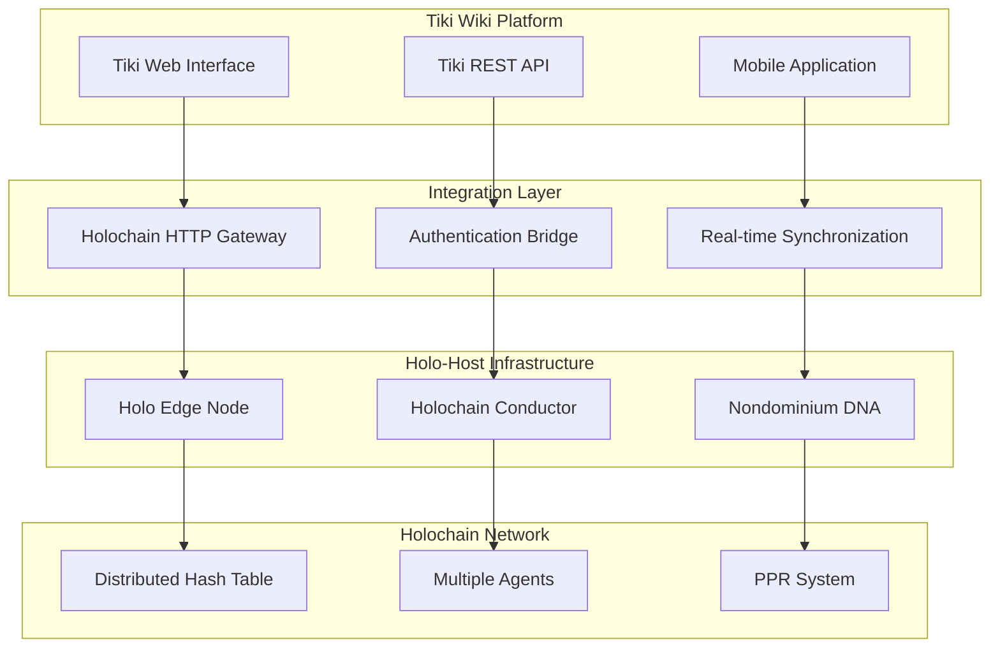

# Tiki Wiki Integration Requirements for Nondominium

## Executive Summary

This document outlines the technical requirements for integrating Nondominium's Holochain-based resource sharing protocol with Tiki Wiki platform through Holo-Host edgenode infrastructure and HTTP Gateway connectivity.

---

## 🎯 Integration Objectives

### Primary Goals

- Enable Tiki Wiki users to discover and share physical resources through Nondominium
- Provide seamless Web2-to-Web3 bridge for resource transaction workflows
- Maintain Tiki's familiar UI/UX while adding Holochain-powered trust capabilities
- Support multi-organization resource sharing as demonstrated in the user story

### Success Criteria

- ✅ Sarah (Sensorica) can register CNC machine through Tiki interface
- ✅ Marco (FabLab) can discover and request resources via Tiki search
- ✅ Complete transaction workflow executed through Tiki UI
- ✅ Real-time PPR reputation updates displayed in Tiki profiles
- ✅ Mobile QR code scanning for custody transfer ceremonies

---

## 🏗️ Technical Architecture

### System Components



### Component Specifications

#### 1. Holo-Host Edge Node

- **Purpose**: Deploy and manage Nondominium hApp instances
- **Requirements**:
  - Docker containerized deployment
  - Automatic Holochain conductor configuration
  - Support for multiple concurrent agents (organizations)
  - Configuration file-based hApp management
  - HolOS v0.0.7+ for stability and performance

#### 2. Holochain HTTP Gateway

- **Purpose**: HTTP-to-Holochain bridge for Tiki integration
- **Requirements**:
  - RESTful API endpoints for all Nondominium zome functions
  - WebSocket support for real-time updates
  - Authentication middleware for Tiki user sessions
  - Rate limiting and caching for performance
  - Health monitoring and logging

#### HTTP Gateway Constraints & Limitations

**⚠️ Critical Technical Constraints**

Based on Holochain HTTP Gateway analysis, significant limitations impact the REST API design:

**1. HTTP Method Limitations**

- **GET requests ONLY** - No native POST, PUT, DELETE support
- All function payloads must be passed via Base64-encoded query parameters
- URL length restrictions limit payload sizes (default: 10KB maximum)

**2. Fixed URL Pattern**

- Rigid structure: `/{dna_hash}/{app_id}/{zome_name}/{function_name}?payload={base64_data}`
- No RESTful resource patterns (e.g., `/resources/{id}`, `/users/{id}/resources`)
- No nested routes or hierarchical resource management

**3. Performance Constraints**

- Single zome call per HTTP request (no batch operations)
- Connection overhead: WebSocket + zome call for each request
- No built-in response caching for frequently accessed data
- Configurable timeout (default: 10 seconds) affects long operations

**4. State Management Limitations**

- No native session management or server-side state persistence
- No request batching or transaction grouping capabilities
- No streaming or chunked responses for large data sets
- Limited real-time capabilities (requires supplementary WebSocket layer)

**🔧 Mitigation Strategies**

**Hybrid Architecture Approach**:

```typescript
// HTTP Gateway for simple operations
GET /api/resources/search?payload=eyJxdWVyeSI6ICJD TkMifQ==

// Direct Holochain client for complex operations
import { AppWebsocket } from '@holochain/client';
const client = await AppWebsocket.connect(appWsUrl);
```

**Backend Proxy Pattern**:

- Wrap HTTP Gateway in custom REST API service
- Translate RESTful patterns to Gateway-compatible format
- Add caching, batching, and session management
- Implement proper error handling and retry logic

**Enhanced Communication Layer**:

- HTTP Gateway: Simple queries and basic CRUD operations
- WebSocket: Real-time updates (transaction status, PPR notifications)
- Direct Client: File handling, batch processing, complex transactions

#### 3. Authentication Bridge

- **Purpose**: Connect Tiki user accounts to Holochain agents
- **Requirements**:
  - Tiki session token validation
  - Holochain agent key generation and management
  - Role-based access control mapping
  - Secure credential storage
  - Single Sign-On (SSO) compatibility

---

## 🔌 Integration API Specifications

### Core API Endpoints

#### Resource Management (HTTP Gateway Compatible)

```typescript
// Resource Discovery - GET requests with Base64 payloads
GET /{dna_hash}/nondominium/resource/get_all_resources?payload={base64_search_params}
GET /{dna_hash}/nondominium/resource/get_resource?payload={base64_resource_id}
GET /{dna_hash}/nondominium/resource/filter_resources?payload={base64_filter}

// Resource Operations - All as GET requests with payloads
GET /{dna_hash}/nondominium/resource/create_resource?payload={base64_resource_data}
GET /{dna_hash}/nondominium/resource/update_resource?payload={base64_update_data}
GET /{dna_hash}/nondominium/resource/delete_resource?payload={base64_resource_id}

// Resource State Management
GET /{dna_hash}/nondominium/resource/update_resource_state?payload={base64_state_data}
GET /{dna_hash}/nondominium/resource/get_resource_availability?payload={base64_resource_id}
```

#### Transaction Management (HTTP Gateway Compatible)

```typescript
// Commitments
GET /{dna_hash}/nondominium/gouvernance/propose_commitment?payload={base64_commitment_data}
GET /{dna_hash}/nondominium/gouvernance/get_commitment?payload={base64_commitment_id}
GET /{dna_hash}/nondominium/gouvernance/update_commitment?payload={base64_update_data}

// Economic Events
GET /{dna_hash}/nondominium/gouvernance/create_economic_event?payload={base64_event_data}
GET /{dna_hash}/nondominium/gouvernance/get_economic_event?payload={base64_event_id}
GET /{dna_hash}/nondominium/gouvernance/get_events_by_resource?payload={base64_resource_id}

// Transport Process
GET /{dna_hash}/nondominium/gouvernance/initiate_transport?payload={base64_transport_data}
GET /{dna_hash}/nondominium/gouvernance/complete_transport?payload={base64_completion_data}
GET /{dna_hash}/nondominium/gouvernance/process_qr_scan?payload={base64_qr_data}
```

#### Reputation System (HTTP Gateway Compatible)

```typescript
// PPR Data
GET /{dna_hash}/nondominium/gouvernance/get_reputation_summary?payload={base64_agent_id}
GET /{dna_hash}/nondominium/gouvernance/get_ppr_receipts?payload={base64_agent_id}

// Trust Metrics
GET /{dna_hash}/nondominium/gouvernance/calculate_trust_score?payload={base64_agent_id}
GET /{dna_hash}/nondominium/gouvernance/validate_agent_trust?payload={base64_agent_id}
```

#### Backend Proxy API (Tiki-Friendly REST Interface)

**⚠️ Note**: These endpoints require a custom backend proxy service that translates RESTful patterns to HTTP Gateway format.

```typescript
// RESTful-style endpoints that proxy to HTTP Gateway
POST /api/nondominium/resources           → Proxy to Gateway GET with payload
PUT /api/nondominium/resources/{id}      → Proxy to Gateway GET with payload
DELETE /api/nondominium/resources/{id}   → Proxy to Gateway GET with payload

// Batch operations (not natively supported by Gateway)
POST /api/nondominium/resources/batch     → Multiple Gateway calls, aggregated response
POST /api/nondominium/transactions/batch → Multiple Gateway calls, transaction grouping
```

### Real-time Webhooks

```typescript
// Transaction Status Updates
POST /webhooks/tiki/transaction-updates
{
  "type": "commitment.updated",
  "commitmentId": "string",
  "status": "pending|approved|completed|cancelled",
  "timestamp": "ISO8601"
}

// Resource Availability Changes
POST /webhooks/tiki/resource-availability
{
  "resourceId": "string",
  "previousState": "Active|Reserved|InUse",
  "newState": "string",
  "availableFrom": "ISO8601"
}

// PPR Score Updates
POST /webhooks/tiki/reputation-updates
{
  "agentId": "string",
  "previousScore": "number",
  "newScore": "number",
  "category": "CustodyTransfer|TransportService|UseService"
}
```

---

## 🔄 User Story Implementation Flow

### Phase 1: Resource Discovery & Registration


### Phase 2: Multi-Party Transaction Process


### Phase 3: Custody Transfer with QR Codes


---

## 📱 Mobile Application Requirements

### QR Code Scanning Features

```typescript
interface QRCodeData {
  resourceId: string;
  resourceHash: string;
  location: {
    latitude: number;
    longitude: number;
  };
  timestamp: string;
  custodianPubKey: string;
  sessionId: string;
}

// Scan result processing
function processQRScan(qrData: QRCodeData): Promise<TransferResult> {
  // Validate QR code authenticity
  // Initiate custody transfer
  // Generate cryptographic signatures
  // Update real-time status
}
```

### Offline Capabilities

- Cache critical resource data for offline access
- Queue custody transfer operations when connectivity lost
- Synchronize pending operations when connection restored
- Local storage of QR code scan history

### Push Notifications

```typescript
// Real-time transaction updates
interface NotificationPayload {
  type: "transaction_update" | "resource_available" | "ppr_update";
  title: string;
  message: string;
  data: any;
  priority: "high" | "normal" | "low";
}
```

---

## 🔐 Security & Authentication

### Tiki-Holochain Identity Bridge

```typescript
interface UserAgentMapping {
  tikiUserId: string;
  holochainAgentPubKey: string;
  organizationId: string;
  roles: Role[];
  capabilities: CapabilityToken[];
  lastSync: ISO8601;
}

// Authentication flow
async function authenticateTikiUser(
  tikiSession: TikiSession,
): Promise<UserAgentMapping> {
  // 1. Validate Tiki session token
  // 2. Retrieve or create Holochain agent keys
  // 3. Map Tiki user roles to Holochain capabilities
  // 4. Generate capability tokens for resource access
  // 5. Return user-agent mapping
}
```

### Capability-Based Access Control

```typescript
// Resource-specific capabilities
interface ResourceCapability {
  resourceId: string;
  agentId: string;
  permissions: (
    | "view"
    | "request_access"
    | "transfer_custody"
    | "use_resource"
  )[];
  expiration: ISO8601;
  governanceRules: GovernanceRule[];
}

// Role-based permissions mapping
const ROLE_PERMISSIONS = {
  "Resource Coordinator": ["view", "request_access", "transfer_custody"],
  "Technical Manager": ["view", "request_access", "use_resource"],
  "Transport Specialist": ["transfer_custody", "view_transport_logs"],
};
```

### Data Privacy Controls

```typescript
// Privacy settings per resource
interface ResourcePrivacy {
  resourceId: string;
  publicFields: ("name" | "location" | "specifications")[];
  privateFields: ("owner_details" | "usage_history" | "maintenance_records")[];
  accessControl: "public" | "organization_only" | "approved_agents_only";
}
```

---

## 📊 Performance Requirements

### Response Time Targets

- **Resource Search**: < 2 seconds for basic queries
- **Transaction Updates**: < 500ms for status changes
- **QR Code Processing**: < 3 seconds end-to-end
- **Real-time Synchronization**: < 1 second for webhook delivery
- **Authentication**: < 1 second for user validation

### Scalability Requirements

```yaml
concurrent_users:
  target: 1000
  peak: 5000

resource_transactions:
  daily_volume: 10000
  peak_concurrent: 500

api_throughput:
  requests_per_second: 1000
  burst_capacity: 5000

data_storage:
  resources_per_organization: 10000
  transaction_history: 7_years
```

### Caching Strategy

```typescript
// Multi-level caching
interface CacheConfiguration {
  level1_memory: {
    user_sessions: "15 minutes";
    resource_metadata: "1 hour";
    reputation_scores: "30 minutes";
  };

  level2_redis: {
    search_results: "5 minutes";
    transaction_status: "real-time";
    availability_data: "2 minutes";
  };

  level3_cdn: {
    static_assets: "24 hours";
    api_responses: "5 minutes";
    qr_codes: "1 hour";
  };
}
```

---

## 🔄 Integration Workflow Requirements

### Data Synchronization

#### Master Data Management

```typescript
// Tiki ↔ Holochain sync mapping
interface SyncMapping {
  tikiUser: HolochainAgent;
  tikiResource: EconomicResource;
  tikiTransaction: Commitment + EconomicEvent[];
  tikiProfile: Person + EncryptedProfile;
}

// Bidirectional sync rules
const SYNC_RULES = {
  // Tiki → Holochain
  userRegistration: "create_holochain_agent",
  resourceCreation: "create_economic_resource",
  transactionInitiation: "create_commitment",

  // Holochain → Tiki
  reputationUpdates: "update_user_profile",
  transactionCompletion: "update_transaction_status",
  custodyTransfers: "update_resource_custodian"
};
```

#### Conflict Resolution

```typescript
interface ConflictResolution {
  strategy:
    | "holochain_master"
    | "tiki_master"
    | "timestamp_win"
    | "manual_review";
  rules: {
    resource_metadata: "holochain_master";
    user_preferences: "tiki_master";
    transaction_status: "timestamp_win";
    reputation_data: "holochain_master";
  };
}
```

### Error Handling & Recovery

#### Transaction Rollback

```typescript
interface RollbackStrategy {
  commitment_creation: [
    "delete_commitment_entry",
    "release_resource_reservation",
    "notify_stakeholders",
  ];

  custody_transfer: [
    "reverse_custody_update",
    "invalidate_ppr_receipts",
    "notify_transport_parties",
  ];
}
```

#### Fallback Procedures

```typescript
// Service degradation handling
const FALLBACK_PROCEDURES = {
  http_gateway_down: "cache_operations + retry_exponential_backoff",
  edge_node_unavailable: "read_only_mode + queue_operations",
  network_partition: "local_validation + sync_when_available",
  high_load: "request_throttling + background_processing",
};
```

---

## 🧪 Testing Requirements

### Integration Test Scenarios

#### End-to-End User Journey Tests

```typescript
describe("Tiki-Nondominium Integration", () => {
  test("Complete resource sharing workflow", async () => {
    // 1. Sarah registers CNC machine through Tiki
    // 2. Marco discovers resource via Tiki search
    // 3. Transaction negotiation through Tiki UI
    // 4. QR code-based custody transfer
    // 5. Usage tracking and PPR generation
    // 6. Return process and reputation updates
  });

  test("Multi-organization resource discovery", async () => {
    // 1. Multiple organizations register resources
    // 2. Cross-organization search functionality
    // 3. Trust validation between organizations
    // 4. Compliance with governance rules
  });
});
```

#### Performance & Load Testing

```typescript
interface LoadTestConfiguration {
  concurrent_users: [100, 500, 1000, 5000];
  scenarios: [
    "resource_search",
    "transaction_creation",
    "qr_scan",
    "real_time_sync",
  ];
  duration: "10 minutes per scenario";
  success_criteria: {
    response_time_p95: "< 2 seconds";
    error_rate: "< 0.1%";
    throughput: "> 500 requests/second";
  };
}
```

#### Security Testing

```typescript
interface SecurityTests {
  authentication_tests: [
    "invalid_session_token",
    "cross_organization_access",
    "privilege_escalation_attempts",
  ];

  data_privacy: [
    "sensitive_data_encryption",
    "access_control_enforcement",
    "audit_trail_completeness",
  ];

  api_security: [
    "rate_limiting_effectiveness",
    "input_validation",
    "sql_injection_prevention",
    "xss_protection",
  ];
}
```

---

## 📋 Implementation Roadmap

### Phase 1: Foundation (4 weeks)

- ✅ Set up Holo-Host Edge Node environment
- ✅ Deploy Nondominium DNA with HTTP Gateway
- ✅ Implement basic authentication bridge
- ✅ Create core API endpoints for resource management
- ✅ Develop Tiki plugin skeleton

### Phase 2: Core Features (6 weeks)

- ✅ Implement resource discovery and search
- ✅ Build transaction workflow integration
- ✅ Develop QR code scanning functionality
- ✅ Create real-time synchronization system
- ✅ Implement PPR reputation display

### Phase 3: Mobile & Advanced Features (4 weeks)

- ✅ Develop mobile application with QR scanning
- ✅ Implement push notifications
- ✅ Add offline capability support
- ✅ Create advanced analytics dashboard
- ✅ Implement multi-language support

### Phase 4: Testing & Optimization (3 weeks)

- ✅ Comprehensive integration testing
- ✅ Performance optimization
- ✅ Security audit and penetration testing
- ✅ User acceptance testing with pilot organizations
- ✅ Documentation and training materials

### Phase 5: Production Deployment (2 weeks)

- ✅ Production environment setup
- ✅ Data migration from pilot systems
- ✅ Go-live with monitoring and support
- ✅ Post-launch optimization and bug fixes

## 🔒 Compliance & Governance

### Data Protection

- GDPR compliance for European users
- PII encryption at rest and in transit
- Right to be forgotten implementation
- Audit trail for all resource transactions

### Regulatory Compliance

- Equipment insurance validation integration
- Transport certification verification
- Safety protocol compliance tracking
- Tax reporting for resource usage fees

### Governance Framework

- Multi-stakeholder governance council
- Dispute resolution mechanism
- Protocol amendment process
- Emergency response procedures

---

**This integration specification enables Tiki Wiki to become a powerful Web2 gateway for Holochain-based resource sharing, maintaining platform familiarity while introducing unprecedented trust and transparency capabilities through the Nondominium protocol.**
