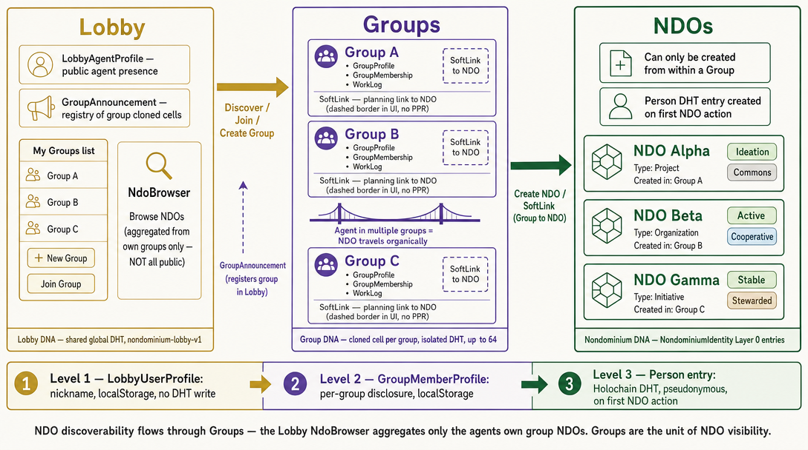

# Nondominium UI Architecture

**Status:** MVP implemented (see `documentation/IMPLEMENTATION_STATUS.md` for current status).  
**Cross-references:** `documentation/requirements/ui_design.md` (normative UI requirements), `documentation/requirements/requirements.md` (REQ-USER-* stories).

---

## 1. Overview

The Nondominium frontend is a SvelteKit application using Svelte 5 runes, Effect-TS for async state management, and UnoCSS for styling. It exposes the three-zome Holochain backend through a typed service + store layer and renders a three-level navigational hierarchy:



*Lobby (global shared DHT) discovers **Groups** via `GroupAnnouncement` — not NDOs directly. Each Group is a cloned Group DNA cell with its own isolated DHT; Groups link to NDOs via `SoftLink` entries. The Lobby's NdoBrowser aggregates only NDOs from the agent's own groups — there is no global public NDO registry. Identity deepens at each level: localStorage nickname (Level 1) → per-group profile (Level 2) → Person DHT entry on first NDO action (Level 3).*

This hierarchy maps to the three concentric organizational scopes in `ui_design.md`:

- **Lobby** — the entry point: all NDOs visible to any connected agent, Groups listed in sidebar.
- **Group** — organizational context: NDOs scoped to a group, where new NDOs are created.
- **NDO** — the resource identity detail view: Layer 0 metadata, lifecycle transitions, fork friction.

---

## 2. Technology Stack

| Layer | Technology |
|-------|-----------|
| Framework | SvelteKit 2 + Svelte 5 runes (`$state`, `$derived`, `$effect`) |
| Language | TypeScript (strict mode) |
| Styling | UnoCSS (atomic CSS, preset-wind) |
| Headless components | Melt UI next-gen (`melt`) |
| Async / error handling | Effect-TS (`effect` package) — `Context.Tag`, `Layer`, `E.gen` |
| Holochain client | `@holochain/client` 0.19.0 |
| Shared types | `@nondominium/shared-types` (workspace package) |
| Build | Vite 6.2.5 |

---

## 3. Layer Architecture

```
┌──────────────────────────────────────────────────────────────────┐
│ ROUTES                                                            │
│ /   (LobbyView)  /group/[id]  /ndo/[hash]  /ndo/new             │
└──────────────────────────────────────────────────────────────────┘
                                ↓
┌──────────────────────────────────────────────────────────────────┐
│ COMPONENTS                                                        │
│ lobby/: LobbyView, GroupSidebar, NdoBrowser, NdoCard,            │
│         UserProfileForm                                           │
│ group/: GroupView, NdoCreateModal, GroupProfileModal, MemberList  │
│ ndo/:   NdoView, NdoIdentityLayer, LifecycleTransitionModal,      │
│         TransitionHistoryPanel, ForkNdoModal                      │
│ shell/: Sidebar (global nav)                                      │
└──────────────────────────────────────────────────────────────────┘
                                ↓
┌──────────────────────────────────────────────────────────────────┐
│ STORES (Svelte 5 $state + Effect-TS)                              │
│ app.context.svelte.ts   — cross-view app state                    │
│ lobby.store.svelte.ts   — Lobby-level NDOs, groups, filters       │
│ group.store.svelte.ts   — Group-scoped NDOs                       │
│ resource.store.svelte.ts — ResourceSpecification list             │
└──────────────────────────────────────────────────────────────────┘
                                ↓
┌──────────────────────────────────────────────────────────────────┐
│ SERVICES (Effect-TS Context.Tag / Layer)                          │
│ person.service.ts    — PersonServiceTag / PersonServiceLive        │
│ resource.service.ts  — ResourceServiceTag / ResourceServiceLive   │
│ governance.service.ts — GovernanceServiceTag / Live               │
│ ndo.service.ts       — NdoServiceTag / NdoServiceLive             │
│ lobby.service.ts     — LobbyServiceTag / LobbyServiceLive         │
│ group.service.ts     — GroupServiceTag / GroupServiceLive (stub)  │
└──────────────────────────────────────────────────────────────────┘
                                ↓
┌──────────────────────────────────────────────────────────────────┐
│ HOLOCHAIN CLIENT                                                  │
│ holochain.service.svelte.ts — HolochainClientServiceTag           │
│ wrapZomeCallWithErrorFactory — wz<T>(fnName, payload, ctx)        │
└──────────────────────────────────────────────────────────────────┘
                                ↓
┌──────────────────────────────────────────────────────────────────┐
│ HOLOCHAIN CONDUCTOR (3-Zome DNA)                                  │
│ zome_person · zome_resource · zome_gouvernance                    │
└──────────────────────────────────────────────────────────────────┘
```

---

## 4. Three-Level Identity Model (MVP)

The MVP UI introduces three distinct identity layers that do **not** require DHT writes for the outer two, enabling permissionless browsing and progressive disclosure.

### Level 1 — Lobby (`LobbyUserProfile`, localStorage)

```typescript
interface LobbyUserProfile {
  nickname: string;       // required
  realName?: string;
  bio?: string;
  email?: string;
  phone?: string;
  address?: string;
}
```

- Stored in `localStorage` key `ndo_lobby_profile_v1`.
- Hydrated into `appContext.lobbyUserProfile` (`$state`) on first module load.
- Created/edited via `UserProfileForm.svelte` (modal on first launch, page-mode for edits).
- No DHT entry. Exists before any `Person` entry is created.

### Level 2 — Group (`GroupMemberProfile`, localStorage)

```typescript
interface GroupMemberProfile {
  isAnonymous: boolean;
  shownFields: (keyof Omit<LobbyUserProfile, 'nickname'>)[];
}
```

- Stored alongside `GroupDescriptor` in `localStorage` key `ndo_groups_v1`.
- Prompted once per group via `GroupProfileModal.svelte` on first group entry.
- Agent controls which `LobbyUserProfile` fields are visible to other group members.

### Level 3 — NDO/Agent (`Person` entry, `zome_person` DHT)

- Written to the DHT when an agent performs their first DHT-active action (create NDO, accept commitment).
- Linked to `AgentPubKey` on-chain.
- Required for governance participation, custodianship, specialised process access.
- Documented in `documentation/requirements/agent.md §2.1`.

---

## 5. Group Architecture (DNA-backed)

Groups are the mandatory context for NDO creation. Each group is a **cloned Group DNA cell** (`role_name: 'group'`, unique `network_seed`, `clone_limit: 64` in `workdir/happ.yaml`).

```typescript
interface GroupDescriptor {
  id: string;              // canonical key = network_seed
  networkSeed: string;
  name: string;
  description?: string;
  createdBy?: string;      // LobbyUserProfile.nickname at creation
  createdAt?: number;
  dnaHash?: string;        // clone cell DNA hash (base64)
  groupHash?: string;      // GroupProfile ActionHash (base64)
  memberProfile?: GroupMemberProfile; // Level 2 — localStorage only (ndo_group_profiles_v1)
}
```

**Lifecycle**: `createGroup` → `createCloneCell` → `create_group` → `join_group` → `announce_group` (Lobby DNA). **Invite links** encode `{ network_seed, group_dna_hash, group_name }` as `?group=<base64>`.

**NDO association**: NDOs live in the shared `nondominium` cell. A group's NDO list = `get_soft_links(group_hash)` on the group clone cell → resolve each `target_ndo_hash` via `resource.getNdo`.

---

## 6. Component Reference

### Lobby Level

| Component | File | Description |
|-----------|------|-------------|
| `LobbyView` | `lobby/LobbyView.svelte` | Root lobby layout: profile bar, sidebar, NdoBrowser |
| `UserProfileForm` | `lobby/UserProfileForm.svelte` | Lobby profile create/edit (modal or page mode) |
| `GroupSidebar` | `lobby/GroupSidebar.svelte` | Groups list, Create Group form, Join Group form, My Profile link |
| `NdoBrowser` | `lobby/NdoBrowser.svelte` | Filter chip bar (3 groups × multi-select) + NdoCard grid |
| `NdoCard` | `lobby/NdoCard.svelte` | Compact NDO summary card with lifecycle/nature/regime badges |

### Group Level

| Component | File | Description |
|-----------|------|-------------|
| `GroupView` | `group/GroupView.svelte` | Group header, invite link, Create NDO, group-scoped NdoBrowser, MemberList (DHT) |
| `NdoCreateModal` | `group/NdoCreateModal.svelte` | 5-field NDO creation form (name, regime, nature, stage, description) |
| `GroupProfileModal` | `group/GroupProfileModal.svelte` | Per-group profile presentation choice (first entry only) |

### NDO Level

| Component | File | Description |
|-----------|------|-------------|
| `NdoView` | `ndo/NdoView.svelte` | NDO detail: header, tab navigation, Fork button |
| `NdoIdentityLayer` | `ndo/NdoIdentityLayer.svelte` | Layer 0 identity panel: badges, initiator link, transition button, history |
| `LifecycleTransitionModal` | `ndo/LifecycleTransitionModal.svelte` | State machine transitions with special Deprecated / Hibernating handling |
| `TransitionHistoryPanel` | `ndo/TransitionHistoryPanel.svelte` | Collapsible history of lifecycle transitions |
| `ForkNdoModal` | `ndo/ForkNdoModal.svelte` | Informational fork friction modal with copy-pubkey CTA |

### Shell

| Component | File | Description |
|-----------|------|-------------|
| `Sidebar` | `shell/Sidebar.svelte` | Global nav — "Browse NDOs", context-aware "New NDO" link |

---

## 7. State Management

### `app.context.svelte.ts`

Cross-view singleton. All `$state` variables are module-level (Svelte 5 rune pattern):

| Field | Type | Persisted |
|-------|------|-----------|
| `myAgentPubKey` | `AgentPubKey \| null` | No |
| `myPerson` | `Person \| null` | No |
| `currentView` | `'lobby' \| 'group' \| 'ndo'` | No |
| `selectedGroupId` | `string \| null` | No |
| `selectedNdoId` | `ActionHash \| null` | No |
| `lobbyUserProfile` | `LobbyUserProfile \| null` | Yes — `localStorage` |

### `lobby.store.svelte.ts`

Effect-TS `E.gen` store instantiated once at module load via `E.runSync`.

| Reactive field | Derives from |
|----------------|-------------|
| `ndos` | `NdoServiceTag.getLobbyNdoDescriptors()` |
| `filteredNdos` | `ndos` + `activeFilters` (client-side OR-within/AND-across) |
| `groups` | `LobbyServiceTag.getMyGroups()` |
| `activeFilters` | Mutations via `setFilters()` / `clearFilters()` |
| `myPerson` | `PersonServiceTag.getMyPersonProfile()` |

### `group.store.svelte.ts`

Singleton per-session; `loadGroupData(groupId)` switches context:

| Field | Source |
|-------|--------|
| `group` | `LobbyServiceTag.getMyGroups()` |
| `groupNdos` | `NdoServiceTag.getGroupNdoDescriptors(groupId)` via SoftLinks |
| `members` | `GroupServiceTag.getMembers(cellId)` |

---

## 8. Service Layer

### Pattern

All services use the `wz<T>` factory:

```typescript
const wz = <T>(fnName: string, payload: unknown, context: string) =>
  wrapZomeCallWithErrorFactory<T, DomainError>(
    holochainClient, 'zome_name', fnName, payload, context, DomainError.fromError
  );
```

### `ndo.service.ts` — NdoServiceTag

| Method | Delegates to |
|--------|-------------|
| `getLobbyNdoDescriptors()` | Union of SoftLink targets across all group clone cells → `resource.getNdo` |
| `getNdoDescriptorForSpecActionHash(hash)` | Direct `resource.getNdo(hash)` first; fallbacks to listings/cache |
| `createNdo(input, groupId)` | `resource.createNdo(input)` + `create_soft_link` on group cell |
| `updateLifecycleStage(input)` | `resource.updateLifecycleStage(input)` |
| `getNdoTransitionHistory(hash)` | `resource.getNdoTransitionHistory(hash)` (zome fn not yet implemented; returns `[]`) |
| `getGroupNdoDescriptors(groupId)` | `get_soft_links` → resolve each target via `resource.getNdo` |
| `getAssociatedGroupIds(ndoHashB64)` | SoftLink scan across agent's groups |
| `joinNdo` / `getNdoMembers` | Stub — `NdoNotImplementedError` until `zome_resource` implements membership |

### `lobby.service.ts` — LobbyServiceTag (Group + Lobby DNA)

| Method | Behaviour |
|--------|-----------|
| `getMyGroups()` | Enumerate group clone cells from `appInfo` + `get_my_group` per cell |
| `createGroup(name, createdBy)` | `createCloneCell` → `create_group` → `join_group` → `announce_group` |
| `joinGroup(inviteCode)` | Decode invite → `createCloneCell(same seed)` → `join_group` if not member |
| `generateInviteLink(groupId)` | `{ network_seed, group_dna_hash, group_name }` → `?group=<base64>` URL |
| `getGroupCell(groupId)` | Resolve clone `CellId` by `network_seed` |
| `saveGroupMemberProfile(groupId, profile)` | `localStorage[ndo_group_profiles_v1]` (Level 2 identity) |

### `group.service.ts` — GroupServiceTag

| Method | Zome call |
|--------|-----------|
| `getMembers(cellId)` | `get_group_members` |
| `getSoftLinks` / `createSoftLink` | `get_soft_links` / `create_soft_link` |

---

## 9. Routing

| Route | Component | Notes |
|-------|-----------|-------|
| `/` | `LobbyView` | Lobby entry point; shows all NDOs |
| `/group/[id]` | `GroupView` | Group-scoped view; `?createNdo=1` auto-opens modal |
| `/ndo/[hashB64]` | `NdoView` | NDO detail (hash is base64-encoded `ActionHash`) |
| `/ndo/new` | Redirect page | Redirects to active group or shows explanation |

### Navigation Logic

- **"New NDO" link in Sidebar**: if `appContext.selectedGroupId` is set → `/group/{id}?createNdo=1`; else → `/ndo/new` (explanation screen).
- **Group navigation**: `GroupSidebar.svelte` calls `goto('/group/{id}')` after create/join.
- **Post-NDO-creation**: `NdoCreateModal.svelte` calls `goto('/ndo/{hashB64}')` on success.

---

## 10. NDO Lifecycle State Machine (Frontend Mirror)

`LifecycleTransitionModal.svelte` encodes the same state machine as the Rust validation in `zome_resource`. Allowed transitions:

| From | Allowed next stages |
|------|---------------------|
| Ideation | Specification, Deprecated, EndOfLife |
| Specification | Development, Deprecated, EndOfLife |
| Development | Prototype, Deprecated, EndOfLife |
| Prototype | Stable, Deprecated, EndOfLife |
| Stable | Distributed, Deprecated, EndOfLife |
| Distributed | Active, Deprecated, EndOfLife |
| Active | Hibernating, Deprecated, EndOfLife |
| Hibernating | `hibernation_origin` stage, Deprecated, EndOfLife |
| Deprecated | EndOfLife |

Special handling:
- **Deprecated**: requires successor NDO selection (autocomplete from `lobbyStore.ndos`).
- **Hibernating**: confirmation message shown; `hibernation_origin` preserved in entry.
- Transition button visible to **initiator only** (`descriptor.initiator === encodeHashToBase64(myAgentPubKey)`).
- `transition_event_hash` is passed as `null` in MVP (automatic EconomicEvent generation is a post-MVP backend task).

---

## 11. Filter Architecture (NdoBrowser)

Three independent chip groups with multi-select:

| Group | Options | Logic |
|-------|---------|-------|
| LifecycleStage | 10 variants | OR within group |
| ResourceNature | 5 variants | OR within group |
| PropertyRegime | 6 variants | OR within group |

**Cross-group logic**: AND (an NDO must match at least one selection in every active group).
**Default**: all filters empty = show all NDOs.
**Chip colors**: match the badge colors in `NdoIdentityLayer.svelte` color maps.

---

## 12. Fork Friction Pattern

Fork requests are intentionally non-trivial by design (see `ui_design.md` Fork section). The MVP implements:

- **Informational modal only** (`ForkNdoModal.svelte`): explains negotiation → consensus → Unyt stake (post-MVP) flow.
- **CTA**: copy initiator's `AgentPubKey` (base64) to clipboard for out-of-band contact.
- **Visibility**: Fork button visible to any authenticated user (anyone with `myAgentPubKey` set).
- Full fork submission (claim, vote, Unyt stake) is post-MVP.

---

## 13. Post-MVP UI Tracks

The following UI capabilities are documented but not yet implemented:

| Track | Trigger | Design reference |
|-------|---------|-----------------|
| NDO membership (`join_ndo`) | Backend stub in UI; implement `NdoMembership` in `zome_resource` | `documentation/zomes/resource_zome.md § NDO membership` |
| `get_ndo_transition_history` | Lifecycle audit panel empty until zome fn lands | `TransitionHistoryPanel.svelte` |
| NDO cell cloning | Per-NDO DHT once Holochain cloning stabilises | `ndo_prima_materia.md §4` |
| PPR / Reputation dashboard | After PPR zome functions are complete (#14–#21) | `specifications/governance/private-participation-receipt.md` |
| Economic Process workflows | After Phase 2.2 process infrastructure lands | `requirements.md §4.2`, `implementation_plan.md §5 Phase 2.2` |
| Person management components | After enhanced private data sharing (#40) | `requirements.md §4.1`, issue #8 |
| Role management UI | After agent promotion workflow (#33, #34) | `requirements.md §4.3` |
| Moss WeApplet | Post-MVP deployment target | `implementation_plan.md §12.6` |
| Unyt / Flowsta integration UI | Phases 12.2–12.3 in implementation plan | `post-mvp/unyt-integration.md`, `post-mvp/flowsta-integration.md` |

---

## 14. Effect-TS Patterns

### Service injection

```typescript
// Resolved layer for direct component use
export const NdoServiceResolved: Layer.Layer<NdoServiceTag> =
  NdoServiceLive.pipe(Layer.provide(ResourceServiceResolved));

// Usage in a Svelte $effect or onMount
const exit = await E.runPromiseExit(
  pipe(
    E.gen(function* () {
      const svc = yield* NdoServiceTag;
      return yield* svc.getLobbyNdoDescriptors();
    }),
    E.provide(NdoServiceResolved)
  )
);
```

### Store instantiation (Svelte 5 rune + Effect pattern)

```typescript
// Module-level $state variables (top-level only — Svelte 5 rune constraint)
let ndos = $state<NdoDescriptor[]>([]);

// Store created synchronously with E.runSync; Effect only provides dependencies
export const lobbyStore = pipe(
  createLobbyStore(),         // E.Effect<LobbyStore, never, Services>
  E.provide(LobbyStoreServicesResolved),
  E.runSync                   // services are pure/synchronous; no async at creation time
);
```

### Error handling

All zome errors are domain-tagged (`ResourceError`, `PersonError`, etc.) with `context` strings for debugging. Effects that may fail are run with `E.runPromiseExit`, and `Exit.isSuccess(exit)` guards all state mutations.
