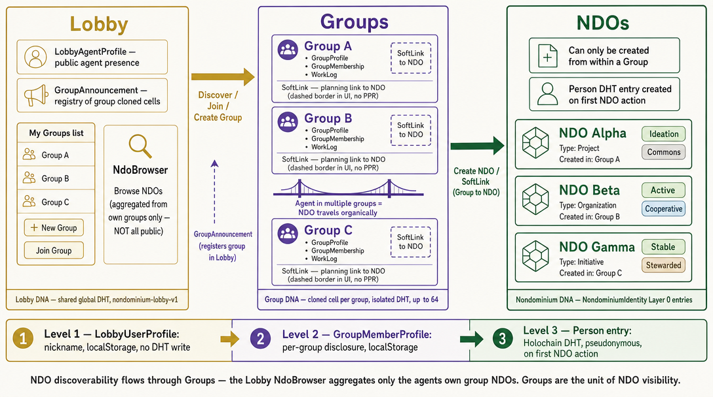

# Nondominium UI Architecture

**Status:** MVP implemented (see `documentation/IMPLEMENTATION_STATUS.md` for current status). Perspectives (§16) are the next planned UI work.  
**Cross-references:** `documentation/requirements/ui_design.md` (normative UI requirements), `documentation/requirements/requirements.md` (REQ-USER-* stories).

---

## 1. Overview

The Nondominium frontend is a SvelteKit application using Svelte 5 runes, Effect-TS for async state management, and UnoCSS for styling. It exposes the three-zome Holochain backend through a typed service + store layer and renders a three-level navigational hierarchy:



*Lobby (global shared DHT) discovers **Groups** via* `GroupAnnouncement` *— not NDOs directly. Each Group is a cloned Group DNA cell with its own isolated DHT; Groups point at NDOs via* `NdoAnchor` *entries, and each NDO is itself a cloned* `ndo` *cell (ADR-010 model A). The Lobby's NdoBrowser aggregates only NDOs from the agent's own groups — there is no global public NDO registry. Identity deepens at each level: localStorage nickname (Level 1) → per-group profile (Level 2) → Person DHT entry on first NDO action (Level 3).*

This hierarchy maps to the three concentric organizational scopes in `ui_design.md`:

- **Lobby** — the entry point: the NDOs aggregated from the agent's own groups, Groups listed in sidebar (no global public NDO registry).
- **Group** — organizational context: NDOs scoped to a group, where new NDOs are created.
- **NDO** — the resource identity detail view: Layer 0 metadata, lifecycle transitions, fork friction.

On top of this hierarchy, the **next** UI iteration adds a cross-cutting **Perspective** layer (Resource · Agent · Intelligence · Work) with a switcher and a navigation trail — see [§16](#16-perspectives-architecture-next-planned) and `ui_design.md § Perspectives`.

---


## 2. Technology Stack


| Layer                  | Technology                                                                      |
| ---------------------- | ------------------------------------------------------------------------------- |
| Framework              | SvelteKit 2 + Svelte 5 runes (`$state`, `$derived`, `$effect`)                  |
| Language               | TypeScript (strict mode)                                                        |
| Styling                | UnoCSS (atomic CSS, preset-wind)                                                |
| Headless components    | Melt UI next-gen (`melt`)                                                       |
| Async / error handling | Effect-TS (`effect` package) — `Context.Tag`, `Layer`, `E.gen`                  |
| Holochain client       | `@holochain/client` ^0.20.0                                                     |
| Shared types           | `@nondominium/shared-types` (workspace package)                                 |
| Build                  | Vite 7                                                                          |
| Dev runtime            | Browser (web) — Electron/`hc-spin` superseded by a per-agent Vite harness (§15) |


---


## 3. Layer Architecture

```
┌──────────────────────────────────────────────────────────────────┐
│ ROUTES                                                           │
│ /   (LobbyView)  /group/[id]  /ndo/[hash]  /ndo/new              │
└──────────────────────────────────────────────────────────────────┘
                                ↓
┌──────────────────────────────────────────────────────────────────┐
│ COMPONENTS                                                       │
│ lobby/: LobbyView, GroupSidebar, NdoBrowser, NdoCard,            │
│         UserProfileForm                                          │
│ group/: GroupView, NdoCreateModal, GroupProfileModal, MemberList │
│ ndo/:   NdoView, NdoIdentityLayer, LifecycleTransitionModal,     │
│         TransitionHistoryPanel, ForkNdoModal                     │
│ shell/: Sidebar (global nav)                                     │
└──────────────────────────────────────────────────────────────────┘
                                ↓
┌──────────────────────────────────────────────────────────────────┐
│ STORES (Svelte 5 $state + Effect-TS)                             │
│ app.context.svelte.ts   — cross-view app state                   │
│ lobby.store.svelte.ts   — Lobby-level NDOs, groups, filters      │
│ group.store.svelte.ts   — Group-scoped NDOs                      │
│ resource.store.svelte.ts — ResourceSpecification list            │
└──────────────────────────────────────────────────────────────────┘
                                ↓
┌──────────────────────────────────────────────────────────────────┐
│ SERVICES (Effect-TS Context.Tag / Layer)                         │
│ person.service.ts    — PersonServiceTag / PersonServiceLive      │
│ resource.service.ts  — ResourceServiceTag / ResourceServiceLive  │
│ governance.service.ts — GovernanceServiceTag / Live              │
│ ndo.service.ts       — NdoServiceTag / NdoServiceLive            │
│ lobby.service.ts     — LobbyServiceTag / LobbyServiceLive        │
│ group.service.ts     — GroupServiceTag / GroupServiceLive (stub) │
└──────────────────────────────────────────────────────────────────┘
                                ↓
┌──────────────────────────────────────────────────────────────────┐
│ HOLOCHAIN CLIENT                                                 │
│ holochain.service.svelte.ts — HolochainClientServiceTag          │
│ wrapZomeCallWithErrorFactory — wz<T>(fnName, payload, ctx)       │
└──────────────────────────────────────────────────────────────────┘
                                ↓
┌──────────────────────────────────────────────────────────────────┐
│ HOLOCHAIN CONDUCTOR (multi-DNA hApp)                             │
│ nondominium DNA: zome_person · zome_resource · zome_gouvernance  │
│ lobby DNA (provisioned) · group DNA (cloned per group)           │
│ ndo DNA (cloned per NDO, #112) · hrea DNA (vendored)             │
└──────────────────────────────────────────────────────────────────┘
```

---


## 4. Three-Level Identity Model (MVP)

The MVP UI introduces three distinct identity layers that do **not** require DHT writes for the outer two, enabling permissionless browsing and progressive disclosure.

### Level 1 — Lobby (`LobbyUserProfile`, localStorage)

```typescript
interface LobbyUserProfile {
  nickname: string;       // required
  realName?: string;
  bio?: string;
  email?: string;
  phone?: string;
  address?: string;
}
```

- Stored in `localStorage` key `ndo_lobby_profile_v1`.
- Hydrated into `appContext.lobbyUserProfile` (`$state`) on first module load.
- Created/edited via `UserProfileForm.svelte` (modal on first launch, page-mode for edits).
- No DHT entry. Exists before any `Person` entry is created.


### Level 2 — Group (`GroupMemberProfile`, localStorage)

```typescript
interface GroupMemberProfile {
  isAnonymous: boolean;
  shownFields: (keyof Omit<LobbyUserProfile, 'nickname'>)[];
}
```

- Stored alongside `GroupDescriptor` in `localStorage` key `ndo_groups_v1`.
- Prompted once per group via `GroupProfileModal.svelte` on first group entry.
- Agent controls which `LobbyUserProfile` fields are visible to other group members.


### Level 3 — NDO/Agent (`Person` entry, `zome_person` DHT)

- Written to the DHT when an agent performs their first DHT-active action (create NDO, accept commitment).
- Linked to `AgentPubKey` on-chain.
- Required for governance participation, custodianship, specialised process access.
- Documented in `documentation/requirements/agent.md §2.1`.

---


## 5. Group Architecture (DNA-backed)

Groups are the mandatory context for NDO creation. Each group is a **cloned Group DNA cell** (`role_name: 'group'`, unique `network_seed`, `clone_limit: 64` in `workdir/happ.yaml`).

```typescript
interface GroupDescriptor {
  id: string;              // canonical key = network_seed
  networkSeed: string;
  name: string;
  description?: string;
  createdBy?: string;      // LobbyUserProfile.nickname at creation
  createdAt?: number;
  dnaHash?: string;        // clone cell DNA hash (base64)
  groupHash?: string;      // GroupProfile ActionHash (base64)
  memberProfile?: GroupMemberProfile; // Level 2 — localStorage only (ndo_group_profiles_v1)
}
```

**Lifecycle**: `createGroup` → `createCloneCell` → `create_group` → `join_group` → `announce_group` (Lobby DNA). **Invite links** encode `{ network_seed, group_dna_hash, group_name }` as `?group=<base64>`.

**NDO association**: each NDO is its own cloned `ndo` cell (ADR-010 model A). A group's NDO list = `get_ndo_anchors(group_hash)` on the group clone cell; cards render straight from the anchors' cached fields, so browsing never joins an ndo cell. Opening an NDO resolves its cell from the anchor coordinates (`ensureNdoCloneCell`, provisioning it for a peer who never joined) and reads the live entry. Pre-migration NDOs in the shared `nondominium` cell still resolve through a legacy fallback. Full rationale: `documentation/specifications/adr/ADR-010-013-per-ndo-cells.md`.

---


## 6. Component Reference


### Lobby Level


| Component         | File                           | Description                                                      |
| ----------------- | ------------------------------ | ---------------------------------------------------------------- |
| `LobbyView`       | `lobby/LobbyView.svelte`       | Root lobby layout: profile bar, sidebar, NdoBrowser              |
| `UserProfileForm` | `lobby/UserProfileForm.svelte` | Lobby profile create/edit (modal or page mode)                   |
| `GroupSidebar`    | `lobby/GroupSidebar.svelte`    | Groups list, Create Group form, Join Group form, My Profile link |
| `NdoBrowser`      | `lobby/NdoBrowser.svelte`      | Filter chip bar (3 groups × multi-select) + NdoCard grid         |
| `NdoCard`         | `lobby/NdoCard.svelte`         | Compact NDO summary card with lifecycle/nature/regime badges     |


### Group Level


| Component           | File                             | Description                                                                      |
| ------------------- | -------------------------------- | -------------------------------------------------------------------------------- |
| `GroupView`         | `group/GroupView.svelte`         | Group header, invite link, Create NDO, group-scoped NdoBrowser, MemberList (DHT) |
| `NdoCreateModal`    | `group/NdoCreateModal.svelte`    | 5-field NDO creation form (name, regime, nature, stage, description)             |
| `GroupProfileModal` | `group/GroupProfileModal.svelte` | Per-group profile presentation choice (first entry only)                         |


### NDO Level


| Component                  | File                                  | Description                                                                |
| -------------------------- | ------------------------------------- | -------------------------------------------------------------------------- |
| `NdoView`                  | `ndo/NdoView.svelte`                  | NDO detail: header, tab navigation, Fork button                            |
| `NdoIdentityLayer`         | `ndo/NdoIdentityLayer.svelte`         | Layer 0 identity panel: badges, initiator link, transition button, history |
| `LifecycleTransitionModal` | `ndo/LifecycleTransitionModal.svelte` | State machine transitions with special Deprecated / Hibernating handling   |
| `TransitionHistoryPanel`   | `ndo/TransitionHistoryPanel.svelte`   | Collapsible history of lifecycle transitions                               |
| `ForkNdoModal`             | `ndo/ForkNdoModal.svelte`             | Informational fork friction modal with copy-pubkey CTA                     |


### Shell


| Component | File                   | Description                                              |
| --------- | ---------------------- | -------------------------------------------------------- |
| `Sidebar` | `shell/Sidebar.svelte` | Global nav — "Browse NDOs", context-aware "New NDO" link |

> **Planned (Perspectives, §16):** `shell/PerspectiveSwitcher.svelte`, `shell/NavigationTrail.svelte`, and a `perspectives/` component folder. `Sidebar`'s "Browse NDOs" link is expected to become the entry to the Resource Perspective.


---


## 7. State Management


### `app.context.svelte.ts`

Cross-view singleton. All `$state` variables are module-level (Svelte 5 rune pattern):


| Field              | Type                        | Persisted            |
| ------------------ | --------------------------- | -------------------- |
| `myAgentPubKey`    | `AgentPubKey | null`        | No                   |
| `myPerson`         | `Person | null`             | No                   |
| `currentView`      | `'lobby' | 'group' | 'ndo'` | No                   |
| `selectedGroupId`  | `string | null`             | No                   |
| `selectedNdoId`    | `ActionHash | null`         | No                   |
| `lobbyUserProfile` | `LobbyUserProfile | null`   | Yes — `localStorage` |

> **Planned (§16):** `currentPerspective` (`'resource' | 'agent' | 'intelligence' | 'work'`) and `navigationTrail` (stack of `PerspectiveLocation`) will be added here; `currentView` remains the Lobby/Group/NDO level *within* a Perspective.


### `lobby.store.svelte.ts`

Effect-TS `E.gen` store instantiated once at module load via `E.runSync`.


| Reactive field  | Derives from                                                |
| --------------- | ----------------------------------------------------------- |
| `ndos`          | `NdoServiceTag.getLobbyNdoDescriptors()`                    |
| `filteredNdos`  | `ndos` + `activeFilters` (client-side OR-within/AND-across) |
| `groups`        | `LobbyServiceTag.getMyGroups()`                             |
| `activeFilters` | Mutations via `setFilters()` / `clearFilters()`             |
| `myPerson`      | `PersonServiceTag.getMyPersonProfile()`                     |


### `group.store.svelte.ts`

Singleton per-session; `loadGroupData(groupId)` switches context:


| Field       | Source                                                        |
| ----------- | ------------------------------------------------------------- |
| `group`     | `LobbyServiceTag.getMyGroups()`                               |
| `groupNdos` | `NdoServiceTag.getGroupNdoDescriptors(groupId)` via SoftLinks |
| `members`   | `GroupServiceTag.getMembers(cellId)`                          |


- `loadGroupData(groupId, { silent? })` — on a full (non-silent) load it first runs `lobbyService.ensureMembership(groupId)` (idempotent self-heal so a joined agent always becomes a committed member), then fetches NDOs + members. A **silent** load (used by the pull layer) skips the membership reconcile, does not toggle `isLoading`, and keeps existing data on transient failure (no flicker/blanking).
- `refreshCurrentGroup()` — silent re-fetch of the currently-open group; driven by `GroupView`'s pull-based reactivity (tab focus / visibility change + gentle ~8 s poll while visible). `TODO(signals)`: replace the pull layer with Holochain remote signals (focus/poll kept only as an offline/missed-signal fallback).

---


## 8. Service Layer


### Pattern

All services use the `wz<T>` factory:

```typescript
const wz = <T>(fnName: string, payload: unknown, context: string) =>
  wrapZomeCallWithErrorFactory<T, DomainError>(
    holochainClient, 'zome_name', fnName, payload, context, DomainError.fromError
  );
```


### `ndo.service.ts` — NdoServiceTag


| Method                                    | Delegates to                                                                                                     |
| ----------------------------------------- | ---------------------------------------------------------------------------------------------------------------- |
| `getLobbyNdoDescriptors()`                | Union of SoftLink targets across all group clone cells → `resource.getNdo`                                       |
| `getNdoDescriptorForSpecActionHash(hash)` | Direct `resource.getNdo(hash)` first; fallbacks to listings/cache                                                |
| `createNdo(input, groupId)`               | `resource.createNdo(input)` + `create_soft_link` on group cell                                                   |
| `updateLifecycleStage(input)`             | `resource.updateLifecycleStage(input)`                                                                           |
| `getNdoTransitionHistory(hash)`           | `resource.getNdoTransitionHistory(hash)` (zome fn not yet implemented; returns `[]`)                             |
| `getGroupNdoDescriptors(groupId)`         | `get_soft_links` → resolve each target via `resource.getNdo`                                                     |
| `getAssociatedGroupIds(ndoHashB64)`       | SoftLink scan across agent's groups                                                                              |
| `joinNdo` / `getNdoMembers`               | DHT-backed via `zome_resource` `join_ndo` / `get_ndo_members` on the per-NDO clone cell; `joinNdo` is idempotent |


### `lobby.service.ts` — LobbyServiceTag (Group + Lobby DNA)


| Method                                     | Behaviour                                                                                                                                                                                                                                                                                                                                                                 |
| ------------------------------------------ | ------------------------------------------------------------------------------------------------------------------------------------------------------------------------------------------------------------------------------------------------------------------------------------------------------------------------------------------------------------------------- |
| `getMyGroups()`                            | Enumerate group clone cells from `appInfo` + `get_my_group` per cell                                                                                                                                                                                                                                                                                                      |
| `createGroup(name, createdBy)`             | `createCloneCell` → `create_group` → `join_group` → `announce_group` (the `join_group`/`announce_group` post-steps are best-effort via `E.catchAll`, so transient contention never aborts creation)                                                                                                                                                                       |
| `joinGroup(inviteCode)`                    | Decode invite → `createCloneCell(same seed)` → `fetchGroupProfileWithRetry` (poll `get_my_group`, 6× / ~2.4 s for DHT gossip) → `is_member` guard → best-effort `join_group` → on profile miss, build a `GroupDescriptor` from the invite payload so the group still appears immediately. `TODO(signals)`: replace the poll with a Holochain remote signal once available |
| `ensureMembership(groupId)`                | Idempotent membership self-heal: resolve group hash via `get_my_group` → `is_member` → best-effort `join_group` if missing. Covers joins that missed the membership commit (payload-fallback path / swallowed `join_group`). Called on every full `loadGroupData` so a joined agent always reconciles into the member list                                                |
| `generateInviteLink(groupId)`              | `{ network_seed, group_dna_hash, group_name }` → `?group=<base64>` URL                                                                                                                                                                                                                                                                                                    |
| `getGroupCell(groupId)`                    | Resolve clone `CellId` by `network_seed`                                                                                                                                                                                                                                                                                                                                  |
| `saveGroupMemberProfile(groupId, profile)` | `localStorage[ndo_group_profiles_v1]` (Level 2 identity)                                                                                                                                                                                                                                                                                                                  |


### `group.service.ts` — GroupServiceTag


| Method                            | Zome call                                                                                           |
| --------------------------------- | --------------------------------------------------------------------------------------------------- |
| `getMembers(cellId)`              | `get_group_members` (each member = action author of a `GroupMembership` linked from the group hash) |
| `getSoftLinks` / `createSoftLink` | `get_soft_links` / `create_soft_link`                                                               |


### Shared-group reactivity & data freshness

Shared-group items (members, NDO SoftLinks, work logs) live on the group clone-cell DHT and reach other members via **gossip**. The UI keeps views fresh with a **pull-only** model today (no push):

1. **Per-open reconciliation** — `loadGroupData` runs `ensureMembership` (self-heal) then re-reads members + NDOs whenever a group view mounts or `groupId` changes.
2. **Tab focus / visibility** — `GroupView` calls `refreshCurrentGroup()` (silent) when the window regains focus or the tab becomes visible.
3. **Gentle poll** — a ~8 s interval silent refresh while the group is open and the tab is visible (paused when hidden).
4. **Join gossip-retry + fallback** — `fetchGroupProfileWithRetry` in `joinGroup` absorbs the gossip latency of a freshly-cloned cell.

Consequence: a change made by another member appears within the poll interval, on focus, or on reload — not instantly. The **push** upgrade (`TODO(signals)`) is to have `zome_group` `remote_signal` members on `join_group` / `create_soft_link` / `log_work`, with the UI refreshing on those signals and the pull layer kept only as an offline/missed-signal fallback (consolidated design note in `dnas/group/zomes/coordinator/zome_group/src/lib.rs`).

---


## 9. Routing


| Route            | Component     | Notes                                              |
| ---------------- | ------------- | -------------------------------------------------- |
| `/`              | `LobbyView`   | Lobby entry point; shows all NDOs                  |
| `/group/[id]`    | `GroupView`   | Group-scoped view; `?createNdo=1` auto-opens modal |
| `/ndo/[hashB64]` | `NdoView`     | NDO detail (hash is base64-encoded `ActionHash`)   |
| `/ndo/new`       | Redirect page | Redirects to active group or shows explanation     |

**Planned Perspective routes (§16):** `/resource`, `/agent` (+ `/agent/[pubkey]`), `/intelligence`, `/work` (+ `/work/[projectHash]`). `/` remains the Lobby entry until the Resource Perspective replaces it as the default landing view.


### Navigation Logic

- **"New NDO" link in Sidebar**: if `appContext.selectedGroupId` is set → `/group/{id}?createNdo=1`; else → `/ndo/new` (explanation screen).
- **Group navigation**: `GroupSidebar.svelte` calls `goto('/group/{id}')` after create/join.
- **Post-NDO-creation**: `NdoCreateModal.svelte` calls `goto('/ndo/{hashB64}')` on success.

---


## 10. NDO Lifecycle State Machine (Frontend Mirror)

`LifecycleTransitionModal.svelte` encodes the same state machine as the Rust validation in `zome_resource`. Allowed transitions:


| From          | Allowed next stages                               |
| ------------- | ------------------------------------------------- |
| Ideation      | Specification, Deprecated, EndOfLife              |
| Specification | Development, Deprecated, EndOfLife                |
| Development   | Prototype, Deprecated, EndOfLife                  |
| Prototype     | Stable, Deprecated, EndOfLife                     |
| Stable        | Distributed, Deprecated, EndOfLife                |
| Distributed   | Active, Deprecated, EndOfLife                     |
| Active        | Hibernating, Deprecated, EndOfLife                |
| Hibernating   | `hibernation_origin` stage, Deprecated, EndOfLife |
| Deprecated    | EndOfLife                                         |


Special handling:

- **Deprecated**: requires successor NDO selection (autocomplete from `lobbyStore.ndos`).
- **Hibernating**: confirmation message shown; `hibernation_origin` preserved in entry.
- Transition button visible to **initiator only** (`descriptor.initiator === encodeHashToBase64(myAgentPubKey)`).
- `transition_event_hash` is passed as `null` in MVP (automatic EconomicEvent generation is a post-MVP backend task).

---


## 11. Filter Architecture (NdoBrowser)

Three independent chip groups with multi-select:


| Group          | Options     | Logic           |
| -------------- | ----------- | --------------- |
| LifecycleStage | 10 variants | OR within group |
| ResourceNature | 5 variants  | OR within group |
| PropertyRegime | 7 variants  | OR within group |


**Cross-group logic**: AND (an NDO must match at least one selection in every active group).
**Default**: all filters empty = show all NDOs.
**Chip colors**: match the badge colors in `NdoIdentityLayer.svelte` color maps.

---


## 12. Fork Friction Pattern

Fork requests are intentionally non-trivial by design (see `ui_design.md` Fork section). The MVP implements:

- **Informational modal only** (`ForkNdoModal.svelte`): explains negotiation → consensus → Unyt stake (post-MVP) flow.
- **CTA**: copy initiator's `AgentPubKey` (base64) to clipboard for out-of-band contact.
- **Visibility**: Fork button visible to any authenticated user (anyone with `myAgentPubKey` set).
- Full fork submission (claim, vote, Unyt stake) is post-MVP.

---


## 13. Post-MVP UI Tracks

The following UI capabilities are documented but not yet implemented. **Perspectives (§16) are not post-MVP: they are the next planned UI work** (see `ui_design.md § Perspectives ToDos`); only the parallax/landscape visual layer on top of them remains post-MVP.


| Track                                 | Trigger                                                                                                                                 | Design reference                                                                   |
| ------------------------------------- | --------------------------------------------------------------------------------------------------------------------------------------- | ---------------------------------------------------------------------------------- |
| NDO membership (`join_ndo`)           | Backend stub in UI; implement `NdoMembership` in `zome_resource`                                                                        | `documentation/zomes/resource_zome.md § NDO membership`                            |
| `get_ndo_transition_history`          | Lifecycle audit panel empty until zome fn lands                                                                                         | `TransitionHistoryPanel.svelte`                                                    |
| NDO cell cloning                      | Per-NDO DHT once Holochain cloning stabilises                                                                                           | `ndo_prima_materia.md §4`                                                          |
| PPR / Reputation dashboard            | After PPR zome functions are complete (#14–#21)                                                                                         | `specifications/governance/private-participation-receipt.md`                       |
| Economic Process workflows            | After Phase 2.2 process infrastructure lands                                                                                            | `requirements.md §4.2`, `implementation_plan.md §5 Phase 2.2`                      |
| Person management components          | After enhanced private data sharing (#40)                                                                                               | `requirements.md §4.1`, issue #8                                                   |
| Role management UI                    | After agent promotion workflow (#33, #34)                                                                                               | `requirements.md §4.3`                                                             |
| Moss WeApplet                         | Post-MVP deployment target                                                                                                              | `implementation_plan.md §12.6`                                                     |
| Unyt / Flowsta integration UI         | Phases 12.2–12.3 in implementation plan                                                                                                 | `post-mvp/unyt-integration.md`, `post-mvp/flowsta-integration.md`                  |
| Push reactivity via Holochain signals | Replace the pull layer (focus + poll + per-open reconcile) with `remote_signal` from `zome_group` on member/SoftLink/work-log mutations | `TODO(signals)` in `zome_group/src/lib.rs`, `GroupView.svelte`, `lobby.service.ts` |


---


## 14. Effect-TS Patterns


### Service injection

```typescript
// Resolved layer for direct component use
export const NdoServiceResolved: Layer.Layer<NdoServiceTag> =
  NdoServiceLive.pipe(Layer.provide(ResourceServiceResolved));

// Usage in a Svelte $effect or onMount
const exit = await E.runPromiseExit(
  pipe(
    E.gen(function* () {
      const svc = yield* NdoServiceTag;
      return yield* svc.getLobbyNdoDescriptors();
    }),
    E.provide(NdoServiceResolved)
  )
);
```


### Store instantiation (Svelte 5 rune + Effect pattern)

```typescript
// Module-level $state variables (top-level only — Svelte 5 rune constraint)
let ndos = $state<NdoDescriptor[]>([]);

// Store created synchronously with E.runSync; Effect only provides dependencies
export const lobbyStore = pipe(
  createLobbyStore(),         // E.Effect<LobbyStore, never, Services>
  E.provide(LobbyStoreServicesResolved),
  E.runSync                   // services are pure/synchronous; no async at creation time
);
```


### Error handling

All zome errors are domain-tagged (`ResourceError`, `PersonError`, etc.) with `context` strings for debugging. Effects that may fail are run with `E.runPromiseExit`, and `Exit.isSuccess(exit)` guards all state mutations.

---


## 15. Local Development & Multi-Agent Web Harness

The dev runtime is the **browser**, not Electron. The previous `hc-spin` flow streamed the full `.happ` (~8 MB) over the admin websocket and timed out, so local development is now orchestrated by `scripts/launch-happ.mjs` (invoked by `bun run start` / `AGENTS=N bun run network`).

### 15.1 Launcher responsibilities (`scripts/launch-happ.mjs`)

1. **Bootstrap + signaling**: spawns `kitsune2-bootstrap-srv` and parses its listening URLs.
2. **Sandboxes**: `hc sandbox --piped create -n N … webrtc <signal>` then `hc sandbox --piped run` (LAIR password piped on stdin).
3. **Path-based install**: connects an `AdminWebsocket` per conductor and calls `installApp({ source: { type: 'path', value: happPath } })` + `enableApp` — avoids the websocket bundle-streaming timeout.
4. **Connection manifest**: writes `ui/static/hc-connection.json` (`{ appId, agents: [{ agent, adminWsUrl, appWsUrl }], updatedAt }`), updated incrementally as each conductor comes up.
5. **One Vite server per agent**: `startUiServers()` spawns `bun run start` from `ui/` for each agent with `UI_PORT = basePort + (agent-1)` and `VITE_DEV_AGENT = agent`. Agent *n* → `http://localhost:{5173 + n - 1}`.
6. **Auto-open**: when a Vite server prints its `Local:` URL, the launcher opens a browser tab (`open` / `start` / `xdg-open`). Set `NO_OPEN=1` to disable (headless/CI).
7. **Shutdown**: `SIGINT`/`SIGTERM` tears down all UI servers, the sandbox, and the bootstrap server.


### 15.2 Why a port per agent

Each agent gets a **dedicated port = dedicated origin**, which yields fully isolated browser `localStorage` per agent while keeping URLs clean (no `?agent=` noise in permalinks). This replaced an earlier single-origin `?agent=N` approach. The query param is retained only as a manual override for advanced cases.

### 15.3 Agent selection (`ui/src/lib/utils/hc-connect.ts`)

`getDevAgentIndex()` resolves which conductor a window binds to, in priority order:

1. `?agent=N` query param (manual override).
2. `VITE_DEV_AGENT` env var (the primary mechanism — injected per Vite server by the launcher).
3. `localStorage[ndo_dev_agent]`, else default `1`.


### 15.4 Connection modes (`connectHolochainClient`)


| Mode       | Trigger                                       | Notes                                                                                                           |
| ---------- | --------------------------------------------- | --------------------------------------------------------------------------------------------------------------- |
| `launcher` | `window.__HC_LAUNCHER_ENV__` present          | hc-spin Electron path (legacy/optional)                                                                         |
| `manifest` | `/hc-connection.json` has agents              | **Primary web path**; picks the entry matching `getDevAgentIndex()`; polls up to 5 min while conductors install |
| `env`      | `VITE_HC_ADMIN_WS_URL` + `VITE_HC_APP_WS_URL` | manual override                                                                                                 |


In `manifest`/`env` modes the result carries the `adminWsUrl` so the UI can authorize signing credentials for **runtime-created group clone cells**.

### 15.5 Signing-credential authorization & resilience

- On connect, the UI calls `authorizeSigningCredentials` for **every** `provisioned` **and** `cloned` cell (clone cells lose in-memory signing credentials on reload, so their zome calls would otherwise fail).
- Grants are serialized (each is a source-chain commit); concurrent grants raise **"source chain head has moved"**, so `authorizeWithRetry` retries with backoff (5 attempts).
- `authorizeCellSigning(adminWsUrl, cellId)` is exported so a group clone cell created *after* initial connect (create/join group) is authorized on demand.


### 15.6 Per-agent UI-state namespacing

Because two windows *can* share an origin (the `?agent=` override), all UI-only `localStorage` keys are namespaced via `devStorageKey(base)` → `${base}__a{agentIndex}`:


| Base key                | Owner                                                    |
| ----------------------- | -------------------------------------------------------- |
| `ndo_lobby_profile_v1`  | `app.context.svelte.ts` (Level 1 profile)                |
| `ndo_group_profiles_v1` | `lobby.service.ts` (Level 2 disclosure prefs)            |
| `ndo_group_visited_v1`  | `GroupView.svelte` (first-visit prompt)                  |
| `ndo_dev_agent`         | dev agent index (not namespaced — it *is* the namespace) |


> Note: DHT-backed state (groups, NDOs, members) is isolated by the conductor itself; namespacing only protects the UI-only localStorage layer when origins are shared.


---

## 16. Perspectives Architecture (Next, planned)

**Status:** planned — next UI iteration after the MVP. Normative requirements: `documentation/requirements/ui_design.md § Perspectives` and `§ Perspectives ToDos`. Nothing below is implemented yet.

A **Perspective** is a lens (filters, default tools, layout) over data already reachable through the Lobby → Group → NDO hierarchy. Perspectives are **orthogonal** to that hierarchy: `currentView` (lobby/group/ndo) says *where* the agent is; `currentPerspective` says *how* the data is being looked at.

### 16.1 Perspectives and data sources

| Perspective | Route | Primary data | Backing services |
|---|---|---|---|
| Resource | `/resource` | NDOs across own groups; linked Agents (custodian, repair, ...); Sources | `NdoServiceTag`, `LobbyServiceTag`, `PersonServiceTag` |
| Agent | `/agent`, `/agent/[pubkey]` | Agent profiles, group members, skills, Group announcements | `PersonServiceTag`, `GroupServiceTag`, `LobbyServiceTag` |
| Intelligence | `/intelligence` | Groups and project-type NDOs, incl. ones outside the agent's own groups; role / skills / reputation (PPR) / interaction history | `LobbyServiceTag`, `NdoServiceTag`, `GovernanceServiceTag` (PPR) |
| Work | `/work`, `/work/[projectHash]` | Project-type NDOs the agent subscribed to or contributed to; tasks, commitments, contributions, stigmergic signals | `NdoServiceTag` (`joinNdo` / `getNdoMembers`), `GovernanceServiceTag`, `GroupServiceTag` |

Known gaps to close first: (1) a way to identify **project-type NDOs**; (2) cross-group / Lobby-level discovery — today the Lobby only aggregates the agent's *own* groups; (3) skills / reputation data (Person + PPR still in progress); (4) push signals for Work's stigmergic feed (pull-based polling as interim, see § 8).

### 16.2 State

Added to `app.context.svelte.ts` (module-level `$state`, Svelte 5 pattern):

```typescript
type Perspective = 'resource' | 'agent' | 'intelligence' | 'work';

interface PerspectiveLocation {
  perspective: Perspective;
  route: string;                 // e.g. '/agent/uhCAk…'
  entity?: { kind: 'ndo' | 'agent' | 'group' | 'project'; id: string; label: string };
  viewState?: unknown;           // filters, scroll, selection — restored on "back"
}

// appContext.currentPerspective: Perspective
// appContext.navigationTrail: PerspectiveLocation[]   (in-memory; not persisted)
```

A dedicated `perspective.store.svelte.ts` (Effect-TS pattern as in § 14) owns `jumpTo(target)`, `back()`, `switchTo(perspective)` and trail truncation, so components never mutate the trail directly.

### 16.3 Navigation semantics

- **Switch** (`switchTo`): user picks a Perspective in the switcher; trail is reset to that Perspective's root. Each Perspective remembers its last `viewState`.
- **Jump** (`jumpTo`): a contextual link carrying an entity (e.g. linked Agent in an NDO expanded view → Agent Perspective; joined project → Work). The current location is **pushed** on `navigationTrail` with its `viewState`.
- **Back** (`back`): pops the trail and restores route + `viewState`. `NavigationTrail.svelte` renders the stack as a breadcrumb (`Resource: Drill press → Agent: Alice → Groups`).
- **Hints**: `PerspectiveSwitcher.svelte` may show a contextual badge when another Perspective is relevant (e.g. "Discover projects" in Work → Intelligence).

Jump table (authoritative list in `ui_design.md § Cross-Perspective Navigation`): Work → Intelligence; Intelligence → Work (on join); Resource → Agent (linked Agent); Agent → Resource; Agent/Intelligence → Work or Group (on join).

### 16.4 Tools (perspective-agnostic)

Tools are **not** Perspectives. A small tool registry (`tools/registry.ts`) lets any Perspective mount a tool over its current entity set via a typed contract:

```typescript
interface PerspectiveTool<T> {
  id: string;                          // 'map', 'simulation', 'kanban', ...
  accepts: (kind: EntityKind) => boolean;
  component: Component<{ entities: T[]; onSelect: (e: T) => void }>;
}
```

The **Geographic map** is the first tool (it replaces the former Geographic Perspective): opened from Resource it maps NDOs, from Agent it maps Agents, from Intelligence it maps opportunities. Kanban is Work-scoped; simulations (e.g. benefit redistribution) are primarily hosted by Intelligence.

### 16.5 Component / file plan

| Component | File | Role |
|---|---|---|
| `PerspectiveSwitcher` | `shell/PerspectiveSwitcher.svelte` | Persistent switcher + contextual hints |
| `NavigationTrail` | `shell/NavigationTrail.svelte` | Breadcrumb + "Back to <origin>" |
| `ResourcePerspective` | `perspectives/ResourcePerspective.svelte` | Seeded from `NdoBrowser`; adds linked-Agent view |
| `AgentPerspective` / `AgentProfileView` | `perspectives/AgentPerspective.svelte` | Agent search, profile, connections, Group discovery |
| `IntelligencePerspective` | `perspectives/IntelligencePerspective.svelte` | Ranked discovery + tool slot |
| `WorkPerspective` / `ProjectWorkspace` | `perspectives/WorkPerspective.svelte` | Project list, kanban, tasks, signals |
| `ToolHost` | `tools/ToolHost.svelte` | Mounts registered tools in any Perspective |

Implementation order follows `ui_design.md § Perspectives ToDos`: switcher and trail first, then Resource (reusing `NdoBrowser`), Agent, Intelligence, Work.
