# User Story: Resource Transaction Process

## Scenario: Two Organizations Sharing Equipment via Tiki Wiki Integration

**Context**: Sensorica (a maker space) and FabLab (a fabrication lab) want to share a CNC machine through their Tiki Wiki platform integration with Nondominium.

---

## 🎯 The Players

### **Sarah** - Sensorica Resource Coordinator

- **Role**: Primary Accountable Agent (Custodian)
- **Goal**: Make expensive equipment available to partner organizations
- **Reputation**: High PPR scores in ResourceValidation and CustodyTransfer

### **Marco** - FabLab Technical Manager

- **Role**: Accountable Agent with Transport & Repair specializations
- **Goal**: Access CNC machine for prototype production
- **Reputation**: Strong performance in TransportService and RepairService

### **The Resource**

- **CNC Machine Model**: Proxxon MF70 (modified)
- **Current Location**: Sensorica Workshop, Montreal
- **Governance Rules**: Requires certified operators, insurance validation

---

## 🔄 Transaction Journey

### **Phase 1: Discovery & Intent (Day 1)**

**Sarah's Actions**:

1. **Resource Discovery**: Marco searches Tiki Wiki for available fabrication equipment
2. **Governance Review**: Marco reviews CNC machine's embedded governance rules:
   - Requires Transport certification ✅
   - Proof of facility insurance required
   - Minimum 48-hour notice for transport
3. **Intent Signaling**: Marco submits `AccessForUse` commitment through Tiki interface

### **Phase 2: Validation & Trust Building (Day 2)**

**Multi-Party Validation**:

1. **Identity Verification**: Sarah validates Marco's credentials and insurance
2. **Capability Check**: System validates Marco's Transport certification
3. **Reputation Assessment**: Sarah reviews Marco's PPR summary:
   - 98% on-time delivery rate
   - 4.8/5 quality score
   - 12 successful transport completions

### **Phase 3: Resource Preparation (Day 3)**

**Sarah's Preparation**:

1. **Resource State Update**: Changes CNC from `Active` to `Reserved`
2. **Transport Documentation**: Creates transport checklist and safety protocols
3. **Insurance Coordination**: Uploads facility insurance certificate

### **Phase 4: Transport Process (Day 4)**

```mermaid
sequenceDiagram
    participant Marco as Marco (FabLab)
    participant Sarah as Sarah (Sensorica)
    participant Tiki as Tiki Wiki
    participant ND as Nondominium
    participant Res as Resource Zome
    participant PPR as PPR System

    Marco->>Tiki: Arrive for transport
    Tiki->>ND: initiate_transport_process()
    ND->>Gov: Validate Marco's Transport role
    Sarah->>Tiki: Scan QR code on CNC machine
    Marco->>Tiki: Scan QR code confirmation
    Tiki->>ND: transfer_custody()
    ND->>Res: Update custodian: Sarah → Marco
    ND->>Gov: log_economic_event(TransferCustody)
    Gov->>PPR: issue_participation_receipts()
    PPR-->>ND: Generate PPRs for both agents
    ND-->>Tiki: Update transport status
```

**The Physical Transfer**:

1. **Transport Initiation**: Marco arrives with certified transport equipment
2. **Custody Transfer Ceremony**: Both agents scan QR codes on CNC machine
3. **Multi-Signature Process**: Bilateral cryptographic signatures executed
4. **Real-time Updates**: Tiki Wiki shows live transport status

### **Phase 5: Usage & Monitoring (Week 1-2)**

**Resource Utilization**:

1. **Use Process Activation**: Marco initiates CNC machine for prototype production
2. **Quality Monitoring**: System tracks usage hours and maintenance needs
3. **Progress Reporting**: Daily usage logs through Tiki interface
4. **Performance Metrics**: Automatic PPR generation for each use session

### **Phase 6: Return & Completion (Day 15)**

```mermaid
sequenceDiagram
    participant Marco as Marco (FabLab)
    participant Sarah as Sarah (Sensorica)
    participant Tiki as Tiki Wiki
    participant ND as Nondominium
    participant PPR as PPR System

    Marco->>Tiki: Complete maintenance checklist
    Tiki->>ND: claim_commitment()
    Marco->>Tiki: Initiate return transport
    Tiki->>ND: initiate_transport_process()
    Sarah->>Tiki: Scan return QR code
    Tiki->>ND: transfer_custody()
    ND->>Res: Update custodian: Marco → Sarah
    Sarah->>Tiki: Inspect and approve return
    Tiki->>ND: validate_specialized_role()
    ND->>Gov: Create validation receipts
    Gov->>PPR: issue_participation_receipts()
    PPR-->>ND: Update reputation scores
    ND-->>Tiki: Transaction complete
```

**Return Process**:

1. **Maintenance Check**: Marco performs routine maintenance and documents condition
2. **Return Transport**: Reverse transport with same validation process
3. **Final Assessment**: Sarah inspects returned equipment
4. **Bilateral PPR Issuance**: Both agents receive participation receipts

---

## 🏆 Transaction Outcomes

### **Immediate Benefits**

- ✅ **Cost Savings**: FabLab saves $15,000 on equipment purchase
- ✅ **Revenue**: Sensorica earns $800 usage fee
- ✅ **Capacity Building**: Both organizations expand fabrication capabilities
- ✅ **Trust Enhancement**: PPR scores improved for both agents

### **Reputation Impact**

**Sarah's PPR Updates**:

- +1 CustodyTransfer (outgoing)
- +1 GoodFaithTransfer
- Performance: 5.0/5 reliability score

**Marco's PPR Updates**:

- +1 CustodyAcceptance (incoming)
- +1 TransportService completion
- Performance: 4.9/5 overall satisfaction

### **Network Effects**

- **New Resource Discovery**: Two other organizations express interest in similar sharing
- **Process Optimization**: Transport protocol refined for future transactions
- **Community Building**: Sensorica and FabLab plan collaborative training workshop

---

## 🔗 Web2 Integration Features

### **System Architecture Integration**

### **Tiki Wiki Interface**

- **Resource Gallery**: Visual catalog with availability calendars
- **Agent Profiles**: Public reputation summaries with privacy controls
- **Workflow Dashboard**: Step-by-step transaction tracking
- **Notification System**: Real-time updates via email and Tiki messages

### **Enterprise Integration**

- **Synchronization**: Resource status synced with inventory management systems
- **Reporting**: Usage analytics and financial reconciliation
- **Compliance**: Automatic audit trail for insurance and regulatory requirements
- **API Access**: RESTful endpoints for custom workflow integrations

### **User Experience**

- **Mobile App**: Field operations with QR code scanning
- **Document Management**: Secure storage of certificates and agreements
- **Communication Hub**: Integrated messaging for coordination
- **Analytics Dashboard**: Usage patterns and cost optimization insights

---

## 💡 Key Innovation Highlights

### **Trust Without Platforms**

- No central authority controlling the resource
- Direct peer-to-peer governance through embedded rules
- Cryptographic reputation that travels with agents

### **Privacy-Preserving Transparency**

- Economic events publicly visible for accountability
- Private operational details protected through capability access
- Selective disclosure of sensitive information

### **Progressive Trust Building**

- Start with basic resource sharing
- Build reputation through successful transactions
- Unlock more complex collaborative opportunities

### **Composable Workflows**

- Transport → Use → Maintenance → Return processes
- Multi-agent coordination for complex projects
- Automated governance enforcement at each step

---

## 🎯 Business Value Proposition

### **Web2 Integration Benefits**

### **For Web2 Platforms**

- **New Revenue Streams**: Transaction fees and premium features
- **User Engagement**: Increased platform stickiness through reputation
- **Network Effects**: Growing ecosystem of shared resources
- **Competitive Advantage**: Differentiation through decentralized trust

### **For Organizations**

- **Resource Optimization**: Better utilization of expensive equipment
- **Cost Reduction**: Shared access to specialized tools and facilities
- **Risk Management**: Insured transactions with clear accountability
- **Innovation Enablement**: Access to resources without capital investment

### **For the Community**

- **Sustainability**: Reduced waste through resource sharing
- **Accessibility**: Democratized access to expensive equipment
- **Skill Development**: Knowledge sharing through collaboration
- **Economic Resilience**: Distributed resource ownership

---

**This user story demonstrates how Nondominium enables Web2 platforms to transform from simple content management systems into powerful engines for decentralized resource sharing, combining the familiarity of existing platforms with the trust and transparency of blockchain-based governance.**

---

_Transaction completed successfully in 15 days with both organizations reporting high satisfaction and expressing interest in expanding their sharing partnership._
