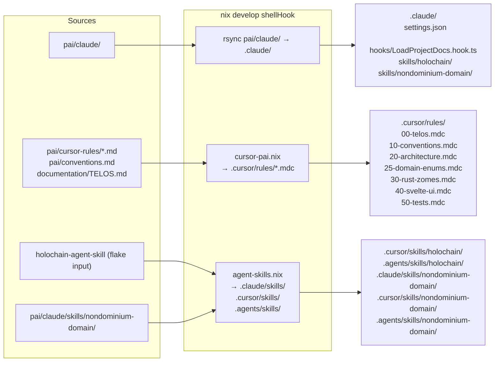
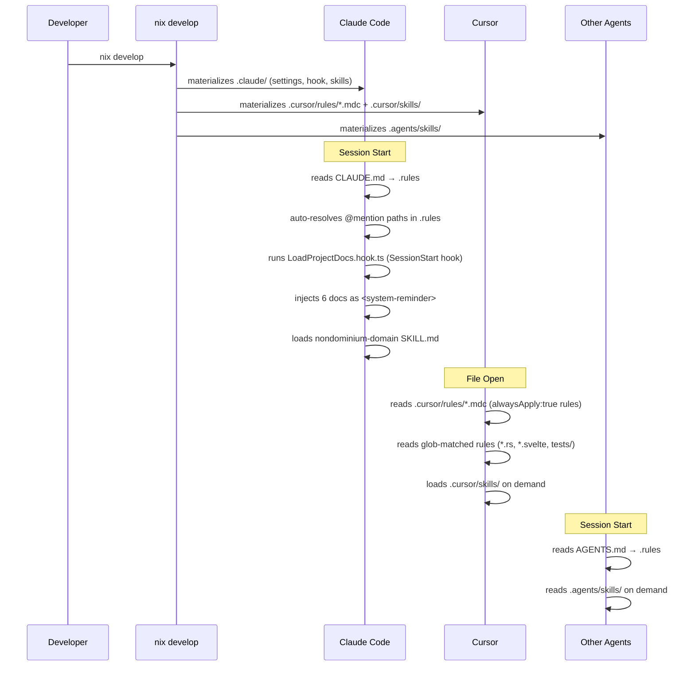
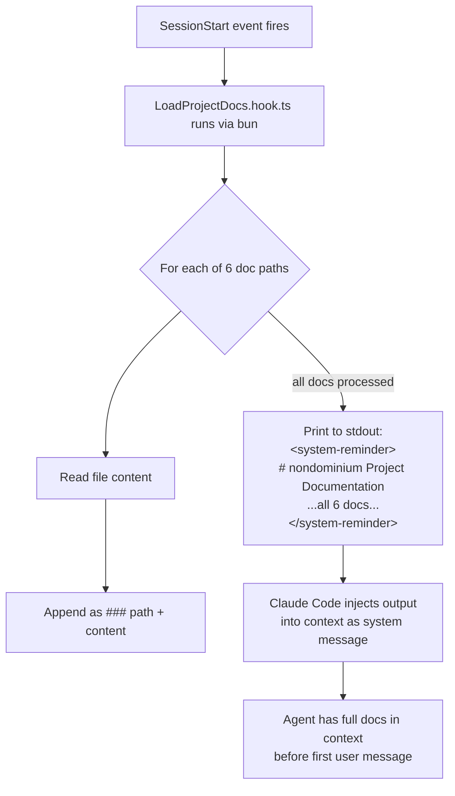
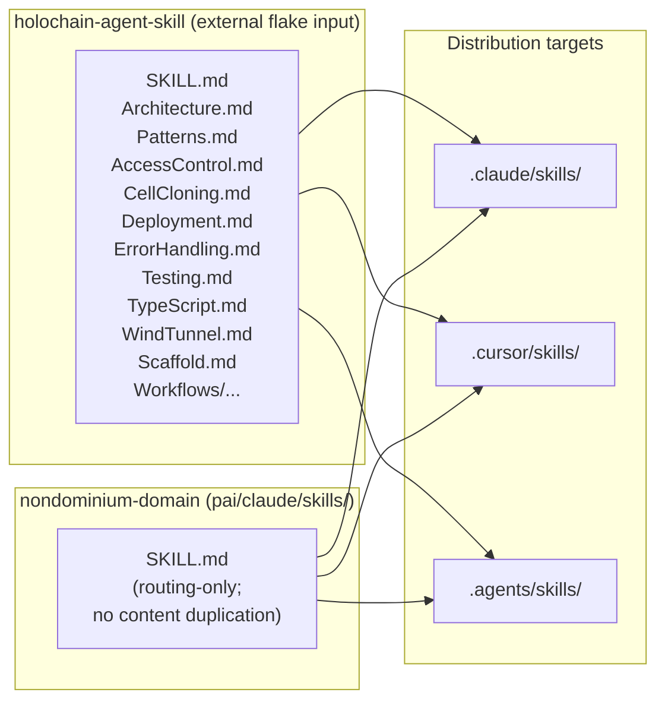
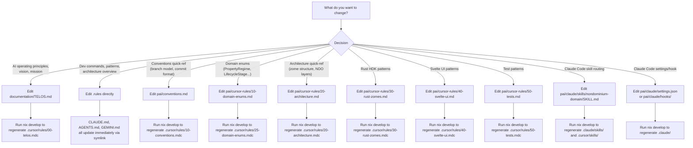

# `pai/` — AI Agent Integration

This directory is the **single source of truth** for all AI agent configuration in the
nondominium project. It feeds Claude Code, Cursor, and any `AGENTS.md`-compatible agent
through one authoring location and a Nix-driven materialization pipeline.

---

## Quick Mental Model

```
pai/          ← you edit here
  ↓ nix develop
.claude/      ← Claude Code reads this
.cursor/      ← Cursor reads this
.agents/      ← other agents read this
```

The `.rules` file at the project root is the canonical agent instruction file. `CLAUDE.md`,
`AGENTS.md`, and `GEMINI.md` are all symlinks pointing at it. When you run `nix develop`,
the shellHook materializes everything else from `pai/`.

---

## Architecture Overview

```mermaid
graph TD
    subgraph "Source of Truth (pai/)"
        RULES[".rules<br/>(canonical agent rules)"]
        CONV["pai/conventions.md"]
        CR10["pai/cursor-rules/10-domain-enums.md"]
        CR20["pai/cursor-rules/20-architecture.md"]
        CR30["pai/cursor-rules/30-rust-zomes.md"]
        CR40["pai/cursor-rules/40-svelte-ui.md"]
        CR50["pai/cursor-rules/50-tests.md"]
        HOOK["pai/claude/hooks/LoadProjectDocs.hook.ts"]
        CSET["pai/claude/settings.json"]
        CSKILL["pai/claude/skills/nondominium-domain/SKILL.md"]
    end

    subgraph "Project Root Symlinks"
        CLAUDE_MD["CLAUDE.md → .rules"]
        AGENTS_MD["AGENTS.md → .rules"]
        GEMINI_MD["GEMINI.md → .rules"]
    end

    subgraph "Nix Materialized (nix develop)"
        CLAUDE_DIR[".claude/<br/>settings.json<br/>hooks/<br/>skills/"]
        CURSOR_DIR[".cursor/rules/<br/>*.mdc files<br/><br/>.cursor/skills/<br/>holochain/<br/>nondominium-domain/"]
        AGENTS_DIR[".agents/skills/<br/>holochain/<br/>nondominium-domain/"]
    end

    subgraph "External Inputs"
        HC_SKILL["holochain-agent-skill<br/>(flake input)"]
    end

    RULES --> CLAUDE_MD
    RULES --> AGENTS_MD
    RULES --> GEMINI_MD

    CONV --> CURSOR_DIR
    CR10 --> CURSOR_DIR
    CR20 --> CURSOR_DIR
    CR30 --> CURSOR_DIR
    CR40 --> CURSOR_DIR
    CR50 --> CURSOR_DIR
    HOOK --> CLAUDE_DIR
    CSET --> CLAUDE_DIR
    CSKILL --> CLAUDE_DIR
    CSKILL --> CURSOR_DIR
    CSKILL --> AGENTS_DIR

    HC_SKILL --> CLAUDE_DIR
    HC_SKILL --> CURSOR_DIR
    HC_SKILL --> AGENTS_DIR
```



---

## The `.rules` File and Its Symlinks

`.rules` is a single Markdown file that every AI agent reads. It covers:

- `@mention` references to the 6 canonical documentation files
- Development environment setup (nix, bun, build commands)
- Architecture overview (3-zome structure, technology stack)
- Key development patterns (entry creation, privacy model, function naming)
- Test architecture summary

Three root-level files are symlinks to it so each tool finds its expected filename:

| File | Used by |
|------|---------|
| `CLAUDE.md` | Claude Code (CLI reads this filename by convention) |
| `AGENTS.md` | OpenAI Codex, Windsurf, and any `AGENTS.md`-spec agent |
| `GEMINI.md` | Gemini Code Assist |

Editing `.rules` updates all three simultaneously. **Never edit the symlinks directly.**

### `@` References in `.rules`

Claude Code natively resolves `@path` mentions and auto-loads the referenced files into
context. The 6 mentions in `.rules` are:

```
@documentation/TELOS.md
@documentation/requirements/requirements.md
@documentation/requirements/agent.md
@documentation/requirements/resources.md
@documentation/requirements/governance.md
@documentation/specifications/specifications.md
```

Other agents that do not support `@` syntax receive only the text of `.rules` itself.
The session hook (below) compensates for this in Claude Code, and Cursor rules cover
it through embedded content in `.mdc` files.

---

## Nix Materialization Pipeline

Running `nix develop` triggers the shellHook in `flake.nix`, which materializes three
IDE-specific directories from the `pai/` source:



The `.claude/`, `.cursor/`, and `.agents/` directories are **generated artifacts**. Do not
edit them directly. Changes belong in `pai/` and take effect on the next `nix develop`.

---

## How Each Agent Gets Context

The pipeline gives different agents context through different mechanisms:



### Claude Code Context Chain

1. `CLAUDE.md` → `.rules`: base instructions + `@` auto-loads 6 docs
2. `LoadProjectDocs.hook.ts` (SessionStart): reads the same 6 docs independently and
   injects them as `<system-reminder>` content — ensures docs are present even if
   `@` resolution fails or context is fresh
3. `nondominium-domain` SKILL.md: provides task-based routing table to all documentation

### Cursor Context Chain

Cursor rules are generated from `pai/` by `nix/cursor-pai.nix`. Each `.mdc` file embeds
source content directly (not `@` references):

| File | Source | `alwaysApply` | Glob |
|------|--------|--------------|------|
| `00-telos.mdc` | `documentation/TELOS.md` | `true` | all files |
| `01-requirements.mdc` | `documentation/requirements/requirements.md` | `true` | all files |
| `02-agent.mdc` | `documentation/requirements/agent.md` | `true` | all files |
| `03-resources.mdc` | `documentation/requirements/resources.md` | `true` | all files |
| `04-governance.mdc` | `documentation/requirements/governance.md` | `true` | all files |
| `05-specifications.mdc` | `documentation/specifications/specifications.md` | `true` | all files |
| `10-conventions.mdc` | `pai/conventions.md` | `true` | all files |
| `20-architecture.mdc` | `pai/cursor-rules/20-architecture.md` | `true` | all files |
| `25-domain-enums.mdc` | `pai/cursor-rules/10-domain-enums.md` | `true` | all files |
| `30-rust-zomes.mdc` | `pai/cursor-rules/30-rust-zomes.md` | `false` | `**/*.rs` |
| `40-svelte-ui.mdc` | `pai/cursor-rules/40-svelte-ui.md` | `false` | `**/*.svelte` |
| `50-tests.mdc` | `pai/cursor-rules/50-tests.md` | `false` | `dnas/**/tests/**/*.rs` |

---

## The `LoadProjectDocs.hook.ts` Hook

Located at `pai/claude/hooks/LoadProjectDocs.hook.ts` (materialized to `.claude/hooks/`).

Triggered by the `SessionStart` event in `.claude/settings.json`:

```json
{
  "hooks": {
    "SessionStart": [{ "hooks": [{ "type": "command", "command": "bun .claude/hooks/LoadProjectDocs.hook.ts" }] }]
  }
}
```

The hook reads six documentation files from `PROJECT_DIR` (two levels up from the hook
file) and writes them to stdout as a `<system-reminder>` block:



The 6 injected files are:
- `documentation/TELOS.md` — vision, mission, AI operating principles
- `documentation/requirements/requirements.md` — REQ-* IDs, user roles, economic processes
- `documentation/requirements/agent.md` — agent ontology, roles, affiliation spectrum
- `documentation/requirements/resources.md` — resource ontology, property regimes
- `documentation/requirements/governance.md` — governance model, governance-as-operator
- `documentation/specifications/specifications.md` — entry types, zome functions, UI specs

---

## Skills Architecture

Two skills are distributed to all agent systems:



**`holochain-agent-skill`** — general Holochain HDK knowledge (zome patterns, testing,
TypeScript client, access control). Sourced from an external Nix flake input. Use this
for generic Holochain questions not specific to nondominium.

**`nondominium-domain`** — routing-only skill. Its `SKILL.md` is a table that maps tasks
to the correct documentation section. It does not duplicate content; it redirects.
All actual domain knowledge lives in `documentation/`. The skill is the index, not the book.

The `nondominium-domain` skill activates automatically in Claude Code when working on:
- resource zome, governance zome, or person zome
- lifecycle transitions or NDO layer activation
- PPR issuance or reputation derivation
- capability slots or stigmergic attachment patterns

---

## `pai/` Editing Workflow



**Rule:** Always edit in `pai/` (or `.rules` / `documentation/`), never in `.claude/`,
`.cursor/`, or `.agents/`. Those directories are generated by `nix develop` and will be
overwritten on the next shell entry.

---

## File Map

```
pai/
├── README.md                              ← this file
├── conventions.md                         ← conventions quick-reference (all agents)
├── cursor-rules/
│   ├── 10-domain-enums.md                 ← canonical enum reference
│   ├── 20-architecture.md                 ← zome structure, NDO layers
│   ├── 30-rust-zomes.md                   ← HDK patterns, cross-zome calls
│   ├── 40-svelte-ui.md                    ← Svelte 5, Effect-TS, Melt UI
│   └── 50-tests.md                        ← Sweettest patterns
└── claude/
    ├── settings.json                      ← Claude Code project settings + hook wiring
    ├── hooks/
    │   └── LoadProjectDocs.hook.ts        ← SessionStart: injects 6 docs into context
    └── skills/
        └── nondominium-domain/
            └── SKILL.md                   ← routing skill (task → documentation section)

.rules                                     ← canonical agent rules (CLAUDE.md/AGENTS.md/GEMINI.md → here)
nix/
├── cursor-pai.nix                         ← builds .cursor/rules/*.mdc from pai/
└── agent-skills.nix                       ← rsyncs skills to .claude/, .cursor/, .agents/
flake.nix                                  ← shellHook runs both nix helpers
```

---

## Adding a New Documentation File to Agent Context

To inject a new documentation file into Claude Code sessions:

1. Add the relative path to the `DOCS` array in `pai/claude/hooks/LoadProjectDocs.hook.ts`
2. Add an `@` mention in `.rules` at the appropriate section
3. If the file belongs in Cursor context, add a new rule entry in `nix/cursor-pai.nix`
4. Run `nix develop` to regenerate materialized files

## Adding a New Cursor Rule

1. Create `pai/cursor-rules/NN-name.md` with the rule content
2. Add a `rules` entry in `nix/cursor-pai.nix` pointing at the new file
3. Set `alwaysApply` and `globs` appropriately
4. Run `nix develop`

## Adding a New Agent Skill

1. Create the skill directory under `pai/claude/skills/<name>/`
2. Add the skill to the `agentSkillsHook` call in `flake.nix`
3. Run `nix develop` to distribute it to `.claude/skills/`, `.cursor/skills/`, `.agents/skills/`
