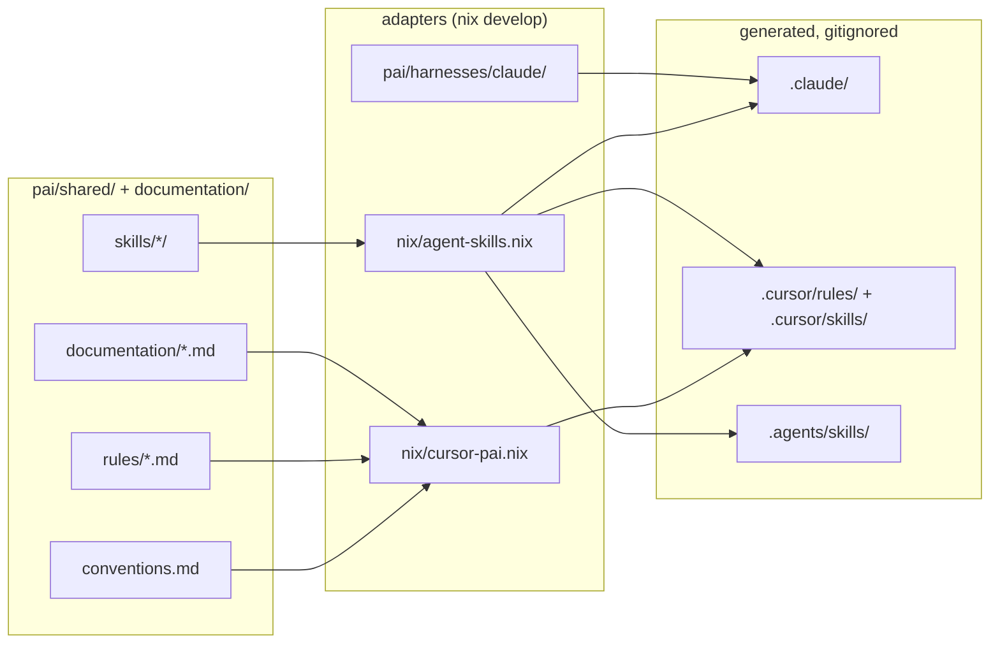

# `pai/` — Project AI Configuration

Single source of truth for the AI agent configuration in this repository. One authoring location, harness-agnostic, with per-harness adapters generated by `nix develop`.

---

## The Architecture

The organising rule: **content that describes the project is harness-agnostic; only the packaging is harness-specific.**

```
pai/
├── nondominium.code-workspace  ← VS Code workspace file; kept at this path because
│                                 editors resolve it by location, not by our layout
├── shared/                 ← harness-agnostic. Every agent gets this content.
│   ├── conventions.md          conventions quick-reference
│   ├── human_ai_collaboration.md   how we delegate to agents, and what stays human
│   ├── rules/                  project knowledge, one file per concern
│   │   ├── 10-domain-enums.md
│   │   ├── 20-architecture.md
│   │   ├── 30-rust-zomes.md
│   │   ├── 40-svelte-ui.md
│   │   └── 50-tests.md
│   └── skills/                 agent skills, distributed to every harness
│       ├── nondominium-domain/
│       ├── nondominium-review/
│       └── complexity-oriented-programming/
└── harnesses/              ← adapters. Only what a specific tool needs.
    └── claude/
        ├── settings.json       Claude Code project settings
        └── commands/           slash commands (Claude Code only)
            └── nondominium-review.md
```

### Invoking a skill as a slash command

`/name` is not one mechanism, it is two, and knowing which one a tool uses decides where a file belongs.

| Tool | How `/nondominium-review` resolves | What we ship for it |
|---|---|---|
| **Cursor** | Skills **are** the slash-command mechanism. Typing `/` lists the skills in `.cursor/skills/` and `.agents/skills/` and attaches the chosen one to the message. | Nothing extra. The skill we already distribute IS the command. |
| **Any Agent Skills client** (`.agents/skills/`) | Same: the standard skill directory is the portable command surface. | Nothing extra. |
| **Claude Code** | Skills are invocable, but `/name` reads `.claude/commands/*.md`, a separate surface. | A thin command file under `harnesses/claude/commands/`. |

So the portable command is the **skill**, and Claude Code is the one harness needing an adapter file. That file adds no judgement of its own; it points at the shared skill. `rsync` copies the whole `harnesses/claude/` tree, so a new command needs no `flake.nix` change.

A skill can be made explicit-invocation-only with `disable-model-invocation: true` in its frontmatter, which makes it behave like a traditional slash command. We deliberately leave it off for `nondominium-review`: an assistant that notices "review this PR" and reaches for the project procedure unprompted is the behaviour we want.

A directory appears under `harnesses/` only when that tool needs **source files** of its own. Cursor has none: its adapter is a pure transform, `nix/cursor-pai.nix`, which reads `pai/shared/` and `documentation/` and emits `.mdc` files. Adding a third harness means adding an adapter, not reorganising the shared content.


```mermaid
graph LR
    subgraph SRC["pai/shared/ + documentation/"]
        CONV["conventions.md"]
        RULES["rules/*.md"]
        SKILLS["skills/*/"]
        DOCS["documentation/*.md"]
    end

    subgraph ADAPT["adapters (nix develop)"]
        CUR["nix/cursor-pai.nix"]
        SK["nix/agent-skills.nix"]
        CL["pai/harnesses/claude/"]
    end

    subgraph OUT["generated, gitignored"]
        O1[".claude/"]
        O2[".cursor/rules/ + .cursor/skills/"]
        O3[".agents/skills/"]
    end

    CONV --> CUR
    RULES --> CUR
    DOCS --> CUR
    SKILLS --> SK
    CUR --> O2
    SK --> O1
    SK --> O2
    SK --> O3
    CL --> O1
```

`.claude/`, `.cursor/` and `.agents/` are **generated artifacts** and gitignored. Never edit them; the next `nix develop` overwrites them.

---

## Why `skills/` Is Shared, Not Under `claude/`

Skills used to live at `pai/claude/skills/` while being copied to all three harness trees. That was the wrong shape: it said "Claude" about content that was never Claude-specific, and it meant a Cursor user had to look inside a Claude directory to find rules that applied to them. `settings.json` is genuinely Claude-only, so it stayed. The skills moved out.

The practical test for where a file belongs: **would this file's content change if we dropped support for a tool?** If no, it is shared. If yes, it is an adapter.

---

## The `.rules` File

`.rules` is the base instruction file every agent reads. `CLAUDE.md`, `AGENTS.md` and `GEMINI.md` are symlinks to it, so each tool finds its expected filename and one edit updates all three. Never edit the symlinks.

It carries `@` mentions of the six canonical documents:

```
@documentation/TELOS.md
@documentation/requirements/requirements.md
@documentation/requirements/agent.md
@documentation/requirements/resources.md
@documentation/requirements/governance.md
@documentation/specifications/specifications.md
```

Claude Code resolves `@path` mentions natively and loads those files. Cursor does not, which is why `nix/cursor-pai.nix` embeds the same six documents directly into always-applied `.mdc` rules. Two mechanisms, one content set.

> Earlier versions of this file documented a `LoadProjectDocs.hook.ts` SessionStart hook as a second, redundant injection path. **No such hook exists and none is wired in `settings.json`.** The `@` mentions are the whole mechanism for Claude Code. The description was removed rather than the hook written: it would duplicate what `@` already does.

---

## Cursor Rule Generation

`nix/cursor-pai.nix` emits one `.mdc` per entry. `alwaysApply: true` rules load on every request; the rest attach to a glob.

| File | Source | `alwaysApply` | Glob |
|------|--------|--------------|------|
| `00-telos.mdc` | `documentation/TELOS.md` | `true` | all |
| `01-requirements.mdc` | `documentation/requirements/requirements.md` | `true` | all |
| `02-agent.mdc` | `documentation/requirements/agent.md` | `true` | all |
| `03-resources.mdc` | `documentation/requirements/resources.md` | `true` | all |
| `04-governance.mdc` | `documentation/requirements/governance.md` | `true` | all |
| `05-specifications.mdc` | `documentation/specifications/specifications.md` | `true` | all |
| `10-conventions.mdc` | `pai/shared/conventions.md` | `true` | all |
| `20-architecture.mdc` | `pai/shared/rules/20-architecture.md` | `true` | all |
| `25-domain-enums.mdc` | `pai/shared/rules/10-domain-enums.md` | `true` | all |
| `30-rust-zomes.mdc` | `pai/shared/rules/30-rust-zomes.md` | `false` | `**/*.rs` |
| `40-svelte-ui.mdc` | `pai/shared/rules/40-svelte-ui.md` | `false` | `**/*.svelte` |
| `50-tests.mdc` | `pai/shared/rules/50-tests.md` | `false` | `dnas/**/tests/**/*.rs` |

---

## Skills

Four skills reach every harness.

**`holochain`** — general Holochain HDK knowledge (zome patterns, testing, TypeScript client, access control). External flake input, not authored here.

**`nondominium-domain`** — routing-only. A table mapping tasks to the right documentation section. It redirects, it does not duplicate; the knowledge lives in `documentation/`.

**`nondominium-review`** — the shared pull request review procedure: the order the `REVIEW.md` areas get walked, the `CONTRIBUTING.md` merge criteria, and the verdict shape every review ends in. Same discipline: procedure here, content in `REVIEW.md`.

**`complexity-oriented-programming`** — design vocabulary for treating this codebase as an evolving coordination structure rather than a deterministic machine. An extra lens during review and when designing anything governance-shaped.

Use kebab-case directory names. Cursor silently ignores a skill whose name is not kebab-case, which fails as a skill that is simply never invoked rather than as an error.

---

## Two Sources of Skills

| Source | Example | Belongs here when |
|---|---|---|
| **In-repo** (`pai/shared/skills/<name>/`) | `nondominium-domain`, `nondominium-review` | The knowledge is about *this* codebase. It versions with the code, so a PR that changes behaviour can change the skill in the same diff. |
| **External flake input** | `holochain` (`github:Soushi888/holochain-agent-skill`) | The knowledge is useful beyond this repo. One upstream, pinned per-project by `flake.lock`, updated deliberately. |

The external path is how a skill shared across several projects reaches this one without being copied into it. A copy has no upstream, so it drifts silently and nobody can tell which version is current; a pinned input has exactly one authority and a lock file recording which revision this repo is on.

```nix
# flake.nix, inputs:
some-shared-skills = { url = "github:<owner>/<repo>"; flake = false; };

# flake.nix, agentSkillsHook list:
{ src = inputs.some-shared-skills; name = "<skill-name>"; }
```

Update with `nix flake update some-shared-skills`, which moves `flake.lock` and is therefore a reviewable diff rather than an invisible change.

**A skill has exactly one home.** Either it is authored here, or it is pinned from upstream. Never both, and never vendored as a copy of something that also lives elsewhere.

---

## When Materialization Happens

`nix develop` is the authority. It runs on every shell entry, it is what CI runs, and it is the only thing that can resolve a pinned flake input. It is also idempotent, so re-entering the shell is the reset.

**One caveat that costs everyone ten minutes once:** nix flakes only see git-tracked files. A newly created skill does not appear in `.claude/` until it is committed, and nothing errors, so it looks like the skill exists but is never invoked. `git add` it first.

For the inner loop, `bun run pai:sync` copies `pai/shared/skills/` straight from the working tree into all three harness paths, so an uncommitted edit is visible immediately. It deliberately does not touch flake-input skills, because reproducing a pinned revision without nix would mean guessing. It is for iteration; `nix develop` is for correctness.

---

## Editing Workflow

| What you want to change | Edit | Then |
|---|---|---|
| Vision, mission, AI operating principles | `documentation/TELOS.md` | `nix develop` |
| Dev commands, architecture overview, test summary | `.rules` | nothing — the three symlinks update immediately |
| Conventions quick-reference | `pai/shared/conventions.md` | `nix develop` |
| Domain enums, architecture, Rust, Svelte or test patterns | `pai/shared/rules/NN-*.md` | `nix develop` |
| A skill | `pai/shared/skills/<name>/` | `git add`, then `bun run pai:sync` or `nix develop` |
| Claude Code settings | `pai/harnesses/claude/settings.json` | `nix develop` |

**Always edit in `pai/`, `.rules`, or `documentation/`.** Never in `.claude/`, `.cursor/` or `.agents/`.

---

## Adding Things

**A new documentation file in agent context:** add an `@` mention in `.rules`, and a `rules` entry in `nix/cursor-pai.nix` if Cursor should carry it too. Then `nix develop`.

**A new shared rule:** create `pai/shared/rules/NN-name.md`, add a `rules` entry in `nix/cursor-pai.nix` with `alwaysApply` and `globs` set, then `nix develop`.

**A new skill:** create `pai/shared/skills/<kebab-name>/SKILL.md`, add it to the `agentSkillsHook` list in `flake.nix`, `git add` it, then `nix develop`.

**A new harness:** add `pai/harnesses/<name>/` only if it needs source files of its own, write its adapter under `nix/`, and call it from the `shellHook`. Do not move anything out of `shared/` to accommodate it.
